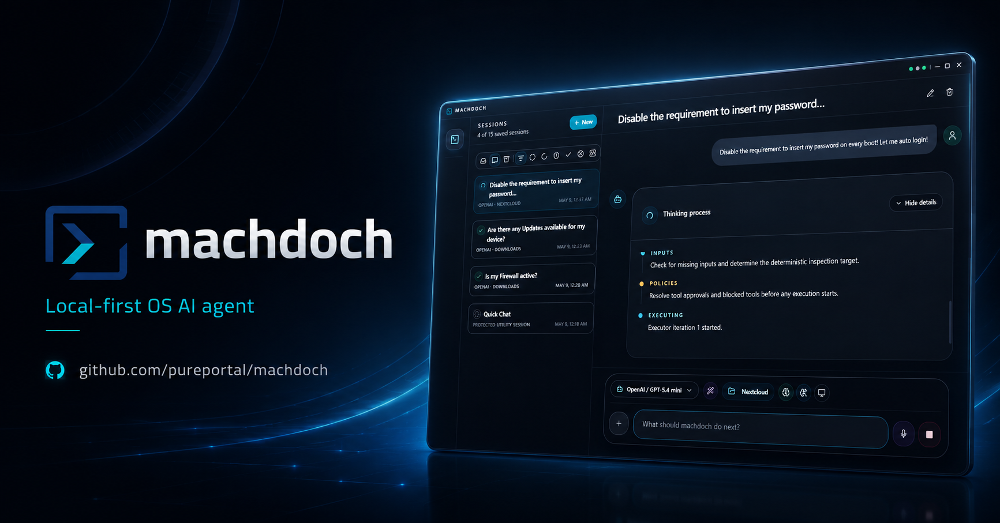

<div align="center">
  
  <h1>machdoch</h1>
  <p><strong>Local-first OS AI agent for desktop and CLI.</strong></p>
  <p>Chat with an agent that can use your workspace, terminal, browser, Git repository, package manager, memory, voice, and desktop UI.</p>
</div>

<p align="center">
  
  
  
</p>

`machdoch` is a pre-alpha desktop app and command-line agent. It has two task modes:

- `ask`: read-only function calls only.
- `machdoch`: full function-call access, including file edits, shell commands, browser control, Git, package tools, memory, and desktop UI control when enabled.

`machdoch` mode is the default.

## Install

Download packages from the [latest release](https://github.com/pureportal/machdoch/releases/latest).

Windows:

```powershell
Invoke-WebRequest -Uri https://github.com/pureportal/machdoch/releases/latest/download/machdoch-windows-x64-setup.exe -OutFile machdoch-setup.exe
Start-Process .\machdoch-setup.exe -Wait
```

Debian/Ubuntu:

```bash
wget -O machdoch.deb https://github.com/pureportal/machdoch/releases/latest/download/machdoch-linux-amd64.deb
sudo apt install ./machdoch.deb
```

Fedora/RHEL/openSUSE:

```bash
wget -O machdoch.rpm https://github.com/pureportal/machdoch/releases/latest/download/machdoch-linux-x86_64.rpm
sudo dnf install ./machdoch.rpm
```

Linux AppImage:

```bash
wget -O machdoch.AppImage https://github.com/pureportal/machdoch/releases/latest/download/machdoch-linux-amd64.AppImage
chmod +x machdoch.AppImage
./machdoch.AppImage
```

Windows SmartScreen can warn for new installers. Verify the download came from this repository, then choose **More info** and **Run anyway**.

## First Run

Configure at least one model provider key:

```bash
machdoch --set-api --provider openai --key YOUR_OPENAI_API_KEY
machdoch --set-api --provider anthropic --key YOUR_ANTHROPIC_API_KEY
machdoch --set-api --provider google --key YOUR_GOOGLE_API_KEY
```

Or open the desktop app and use **Settings > Providers**.

Start the desktop app:

```bash
machdoch
```

Run one terminal task and exit:

```bash
machdoch run "summarize this project"
```

Start terminal chat:

```bash
machdoch --cli
```

## Launch Modes

The packaged binary chooses a launcher mode first, then a task mode.

| Launcher mode | Command | Notes |
| --- | --- | --- |
| Desktop GUI | `machdoch` or `machdoch --ui` | Default when a supported graphical session is available. `--ui` cannot be combined with task args or `--quick`. |
| Interactive CLI | `machdoch --cli` or `machdoch` without GUI support | Keeps a terminal chat open until `/exit`, `/quit`, or Ctrl+C. |
| Single-run CLI | `machdoch run <task>` or `machdoch --quick --task <task>` | Runs one task, prints the result, then exits. |

On Linux, the desktop GUI requires `DISPLAY` or `WAYLAND_DISPLAY`. Without a graphical session, `machdoch` falls back to CLI behavior.

## Configuration Model

`machdoch` resolves settings from three places:

| Scope | File or source | Use it for |
| --- | --- | --- |
| User/global | `user-config.json` | Provider keys, web-search keys, voice, speech-to-text, desktop behavior, global memory, default agent loop limits. |
| Workspace | `.machdoch/config.json` | Workspace defaults, profiles, provider/model/mode defaults, offline behavior, workspace loop limits, compatibility discovery. |
| Environment | `.env` in the workspace and process env | API keys and runtime overrides for automation or temporary runs. |

User config locations:

- Windows: `%APPDATA%/machdoch/user-config.json`
- macOS: `~/Library/Application Support/machdoch/user-config.json`
- Linux: `${XDG_CONFIG_HOME:-~/.config}/machdoch/user-config.json`

Use `MACHDOCH_USER_CONFIG_DIR` to override the user config directory. When running through `sudo`, the inspected user config may be root's config.

### Resolution Order

| Setting | Highest to lowest priority |
| --- | --- |
| Profile | `--profile` or GUI profile selection, then `MACHDOCH_PROFILE`, then `defaultProfile` |
| Mode | CLI/GUI session override, then `MACHDOCH_MODE`, then profile `mode`, then `defaultMode`, then `machdoch` |
| Provider | CLI/GUI provider override, then profile `provider`, then workspace `provider`, then first configured provider, then `unconfigured` |
| Model | CLI/GUI model override, then profile/workspace `model`, then `MACHDOCH_MODEL`, then provider default |
| Offline | `MACHDOCH_OFFLINE=true`, then profile/workspace `offline`, then `false` |
| Agent limits | CLI runtime flags, then env overrides, then profile/workspace `agentLimits`, then user/global limits, then built-in defaults |
| Web search provider | `MACHDOCH_WEB_SEARCH_PROVIDER`, then user/global web-search provider |

Provider defaults:

| Provider | Default model |
| --- | --- |
| `openai` | `gpt-5.5` |
| `anthropic` | `claude-sonnet-4-6` |
| `google` | `gemini-2.5-flash` |

## Workspace Config

Create `.machdoch/config.json` in a workspace:

```json
{
  "defaultProfile": "workspace",
  "defaultMode": "machdoch",
  "provider": "openai",
  "model": "gpt-5.5",
  "offline": false,
  "agentLimits": {
    "infinite": false,
    "executorTurns": 64,
    "autopilotExecutorIterations": 16
  },
  "compatibility": {
    "discoverGithubCustomizations": false
  },
  "profiles": {
    "workspace": {
      "description": "Default workspace profile.",
      "mode": "machdoch"
    },
    "ask-review": {
      "description": "Read-only review profile.",
      "mode": "ask",
      "provider": "anthropic",
      "model": "claude-sonnet-4-6"
    }
  }
}
```

Workspace config keys:

| Key | Values |
| --- | --- |
| `defaultProfile` | Name from `profiles` |
| `defaultMode` | `ask`, `machdoch` |
| `provider` | `openai`, `anthropic`, `google` |
| `model` | Provider model id |
| `offline` | `true`, `false` |
| `agentLimits.infinite` | `true`, `false` |
| `agentLimits.executorTurns` | Integer `1` to `1000` |
| `agentLimits.autopilotExecutorIterations` | Integer `1` to `100` |
| `compatibility.discoverGithubCustomizations` | `true`, `false` |
| `profiles.<name>.description` | Free text |
| `profiles.<name>.mode` | `ask`, `machdoch` |
| `profiles.<name>.provider` | `openai`, `anthropic`, `google` |
| `profiles.<name>.model` | Provider model id |
| `profiles.<name>.offline` | `true`, `false` |
| `profiles.<name>.agentLimits` | Same shape as workspace `agentLimits` |
| `profiles.<name>.compatibility` | Same shape as workspace `compatibility` |

Quick workspace writes:

```bash
machdoch --default-model gpt-5.5
machdoch config set workspace.model gpt-5.5
machdoch config set workspace.provider openai
machdoch config set workspace.mode machdoch
machdoch config set workspace.offline off
```

## User/Global Config

Use `machdoch config set <setting> <value>` for user/global settings and a few workspace writes. Add `--json` for machine-readable output.

Boolean config values accept `on`, `off`, `true`, `false`, `1`, `0`, `yes`, and `no`.

| Setting | Values | Scope | GUI |
| --- | --- | --- | --- |
| `api.openai.key` | API key | User | Settings > Providers |
| `api.anthropic.key` | API key | User | Settings > Providers |
| `api.google.key` | API key | User | Settings > Providers |
| `web-search.provider` | `none`, `perplexity`, `tavily`, `serper` | User | Settings > Web search |
| `web-search.perplexity.key` | API key | User | Settings > Web search |
| `web-search.tavily.key` | API key | User | Settings > Web search |
| `web-search.serper.key` | API key | User | Settings > Web search |
| `voice.provider` | `none`, `openai`, `google` | User | Settings > Voice |
| `speech-to-text.provider` | `none`, `openai`, `google` | User | Settings > Voice |
| `speech-to-text.input-device` | Device id, or `none` | User | Settings > Voice |
| `memory.global` | Boolean | User | Settings > Memory |
| `agent-limits.infinite` | Boolean | User | Settings > Agent |
| `agent-limits.executor-turns` | Integer `1` to `1000` | User | Settings > Agent |
| `agent-limits.autopilot-iterations` | Integer `1` to `100` | User | Settings > Agent |
| `workspace.model` | Provider model id | Workspace | Model picker/session workspace defaults |
| `workspace.provider` | `openai`, `anthropic`, `google` | Workspace | Model picker/session workspace defaults |
| `workspace.mode` | `ask`, `machdoch` | Workspace | Mode picker/session workspace defaults |
| `workspace.offline` | Boolean | Workspace | Runtime snapshot |

Desktop settings are user-scoped:

| Setting | Values | Default |
| --- | --- | --- |
| `desktop.autostart-enabled` | Boolean | `false` |
| `desktop.autostart-minimized` | Boolean | `false` |
| `desktop.autostart-to-tray` | Boolean | `false` |
| `desktop.always-run-as-administrator` | Boolean | `false` |
| `desktop.assistant-bubble-enabled` | Boolean | `true` |
| `desktop.assistant-bubble-hide-when-fullscreen` | Boolean | `true` |
| `desktop.assistant-bubble-temporarily-hide-seconds` | Number `2` to `30` | `6` |
| `desktop.ai-context-max-messages` | Integer `1` to `200` | `60` |
| `desktop.inactive-session-archive-days` | Integer `1` to `365` | `7` |
| `desktop.archived-session-retention-days` | Integer `1` to `365` | `7` |
| `desktop.quick-voice-enabled` | Boolean | `true` |
| `desktop.quick-voice-shortcut` | Non-empty shortcut string | `CommandOrControl+Alt+V` |
| `desktop.quick-voice-silence-seconds` | Number `0.8` to `8` | `1.8` |
| `desktop.quick-voice-max-messages` | Integer `10` to `200` | `50` |

Use the GUI for `desktop.autostart-enabled` when possible because the desktop app also updates the platform autostart registration.

GUI-only shell appearance settings are stored in the desktop shell store:

| Setting | Values |
| --- | --- |
| Theme | `dark`, `light` |
| Density | `comfortable`, `compact` |
| Accent | `sky`, `emerald`, `violet`, `amber` |
| Quick Chat bubble style | `classic`, `glass`, `pulse`, `orbit` |

GUI-only voice reply settings are stored with the desktop shell state:

| Setting | Values |
| --- | --- |
| Replies | Auto-read new replies, or manual only |
| System voice | System default, or a selected system voice |
| Speech rate | `0.8` to `1.4`; default `1.0` |

## Environment Variables

Environment values can come from the process or a workspace `.env` file. Process env wins over `.env`.

| Variable | Purpose |
| --- | --- |
| `OPENAI_API_KEY` | OpenAI model provider key |
| `ANTHROPIC_API_KEY` | Anthropic model provider key |
| `GOOGLE_API_KEY` | Google model provider key |
| `PERPLEXITY_API_KEY` | Perplexity web-search key |
| `TAVILY_API_KEY` | Tavily web-search key |
| `SERPER_API_KEY` | Serper web-search key |
| `MACHDOCH_MODE` | Default task mode: `ask` or `machdoch` |
| `MACHDOCH_MODEL` | Default model id override |
| `MACHDOCH_PROFILE` | Default workspace profile override |
| `MACHDOCH_OFFLINE` | Set to `true` to force offline behavior |
| `MACHDOCH_WEB_SEARCH_PROVIDER` | `none`, `perplexity`, `tavily`, or `serper` |
| `MACHDOCH_EXECUTOR_TURNS` | Executor turn limit |
| `MACHDOCH_AUTOPILOT_ITERATIONS` | Machdoch continuation limit |
| `MACHDOCH_INFINITE` | `true` or `1` disables loop-count limits |
| `MACHDOCH_USER_CONFIG_DIR` | Override the user config directory |
| `MACHDOCH_ENABLE_ADMIN_RELAUNCH_IN_DEV` | `true` or `1` enables Windows administrator relaunch in dev builds |

## Execution Options

| Parameter | Single-run CLI | Interactive CLI | Desktop GUI |
| --- | --- | --- | --- |
| Task text | `machdoch run <task>` or `--quick --task <task>` | Type at `machdoch>` or start with `machdoch "task"` | Composer text |
| Workspace | `--cwd <path>` | `--cwd <path>` | Workspace picker, dropped files/folders, or session workspace |
| Mode | `--mode ask\|machdoch` | `--mode ...`; `/paste ask` or `/paste machdoch` for one pasted task | Mode picker: workspace default, Ask, or Machdoch |
| Profile | `--profile <name>` | `--profile <name>` | Workspace profile picker |
| Provider | `--runtime-provider openai\|anthropic\|google` | Same | Model picker provider |
| Model | `--model <name>` | Same | Model picker model |
| Files/folders as context | Repeat `--context <path>` | Start chat with `--context <path>` | Attach files/folders or drag/drop |
| Images | Repeat `--image <path>` | Start chat with `--image <path>` | Attach images or paste images |
| Conversation context | `--conversation-context-file <path>` | Same, used as initial chat context | Automatic session history/context |
| Session memory | `--session-memory on\|off` | Same, applies to the chat session | Composer memory toggle |
| Global memory | `--global-memory inherit\|on\|off` | Same, applies to the chat session | Composer global memory toggle plus Settings > Memory |
| Agent loop limits | `--executor-turns`, `--autopilot-iterations`, `--infinite` | Same, applies to chat task runs | Settings > Agent |
| Output JSON | `--json` | Not supported | Structured UI output |
| Progress | `--verbose` or `-v` | Built-in task progress | Live thinking/progress panel |
| Cancellation | Ctrl+C during task execution | Ctrl+C during task execution or exit chat | Cancel button |
| Desktop UI control | Not exposed as a direct CLI flag | Not exposed as a direct CLI flag | Composer UI-control toggle when available |
| Quick Voice | Not available | Not available | Quick Voice window and global shortcut |

Image attachments require a configured provider/model with image input support. Supported image extensions are provider-specific.

## CLI Reference

Commands:

| Command | Purpose |
| --- | --- |
| `machdoch --help` | Show CLI help |
| `machdoch --ui` | Force desktop GUI launch |
| `machdoch --cli` | Force terminal mode |
| `machdoch` | Start GUI when available, otherwise terminal chat |
| `machdoch <task>` | Start interactive chat with an initial task |
| `machdoch --task <task>` | Start interactive chat with an explicit initial task |
| `machdoch run <task>` | Run one task and exit |
| `machdoch --quick --task <task>` | Run one task and exit |
| `machdoch --set-api --provider <provider> --key <key>` | Save a model provider key |
| `machdoch --set-global-memory on\|off` | Persist global memory default |
| `machdoch --default-model <model>` | Persist workspace default model |
| `machdoch config` | Print resolved runtime config |
| `machdoch config set <setting> <value>` | Persist a user or workspace setting |
| `machdoch inspect` | List discovered workspace customizations |
| `machdoch tools` | List tool policies and model-facing tool functions |
| `machdoch profiles` | List workspace profiles |

Flags:

| Flag | Values | Applies to |
| --- | --- | --- |
| `--mode` | `ask`, `machdoch` | Run/chat |
| `--profile` | Workspace profile name | Run/chat/config summaries |
| `--runtime-provider` | `openai`, `anthropic`, `google` | Run/chat/config summaries |
| `--model` | Provider model id | Run/chat/config summaries |
| `--cwd` | Path | All commands |
| `--task` | Text | Run/chat |
| `--quick` | Boolean flag | Single-run CLI only |
| `--context` | Path, repeatable | Run/chat |
| `--image` | Image path, repeatable | Run/chat |
| `--conversation-context-file` | JSON file path | Run/chat |
| `--session-memory` | `on`, `off` | Run/chat |
| `--global-memory` | `inherit`, `on`, `off` | Run/chat |
| `--executor-turns` | Positive integer | Run/chat |
| `--autopilot-iterations` | Positive integer | Run/chat |
| `--infinite` | Boolean flag | Run/chat |
| `--json` | Boolean flag | `run`, `config`, `config set`, `inspect`, `tools`, `profiles`, `--set-api`, `--default-model`, `--set-global-memory` |
| `--verbose`, `-v` | Boolean flag | Run/chat task progress; structured progress with `--json` |
| `--set-api` | Boolean flag | Provider key write |
| `--provider` | `openai`, `anthropic`, `google` | Only with `--set-api` |
| `--key` | API key | Only with `--set-api` |
| `--default-model` | Provider model id | Workspace model write |
| `--set-global-memory` | `on`, `off` | User memory setting write |
| `--help`, `-h` | Boolean flag | Help |

Interactive chat commands:

| Command | Purpose |
| --- | --- |
| `/help` | Show interactive help |
| `/paste` | Paste multiline task text; finish with `/end` |
| `/paste ask` | Paste one task and run it in Ask mode |
| `/paste machdoch` | Paste one task and run it in Machdoch mode |
| `/exit`, `/quit` | Leave interactive chat |

## Desktop GUI

The desktop app adds:

- Session history with rename, delete, pin, tags, archive, and branch controls.
- Workspace, profile, provider, model, and mode controls per session.
- Context attachments for files, folders, and images.
- Per-session memory, global memory, and desktop UI-control toggles.
- Settings panels for Providers, Web search, Agent, Appearance, Voice, Memory, and Desktop.
- Quick Voice with global shortcut and optional spoken replies.
- Assistant bubble, popup, tray behavior, sign-in startup behavior, and optional Windows administrator launch.

Desktop task runs are executed through the shared CLI one-shot path. The GUI forwards the selected workspace, task, mode, profile, provider, model, session history/context, and image attachments to the CLI bridge.

On Windows, **Settings > Desktop > Always run as administrator** stores a user preference. Packaged app launches request elevation through the normal UAC prompt. Dev builds do not relaunch unless `MACHDOCH_ENABLE_ADMIN_RELAUNCH_IN_DEV=true` is set.

## Workspace Customization

Native customization files live under `.machdoch/`:

```text
.machdoch/
  config.json
  instructions.md
  instructions/
    security.instructions.md
  prompts/
    debug-build.prompt.md
  skills/
    browser-automation/
      SKILL.md
```

Discovered native files:

- `.machdoch/instructions.md`
- `.machdoch/instructions/**/*.instructions.md`
- `.machdoch/prompts/**/*.prompt.md`
- `.machdoch/skills/**/SKILL.md`

When `compatibility.discoverGithubCustomizations` is enabled, `machdoch` also discovers:

- `.github/copilot-instructions.md`
- `.github/instructions/**/*.instructions.md`
- `.github/prompts/**/*.prompt.md`
- `.github/skills/**/SKILL.md`
- `AGENTS.md`

## Capabilities

| Tool area | What it can do |
| --- | --- |
| Filesystem | Read, search, create, and modify workspace files and folders. |
| Shell | Run shell commands and detached commands under policy control. |
| Network | Fetch URLs and use web search when configured. |
| Browser | Control installed Chromium-based browsers for navigation, screenshots, clicks, typing, and forms. |
| Git | Inspect repository state, diffs, logs, branches, and create local commits. It does not push. |
| Packages | Inspect Node package manifests/workspaces, run declared scripts, check outdated dependencies, audit projects, and install registry packages. |
| Utilities | Generate ids, random values, timestamps, hashes, encodings, JSON validation, URL transforms, version comparisons, regex matches, compact diffs, and sorted unique lines without shell access. |
| Memory | Store session facts and optional cross-session global facts. |
| Desktop UI | In the desktop app, capture screens/windows and use mouse, keyboard, window, and Windows control-handle actions when available. |

For browser automation, install Microsoft Edge or Google Chrome. `machdoch` uses installed Chromium-based browsers through `playwright-core`; it does not download bundled browser binaries.

## Troubleshooting

Inspect resolved runtime config:

```bash
machdoch config
machdoch config --json
```

Inspect workspace customizations:

```bash
machdoch inspect
```

List tool policies:

```bash
machdoch tools
```

List profiles:

```bash
machdoch profiles
```

Common checks:

- Provider appears unconfigured: check `machdoch config`, user config path, `.env`, and process environment.
- Profile does not load: check `.machdoch/config.json` and `machdoch profiles`.
- Web search is hidden: set `web-search.provider` and configure the matching API key.
- Browser automation fails: install Edge or Chrome.
- Images are rejected: select a vision-capable model or remove image attachments.
- GUI does not open on Linux: confirm `DISPLAY` or `WAYLAND_DISPLAY` is set.
