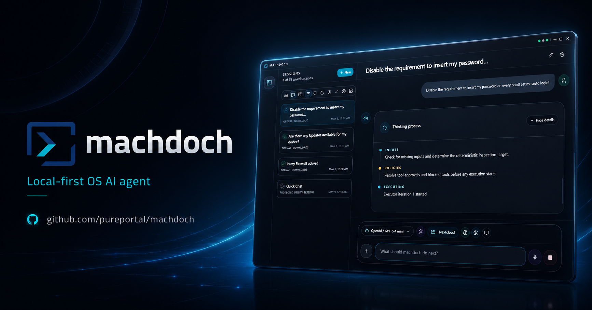

<div align="center">
  
  <h1>Machdoch</h1>
  <p><strong>A local-first AI assistant that can understand a folder, carry out tasks, and automate repeatable work.</strong></p>
  <p>Use the desktop app on Windows or Linux, or work from a terminal when that is more convenient.</p>
</div>

<p align="center">
  
  
  
</p>

> [!WARNING]
> Machdoch is pre-alpha software. Expect bugs and changes between releases. In **Machdoch mode**, the assistant can edit or delete files, run commands, control a browser, and interact with the desktop when enabled. Keep backups, begin with unimportant data, and review results before relying on them.

## Contents

- [What Machdoch is](#what-machdoch-is)
- [Install Machdoch](#install-machdoch)
- [Set up your first session](#set-up-your-first-session)
- [Use Machdoch day to day](#use-machdoch-day-to-day)
- [Explore the main features](#explore-the-main-features)
- [Configure Machdoch](#configure-machdoch)
- [Use the terminal](#use-the-terminal)
- [Privacy, data, and safe use](#privacy-data-and-safe-use)
- [Limitations](#limitations)
- [Troubleshooting](#troubleshooting)
- [Updates and help](#updates-and-help)

## What Machdoch is

Machdoch connects an AI model to practical tools on your computer. Give it a **workspace**—the folder you want to work with—and it can read relevant files, answer questions about them, or complete a task using files, commands, Git, an installed browser, and optional integrations.

“Local-first” means that workspaces, chat history, memory, saved workflows, schedules, settings, and Media Studio assets are primarily kept on your computer. It does **not** mean every task stays offline: cloud model providers, web-search services, remote media providers, websites, and MCP integrations receive the information needed for the requests you make. See [Privacy, data, and safe use](#privacy-data-and-safe-use).

### At a glance

| Area                 | What it is useful for                                                                                 |
| -------------------- | ----------------------------------------------------------------------------------------------------- |
| Chat                 | Ask about a folder, attach files or images, and follow a task while it runs.                          |
| Computer tools       | Read and edit files, run commands, inspect Git, use package tools, and automate an installed browser. |
| RALPH                | Build reusable, visual task flows with decisions, checks, human input, and saved revisions.           |
| Smart Scheduler      | Run a prompt or RALPH flow later, repeatedly, or after a supported event.                             |
| Media Studio         | Generate, edit, organize, inspect, and export images, SVGs, and locally supported video work.         |
| Marketplace and MCP  | Add third-party tools, resources, and prompts through Model Context Protocol servers.                 |
| Quick Chat and voice | Open a small assistant from a global shortcut, dictate requests, and hear replies.                    |
| Mission Control      | Monitor and control sessions from a browser on another device on the same local network.              |

### Choose how much control to give it

Every task uses one of two modes. Machdoch calls an action performed through one of its tools a **function call**.

| Mode         | What Machdoch may do                                                                                                                                                              | Good starting point                                            |
| ------------ | --------------------------------------------------------------------------------------------------------------------------------------------------------------------------------- | -------------------------------------------------------------- |
| **Ask**      | Use only function calls classified as read-only. It can inspect and explain without intentionally changing files or system state.                                                 | Understanding a folder, comparing documents, or planning work. |
| **Machdoch** | Use all available function calls, including file writes, shell commands, browser actions, package changes, and desktop control when enabled. It also attempts to verify its work. | Carrying out a reviewed task or running an automation.         |

Machdoch mode is the built-in default. For a first session, explicitly select **Ask** until you are comfortable with the workspace and provider you chose.

Ask mode is safer, but it is not a privacy mode or a security sandbox. The assistant can still read selected data and send task context to the chosen model provider. A workspace is also the main working folder, not a hard boundary around shell or desktop actions.

## Install Machdoch

### Before you install

Current release packages support:

- 64-bit Windows on Intel/AMD hardware (`x64`)
- 64-bit Linux on Intel/AMD hardware (`amd64`/`x86_64`)

There is currently no published macOS or ARM/ARM64 package. The project does not state a minimum Windows or Linux version, so avoid assuming that an older system is supported until you have tested the current release.

To run normal AI tasks, you also need one of the following:

- an API key for OpenAI, Anthropic, Google, or Langdock; or
- an installed and authenticated Codex CLI, Claude CLI, or Copilot CLI that Machdoch can detect.

A **model provider** is the service that supplies the AI model. An **API key** is a secret credential that lets Machdoch use your account with that service.

Provider accounts, models, search services, and remote media services may require a paid plan or charge per use. Machdoch does not include provider credits.

Optional features have extra requirements:

- Browser automation needs Microsoft Edge or Google Chrome already installed.
- Quick Chat voice input needs a microphone and an OpenAI or Google speech-to-text setup.
- Local Media Studio generation depends on the exact operating system, hardware, model, storage, and runtime. Video work also needs FFmpeg and FFprobe.

Download only from the [latest Machdoch release](https://github.com/pureportal/machdoch/releases/latest).

### Windows

1. Download the recommended [Windows x64 setup file](https://github.com/pureportal/machdoch/releases/latest/download/machdoch-windows-x64-setup.exe). An [MSI installer](https://github.com/pureportal/machdoch/releases/latest/download/machdoch-windows-x64.msi) is also available.
2. Run the downloaded installer and follow its prompts.
3. Open **Machdoch** from your application menu.

Windows SmartScreen may warn about a new or less commonly downloaded installer. Only continue if you confirmed that the file came from the `pureportal/machdoch` GitHub release. If you choose to proceed, select **More info** and then **Run anyway**.

<details>
<summary>Optional PowerShell download</summary>

```powershell
Invoke-WebRequest -Uri https://github.com/pureportal/machdoch/releases/latest/download/machdoch-windows-x64-setup.exe -OutFile machdoch-setup.exe
Start-Process -FilePath .\machdoch-setup.exe -Wait
```

</details>

### Debian or Ubuntu

1. Download the [Debian/Ubuntu package](https://github.com/pureportal/machdoch/releases/latest/download/machdoch-linux-amd64.deb).
2. Open it with your graphical package installer, or install it from a terminal:

```bash
wget -O machdoch.deb https://github.com/pureportal/machdoch/releases/latest/download/machdoch-linux-amd64.deb
sudo apt install ./machdoch.deb
```

3. Open **Machdoch** from your application menu.

### Fedora, RHEL, or another RPM-based Linux distribution

1. Download the [Linux RPM package](https://github.com/pureportal/machdoch/releases/latest/download/machdoch-linux-x86_64.rpm).
2. Open it with your graphical package installer, or use your distribution's RPM package manager. For Fedora and RHEL:

```bash
wget -O machdoch.rpm https://github.com/pureportal/machdoch/releases/latest/download/machdoch-linux-x86_64.rpm
sudo dnf install ./machdoch.rpm
```

3. Open **Machdoch** from your application menu.

### Portable Linux AppImage

Use the AppImage when you do not want to install a system package:

```bash
wget -O machdoch.AppImage https://github.com/pureportal/machdoch/releases/latest/download/machdoch-linux-amd64.AppImage
chmod +x machdoch.AppImage
./machdoch.AppImage
```

Keep the AppImage somewhere you will not accidentally delete it. Run it from that location whenever you want to use Machdoch.

On Linux, the graphical app needs an active desktop session with `DISPLAY` or `WAYLAND_DISPLAY`. Without one, the executable uses terminal behavior instead.

## Set up your first session

The first launch opens **Prepare Machdoch**. You can skip it, but completing these steps avoids most first-run problems.

1. **Choose a workspace.** Pick the folder Machdoch should understand and work in. Use a test folder if you are still learning.
2. **Connect a model provider.** Open **Providers**, choose OpenAI, Anthropic, Google, or Langdock, paste its API key, and wait for the save confirmation. If you already use a supported CLI provider, make sure it is installed and signed in instead. Never paste an API key into a chat message.
3. **Choose a session model.** The model picker shows models from connected providers. Availability depends on the provider account and may change.
4. **Choose Ask mode.** This is the safest way to explore a new workspace. You can switch to Machdoch mode when you want it to make changes.
5. **Leave desktop control at Ask first.** Enable it only for a task that genuinely needs mouse, keyboard, window, or screen interaction and only when the option is available on your system.
6. Select **Finish setup**.

### Model and media providers

| Provider                           | Used for                                                                  | Where to get or manage access                                                                                  |
| ---------------------------------- | ------------------------------------------------------------------------- | -------------------------------------------------------------------------------------------------------------- |
| OpenAI                             | Chat models; optional voice, speech-to-text, and remote image work        | [OpenAI API keys](https://platform.openai.com/api-keys)                                                        |
| Anthropic                          | Chat models                                                               | [Anthropic API keys](https://platform.claude.com/settings/keys)                                                |
| Google                             | Chat models; optional voice and speech-to-text                            | [Google AI Studio](https://aistudio.google.com/app/apikey)                                                     |
| Langdock                           | Chat models available to the Langdock account                             | [Langdock](https://app.langdock.com)                                                                           |
| Quiver                             | Media Studio SVG generation                                               | [Quiver](https://app.quiver.ai)                                                                                |
| Recraft                            | Media Studio SVG generation and vectorization                             | [Recraft API](https://www.recraft.ai/profile/api)                                                              |
| Codex CLI, Claude CLI, Copilot CLI | Delegated model access through an already installed command-line provider | Install and sign in through that provider; Machdoch detects supported executables or can be given their paths. |

Each service has its own terms, privacy policy, model availability, rate limits, and pricing. A saved key confirms access only when the provider accepts a request.

### Try a safe first task

Start a new chat, confirm **Ask** is selected, and send:

> Read this folder and give me a plain-language overview. Point out anything that looks important, but do not change any files.

Check the progress and answer. When you are ready to test action-taking, use a disposable folder, switch to **Machdoch**, and try a small task such as:

> Create a folder named `organized`, copy the text files into it, and then list exactly what you changed. Leave the originals in place.

## Use Machdoch day to day

A reliable everyday workflow is:

1. Start a new chat and choose the workspace **before the first message**. A session's workspace is locked after the conversation begins; create another session to use a different one.
2. Choose the provider, model, mode, and reasoning level. Higher reasoning can take longer and may cost more, depending on the provider.
3. Add only the context the task needs. You can attach files, folders, images, or a saved context pack. Image input requires a model that supports images.
4. State the outcome, boundaries, and checks clearly. For example: “Rename only `.jpg` files, do not overwrite anything, and show the final list.”
5. Follow the live progress. You can cancel a running task, send a follow-up, or choose how new messages should behave while work is running.
6. Review the answer, file-change preview, and affected files. “Verified” means Machdoch attempted a check; it is not a guarantee that the result is correct.

Chat history supports pinning, tags, renaming, archiving, deleting, and branching a conversation. The desktop app also previews workspace files, images, attachments, and observed file changes.

### Example uses

| Goal                                                         | Suggested feature and mode                                          |
| ------------------------------------------------------------ | ------------------------------------------------------------------- |
| Understand unfamiliar documents or a project folder          | Chat in **Ask** mode                                                |
| Compare several files and write a summary into the workspace | Chat in **Machdoch** mode after reviewing the requested output path |
| Organize photos, invoices, or notes using clear rules        | Chat in **Machdoch** mode, starting with copies or a backup         |
| Research a topic and save a source-linked report             | Chat with browser or configured web search                          |
| Repeat a multi-step review with decision points              | A saved **RALPH** flow                                              |
| Run a report every Monday or after a supported event         | **Smart Scheduler**                                                 |
| Generate and review image, SVG, or local video assets        | **Media Studio**                                                    |
| Monitor a long task from a phone or another computer         | **Mission Control** on a trusted local network                      |

## Explore the main features

The desktop navigation contains **Chat**, **RALPH**, **Media Studio**, **Marketplace**, **Smart Scheduler**, **Mission Control**, and **Settings**.

### Chat, files, browser, and computer tools

Depending on mode and configuration, Machdoch can:

- read, search, create, and modify workspace files and folders;
- run shell commands and longer-running detached commands;
- inspect Git status, differences, history, and branches, and create local commits;
- inspect Node package information, run declared scripts, check for outdated packages, audit, and install packages;
- fetch URLs or use Perplexity, Tavily, or Serper search after you configure the matching key in **Settings > Web search**;
- use an installed Microsoft Edge or Google Chrome for navigation, screenshots, clicks, typing, and forms; and
- capture and control desktop windows, mouse, keyboard, and supported Windows controls when desktop control is available and enabled.

Machdoch does not bundle a browser. Web search and browser control are separate: configuring a search provider does not install Edge or Chrome, and having a browser does not configure a search API.

The dedicated Git tools do not push. However, Machdoch mode can run arbitrary shell commands, so a shell command could still push, delete, or perform other consequential actions. Put those boundaries explicitly in the task and review progress.

### RALPH workflows

RALPH is Machdoch's reusable flow builder. A flow can combine prompts, validation steps, decisions, utility work, human questions, interviews, MCP actions, Media Studio work, and a defined end state.

To create a flow:

1. Open **RALPH** and choose a starter flow, create an empty flow, or let the guided interview help draft one.
2. Arrange and connect the steps in the visual editor.
3. Add variables, instructions, checks, decision branches, and human input where needed.
4. Validate the flow, choose whether it belongs to the current workspace or the global library, and save it.
5. Review its model, reasoning, transition limits, and permissions before running it.
6. Follow the run log. Saved revisions can be inspected or restored, and interrupted runs can be resumed when their state allows it.

RALPH flows can contain commands, local paths, credentials, network work, and MCP calls. Read imported or generated flows before running them. A flow that needs a person to answer may pause when run unattended unless that input has an automatic resolution.

### Smart Scheduler

Smart Scheduler runs either a normal prompt or a saved RALPH flow for a chosen workspace. Jobs can use:

- a calendar-style `cron` schedule;
- a repeating interval;
- a one-time delay or exact run time; or
- a supported event, such as a workspace-file, Git, webhook, integration, calendar, clipboard, application, or manually emitted event.

To schedule work:

1. Select the intended workspace and open **Smart Scheduler**.
2. Create a job and choose **Prompt** or **RALPH flow**.
3. Set the schedule or event, model, mode, limits, context, retry behavior, and permissions.
4. Save the job, then use **Run due** or a manual trigger to test it.
5. Check run history for errors, retries, or a task waiting for input.

Scheduling is managed locally. The computer and Machdoch's scheduler service must be running, the workspace must still be accessible, and the machine must be awake. Launch on sign-in can help after a restart, but exact timing is not guaranteed. Review unattended permissions carefully: a scheduled Machdoch or RALPH run can write files, run commands, use the network, and call MCP tools without you watching it.

### Media Studio

Media Studio is a desktop-only visual workspace with five areas:

| Area      | Purpose                                                                                                              |
| --------- | -------------------------------------------------------------------------------------------------------------------- |
| Create    | Generate or edit images, create or vectorize SVGs, run local video generation, and apply supported local transforms. |
| Workflows | Build reusable visual media flows from templates or from scratch.                                                    |
| Library   | Browse, search, filter, tag, and preview assets; build contact sheets, run slideshows, and export.                   |
| Activity  | Inspect current and past runs, warnings, decisions, and records of how assets were made.                             |
| Models    | Inspect hardware and runtime readiness, then manage supported local models and add-ons.                              |

Current remote image generation and editing use OpenAI GPT Image 2. Remote SVG work can use Quiver or Recraft, with optional OpenAI review in supported quality workflows. Local Diffusers can run supported image and video models when the model, hardware, Python runtime, and related tools pass Machdoch's checks.

Media Studio still opens when local generation is unavailable. Use **Models** to inspect the actual computer and follow the displayed remedy. Local model downloads can be very large, local generation can be slow, and support varies by exact hardware and model. FFmpeg and FFprobe are required for video probing and encoding.

Remote media requests can upload prompts and reference media and can incur provider charges. If Machdoch reports that provider acceptance is uncertain, inspect the activity record before retrying: a duplicate request may be charged. Review every model or add-on license and confirm that you have the right to use the source material and generated output.

### Marketplace and MCP integrations

MCP stands for **Model Context Protocol**. An MCP server gives the assistant additional tools, resources, or reusable prompts. The Marketplace can discover registry listings and manage global or workspace installations, including supported remote HTTP servers and local command-based servers. Provider sign-in (OAuth) is available for integrations that support it.

Before enabling an MCP server:

1. Check the publisher, source URL, commands, requested environment variables, and install plan.
2. Decide whether it should be global or limited to one workspace.
3. Add only the credentials it needs, complete OAuth if required, and enable it.
4. Test it with non-sensitive data, then inspect errors or disable it if behavior is unexpected.

Marketplace listings are third-party content, not an endorsement. An MCP server may receive task data, use credentials, contact external systems, read local paths, or start local packages. A local command-based server may also need its own runtime or executable installed.

### Memory, instructions, and context packs

These features help keep recurring work consistent:

| Term             | Meaning                                                                                                                                                                                                                                          |
| ---------------- | ------------------------------------------------------------------------------------------------------------------------------------------------------------------------------------------------------------------------------------------------ |
| Session memory   | Facts saved for the current conversation.                                                                                                                                                                                                        |
| Global memory    | Optional facts that can be reused in later sessions when both global and session memory are enabled. **Settings > Memory** shows every saved global fact and lets you disable global memory; `machdoch memory list` does the same in a terminal. |
| Instruction file | Reusable Markdown guidance stored centrally and applied globally, by workspace tags, or by manual workspace selection. Repository instruction files are not Machdoch instruction sources.                                                        |
| Context pack     | A reusable bundle of instructions, a prompt, attachments, variables, and optional matching rules. Packs can be workspace-specific or global.                                                                                                     |

Keep global memory limited to stable, non-sensitive facts. Instruction files, prompts, context packs, and imported flows can contain private information or unsafe directions. Review them before use.

### Web search, Quick Chat, and voice

Configure Perplexity, Tavily, or Serper under **Settings > Web search** to add search results to tasks.

**Quick Chat** is the small global desktop launcher. Its default shortcut on current Windows and Linux releases is <kbd>Ctrl</kbd>+<kbd>Alt</kbd>+<kbd>V</kbd>; change or disable it under **Settings > Desktop & startup** if it conflicts with another application. Quick Chat can accept voice input, wait for a configurable silence period, and keep a limited short conversation.

Under **Settings > Voice**, choose OpenAI or Google for supported AI voice and speech-to-text features, select an input device, and configure spoken replies. Replies can also use an installed system voice. Grant microphone access only when needed. Audio sent for cloud speech recognition or AI voice is handled by the selected provider.

### Mission Control

Mission Control serves a browser view directly from your computer so another device on the same local network can monitor task streams and send supported session or scheduler commands.

1. Open **Mission Control** and select **Start**.
2. Scan the QR code or open the displayed LAN link on the other device.
3. Keep the link and token private. A successfully paired browser remains authorized until its pairing expires or you revoke it.
4. Select **Stop** when finished, and use **Forget** to revoke paired devices.

> [!CAUTION]
> Mission Control currently uses plain local HTTP rather than encrypted HTTPS (TLS) and listens on the selected local-network port (default `43187`). Use it only on a trusted network. Anyone who obtains the active link/token or an authorized browser session may gain substantial control over Machdoch. A firewall, guest Wi-Fi isolation, or VPN can also prevent the devices from connecting.

### Transfer settings to another computer

Open **Settings > Settings transfer** to move selected global settings without uploading them to a Machdoch cloud service.

For a nearby transfer:

1. On the destination computer, choose **Receive Settings**, select the categories it may receive and the network interface, then choose **Find senders**.
2. On the source computer, choose **Transfer Settings**, select categories and an interface, then choose **Make available**.
3. Select the other computer. Use the QR/manual connection code if local discovery is blocked.
4. Compare the six-digit secure comparison code on both screens and approve only if the codes match.
5. Review the destination preview and approve the replacement.

The nearby connection encrypts transferred content. Discovery still reveals that a Machdoch transfer is available on the local network, so use a trusted network and compare the code carefully.

For an offline handoff, choose **Export Encrypted File**, select categories, and protect the `.machdoch-settings` file with a unique passphrase of at least 12 characters. On the other computer, choose **Import Encrypted File**, enter the passphrase, and review the replacement preview. The passphrase is not saved; store or send it separately from the file.

Selected categories are **replaced, not merged**. Selecting an empty category can clear the matching destination data. API keys and global memory are sensitive and are not selected by default. Sessions, conversation history, per-session memory, workspace-specific bindings and packs, device-specific shortcuts or autostart, and the Media Studio library stay local.

## Configure Machdoch

The desktop **Settings** window is the easiest place to configure the app:

| Settings area     | What you can change                                                                                                                         |
| ----------------- | ------------------------------------------------------------------------------------------------------------------------------------------- |
| Providers         | API keys for chat, media, voice, and speech providers.                                                                                      |
| Workspace         | Default Ask/Machdoch mode and reasoning level for the selected workspace.                                                                   |
| Agent limits      | Limits on how long a task can continue, optional unlimited runs, and a separate model for reviewing work.                                   |
| Memory            | Global-memory status and the complete list of saved global facts.                                                                           |
| Web search        | Search provider and matching credential.                                                                                                    |
| Voice             | AI voice, speech-to-text, microphone, system voice, reply behavior, and speech rate.                                                        |
| MCP servers       | Global and workspace MCP configuration, presets, discovery, registries, and OAuth.                                                          |
| Appearance        | Dark or light theme, comfortable or compact density, accent, and Quick Chat bubble style.                                                   |
| Desktop & startup | Launch on sign-in, tray behavior, Windows elevation, session retention, context size, Quick Chat shortcut, and local cache/session cleanup. |
| Settings transfer | Nearby encrypted transfer and passphrase-encrypted file export/import.                                                                      |

Manage central instruction files in **Instructions** and workspace tags and
manual assignments in **Workspaces**. Instruction files are not part of
Settings transfer.

### Session, workspace, and user settings

- **Session choices** apply to the current chat: workspace, provider, model, mode, reasoning, memory, and desktop control.
- **Workspace defaults** are stored in `.machdoch/config.json` inside the selected workspace. They apply when a session uses **Workspace default**.
- **User settings** apply across workspaces. The main file is:
  - Windows: `%APPDATA%\machdoch\user-config.json`
  - Linux: `${XDG_CONFIG_HOME:-~/.config}/machdoch/user-config.json`
- Other desktop state, including sessions and Media Studio data, is stored in Machdoch's operating-system app-data area.

Because `.machdoch/config.json` is inside the workspace, a sync tool or source-control system may copy it with that folder. It does not normally hold provider API keys, but review it before sharing the workspace.

The app automatically archives an inactive open session after 7 days by default and permanently deletes an archived session after another 7 days by default. Change both periods under **Settings > Desktop & startup > Sessions** if that is not the retention policy you want. That section also controls how many recent messages are sent as AI context; older messages can remain visible in history without being included in a new model request.

### Environment settings for advanced use

Machdoch can read common provider keys from the current process or a `.env` file in the workspace:

| Service    | Environment variable |
| ---------- | -------------------- |
| OpenAI     | `OPENAI_API_KEY`     |
| Anthropic  | `ANTHROPIC_API_KEY`  |
| Google     | `GOOGLE_API_KEY`     |
| Langdock   | `LANGDOCK_API_KEY`   |
| Quiver     | `QUIVERAI_API_KEY`   |
| Recraft    | `RECRAFT_API_KEY`    |
| Perplexity | `PERPLEXITY_API_KEY` |
| Tavily     | `TAVILY_API_KEY`     |
| Serper     | `SERPER_API_KEY`     |

A workspace `.env` is a plain-text file. Do not put credentials in a shared folder or commit that file to version control. Use `machdoch config` to see the effective provider, model, mode, offline status, and setting sources when an environment override is confusing.

The workspace `offline` setting is for model-free inspection and diagnostics, not a local chat model. It disables the live model-driven agent loop. Turn it off to run normal AI tasks.

## Use the terminal

The terminal interface is optional. It is useful for a quick task, keyboard-driven chat, configuration, or repeatable scripts. Visual features such as Media Studio, session-history management, Quick Chat capture, system-voice selection, desktop UI control, Mission Control, appearance, and launch-on-sign-in remain in the desktop app.

Run commands in a terminal where the packaged `machdoch` executable is available. The AppImage accepts the same arguments when invoked as `./machdoch.AppImage`.

### Common commands

| Command                                | What it does                                                      |
| -------------------------------------- | ----------------------------------------------------------------- |
| `machdoch --help`                      | Show the command overview.                                        |
| `machdoch help <command>`              | Show focused help, for example `machdoch help ralph`.             |
| `machdoch --ui`                        | Force the desktop app to open.                                    |
| `machdoch --cli`                       | Start interactive terminal chat.                                  |
| `machdoch run "<task>"`                | Run one task, print the result, and exit.                         |
| `machdoch interview --prompt "<task>"` | Refine a task through guided questions.                           |
| `machdoch config`                      | Show the resolved runtime configuration.                          |
| `machdoch config list`                 | Show every terminal-configurable setting and its source.          |
| `machdoch config edit`                 | Open the arrow-key configuration editor with masked secret entry. |
| `machdoch memory list`                 | Show every saved global-memory fact.                              |
| `machdoch inspect`                     | Show discovered prompts and skills.                               |
| `machdoch tools`                       | Show available tool areas and function calls.                     |

RALPH, Smart Scheduler, instructions, MCP, and delegated-provider synchronization also have terminal commands. Start with `machdoch help ralph`, `machdoch help scheduler`, `machdoch help instructions`, `machdoch help mcp`, or `machdoch help provider-sync` rather than guessing their options.

### Examples

Run a read-only task in the current folder:

```bash
machdoch run "Summarize this folder and identify duplicate-looking files." --mode ask --cwd .
```

Attach two files as context:

```bash
machdoch run "Compare these reports and explain the important differences." --mode ask --context "report-a.txt" --context "report-b.txt"
```

Start a continuing terminal chat:

```bash
machdoch --cli --cwd .
```

Inside terminal chat, use `/help`, `/paste` for multiline input ending with `/end`, and `/exit` or `/quit` to leave.

Inspect and change a workspace default:

```bash
machdoch config get workspace.mode
machdoch config set workspace.mode ask
machdoch config unset workspace.mode
```

Prefer `machdoch config edit` for API keys. A secret passed directly in a command can remain in shell history even though Machdoch redacts keys from configuration output.

<details>
<summary>Terminal and scripting notes</summary>

- On a graphical computer, plain `machdoch` opens the desktop app. Use `machdoch --cli` for terminal chat or `machdoch run` for one task.
- Interactive chat and `config edit` require an interactive terminal. Scripts should use `run`, `config get`, `config set`, or `config unset`.
- Repeat `--context <path>` or `--image <path>` to add inputs. Image support depends on the selected model.
- Add `--json` to supported non-interactive commands for machine-readable output. JSON errors go to standard error.
- Exit code `0` means success, `1` a runtime failure, `2` invalid usage, and `130` cancellation.
- Set `NO_COLOR` or `FORCE_COLOR=0` to disable terminal color; use `FORCE_COLOR=1` only when the receiving tool supports it.
- Quote paths containing spaces. Native Windows and Linux paths are accepted.

</details>

## Privacy, data, and safe use

### What stays local and what can leave the computer

| Data or action                                                   | Normal handling                                                                                                                                                                           |
| ---------------------------------------------------------------- | ----------------------------------------------------------------------------------------------------------------------------------------------------------------------------------------- |
| Workspace files and tool results                                 | Files stay on the computer unless a task, provider, website, MCP server, or command sends their contents elsewhere. Relevant excerpts and tool results can be included in model requests. |
| Chat history, sessions, memories, flows, schedules, and settings | Stored locally. Selected context can be sent to a model or integration when used in a task.                                                                                               |
| Media Studio library and local models                            | Stored in the local app-data area. Remote generation sends the prompt and any confirmed reference media to the selected provider.                                                         |
| API and search keys                                              | Saved in the local user configuration or read from the environment, then used for the matching service.                                                                                   |
| Browser and web search                                           | Websites and search providers receive normal request, account, network, and browser data.                                                                                                 |
| Voice                                                            | Cloud speech or AI voice sends audio or text to OpenAI or Google. A system voice uses the operating system's speech service, whose behavior depends on the OS and installed voice.        |
| Nearby settings transfer                                         | Selected settings are sent directly over an encrypted local connection after both computers confirm the comparison code. Nothing is uploaded by this feature.                             |
| Mission Control                                                  | Served directly over the local network. The current connection uses plain HTTP rather than encrypted HTTPS, so use a trusted network and protect the token.                               |

### Credentials are not encrypted at rest

Saved provider and search credentials are stored as plain text in `user-config.json`, protected by normal operating-system account and file permissions. They are not stored in an operating-system keychain or encrypted vault. Machdoch masks them in its Settings fields and terminal configuration output, but anyone or any malware that can read your account's files may be able to read the keys.

Protect the operating-system account, do not share the config file, rotate a key if it may have been exposed, and use a unique strong passphrase for an encrypted settings export. After import, transferred keys are again stored using the normal local configuration protection.

Chat history, memory, flows, schedules, and Media Studio data are also ordinary local app data rather than a secret vault. Use operating-system account protection and disk encryption if the computer contains sensitive work.

### Practical safety rules

- Back up important folders and use version control where appropriate before running Machdoch mode.
- Give each task the smallest useful workspace, context, mode, and integration set.
- Keep global memory free of passwords, personal secrets, and confidential client data. Review all entries in **Settings > Memory** or with `machdoch memory list`.
- Treat prompts, attachments, web pages, MCP content, imported instructions, context packs, and RALPH flows as untrusted input when they come from someone else.
- Do not enable **Always run as administrator** on Windows unless a specific task requires it. Elevation broadens what commands and UI actions can affect and causes normal UAC prompts.
- Stop Mission Control after use, revoke pairings you no longer recognize, and never post its link or token.
- Review unattended scheduler and RALPH permissions. Set finite turn and transition limits unless you have a clear reason not to.
- Confirm provider cost and data policies before enabling higher reasoning, voice, web search, remote media, or large repeated jobs.
- Keep independent copies of important media. A library entry, run log, or generated preview is not a backup strategy.

## Limitations

- Machdoch is pre-alpha. Features, settings, data formats, provider models, and compatibility can change, and data loss is possible.
- Published installers currently cover Windows x64 and Linux x64 only. There is no published macOS or ARM package.
- Normal chat requires an available cloud API provider or an authenticated supported CLI provider. Offline mode does not provide a local language model and blocks model-driven tasks.
- AI models can misunderstand instructions, overlook files, invent facts, or incorrectly claim success. Tool verification reduces risk but does not eliminate it.
- Ask mode limits function calls to read-only operations but does not prevent the selected provider from receiving task context.
- A workspace is not an operating-system sandbox. Shell commands, browser actions, MCP servers, desktop control, and elevated execution can affect data beyond it.
- Browser automation needs installed Edge or Chrome and may fail on sites with anti-automation checks, captchas, changing layouts, or required human approval.
- Desktop control is available only on supported environments and can manipulate the visible session. Keep sensitive windows closed.
- Image attachments require a model that supports image input. Provider-specific formats, limits, and model availability apply.
- Local media support varies by hardware, operating system, runtime, model, and available disk space. Passing a readiness check is not a guarantee that every workload will succeed.
- Scheduled tasks do not run while the computer or scheduler service is unavailable, and event-based jobs require a matching event source.
- Mission Control is intended for the same trusted local network; it is not a cloud remote-access service.
- Settings transfer moves selected global settings, not a complete backup of sessions, workspaces, or Media Studio.

## Troubleshooting

| Problem                                                   | What to check                                                                                                                                                                                                                       |
| --------------------------------------------------------- | ----------------------------------------------------------------------------------------------------------------------------------------------------------------------------------------------------------------------------------- |
| Windows blocks the installer                              | Confirm the download is from the official GitHub release. If you trust it, use **More info > Run anyway**. Do not bypass a warning for a file from another source.                                                                  |
| The Linux app window does not open                        | Confirm a graphical desktop is active and `DISPLAY` or `WAYLAND_DISPLAY` is set. In a headless session, use terminal mode.                                                                                                          |
| “Provider unconfigured” or no usable model                | Open **Settings > Providers**, save a chat-provider key, and confirm the account has model access and billing/rate-limit capacity. For a delegated CLI, confirm it is installed, on `PATH` or explicitly configured, and signed in. |
| A task says offline mode is enabled                       | Disable the workspace offline override, or run `machdoch config set workspace.offline off`. Use `machdoch config` to find an environment override.                                                                                  |
| Browser automation cannot start                           | Install Microsoft Edge or Google Chrome, restart Machdoch, and check firewall or security software. Machdoch does not download a browser for you.                                                                                   |
| Web search is unavailable                                 | Choose Perplexity, Tavily, or Serper in **Settings > Web search** and save the matching key.                                                                                                                                        |
| An image attachment is rejected                           | Choose a model with image-input support, use a supported image, reduce its size if necessary, or remove it.                                                                                                                         |
| Quick Chat or voice does not work                         | Check **Settings > Desktop & startup** and **Settings > Voice**, microphone permission, input device, provider key, and whether another app owns the shortcut.                                                                      |
| A scheduled job did not run                               | Confirm the job is enabled, the workspace still exists, the computer is awake, the scheduler service is active, and provider/integration credentials still work. Inspect the job's run history.                                     |
| A RALPH run is paused                                     | Inspect the active step and log. It may be waiting for human input, a missing variable, an MCP credential, or a failed validator.                                                                                                   |
| An MCP server fails                                       | Check that it is enabled in the correct scope, OAuth or credentials are current, local commands/runtimes exist, and the server's paths and URLs are valid. Disable an unfamiliar server.                                            |
| Local media generation is unavailable                     | Open **Media Studio > Models** and review hardware, runtime, storage, model, FFmpeg, and FFprobe diagnostics. Follow the displayed preflight remedy.                                                                                |
| A nearby settings transfer cannot find the other computer | Put both on the same trusted network, select the correct interfaces, check firewall/multicast restrictions, and use the QR/manual connection path. Both installations may need to be updated.                                       |
| Mission Control cannot connect                            | Start sharing, use the LAN rather than loopback link on the other device, keep both devices on the same network, and allow the selected port through the firewall.                                                                  |
| Older chat context seems missing                          | The session can still display older messages while the AI context cap includes only the most recent messages. Adjust it under **Settings > Desktop & startup > Sessions**.                                                          |
| Old sessions disappeared                                  | Check the inactive-archive and archived-deletion periods in **Settings > Desktop & startup**. Archived sessions are permanently deleted after the configured retention period.                                                      |
| `machdoch` is not recognized in a terminal                | Restart the terminal after installation. If it still is not on `PATH`, use the desktop app or invoke the installed executable/AppImage by its full path.                                                                            |

Useful diagnostics:

```bash
machdoch config
machdoch config --json
machdoch inspect
machdoch tools
machdoch --help
```

When reporting a problem, include the Machdoch version shown in the app, operating system, package type, exact steps, and the redacted error. Remove API keys, tokens, private prompts, personal paths, and confidential file content first.

## Updates and help

Machdoch releases are distributed through GitHub. Before updating a pre-alpha installation, back up important work and use **Settings > Settings transfer > Export Encrypted File** for the supported global settings you want to preserve. Then read the release notes and install the new package for your platform.

- [Latest release and downloads](https://github.com/pureportal/machdoch/releases/latest)
- [All releases and notes](https://github.com/pureportal/machdoch/releases)
- [Source repository](https://github.com/pureportal/machdoch)
- [Report a problem](https://github.com/pureportal/machdoch/issues)

Third-party model providers, MCP servers, websites, search services, media models, and generated or imported assets remain subject to their own terms, pricing, privacy policies, and licenses.
