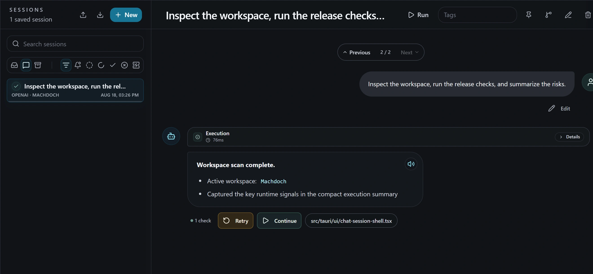
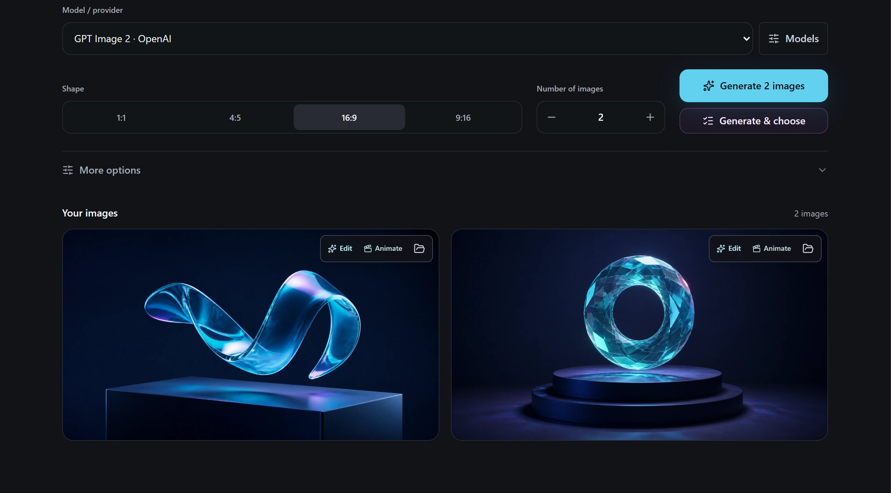

<div align="center">
  
  <h1>Machdoch</h1>
  <p><strong>An AI assistant for working with files, completing tasks, and automating repeatable work.</strong></p>
  <p>Use it on a Windows or Linux desktop, or from a terminal.</p>
</div>

<p align="center">
  
  
  
  
</p>

Machdoch works in a folder you choose, called a **workspace**. Ask it to explain what is there, attach files for context, or give it a task that uses files, commands, Git, or an installed browser. Chat history, settings, workflows, and media assets are stored locally. Requests to cloud models and connected services send the context needed for those requests.

> [!WARNING]
> Machdoch is under active development. **Machdoch mode** can change or delete files and run commands, including outside the selected workspace. Start with **Ask** mode and a folder you can safely experiment with. Back up important work and review results.

## Download and install

Get the latest package for your system from [Machdoch releases](https://github.com/pureportal/machdoch/releases/latest):

| System | Package |
| --- | --- |
| Windows x64 | [Setup installer](https://github.com/pureportal/machdoch/releases/latest/download/machdoch-windows-x64-setup.exe) or [MSI](https://github.com/pureportal/machdoch/releases/latest/download/machdoch-windows-x64.msi) |
| Debian/Ubuntu x64 | [`.deb`](https://github.com/pureportal/machdoch/releases/latest/download/machdoch-linux-amd64.deb) |
| Debian/Ubuntu ARM64 | [`.deb`](https://github.com/pureportal/machdoch/releases/latest/download/machdoch-linux-arm64.deb) |
| Fedora/RHEL x64 | [`.rpm`](https://github.com/pureportal/machdoch/releases/latest/download/machdoch-linux-x86_64.rpm) |
| Portable Linux x64 | [AppImage](https://github.com/pureportal/machdoch/releases/latest/download/machdoch-linux-amd64.AppImage) |

Run the Windows installer or open a Linux package with your package manager. From a terminal, use `sudo apt install ./machdoch-linux-amd64.deb` (replace `amd64` with `arm64` on ARM) or `sudo dnf install ./machdoch-linux-x86_64.rpm`. Make an AppImage executable with `chmod +x machdoch-linux-amd64.AppImage`, then run it. Linux desktop use requires a graphical session.

There is no published macOS package. AI tasks need either a key for a supported model provider or an installed, signed-in **Codex CLI**, **Claude CLI**, or **Copilot CLI**. Provider usage may cost money; Machdoch does not include model credits.

## Your first session

On first launch, **Prepare Machdoch** walks through the starting choices:

1. Choose a workspace. Use a test folder while learning. A chat's workspace stays fixed once the conversation starts; open a new chat to work in another folder.
2. Open **Providers** and add an API key for [OpenAI](https://platform.openai.com/api-keys), [Anthropic](https://platform.claude.com/settings/keys), [Google](https://aistudio.google.com/app/apikey), or [Langdock](https://app.langdock.com). If you use a supported CLI provider, install it and sign in instead. Never put an API key in a chat message.
3. Choose a session model and select **Ask** as the session mode. Leave desktop control at **Ask first** unless the task needs it.
4. Select **Finish setup** and start a chat.

Try this in **Ask** mode:

> Give me a plain-language overview of this folder. Point out important files and anything that needs attention.

When you want Machdoch to act, switch to **Machdoch** mode and describe the outcome and limits clearly. For example: “Copy the text files into a new `organized` folder, leave the originals in place, and list what you changed.”

| Mode | What it can do |
| --- | --- |
| **Ask** | Inspect and answer using read-only tool calls. |
| **Machdoch** | Use available tools to make changes, run commands, and complete a task. |

Machdoch mode is the workspace default unless you change it. Ask mode still sends relevant context to the selected model provider and is not a filesystem sandbox.

## Working in Machdoch

Choose the workspace, provider, model, and mode before sending a task. Attach files, folders, or images when they help; image input needs a model that supports it. While a task runs, you can follow its progress, cancel it, or send a follow-up. Review the answer and any file changes before using the result.



Machdoch can also:

- **Build repeatable flows with RALPH.** Connect prompts, decisions, checks, and human input, then save and run the flow again.
- **Schedule work.** Run a prompt or RALPH flow once, on a repeating schedule, or after a supported event. The computer and scheduler must be running when a job is due.
- **Create media.** Use **Media Studio** for image and SVG work, visual workflows, an asset library, and supported local video generation. Remote media services need their own credentials; local generation depends on the model, runtime, hardware, and disk space.
- **Connect more tools.** Add Model Context Protocol (MCP) servers in **Settings > MCP servers**. Review an integration before giving it access to your data or credentials.
- **Reuse context.** Keep workspace or global memory, instruction files, and context packs for recurring work.
- **Use Quick Chat and voice.** Open the small desktop assistant with <kbd>Ctrl</kbd>+<kbd>Alt</kbd>+<kbd>V</kbd> by default. Set up speech input and spoken replies in **Settings > Voice**.
- **Reach other computers.** Connect hosts to a self-hosted **Fleet Manager** for remote access. See the [Fleet Manager guide](apps/fleet-manager/README.md) for setup.



For web tasks, Machdoch can use an installed Edge or Chrome browser. Web search is separate: configure Perplexity, Tavily, or Serper under **Settings > Web search** if you want search results in tasks.

## Use the terminal

The installed `machdoch` command can run a single task or open an interactive chat. On a graphical computer, plain `machdoch` opens the desktop app.

```bash
machdoch --cli --cwd .
machdoch run "Summarize this folder." --mode ask --cwd .
machdoch --help
```

Use `machdoch config edit` to set credentials in the terminal without putting them in shell history. `machdoch help <command>` shows options for commands such as `ralph`, `scheduler`, `mcp`, and `fleet`. The AppImage accepts the same arguments when invoked as `./machdoch-linux-amd64.AppImage`.

## Privacy and safe use

Machdoch keeps its sessions, memory, settings, flows, and media library on your computer. A model provider may receive prompts, relevant file excerpts, attachments, and tool results. Websites, search services, MCP servers, and remote media providers receive data when you use them. Check each provider's privacy and pricing terms before sending sensitive material.

Saved API keys are stored as plain text in the local user configuration, protected by your operating-system account permissions. They are masked in the app, but they are **not encrypted at rest**. Protect your computer account, avoid sharing the configuration file, and rotate a key if it may have been exposed.

A workspace is a working folder, not a security boundary. Before using Machdoch mode or unattended schedules on important data, make a backup, set clear limits in the task, and review what changed. AI answers and reported checks can be wrong.

## Help and updates

| Problem | What to check |
| --- | --- |
| No model is available | Add a key in **Settings > Providers**, or confirm a supported CLI is installed and signed in. Check the provider account's model access. |
| Browser automation will not start | Install Edge or Chrome, then restart Machdoch. |
| An image attachment is rejected | Select a model with image input and check the image format and size. |
| A scheduled job did not run | Check that the job is enabled, its workspace exists, and the computer and scheduler were running. Review the job history. |
| Local media generation is unavailable | Check model and runtime details in **Media Studio** and follow any readiness guidance. |

Use `machdoch --help` or `machdoch config` for terminal diagnostics. For updates, see [all releases](https://github.com/pureportal/machdoch/releases). To report a problem, open a [GitHub issue](https://github.com/pureportal/machdoch/issues) with the app version, operating system, steps to reproduce, and the error message. Remove keys and private data first.
