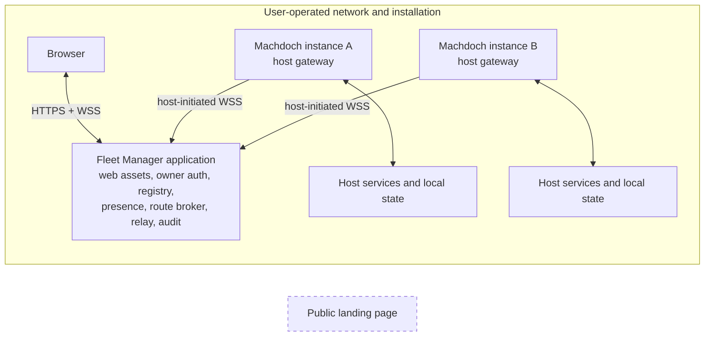

# Fleet Manager Product Architecture

Status: Proposed end-state
Date: 2026-08-28

## 1. Decision

Machdoch remote control is delivered through a new, separately deployable Fleet Manager application. The repository and product contain three distinct applications:

1. `apps/client`: the Machdoch CLI and Tauri desktop client. The desktop backend or foreground CLI Fleet service is the authoritative host for remote operations.
2. `apps/landing`: the existing public landing page. It has no Fleet Manager, registry, authentication, or relay responsibility.
3. `apps/fleet-manager`: a self-hosted service and browser application installed and operated by an individual Machdoch user.

There is no Machdoch-operated, global, shared, or multi-tenant Fleet Manager. Fleet Manager installations do not federate, depend on a Machdoch account service, or publish instances to a common registry. Each installation has its own owner identity, instance registry, trust keys, data store, URL, TLS configuration, and operating policy.

The network requirement is ordinary IP connectivity to the user's Fleet Manager. A browser and each managed Machdoch instance must be able to reach that installation through an operator-provided route. The route can be a directly connected LAN, a routed private network, a router between private subnets, a site network, port forwarding chosen by the operator, or a private overlay/VPN. VPN software, VPN discovery, and a VPN provider are not architectural dependencies.

The canonical connection path is:

`browser -> user's Fleet Manager -> selected Machdoch instance`

Each Machdoch instance initiates and maintains its connection to Fleet Manager. Browsers never need a routable connection to every host, and managed hosts do not expose a general inbound command server. Fleet Manager authenticates the owner, discovers instances from its installation-local registry, creates short-lived routes, and relays the selected connection. The selected Machdoch host remains authoritative for all product data and execution.

Remote control means parity for browser-meaningful Machdoch product capabilities through the shared React product UI. It does not mean streaming the Tauri window or exposing arbitrary Tauri IPC. Desktop-shell functions such as tray management, global shortcuts, moving local windows, and host-native dialogs either receive an explicit browser equivalent or are absent from the remote surface.

Fleet management in this specification means:

- enrolling, naming, listing, observing, connecting to, and revoking Machdoch instances;
- reporting reachability, compatibility, capabilities, and coarse activity;
- opening the shared Machdoch UI against one selected instance;
- securely routing that UI's typed operations and streams.

It does not mean centrally executing tasks, copying provider credentials, synchronizing settings between instances, deploying Machdoch updates, managing the host operating system, or broadcasting fleet-wide commands. Those behaviors do not exist in the repository and are not requirements supplied for this design.

## 2. Repository baseline

The target design is a refactor around working local capabilities, not a new execution backend.

| Current repository fact                                                                                                                                                                                                                                                                                                                          | Consequence for the solution                                                                                                                                                                                                                                                                            |
| ------------------------------------------------------------------------------------------------------------------------------------------------------------------------------------------------------------------------------------------------------------------------------------------------------------------------------------------------ | ------------------------------------------------------------------------------------------------------------------------------------------------------------------------------------------------------------------------------------------------------------------------------------------------------- |
| The pnpm workspace includes [client](../apps/client/package.json), [Fleet Manager](../apps/fleet-manager/package.json), and [landing](../apps/landing/package.json).                                                                                                                                                                             | The Fleet Manager application participates in root build, check, lint, test, typecheck, and runnable workspace workflows.                                                                                                                                                                               |
| [tauri.conf.json](../apps/client/src-tauri/tauri.conf.json) packages the Vite output through Tauri's `frontendDist`; [vite.ui.config.ts](../apps/client/vite.ui.config.ts) binds development and preview servers to loopback by default.                                                                                                         | The full product UI is not currently served as a production website. Fleet Manager needs its own production web entry and asset server.                                                                                                                                                                 |
| [preview/app.tsx](../apps/client/src/tauri/ui/preview/app.tsx) loads the real `ChatSession` tree.                                                                                                                                                                                                                                                | The React product surface is browser-renderable and should be shared. A second reduced remote UI is unnecessary.                                                                                                                                                                                        |
| [runtime.ts](../apps/client/src/tauri/ui/runtime.ts) imports preview fixtures, invokes Tauri directly, and returns mock or empty results outside Tauri. Twenty-nine non-test UI files currently import `@tauri-apps` directly.                                                                                                                   | Browser rendering is not remote operation. Product components must depend on injected host and platform contracts; production Fleet Manager builds must not contain preview behavior.                                                                                                                   |
| [lib.rs](../apps/client/src-tauri/src/lib.rs) registers 179 Tauri command handlers and owns managers for tasks, settings, files, Git, PTYs, Workspace Run, media, UI control, and native shell behavior.                                                                                                                                         | The command list is not a network API. Tauri commands and remote handlers need common host-service entry points with explicit remote eligibility. A generic `invoke(command, payload)` tunnel is prohibited.                                                                                            |
| [fleet_control](../apps/client/src-tauri/src/fleet_control.rs) owns bounded product snapshots and durable Fleet command delivery. [fleet/gateway.rs](../apps/client/src-tauri/src/fleet/gateway.rs) maintains the outbound manager connection.                                                                                                   | Fleet Manager is the only remote-management transport. Managed hosts do not expose an inbound command listener.                                                                                                                                                                                         |
| [shell_state.rs](../apps/client/src-tauri/src/shell_state.rs) provides atomic revisioned compare-and-swap persistence with tombstones. [chat-session.model.ts](../apps/client/src/tauri/ui/chat-session.model.ts) stores sessions, messages, queued prompts, drafts, and active selection in one shell document.                                 | Revision and conflict concepts are reusable, but shared session authority currently remains substantially in React. Durable domain state, active execution coordination, and final result persistence must move behind a host service. Client navigation and unsent drafts must not be shared globally. |
| Desktop task execution is supervised in Rust, while [use-chat-session-controller.ts](../apps/client/src/tauri/ui/chat-session/_helpers/use-chat-session-controller.ts) reconstructs, routes, finalizes, and persists substantial chat lifecycle state.                                                                                           | A remote task must remain correct with no WebView open and after a browser disconnect. The host, not whichever UI submitted the task, must coordinate the session and persist its outcome.                                                                                                              |
| [workspace_tools/files.rs](../apps/client/src-tauri/src/workspace_tools/files.rs) already validates relative paths, contains canonical paths, blocks symlink escape, bounds reads, and uses revision-aware atomic writes. [workspace_tools/terminal.rs](../apps/client/src-tauri/src/workspace_tools/terminal.rs) bounds PTY sessions and input. | Remote operations must call these implementations, but may not accept client-supplied absolute workspace roots. The remote boundary uses host-issued workspace and object identifiers.                                                                                                                  |
| [Workspace Run](workspace-run.md) is already the Rust-owned authority for saved run configurations, declared ports and URLs, process generations, health, restart policy, logs, and process trees.                                                                                                                                               | Remote run control and development exposure must use that manager rather than create another process supervisor or scan arbitrary ports.                                                                                                                                                                |
| Settings transfer implements local mDNS discovery, manual/QR rendezvous, Noise XX, expiry, confirmation, and bounded encrypted records.                                                                                                                                                                                                          | Its security concepts and reviewed primitives are useful references. Its short-lived peer-transfer protocol and link-local discovery are not reused as the long-lived Fleet protocol.                                                                                                                   |
| The Rust client already depends on Axum, Tokio, Rusqlite, Argon2, Noise, `xcap`, and `enigo` in [Cargo.toml](../apps/client/src-tauri/Cargo.toml).                                                                                                                                                                                               | The repository contains precedents for a Rust service, transactional local stores, password hashing, encrypted transports, and native capture/input. It does not yet contain a reusable server crate, browser-compatible secure channel, or Fleet authentication system.                                |

## 3. End-state topology



The browser opens the configured Fleet Manager origin. The dashboard route lists that installation's registry. Selecting an instance opens `/instances/{instanceId}`, where the Fleet Manager browser application renders the shared Machdoch product surface with a remote runtime adapter.

The host gateway runs in either the Machdoch desktop backend or `machdoch fleet service`; a graphical client is not required. It connects to the configured Fleet Manager URL. The connection is direct at the IP layer whenever the underlying network provides a direct route. A VPN changes only how packets are routed; it does not change enrollment, discovery, authentication, protocol, or UI behavior.

No diagram edge leads to a Machdoch global service. The landing page remains independent and cannot enumerate, authenticate to, or route any Fleet Manager installation.

## 4. Authority and responsibility boundaries

### 4.1 Fleet Manager application

Fleet Manager is one deployable application containing a backend service and browser assets. It is responsible for:

- installation-local owner authentication and browser sessions;
- its stable installation identity and signing keys;
- one-time instance enrollment grants;
- the durable instance registry and revocation records;
- presence, last-seen time, version, capability manifest, and coarse activity;
- short-lived connection grants and route lifecycle;
- multiplexing bounded control, event, and binary streams between a browser and a host;
- Fleet Manager configuration, health, local audit records, and operational limits;
- optional isolated routing of explicitly approved Workspace Run development exposures.

Fleet Manager does not:

- execute Machdoch tasks, shells, Git, media, Ralph, scheduler, MCP, or Workspace Run operations itself;
- map workspace IDs to filesystem paths;
- persist prompts, messages, file contents, terminal bytes, run logs, media contents, provider keys, environment values, or host settings;
- become authoritative for a host operation if the host disconnects;
- discover instances through a public directory, global account, or network scan;
- permit one Fleet Manager installation to route through another.

### 4.2 Machdoch host gateway

The gateway is part of the Machdoch client backend. It is responsible for:

- creating and protecting a stable instance identity;
- enrolling with exactly one Fleet Manager installation at a time;
- maintaining the host-initiated connection and heartbeat;
- authenticating Fleet Manager grants and remote browser channels;
- negotiating protocol version and an exact capability manifest;
- applying host-configured remote capability policy;
- validating every request at the host boundary;
- mapping opaque workspace and object IDs to local resources;
- dispatching typed requests to the same host services used by Tauri;
- publishing snapshots, ordered events, progress, and bounded streams;
- retaining resumable state for configured intervals;
- recording host-side security audit events;
- immediately enforcing manager revocation, local disablement, and policy changes.

It never sends filesystem roots, saved secrets, process environment values, or OS credentials merely to support discovery.

### 4.3 Host domain services

Host services are the sole authority for:

- chat sessions, messages, queued prompts, task lifecycle, task results, and retention;
- provider execution and AI configuration;
- registered workspaces, files, Git, attachments, and file-change data;
- terminals and writer ownership;
- Workspace Run configuration, processes, generations, health, output, and restart state;
- scheduler, Ralph, MCP, instruction, memory, media, voice, and settings operations;
- native operating-system integration.

Tauri command handlers and gateway handlers call these services. Neither handler type owns business state.

### 4.4 Browser application

The browser application is responsible for:

- the fleet dashboard and selected-instance navigation;
- rendering shared product components;
- owner login and logout;
- the remote protocol adapter and stream consumers;
- browser-local selection, layout, dialogs, scroll positions, appearance, and unsent drafts;
- browser file selection, microphone capture, clipboard access, notifications, and downloads;
- presenting connection loss, incompatibility, conflict, and capability unavailability at the point of action.

The browser does not fabricate production data when a host operation is unavailable.

### 4.5 Desktop client and landing page

The desktop client continues to render the same product components through a local Tauri adapter. It does not route local operations through Fleet Manager when the local host is available. Local operation must remain available when Fleet Manager is disabled or unreachable.

The landing page remains a static public application and contains no Fleet Manager runtime, installation lookup, or remote-management entry.

## 5. Repository and module structure

The target repository layout is:

```text
apps/
  client/                 Machdoch CLI, Tauri shell, host services, host gateway
  fleet-manager/          Self-hosted service, dashboard entry, remote product entry
  landing/                Public landing page
packages/
  product-ui/             Tauri-independent React product components and view models
  host-contracts/         Versioned schemas and generated TypeScript/Rust contracts
```

The exact package names may change, but the dependency direction is mandatory:

```text
product UI -> host/platform interfaces
desktop entry -> product UI + Tauri adapter
Fleet Manager web entry -> product UI + remote adapter
Tauri handlers and gateway handlers -> host services
generated adapters -> versioned contract schemas
```

The shared UI package cannot import Tauri, Fleet Manager server code, preview fixtures, or host filesystem APIs. Platform-specific features are supplied through a separate `PlatformServices` contract. Host-backed product behavior is supplied through focused `HostRuntime` contracts.

The versioned contract source must generate or validate both TypeScript and Rust shapes. The existing runtime-config generator is a repository precedent, but its schema covers runtime configuration rather than the remote API. Hand-maintained duplicate DTOs are not an acceptable protocol boundary.

Fleet Manager's deployable artifact is a Next.js application with a custom Node.js server for WebSocket upgrades and a local SQLite store. Distribution packaging does not change the authority, protocol, or storage boundaries in this specification.

## 6. Deployment and configuration

### 6.1 Fleet Manager installation

Fleet Manager reads one versioned `fleet-manager.json` document whose path is supplied explicitly to the process or service definition. Every installation has:

- a generated immutable `managerId`;
- a persistent signing identity distinct from its TLS certificate;
- one installation-local owner account;
- a versioned configuration document;
- a local durable database;
- an operator-selected external HTTPS origin;
- a configured listen address and port;
- either direct TLS certificate configuration or an explicitly trusted reverse proxy;
- optional development-preview origin configuration.

Fleet Manager must not start normal network service with an invalid or incomplete security configuration. It must report configuration validation failures locally and fail closed.

The logical configuration contract is:

| Field                            | Requirement                                                                                                                                                                                                                                     |
| -------------------------------- | ----------------------------------------------------------------------------------------------------------------------------------------------------------------------------------------------------------------------------------------------- |
| `schemaVersion`                  | Required. Unknown versions are rejected rather than guessed.                                                                                                                                                                                    |
| `externalBaseUrl`                | Required absolute HTTPS origin used for redirects, cookies, WebSocket endpoints, enrollment bundles, and route links. It is installation-specific and contains no Machdoch global hostname assumption.                                          |
| `listen.address` / `listen.port` | Required bind configuration. Loopback is appropriate behind a same-host reverse proxy; a private interface or wildcard bind is valid when Fleet Manager terminates TLS itself.                                                                  |
| `tls.mode`                       | Required choice between direct TLS and trusted reverse-proxy termination. Direct mode requires certificate and private-key references. Proxy mode requires an allowlist of proxy addresses and rejects forwarded headers from every other peer. |
| `dataDirectory`                  | Required location for the registry, manager identity, owner records, audit data, and transactional state. It must not be a web-served directory.                                                                                                |
| `sessionPolicy`                  | Required owner-session idle lifetime, absolute lifetime, reauthentication policy, and concurrent-session limit.                                                                                                                                 |
| `enrollmentPolicy`               | Required grant lifetime, outstanding-grant limit, and rate limits. Grants are always one-time regardless of configured lifetime.                                                                                                                |
| `connectionPolicy`               | Required heartbeat, stale-presence, route lifetime, connection, frame, stream, bandwidth, and request-rate limits.                                                                                                                              |
| `auditPolicy`                    | Required retention and export location for metadata-only security records.                                                                                                                                                                      |
| `preview`                        | Explicitly enabled or disabled. Enabling requires a dedicated preview origin template, DNS, and TLS configuration separate from the control origin.                                                                                             |
| `logging`                        | Log level and destination. Payload logging remains prohibited regardless of level.                                                                                                                                                              |

Configuration values may be provided by a versioned file and deployment secret references. Precedence must be deterministic and visible in local diagnostics. Private keys, owner passwords, and reusable bearer credentials must not be literal values in a generally readable configuration file.

TLS renewal may change the web certificate without changing `managerId` or the Fleet Manager signing identity. Restoring an installation from backup must restore the database and signing identity together. Creating a new signing identity creates a new Fleet Manager installation from the hosts' perspective and requires re-enrollment.

### 6.2 Owner bootstrap and authentication

Owner bootstrap occurs through a command run on the Fleet Manager machine, not through an unauthenticated network setup page. The command creates the installation identity and an Argon2id-protected owner credential in the Fleet Manager data store. Owner recovery and credential rotation also require local access to the Fleet Manager machine.

Normal browser authentication uses the installation-local owner credential. Sessions use random, rotated, HttpOnly, Secure, SameSite cookies and CSRF protection for every state-changing HTTP operation. Network location alone never authenticates a user.

The owner can list and revoke browser sessions. Revocation closes that session's active host routes and leases. This specification defines one owner and multiple owner browser sessions/devices. Team accounts, delegated roles, external identity providers, and organization ownership are not implied.

### 6.3 Machdoch instance configuration

Fleet connectivity is disabled until explicitly configured. Its canonical persisted state belongs in `fleet-connection.json`, with durable control delivery in `fleet-control.json`. Neither file is copied through Settings Transfer.

The persisted instance contract contains:

| Field                          | Requirement                                                                                                                                               |
| ------------------------------ | --------------------------------------------------------------------------------------------------------------------------------------------------------- |
| `schemaVersion`                | Required and strictly validated.                                                                                                                          |
| `enabled`                      | Whether the host gateway connects at client startup.                                                                                                      |
| `managerUrl`                   | The Fleet Manager HTTPS origin.                                                                                                                           |
| `managerId`                    | The enrolled Fleet Manager installation identity.                                                                                                         |
| `managerSigningKeyFingerprint` | Pin used to validate manager-issued grants independently of TLS certificate renewal.                                                                      |
| `instanceId`                   | Stable identifier issued for this manager binding.                                                                                                        |
| `displayName`                  | User-controlled name proposed at enrollment. After enrollment, the Fleet Manager registry owns the dashboard name. It is not an authorization identifier. |
| `instanceIdentityKeyReference` | Reference to the protected local private key; the private key is never serialized into status or settings-transfer payloads.                              |
| `tlsTrust`                     | System trust or an explicit installation CA reference for the manager URL. Certificate verification is never disabled.                                    |
| `allowedRemoteCapabilities`    | Explicit host-side allowlist. Newly introduced remote operations are denied until mapped to an allowed capability.                                        |

Before enrollment, the user supplies an enrollment bundle containing the manager URL, manager identity fingerprint, one-time grant, and optional private-CA material. After successful enrollment, the host persists the binding and destroys the grant. An enrollment token is never retained as a reconnect credential.

Configuration must be possible through the desktop settings surface and a non-interactive CLI path for unattended hosts. Both write the same canonical document and validation rules. Workspace `.env` files are not a Fleet configuration source.

Changing only the manager network URL is permitted when the pinned `managerId` and signing identity still match. Changing manager identity requires explicit local reset and new enrollment. One Machdoch instance is bound to one Fleet Manager at a time; there is no silent multi-manager trust.

### 6.4 Network naming

The operator supplies working DNS or an IP-based HTTPS origin. A name such as `machdoch.local` may be used when the operator's DNS or mDNS environment resolves it and the browser trusts its certificate, but it is not a product-wide address. Link-local `.local` resolution is not reliable across routed subnets, and no part of registration or discovery depends on it.

## 7. Enrollment, registration, discovery, and presence

### 7.1 Fleet Manager initialization

On first local bootstrap, Fleet Manager:

1. creates `managerId` and its signing key pair;
2. initializes its database and schema;
3. creates the owner credential;
4. validates its external URL and TLS mode;
5. starts sealed against instance enrollment until the owner signs in or uses the local administration command.

### 7.2 Instance enrollment

Enrollment is explicit and manager-specific:

1. The authenticated owner creates a one-time enrollment grant in Fleet Manager. Fleet Manager stores only a hash, expiry, creation metadata, and usage state.
2. Fleet Manager emits a copyable enrollment bundle. QR presentation may encode the same bundle but is not a separate trust protocol.
3. The bundle is entered into Machdoch locally or supplied through its non-interactive installation configuration.
4. Machdoch validates HTTPS and the bundle's manager identity, creates a persistent instance key pair if needed, and sends an enrollment request containing the grant, display name, instance public key, product version, protocol version, and capability digest.
5. Fleet Manager atomically consumes the grant, creates an `instanceId`, binds the public key, and returns a manager-signed binding.
6. Machdoch verifies and persists the binding, erases the grant, and opens its authenticated gateway connection.
7. Fleet Manager records the connection and the instance becomes discoverable in that installation's dashboard.

Grant replay, expiry, manager mismatch, key mismatch, unsupported protocol, or a second consume fails without creating a partial instance record.

The instance display name need not be globally unique. Identity and routing always use `managerId`, `instanceId`, and cryptographic keys.

### 7.3 Discovery model

There are two forms of discovery:

- A Machdoch host discovers its Fleet Manager from explicit local configuration.
- A browser discovers Machdoch hosts by reading its authenticated Fleet Manager registry.

There is no subnet scan, global directory, broadcast lookup, or mandatory mDNS. This works consistently across directly routed private networks and private overlays because discovery follows the already established host connection.

Fleet Manager persists only:

- instance ID and display name;
- instance public key and enrollment/revocation metadata;
- product and protocol versions;
- advertised capability IDs and digest;
- online connection generation;
- last-seen time;
- a coarse activity state and bounded counts needed by the dashboard;
- compatibility or policy-block reason.

Prompt text, session titles, workspace names and paths, task logs, filenames, terminal output, and provider configuration are fetched only after opening an authorized host route and are not registry data.

### 7.4 Presence

Presence derives from an authenticated live gateway plus heartbeat deadlines:

- `online`: the authenticated gateway is live and compatible;
- `offline`: no live gateway exists; `lastSeenAt` remains available;
- `incompatible`: transport is authenticated but protocol negotiation cannot provide the required remote UI contract;
- `revoked`: the registry binding is disabled and connections are rejected;
- `policyBlocked`: the host is connected but its local policy exposes no controllable product capability.

Coarse activity is host-published and redacted, for example idle, active, attention-needed, or error, with bounded task/run counts. Fleet Manager does not infer activity by inspecting relayed content.

Only one live gateway generation may own an `instanceId`. A replacement connection is accepted only after the prior connection closes or becomes stale. Simultaneous live use of the same identity is treated as a security conflict, recorded, and rejected until the owner resolves or re-enrolls it; copied instance state must not silently take over another machine.

### 7.5 Revocation and removal

Revoking an instance:

- invalidates new route grants;
- closes its gateway and active browser routes;
- rejects reconnects from the bound key;
- records a revocation tombstone so old credentials cannot recreate the entry;
- leaves the host's local sessions, tasks, settings, and files untouched.

The host can also disable Fleet connectivity or reset its binding locally. Removing a revoked display record must not remove the revocation proof needed to reject old credentials.

## 8. Remote transport and routing

### 8.1 Connections

The browser uses HTTPS for documents and RPC bootstrap and WSS for live routes. A Machdoch host opens one persistent outbound WSS connection to the gateway endpoint derived from `managerUrl`. The host connection carries presence and multiplexed browser routes.

This topology requires an inbound HTTPS/WSS listener only on Fleet Manager. A host behind a normal private router or host firewall can connect without exposing its own port, provided it has an IP route to Fleet Manager. A directly routed LAN connection and a VPN-carried connection use the same protocol.

The host uses heartbeat, bounded exponential reconnect with jitter, network-change detection, and clean generation replacement. Reconnect never selects another manager or a public Machdoch relay.

### 8.2 Route establishment

1. An authenticated browser requests a route for an online `instanceId`.
2. Fleet Manager evaluates owner session state, instance revocation, version compatibility, connection limits, and requested scopes.
3. Fleet Manager creates a short-lived, single-route grant binding `managerId`, `instanceId`, browser client ID, browser ephemeral key, scopes, protocol version, expiry, and nonce.
4. The host validates the manager signature and its local capability policy.
5. Browser and host complete an authenticated ephemeral key exchange bound to the route grant and the host's enrolled public identity.
6. Fleet Manager switches the route to bounded relay mode.
7. Browser and host exchange a snapshot cursor, capability manifest, and resumable stream state.

Control payloads are end-to-end authenticated and encrypted between the browser profile and host. Fleet Manager can observe routing metadata, timing, and bounded frame sizes but cannot read or forge product RPC payloads. The exact browser-compatible handshake and AEAD suite requires a dedicated cryptographic selection and review; the existing Rust-only Noise transfer implementation is a reference, not an automatic protocol choice.

End-to-end control encryption does not make a compromised Fleet Manager origin harmless. Fleet Manager serves the JavaScript client, so malicious assets could read data after browser decryption. Asset integrity, CSP, dependency control, owner authentication, and signed releases remain part of the trust model.

### 8.3 Protocol contract

The protocol is schema-versioned and capability-oriented. Every connection negotiates:

- protocol major and minor versions;
- product build version;
- exact operation and event capability IDs;
- maximum frame, stream, and snapshot sizes;
- supported compression and binary stream modes;
- current host policy scopes.

An incompatible major version fails closed. Minor-version interaction is allowed only where generated schemas and capability negotiation prove compatibility. Unknown operations are rejected.

The request envelope includes:

- route and client IDs;
- request ID;
- operation ID and schema version;
- required scope;
- target object IDs;
- idempotency key for mutations;
- expected object revision where applicable;
- cancellation and deadline metadata.

Responses use typed success values or stable typed errors such as unauthenticated, forbidden, unavailable, incompatible, not found, validation failed, conflict, lease lost, rate limited, and internal. Internal paths, command lines containing secrets, stack traces, and raw provider errors are sanitized at the host boundary.

Events carry a monotonic host event sequence, domain object revision, event type, and bounded payload. Clients acknowledge cursors. The host retains a bounded resumable event window. If a cursor predates retention or the host restarted without durable event continuity, it returns `snapshotRequired`; the client reloads authoritative snapshots instead of applying guessed deltas.

Binary streams use separate logical stream IDs, sequence numbers, acknowledgements, explicit end/cancel records, checksums where integrity beyond transport ordering is needed, bounded unacknowledged windows, and backpressure. Terminal output, attachments, media, file downloads, voice audio, and run logs do not share an unbounded JSON event queue.

### 8.4 Routing invariants

- Fleet Manager routes only to a currently authenticated registry connection with the exact `instanceId`.
- A route grant is short-lived, single-use, audience-bound, scope-bound, and cannot be replayed for another host or browser.
- The host rechecks revocation generation and policy on every request, not only at route creation.
- Route disconnect releases browser-owned leases but does not cancel durable tasks unless the request explicitly created a disconnect-bound resource.
- Fleet Manager never chooses host filesystem paths or local process targets.
- Direct browser-to-host RPC is not a second protocol path.

## 9. Host service contracts

Remote eligibility is explicit and default-deny. Contracts are split by cohesive capability rather than mirroring the Tauri handler list.

| Contract              | Remote responsibility and boundary                                                                                                                                                                                           |
| --------------------- | ---------------------------------------------------------------------------------------------------------------------------------------------------------------------------------------------------------------------------- |
| Host and capabilities | Product/protocol versions, capability manifest, health, safe runtime summary, route policy, event cursors. No environment values or secrets.                                                                                 |
| Sessions and tasks    | List/read/create/update/archive/delete sessions; submit, queue, steer, follow up, cancel, retry, and continue tasks; stream progress; read durable results. The host session coordinator owns ordering and persistence.      |
| Workspaces            | List host-approved workspaces through `workspaceId` and safe display metadata. Only local Machdoch configuration can map IDs to canonical roots.                                                                             |
| Files and Git         | Directory, preview, edit, create, rename, delete, diff, status, and Git actions through workspace-relative object IDs. Existing containment, symlink, size, revision, and atomic-write rules remain in force.                |
| Terminals             | Discover safe terminal profiles, create PTYs in an approved workspace, stream bounded output, resize, stop, and acquire/release writer leases. External host-terminal launch is not the remote terminal implementation.      |
| Workspace Run         | Read and mutate the existing manager's configuration and lifecycle; stream snapshots and logs; create generation-bound development exposures.                                                                                |
| Automation            | Scheduler, Ralph, instruction, MCP, memory, and related operations that already have a host implementation. Each destructive or execution operation has its own scope.                                                       |
| Media and attachments | List, import, generate, transform, review, export, and stream through host-issued IDs. Browser uploads are content streams, never browser path strings interpreted by the host.                                              |
| Voice                 | Use the browser microphone for capture, then invoke host-configured transcription or synthesis through bounded audio streams. Host input-device selection remains host-local.                                                |
| Settings              | Read safe configured-state and non-secret values; update explicitly remote-eligible settings with revisions. Saved provider/API credentials are never returned. Secret replacement is write-only and separately scoped.      |
| Platform actions      | Browser file pickers, downloads, clipboard, navigation, notifications, local storage, and microphone permissions are client services. Tray, window placement, global shortcuts, and native dialogs are not host RPC aliases. |

The host request context includes manager, instance, owner/client, scopes, request ID, idempotency key, protocol version, and audit correlation ID. Services receive resolved, authorized domain identifiers rather than raw network claims.

## 10. Shared UI and runtime architecture

### 10.1 One product surface

Desktop and remote operation use the same React product components and view models. Fleet Manager adds a dashboard shell around that product surface; it does not fork chat, Workspace Management, terminal, scheduler, Ralph, media, marketplace, instruction, or settings screens.

Shared components depend on three injected boundaries:

- `HostRuntime`: typed host operations, subscriptions, cancellation, and streams;
- `PlatformServices`: browser or Tauri dialogs, file selection, clipboard, navigation, notifications, microphone, storage, and window capabilities;
- `ClientStateStore`: per-client navigation, layout, unsent draft, and preference persistence.

The desktop adapter wraps current Tauri commands, events, and channels. The remote adapter maps the same contracts to the encrypted Fleet route. Preview and test fixtures live in a separate adapter that is unreachable from a production build.

Capability checks affect control availability and conditional rendering. They never substitute mock data. A production browser receiving no host route shows unavailable state and recovery, not a preview workspace or fake task result.

### 10.2 State ownership

| State                                                                                                                            | Authority                                                              | Persistence and synchronization                                                                                        |
| -------------------------------------------------------------------------------------------------------------------------------- | ---------------------------------------------------------------------- | ---------------------------------------------------------------------------------------------------------------------- |
| Fleet owner, browser sessions, manager identity, registry, enrollment/revocation, last seen, coarse presence, audit metadata     | Fleet Manager                                                          | Fleet Manager local database; never copied to the landing page or another manager.                                     |
| Sessions, messages, queues, task operations, workspace catalog, settings, memories, media metadata, and all domain revisions     | Selected Machdoch host                                                 | Host-local transactional store; subscribed by every local and remote client.                                           |
| Files, Git repositories, provider configuration, environment, credentials, run configuration, and generated assets               | Selected Machdoch host and filesystem                                  | Existing host storage/managers; accessed through opaque IDs and typed services.                                        |
| Active tasks, PTYs, run processes, stream buffers, leases, and live health                                                       | Selected Machdoch host process                                         | Host memory plus domain-specific durable records where required for recovery.                                          |
| Active instance, active session, pane selection, dialogs, scroll, local appearance, unsent draft, and draft file-selection state | Each desktop window or browser profile                                 | Tauri/client storage or browser IndexedDB, namespaced by manager, instance, and client. Not broadcast as domain state. |
| Route grants and encryption keys                                                                                                 | Browser, Fleet Manager metadata, and host as required by the handshake | Short-lived; never restored as durable access credentials.                                                             |

The current `activeSessionId` and draft fields in `ShellPersistedState` must no longer redirect or overwrite another client. Desktop windows and remote browsers select independently. Submitted content becomes host-owned only when the host accepts the mutation.

### 10.3 Host-authoritative chat sessions

The end-state session service replaces WebView ownership of task coordination:

1. A client reads a session snapshot with a revision and event cursor.
2. Submission includes the session ID, expected revision, idempotency key, model/mode settings, prompt, and committed attachment IDs.
3. In one host transaction, the session service validates the mutation, persists the user message and operation record, advances the revision, and reserves the session execution slot.
4. The host task supervisor starts execution. The session service translates progress into ordered operation events.
5. The host persists terminal outcome, assistant message, execution metadata, and file-change references before publishing completion.
6. Every connected client observes the same committed revisions. No browser is responsible for final persistence.

A browser disconnect does not cancel an accepted task. Reconnect reads the current session and resumes events. A desktop WebView may be hidden or destroyed without orphaning session coordination as long as the host process remains alive.

The host preserves the current product's one active chat operation per session and ordered queued follow-ups. Independent sessions may execute according to existing host concurrency limits. Queue insertion, edit, reordering, dispatch, and cancellation are host mutations with revisions and idempotency.

### 10.4 Concurrency rules

- Host revisions and sequences, not client wall-clock timestamps, determine mutation order.
- A mutation with a stale expected revision fails with a typed conflict and the current revision. The client refreshes and re-applies only an explicitly safe user intent.
- Idempotency keys make transport retries return the original accepted outcome. Reusing a key for a different payload is a conflict.
- Session metadata, message deletion, queue changes, settings, files, and run configuration edits use object-specific revisions.
- Unsent drafts are per-client and therefore do not conflict. Selected remote attachments use expiring, client-bound host staging grants and become shared only when submission commits them.
- Terminals allow multiple viewers but one time-bounded writer lease. Local host policy may preempt a remote writer. Input from a client without the current lease is rejected.
- Workspace Run retains its existing per-workspace serialization, idempotent start, and process generation checks.
- File writes retain the current content-revision precondition and atomic replacement behavior.
- The client does not queue arbitrary offline mutations. It may retry an already issued idempotent request after reconnect; new mutations require a current host snapshot.

### 10.5 Browser equivalents and local-only behavior

| Desktop behavior                                             | Remote behavior                                                                                                                                                                |
| ------------------------------------------------------------ | ------------------------------------------------------------------------------------------------------------------------------------------------------------------------------ |
| Select a workspace using a host folder picker                | Select from the host-approved workspace catalog. A remote browser cannot type an arbitrary absolute host path.                                                                 |
| Select or drop a local attachment path                       | Browser file picker/drop uploads bytes through a bounded staging stream.                                                                                                       |
| Open a workspace file in the host OS                         | Show the shared file preview/editor or download content. An explicit separately authorized “open on host” action may affect the host desktop only when that capability exists. |
| Open an external terminal                                    | Open the shared remote PTY surface.                                                                                                                                            |
| Clipboard, notification, microphone, download                | Use browser APIs and browser permission handling.                                                                                                                              |
| Tray, global shortcut, window move/resize, quick-voice shell | Remain desktop-client behavior and are not shown as remote controls.                                                                                                           |
| Tauri asset URL                                              | Use an authenticated, scoped host content stream or Fleet preview origin.                                                                                                      |
| Native host dialog                                           | Replace with a browser control or omit the action when no safe browser equivalent exists.                                                                                      |

## 11. Authorization and security

### 11.1 Trust model

Private network placement reduces exposure but is not authentication. The design assumes that other devices on the routed network, reverse proxies, browser extensions, and compromised web dependencies may be hostile.

The owner trusts:

- the Fleet Manager machine and its served browser assets;
- each enrolled Machdoch host;
- the browser profile used to control the fleet;
- configured TLS trust anchors and reverse proxy.

Fleet Manager is trusted to authenticate the owner, sign grants, and route correctly. End-to-end control encryption limits passive inspection and accidental payload retention by the relay, but cannot defend against malicious Fleet Manager JavaScript.

### 11.2 Identities and credentials

- Fleet Manager signing keys and instance private keys are persistent, randomly generated, non-exported through product APIs, and stored with platform-appropriate filesystem or credential protection.
- TLS identity and Fleet Manager grant-signing identity are separate so routine certificate renewal does not re-enroll hosts.
- Enrollment grants are high-entropy, hashed at rest, one-time, short-lived, rate-limited, and manager-bound.
- Owner passwords are Argon2id-hashed. Browser cookies are random, rotated, Secure, HttpOnly, and SameSite.
- Route grants and browser-host session keys are short-lived and audience-bound.
- Revocation is checked on connection, route establishment, and each operation generation.

### 11.3 Host scopes

Each remotely eligible operation maps to a host-enforced scope, including at least:

- session read and session mutation;
- task run, steer, and cancel;
- workspace read and workspace write;
- Git read and Git mutation;
- terminal view and terminal control;
- Workspace Run read and control;
- automation read and control;
- media read, import, mutation, and execution;
- settings read and settings write;
- secret replacement;
- development exposure creation;
- explicit host desktop effects, if any.

The host's `allowedRemoteCapabilities` intersects with the manager grant and protocol capability. A scope absent at any layer is denied. Adding a Tauri command does not add a remote scope automatically.

### 11.4 Workspace and object safety

- Remote clients receive opaque `workspaceId`, `repositoryId`, `terminalId`, `runConfigurationId`, `assetId`, and attachment IDs.
- Only the host maps a workspace ID to a canonical root.
- Remote clients cannot register a root, send an absolute root to an existing file/Git/terminal command, or choose an arbitrary process working directory.
- Existing relative-path, containment, symlink, bounded-read, revision, and atomic-write checks remain in the invoked host service.
- Object IDs are scoped to their host and workspace and cannot be replayed against another instance.

Workspace containment is not an agent sandbox. Tasks, terminals, run commands, and provider tools still execute with the Machdoch process's OS account privileges.

### 11.5 Secrets and sensitive content

- Read APIs return configured/not-configured state and safe metadata, never saved provider keys or environment values.
- Secret changes are write-only, separately scoped, and audited without the value.
- Fleet Manager must not persist decrypted host payloads or include them in logs, error reports, metrics, or registry records.
- Host and manager crash dumps, debug logging, and tracing must exclude frame plaintext, prompts, file content, terminal bytes, and secrets.
- Browser caches and service workers must not cache authenticated host responses by default. Logout clears Fleet browser state and client-local sensitive caches.

### 11.6 Web security

- The control origin uses strict CSP, no inline script, immutable hashed assets, frame restrictions, MIME protections, referrer restrictions, and no permissive cross-origin credentials.
- State-changing HTTP endpoints require CSRF protection in addition to SameSite cookies.
- WebSocket upgrades validate origin, owner session, route grant, rate limits, and protocol.
- Reverse-proxy headers are accepted only from configured proxy addresses.
- Downloads use safe content disposition and type handling.
- Development content is isolated from the control origin and cannot register a service worker, set cookies, navigate, or script the Fleet Manager origin.

### 11.7 Audit

Fleet Manager records:

- owner login, logout, failure, credential rotation, and recovery;
- enrollment grant creation, use, expiry, and revocation;
- instance enrollment, rename, connection conflict, revoke, and removal;
- route creation/closure, scopes, client, instance, timestamps, and outcome;
- configuration and security-policy changes.

The host records:

- manager enrollment/reset and gateway authentication failures;
- route authorization and policy denial;
- mutations, cancellations, secret replacements, terminal writer leases, development exposures, and explicit host-desktop effects;
- request/client correlation, target opaque ID, timestamp, and result class.

Audit records exclude prompts, messages, file paths when an opaque ID is sufficient, file contents, terminal data, provider values, and secret values.

## 12. Development-server access

Remote control of Workspace Run lifecycle is part of the host contracts. Browser access to a run's local HTTP service requires a separately authorized development exposure because run URLs commonly point to host loopback.

The host owns:

`DevelopmentExposure { exposureId, workspaceId, runConfigurationId, runGeneration, target, ownerClientId, expiresAt }`

An exposure may be created only for:

- an active Workspace Run task;
- the current process generation;
- a declared port or URL from that saved run configuration;
- a loopback HTTP/HTTPS target resolved and pinned by the host.

The browser cannot submit an arbitrary upstream URL, scan host ports, proxy another private address, or retain an exposure across a run restart. Stop, restart, generation change, expiry, route revocation, instance revocation, or policy removal closes the exposure.

Fleet Manager routes each exposure on a dedicated configured origin such as `https://{exposureId}.preview.example.internal`. This requires installation-specific wildcard DNS and TLS. If `preview.enabled` is false or its origin is invalid, run control remains available but remote preview opening is unavailable with a specific configuration reason.

The preview path must support request and response streaming, SSE, WebSocket upgrades, Vite HMR, cookies scoped to the exposure origin, redirects, compression, timeouts, quotas, and backpressure. Fleet Manager authenticates the owner with a short-lived exposure credential and then tunnels through the existing host gateway.

Arbitrary development HTTP is not the same as typed control RPC. Fleet Manager necessarily handles transient HTTP routing at the preview edge in this design. It must not retain bodies. If the threat model requires preview bodies to be opaque even to the user's Fleet Manager process, a different native loopback/TLS design is required and is an open security decision.

Relative browser URLs and correctly configured public origins work through the exposure. Hard-coded browser-side `localhost`, incompatible CORS, external callbacks, local hardware, and application-specific service-worker assumptions require project configuration; response rewriting is not a reliable general solution.

A Tauri project's frontend development server can be exposed as a website, but the browser does not gain Tauri IPC or native plugins. The repository's `xcap` and `enigo` usage supports deliberate host capture/input operations for AI UI control; it is not a remote-desktop transport. Low-latency native-window streaming, audio, clipboard, elevation, lock-screen control, and multi-window capture are outside this Fleet Manager solution unless separately required.

## 13. Operational behavior

### 13.1 Fleet Manager process

- Startup validates configuration, database schema, signing identity, owner record, TLS/proxy settings, and data-directory permissions before accepting traffic.
- Health endpoints expose process/readiness state without owner, instance, or registry detail and may be restricted to loopback or the configured proxy.
- Shutdown stops new logins, enrollment, and routes; closes browser routes; notifies hosts; flushes transactional state and audit records; then closes gateway connections.
- Configuration that changes bind, TLS, external origin, data directory, or signing identity requires restart. Safe limit/logging changes may reload atomically only after full validation.
- Database backup is an operator action and must capture the database and manager signing identity consistently. Backups contain security-sensitive registry and owner data.
- Fleet Manager performs no required call to Machdoch infrastructure during startup or normal operation.

### 13.2 Machdoch host process

- If Fleet connectivity is enabled, the gateway starts with the desktop backend before any WebView interaction and connects even when the main window starts hidden or in the tray.
- Local desktop operation does not wait for Fleet Manager.
- If Fleet Manager is unavailable, the host reports local connection state and retries with bounded jitter. It does not start an inbound listener or select another manager.
- Network changes and system resume trigger immediate reconnect subject to rate limits.
- Disabling Fleet connectivity closes routes and the gateway but does not stop local tasks solely because they were remotely created.
- Quitting Machdoch makes the instance offline. Existing Workspace Run shutdown semantics and task-process cleanup continue to apply.
- On restart after an unclean exit, the host session service reconciles any operation still marked active to a durable interrupted/crashed outcome unless the underlying host supervisor can prove that operation is still running. A UI is not responsible for this recovery.

The gateway can run in the Tauri backend or the foreground CLI service. The selected host process and machine must remain running. CLI service mode does not require a graphical session, but desktop-only capabilities remain unavailable there.

### 13.3 Browser

- Reloading the dashboard restores the authenticated Fleet session and registry, subject to session policy.
- Opening an instance establishes a new route and loads an authoritative host snapshot.
- A transient route loss disables mutations, retains clearly stale in-memory presentation, and attempts bounded reconnect.
- After reconnect, retained cursors resume; otherwise the client replaces state from a fresh snapshot.
- Logout closes the user's active routes, releases browser-owned leases, and clears Fleet-sensitive browser state. Accepted host tasks continue unless explicitly cancelled.

### 13.4 Version and update behavior

Fleet Manager and Machdoch releases are independently installable but protocol-coupled. The registry displays product/protocol compatibility from authenticated host metadata. An incompatible instance remains listed but cannot open a control route.

Fleet Manager does not silently downgrade contracts, load UI code from a host, or proxy unknown Tauri commands. Updating either application is an operator action. The supported version window and release-signing/distribution policy must be defined before implementation.

### 13.5 Failure semantics

| Failure                                      | Required behavior                                                                                                                                                                               |
| -------------------------------------------- | ----------------------------------------------------------------------------------------------------------------------------------------------------------------------------------------------- |
| Fleet Manager unreachable                    | Host remains locally usable, becomes offline in the last reachable registry state, and reconnects only to its configured manager.                                                               |
| Host unreachable                             | Registry retains last seen; new routes fail unavailable; active routes close; Fleet Manager does not simulate host state.                                                                       |
| Browser disconnect                           | Browser leases expire; accepted host tasks and durable operations continue.                                                                                                                     |
| Fleet Manager restart                        | Browser and host sockets close; accepted host tasks continue; hosts reconnect and rebuild presence; browsers establish new routes and reconcile from cursors or snapshots.                      |
| Host process crash or restart                | Live operations and streams end; process-owned children follow existing cleanup semantics; startup reconciliation persists interrupted/crashed session outcomes and publishes a fresh snapshot. |
| Route replay or expired grant                | Host rejects before product RPC and records the denial.                                                                                                                                         |
| Stale mutation revision                      | Host returns conflict and current revision; no partial write.                                                                                                                                   |
| Duplicate idempotency key, same payload      | Return original outcome.                                                                                                                                                                        |
| Duplicate idempotency key, different payload | Reject as conflict.                                                                                                                                                                             |
| Event retention gap                          | Require a new snapshot.                                                                                                                                                                         |
| Stream consumer too slow                     | Apply backpressure, then close that bounded stream with a resumable cursor or explicit overflow; never grow memory without bound.                                                               |
| Instance revoked                             | Close gateway/routes and reject reconnect; host local state is unchanged.                                                                                                                       |
| Fleet database unavailable or corrupt        | Fail readiness and do not accept routes or enrollment. Recovery uses an operator backup; no empty-registry fallback.                                                                            |
| Host session store unavailable               | Reject mutations and surface host storage failure; do not execute a task that cannot first be durably associated with its session.                                                              |
| TLS or identity mismatch                     | Fail closed and require operator correction or explicit re-enrollment.                                                                                                                          |
| Host sleeps or its host process exits        | Connections close and the instance becomes offline. Resume behavior follows operating-system and service-manager behavior.                                                                      |

## 14. Required validation

The end state is not complete unless validation demonstrates:

- a Fleet Manager installation operates with all outbound access to Machdoch-operated services blocked;
- two independent Fleet Manager installations cannot discover or route each other's instances;
- instances connect over a directly routed private network and over a VPN-carried route without protocol or configuration differences other than reachable addresses;
- no inbound listener is required on a managed Machdoch host;
- enrollment grants cannot be replayed, reused across managers, or consumed after expiry;
- certificate renewal preserves manager binding while signing-key replacement does not;
- revocation closes live routes and prevents reconnect;
- the production Fleet browser bundle contains no Tauri dependency path or preview fixture behavior;
- desktop and remote adapters pass the same contract conformance suite;
- the shared product UI can control every declared remote-eligible host capability;
- two browsers and the desktop can observe one session without changing each other's active selection or drafts;
- simultaneous mutations produce deterministic revisions, idempotent retries, and explicit conflicts;
- task submission and final persistence remain correct with no WebView open and across browser disconnect/reconnect;
- terminal writer leases prevent interleaved input while allowing multiple viewers;
- workspace ID, path traversal, symlink, oversized payload, file revision, SSRF, and arbitrary-proxy attacks fail at the host;
- Fleet Manager registry, logs, metrics, and audit contain no host payload or secrets;
- CSP, CSRF, cookie, WebSocket origin, trusted-proxy, rate-limit, and session-expiry controls are exercised;
- protocol skew fails closed or negotiates only generated compatible capabilities;
- Workspace Run exposures are generation-bound, origin-isolated, revoke correctly, and support HTTP streaming, SSE, WebSocket, and HMR;
- Fleet Manager restart, host restart, network interruption, sleep/resume, cursor expiry, slow consumers, and database failure have the operational behavior specified above.

## 15. Repository constraints and unresolved decisions

### 15.1 Constraints that require architectural refactoring

1. **The UI is not yet runtime-independent.** The browser preview proves renderability, but direct Tauri imports and non-Tauri fixtures prevent a production remote adapter.
2. **Tauri handlers are the current service boundary.** Many handlers depend on `AppHandle`, window labels, Tauri state, and Tauri events. Shared host services and an application-level event bus do not yet exist for all domains.
3. **Desktop chat authority is split.** The CLI service owns and persists its headless sessions, but desktop task coordination remains divided between Rust and a large React controller. Desktop and CLI sessions are not one shared host store.
4. **Shell persistence is a whole-document JSON CAS.** It has useful revisions and tombstones, but the target needs host-side transactional domain mutations and server-issued sequences. SQLite is already established elsewhere in the client, but no chat/session schema exists.
5. **Current workspace RPC accepts root strings.** Existing containment is strong after root resolution, but the remote boundary still needs a host workspace catalog and opaque IDs.
6. **Fleet Manager is the sole remote-management path.** Hosts initiate the gateway connection and do not expose an inbound browser-control API.
7. **No browser cryptographic channel exists.** Settings Transfer's Noise implementation is Rust-to-Rust and session-specific. A browser-host authenticated channel needs protocol selection, generated vectors, review, and cross-language tests.
8. **Service mode is a foreground user process.** It can be supervised without a UI, but it is not a native privileged daemon and does not provide Tauri-only host managers.

### 15.2 Decisions not established by the repository or supplied requirements

These decisions prevent more specific deployment or product rules and must not be invented:

1. **Fleet Manager distribution:** supported operating systems and whether the supported artifact is a native service package, standalone binary, container image, or more than one of these. The architecture requires one self-hosted application but does not determine packaging.
2. **Friendly URL and certificate provisioning:** whether Machdoch supplies tooling for local CA certificates, DNS, reverse-proxy templates, or wildcard preview origins. The configuration contract supports operator-provided TLS but the repository contains no certificate lifecycle.
3. **Control-channel cryptography:** the audited browser-compatible handshake, signature, key-derivation, and AEAD suite. The required security properties are defined above, but the repository's Rust-only Noise implementation does not decide this cross-language protocol.
4. **Authentication expansion:** whether the one-owner model needs MFA, WebAuthn, OIDC, delegated users, roles, or remote recovery. None is required by the current task.
5. **Host lifetime:** the CLI service can run without Tauri or a graphical session under a service manager. Pre-login operation, service-account credentials, and Tauri-only capabilities still require explicit platform and product decisions.
6. **Remote capability defaults and local approval:** which terminal, secret, settings, destructive file/Git, execution, and explicit host-desktop effects are enabled by default or require contemporaneous local approval. The architecture provides host scopes and policy but product policy is unspecified.
7. **Existing session-data transition:** how current shell-state chat history is transformed into the host transactional session store and what upgrade/rollback guarantees apply. No data-migration requirement was supplied.
8. **Protocol support window:** how many Fleet Manager and client release versions must interoperate. The design defines negotiation and fail-closed behavior, not a support duration.
9. **Development-preview confidentiality:** whether the user's Fleet Manager may terminate and observe transient preview HTTP, or preview bodies must also be end-to-end opaque.
10. **Native application control:** whether remote success includes only Machdoch's browser-capable product UI, bounded explicit host UI actions, or a full low-latency remote desktop. The latter is a separate subsystem and is not present in the repository.
11. **Mobile or native companion packaging:** the shared browser UI can be responsive, but PWA installation, mobile background behavior, push notifications, app-store distribution, and a native companion were not requested.

The solution above is complete for a user-operated Fleet Manager, a running desktop or CLI host, one owner with multiple browser clients, typed remote product control, and operator-provided network reachability. Any unresolved item that changes those assumptions requires an explicit product or deployment decision rather than an implicit fallback.
