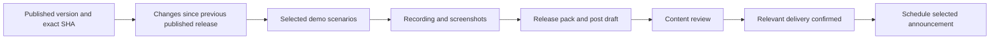

# GitHub and deployment workflow research

Investigated on September 30, 2026. Interpreting “linked post” as a LinkedIn post.

Start with a release pack: a short recording of a real user task, screenshots, readable release notes, and a LinkedIn draft. Generate it from a specific published version, then review the result before distributing it. Add production deployment verification alongside this so announcements describe updates people can actually use.

## What Machdoch has today

- [Release](../.github/workflows/release.yml) builds Windows x64 and Linux x64/ARM64 packages, publishes landing and Fleet Manager images to GHCR, verifies installer assets, and publishes a draft GitHub release after the required jobs succeed. It already generates SBOMs and provenance attestations.
- [Manual Build Installers](../.github/workflows/installer.yml) provides an independent installer build. Neither checked-in workflow runs on pull requests or includes a showcase recording. The root [package.json](../package.json) already provides checks, type checks, tests, and builds that could form a CI gate.
- The latest published release is [v23.0.1](https://github.com/pureportal/machdoch/releases/tag/v23.0.1). Its [release run](https://github.com/pureportal/machdoch/actions/runs/36762322887) succeeded and published seven package assets. The preceding [v23.0.0 run](https://github.com/pureportal/machdoch/actions/runs/36739484558) failed; that tag survives, but its release endpoint returns 404.
- v23.0.1's entire release body is a comparison link from `v23.0.0` to `v23.0.1`. The preceding published release is [v22.0.0](https://github.com/pureportal/machdoch/releases/tag/v22.0.0). This is a concrete reason to calculate changes from the previous published release: the present notes omit the earlier unpublished changes. The closed-PR query also returned no entries, so PR-label-based notes alone do not fit the observed direct-commit workflow.
- The container jobs publish images; the checked-in workflow does not update a production host. GitHub returned no environments or deployment records. This does not establish whether an external deployment system exists. The configured landing URL, `https://machdoch.app/`, returned HTTP 200 to a HEAD request, which does not identify its deployed commit.
- The [browser UI](../apps/client/src/tauri/ui/preview/app.tsx) uses production components, with [fixtures](../apps/client/src/tauri/ui/preview/fixtures.ts) for browser execution. A browser recording can demonstrate UI interactions, but fixture results cannot establish that native execution works.
- [Browser tools](../apps/client/src/core/_helpers/browser-tool-definitions.ts) already use Playwright, but browser contexts do not enable video recording. The [macro recorder](../apps/client/src/core/_helpers/macro-recorder-tool-definitions.ts) saves UI tool actions for reuse; it does not produce a video.
- [Scheduler triggers](../apps/client/src/core/_helpers/scheduler-tool-definitions.ts) include webhook event categories. No GitHub webhook receiver was identified in the inspected scheduler and server paths. Incoming GitHub events would still need a verified integration; the schema examples are not evidence that delivery is connected.

## Useful additions

Effort is relative to the inspected code, not a delivery estimate. Recording effort depends on whether a feature already has a reliable demo scenario.

| Addition                           | When it runs                           | What it gives us                                                                                      | Effort                          | Priority    |
| ---------------------------------- | -------------------------------------- | ----------------------------------------------------------------------------------------------------- | ------------------------------- | ----------- |
| Readable release notes             | Each published version                 | A short account of user-visible changes, covering the full range since the previous published release | Small                           | First       |
| Release demo pack                  | Releases with selected visible changes | A 30–60 second MP4, poster image, screenshots, captions, and post draft                               | Medium                          | First       |
| Production verification            | Each production rollout                | Confirmation of the deployed SHA/image digest and working public routes                               | Medium; host integration needed | First       |
| LinkedIn drafts                    | Selected significant updates           | A reviewed post with the demo and a release link                                                      | Small after account setup       | First       |
| PR previews and visual comparisons | UI pull requests, if PRs are adopted   | A preview URL and before/after screenshots or a short interaction clip                                | Medium                          | Next        |
| Weekly development digest          | Weekly, when useful changes exist      | One coherent update aggregating small improvements                                                    | Small after the release pack    | Next        |
| Release pages and feed             | Published releases                     | A durable changelog on the landing site, with demo links and RSS/Atom                                 | Medium                          | Next        |
| Documentation screenshots          | Changes to documented screens          | Updated images captured by the same maintained scenarios                                              | Small after capture setup       | Next        |
| Installed-package smoke checks     | Before release publication             | Evidence that the packaged app launches and completes a representative task                           | Medium                          | Next        |
| Before/after measurements          | Releases with measurable improvements  | A reproducible timing or memory comparison to accompany the demo                                      | Medium                          | Selectively |
| Announcement follow-up             | After a post is delivered              | Delivery status and release-link clicks; platform metrics where account access permits                | Small–medium                    | Later       |

For Machdoch, good demo scenarios would show completing a workspace task, running a saved flow, recovering from an execution error, managing a remote project, or creating a media asset. Select only scenarios affected by the actual release. A reliability change may deserve release notes without a video.

“Big update” should mean a meaningful new capability or improvement, selected deliberately. The recent release history moves through major version numbers quickly; the version number alone is a poor announcement trigger. Small fixes can go into the changelog or weekly digest.

## Recording the newest changes

Use a maintained script for each demo scenario, selected using the release's changed areas and reviewed change notes. Let an agent propose the story and draft copy; use deterministic interactions and assertions to record it.

| Capture method                       | Best use                                                                            | Main constraint                                                                    |
| ------------------------------------ | ----------------------------------------------------------------------------------- | ---------------------------------------------------------------------------------- |
| Playwright recording of browser UI   | Chat, flow editor, scheduler, Fleet Manager, and other visible interactions         | Requires deliberate fixtures; cannot prove native backend behavior                 |
| Tauri WebDriver plus desktop capture | Filesystem work, native execution, window behavior, and packaged app demonstrations | More setup and a graphical runner; OS dialogs may need separate desktop automation |
| Operator-recorded native session     | First demonstrations of features without a maintained scenario                      | Less reproducible; still use a clean demo workspace and capture the released build |

Playwright's library supports `recordVideo`; set both viewport and recording dimensions explicitly, and close the context to finalize the file. Its default scales video to fit 800×800. Browser and FFmpeg binaries must be provisioned on the recording runner; the existing `playwright-core` dependency is not a complete recording installation. [Playwright video documentation](https://playwright.dev/docs/videos)

For native demos, Tauri documents WebDriver automation. Direct `tauri-driver` supports Windows and Linux, which match Machdoch's packaged platforms; WebdriverIO also offers an embedded driver option. Capture the application window separately from the automation driver. [Tauri WebDriver documentation](https://v2.tauri.app/develop/tests/webdriver/)

Start with FFmpeg for trimming, resizing, captions, and combining clips. It documents screen capture inputs and video filters. A more elaborate motion-graphics framework can wait until simple editing limits the result. [FFmpeg devices](https://ffmpeg.org/ffmpeg-devices.html), [FFmpeg filters](https://ffmpeg.org/ffmpeg-filters.html)

Record actual interactions and the resulting state. Use a disposable workspace and seeded data, pause at the useful result, and inspect the full clip for readability and missing frames. Keep original recordings alongside the final MP4. Native feature claims need a successful native run; a mock answer in the preview is insufficient.

## LinkedIn options

| Route                              | Strength                                                                         | Prerequisites                                                                                   |
| ---------------------------------- | -------------------------------------------------------------------------------- | ----------------------------------------------------------------------------------------------- |
| Local draft and manual publication | Fastest way to validate the format                                               | Selected profile or company page and an operator                                                |
| Buffer                             | Drafts, scheduling, video attachments, and an MCP integration usable by Machdoch | Buffer account, connected LinkedIn channel, API key, and fetchable media URLs                   |
| Direct LinkedIn API                | Control over upload and publication                                              | Developer app, OAuth, the appropriate posting permissions, and API access for the chosen author |

The first release pack can simply contain `linkedin-post.md` and `demo.mp4`. If drafts prove useful, Buffer is the strongest integration candidate to evaluate first. Its documented MCP endpoint is `https://mcp.buffer.com/mcp`, with bearer authentication. It supports reading channels and drafts, scheduling and editing posts, and accessing analytics. Its API also documents `saveToDraft: true` and video attachments fetched from public URLs. These capabilities fit a reusable Machdoch flow, but connectivity, account entitlements, pricing, and the selected LinkedIn channel have not been tested. [Buffer MCP](https://developers.buffer.com/guides/integrations/mcp.html/), [draft creation](https://developers.buffer.com/examples/create-draft-post.html), [video posts](https://developers.buffer.com/examples/create-video-post.html)

For a direct integration, member posting uses `w_member_social`; organization posting uses `w_organization_social` and an appropriate page role. Company-page Community Management access is vetted and has development and standard tiers. Use the current Posts API rather than older UGC examples. Upload the video, wait for it to become `AVAILABLE`, then reference its URN in the post. Maintain a supported `Linkedin-Version`. [Posts API](https://learn.microsoft.com/en-us/linkedin/marketing/community-management/shares/posts-api?view=li-lms-2026-09), [Videos API](https://learn.microsoft.com/en-us/linkedin/marketing/community-management/shares/videos-api?view=li-lms-2026-09), [Community Management access](https://learn.microsoft.com/en-us/linkedin/marketing/community-management/community-management-overview?view=li-lms-2026-09)

A useful post leads with the task people can now complete, shows the result, and links to the relevant release page. Generate factual drafts from reviewed release notes and recording evidence. Choose one publication provider when implementing this; there is no need to build multiple publishing paths.

Treat scheduling as an intermediate state. Store the provider's post ID and check delivery status before recording an announcement as sent. Buffer distinguishes scheduled, sent, and error states. Do not blindly repeat a create request after an uncertain timeout. [Buffer post lifecycle](https://developers.buffer.com/guides/posts-and-scheduling.html)

## Recommended workflow

1. **Collect release facts.** Pin the release tag to its commit. Select the preceding published stable release in its ancestry and record that baseline. Review the Git changes and any merged PRs in that range. For today's successful release, use `v22.0.0...v23.0.1`, not the surviving failed `v23.0.0` tag. GitHub's notes API accepts an explicit `previous_tag_name`; grouping by PR labels can be added if PRs become part of the workflow. [GitHub release API](https://docs.github.com/en/rest/releases/releases#generate-release-notes-content-for-a-release), [generated release notes](https://docs.github.com/en/repositories/releasing-projects-on-github/automatically-generated-release-notes)
2. **Capture selected outcomes.** Start with one maintained scenario and a 16:9 MP4. Add screenshots and captions from the same run. Extend to square or portrait versions only when the content remains readable. Omit unsupported claims or unavailable demonstrations.
3. **Keep one release record.** Store the release SHA, baseline SHA, change summaries, significance decision, scenario IDs, and artifact references together. Produce release notes, a landing-page entry, and social drafts from these facts rather than independently summarizing different commit ranges.
4. **Review the pack.** Confirm the video demonstrates the selected version, the copy matches the evidence, and the linked downloads exist. Keep large recordings in workflow artifacts during review and publish approved media at durable URLs. The current installer asset validator filters installer extensions, so additional MP4/PNG assets would not violate its installer-name checks. GitHub reports v23.0.1 as mutable, allowing media to be attached after publication; an immutable release would require media before publication or separate hosting.
5. **Verify the relevant delivery and distribute.** Desktop announcements need the published packages; landing/Fleet Manager announcements need a production rollout receipt and smoke checks. Record announcement state by repository, release SHA, and destination channel so reruns update the same draft rather than create duplicate posts.

Use GitHub Actions for package builds and machine checks. Machdoch/RALPH can coordinate scenario selection, copy drafting, media review, and MCP tools. Scheduled jobs can produce the weekly digest. A GitHub-to-Machdoch webhook connection is a separate integration, not an assumed capability of the existing scheduler.

The current workflow creates tags and publishes releases using `GITHUB_TOKEN`. GitHub suppresses new workflow runs for most events caused by that token, including release publication. Therefore an isolated `release: published` listener would not reliably receive these releases. Prefer a reusable showcase workflow invoked explicitly after publication, with a manual tag input for reruns using the same implementation. Keep showcase failures out of package publication and draft cleanup. [GitHub workflow triggering](https://docs.github.com/en/actions/how-tos/write-workflows/choose-when-workflows-run/trigger-a-workflow)

Production deployment should use the exact image digest, expose or otherwise verify its release identity, and check the public landing routes and Fleet Manager functionality after rollout. `/healthz` currently returns only `ok`; it cannot establish which build is running. GitHub environments can make deployments and their status visible in the repository. Identify the existing hosting system before choosing a deployment adapter. Fleet Manager rollback plans must account for its SQLite data and migrations. [GitHub deployments](https://docs.github.com/en/actions/how-tos/deploy/configure-and-manage-deployments/control-deployments)

## First implementation scope

1. Fix the published-release comparison baseline and introduce reviewed user-facing change summaries.
2. Add the release pack workflow with one scenario, an MP4, screenshots, and a local LinkedIn draft. Support explicit invocation after release publication and manual regeneration for a published tag.
3. Connect the actual production host and verify the deployed digest before announcing hosted changes.
4. Evaluate a Buffer-connected channel and draft creation, then add scheduling after the generated content has been reviewed.
5. Reuse the same capture and change records for documentation images, weekly updates, and a public changelog.

Success for the initial recording is a repeatable run against the selected release, a readable clip showing its changed behavior, factual release notes covering the correct baseline, and a reviewable post draft. A failed recording must remain visible as a failed showcase run while the published package stays available.

## Verification and remaining uncertainties

Read the checked-in workflows, package and asset scripts, frontend fixtures, browser tools, scheduler definitions, and deployment documentation. Queried live GitHub release history, workflow results, package asset names, tag existence, closed PRs, environments, deployments, and the public landing URL variable. Confirmed the landing URL responds with HTTP 200. Checked current primary documentation for Playwright, Tauri, FFmpeg, GitHub, LinkedIn, and Buffer.

This investigation adds only this document. No workflows were changed, no development servers were started, and no demo was recorded, deployment performed, or post created. Application tests were not run for this documentation-only change.

Still unverified: production host/deployer and live commit, recording quality and runner requirements, LinkedIn author identity and credentials, Buffer account/channel access and costs, and webhook delivery into Machdoch. These are implementation prerequisites, not blockers to the investigation.
