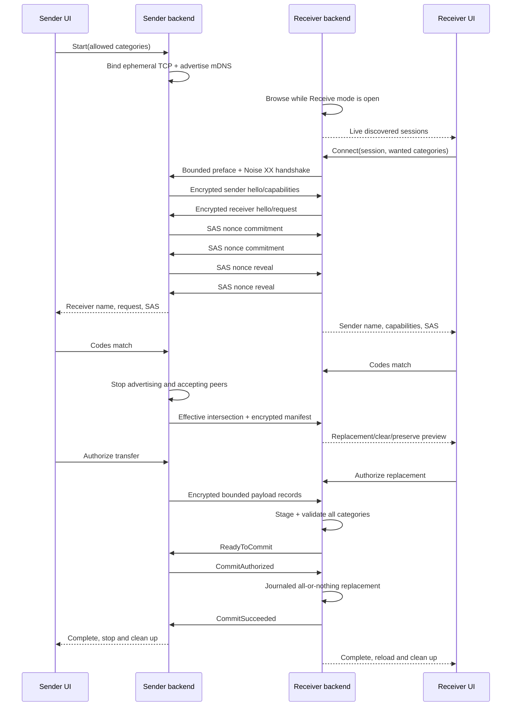

# Local settings sharing design

Status: implemented; cross-platform two-host release validation remains required

Investigated: 2026-07-17

Implemented: 2026-07-17

Target: Machdoch desktop on Windows, macOS, and Linux

The implementation lives in `src-tauri/src/settings_transfer/`, with its typed UI contract in
`src/tauri/ui/settings-transfer.ts` and the complete sender/receiver settings experience in
`src/tauri/ui/chat-session/components/settings-dialog-panels/settings-transfer-panel.tsx`.
Section 11 is retained as a record of product-policy decisions that may be revisited; the shipped
protocol uses the closed catalog and exact behavior specified in the preceding sections.

Passphrase-encrypted file export/import reuses this catalog, validation, and journaled commit path;
its container and Settings UX are specified in
[`encrypted-settings-file-transfer.md`](./encrypted-settings-file-transfer.md).

## 1. Recommended approach

Build settings sharing as a temporary, one-receiver session owned by the Tauri/Rust backend:

1. The sender explicitly opens **Transfer Settings**, selects allowed categories, and starts a session.
2. The backend opens an ephemeral TCP listener and advertises `_machdoch-xfer._tcp.local.` with DNS-SD over mDNS.
3. The receiver opens **Receive Settings**, browses that service type, and explicitly selects one discovered session.
4. The peers establish `Noise_XX_25519_ChaChaPoly_BLAKE2s` with fresh, session-only keys, then run an encrypted nonce commitment/reveal round. Both screens display the same six-digit short authentication string (SAS) bound to the Noise transcript and committed nonces, and both users must confirm that the codes match. This is a comparison, not a password.
5. The peers negotiate closed, versioned category identifiers. The effective transfer is:

   `sender allowed ∩ sender available ∩ receiver wanted ∩ receiver supported`

6. The sender serializes only the effective global categories. The receiver stages and validates the entire encrypted payload before changing live state.
7. The receiver performs an application-level all-or-nothing replacement using a write-ahead journal, same-volume backups, existing cooperative locks, and atomic file replacements. Unselected categories remain unchanged.
8. Completion, cancellation, dialog close, application exit, or timeout triggers one backend cancellation path that closes listeners and streams, unregisters the service, sends an mDNS goodbye, destroys session keys, and removes staging data.

The security goal is deliberately proportional: protect API keys and other content against passive network observers, make accidental selection and active interception visible through a pairing code, and tightly limit exposure in time and scope. It cannot establish machine identity without a password, PKI, or previous trust. A user who does not actually compare the code can still connect through an active man-in-the-middle.

Recommended implementation choices:

| Concern | Recommendation | Why |
|---|---|---|
| Discovery | DNS-SD over mDNS with Rust `mdns-sd` | Standard local-link discovery, no central service, supports browse/register/unregister/shutdown, and fits the existing Rust backend. |
| Transport | Dual-stack TCP on an OS-assigned port | Simple reliable framing; settings are bounded; no NAT traversal is wanted. IPv6 link-local zone indices are resolved on the receiving node and are never trusted from a manual code. |
| Encryption | Noise XX through Rust `snow` | Designed for peers with no known public keys, provides an authenticated encrypted channel after the handshake, and exposes a handshake hash suitable for channel binding. |
| Pairing | Mandatory six-digit SAS comparison plus sender approval | No password entry, familiar UI, and materially reduces wrong-machine and active MITM risk. |
| Payload | Length-prefixed encrypted JSON records and bounded UTF-8 file chunks | All current eligible content is JSON or Markdown; avoiding ZIP/TAR removes an archive traversal class. |
| Import | Stage, validate, then journaled all-category replacement | Enforces complete overwrite while preventing network failures or malformed data from partially changing settings. |

Implementation hardening completed during the post-implementation audit:

- transport-frame reads retain partial bytes across cancelled `select!` branches, preserving framing and Noise nonce order;
- manual IPv6 link-local endpoints are mapped to matching receiver-local interface indices, because zone identifiers are node-local;
- `CommitAuthorized` and local stop requests cross one serialized state boundary before any live write starts;
- startup rolls back only a `committing` journal; a merely `prepared` journal has not changed live settings and is discarded;
- every managed directory ancestor is checked without following links before snapshot, backup, deletion, replacement, or recovery;
- mDNS setup failures queue daemon shutdown, browser failures retain their owner for graceful shutdown, and unchanged discovery/progress state is not emitted excessively;
- local pairing and approval commands are idempotent per phase, and cancellation prevents late background work from publishing a new active phase;
- manual rendezvous endpoints and encoded size are capped so every generated fallback fits the medium-error-correction QR encoder;
- portable paths reject Windows-invalid/control characters, superscript device aliases, and oversized components before any receiver commit;
- packaged macOS builds declare the Bonjour service and explain local-network use through Tauri's merged `Info.plist`.

### Terminology correction

The repository contains no product use of **MPC**. It consistently uses **MCP**, meaning Model Context Protocol, including the Settings label, `mcp.json`, the MCP SDK, and MCP lifecycle code. The task's “MPC data” example is therefore treated as a typo for **MCP data**.

## 2. Sender and receiver UX and end-to-end sequence

### Sender

Add a **Transfer** section to Settings with two primary actions: **Transfer Settings** and **Receive Settings**.

When the user selects **Transfer Settings**:

1. Show the supported categories, item counts, portability warnings, and whether each category contains sensitive data. API Keys and Global Memory should be off by default; MCP should be marked as potentially containing credentials.
2. The user chooses what Machdoch is allowed to share and presses **Make available**.
3. Show a non-stable session label such as `Machdoch Transfer 7K4M`, a ten-minute countdown, network status, and a prominent **Cancel** button. The label shown here is the same label visible in discovery.
4. When a receiver connects, show its encrypted display name and requested category labels. Do not show API-key values, file contents, paths, hashes, or raw manifests.
5. Both screens show a six-digit code. The sender presses **Codes match** or **Cancel**.
6. Show the effective intersection and the destructive effect, for example: “Replace 3 global RALPH flows and clear 1 existing extra flow.” The sender confirms **Transfer these categories**.
7. Show progress by category and an unambiguous final result. Completion closes the network session automatically; it does not leave a reusable server running.

Closing the Transfer panel, closing Settings, switching out of Transfer mode, cancelling, signing out of the desktop session, or quitting Machdoch must call the backend stop operation. Hiding Machdoch to the tray must not silently keep a transfer active after its panel was closed.

### Receiver

When the user selects **Receive Settings**:

1. Start an mDNS browser only while this mode is open. Show a live list of available session labels, not a cached history.
2. Let the user preselect the categories it wants. The final list may narrow after encrypted capability negotiation.
3. Require an explicit click on a discovered session even when there is only one. Automatic discovery should not mean automatic connection.
4. After the Noise handshake, show the sender's encrypted device display name, session label, requested/effective categories, and the same six-digit code. The receiver presses **Codes match** or **Cancel**.
5. Before any content is sent, show exactly what will be replaced, what will be cleared because the sender's category is empty, what will remain unchanged, and what is unavailable or incompatible. Require **Replace selected settings**.
6. Receive into staging, validate, commit, reload affected subsystems, and show the result. If the receiver completes locally but the final acknowledgement is lost, say so explicitly rather than claiming failure and encouraging a risky retry.

The receiver must stop browsing when Receive mode closes. A **Can't find the other PC?** path should explain same-network/firewall/multicast requirements and offer a QR/manual-address fallback. The fallback carries only address, port, session ID, protocol version, and session label; it does not weaken the Noise/SAS flow and is not a password.

### Sequence and commit point



`CommitAuthorized` is the point of no return. Before it, cancellation or network failure leaves live receiver state untouched. After it, the receiver must finish either commit or rollback even if the socket disappears; abruptly killing local writes would create the corruption this design is meant to prevent.

## 3. Discovery, connection, encryption, replay, and shutdown

### 3.1 Discovery

Use DNS-Based Service Discovery over Multicast DNS:

- Service type: `_machdoch-xfer._tcp.local.`. `machdoch-xfer` is within DNS-SD's 15-character service-name limit.
- Instance: `Machdoch Transfer <four random characters>`, regenerated for every advertisement. Show the same value in the sender UI so the two people can match it without publishing a stable machine name.
- Hostname: an ephemeral random `.local.` hostname rather than the operating-system hostname, when supported by the library.
- SRV: the OS-assigned TCP port.
- TXT: only `txtvers=1`, `protovers=1.2`, and a random 128-bit single-use `sid`. Keep it well below 200 bytes.
- Never put device/user names, application patch version, category names, item counts, file paths, API values, public-key fingerprints, pairing codes, or content hashes in TXT records.

DNS-SD is the standard fit here: it defines PTR/SRV/TXT discovery and user-visible instance names, while mDNS gives `.local.` names link-local significance. DNS-SD recommends small TXT records (normally 200 bytes or less) and the `protovers` key for application protocol versions. See [RFC 6763](https://www.rfc-editor.org/rfc/rfc6763.html) and [RFC 6762](https://www.rfc-editor.org/rfc/rfc6762.html).

Discovery is not private or authenticated. Multicast records can be observed by any on-link party, TXT data can fingerprint software, and any host can claim a friendly instance name. This is why the advertisement is minimal, randomized, short-lived, and followed by encrypted pairing. These limitations are described in [RFC 8882](https://www.rfc-editor.org/rfc/rfc8882.html).

At the time of this investigation, Rust [`mdns-sd` 0.20.x](https://docs.rs/mdns-sd/latest/mdns_sd/) supplies browsing, registration, interface selection, monitoring, graceful unregister, and daemon shutdown without coupling to a particular async runtime. It is the pragmatic first choice, subject to a normal dependency/license/security review and real Windows/macOS/Linux tests.

Run the daemon monitor from startup: its constructor opens multicast sockets lazily, so interface/permission failures can arrive asynchronously. Treat a monitor error as “not discoverable,” close the listener or offer the manual fallback, and never leave the UI claiming availability. Handle DNS-SD conflict-driven instance-name changes by updating the sender and discovered receiver labels. Await unregister status with a short deadline, then shut down the daemon even if the acknowledgement is lost.

Discovery alternatives:

| Option | Advantages | Drawbacks | Decision |
|---|---|---|---|
| Pure-Rust `mdns-sd` | One dependency; browse and publish; no Avahi/Bonjour runtime assumption; explicit unregister/shutdown | Own mDNS implementation; must be tested with OS firewalls and multiple interfaces | Recommend. |
| Native DNS-SD APIs | Best integration with Bonjour, Windows DNS-SD, and Avahi | Three platform paths; Linux daemon/D-Bus assumptions; registration and browsing crates/APIs differ | Revisit if pure-Rust interop is inadequate. |
| Custom UDP broadcast | Superficially small | Reimplements discovery, collision handling, interfaces, expiry, IPv6, and privacy behavior | Reject. |
| QR/manual address only | Easy authenticated rendezvous if scanned | Does not meet automatic discovery as the primary flow | Keep only as fallback. |

### 3.2 Binding and reachability

For a simple first version:

- Bind one IPv4 TCP listener to `0.0.0.0:0`, obtain the OS-assigned port, then advertise only active, non-loopback LAN interfaces selected by the mDNS service.
- Never use UPnP, NAT-PMP, port forwarding, relay servers, or a fixed port.
- Reject accepted peer addresses that are not on the same directly connected prefix as one of the advertised interfaces. Do not use “RFC1918 only” as the test because valid local IPv6 and enterprise networks do not always use those ranges.
- Exclude loopback, link-down, and obvious tunnel/VPN interfaces by default; show an advanced per-session interface chooser if automatic selection is ambiguous.
- Treat interface changes, suspend/resume, or movement between networks as session invalidation. Rotate `sid` and re-advertise only if Transfer mode is still visibly active.
- Cap pre-handshake reads, concurrent sockets, and CPU work. One pairing candidate is enough; unrelated connects get a short preface timeout and cannot keep the accept loop occupied indefinitely.

Binding wildcard makes a single ephemeral port practical across interfaces, but source-prefix validation and the single-use `sid` reduce accidental routed reachability. The `sid` is a rendezvous nonce, not authentication: an on-link observer learns it from mDNS. IPv6-only LAN support should be a release criterion or an explicitly documented V1 limitation; portable dual-stack binding to the same ephemeral port needs targeted `socket2`/OS testing.

### 3.3 Connection preface and protocol negotiation

Before Noise, accept exactly one small, length-bounded binary preface containing:

- fixed magic `MACHDOCH-XFER`;
- protocol major/minor;
- the advertised 128-bit `sid`;
- initiator nonce;
- supported Noise suite identifier.

The sender rejects an expired/wrong/reused `sid`, unsupported major version, oversized preface, or read timeout before allocating category state. Both peers hash the exact canonical preface into the Noise prologue. Noise specifies that differing prologues make the handshake fail, allowing prior negotiation and context to be bound into the transcript. See the [Noise Protocol Framework](https://noiseprotocol.org/noise.html).

There is no 0-RTT data and no secret or category value in the cleartext preface.

### 3.4 Encrypted channel and pairing

Use `Noise_XX_25519_ChaChaPoly_BLAKE2s` over TCP with the Rust [`snow`](https://docs.rs/snow/latest/snow/) implementation:

- Generate sender and receiver Noise static key pairs for this connection only; generate Noise ephemeral keys during the handshake. Never persist either key pair.
- XX is appropriate because neither side knows the other's public key. It exchanges static public keys under handshake encryption and provides mutual key possession, but those fresh keys do not by themselves identify a machine.
- Retain the final Noise handshake hash as the channel-binding value and transition to stateful transport mode over ordered TCP.
- Do **not** truncate the handshake hash directly into a short code. A last-moving MITM could otherwise try many of its own key choices until its two independent channels happen to produce the same short value.
- Canonically hash the Noise handshake hash plus the encrypted sender and receiver hello/capability documents into `pairingContextHash`. This binds the displayed peer names, protocol choices, and category offer/request to what the users compare.
- Each endpoint then generates a fresh 128-bit `sasNonce` and sends `H("machdoch-sas-commit-v1" || role || pairingContextHash || sasNonce)`, where `H` is SHA-256. Each endpoint must send its commitment before accepting a reveal and must not reveal until it has received the peer commitment. Then exchange the nonces, verify the commitments in constant time, and derive `H("machdoch-sas-v1" || pairingContextHash || initiatorNonce || responderNonce)`, reduced without modulo bias to six decimal digits.
- Bind roles and ordering canonically so reflection cannot swap the nonces. Commit/reveal records use the normal encrypted sequence/state checks and are never logged.
- Permit one completed commitment/reveal/SAS attempt per `sid`. A mismatch, invalid reveal, or cancellation destroys the connection and rotates the session ID and keys before any re-advertisement. Because a MITM must commit on at least one leg before learning the remaining honest nonce, a uniformly derived six-digit code gives it approximately a one-in-one-million success chance per allowed session; this is an inference and depends on fresh nonces, correct commitment ordering, and strict retry limiting.
- Exchange display names and category capabilities only after the Noise handshake. Do not send category contents until both SAS confirmations and both replacement approvals have arrived.

The Noise specification describes XX as its most generally useful mutual-authentication pattern and exposes the handshake hash for application channel binding. A SAS derived from key agreement and confirmed out of band is an established approach to detecting MITM; [RFC 8826, section 4.3.2.2](https://www.rfc-editor.org/rfc/rfc8826.html#section-4.3.2.2) summarizes the approach and its user-compliance limitation. [RFC 6189, section 4.4.1.1](https://www.rfc-editor.org/rfc/rfc6189.html#section-4.4.1.1) is especially relevant: it explains that a hash commitment constrains an attacker to one SAS guess, while omitting commitment permits trial calculations for a matching short code. The proposed nonce commitment/reveal is the application-layer commitment that supplies that property after the Noise channel is established.

Encryption alternatives:

| Option | Practical assessment |
|---|---|
| Noise XX + SAS | Best fit. Compact unknown-peer handshake, no certificates, direct transcript binding, and simple TCP transport records. |
| TLS 1.3 + ephemeral self-signed certificate + SAS/pinning | Cryptographically sound and mature, but certificate generation, custom verification, and fingerprint binding add plumbing without creating trust. [RFC 8446](https://www.rfc-editor.org/rfc/rfc8446.html) remains the fallback standard. |
| PAKE/SRP/OPAQUE | Excellent when both parties share or enter a secret; conflicts with the no-password requirement. |
| Raw X25519, HPKE, or custom ECDH | Encryption alone does not solve peer identity, transcript binding, framing, replay, or nonce handling; avoid a custom protocol. |
| QUIC or WebRTC | Adds certificate/signaling/NAT complexity with little benefit for a short same-LAN settings payload. |

### 3.5 Framing, freshness, and replay protection

Wrap every Noise message in a two-byte network-order length prefix, respecting Noise's 65,535-byte message limit. Keep application plaintext chunks at or below 48 KiB so headers and the AEAD tag fit comfortably.

Every encrypted application record, including SAS commitment/reveal records, contains:

- protocol and message type;
- random 256-bit `transferId`;
- monotonically increasing per-direction sequence number;
- session creation and expiry timestamps;
- category ID and schema version when applicable;
- chunk number/final marker;
- bounded body length.

TCP and Noise transport nonces already provide ordered authenticated encryption. The explicit application sequence catches state-machine mistakes and cross-message replay. Reject duplicates, gaps, expired sessions, mismatched transfer IDs, unexpected message types, and records received in the wrong state. Session IDs, transfer IDs, keys, and connection state are single-use; there is no partial resume. A retry performs discovery and a fresh handshake again.

The encrypted manifest includes per-category logical item count, byte count, and SHA-256 digest. Digests verify completeness after staging; they are not authentication substitutes and never appear in discovery or logs.

Suggested initial bounds, all centralized and testable:

- 32 MiB total plaintext;
- 2,000 file/items total;
- 128 KiB per instruction or prompt file, matching the repository's current instruction discovery bound;
- 2 MiB for global MCP configuration;
- 4 MiB per RALPH flow;
- 15 seconds for TCP/Noise handshake;
- 60 seconds for SAS/approval;
- 30 seconds idle between payload records;
- 10 minutes absolute sender-session lifetime;
- 5 minutes maximum connected transfer/commit lifetime.

Reject before allocation when a declared count or size exceeds a limit. Do not return parser errors that echo raw content.

### 3.6 Shutdown and cleanup

Model sender and receiver modes as backend-owned session guards with one cancellation token. The UI is a view of backend state, not the owner of sockets.

The stop path must, in order:

1. Mark the session closed so no new state transition can win a race.
2. Cancel accept/read/write/timeout tasks and close TCP listeners and streams.
3. Unregister the DNS-SD instance, await its bounded unregister result, and shut down the mDNS daemon/browser.
4. Zero session key buffers and sensitive plaintext buffers on a best-effort basis.
5. Remove uncommitted staging and rollback material with permission-safe cleanup.
6. Emit one terminal Tauri event and clear the managed state.

Use cancellation-aware `tokio::select!` operations rather than polling an `AtomicBool`. The existing Mission Control server polls every 200 ms; that lifecycle is useful precedent, but transfer shutdown should react directly.

On clean shutdown, mDNS must send records with TTL zero. [RFC 6762, section 10.1](https://www.rfc-editor.org/rfc/rfc6762.html#section-10.1) specifies these goodbye packets; compliant receivers retain them for at most about one further second before deletion. Thus “immediate” means the listener is closed and unregistration is initiated synchronously, while a remote discovery UI may display a stale entry for roughly one second because of protocol cache semantics.

Advertisement lifecycle:

- Advertise only after the TCP listener is successfully bound.
- Once one peer completes the encrypted hello and is presented for pairing, unregister the advertisement and stop accepting other peers.
- If pairing fails before authorization and Transfer mode remains visibly open, create a fresh listener/session ID/key set and advertise a new instance.
- On success, never re-advertise automatically.
- On a process crash the OS closes TCP sockets, but no goodbye can be guaranteed. Receivers must remove entries on TTL expiry or failed connect; the sender cleans orphan staging/journals on next start.

## 4. Category model and selection negotiation

### 4.1 Closed category catalog

Use a closed Rust/TypeScript enum. A category adapter has no `workspaceRoot` parameter and exposes only:

```text
id
schema versions supported
sensitivity and portability flags
inspectAvailability()
snapshotGlobal()
validateIncoming()
stageReplacement()
commitReplacement()
rollbackReplacement()
```

Recommended V1 categories:

| ID / UI label | Exact global content | Explicitly outside the category | Sender default |
|---|---|---|---|
| `credentials.api-keys` / **API Keys** | `user-config.json` `apiKeys` and `webSearch.apiKeys` | Process environment, workspace `.env`, CLI-path configuration, any other category's embedded literals | Off; sensitive warning |
| `preferences.agent-provider` / **Agent & Provider Preferences** | `webSearch.activeProvider`, `voice.activeProvider`, `speechToText.activeProvider`, `agentLimits`, `reviewModel`, and the portable allowlisted portion of `providerEnrollment` | `speechToText.inputDeviceId`, `agentCliPaths`, provider ownership/status/workspace registries, and `providerEnrollment.persistentSync.daemonAtLogin` | On |
| `preferences.desktop-appearance` / **Desktop & Appearance** | Appearance theme/density/accent/bubble style plus portable desktop fields: assistant bubble behavior, context limit, archive/retention values, quick-voice silence and message limits | Autostart registration/preferences, always-run-as-admin, quick-voice enabled/shortcut, preferred OS voice URI, session/shell state | On |
| `preferences.chat-voice` / **Chat & Voice Preferences** | Spoken-reply enabled/rate, new-chat provider/model/mode/reasoning and memory/UI-control defaults, and running-task message behavior | Preferred OS voice URI, speech input device, sessions, drafts, queued messages, histories, recent workspaces, and recovery state | On |
| `memory.global` / **Global Memory** | `memory.globalEnabled` and all entries whose scope is exactly `global` | Per-session memory and conversation history | Off; personal-data warning |
| `customizations.instructions-global` / **Instruction Files** | User config root `instructions.md` and `instructions/**/*.instructions.md` | Workspace `.machdoch`, `.github`, `AGENTS.md`, prompts, skills, and RALPH-flow instructions | On |
| `customizations.prompts-global` / **Global Prompts** | User config root `prompts/**/*.prompt.md` | Workspace/GitHub prompts and any non-prompt file | On |
| `context-packs.global` / **Global Context Packs** | Complete logical snapshots of context packs whose `workspace` is `null`, including instructions, prompts, variables, triggers, provider/model choices, and attachment references | Workspace-scoped packs and the contents of referenced files, directories, or Media Studio assets | On, with path/private-content warning |
| `mcp.global` / **MCP Servers & Registries** | User config root `mcp.json` and the extracted `machdoch.desktop.mcp-marketplace-state` registry-source value | Workspace MCP config, discovery caches, lifecycle/usage state, generated provider files | On, with credential/path warning |
| `ralph.preferences-global` / **Global RALPH Preferences** | Flow-library mode, generation/run provider/model/reasoning choices, and the default maximum transition count | RALPH workspace root, generation prompt history, inspector layout, runs, revisions, watches, artifacts, and scheduler bindings | On |
| `ralph.flows-global` / **Global RALPH Flows** | User-scoped `ralph/flows/*.json` plus matching `ralph/instructions/<flow-id>/instructions.md` and `ralph/instructions/<flow-id>/instructions/**/*.instructions.md`, provided no flow declares a custom workspace override | Every workspace flow; user flow definitions with `settings.workspace.mode: "custom"`; all other files under the instruction tree; global/workspace runs, revisions, watches, artifacts, scheduler bindings, Media Studio flows/assets | On, with path/secret warning |

“Portable allowlisted portion” is the category's complete domain. For example, selecting Desktop & Appearance replaces every portable field listed above but intentionally preserves `quickVoiceShortcut`; that field is not merged, it is outside the transferable category because it is machine-bound.

For `providerEnrollment`, the proposed portable domain is `schemaVersion`, `enabled`, normalized `instructions`, normalized `mcp`, `providers.*.enabled`, and `persistentSync.{enabled,watch,debounceMs,filesystemConvergenceTargetMs,fullRescanIntervalMs,autoReloadOwnedSessions}`. Preserve `persistentSync.daemonAtLogin` locally. The final list remains an explicit product decision because importing the policy can regenerate native provider configuration after commit.

The shell snapshot also carries mixed portable and local state. Transfer only `autoSpeakResponses`, `rate`, the closed new-chat default projection, and running-task message behavior through **Chat & Voice Preferences**. Preserve the preferred voice URI, onboarding state, app navigation state, sessions, histories, recent workspaces, and every other shell-state field. Likewise, **Global RALPH Preferences** transfers only its closed portable projection and preserves the RALPH workspace root and generation prompt history.

Global skills are globally stored but should be deferred from V1. Discovery currently recognizes `skills/**/SKILL.md`, while a useful skill can refer to scripts, references, or assets. Copying only `SKILL.md` can create a broken skill; copying arbitrary trees can transfer executable or binary content. Define a signed/bounded skill-package format before adding `customizations.skills-global`.

RALPH's schema permits an otherwise user-scoped flow block to select `settings.workspace.mode: "custom"` with a workspace path. That is an explicit workspace-specific setting and is not eligible. Because Global RALPH Flows has complete-category replacement semantics, finding even one such flow makes the sender category `unavailable(workspace-specific content)`; the adapter must not omit the flow or strip the field and then present the remainder as a complete snapshot.

### 4.2 Availability is not emptiness

Each adapter reports one of:

- `available(value)`: valid non-empty replacement;
- `available(empty)`: valid empty/default replacement that will clear the receiver's category;
- `unavailable(reason)`: cannot safely serialize, validate, or represent the category;
- `unsupported`: this app/protocol version does not implement it.

This distinction is essential. If the sender has no global RALPH flows and both sides select Global RALPH Flows, `available(empty)` intentionally removes the receiver's current global flow definitions. If the sender cannot parse its flow directory, `unavailable` must preserve the receiver's flows and show a reason; corruption must never masquerade as an empty category.

### 4.3 Intersection and downgrade-resistant negotiation

Let:

- `A` = sender categories explicitly allowed;
- `V` = sender categories successfully snapshotted/available;
- `W` = receiver categories explicitly wanted;
- `S` = receiver categories supported with a mutually compatible schema version.

Then `effective = A ∩ V ∩ W ∩ S`.

The sender computes this set, the receiver independently recomputes it, and both compare its canonical hash through the encrypted channel before approval. A category has a separate schema-version range; protocol version compatibility does not imply category compatibility. Unknown categories are ignored for capability display but can never be requested or imported. An empty effective set ends cleanly without transferring content.

For every category, the review UI must show:

| State | Import result |
|---|---|
| Sender allowed + receiver wanted + mutually supported + available | Replace completely |
| Sender allowed, receiver did not want | Preserve receiver exactly |
| Receiver wanted, sender did not allow | Preserve; show “not offered” |
| Both selected, sender category empty | Clear/reset that category after explicit preview |
| Both selected, unavailable or incompatible | Preserve; show reason |
| Not selected on either side | Do not read, serialize, stage, or write it |

Sender permission is a maximum, not a promise. Receiver selection is a request, not authority to access a category the sender withheld.

## 5. Serialization and complete-overwrite semantics

### 5.1 Snapshot and wire representation

Build a logical category snapshot rather than copying storage files. In particular, never transmit all of `user-config.json` or `machdoch-shell-state.json`, because both contain fields outside a selected category and the shell store contains sessions and workspace paths.

After pairing and before the replacement preview, the sender:

1. Acquires a transfer snapshot/read guard and the existing per-resource cooperative locks in a fixed global order.
2. Reads only selected category roots and allowlisted JSON fields.
3. Validates source data. Invalid selected data makes that category unavailable; it does not abort unrelated categories before negotiation.
4. Produces an immutable logical snapshot and encrypted manifest.
5. Releases source locks. Later local edits are not silently added to the payload.

The current Rust `UserConfigFile` type must not be used to deserialize and rewrite the whole user config during this work. It does not currently include the newer `providerEnrollment` field, so a full typed round trip can discard data that the TypeScript schema knows about. The transfer layer should load the root as `serde_json::Value`, validate it as an object, replace only explicitly owned paths, and preserve every unselected/unknown field. The same raw-preserving patch behavior should become the common user-config writer before transfer ships.

Use a versioned encrypted envelope similar to:

```json
{
  "protocolVersion": 1,
  "transferId": "256-bit-random-value",
  "createdAt": "2026-07-17T12:00:00Z",
  "expiresAt": "2026-07-17T12:05:00Z",
  "categories": [
    {
      "id": "ralph.flows-global",
      "schemaVersion": 1,
      "replacement": "value",
      "itemCount": 3,
      "plaintextBytes": 48120,
      "sha256": "..."
    }
  ]
}
```

The manifest is encrypted. `replacement` is either `value` or `empty`; unavailable categories are part of negotiation, not payload. JSON categories use normalized JSON values, not JSON strings nested inside another document. File-tree categories use sorted entries of `{relativePath, utf8Content, sha256}`. Large content is chunked into independent bounded records.

Do not use ZIP, TAR, platform-native paths, or an arbitrary “source path” field. Relative paths use `/`, Unicode NFC, and a category-specific grammar. JSON should be normalized on receipt using existing schema/default logic, so overwrite is semantic rather than dependent on whitespace or object-key order.

### 5.2 Receiver staging and validation

Create a random staging directory under the receiver's private Machdoch config/app-data area and on the same volume as the eventual destination where possible. Before writing content:

- create the directory with current-user-only access (Unix `0700`; an equivalent user-restricted ACL on Windows);
- create files with exclusive creation and user-only access (Unix `0600`);
- never create or follow symlinks, junctions, reparse points, or hard links;
- enforce category, item, depth, path-length, and byte limits before allocation;
- keep API-key and other secret values out of filenames and diagnostics.

Validation is independent on the receiver, even though the sender already validated:

- envelope state, protocol/category versions, transfer ID, expiry, sequence, counts, lengths, and hashes;
- UTF-8 and NFC path normalization; no absolute path, `..`, drive/UNC prefix, Windows alternate-data-stream syntax, NUL, reserved device name, duplicate/case-fold collision, or trailing-dot/space alias;
- `user-config` subdocuments through the shared runtime schema and the category's narrower allowlist;
- memory entry count/shape and `scope === "global"` for every entry;
- MCP JSON object and actual MCP server/default schema, not only the current Rust “is an object” check;
- RALPH flows with the existing `parseRalphFlowJson`/`validateRalphFlow` logic through a new side-effect-free `validate-json` boundary usable by the backend;
- instruction/prompt suffix, existing frontmatter parser, regular-file status, and 128 KiB bound;
- registry URLs and appearance/desktop enum/range normalizers.

Validation must have no live writes, provider sync, network calls, credential tests, MCP launches, flow execution, autostart changes, or other side effects. Do not “verify” an imported API key by sending it to a provider.

### 5.3 Transaction and crash recovery

No existing primitive makes multiple files and Tauri-store keys one filesystem transaction. Reuse the atomic file and cooperative-lock code, then add an application-level write-ahead transaction:

1. **Prepared:** after all payload validation and both approvals, acquire one application-wide settings-import lock plus all selected category locks in a fixed order. Recheck receiver fingerprints captured for the preview. If local state changed, abort and require a new preview rather than overwriting an unseen edit.
2. **Backup:** write same-volume, user-private rollback copies of only the selected category projections. For shared JSON/store files, back up the original complete file or exact key value so unknown/unselected fields can be restored. Sync backups to disk.
3. **Journal:** atomically write `settings-transfer-journal.json` with transaction ID, selected category IDs, destination fingerprints, backup locations, and phase `prepared`. The journal contains no payload values.
4. **Commit authorized:** receive the sender's authenticated `CommitAuthorized`, atomically change the journal to `committing`, and stop treating cancellation as permission to abandon disk consistency.
5. **Replace:** apply selected replacements using sibling temporary files plus atomic replace. For file-tree categories, delete receiver files that are in that category's grammar but absent from the sender snapshot, replace matching files, and preserve non-category files in the same parent directory.
6. **Verify:** reread and hash every selected logical category, reload affected settings/MCP/RALPH/provider-enrollment components, and ensure their normalizers accept the result.
7. **Finish:** atomically mark the journal `committed`, acknowledge success, then remove rollback and staging data and finally delete the journal. Secret-containing backups must not become a long-lived undo archive.

If any replace or verification step fails, roll back every selected category from backups before releasing locks. On application startup, recovery must run before provider enrollment, MCP lifecycle, settings UI, scheduler, Mission Control, or other consumers start:

- `prepared` means live data was not intentionally changed; restore defensively and clean up;
- `committing` means restore every selected category, verify the pre-import hashes, then clean up;
- `committed` means verify the post-import hashes and finish cleanup; do not roll back a successfully committed transaction merely because the acknowledgement was lost.

This gives application-level all-or-nothing behavior. A non-cooperating external process could still observe a short interval between individual file replacements. Strict multi-file atomic visibility would require a larger migration to immutable generation directories plus one atomic “current generation” pointer; that is not justified for this feature unless cross-process observation becomes a hard requirement.

The existing Rust [`atomic_file.rs`](../src-tauri/src/atomic_file.rs), [`cooperative_file_lock.rs`](../src-tauri/src/cooperative_file_lock.rs), and TypeScript atomic/lock helpers are directly reusable. Windows replacement already uses `MoveFileExW` with replace-existing and write-through flags.

### 5.4 Exact replacement by category

| Selected category | Complete replacement result |
|---|---|
| API Keys | Replace the entire provider-key map and web-search-key map. A selected empty category clears both maps. Other `user-config.json` fields are untouched. |
| Agent & Provider Preferences | Replace every portable field in that category, materializing defaults for sender-absent optional fields. Preserve all machine-only and unrelated fields. Re-run derived provider projection only after the transaction succeeds. |
| Desktop & Appearance | Replace all defined portable desktop fields and the appearance store key. Preserve sessions, workspace paths, shortcut/voice-device/autostart/admin fields, and every other store key. |
| Chat & Voice Preferences | Replace spoken-reply enabled/rate, new-chat defaults, and running-task message behavior. Preserve the system voice URI, microphone selection, sessions, Packs, histories, and every unrelated shell/store field. |
| Global Memory | Replace `globalEnabled` and the complete global-entry list. Do not retain receiver entries by ID. |
| Instruction Files | Receiver's `instructions.md` and every matching `instructions/**/*.instructions.md` become exactly the sender set. Preserve nonmatching files and all workspace files. |
| Global Prompts | Receiver's matching `prompts/**/*.prompt.md` become exactly the sender set. Preserve nonmatching files and all workspace/GitHub prompts. |
| Global Context Packs | Replace every global pack while preserving every workspace-scoped pack. Transfer attachment references only; never read or copy the referenced files, directories, or Media Studio assets. |
| MCP Servers & Registries | Replace the whole global canonical `mcp.json` value/presence and the registry-source store key. Stop/reload affected MCP servers only after commit. Preserve workspace MCP and caches. |
| Global RALPH Preferences | Replace flow-library and generation/run defaults. Preserve the local RALPH workspace root, generation prompt history, inspector layout, and every execution/history field. |
| Global RALPH Flows | Replace current user-scope flow definitions and their user-scope flow-instruction trees. Preserve global run/revision history, watches, and all workspace RALPH data because those are not settings in this category. |

For global RALPH, preserved revisions/runs can become detached from a replaced definition. Keep them for data safety, do not transmit them, and have the UI label or hide detached history rather than pretending it belongs to the imported generation. Whether product requirements instead want that local history purged is an open decision, not something import should infer.

Categories the receiver did not select must be logically unchanged and must not have reload side effects. Separate unselected files and store keys should remain byte-for-byte unchanged; unselected fields in a shared JSON document must retain the same values even if committing a selected sibling field normalizes that document's formatting. A failure before `CommitAuthorized` removes staging and changes nothing. A failure after authorization results in either the entire effective set committed or the entire set restored.

## 6. Enforcing that workspace-scoped data can never transfer

Workspace exclusion must be structural, not a UI checkbox or a post-export filter.

### 6.1 No generic export surface

The sender protocol accepts category IDs only. It has no API resembling `export(path)`, no `workspaceRoot`, no glob supplied by the UI or peer, and no request for individual files. Each adapter derives fixed global roots internally from `get_user_config_directory()` or the app data resolver.

The receiver protocol likewise accepts only the negotiated enum. Network DTOs do not contain an absolute source/destination path or a caller-controlled scope. The RALPH adapter directly uses the user RALPH root; it must not call a workspace-capable API with a network-provided scope. The MCP adapter directly uses the user MCP path; it must never call `get_workspace_mcp_config_path`.

### 6.2 Fixed allowlist and fixed deny boundary

The following are always excluded, even if a peer invents a category or path:

| Data | Repository location/shape | Reason |
|---|---|---|
| Workspace runtime settings | `<workspace>/.machdoch/config.json` | Explicit workspace scope |
| Workspace and process secrets | `<workspace>/.env`, process environment | Workspace/ephemeral scope; not persisted global settings |
| Workspace customizations | `<workspace>/.machdoch/{instructions,prompts,skills}`, `.github/**`, `AGENTS.md` | Repository-owned files |
| Workspace RALPH | `<workspace>/.machdoch/ralph/**` | Flows, instructions, runs, revisions, and artifacts are workspace scope |
| Workspace MCP | `<workspace>/.machdoch/mcp/**` | Workspace configuration and derived discovery cache |
| Scheduler | workspace/user `scheduler.json`, `scheduler-workspaces.json`, jobs, runs, events, locks | Carries workspace roots and automation state, not portable settings |
| Sessions and conversation state | `machdoch-shell-state.json`, snapshot/revision files, attachments, per-session memory | Contains workspace roots, messages, tasks, and user content |
| Mission Control | `remote-control.json`, pairings, web sessions, pending commands | Would copy trust/control state or enable a network service |
| Media Studio | app data `media-studio/`, SQLite data, flows, runs, assets, models | Content and large artifacts, not global settings; can refer to workspaces |
| MCP derived state | global/workspace discovery caches, lifecycle/usage state | Recomputable and can contain workspace context |
| Provider enrollment state | ownership/status/coverage/workspace-root registries and generated native provider files | Derived state and workspace associations |
| RALPH non-settings | global runs, revisions, watches, artifacts, scheduler bindings | History/execution data, not current global flow settings |
| Device-bound settings | CLI executable paths, input device ID, OS voice URI, autostart, administrator mode, global shortcut | Not safely portable and can cause OS side effects |

Only API keys persisted in the global Machdoch `user-config.json` maps are part of API Keys. An API key that exists only in a workspace `.env` or process environment is intentionally unavailable. Literal credentials inside a selected global MCP document or global RALPH flow remain content of those separately selected categories and must be called out in their sensitivity warning.

### 6.3 Filesystem containment defenses

For every file-tree adapter on both peers:

- resolve the global root internally and canonicalize it once;
- enumerate only the adapter's exact extensions/layout;
- inspect metadata without following links, and accept regular files only;
- reject symlinks, Windows reparse points/junctions, and files with multiple hard links;
- canonicalize the accepted file and verify it remains beneath the global root;
- emit a normalized relative path only after containment succeeds;
- reject case-insensitive and Unicode-normalization collisions that could alias on another OS;
- create receiver temporary siblings exclusively and atomically replace destinations without following an existing link.

The receiver repeats all checks rather than trusting a sender-produced relative path. A malformed workspace-looking entry aborts the entire transfer before commit; it is not skipped silently.

### 6.4 Scope assertions in content

- Every memory entry must declare `scope: "global"`.
- RALPH enumeration uses `scope: "user"` only and serializes only the flow document, never the `RalphFlowSummary.path` returned by list APIs.
- A user-scoped RALPH document containing any block with `settings.workspace.mode: "custom"` or a corresponding workspace path makes the entire RALPH category unavailable. It is never filtered, rewritten, or serialized.
- RALPH flow attachments/path/utility values are configuration strings only; the adapter never opens or follows the referenced files.
- Any unexpected top-level `workspaceRoot`, storage `path`, or non-global scope field in a category envelope is a schema error.
- MCP payload uses only canonical global config. Server `roots` or command paths inside that global config may be nonportable strings, but no referenced directory is read or copied.

A user-scoped RALPH flow can also contain generic attachment, command, `cwd`, or utility path strings without declaring a custom workspace. Those are globally stored configuration values and may be nonportable or happen to reveal a path, but their semantics are not necessarily workspace scope. The recommendation is to transfer those literal strings without dereferencing anything and show a “contains machine-specific paths” warning. If product policy requires excluding every path-like literal, reject the whole category rather than silently stripping fields; the exact heuristic remains an open question because it cannot reliably distinguish a workspace path from another machine-local path.

Accordingly, the enforceable scope invariant is provenance plus schema: no adapter reads beneath a workspace root or calls a workspace-capable storage path, and no semantically workspace-scoped field is accepted. It is not feasible to prove that arbitrary user-authored Markdown, command text, or a generic path string never mentions a workspace; such content remains part of the explicitly selected global setting and is treated as potentially sensitive.

## 7. Cancellation, failures, compatibility, and unavailable data

| Condition | Required behavior | Receiver live data | Discovery/listener |
|---|---|---|---|
| Sender closes/cancels before commit authorization | Cancel tasks, close connection, send goodbye, destroy keys | Unchanged; delete stage | Stop immediately |
| Receiver closes/cancels before commit authorization | Stop browser/connection and send encrypted cancel if possible | Unchanged; delete stage | Sender may rotate and re-advertise only while Transfer UI remains active |
| Cancel arrives during commit | Close network exposure immediately; finish commit or rollback locally | All-new or all-old | Stopped |
| Sender absolute timeout | Same as cancellation; never extend indefinitely because traffic is arriving | Unchanged unless already authorized/committing | Stopped |
| Handshake/SAS/approval timeout | Abort, rate-limit, rotate session ID before optional re-advertise | Unchanged | Old advertisement stopped |
| Network loss before `CommitAuthorized` | Discard stage; require a brand-new session, no resume | Unchanged | Sender stops or re-advertises with fresh ID while UI remains open |
| Network loss after `CommitAuthorized` | Receiver finishes commit/rollback. Report local result and lost acknowledgement separately | All-new or all-old | Stopped on timeout/completion |
| No category intersection | Explain why; transmit no payload | Unchanged | Session ends |
| Sender category is valid but empty | Preview “will clear”; transfer only after both approvals | Cleared on successful commit | Normal completion |
| Sender category is invalid/unreadable | Mark unavailable with a redacted reason; do not reinterpret as empty | Preserved | Other categories may proceed |
| Unsupported category/schema | Remove from effective set and show incompatibility | Preserved | Other categories may proceed |
| Protocol major mismatch | Fail before pairing/content; advise updating one side | Unchanged | Sender remains active for compatible peers if policy permits |
| Different protocol minor | Reject before Noise because catalog-changing minors are not downgrade-compatible; advise updating the older installation | Unchanged | Sender remains available to matching peers |
| Malformed/oversized/hash-mismatched payload | Abort all categories; generic diagnostic without echoing content | Unchanged | Stopped or fresh session after sender review |
| Receiver changed settings after preview | Fingerprint/CAS conflict; require a fresh preview and approval | Preserved | Connection can end cleanly |
| Lock contention | Wait within a bounded window, then abort before commit; never bypass locks | Preserved | Stopped on failure |
| Disk full or replace failure | Roll back from journal; recover on next startup if interrupted | All-old after recovery | Stopped |
| Receiver crashes before commit | OS closes connection; startup deletes orphan stage | Unchanged | Sender eventually stops/re-advertises only while active |
| Receiver crashes during commit | Startup journal recovery restores or verifies transaction before consumers start | All-old or verified all-new | No surviving socket |
| Sender crashes | OS closes listener; receiver removes failed/stale discovery entry; no goodbye is guaranteed | Unchanged unless already authorized and locally committing | Port closes; mDNS entry ages out |
| Suspend, resume, or interface change | Invalidate current session and keys; re-advertise fresh only from still-open Transfer mode | Unchanged unless committing | Old service stopped |
| mDNS unavailable/blocked | Show actionable error and QR/manual fallback using the same encrypted protocol | Unchanged | No false “available” state |

One receiver is supported per sender session. A second receiver sees the service disappear when pairing begins or gets a bounded busy response containing no category/content information. After three failed prefaces/handshakes in one minute, apply a short backoff and require the sender to press **Try again**; this limits trivial LAN CPU/UX denial of service without creating account lockout.

Version conversion should be explicit per category. A receiver may import an older supported schema through a pure, tested migration into its current schema. It must never down-convert and send its existing data elsewhere, silently drop unknown fields, or accept a newer schema with “best effort.”

## 8. Security model, residual risks, and pragmatic mitigations

### 8.1 Assumptions and goals

Assume:

- the two intended users can see both screens or communicate the displayed code;
- the local network can contain curious or malicious peers;
- the operating systems and Machdoch processes on both endpoints are not already compromised;
- the sender deliberately chose every offered category and approves the connected receiver;
- strong long-term device identity is not required.

Protect:

- confidentiality and integrity of API keys, memory, instructions, MCP/RALPH content, and preferences in transit;
- freshness and single-use behavior of the transfer session;
- receiver integrity against malformed/partial payloads;
- strict global/workspace separation;
- minimal time and metadata exposure.

Do not claim protection from endpoint malware, an attacker who can read either process's memory/files/screen, a user who approves the wrong SAS, or a malicious intended peer after approval.

### 8.2 What the pairing code does and does not do

Fresh Noise keys encrypt against passive packet capture and provide forward secrecy for the short session. With no prior trust, however, an active attacker can create one encrypted channel to each endpoint. The nonce commitment/reveal prevents that attacker from cheaply grinding its last key/nonce choice for matching short codes; the SAS then makes the two channels display different codes with overwhelming probability, but only if the state machine is correct, users compare them, and both confirmations are required.

The code is not secret and is never typed into the peer. Device names are descriptive only and are not identity proofs. There must be no “continue without checking” button. A six-digit SAS is a usability/security compromise; a three-word or longer code would reduce online guessing further but increase comparison errors. Attempt limits and fresh sessions make six digits proportionate to the stated local, explicitly activated use case.

### 8.3 API keys and secret handling

- Encrypt all manifests and content after the Noise handshake; send no settings in discovery, preface, or handshake payloads.
- Keep API Keys unchecked by default and show the provider names/configured status, never values, in previews.
- Treat MCP, RALPH, instructions, prompts, and memory as potentially secret even when their category label is not “credentials.”
- Never log payload bytes, serialized JSON/Markdown, API values, MCP headers/env values, memory content, pairing code, Noise private keys, or unredacted session IDs. Log state transitions, category IDs, counts, byte sizes, stable error codes, and a short hash of the transfer ID only.
- Sanitize parser/network errors before they reach logs or UI. [OWASP's Logging Cheat Sheet](https://cheatsheetseries.owasp.org/cheatsheets/Logging_Cheat_Sheet.html) specifically advises against directly logging access tokens, passwords, encryption keys, and other primary secrets.
- Zero temporary plaintext/key buffers where Rust types permit and drop them promptly. This is defense in depth, not a guarantee against process-memory forensics.
- Give stage/backup files current-user-only permissions/ACLs and delete them after validation failure, rollback, or post-commit verification.
- Do not copy secrets to the clipboard, notification text, crash telemetry, mDNS TXT, QR labels, or command-line arguments.

Machdoch currently stores user API keys in plaintext JSON protected by normal user filesystem permissions; the repository's [MCP consumer system specification](./mcp-consumer-system-spec.md) also notes no encrypted secret store in its first implementation. This design protects transit but does not improve existing at-rest storage. A future OS keychain migration should be a separate project; category adapters can then export/import secret values through that abstraction without changing the wire category.

### 8.4 Network and service hardening

- No fixed port, long-running daemon, startup listener, background advertisement, or automatic firewall-rule creation.
- Minimal randomized advertisement, directly connected peer check, one receiver, bounded frames, bounded total bytes, short deadlines, and handshake rate limits.
- Stop accepting new sockets as pairing begins. Rotate all rendezvous/key material after failure.
- Never reflect a large response to an unauthenticated preface. RFC 8882 recommends responding with larger content only after a client is verified in discovery-security contexts.
- Use cryptographic randomness from the OS for session IDs, transfer IDs, nonces, and Noise keys.
- Pin reviewed dependency versions and run `cargo audit`/supply-chain review in CI. The historical `snow` nonce-increment advisory is patched in versions `>=0.9.5`; use current 0.10.x or later and do not relax the floor. See [RUSTSEC-2024-0011](https://rustsec.org/advisories/RUSTSEC-2024-0011.html).

### 8.5 Residual risks

| Risk | Residual exposure / mitigation |
|---|---|
| User does not compare SAS | Active LAN MITM can obtain/alter selected content. Make comparison mandatory, show both peer names/categories, and permit one attempt. No passwordless first-contact design can eliminate this without another authenticated channel. |
| Malicious discovered sender | Can offer malformed or intentionally destructive settings. Receiver schema/size/path validation, exact preview, and atomic rollback limit damage; approving replacement still grants intended configuration authority. |
| Malicious approved receiver | Receives every category the sender allowed in the effective intersection. Sender selection and final approval are the authorization boundary. |
| Discovery privacy | An on-link observer learns that a Machdoch transfer exists and sees an ephemeral address/port/label. Random names, sparse TXT, short lifetime, and goodbye packets reduce tracking but cannot hide service type. |
| Denial of service/spoofed advertisements | On-link attackers can advertise fake sessions or race connections. Explicit selection, SAS, one candidate, timeouts, and rate limits help; they cannot guarantee availability on a hostile LAN. |
| Endpoint compromise | Malware/local users may read existing keys, staging, screen, or process memory. Out of scope; OS account isolation and future keychain storage are the remedies. |
| Nonportable global content | MCP commands, RALPH paths, model/provider IDs, or prompt references may not exist on the receiver. Validate syntax, warn before commit, preserve exact content, and surface post-import diagnostics; never copy referenced workspace files. |
| Destructive overwrite | Selected receiver data is intentionally removed. Make empty/extra-item effects explicit, use CAS and rollback, and leave unselected categories untouched. |
| Crash without mDNS goodbye | Peers can show a stale entry until TTL expiry. Failed connect removes it from the UI; the closed OS port prevents transfer. |

## 9. Repository-aware implementation plan

### 9.1 Current storage and scope map

The repository already has a clear semantic split, but global settings span more than one physical store.

| Area | Global storage | Workspace storage | Transfer conclusion |
|---|---|---|---|
| Runtime/user settings and API keys | OS user config root `user-config.json`: Windows `%APPDATA%/machdoch`, macOS `~/Library/Application Support/machdoch`, Linux `${XDG_CONFIG_HOME:-~/.config}/machdoch`; overridable by `MACHDOCH_USER_CONFIG_DIR` | `<workspace>/.machdoch/config.json`; `<workspace>/.env` and process env also override runtime values | Export only allowlisted global JSON subtrees. Never export env or workspace config. |
| Instructions | User config root `instructions.md` and `instructions/**/*.instructions.md` | `.machdoch/instructions.md`, `.machdoch/instructions/**`, optional `.github/**` and `AGENTS.md` | Fixed global text-file adapter. Normal user writes are atomic and share the transfer category boundary; bulk replacement also enforces strict link and path checks. |
| Prompts | User config root `prompts/**/*.prompt.md` | `.machdoch/prompts/**`, optional `.github/prompts/**` | Safe as a separate fixed global text category. |
| Skills | User config root `skills/**/SKILL.md` plus possible referenced resources | `.machdoch/skills/**`, optional `.github/skills/**` | Defer until a bounded package definition exists. |
| MCP | User config root `mcp.json`; marketplace registry sources are one Tauri-store key | `<workspace>/.machdoch/mcp/mcp.json` | Transfer global canonical config and extracted registry key only. Exclude both global/workspace caches and lifecycle state. |
| RALPH | User config root `ralph/flows/*.json`, per-flow `instructions.md`, and per-flow `instructions/**/*.instructions.md`; global runs/revisions/watches also live below `ralph/` | `<workspace>/.machdoch/ralph/**` | Transfer eligible user-scope current definitions and recognized instruction files only. Never copy either directory wholesale. |
| Appearance and UI preferences | Tauri store `machdoch-shell-state.json` plus the revisioned shell-state snapshot, under keys including appearance, RALPH settings, marketplace state, running-task behavior, and shell state | Many values inside shell/session state carry workspace roots or histories | Extract only closed category projections. Never serialize either mixed store or shell snapshot wholesale. |
| Shell/session snapshots | Tauri app data `machdoch-shell-state.snapshot.json` plus revision, with sessions/messages/workspaces | Semantically mixed with current workspace state | Always exclude. |
| Provider enrollment | Policy is top-level `providerEnrollment` in `user-config.json`; generated status/ownership/coverage/workspace roots live in provider-enrollment state/native provider files | State tracks workspace roots and projects into workspace/provider files | Transfer a narrowly portable policy subset only; regenerate derived state after commit. |
| Mission Control | User config root `remote-control.json`, in-memory/persisted pairing state | Commands/snapshots can reference workspace state | Always exclude. Its server lifecycle is precedent, not a transport to reuse. |
| Scheduler | User config root `scheduler.json` and `scheduler-workspaces.json`, plus workspace scheduler files | Jobs/runs/events contain workspace roots | Always exclude. |
| Media Studio | Tauri app data `media-studio/`, `media.sqlite3`, content-addressed assets/models/flows | Runs can bridge to a workspace/RALPH | Always exclude. Existing media flow export is unrelated to settings transfer. |

The canonical repository documentation for the first rows is also summarized in [`README.md`](../README.md). Relevant implementation sources include:

- [`runtime_snapshot/settings_types.rs`](../src-tauri/src/runtime_snapshot/settings_types.rs), [`user_config.rs`](../src-tauri/src/runtime_snapshot/user_config.rs), and [`workspace.rs`](../src-tauri/src/runtime_snapshot/workspace.rs);
- [`customizations.ts`](../src/core/customizations.ts) and [`instructions.ts`](../src/core/instructions.ts);
- [`mcp/config.ts`](../src/core/mcp/config.ts) and [`runtime_snapshot/mcp_config.rs`](../src-tauri/src/runtime_snapshot/mcp_config.rs);
- [`create-ralph-storage-paths.helper.ts`](../src/core/_helpers/create-ralph-storage-paths.helper.ts) and [`ralph.ts`](../src/core/ralph.ts);
- [`shell-store.ts`](../src/tauri/ui/lib/shell-store.ts), its normalizers, and [`shell_state.rs`](../src-tauri/src/shell_state.rs);
- [`provider-enrollment/config.ts`](../src/core/provider-enrollment/config.ts), [`scheduler.ts`](../src/core/scheduler.ts), and [`media/mod.rs`](../src-tauri/src/media/mod.rs).

### 9.2 Existing mechanisms to reuse—and limits

| Existing mechanism | Reuse | Required change or limit |
|---|---|---|
| Rust atomic sibling writes | File replacement and durable temporary-file sync | Add multi-resource journal/backups and directory-entry sync where needed. |
| Cross-process cooperative file locks in Rust and TypeScript | Serialize with CLI/UI writes | Transfer and every transfer-aware writer use the same coordinator/resource ordering and lock protocol. |
| MCP global/workspace path split and CAS | Global path resolution, conflict detection, permissions | Current Rust validation accepts any JSON object; add actual schema validation. Never call workspace variant. |
| RALPH `scope: "user"`, parser, validator, atomic writes, directory lock | Enumerate/validate global current flows | Side-effect-free staged validation and bulk replacement are implemented; normal user-flow writes share the transfer boundary, while imported replacement creates no revisions. |
| Customization discovery/frontmatter parsing | Validate allowed Markdown documents and known suffixes | Existing generic walker is not a transfer security boundary; add no-link, fixed-root enumeration. |
| Shared runtime JSON schema | Category field types and normalization | Generate or mirror receiver-side Rust validators; preserve unknown/unselected root fields. |
| Shell-state CAS and cross-window operation lease | Detect concurrent UI/store changes | Never copy shell snapshots. Add category-key export/import and transaction recovery around only appearance/registry keys. |
| Provider enrollment materializer/sync coordinator | Rebuild derived provider state after successful import | Pause during commit; never transfer ownership/status/workspace registries or generated files. |
| Mission Control Rust state, Tauri commands/events, TCP ownership, random tokens, local IP helper, QR | Lifecycle shape, managed state, UI status/event patterns, QR fallback | It is plaintext HTTP with bearer pairing/persistent sessions and a fixed configurable port. Do not reuse its protocol, auth, or persistent enablement. Use cancellation-aware shutdown rather than its 200 ms atomic polling. |
| Existing `axum` | Nothing required for the recommended framed Noise TCP protocol | Keep HTTP endpoints out of the transfer attack surface. Axum would only be useful if TLS/HTTPS were chosen instead. |

There is no existing mDNS/DNS-SD, Noise/X25519 pairing, settings export/import, secret-store abstraction, or all-category transaction. Those are new work.

### 9.3 Proposed components and changes

The paths below are proposals based on the inspected layout, not claims that these modules already exist.

#### A. Shared category contract

- Add a versioned transfer contract, preferably generated into Rust and TypeScript from one schema, with closed category/message enums and strict `additionalProperties` behavior.
- Define category ownership at JSON-pointer/file-pattern level and generate tests proving disjointness.
- Refactor global user-config mutation to raw-object patching that preserves unselected and future fields. Update the Rust `UserConfigFile` coverage or stop using it for whole-file rewrites.
- Add pure validators/migrations for each category. Expose RALPH flow JSON validation without writing a live flow or requiring a workspace-capable command.
- Decide whether appearance and MCP registry state stay in the Tauri store behind transactional key adapters or migrate to a dedicated backend-owned portable preferences document. A migration is cleaner long term, but not required if store-key CAS/recovery is implemented correctly.

#### B. Backend transfer engine

- Add `src-tauri/src/settings_transfer/` with state machine, category adapters, discovery, Noise transport/framing, staging/transaction/recovery, redacted diagnostics, and tests.
- Manage `SettingsTransferState` in [`src-tauri/src/lib.rs`](../src-tauri/src/lib.rs), register Tauri commands, and run crash recovery in setup before settings/provider/network consumers.
- Add backend commands along the lines of `start_settings_transfer`, `stop_settings_transfer`, `start_settings_receive`, `stop_settings_receive`, `connect_settings_transfer`, `confirm_settings_pairing`, `approve_settings_replacement`, and `get_settings_transfer_status`. Commands take IDs/selections, never paths or workspace roots.
- Emit one typed state event stream with phases such as `idle`, `advertising`, `connecting`, `pairing`, `review`, `transferring`, `validating`, `committing`, `rollingBack`, `completed`, and `failed`.
- Add dependencies after review: `mdns-sd`, `snow`, a cancellation-token facility such as `tokio-util`, and `zeroize`; possibly `socket2` for tested dual-stack/interface control and a JSON-schema validator if schemas are enforced in Rust.
- Pin versions and preserve the current `reqwest`/rustls configuration; no transfer code needs HTTP.

#### C. Category adapters and coordinated consumers

- User config adapter: raw JSON field extraction/replacement, schema normalization, Unix modes and Windows ACLs, application-wide transaction lock.
- File-tree adapters: instructions, prompts, and global RALPH instructions with strict relative paths, metadata/link checks, and deterministic enumeration.
- MCP adapter: global `mcp.json`, stronger schema validation, existing CAS/permissions, lifecycle pause/reload, extracted marketplace registry key.
- RALPH adapter: direct user root, current flow definitions only, parser/validator reuse, directory mutation lock, no revision creation, UI refresh.
- Store adapter: appearance and registry keys only, CAS fingerprints, no session snapshot access.
- Provider enrollment: pause watchers/materialization during commit, replace only approved policy fields, then recompute derived state after a successful transaction.
- Notify existing settings events after commit so providers, web search, voice, memory, desktop appearance, MCP, and RALPH refresh from disk once. Emit no misleading per-category updates during an uncommitted transaction.

#### D. Desktop UI

- Extend [`session-shell.ts`](../src/tauri/ui/chat-session/_helpers/session-shell.ts) and [`settings-dialog.tsx`](../src/tauri/ui/chat-session/components/settings-dialog.tsx) with a Transfer section and icon.
- Add a focused transfer panel/wizard under `settings-dialog-panels`, plus a `use-settings-transfer` controller that subscribes to backend state and always invokes stop on close/unmount.
- Add typed command/event wrappers to [`runtime.ts`](../src/tauri/ui/runtime.ts); ensure error logging accepts only redacted backend diagnostics.
- Update the main controller/property wiring, settings dialog tests, styles, and accessibility labels/focus behavior.
- Keep every category and effect visible in scrollable review UI, including unavailable entries and preserved categories; do not collapse important omissions behind a count.

#### E. Packaging and platform work

- Verify Windows Defender Firewall behavior without auto-creating a permanent rule; explain a blocked private-network prompt in UI.
- Verify macOS application firewall/notarization behavior and Linux firewall/multicast behavior across common distributions.
- Ensure mDNS works alongside Bonjour/Avahi and when port 5353 is already used, as standards-compliant implementations share it.
- Add suspend/resume, network-interface-change, window-close, and application-exit hooks to the cancellation path.
- Document the optional manual/QR fallback and the temporary exposure/security model.

### 9.4 Suggested implementation order

1. Land the closed category catalog, exact scope tests, and raw-preserving global config adapter.
2. Land staging, transaction journal, fault injection, and startup recovery without networking; drive it from test fixtures.
3. Land serialization and each category adapter with exhaustive overwrite/preserve tests.
4. Land Noise framing/state-machine tests over loopback, including SAS, replay, and cancellation.
5. Add mDNS publication/browsing and interface restrictions.
6. Add Tauri commands/events and the sender/receiver UI.
7. Add cross-platform two-machine/network tests, firewall guidance, dependency audit, and documentation.

This order puts the destructive and scope-sensitive parts under test before adding convenience discovery.

## 10. Verification strategy

### 10.1 Category and boundary tests

- Exhaustively test the intersection formula across all sender/receiver/availability/support combinations.
- Assert that `available(empty)` clears and `unavailable` preserves.
- Seed every selected category with receiver-only entries and confirm they are removed after replacement, not merged.
- Hash every unselected category and unrelated JSON/store field before and after import; hashes must remain identical.
- Verify API Keys replaces both provider and web-search maps, including an empty sender map.
- Verify global RALPH definitions/instructions replace exactly while runs/revisions/watches and every workspace RALPH file remain unchanged.
- Verify one user-scoped RALPH flow with `settings.workspace.mode: "custom"` makes the category unavailable and that neither its path nor any other flow is serialized as a partial snapshot.
- Verify MCP global config/registries replace while workspace config, caches, and lifecycle state remain unchanged.
- Verify instruction/prompt replacement deletes extra matching receiver files but preserves nonmatching files in the same directories.
- Property/fuzz test category JSON, Unicode paths, case folding, Windows reserved names/ADS, `..`, absolute/UNC/drive paths, long/deep trees, duplicate entries, symlinks, junctions, reparse points, and hard links.

Create a “poison workspace” fixture containing unique sentinel secrets in:

- `.env` and `.machdoch/config.json`;
- every workspace instruction/prompt/skill compatibility location;
- workspace RALPH flows/instructions/runs/revisions/artifacts;
- workspace MCP config/cache;
- scheduler, shell sessions, attachments, remote-control snapshot, Media Studio, and provider-enrollment workspace registries;
- symlink/hard-link escape attempts from a nominal global folder.

Search the encrypted manifest plaintext fixture, serialized payload before encryption, receiver stage, logs, and final imported data. No sentinel may appear. This should be a permanent release-blocking test.

### 10.2 Transaction and interruption tests

- Inject failure after every journal phase, backup, deletion, replacement, reload, and cleanup operation.
- Kill/restart the receiver process at each injection point and assert startup recovery produces the entire old state or verified entire new state, never a mix.
- Simulate disk full, permission denied, read-only file, lock timeout, store CAS conflict, antivirus/open-file behavior on Windows, and corrupted rollback data.
- Cancel and disconnect at every protocol state, especially immediately before and after `CommitAuthorized`.
- Confirm a network interruption before authorization leaves all live hashes unchanged and removes staging.
- Confirm an acknowledgement loss after local success reports “completed locally” and replay/retry cannot apply the old transfer ID.
- Run concurrent CLI/settings writes and verify fingerprint conflicts force a new preview rather than silently overwriting newer state.

### 10.3 Discovery and shutdown tests

- Packet-capture that no PTR/SRV/TXT record exists before Transfer mode or after it ends.
- Verify the advertisement appears only after the listener accepts connections and contains only approved TXT keys and randomized names.
- Close/cancel/complete/timeout and assert the TCP port refuses new connections immediately; assert an mDNS TTL-zero goodbye is emitted and browsers remove the instance within the RFC cache window (normally about one second).
- Verify Receive mode stops its browser on close and never presents expired/failed entries as live.
- Test one and multiple interfaces, Wi-Fi/Ethernet changes, VPN/tunnel exclusion, loopback exclusion, sleep/resume, public/private Windows network profiles, and multicast-blocked networks.
- Test with two isolated Machdoch instances using separate `MACHDOCH_USER_CONFIG_DIR` and app-data roots on Windows, macOS, and Linux; add real two-host smoke tests because loopback cannot validate multicast/firewall behavior.
- Verify no fixed port and no listener survives application exit or backend panic.

### 10.4 Protocol and confidentiality tests

- Use Noise known-good vectors/library interoperability where available and state-machine tests for every message ordering.
- Place a proxy/MITM between peers and prove the displayed SAS differs; test adversarial commitment/reveal ordering, adaptive last-mover attempts, invalid commitments, repeated reveals, and biased code reduction. Prove no payload is sent until both encrypted SAS confirmations and approvals arrive.
- Replay old prefaces, Noise frames, manifests, chunks, confirmations, transfer IDs, duplicate sequences, and out-of-order records; all must fail closed.
- Fuzz frame lengths, JSON parsers, decomposed Unicode, count/size claims, category IDs, and schema versions under strict memory/time ceilings.
- Packet-capture transfers containing recognizable API keys, MCP headers, memory, and instruction text. None may be visible outside Noise ciphertext; discovery must not reveal category presence.
- Capture normal/debug/trace logs and crash diagnostics and scan for all seeded secrets, SAS values, raw session IDs, file contents, and private keys.
- Verify stage/backup permissions and Windows ACLs, and verify cleanup after success, failure, cancellation, timeout, and restart.
- Verify packaged macOS builds show the local-network privacy prompt and declare `_machdoch-xfer._tcp` through the merged `Info.plist`.
- Run `cargo audit`, dependency-license review, and the repository's existing Rust/TypeScript lint/type/test suites after implementation.

### 10.5 UX and compatibility tests

- Usability test discovery with one and several senders, similar names, and both screens visible; users should select the intended session and correctly compare the code.
- Confirm the UI lists every category and every effective/preserved/unavailable/clear effect, including long lists via scrolling and keyboard/screen-reader navigation.
- Test sender-newer, receiver-newer, unknown category, supported migration, unsupported schema, empty intersection, and malformed source category.
- Verify API-key values are never rendered after selection; only provider/configured status is shown.
- Verify imported invalid/nonportable MCP commands, model IDs, RALPH paths, and missing references surface as post-import diagnostics without reverting a valid committed transaction or accessing sender files.

Release acceptance should include a timing assertion: after the sender closes Transfer mode, backend state is terminal and the TCP listener is gone without a polling delay; discovery removal may take only the bounded mDNS goodbye/cache interval.

## 11. Product-policy decisions retained for future review

1. **Exact V1 catalog:** Should Global Prompts ship in V1? Should global skills wait for a package format as recommended? Are RALPH per-flow instructions inseparable from Global RALPH Flows, as proposed, or separately selectable?
2. **Provider enrollment policy:** Should portable `providerEnrollment` settings transfer at all in V1? Exactly which `persistentSync` values are portable, and should import be allowed to trigger regenerated native provider files after commit?
3. **RALPH path policy:** The proposal rejects the entire category when any user-scoped flow explicitly selects `settings.workspace.mode: "custom"`. Should generic attachment, command, `cwd`, and utility path strings also trigger rejection, or is a nonportable-content warning sufficient? Silently stripping any field is not acceptable.
4. **RALPH history:** Confirm that local global runs/revisions remain detached after definition replacement. Purging them would be additional destructive behavior outside the selected settings category.
5. **MCP category composition:** Confirm that marketplace registry sources belong with MCP config. Decide whether an absent sender `mcp.json` removes the receiver file or writes the canonical empty/default document; both are logically empty but have different byte/presence semantics.
6. **Secrets UX:** Confirm API Keys and Global Memory are sender-off by default and require explicit warnings. Decide whether MCP/RALPH content should be scanned for likely literal credentials and whether that produces only a warning or blocks transfer.
7. **Pairing UX:** Confirm a mandatory six-digit comparison with no bypass and retain the nonce commitment/reveal even if the display format changes. A longer word-based SAS provides more margin; user testing should choose between lower error rate and more bits.
8. **Local network validation:** Dual-stack and IPv6-only LAN behavior is implemented; tunnel/VPN interfaces are not selected by default but remain opt-in. Physical cross-platform and multi-interface validation remains a release requirement.
9. **Network timeout/size constants:** Validate the proposed 10-minute advertisement, 60-second pairing, 5-minute connected limit, and 32 MiB payload against realistic large RALPH libraries.
10. **All-category atomicity:** Confirm the import is one transaction across the full intersection, rather than independently committing categories. One transaction best matches “avoid partial corruption” but makes the coordinator more substantial.
11. **Store migration:** Keep appearance/registry values in `machdoch-shell-state.json` behind transactional key adapters, or first migrate portable preferences to a dedicated backend-owned document?
12. **At-rest secret scope:** The feature transfers Machdoch-persisted global keys only. Confirm that environment-only/workspace `.env` keys are intentionally invisible, and decide separately whether OS keychain storage is a prerequisite or future project.
13. **Discovery privacy:** Is the random session label acceptable, or should the user opt in to publish a device name for easier discovery? The default should not broadcast a stable hostname/user identity.
14. **Manual fallback:** Is QR scanning available on the target desktop hardware, or should the fallback prioritize a short manual address code? Either still requires Noise/SAS and must not become a bearer secret with broader lifetime.
15. **Rollback visibility:** The proposal deletes backups after verified success to avoid lingering API-key copies. Decide whether a user-visible Undo is required; if so, it needs encrypted, expiring rollback storage and a separate threat analysis.

## Research basis

Authoritative standards and primary implementation documentation used in this design:

- [RFC 6762: Multicast DNS](https://www.rfc-editor.org/rfc/rfc6762.html) — `.local.` behavior, multicast operation, cache coherency, and TTL-zero goodbye packets.
- [RFC 6763: DNS-Based Service Discovery](https://www.rfc-editor.org/rfc/rfc6763.html) — PTR/SRV/TXT model, user-friendly instance names, service-name limits, small TXT records, and `protovers`.
- [RFC 8882: DNS-SD Privacy and Security Requirements](https://www.rfc-editor.org/rfc/rfc8882.html) — multicast privacy leakage, instance/hostname/TXT fingerprinting, lack of instance-name authentication, freshness, confidentiality, and DoS concerns.
- [RFC 4007: IPv6 Scoped Address Architecture](https://www.rfc-editor.org/rfc/rfc4007.html) — node-local zone indices and correct handling of link-local destination scope.
- [Noise Protocol Framework](https://noiseprotocol.org/noise.html) — XX handshake, prologue binding, AEAD/nonces, transport state, handshake hash, and channel binding.
- [`snow` Rust documentation](https://docs.rs/snow/latest/snow/) — current Rust Noise handshake/transport API and supported primitives.
- [RFC 8826: Security Considerations for WebRTC](https://www.rfc-editor.org/rfc/rfc8826.html), especially section 4.3.2.2, and [RFC 6189: ZRTP](https://www.rfc-editor.org/rfc/rfc6189.html), especially section 4.4.1.1 — SAS comparison and the commitment needed to prevent trial-DH/SAS grinding without PKI.
- [RFC 8446: TLS 1.3](https://www.rfc-editor.org/rfc/rfc8446.html) — standards-based encrypted-channel alternative.
- [`mdns-sd` Rust documentation](https://docs.rs/mdns-sd/latest/mdns_sd/) — browse/register/interface/unregister/shutdown feasibility in the existing Rust backend.
- [Apple TN3179: Understanding local network privacy](https://developer.apple.com/documentation/technotes/tn3179-understanding-local-network-privacy) and [Tauri macOS bundle documentation](https://v2.tauri.app/distribute/macos-application-bundle/) — required local-network usage text, Bonjour service declarations, and `src-tauri/Info.plist` merging.
- [Microsoft file and directory naming rules](https://learn.microsoft.com/windows/win32/fileio/naming-a-file) — cross-platform rejection of Windows-reserved characters, control characters, device names, and aliases before commit.
- [Tokio `AsyncReadExt` documentation](https://docs.rs/tokio/latest/tokio/io/trait.AsyncReadExt.html) — cancellation-safety constraints for framed reads used from `select!` branches.
- [OWASP Logging Cheat Sheet](https://cheatsheetseries.owasp.org/cheatsheets/Logging_Cheat_Sheet.html) — exclusion/redaction of tokens, passwords, encryption keys, and sensitive values from logs.
- [RUSTSEC-2024-0011](https://rustsec.org/advisories/RUSTSEC-2024-0011.html) — historical `snow` transport-state issue and patched version floor.
