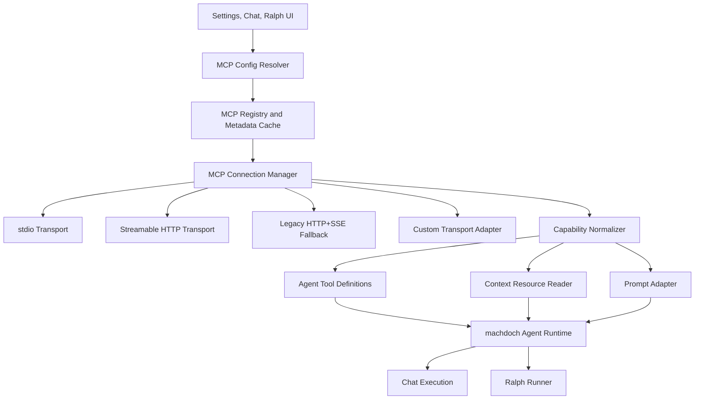

# MCP Consumer System Specification

Status: Draft
Date: 2026-06-13
Scope: machdoch as an MCP consumer. machdoch talks to external MCP servers; it does not expose its own MCP server in this specification.

## Source Baseline

This specification is based on the MCP 2025-11-25 specification and the product decisions captured in the MCP interview.

Primary protocol references:

- MCP specification: https://modelcontextprotocol.io/specification/2025-11-25
- Lifecycle: https://modelcontextprotocol.io/specification/2025-11-25/basic/lifecycle
- Transports: https://modelcontextprotocol.io/specification/2025-11-25/basic/transports
- Authorization: https://modelcontextprotocol.io/specification/2025-11-25/basic/authorization
- Tools: https://modelcontextprotocol.io/specification/2025-11-25/server/tools
- Resources: https://modelcontextprotocol.io/specification/2025-11-25/server/resources
- Prompts: https://modelcontextprotocol.io/specification/2025-11-25/server/prompts
- Roots: https://modelcontextprotocol.io/specification/2025-11-25/client/roots
- Sampling: https://modelcontextprotocol.io/specification/2025-11-25/client/sampling
- Tasks: https://modelcontextprotocol.io/specification/2025-11-25/basic/utilities/tasks
- Cancellation: https://modelcontextprotocol.io/specification/2025-11-25/basic/utilities/cancellation
- Progress: https://modelcontextprotocol.io/specification/2025-11-25/basic/utilities/progress

The current standard MCP transports are:

- `stdio`
- Streamable HTTP, including JSON responses and optional SSE streams

Legacy HTTP+SSE from earlier MCP versions should be supported as a compatibility fallback. Custom transports are allowed as a pluggable extension point. WebSocket is not a standard MCP transport and is not part of the default system.

## Goals

- Add MCP support to normal chat execution and Ralph flows.
- Let users configure MCP servers fully inside the app.
- Support user/global configuration and workspace configuration.
- Provide weak, fast-iteration defaults suitable for power users, while still making every safety control configurable and overrideable by child contexts.
- Support tools, resources, and prompts from MCP servers.
- Support hybrid tool exposure: generic MCP meta-tools plus user-pinned direct tools.
- Support first-class presets for Serper, GitHub, Chrome DevTools, and custom MCP servers.
- Support autonomous Ralph execution with MCP, including deterministic MCP blocks.
- Preserve machdoch's existing ask/machdoch runtime split: read-only MCP tools can run in ask mode; side-effecting MCP tools run in machdoch mode.
- Capture enough metadata, logs, and run records to debug MCP behavior and reproduce Ralph runs.

## Non-Goals

- No per-call approval system.
- No MCP server hosted by machdoch.
- No encrypted secret storage in the first implementation. User config values are visible/plaintext for now.
- No MCP elicitation support. machdoch should stay autonomous. If an MCP server requests elicitation, return a structured unsupported error.
- No WebSocket transport unless a future custom transport plugin explicitly adds it.
- No hidden preset behavior. Presets are copied into editable config.

## Product Decisions

- MCP is available in both normal chat execution and Ralph flows.
- User config and workspace config are both supported.
- User config is mandatory because all MCP setup should be possible from the app.
- The user decides which tools are directly exposed when adding or editing an MCP server.
- Ralph supports both prompt-driven MCP tool use and deterministic MCP block execution.
- Chrome MCP remains separate from machdoch's existing browser tools.
- GitHub and Serper can be used both through existing machdoch features and through MCP presets.
- GitHub supports both remote OAuth and local stdio/Docker modes.
- Chrome supports both managed browser profile launch and connection to an existing Chrome debug port.
- Serper search results should be cached per run with configurable TTL and force-refresh support.
- MCP connections should be app-session pooled, with per-run logical scopes and idle shutdown.
- Ralph blocks in the same run share MCP connections so session state can survive across blocks.
- Tool catalogs are snapshotted at run start. A running flow does not silently pick up changed schemas.
- MCP progress and tool events feed into the existing machdoch timeline.

## Architecture



Core modules to add:

- `src/core/mcp/config.ts`: load, merge, validate, and save MCP config.
- `src/core/mcp/types.ts`: config, metadata, runtime, preset, and run-record types.
- `src/core/mcp/connection-manager.ts`: lifecycle, pooling, sessions, transport selection, reconnects.
- `src/core/mcp/transports/stdio.ts`: subprocess transport.
- `src/core/mcp/transports/streamable-http.ts`: current HTTP transport.
- `src/core/mcp/transports/legacy-sse.ts`: compatibility fallback.
- `src/core/mcp/authorization.ts`: OAuth and header/token handling.
- `src/core/mcp/discovery.ts`: tools/resources/prompts discovery and schema hashing.
- `src/core/mcp/tool-adapter.ts`: MCP tool to machdoch `AgentToolDefinition` conversion.
- `src/core/mcp/resource-adapter.ts`: resource read and context attachment support.
- `src/core/mcp/prompt-adapter.ts`: prompt invocation support.
- `src/core/mcp/presets.ts`: Serper, GitHub, Chrome DevTools, and custom templates.
- `src/core/mcp/run-cache.ts`: per-run caching for search/resource/tool outputs where configured.

Existing integration points:

- Extend `src/shared/runtime-config.schema.json` and regenerate runtime contracts.
- Extend `ToolName` with `mcp`.
- Extend `src/core/tools.ts` with an MCP registry entry.
- Extend `src/core/_helpers/agent-tools.ts` to include MCP tool definitions.
- Extend `src/core/ralph.ts` with MCP settings and block execution types.

## Configuration Model

Use dedicated config files for readability:

```text
~/.machdoch/mcp.json
.machdoch/mcp.json
```

User config contains global/default MCP server definitions, credentials, local command paths, packs, direct tool selections, and user-level metadata cache.

Workspace config contains project-specific enablement, overrides, server aliases, pack selection, tool restrictions, and workspace metadata cache.

Precedence:

1. Built-in preset template
2. User/global config
3. Workspace config
4. Chat/run override
5. Ralph flow override
6. Ralph block override

Child contexts merge with parents. They can narrow or expand enablement, tool selection, timeouts, output caps, and policies. They should not redefine secrets unless explicitly configured. A child can replace an entire server definition only with `replaceServer: true`.

If user and workspace config define the same server id with incompatible transports, endpoints, or command definitions, validation should flag a hard conflict unless one layer explicitly marks replacement.

### Example User Config

```json
{
  "schemaVersion": 1,
  "defaults": {
    "enabled": true,
    "connectOnStartup": false,
    "autoDiscoverOnEnable": true,
    "defaultToolExposure": "meta-and-pinned",
    "timeoutMs": 60000,
    "idleShutdownMs": 900000,
    "maxOutputBytes": 1048576,
    "unknownToolEffect": "external-side-effect",
    "roots": {
      "enabled": true,
      "includeWorkspaceRoot": true
    },
    "sampling": {
      "enabled": true,
      "allowTools": true,
      "maxDepth": 2
    },
    "tasks": {
      "enabled": true,
      "defaultTtlMs": 600000
    },
    "elicitation": {
      "enabled": false
    }
  },
  "packs": {
    "research": {
      "enabledServers": ["serper-main"],
      "pinnedTools": ["serper-main.search", "serper-main.scrape"]
    },
    "github-maintainer": {
      "enabledServers": ["github-main"],
      "pinnedToolsets": ["repos", "issues", "pull_requests", "actions"]
    },
    "browser-automation": {
      "enabledServers": ["chrome-main"],
      "pinnedTools": ["chrome-main.navigate_page", "chrome-main.take_snapshot"]
    }
  },
  "servers": {
    "github-main": {
      "displayName": "GitHub",
      "presetId": "github.remote",
      "enabled": true,
      "transport": {
        "type": "streamable-http",
        "url": "https://api.githubcopilot.com/mcp/"
      },
      "auth": {
        "type": "oauth",
        "tokenStorage": "user-config-plaintext"
      },
      "toolExposure": {
        "mode": "meta-and-pinned",
        "pinnedToolsets": ["repos", "issues", "pull_requests"]
      }
    },
    "serper-main": {
      "displayName": "Serper",
      "presetId": "serper.stdio",
      "enabled": true,
      "transport": {
        "type": "stdio",
        "command": "npx",
        "args": ["-y", "mcp-server-serper"],
        "env": {
          "SERPER_API_KEY": {
            "source": "user-config",
            "value": "visible-plaintext-api-key"
          }
        }
      },
      "cache": {
        "enabled": true,
        "ttlSeconds": 900
      }
    },
    "chrome-main": {
      "displayName": "Chrome DevTools",
      "presetId": "chrome-devtools.stdio",
      "enabled": false,
      "transport": {
        "type": "stdio",
        "command": "npx",
        "args": ["-y", "chrome-devtools-mcp@latest", "--isolated"]
      },
      "toolExposure": {
        "mode": "meta-and-pinned",
        "pinnedTools": ["navigate_page", "take_snapshot", "click"]
      }
    }
  }
}
```

### Example Workspace Override

```json
{
  "schemaVersion": 1,
  "activePack": "github-maintainer",
  "servers": {
    "github-main": {
      "policy": {
        "maxOutputBytes": 524288,
        "allowSideEffects": true
      },
      "toolExposure": {
        "pinnedToolsets": ["repos", "issues", "pull_requests", "actions"]
      }
    }
  },
  "aliases": {
    "github.default": {
      "serverId": "github-main"
    },
    "search.default": {
      "serverId": "serper-main"
    },
    "browser.chrome": {
      "serverId": "chrome-main"
    }
  }
}
```

## Presets

Presets are editable templates. Adding a preset copies the current template into user config with `presetId` metadata. Future preset updates should show diffs and suggestions, not mutate existing config silently.

### Serper

Modes:

- MCP stdio server using `SERPER_API_KEY`.
- Existing machdoch web search remains separate and available.

Expected pinned tools:

- search
- scrape/fetch, if provided by the selected Serper MCP server

Behavior:

- Cache search and scrape results per run.
- Include `forceRefresh` per call and per run.
- Surface quota/rate-limit errors as structured tool errors.
- Keep Serper MCP optional. Existing web search does not depend on it.

### GitHub

Modes:

- Remote GitHub MCP with OAuth.
- Local stdio/Docker GitHub MCP.
- GHES/custom base URL for local or custom server modes.

Expected toolsets:

- repos
- issues
- pull requests
- actions
- code search
- notifications, if supported

Behavior:

- Remote OAuth should implement protected resource discovery, authorization server discovery, PKCE/browser login, refresh, and scope challenge handling.
- Local stdio/Docker should use environment variables or visible user config tokens.
- Destructive tools are side-effecting but available in machdoch mode when enabled.
- GitHub rate limits should appear in tool output sections and timeline metadata when known.

### Chrome DevTools

Modes:

- Managed isolated browser profile.
- Existing Chrome debug port.

Behavior:

- Keep Chrome MCP separate from built-in machdoch browser tools.
- Allow use in Ralph autonomous runs when explicitly enabled for the flow/run.
- Cap screenshots, traces, DOM snapshots, and console logs.
- Treat browser state as server session state. Share the connection within a Ralph run.
- Expose managed profile path and cleanup behavior in settings.

## Transport Requirements

### stdio

The client launches an MCP server subprocess. Messages are JSON-RPC over newline-delimited UTF-8 on stdin/stdout.

Requirements:

- Use structured `command` and `args`, never shell-interpolated command strings.
- Arbitrary commands are allowed for power users.
- Capture stderr as logs. Do not treat stderr output as failure by itself.
- Reject stdout lines that are not valid MCP JSON-RPC messages.
- Terminate processes on app shutdown, server disable, idle timeout, or fatal protocol failure.
- Support environment values from visible user config or environment variables.
- Do not apply HTTP OAuth to stdio servers. Stdio credentials come from env/user config.

### Streamable HTTP

The server has a single MCP endpoint that accepts POST and optional GET. Clients must support:

- JSON responses.
- SSE responses from POST.
- Optional GET stream for server messages.
- `MCP-Session-Id` returned during initialization.
- `MCP-Protocol-Version` on subsequent requests.
- Reinitialize without session id after HTTP 404 for an expired session.
- HTTP DELETE session termination when supported.
- SSE event ids and `Last-Event-ID` resume when available.

### Legacy HTTP+SSE Fallback

Clients should try Streamable HTTP first. On documented fallback status codes, attempt legacy HTTP+SSE:

- Open the SSE endpoint.
- Read the endpoint event.
- Send subsequent JSON-RPC messages to the provided message endpoint.

This path exists only for compatibility with older servers.

### Custom Transports

Custom transports must implement the internal transport interface:

```ts
interface McpTransportAdapter {
  readonly type: string;
  connect(options: McpTransportConnectOptions): Promise<McpJsonRpcChannel>;
  close(reason?: string): Promise<void>;
}
```

Custom transports must preserve JSON-RPC semantics, lifecycle ordering, cancellation, and progress handling.

## Authorization

Support these auth types:

- `none`
- `env`
- `user-config`
- `bearer`
- `custom-headers`
- `oauth`

For HTTP OAuth:

- Parse `WWW-Authenticate` challenges.
- Discover protected resource metadata through challenge URLs and well-known URLs.
- Discover authorization server metadata through OAuth and OIDC well-known endpoints.
- Use PKCE.
- Include `resource` in authorization and token requests.
- Store tokens in visible/plaintext user config for now.
- Refresh tokens when possible.
- Handle 401, 403, insufficient scope, and step-up authorization.
- Never send an OAuth token to a different resource server.

Custom headers:

- Allow arbitrary user-configured headers.
- Header values may be literal plaintext or references to environment/user config.
- Workspace config can contain visible values, but user config should be preferred for personal tokens.

## Capability Support

### Tools

MCP tools become machdoch agent tools through two layers:

1. Meta-tools:
   - `mcp_list_servers`
   - `mcp_discover_capabilities`
   - `mcp_search_tools`
   - `mcp_inspect_tool`
   - `mcp_call_tool`
2. Direct pinned tools:
   - `mcp__github_main__create_issue`
   - `mcp__serper_main__search`
   - `mcp__chrome_main__take_snapshot`

Direct tool names are normalized and mapped back to the original MCP server/tool name. The mapping is stored in metadata cache and run records.

Tool effects:

- Server-provided annotations are used when trustworthy.
- User annotation overrides take precedence.
- Unknown tools default to `external-side-effect`.
- Read-only tools can run in ask mode.
- Side-effecting tools run only in machdoch mode.

Tool schema handling:

- Normalize MCP JSON Schema to provider-compatible strict schemas.
- Preserve the original schema hash.
- If schema normalization loses constraints, record a warning in discovery metadata.
- If a pinned tool schema changes, show it before using the updated direct tool.

### Resources

MCP resources should be available through:

- `mcp_list_resources`
- `mcp_read_resource`
- context attachment UI
- Ralph `MCP_RESOURCE` block
- optional context pack composition

Resource handling:

- Support pagination.
- Cap content size.
- Preserve MIME type.
- Convert text content into context sections.
- Convert image content into model image inputs when supported.
- Store large content as optional raw artifacts when configured.

### Prompts

MCP prompts should be available through:

- prompt UI with server prefix
- `mcp_list_prompts`
- `mcp_get_prompt`
- Ralph `MCP_PROMPT` block
- normal prompt block hydration

Prompt arguments should be rendered as a form where schema information exists, with JSON fallback.

### Roots

Support roots, gated by config.

Default:

- Expose the active workspace root as a file root when `roots.enabled` and `includeWorkspaceRoot` are true.
- Allow additional explicit roots in user/workspace config.
- Never expose home or drive roots implicitly.

### Sampling

Support sampling because some advanced MCP servers can request model calls from the client.

Behavior:

- Gated per server/pack/run.
- Uses machdoch's existing provider adapters.
- Supports optional tool-enabled sampling when configured.
- Enforces `maxDepth`, timeout, and output caps.
- Because machdoch is autonomous and no approval system is desired, sampling requests run automatically when enabled.
- If disabled, return a structured MCP error.

### Elicitation

Do not support elicitation.

Behavior:

- Do not advertise elicitation capability during initialization.
- If a server still sends an elicitation request, return a structured unsupported error.
- If a task enters `input_required` because of elicitation, mark it blocked or failed according to the caller context.

### Tasks

Support MCP tasks as an experimental capability.

Behavior:

- Advertise task capabilities when enabled.
- Respect tool-level `execution.taskSupport`.
- Use task augmentation when required or when configured for long-running tools.
- Poll `tasks/get` using `pollInterval`.
- Fetch final output with `tasks/result`.
- Support `tasks/list` in diagnostics.
- Cancel with `tasks/cancel` where supported.
- Also send MCP cancellation notifications and abort local requests on timeout/user stop.
- Record task ids, status transitions, and related metadata in run records.

## Discovery And Metadata Cache

Discovery reads:

- server info
- protocol version
- capabilities
- tools
- resources
- prompts
- toolsets/categories when server-specific metadata exists
- schema hashes
- user annotations

Discovery should be user-triggered when adding/editing a server, with buttons:

- Save
- Test
- Discover
- Enable

Discovery cache should allow the UI to show capabilities offline and detect changes later.

Metadata cache entry:

```json
{
  "serverId": "github-main",
  "discoveredAt": "2026-06-13T00:00:00.000Z",
  "protocolVersion": "2025-11-25",
  "serverInfo": {
    "name": "GitHub MCP",
    "version": "1.0.0"
  },
  "capabilitiesHash": "sha256:...",
  "tools": {
    "create_issue": {
      "name": "create_issue",
      "normalizedName": "mcp__github_main__create_issue",
      "schemaHash": "sha256:...",
      "effect": "external-side-effect",
      "userEffectOverride": null
    }
  }
}
```

## Connection Lifecycle

Connection manager responsibilities:

- Lazy connect when a server is enabled and first needed.
- Optionally connect during discovery/test.
- Maintain an app-session pool.
- Create per-chat and per-Ralph-run logical scopes.
- Share connections across Ralph blocks in the same run.
- Reuse server sessions until idle timeout.
- Shutdown idle servers.
- Reinitialize expired HTTP sessions.
- Snapshot catalogs at run start.
- Do not refresh schemas mid-run unless the user explicitly requests it.

Failure policy:

- Transport failure before tool call: return connection error.
- Protocol error during initialize: mark server unavailable.
- Tool-level MCP error: return tool error to model or Ralph block.
- Catalog changed after run start: continue with snapshot; warn after run.
- Server process crash: mark active calls failed and schedule reconnect only for future calls.

## Runtime Tool Exposure

Hybrid exposure is required.

Default for new servers:

- User chooses direct pinned tools during add/edit.
- Meta-tools are always available when MCP is enabled.
- Known presets may suggest direct tools or toolsets.

Tool exposure modes:

- `meta-only`
- `pinned-direct-only`
- `meta-and-pinned`
- `all-direct`

`all-direct` is allowed but should show a warning because large catalogs can degrade model performance.

Direct tool naming:

```text
mcp__<normalized-server-id>__<normalized-tool-name>
```

If a provider tool-name limit is hit, use a short generated suffix and keep the mapping in runtime metadata.

## Ask Mode And Machdoch Mode

Ask mode:

- Allows `read` and `external-read` MCP calls.
- Blocks `write` and `external-side-effect` MCP calls.
- Unknown MCP tools are blocked unless manually marked read-only.

Machdoch mode:

- Runs enabled MCP calls automatically.
- No approval prompts.
- Honors configured timeouts, caps, allowlists, denylists, and mode-specific policies.

## Ralph Integration

Ralph needs explicit MCP support.

### Ralph Settings

Add `settings.mcp` at flow, block, and run levels.

Example:

```json
{
  "settings": {
    "mcp": {
      "enabled": true,
      "pack": "github-maintainer",
      "enabledServers": ["github-main", "serper-main"],
      "aliases": {
        "github.default": "github-main",
        "search.default": "serper-main"
      },
      "toolExposure": {
        "mode": "meta-and-pinned",
        "pinnedTools": [
          "github.default.create_issue",
          "search.default.search"
        ]
      },
      "limits": {
        "maxCalls": 100,
        "timeoutMs": 60000,
        "maxOutputBytes": 1048576
      },
      "cache": {
        "enabled": true,
        "ttlSeconds": 900
      }
    }
  }
}
```

Flow and block settings merge with global/workspace settings. A block can narrow tools, override timeout, choose force-refresh, or disable a server for that block.

### New Ralph Block Types

Add:

- `MCP_TOOL`
- `MCP_RESOURCE`
- `MCP_PROMPT`

#### MCP_TOOL

Purpose: deterministic call to one MCP tool.

Fields:

```ts
interface RalphMcpToolBlock extends RalphBaseBlock {
  type: "MCP_TOOL";
  serverAlias: string;
  toolName: string;
  argumentMode: "json" | "schema-form" | "bindings";
  argumentsJson?: string;
  bindings?: Record<string, string>;
  outputRoutes?: RalphMcpOutputRoute[];
}
```

Argument input supports:

- JSON editor.
- Schema-generated form.
- Ralph variable/result bindings.

Outputs:

- `SUCCESS`
- `ERROR`
- status/error category outputs
- JSONPath result matches
- content match outputs
- custom configured route labels

Model/classifier routing should use a separate `DECISION` block, not hidden model work inside `MCP_TOOL`.

#### MCP_RESOURCE

Purpose: read a resource and inject it into downstream context.

Behavior:

- Stores content as a named block result.
- Can inject content into downstream prompt context.
- Can optionally write raw artifact files.
- Supports variable/resource URI bindings.

Outputs:

- `SUCCESS`
- `ERROR`
- optional content/status routes

#### MCP_PROMPT

Purpose: retrieve an MCP prompt and render it with arguments.

Behavior:

- Can hydrate a downstream `PROMPT` block.
- Can store the rendered prompt as context.
- Supports schema form, JSON, and variable bindings.

Outputs:

- `SUCCESS`
- `ERROR`

### Ralph Validation

Validation should use cached metadata by default. Add optional live validation for:

- test connection
- preflight run
- explicit user action

Hard blockers:

- referenced server alias not found
- referenced tool/resource/prompt missing in cached metadata
- missing auth when known required
- invalid argument JSON
- argument schema mismatch for deterministic blocks
- task required but tasks disabled
- elicitation required by a selected capability

Warnings:

- cached metadata stale
- schema changed since flow was last saved
- output route JSONPath does not match known schema
- unknown tool effect defaults to side-effecting
- server disabled globally but enabled by Ralph override
- output/log cap may truncate result

### Ralph Run Records

Ralph run records should include:

- enabled MCP pack
- resolved aliases
- server ids
- transport type
- protocol version
- server info
- tool/resource/prompt names
- schema hashes
- task ids and status transitions
- timing
- cache hit/miss
- capped output summaries
- optional raw artifact references

Do not persist unlimited blobs in `.machdoch/ralph/runs`.

Default log behavior:

- capped/redacted summaries
- optional raw artifacts per run/server/tool

## UI Requirements

### Settings

Add Settings dialog panel: `MCP Servers`.

Panel features:

- server list
- add preset
- add custom server
- edit transport
- edit auth
- edit headers/env
- edit tool exposure
- edit annotations
- test connection
- discover capabilities
- enable/disable server
- show metadata cache
- show schema changes
- show logs

### Add/Edit Server Flow

1. Choose preset or custom.
2. Fill transport.
3. Fill auth/headers/env.
4. Save.
5. Test.
6. Discover.
7. Choose direct pinned tools/toolsets.
8. Enable.

The user can skip testing/discovery, but direct tools require cached metadata.

### Chat UI

Add compact MCP selector:

- active pack
- enabled servers
- pinned direct tools
- meta-tool availability
- per-run overrides
- force refresh toggle for cached MCP data

### Ralph UI

Add MCP to:

- flow settings
- block inspector
- block palette
- run preflight panel
- live run timeline
- run transcript

MCP blocks should have distinct styling from existing PROMPT/VALIDATOR/DECISION/PACK blocks.

## Security And Power-User Policy

Default posture is weak and fast-iteration oriented:

- servers can be enabled broadly
- side-effecting tools can run automatically in machdoch mode
- visible plaintext config is allowed
- arbitrary stdio commands are allowed

Still required:

- explicit server enablement
- per-server and per-context allow/deny lists
- timeouts
- output caps
- idle shutdown
- structured argv
- no shell interpolation
- URL validation for remote servers
- token redaction in normal logs where practical
- schema-change visibility
- prompt-injection hardening around tool descriptions

Prompt-injection and tool-poisoning controls:

- Treat MCP tool descriptions as untrusted data.
- Do not concatenate MCP descriptions into system instructions without boundaries.
- Keep discovered tool descriptions separate from repo instructions.
- Record schema and description hashes.
- Warn when pinned direct tools change.
- Do not let MCP server metadata modify runtime policy.

## Edge Cases

Protocol and lifecycle:

- unsupported protocol version
- initialization timeout
- missing `initialized`
- server advertises capability but method fails
- notifications arrive before initialization completes
- invalid JSON-RPC ids
- duplicate response ids
- notification flood

Transports:

- stdio process exits during initialize
- stdout contains non-JSON logs
- stderr is noisy but non-fatal
- process cannot be killed
- HTTP returns JSON where SSE expected
- HTTP returns SSE where JSON expected
- expired `MCP-Session-Id`
- missing or invalid protocol version header
- GET stream unsupported
- SSE disconnect before final response
- duplicate SSE event replay
- legacy SSE endpoint discovery failure

Auth:

- 401 without resource metadata
- multiple authorization servers
- issuer with path components
- expired refresh token
- insufficient scope
- step-up auth required during a run
- token configured for wrong resource
- custom header missing

Tools:

- invalid input schema
- schema uses unsupported JSON Schema features
- duplicate tool names
- huge tool catalog
- tool disappears after being pinned
- tool returns `isError: true`
- tool returns binary/large image
- tool result exceeds cap
- tool requires task augmentation
- task enters `input_required`

Resources and prompts:

- pagination cursor loop
- binary resource without MIME type
- prompt argument schema missing
- resource URI template ambiguity
- server sends stale resource update notifications

Ralph:

- flow references server alias not present in current workspace
- cached schema stale during run
- block route JSONPath never matches
- shared Chrome session crashes mid-run
- infinite Ralph loop plus long MCP task
- run stopped while task still executing
- raw artifact write fails

Presets:

- Serper API quota exhausted
- GitHub token lacks org access
- GitHub GHES URL differs from public GitHub schema
- Chrome debug port unavailable
- Chrome profile locked by another process
- Chrome MCP launches browser on wrong display/session

## Implementation Plan

1. Add MCP contract types.
   - Extend runtime config schema with MCP config references.
   - Add `mcp` to `ToolName`.
   - Generate TypeScript/Rust runtime contracts.

2. Add config loader and merger.
   - Load `~/.machdoch/mcp.json`.
   - Load `.machdoch/mcp.json`.
   - Merge with pack/chat/Ralph overrides.
   - Validate conflicts and replacement rules.

3. Add preset templates.
   - Serper stdio.
   - GitHub remote OAuth.
   - GitHub local stdio/Docker.
   - Chrome DevTools managed profile.
   - Chrome DevTools debug-port connection.
   - Custom server.

4. Add transport layer.
   - Implement stdio transport.
   - Implement Streamable HTTP transport.
   - Implement legacy HTTP+SSE fallback.
   - Add custom transport interface.
   - Add protocol-level cancellation and progress handling.

5. Add authorization layer.
   - Implement none/env/user-config/bearer/custom-headers.
   - Implement OAuth protected-resource discovery.
   - Implement browser login and token refresh.
   - Store tokens visibly in user config for now.

6. Add connection manager.
   - Lazy connect.
   - App-session pool.
   - Per-run scopes.
   - Idle shutdown.
   - HTTP session reinitialization.
   - stdio process cleanup.

7. Add discovery and metadata cache.
   - Discover tools/resources/prompts.
   - Hash schemas and descriptions.
   - Store normalized direct-tool mappings.
   - Detect changed capabilities.

8. Add MCP tool adapters.
   - Meta-tools.
   - Direct pinned tools.
   - Effect classification and user overrides.
   - Ask/machdoch mode compatibility.
   - Output normalization and caps.

9. Add resource and prompt adapters.
   - Resource read and attach to context.
   - Prompt invocation and argument forms.
   - Integrate with existing prompt and context pack patterns.

10. Add sampling and tasks.
   - Sampling through existing provider adapters.
   - Sampling depth/cost/time limits.
   - Task creation, polling, result retrieval, listing, and cancellation.
   - Elicitation unsupported responses.

11. Add UI.
   - Settings MCP panel.
   - Add/edit/test/discover/enable flow.
   - Chat MCP selector.
   - Tool pinning and annotation editing.
   - Metadata/schema-change views.

12. Add Ralph integration.
   - Extend schema with MCP settings.
   - Add `MCP_TOOL`, `MCP_RESOURCE`, `MCP_PROMPT`.
   - Add validators, editor forms, block execution, routing, run logs.
   - Add live run timeline integration.

13. Add preset-specific polish.
   - Serper cache behavior.
   - GitHub OAuth and local token guidance.
   - Chrome managed/existing profile controls.

14. Add tests.
   - Config merge unit tests.
   - Transport protocol tests with mock servers.
   - OAuth discovery tests.
   - Tool schema normalization tests.
   - Agent tool adapter tests.
   - Ralph validation and execution tests.
   - UI tests for add/edit/discover/pinning.

15. Add diagnostics.
   - Server status panel.
   - Last discovery result.
   - Last connection error.
   - MCP timeline events.
   - Exportable debug bundle with secrets redacted where practical.

## Verification Strategy

Unit tests:

- config precedence and conflict validation
- schema normalization
- tool-name normalization
- effect classification
- metadata cache hash changes
- Ralph block validation
- task state handling

Integration tests:

- stdio mock server
- Streamable HTTP JSON mock server
- Streamable HTTP SSE mock server
- legacy HTTP+SSE mock server
- OAuth challenge and token refresh mock server
- task-enabled tool mock server

UI tests:

- add preset
- custom server config
- test/discover/enable
- direct tool pinning
- user effect override
- Ralph MCP block editor

Manual smoke tests:

- Serper search via MCP and existing web search.
- GitHub remote OAuth discovery and read operation.
- GitHub local MCP with token.
- Chrome DevTools managed profile navigate and snapshot.
- Ralph flow using Serper search, GitHub issue creation, and Chrome snapshot in one run.

## Open Follow-Ups

- Decide exact plaintext user config location on Windows, macOS, and Linux if it differs from `~/.machdoch/mcp.json`.
- Decide whether OAuth browser login is handled in the Tauri app window or external browser.
- Decide whether raw MCP artifacts should live under `.machdoch/mcp/artifacts` or under per-run directories only.
- Decide how much MCP configuration should be exported/imported through future app backup flows.
