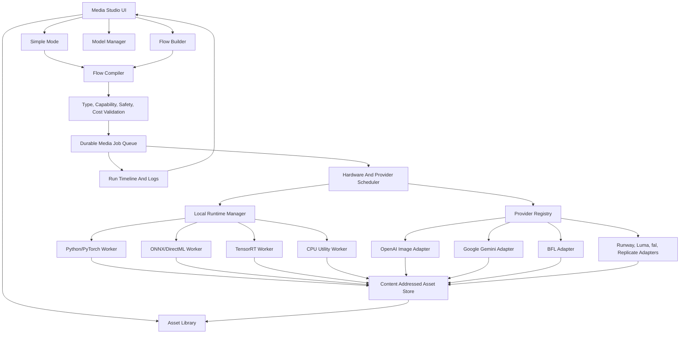

# Media Studio And Media Flow System Specification

Status: Draft
Date: 2026-06-16
Scope: A first-class machdoch app for local-first media generation, editing, automation, asset lineage, and flow-based media workflows. This is separate from normal chat and Ralph.

## Source Baseline

This specification is based on machdoch's current product shape and online research into current media generation tools, runtimes, models, APIs, and papers.

Existing machdoch context:

- machdoch is a local-first OS AI agent for CLI and desktop.
- Normal chat is task/chat oriented.
- Ralph is a graph-based autonomous prompt flow runner for agent work.
- Ralph should not become the media workflow surface. Media generation needs canvas, timeline, model installation, GPU scheduling, asset lineage, and typed media dataflow.

Primary product and runtime references:

- ComfyUI workflow API format: https://docs.comfy.org/development/api-development/workflow-api-format
- InvokeAI invocations architecture: https://invoke.ai/development/architecture/invocations/
- InvokeAI run workflow on canvas: https://invoke.ai/features/canvas/run-workflow/
- Hugging Face Diffusers pipelines: https://huggingface.co/docs/diffusers/en/api/pipelines/overview
- Diffusers memory optimization: https://huggingface.co/docs/diffusers/en/optimization/memory
- Diffusers Wan pipeline: https://huggingface.co/docs/diffusers/en/api/pipelines/wan
- OpenAI image generation API: https://developers.openai.com/api/docs/guides/image-generation
- OpenAI GPT Image 2 model: https://developers.openai.com/api/docs/models/gpt-image-2
- OpenAI Sora video generation API deprecation notice: https://developers.openai.com/api/docs/guides/video-generation
- OpenAI Sora discontinuation FAQ: https://help.openai.com/en/articles/20001152-what-to-know-about-the-sora-discontinuation
- OpenAI content provenance announcement: https://openai.com/index/advancing-content-provenance/
- OpenAI C2PA and SynthID FAQ: https://help.openai.com/en/articles/8912793-c2pa-and-synthid-in-openai-generated-images
- Google Flow creative studio: https://labs.google/fx/tools/flow
- Google Gemini image generation: https://ai.google.dev/gemini-api/docs/image-generation
- Google Gemini video generation with Veo: https://ai.google.dev/gemini-api/docs/video
- Google Gemini API changelog and model deprecations: https://ai.google.dev/gemini-api/docs/changelog
- Google Veo first/last frame video flow: https://docs.cloud.google.com/gemini-enterprise-agent-platform/models/video/generate-videos-from-first-and-last-frames
- Google Gemini Omni announcement: https://blog.google/innovation-and-ai/models-and-research/gemini-models/gemini-omni/
- Google Gemini Omni model page: https://deepmind.google/models/gemini-omni/
- Google Gemini Omni Flash model card: https://deepmind.google/models/model-cards/gemini-omni-flash/
- Google Veo model page: https://deepmind.google/models/veo/
- Google SynthID safeguards: https://ai.google.dev/responsible/docs/safeguards/synthid
- Black Forest Labs FLUX.2: https://bfl.ai/models/flux-2
- FLUX.2 dev weights: https://huggingface.co/black-forest-labs/FLUX.2-dev
- FLUX.2 klein 4B weights: https://huggingface.co/black-forest-labs/FLUX.2-klein-4B
- FLUX.2 klein LoRA training guide: https://huggingface.co/blog/black-forest-labs/flux-2-klein-lora
- Runway Gen-4 research: https://runwayml.com/research/introducing-runway-gen-4
- Runway API: https://docs.dev.runwayml.com/
- Runway video transformation with Aleph: https://academy.runwayml.com/tutorial/how-to-transform-videos
- Luma API: https://lumalabs.ai/api
- Luma video generation docs: https://docs.lumalabs.ai/docs/video-generation
- fal model APIs: https://fal.ai/
- Replicate video model collections: https://replicate.com/collections/text-to-video
- Adobe Firefly: https://www.adobe.com/products/firefly.html
- Adobe Firefly API: https://developer.adobe.com/firefly-services/docs/firefly-api/
- Adobe Firefly video generation: https://www.adobe.com/products/firefly/features/ai-video-generator.html
- Adobe Firefly image-to-video first/last frame docs: https://helpx.adobe.com/firefly/web/work-with-audio-and-video/work-with-video/generate-videos-using-images.html
- Kling AI API docs: https://app.klingai.com/global/dev/document-api/quickStart/productIntroduction/overview
- Kling AI start/end frame docs: https://kling.ai/quickstart/ai-video-start-end-frames
- Pika API: https://pika.art/api
- Pika 2.2 API through fal: https://fal.ai/models/fal-ai/pika/v2.2/image-to-video/api
- LTX Studio: https://ltx.io/studio
- LTX API docs: https://docs.ltx.video/
- LTX Studio 2026 features: https://ltx.io/blog/top-ltx-studio-features
- Krea AI creative suite: https://www.krea.ai/
- Krea realtime image generation: https://www.krea.ai/realtime
- Krea realtime video: https://www.krea.ai/index/announcing-realtime-video
- Leonardo Flow State product page: https://leonardo.ai/fast-track-your-creativity-with-flow-state
- Leonardo Flow State: https://intercom.help/leonardo-ai/en/articles/10002805-flow-state
- Qwen Image: https://github.com/QwenLM/Qwen-Image
- Qwen Image Edit: https://huggingface.co/Qwen/Qwen-Image-Edit
- Qwen Image Edit 2511: https://huggingface.co/Qwen/Qwen-Image-Edit-2511
- Qwen Image Edit 2511 release notes: https://qwen.ai/blog?id=qwen-image-edit-2511
- Wan 2.2: https://github.com/Wan-Video/Wan2.2
- Wan 2.1 VACE: https://github.com/Wan-Video/Wan2.1/
- VACE implementation: https://github.com/ali-vilab/VACE
- VACE project page: https://ali-vilab.github.io/VACE-Page/
- HunyuanVideo 1.5: https://github.com/Tencent-Hunyuan/HunyuanVideo-1.5
- LTX-Video: https://github.com/Lightricks/LTX-Video
- FramePack: https://github.com/lllyasviel/FramePack
- Segment Anything 2: https://github.com/facebookresearch/sam2
- BRIA RMBG 2.0: https://huggingface.co/briaai/RMBG-2.0
- BiRefNet: https://github.com/ZhengPeng7/BiRefNet
- Real-ESRGAN: https://github.com/xinntao/Real-ESRGAN
- Depth Anything V2: https://github.com/DepthAnything/Depth-Anything-V2
- Video Depth Anything: https://github.com/DepthAnything/Video-Depth-Anything
- Hunyuan3D 2.1: https://github.com/tencent-hunyuan/Hunyuan3D-2.1
- TRELLIS: https://github.com/microsoft/TRELLIS
- TRELLIS.2: https://microsoft.github.io/TRELLIS.2/
- TripoSR: https://github.com/VAST-AI-Research/TripoSR
- Stable Fast 3D: https://github.com/Stability-AI/stable-fast-3d
- Stable Audio Open: https://huggingface.co/stabilityai/stable-audio-open-1.0
- C2PA technical specification: https://spec.c2pa.org/specifications/specifications/2.4/specs/C2PA_Specification.html
- C2PA overview: https://c2pa.org/
- Content Credentials: https://contentcredentials.org/
- Adobe Content Credentials overview: https://helpx.adobe.com/ca/creative-cloud/apps/adobe-content-authenticity/content-credentials/overview.html
- AMD Windows ML acceleration: https://www.amd.com/en/blogs/2026/advancing-windows-ml-acceleration-with-amd-at-microsoft-build-2026.html
- Microsoft Windows ML execution providers: https://learn.microsoft.com/en-us/windows/ai/new-windows-ml/supported-execution-providers
- AMD PyTorch on Windows release notes: https://www.amd.com/en/resources/support-articles/release-notes/RN-AMDGPU-WINDOWS-PYTORCH-7-2.html
- AMD ROCm PyTorch install docs: https://rocm.docs.amd.com/projects/install-on-linux/en/latest/install/3rd-party/pytorch-install.html
- ONNX Runtime DirectML execution provider: https://onnxruntime.ai/docs/execution-providers/DirectML-ExecutionProvider.html
- AMD DirectML flow guidance: https://ryzenai.docs.amd.com/en/latest/gpu/ryzenai_gpu.html
- NVIDIA TensorRT for RTX: https://developer.nvidia.com/blog/nvidia-tensorrt-for-rtx-introduces-an-optimized-inference-ai-library-on-windows/
- NVIDIA high-performance TensorRT for RTX apps: https://developer.nvidia.com/blog/run-high-performance-ai-applications-with-nvidia-tensorrt-for-rtx/
- NVIDIA TensorRT FP4 image generation: https://developer.nvidia.com/blog/nvidia-tensorrt-unlocks-fp4-image-generation-for-nvidia-blackwell-geforce-rtx-50-series-gpus/
- NVIDIA RTX AI app ecosystem: https://developer.nvidia.com/ai-apps-for-rtx-pcs
- NVIDIA Model Optimizer: https://github.com/NVIDIA/Model-Optimizer
- Diffusers video generation guide: https://huggingface.co/docs/diffusers/en/using-diffusers/text-img2vid
- Diffusers GGUF quantization: https://github.com/huggingface/diffusers/blob/main/docs/source/en/quantization/gguf.md
- Diffusers xDiT optimization: https://huggingface.co/docs/diffusers/en/optimization/xdit
- Diffusers ParaAttention optimization: https://github.com/huggingface/diffusers/blob/main/docs/source/en/optimization/para_attn.md

Primary NPM implementation references:

- XYFlow React: https://reactflow.dev/
- TanStack Query: https://tanstack.com/query/latest
- TanStack Table: https://tanstack.com/table/latest
- TanStack Virtual: https://tanstack.com/virtual/latest
- Zustand: https://zustand.docs.pmnd.rs/
- Radix UI primitives: https://www.radix-ui.com/primitives
- Tailwind CSS: https://tailwindcss.com/
- dnd kit: https://dndkit.com/
- React Hook Form: https://react-hook-form.com/
- Zod: https://zod.dev/
- Ajv: https://ajv.js.org/
- ELK.js: https://github.com/kieler/elkjs
- React Resizable Panels: https://react-resizable-panels.vercel.app/
- cmdk: https://cmdk.paco.me/
- Sonner: https://sonner.emilkowal.ski/
- React Hotkeys Hook: https://react-hotkeys-hook.vercel.app/
- tldraw SDK: https://tldraw.dev/
- Konva React: https://konvajs.org/docs/react/
- PixiJS: https://pixijs.com/
- Three.js: https://threejs.org/
- React Three Fiber: https://r3f.docs.pmnd.rs/
- Drei: https://drei.docs.pmnd.rs/
- WaveSurfer: https://wavesurfer.xyz/
- Mediabunny: https://mediabunny.dev/
- ffmpeg.wasm: https://ffmpegwasm.netlify.app/docs/overview/
- Remotion: https://www.remotion.dev/
- Comlink: https://github.com/GoogleChromeLabs/comlink
- p-queue: https://github.com/sindresorhus/p-queue
- nanoid: https://github.com/ai/nanoid
- Motion: https://motion.dev/

Primary research references:

- ControlNet: https://arxiv.org/abs/2302.05543
- IP-Adapter: https://arxiv.org/abs/2308.06721
- InstantID: https://arxiv.org/abs/2401.07519
- LoRA: https://arxiv.org/abs/2106.09685
- VACE paper: https://arxiv.org/abs/2503.07598
- FramePack paper: https://huggingface.co/papers/2504.12626
- HunyuanVideo 1.5 technical report: https://arxiv.org/html/2511.18870v1
- Depth Anything V2 paper: https://proceedings.neurips.cc/paper_files/paper/2024/hash/26cfdcd8fe6fd75cc53e92963a656c58-Abstract-Conference.html
- Video Depth Anything paper: https://openaccess.thecvf.com/content/CVPR2025/papers/Chen_Video_Depth_Anything_Consistent_Depth_Estimation_for_Super-Long_Videos_CVPR_2025_paper.pdf
- Stand-In identity-preserving video generation: https://github.com/WeChatCV/Stand-In
- Phantom subject-consistent video generation: https://arxiv.org/html/2502.11079v1
- DiTFlow video motion transfer: https://arxiv.org/abs/2412.07776
- EditCtrl efficient local/global video editing: https://arxiv.org/html/2602.15031v2
- MaskINT video editing masked transformers: https://maskint.github.io/
- TeaCache diffusion caching: https://github.com/ali-vilab/TeaCache
- xDiT diffusion transformer inference engine: https://github.com/xdit-project/xdit
- AdaCache paper: https://openaccess.thecvf.com/content/ICCV2025/papers/Kahatapitiya_Adaptive_Caching_for_Faster_Video_Generation_with_Diffusion_Transformers_ICCV_2025_paper.pdf
- BWCache paper: https://arxiv.org/html/2509.13789v3
- Cache-DiT docs: https://cache-dit.readthedocs.io/en/latest/
- Video motion transfer with DiTs project: https://ditflow.github.io/
- Awesome multi-image generation references: https://github.com/AIDC-AI/Awesome-Multi-Image-Generation

Important research conclusions:

- Existing node tools prove demand for graph workflows, but many are hard to install, hard to debug, and weakly typed at the product level.
- A production media graph should separate saved UI layout from compiled execution graph.
- Output display should be explicit. InvokeAI's canvas output pattern is a good idea: a branch should declare what should be shown or exported.
- Local model execution needs memory-aware scheduling. Diffusers documents offload and device mapping because large pipelines often exceed commodity VRAM.
- Local video execution also needs optimization policy as a first-class runtime concern. xDiT, TeaCache, AdaCache, BWCache, Cache-DiT, ParaAttention, quantization, VAE tiling, and CPU/GPU offload can change speed, memory, quality, and determinism, so they must be declared and measured rather than hidden behind a "fast" switch.
- Modern image editing is moving toward multi-reference and instruction-based editing, seen in GPT Image, Gemini image generation, FLUX.2, and Qwen Image Edit.
- Modern video generation needs start frames, end frames, reference images, frame extension, interpolation, and careful frame-count handling. Google Veo's first/last-frame API and current local video projects make start/end keyframes a core data type, not a special-case feature.
- Modern video editing is moving toward "any input to video" and conversational edit loops. Gemini Omni/Flow, Runway Aleph, LTX, and Krea suggest that user-facing editing should be captured as structured edit intents, not only as freeform prompts.
- All-in-one video creation/editing systems such as VACE show that reference-to-video, video-to-video, masked video editing, motion control, object swap, expansion, and animation should be modeled as reusable condition packs rather than unrelated one-off nodes.
- Current creative suites are converging on ideation boards, rapid variant streams, reference-controlled video, storyboard generation, retakes, scene continuity, and timeline/canvas editing rather than one-shot prompt boxes.
- Provider models and endpoints are now moving targets. Google has current image model deprecations in its Gemini API changelog, so the product needs provider lifecycle metadata, deprecation warnings, and migration checks instead of hardcoded model ids.
- Endpoint removal is not theoretical. OpenAI's Sora API deprecation and discontinuation notices reinforce that video provider integrations must be removable without breaking saved local flows or hiding the reason from users.
- Consumer-local image generation is becoming more realistic. FLUX.2 klein 4B is positioned for consumer GPUs and has a practical LoRA training loop; the catalog should distinguish full, distilled, quantized, and trainable variants.
- Multi-image and subject-consistent generation should be treated as a first-class workflow family, not just an image-list input. Reference roles, identity locks, negative reference constraints, and consistency evaluation must be typed.
- Motion transfer and efficient local editing papers show that motion, identity, region masks, attention-derived motion fields, and protected regions should be inspectable graph values.
- API aggregators are useful for model breadth, but provider abstraction must avoid locking the product to any single aggregator.
- AMD support is now realistic but cannot be treated exactly like NVIDIA. Use ROCm/PyTorch where supported and ONNX Runtime DirectML as a Windows fallback path.
- Windows ML is becoming a vendor execution-provider surface for NVIDIA, AMD, Intel, and CPU inference. Treat it as a capability path for ONNX/optimized models, not as a substitute for PyTorch model runners.
- NVIDIA support should start with CUDA/PyTorch and expose TensorRT/TensorRT for RTX as an optimized path where models and hardware support it.
- Provenance is becoming part of the generation stack. C2PA Content Credentials and SynthID-style watermark checks should be first-class output/export concerns, while the UI must avoid claiming that provenance metadata alone proves authenticity.
- Video utility models are becoming important graph primitives. Video Depth Anything-style depth maps can support stable camera moves, relighting, video-to-video controls, and consistency checks across long clips.

Design lessons from current tools:

- ComfyUI proves that visual graphs are powerful, but saved UI graphs and execution graphs should be separate and strongly typed for product reliability.
- InvokeAI's invocation/canvas model is useful because canvas outputs are explicit and workflows can operate directly on creative surfaces.
- Adobe Firefly, Krea, and Leonardo show that fast ideation streams and boards are as important as final exports.
- Runway, Luma, Kling, Pika, Google Veo, and Adobe Firefly emphasize reference consistency, keyframes, first/last-frame transitions, video extension, interpolation, and async generation jobs.
- Google Flow/Gemini Omni and LTX Studio show that script-to-storyboard, retake, timeline, elements/characters, audio, and conversational edit history should be product primitives.
- Krea realtime video shows that draw/paint/move controls should map to structured condition nodes, not only prompt text.
- fal and Replicate show that broad model routing is useful, but machdoch should own job records, privacy controls, and asset lineage.
- Google and OpenAI provenance moves show that generated assets need local lineage plus exportable standard metadata. These should be separate because platform metadata may be stripped while local run records remain durable.
- Current endpoint deprecations show that provider adapters need automated freshness checks, test fixtures per active endpoint, and a visible "will stop working on date X" warning before users build flows around unstable models.
- Official provider docs increasingly expose model-specific parameter shapes rather than one universal video API. The adapter layer must normalize provider-specific knobs into typed capability fields while preserving advanced provider options in explicit override objects.

## Product Positioning

Media Studio is a separate machdoch app surface with two primary modes:

- Simple Mode: task-focused generation and editing for users who do not want to build graphs.
- Flow Mode: typed node graph workflows for repeatable, inspectable, local or remote media pipelines.

Simple Mode is not a reduced system. It is a curated front end over the same flow runtime. Each simple action compiles to a media flow that can be inspected, saved, forked, and automated.

Media Studio must feel like an application, not a wrapper around model scripts. It owns model setup, hardware checks, queueing, previews, run records, asset library, and exports.

## Goals

- Provide an easy local-first experience for image, video, background removal, upscaling, masking, asset preparation, 3D generation, and audio generation.
- Support both local generation and remote provider generation through the same job and flow abstraction.
- Support NVIDIA and AMD hardware with explicit runtime capability detection.
- Create a typed media graph system that can express complex pipelines without depending on ComfyUI, Automatic1111, or any external workflow server.
- Provide first-class asset lineage: every generated asset stores prompt, model, seed, provider, input assets, node path, software versions, and export details.
- Make reproducibility and variation deliberate: seeds, prompts, models, adapters, scheduler settings, dimensions, and parent assets are first-class values.
- Support chained workflows, including character progression, variant expansion, start/end keyframe video, product photography, sprite sheets, and batch processing.
- Support provider capability negotiation so every node can be compiled to local or remote execution only when the selected runtime can actually satisfy it.
- Support provider lifecycle negotiation so a flow can detect removed, deprecated, preview-only, region-restricted, or replacement model ids before it runs.
- Support structured edit intent capture for conversational edits, retakes, storyboard changes, motion brush edits, and local region edits.
- Support explicit optimization policies for local generation: quantization, offload, tiling, attention/caching acceleration, parallelism, and optimized engines.
- Support long-running jobs with durable queue records, cancellation, resume where possible, retries, partial output handling, and cost/time estimates.
- Support explicit privacy controls for remote provider uploads.
- Support provenance, watermark, and content credential workflows for generated, edited, imported, and exported assets.
- Support future extension through signed node packs and provider adapters, without executing arbitrary untrusted nodes.

## Non-Goals

- No ComfyUI backend.
- No Automatic1111 backend.
- No InvokeAI backend.
- No external workflow server dependency.
- No Ralph media nodes as the primary UX.
- No arbitrary remote custom nodes from untrusted sources.
- No hidden model downloads.
- No hidden cloud fallback.
- No workflow format that is tied to a third-party graph library.
- No "one JSON blob with everything" execution model. UI layout, declarative flow, compiled execution plan, and run records are separate artifacts.

## Product Principles

- Local-first: local generation is a first-class path, not an afterthought.
- Cloud-optional: remote providers are explicit execution targets with visible cost, privacy, and availability implications.
- Typed graph first: nodes declare input and output types, constraints, batching behavior, side effects, and hardware needs.
- Intent first for creative edits: natural-language edits are converted into typed edit intents and condition packs before execution.
- Explicit outputs: previews, saved assets, exports, and canvas/timeline results are declared by output nodes.
- Hardware-aware: the app must detect devices, memory, drivers, runtimes, and model compatibility before running jobs.
- Optimization-aware: runtime speedups and memory reductions are explicit policies with quality, determinism, and reproducibility metadata.
- Durable runs: jobs survive app restarts and preserve enough metadata to debug, rerun, branch, or export.
- Visual iteration: previews, comparison, ranking, and branching are central.
- Human control: long jobs are cancellable, pausable where possible, and restartable from checkpoints when the runtime supports it.
- Composable workflows: simple tasks, flows, batch jobs, templates, and automations compile to the same runtime.
- No silent degradation: if a provider cannot honor seed, alpha, start/end keyframes, resolution, or safety settings, the UI must show that before execution.
- Lifecycle-aware providers: preview, deprecated, removed, quota-limited, or region-limited models must be visible before a run starts.
- Provenance-aware exports: generated assets keep local lineage, can attach standards-based credentials where supported, and never claim that metadata proves truth or authenticity.

## Architecture



Core modules to add:

- `src/core/media/types.ts`: shared flow, node, port, asset, run, provider, model, and hardware types.
- `src/core/media/schema.ts`: validators and normalization for media JSON artifacts.
- `src/core/media/asset-store.ts`: content addressed media storage, metadata, thumbnails, lineage, and garbage collection.
- `src/core/media/flow-store.ts`: flow, revision, template, and preset storage.
- `src/core/media/compiler.ts`: typed graph validation and execution plan generation.
- `src/core/media/capabilities.ts`: provider and model capability matching.
- `src/core/media/job-queue.ts`: durable queued runs with cancellation and resume metadata.
- `src/core/media/scheduler.ts`: GPU, CPU, cloud, cost, and concurrency scheduling.
- `src/core/media/provider-registry.ts`: local and remote provider adapter registration.
- `src/core/media/provider-lifecycle.ts`: provider model freshness, deprecation dates, endpoint migrations, and active capability checks.
- `src/core/media/providers/*`: OpenAI, Google, BFL, fal, Replicate, Luma, Runway, local Diffusers, local native model adapters.
- `src/core/media/hardware.ts`: device discovery, runtime probes, driver/runtime versions, VRAM estimates.
- `src/core/media/model-catalog.ts`: local/remote model catalog, install plans, checksums, licenses, and compatibility.
- `src/core/media/provenance.ts`: local lineage, C2PA manifest handling, watermark detection hooks, export metadata policy, and verification reports.
- `src/core/media/training.ts`: dataset curation, LoRA/adapter training jobs, evaluation runs, and trained adapter packaging.
- `src/core/media/edit-intents.ts`: structured edit commands for conversational media editing, retakes, scene changes, region edits, motion edits, and storyboard revisions.
- `src/core/media/optimization.ts`: runtime optimization policies, quantization metadata, cache/tiling/offload settings, engine build plans, and quality validation.
- `src/core/media/storyboard.ts`: scripts, beats, scenes, shots, continuity rules, retakes, audio cues, and timeline assembly contracts.
- `src/core/media/export.ts`: export profiles, format conversion, metadata stripping, and package generation.
- `src/tauri/media_commands.rs`: Tauri commands for queue, assets, models, previews, file picking, and hardware probes.
- `src/ui/media/*`: Media Studio UI, flow builder, asset library, model manager, canvas, timeline, and run inspector.
- `src-python/media_worker/*`: Python worker package for PyTorch/Diffusers/native model execution.
- `src/shared/media-runtime.schema.json`: generated shared contract for UI, Tauri, CLI, and worker IPC.

The Python worker should be an internal managed worker, not an app-facing web server. Communicate through stdio JSON-RPC, named pipes, or a localhost port bound to loopback with a random per-session token. The parent app owns lifecycle, health checks, and shutdown.

## Storage Model

Use filesystem-backed artifacts under workspace and user scopes.

Workspace storage:

```text
.machdoch/media/
  assets/
    sha256/<prefix>/<sha256>/original
    sha256/<prefix>/<sha256>/metadata.json
    sha256/<prefix>/<sha256>/thumb.webp
  flows/
    <flow-id>.json
  flow-revisions/
    <flow-id>/<revision-id>.json
  runs/
    <run-id>/run.json
    <run-id>/events.jsonl
    <run-id>/compiled-plan.json
    <run-id>/artifacts.json
    <run-id>/provider-jobs.json
    <run-id>/costs.json
  templates/
    <template-id>.json
  provenance/
    <asset-id>/local-lineage.json
    <asset-id>/content-credential.c2pa
    <asset-id>/watermark-report.json
  training/
    datasets/
    adapters/
    evals/
  exports/
    <export-id>/
  cache/
    model-previews/
    provider-capabilities/
```

User/global storage:

```text
<user-config-dir>/media/
  config.json
  providers.json
  model-catalog.json
  models/
    huggingface/
    local/
    engines/
  runtime/
    python-envs/
    onnx/
    tensorrt/
  cache/
```

Workspace flows should reference assets by content hash and relative asset ids, not absolute paths. User model paths may be absolute but must be normalized and validated before worker execution.

Asset bytes are content addressed. Metadata may be revised without duplicating bytes. If the same image appears in multiple runs, it should have one binary object and multiple lineage records.

## Asset Model

Every media artifact is represented as a `MediaAsset`.

```ts
type MediaAssetKind =
  | "text"
  | "prompt"
  | "image"
  | "mask"
  | "alpha-matte"
  | "segmentation"
  | "depth-map"
  | "video-depth-map"
  | "edge-map"
  | "pose-map"
  | "normal-map"
  | "motion-map"
  | "optical-flow"
  | "video"
  | "frame-sequence"
  | "audio"
  | "transcript"
  | "mesh"
  | "material-set"
  | "camera-path"
  | "keyframe-set"
  | "edit-region"
  | "edit-intent"
  | "continuity-profile"
  | "optimization-profile"
  | "model-adapter"
  | "training-dataset"
  | "model-checkpoint"
  | "content-credential"
  | "watermark-report"
  | "report"
  | "collection";

interface MediaAsset {
  id: string;
  kind: MediaAssetKind;
  uri: string;
  sha256?: string;
  mimeType?: string;
  displayName?: string;
  createdAt: string;
  updatedAt: string;
  workspaceRoot?: string;
  metadata: MediaAssetMetadata;
  lineage: MediaAssetLineage;
  privacy: MediaAssetPrivacy;
}
```

Common metadata:

- width, height, aspect ratio, color space, bit depth, EXIF orientation, alpha mode.
- duration, fps, frame count, audio sample rate, audio channels.
- mesh format, polygon count, material channels, texture resolution.
- keyframe timing, camera path, motion map, optical flow, and depth sequence properties.
- prompt text, negative prompt, seed, scheduler, steps, guidance scale, strength, denoise, clip skip.
- provider id, model id, model version, model digest, adapter ids, LoRA weights, ControlNet references.
- source asset ids, source frame ranges, masks, regions, canvas coordinates.
- training dataset source count, captions, repeats, validation split, trigger tokens, and adapter compatibility.
- safety/provenance flags, watermark/provenance metadata, content credential claim ids, license notes.

Lineage:

- `runId`
- `flowId`
- `nodeId`
- `jobId`
- `parentAssetIds`
- `sourceProvider`
- `sourceModel`
- `sourceSettingsHash`
- `inputHash`
- `outputIndex`
- `rerunOfAssetId`
- `branchOfAssetId`
- `credentialAssetId`
- `watermarkReportAssetId`
- `providerJobId`
- `providerRequestId`
- `providerEndpointVersion`
- `providerLifecycleState`

Privacy:

- `allowRemoteUpload`
- `containsPersonalData`
- `stripExifOnExport`
- `retentionPolicy`
- `providerRetentionAcknowledged`

## Flow Graph Model

A media flow is a typed directed graph.

```ts
interface MediaFlow {
  schemaVersion: 1;
  id: string;
  name: string;
  description?: string;
  createdAt: string;
  updatedAt: string;
  settings: MediaFlowSettings;
  variables: MediaFlowVariable[];
  nodes: MediaNode[];
  edges: MediaEdge[];
  layout: MediaFlowLayout;
}
```

Flow requirements:

- A flow has at least one source node and at least one explicit output/export node.
- Edges connect output ports to input ports.
- The compiler rejects type-incompatible edges.
- Cycles are rejected unless they pass through an explicit `ITERATE`, `LOOP`, or `FEEDBACK` node with finite limits and a convergence strategy.
- Batching is explicit. A single output cannot silently fan out into an unbounded number of cloud jobs.
- Provider-specific settings are allowed only inside provider settings objects, not mixed into general node config.
- UI layout is stored separately from the semantic graph.
- The compiled execution plan is stored per run because provider capabilities and model versions can change later.

Flow revision requirements:

- `schemaVersion` is not enough to run. Each run stores the exact node pack versions, provider adapter versions, model catalog snapshot, hardware snapshot, and compiler version.
- A saved flow may reference only supported node versions. If a node version has been retired, the flow opens in inspect mode with a migration action and cannot run until migrated.
- Migrations must be explicit code transforms with before/after schema tests. The app must never mutate a user's saved flow without creating a new revision.
- Provider endpoint ids are not stored as generic strings. They are `modelRef` records with provider id, model id, lifecycle state, observed capabilities, and checked-at timestamp.
- A flow can pin exact model versions for reproducibility or use a policy such as `best-local-image-edit` or `fastest-remote-video`. Policy selection is resolved into concrete versions only in the compiled execution plan.

Subflows and macros:

- Any selected node region can become a reusable subflow with typed input and output ports.
- Subflows are stored as normal flows with `isSubflow: true` and can be versioned, imported, exported, and tested.
- A subflow cannot hide remote upload behavior, external file writes, model downloads, or paid provider calls. Those side effects must bubble up to the parent flow summary.
- Subflows must declare cardinality: single input/single output, map, zip, cartesian, reduction, or streaming.
- A subflow can expose preset knobs while locking internal nodes, useful for "Character Lvl 1 -> Lvl 2 -> Lvl 3" or "Product cutout -> lifestyle background -> ad variants".
- The compiler expands subflows into the execution plan while preserving source node paths such as `subflow.character_level[2].node.generate`.

Typed adapters and converters:

- Type coercion is explicit and represented by nodes such as `COLLECT_IMAGES`, `PICK_FRAME`, `EXTRACT_MASK`, `PACK_CONDITION_SET`, `UNPACK_VARIANTS`, and `ASSET_TO_PROMPT`.
- Safe UI edge transforms can select an item by index or label, but they cannot resize, mask, encode, decode, or change semantic media type.
- Adapter nodes must preserve lineage to the original asset and note whether the operation is lossless.
- Lossy conversions such as video frame extraction, color profile conversion, alpha flattening, codec transcode, and mesh decimation must surface warnings in the run report.

Batch cardinality and budget gates:

- Every list output includes an estimated and actual item count.
- Every batch node must declare `maxItems`, `maxRemoteJobs`, `maxEstimatedCost`, `maxEstimatedMinutes`, and failure policy.
- A cartesian prompt or seed expansion requires a visible confirmation when it crosses workspace policy thresholds.
- A batch may continue after per-item failure only when downstream nodes support sparse results and the output node can represent partial success.

### Ports

```ts
type MediaPortDirection = "input" | "output";
type MediaPortArity = "single" | "optional" | "list" | "map";

interface MediaPort {
  id: string;
  name: string;
  direction: MediaPortDirection;
  dataType: MediaDataType;
  arity: MediaPortArity;
  required: boolean;
  constraints?: MediaPortConstraints;
  ui?: MediaPortUiHints;
}
```

Port constraints:

- image dimensions: exact, min, max, aspect ratio, multiple-of, square only.
- mask dimensions must match a target image unless a resize/align node is explicit.
- video frame rate, duration, codec, frame count, and resolution.
- audio sample rate, channels, duration.
- mesh format and texture requirements.
- prompt max length, allowed variables, language, banned unresolved placeholders.
- model family, runtime family, provider capability.

### Data Types

Primitive values:

| Type | Purpose |
| --- | --- |
| `string` | Generic text |
| `prompt` | Positive generation prompt with structured prompt metadata |
| `negativePrompt` | Negative prompt |
| `number` | Float |
| `integer` | Integer |
| `boolean` | Boolean |
| `enum` | Closed option set |
| `json` | Structured payload |
| `seed` | Reproducibility seed, including random and fixed modes |
| `resolution` | Width, height, aspect ratio, multiple constraints |
| `duration` | Seconds or frames |
| `fps` | Frames per second |
| `scheduler` | Sampler/scheduler id |
| `providerRef` | Provider selection |
| `modelRef` | Model selection |
| `adapterRef` | LoRA, ControlNet, IP adapter, or other model adapter |
| `adapterWeight` | Adapter id with weight, start/end step, and scope |
| `providerCapability` | Resolved provider/model capability snapshot |
| `costEstimate` | Provider and local resource estimate |
| `licenseRef` | Model, asset, dataset, or output license metadata |
| `contentPolicy` | Safety/provider/workspace policy reference |
| `optimizationPolicy` | Local runtime acceleration and memory policy |
| `qualityThreshold` | Metric threshold for validation, ranking, or acceptance |

Media values:

| Type | Purpose |
| --- | --- |
| `image` | RGB/RGBA still image |
| `imageList` | Ordered image batch |
| `mask` | Single-channel mask aligned to an image |
| `maskList` | Ordered mask batch |
| `alphaMatte` | Matte with soft edges and foreground confidence |
| `segmentation` | Object masks and labels |
| `depthMap` | Monocular depth result |
| `videoDepthMap` | Temporally consistent depth sequence |
| `edgeMap` | Canny, HED, lineart, or other edges |
| `poseMap` | Human/hand/face pose conditioning |
| `normalMap` | Surface normal estimate |
| `motionMap` | Motion brush, region motion, or camera motion field |
| `opticalFlow` | Per-frame optical flow for analysis or conditioning |
| `video` | Encoded video asset |
| `frameSequence` | Ordered image frames with timing |
| `keyframeSet` | Timed start, end, and intermediate keyframes |
| `audio` | Audio waveform or encoded audio |
| `transcript` | Dialogue, captions, lyrics, or shot-level spoken text |
| `mesh` | 3D mesh, Gaussian, radiance field, or converted asset |
| `materialSet` | PBR textures and material metadata |
| `cameraPath` | Camera motion path for video or 3D |
| `layerStack` | Ordered canvas layers with blend modes and masks |
| `editRegion` | Spatial or temporal region, mask, and tracking hints |
| `editIntent` | Structured creative edit instruction with target, scope, constraints, and acceptance checks |
| `conditionSet` | Packed model conditions: references, masks, depth, motion, pose, style |
| `continuityProfile` | Characters, props, locations, style, audio, and continuity constraints across shots |
| `storyboard` | Shots, prompts, references, timing, and transitions |
| `variantSet` | Named generated alternatives |
| `characterProfile` | Character identity, style, outfit, level/state references |
| `productProfile` | Product reference, masks, materials, dimensions, brand constraints |
| `styleProfile` | Reusable visual style references, prompts, palettes, and negative constraints |
| `trainingDataset` | Curated examples with captions and splits |
| `trainedAdapter` | Generated LoRA, textual inversion, ControlNet, or model adapter artifact |
| `modelCheckpoint` | Training checkpoint or resumable adapter checkpoint |
| `optimizationProfile` | Quantization, tiling, offload, parallelism, caching, and engine settings |
| `provenanceManifest` | Local lineage or standards-based provenance manifest |
| `contentCredential` | C2PA-style signed credential bundle where supported |
| `watermarkReport` | Detection result for provider or open watermark schemes |
| `runReport` | Metrics, warnings, comparisons, and selected candidates |

Implicit conversions are intentionally limited:

- `image` can feed `imageList` only through a `COLLECT_IMAGES` node.
- `image` cannot become `mask` without a segmentation/masking node.
- `image` cannot become `depthMap`, `edgeMap`, or `poseMap` without an explicit preprocessor node.
- `video` cannot become `frameSequence` without an explicit frame extraction node.
- `frameSequence` cannot become `video` without an explicit encode node.
- `imageList` cannot become a multi-reference edit input without explicit labels, roles, or ordering.
- `start image` and `end image` are represented as a `keyframeSet` before video generation when a provider supports first/last-frame control.
- `conditionSet` is the canonical form for VACE-style video inputs that combine reference, mask, motion, pose, depth, and edit-region signals.
- `trainingDataset` cannot become `trainedAdapter` without an explicit training node and stored training report.
- `editIntent` cannot directly mutate pixels or frames. It must compile into generation, edit, condition, or timeline nodes.
- `optimizationPolicy` can become an `optimizationProfile` only through provider/runtime capability matching.
- `modelCheckpoint` cannot become `trainedAdapter` until a packaging/evaluation node verifies compatibility and metadata.
- `provenanceManifest`, `contentCredential`, and `watermarkReport` never change the pixels by themselves. Pixel-affecting watermarking must be an explicit transform node if supported.
- Remote provider outputs with unknown seed behavior are marked as `seedReproducibility: "provider-dependent"`.

### Edge Semantics

Edges are dataflow edges, not Ralph decision edges.

```ts
interface MediaEdge {
  id: string;
  fromNodeId: string;
  fromPortId: string;
  toNodeId: string;
  toPortId: string;
  transform?: MediaEdgeTransform;
}
```

Edge transforms are only metadata for safe UI adapters such as selecting a single output index from a list. Real media transformations must be nodes so they are visible, replayable, and typed.

### Control Nodes

Media flows can contain control nodes, but they are still typed dataflow nodes:

- `BATCH_MAP`: run a subflow for every item in a list.
- `BATCH_ZIP`: pair items across lists by index.
- `BATCH_CARTESIAN`: generate all combinations with explicit max count.
- `ITERATE`: run a subflow repeatedly with finite max iterations.
- `RANK`: score candidates and choose top N.
- `BRANCH`: choose a branch based on a deterministic condition or classifier output.
- `CACHE`: memoize a subflow by input hash and model/settings hash.
- `HUMAN_REVIEW`: pause until the user chooses, edits, or rejects candidates.
- `ASSERT`: enforce dimensions, alpha, duration, object count, OCR text, or quality thresholds.
- `PROVIDER_CAPABILITY_ROUTE`: choose among declared provider/model options by capability, cost, privacy, hardware, lifecycle state, and user policy.
- `FAILOVER_BRANCH`: route to an alternate provider or subflow only after a typed failure and only when retry semantics are safe.
- `REDUCE_COLLECTION`: aggregate a list into a grid, package, score report, selected winner, or training dataset.
- `RETAKE_LOOP`: rerun a shot, region, or asset with bounded edit intents while preserving continuity constraints.
- `STREAM_GENERATION`: run a continuous ideation stream with explicit stop conditions, budget limits, and board output.
- `QUALITY_GATE`: require metric, human, or policy approval before downstream nodes execute.

## Node Taxonomy

Every node declares:

- `type`
- `version`
- `displayName`
- input ports
- output ports
- config schema
- capability requirements
- resource estimate function
- determinism properties
- safety/privacy properties
- cache policy
- retry policy
- batch policy
- side effect declaration
- provider lifecycle constraints
- provenance behavior
- preview behavior

### Source Nodes

| Node | Inputs | Outputs | Purpose |
| --- | --- | --- | --- |
| `TEXT_PROMPT` | text, optional style vars | prompt | Prompt source with variables |
| `NEGATIVE_PROMPT` | text | negativePrompt | Negative prompt source |
| `IMAGE_INPUT` | file picker, asset id, clipboard | image | User image source |
| `IMAGE_FOLDER_INPUT` | folder, filters | imageList | Batch image source |
| `VIDEO_INPUT` | file picker, asset id | video | User video source |
| `AUDIO_INPUT` | file picker, asset id | audio | User audio source |
| `SCRIPT_INPUT` | text/file | transcript/storyboard | Script, beat sheet, or shot list source |
| `BRIEF_INPUT` | text, brand/project constraints | prompt, continuityProfile | Creative brief source |
| `MODEL_SELECT` | provider, task, hardware policy | modelRef | Model choice |
| `ADAPTER_SELECT` | LoRA/ControlNet/IP adapter refs | adapterRef/list | Adapter choice |
| `OPTIMIZATION_SELECT` | target device, quality/speed policy | optimizationPolicy | Runtime optimization policy |
| `SEED` | fixed/random/range | seed/list | Seed source |
| `PROMPT_MATRIX` | dimensions, values | prompt/list | Prompt permutations |
| `REFERENCE_BOARD` | images and labels | imageList, characterProfile, productProfile | Multi-reference source |
| `STYLE_PROFILE_INPUT` | style refs, palette, text constraints | styleProfile | Reusable style source |
| `CONTINUITY_PROFILE_INPUT` | characters, props, locations, style | continuityProfile | Continuity source |
| `KEYFRAME_INPUT` | images, timing, labels | keyframeSet | Start/end/intermediate keyframes |
| `EDIT_REGION_INPUT` | masks, boxes, tracks, frame ranges | editRegion/list | Spatial and temporal edit regions |
| `TRAINING_DATASET_INPUT` | folder/assets, captions, license notes | trainingDataset | Dataset for LoRA/adapter training |

### Prompt And Planning Nodes

| Node | Inputs | Outputs | Purpose |
| --- | --- | --- | --- |
| `PROMPT_ENHANCE` | prompt, style, model target | prompt | Expand prompt for a chosen model |
| `PROMPT_COMPRESS` | prompt, model target | prompt | Fit prompt limits |
| `PROMPT_TRANSLATE` | prompt, language | prompt | Translate prompts |
| `IMAGE_CAPTION` | image/video frame | prompt/tags | Caption an input |
| `SHOT_PLANNER` | script, style, duration | storyboard | Create shots and keyframes |
| `SCRIPT_TO_STORYBOARD` | script/transcript, continuityProfile | storyboard | Convert script to scenes and shots |
| `STORYBOARD_RETAKE_PLAN` | storyboard, feedback/editIntent | storyboard, editIntent/list | Plan retakes while preserving continuity |
| `KEYFRAME_PLAN` | storyboard/prompt, references, duration | keyframeSet | Plan start/end/intermediate frames |
| `CONDITION_PACK_PLAN` | references, regions, depth, pose, motion | conditionSet | Build model condition inputs |
| `EDIT_INTENT_PARSE` | natural language edit, target asset/context | editIntent | Convert conversational request to structured edit intent |
| `EDIT_INTENT_VALIDATE` | editIntent, asset/context/policy | runReport, pass/fail | Check target, scope, safety, and feasibility |
| `CONTINUITY_PROFILE_CREATE` | storyboard, characters, props, style refs | continuityProfile | Create cross-shot consistency constraints |
| `CONTINUITY_UPDATE` | continuityProfile, selected assets/retakes | continuityProfile | Update continuity from approved outputs |
| `CHARACTER_PROFILE_CREATE` | prompt, references | characterProfile | Define reusable character |
| `CHARACTER_LEVEL_PLAN` | characterProfile, levels | characterProfile/list | Plan level progression |
| `PRODUCT_PROFILE_CREATE` | product images, brand constraints | productProfile | Define product identity |
| `STYLE_PROFILE_CREATE` | references, prompt, palette | styleProfile | Define reusable style |
| `PROMPT_REWRITE_FOR_PROVIDER` | prompt, modelRef, policy | prompt, runReport | Rewrite for provider limits without changing intent |
| `PROMPT_NEGATIVE_SUGGEST` | prompt, target model | negativePrompt | Suggest model-specific negative prompt |
| `PROMPT_ROLE_TAG` | prompt, references, continuityProfile | prompt, conditionSet | Assign named roles for multi-reference providers |

### Image Generation Nodes

| Node | Inputs | Outputs | Purpose |
| --- | --- | --- | --- |
| `TEXT_TO_IMAGE` | prompt, modelRef, seed, resolution, settings | image/list, runReport | Generate images |
| `IMAGE_TO_IMAGE` | image, prompt, modelRef, strength, seed | image/list, runReport | Transform an image |
| `INPAINT` | image, mask, prompt, modelRef | image/list, runReport | Fill masked region |
| `OUTPAINT` | image, canvas bounds, prompt, modelRef | image | Extend beyond edges |
| `MULTI_REFERENCE_EDIT` | imageList, prompt, modelRef | image/list | Edit/fuse references |
| `CONTROL_GENERATE` | prompt, control image/maps, modelRef, adapters | image/list | ControlNet-style generation |
| `CHARACTER_GENERATE` | characterProfile, prompt, pose/style | image/list | Character-consistent image |
| `PRODUCT_SHOT_GENERATE` | productProfile, prompt/background | image/list | Product images |
| `STYLE_PROFILE_GENERATE` | styleProfile, prompt, modelRef | image/list | Generate within a saved style |
| `STYLE_TRANSFER` | image, style reference/prompt | image/list | Restyle image |
| `VARIANT_GENERATE` | image, prompt deltas, strength, seeds | variantSet | Generate variants |
| `REFERENCE_EXPAND_GENERATE` | imageList, prompt, roles, modelRef | image/list | Create new images from labeled references |

### Image Utility Nodes

| Node | Inputs | Outputs | Purpose |
| --- | --- | --- | --- |
| `REMOVE_BACKGROUND` | image, modelRef/settings | image, alphaMatte, mask | Transparent cutout |
| `SEGMENT_ANYTHING` | image/video, points/boxes/text hints | segmentation, mask/list | Object masks |
| `MASK_REFINE` | image, mask, feather/expand/contract | mask, alphaMatte | Clean mask |
| `DEPTH_ESTIMATE` | image | depthMap | Depth Anything/MiDaS-style depth |
| `VIDEO_DEPTH_ESTIMATE` | video/frameSequence | videoDepthMap | Temporally consistent video depth |
| `EDGE_DETECT` | image, method/thresholds | edgeMap | Canny/HED/lineart |
| `POSE_DETECT` | image/video frame | poseMap | Human pose conditioning |
| `NORMAL_ESTIMATE` | image/depth | normalMap | Surface normals |
| `OPTICAL_FLOW_ESTIMATE` | video/frameSequence | opticalFlow | Estimate motion between frames |
| `MOTION_BRUSH` | video/image, user strokes, tracks | motionMap, editRegion | Author region motion controls |
| `MOTION_TRANSFER_EXTRACT` | reference video | motionMap, opticalFlow, runReport | Extract reusable motion from a reference clip |
| `UPSCALE` | image/video, scale/model | image/video | Super-resolution |
| `RESTORE_IMAGE` | image, model/settings | image | Denoise/deblur/restore |
| `COLOR_MATCH` | source image, reference image | image | Match colors |
| `STYLE_AND_LAYOUT_MATCH` | source image, reference image, strength | image, runReport | Match composition/style constraints |
| `BACKGROUND_REPLACE` | foreground, alpha/mask, background prompt/image | image | Replace background |
| `RELIGHT` | image, mask/depth, lighting prompt | image | Change lighting while preserving subject |
| `COMPOSE_LAYERS` | layerStack | image | Render canvas layers |
| `ALPHA_COMPOSITE` | foreground, alpha/mask, background | image | Product/composite output |
| `CROP_RESIZE_PAD` | image/video, target resolution | image/video | Format conversion |
| `SPRITE_SHEET` | imageList/frameSequence | image | Sprite sheet output |
| `TILE_SEAMLESS` | image | image | Tileable texture correction |

### Video Nodes

| Node | Inputs | Outputs | Purpose |
| --- | --- | --- | --- |
| `TEXT_TO_VIDEO` | prompt, modelRef, seed, duration, fps, resolution | video, frameSequence, runReport | Generate video from text |
| `IMAGE_TO_VIDEO` | image, prompt, modelRef, motion settings | video, frameSequence, runReport | Animate image |
| `START_END_TO_VIDEO` | start image, end image, prompt, duration, fps | video, frameSequence, runReport | Generate transition between keyframes |
| `KEYFRAMES_TO_VIDEO` | keyframeSet, prompt, modelRef, duration, fps | video, frameSequence, runReport | Generate between timed keyframes |
| `REFERENCE_TO_VIDEO` | references/conditionSet, prompt, modelRef | video, frameSequence, runReport | Generate video from references |
| `VIDEO_TO_VIDEO` | video, prompt, modelRef, strength, conditionSet | video, runReport | Transform a whole clip |
| `MASKED_VIDEO_EDIT` | video, editRegion/mask sequence, prompt, modelRef | video, runReport | Edit selected temporal regions |
| `VIDEO_OBJECT_SWAP` | video, source object/region, replacement reference/prompt | video, runReport | Swap subject/object across frames |
| `VIDEO_MOTION_EDIT` | video/image, motionMap, prompt, modelRef | video, runReport | Apply motion brush or movement controls |
| `VIDEO_MOTION_TRANSFER` | source/reference, motionMap, prompt, modelRef | video, runReport | Transfer motion from a reference video |
| `CONVERSATIONAL_VIDEO_EDIT` | video, editIntent/list, conditionSet, modelRef | video, runReport | Apply structured conversational edit intents |
| `SHOT_RETAKE` | shot video/keyframes, editIntent, continuityProfile | video, runReport | Regenerate one shot while preserving sequence continuity |
| `VIDEO_EXPAND` | video, canvas bounds/aspect, prompt, modelRef | video | Outpaint video spatially |
| `VIDEO_STYLE_TRANSFER` | video, styleProfile/reference, strength | video | Restyle a clip |
| `VIDEO_EXTEND` | video, prompt, direction, duration | video | Extend before/after |
| `VIDEO_INTERPOLATE` | video/frameSequence, target fps | video/frameSequence | Frame interpolation |
| `VIDEO_INPAINT` | video, mask/segmentation, prompt | video | Replace region over time |
| `VIDEO_BACKGROUND_REMOVE` | video, object hints | video, alpha video, mask sequence | Transparent or replaced background |
| `FRAME_EXTRACT` | video, frame range/stride | frameSequence/imageList | Extract frames |
| `VIDEO_ENCODE` | frameSequence, audio, codec settings | video | Encode final video |
| `SHOT_ASSEMBLE` | storyboard, shot videos, transitions, audio | video | Timeline assembly |
| `CAMERA_MOTION` | image/depth/camera path | video | Parallax or camera movement |
| `VIDEO_RETIME` | video, speed curve, interpolation policy | video | Speed ramp or retime |
| `LOOPABLE_VIDEO` | video, transition policy | video, runReport | Create seamless loop |
| `VIDEO_STABILIZE` | video, crop policy | video, runReport | Stabilize camera motion |
| `VIDEO_SCENE_CUT_DETECT` | video | storyboard, frameSequence, runReport | Detect cuts and scene boundaries |
| `VIDEO_COLOR_GRADE` | video, reference/look | video | Apply or match color grade |

### 3D And Asset Nodes

| Node | Inputs | Outputs | Purpose |
| --- | --- | --- | --- |
| `IMAGE_TO_3D` | image, modelRef, quality | mesh, materialSet, runReport | Generate 3D asset |
| `TEXT_TO_3D` | prompt, modelRef, quality | mesh, materialSet, runReport | Generate 3D asset from prompt |
| `MESH_RETOPO` | mesh, target topology | mesh | Retopology |
| `MESH_DECIMATE` | mesh, poly budget | mesh | Reduce polygons |
| `UV_UNWRAP` | mesh | mesh | UV unwrap |
| `TEXTURE_GENERATE` | mesh, prompt/reference | materialSet | Generate PBR textures |
| `PBR_VALIDATE` | mesh, materialSet | runReport, pass/fail | Validate PBR channels and texture completeness |
| `MESH_COLLISION_GENERATE` | mesh, target engine | mesh | Generate collision/proxy geometry |
| `LOD_GENERATE` | mesh, levels | mesh/list, runReport | Generate level-of-detail meshes |
| `GLB_EXPORT` | mesh, materials | file/report | Export GLB |

### Audio Nodes

| Node | Inputs | Outputs | Purpose |
| --- | --- | --- | --- |
| `TEXT_TO_AUDIO` | prompt, duration, modelRef | audio | Generate sound/music |
| `TEXT_TO_VOICE` | transcript, voice/profile, policy | audio, runReport | Generate voiceover where configured |
| `FOLEY_GENERATE` | video/storyboard, prompt | audio | Generate effects |
| `SOUNDTRACK_GENERATE` | storyboard/video, music prompt | audio, runReport | Generate music bed |
| `AUDIO_STEM_SPLIT` | audio | audio/list, runReport | Separate dialogue/music/effects when supported |
| `AUDIO_TRIM_MIX` | audio/list, timing | audio | Mix audio |
| `AUDIO_TO_VIDEO_SYNC` | video, audio, markers | video | Sync generated audio |
| `TRANSCRIPT_ALIGN` | transcript, audio/video | transcript, runReport | Align text to timecodes |

### Training And Adapter Nodes

| Node | Inputs | Outputs | Purpose |
| --- | --- | --- | --- |
| `DATASET_CURATE` | assets/folder, labels, rules | trainingDataset, runReport | Select and validate training examples |
| `DATASET_CAPTION` | trainingDataset, caption model/policy | trainingDataset, runReport | Caption or normalize captions |
| `DATASET_AUGMENT` | trainingDataset, transforms | trainingDataset | Controlled augmentation |
| `LORA_TRAIN` | trainingDataset, base modelRef, training config | trainedAdapter, runReport | Train LoRA/adapter |
| `ADAPTER_EVALUATE` | trainedAdapter, validation prompts/assets | runReport, variantSet | Evaluate adapter behavior |
| `ADAPTER_PACKAGE` | trainedAdapter, license, metadata | trainedAdapter/file/report | Package adapter for reuse |
| `ADAPTER_MERGE` | adapter list, weights, compatibility policy | trainedAdapter, runReport | Merge compatible adapters |
| `CHECKPOINT_RESUME` | modelCheckpoint, training config | trainedAdapter/modelCheckpoint, runReport | Resume supported training |

### Optimization Nodes

| Node | Inputs | Outputs | Purpose |
| --- | --- | --- | --- |
| `RUNTIME_OPTIMIZE` | modelRef, optimizationPolicy, hardware snapshot | optimizationProfile, runReport | Resolve allowed runtime optimizations |
| `QUANTIZE_MODEL` | modelRef, calibration policy | modelRef/optimizationProfile, runReport | Create or select quantized variant |
| `ENGINE_BUILD` | modelRef, optimizationProfile, dimensions | optimizationProfile, runReport | Build TensorRT/Windows ML/ONNX optimized engine |
| `CACHE_ACCELERATION_CONFIG` | modelRef, acceleration policy | optimizationProfile, runReport | Configure TeaCache/AdaCache/BWCache/ParaAttention/Cache-DiT-style acceleration |
| `VAE_TILING_CONFIG` | modelRef, dimensions, memory policy | optimizationProfile | Configure image/video VAE tiling |
| `OFFLOAD_PLAN` | modelRef, hardware, memory policy | optimizationProfile | CPU/GPU/NVMe offload strategy |
| `OPTIMIZATION_VALIDATE` | output asset/list, baseline/thresholds | runReport, pass/fail | Validate quality drift after optimization |

### Provenance And Credential Nodes

| Node | Inputs | Outputs | Purpose |
| --- | --- | --- | --- |
| `PROVENANCE_CAPTURE` | asset/list, run metadata | provenanceManifest | Create local lineage manifest |
| `CONTENT_CREDENTIAL_ATTACH` | asset, provenanceManifest, signing policy | asset, contentCredential, runReport | Attach C2PA-style credential where supported |
| `CONTENT_CREDENTIAL_VERIFY` | asset | contentCredential, runReport | Inspect embedded or sidecar credentials |
| `WATERMARK_DETECT` | asset, detector policy | watermarkReport, runReport | Detect supported watermark/provenance signals |
| `EXPORT_METADATA_POLICY` | asset, policy | asset/report | Strip, preserve, or write sidecar metadata |
| `LICENSE_AND_POLICY_CHECK` | asset/model/dataset | runReport, pass/fail | Check license and workspace policy constraints |

### Evaluation And Selection Nodes

| Node | Inputs | Outputs | Purpose |
| --- | --- | --- | --- |
| `IMAGE_QUALITY_SCORE` | image/list | runReport, ranked imageList | Rank images |
| `PROMPT_ALIGNMENT_SCORE` | image/video, prompt | runReport | Check prompt alignment |
| `OCR_CHECK` | image/video frame, expected text | runReport, pass/fail | Validate rendered text |
| `IDENTITY_CONSISTENCY_CHECK` | image/list, characterProfile | runReport, pass/fail | Character consistency |
| `PRODUCT_CONSISTENCY_CHECK` | image/list, productProfile | runReport, pass/fail | Product consistency |
| `KEYFRAME_MATCH_CHECK` | video/frameSequence, keyframeSet | runReport, pass/fail | Validate start/end/intermediate keyframes |
| `VIDEO_CONTINUITY_CHECK` | video/frameSequence | runReport | Detect flicker, scene breaks |
| `DEPTH_CONSISTENCY_CHECK` | videoDepthMap, video | runReport | Detect unstable depth or geometry drift |
| `TEMPORAL_IDENTITY_CHECK` | video, characterProfile/reference | runReport, pass/fail | Check identity consistency across frames |
| `SAFETY_CHECK` | asset/list, policy | runReport, pass/fail | Safety policy gate |
| `PROVENANCE_CHECK` | asset/list, policy | runReport, pass/fail | Verify required provenance/watermark conditions |
| `SELECT_TOP_N` | asset list, scores, n | asset list | Choose candidates |
| `COMPARE_GRID` | image/video list | image/video/report | Visual comparison |
| `A_B_SELECTION` | asset pair/list, criteria | asset, runReport | User or model-assisted selection |

### Output Nodes

| Node | Inputs | Outputs | Purpose |
| --- | --- | --- | --- |
| `PREVIEW_OUTPUT` | image/video/audio/mesh/report | preview reference | Show in run UI only |
| `ASSET_OUTPUT` | any media asset | asset id | Save to asset library |
| `CANVAS_OUTPUT` | image/layerStack | canvas state | Stage on canvas |
| `TIMELINE_OUTPUT` | video/storyboard/audio | timeline state | Stage on timeline |
| `EXPORT_FILE` | asset/list, export profile | file/report | Write export files |
| `EXPORT_PACKAGE` | assets, manifest | folder/zip/report | Package outputs |
| `EXPORT_WITH_CREDENTIALS` | asset/list, credential policy, export profile | file/report | Export with local lineage and optional content credentials |
| `TRAINED_ADAPTER_OUTPUT` | trainedAdapter, metadata | asset id/file/report | Save trained adapter |
| `DATASET_OUTPUT` | trainingDataset | asset id/folder/report | Save curated dataset |

## Flow Creation

Flows can be created in five ways:

- Manual Flow Builder: user places nodes and connects typed ports.
- Simple Mode Compiler: user runs a task, and machdoch creates a visible flow behind it.
- Prompt-To-Flow: user describes a media workflow and the app proposes a typed flow using known node schemas.
- Template Fork: user starts from built-in or workspace templates.
- Flow Refactor: user asks the app to simplify, optimize, add outputs, add validation, or swap providers.

Prompt-To-Flow is not Ralph. It uses model assistance to write a media flow JSON document, then validates it through the media compiler before it can run.

Generated flows must:

- use only registered node types and versions.
- include explicit model/provider selection or an explicit model policy.
- include explicit output nodes.
- include finite batch and loop limits.
- include privacy flags when remote providers receive user assets.
- resolve all variables or prompt the user before running.

## Example Flows

### Character Level Progression

Goal: Generate a character at Level 1, then transform the same character into Level 2 and Level 3 while keeping identity consistent.

```text
TEXT_PROMPT("young forest mage, full body concept art")
  -> CHARACTER_PROFILE_CREATE
  -> CHARACTER_GENERATE(level=1, outfit="simple apprentice robes")
  -> IDENTITY_CONSISTENCY_CHECK
  -> IMAGE_TO_IMAGE(promptDelta="level 2, upgraded staff, stronger outfit", strength=0.45)
  -> IDENTITY_CONSISTENCY_CHECK
  -> IMAGE_TO_IMAGE(promptDelta="level 3, ornate archmage gear, glowing artifact", strength=0.40)
  -> COMPARE_GRID
  -> ASSET_OUTPUT("character-levels")
  -> EXPORT_PACKAGE("character-sheet")
```

Key requirements:

- The `characterProfile` stores canonical references, face/body descriptors, style notes, and disallowed drift.
- Each level is an asset with a parent pointer to the prior level.
- Identity checks can warn, branch to regeneration, or send candidates to human review.
- A flow can generate multiple candidates per level and select the best chain by total consistency score.
- If the selected provider does not support identity/reference conditioning, the compiler must warn or reject strict identity mode.

### Text To Image To Image Variants

Goal: Generate a base concept, then create many controlled variants.

```text
TEXT_PROMPT("sleek sci-fi motorcycle, studio lighting")
  -> SEED(range=16)
  -> TEXT_TO_IMAGE(count=16)
  -> IMAGE_QUALITY_SCORE
  -> SELECT_TOP_N(n=4)
  -> BATCH_MAP(
       VARIANT_GENERATE(
         promptDeltas=["red racing trim", "police variant", "desert worn", "luxury chrome"],
         strength=[0.25, 0.45]
       )
     )
  -> COMPARE_GRID
  -> UPSCALE(scale=2)
  -> ASSET_OUTPUT
```

Key requirements:

- Batch expansion must show total job count before execution.
- Variant strength and seed policy must be visible.
- Parent/child lineage must make it obvious which base image produced which variant.
- If a remote provider does not accept seeds or strength, mark those fields as provider-dependent.

### Product Background Removal And Replacement

Goal: Take product photos, remove background, generate brand-consistent scenes, composite, and export.

```text
IMAGE_FOLDER_INPUT("products")
  -> REMOVE_BACKGROUND
  -> MASK_REFINE(feather=2, contract=1)
  -> PRODUCT_PROFILE_CREATE
  -> TEXT_TO_IMAGE("minimal white marble countertop, soft shadows")
  -> ALPHA_COMPOSITE
  -> PRODUCT_CONSISTENCY_CHECK
  -> CROP_RESIZE_PAD(2000x2000)
  -> EXPORT_FILE(format=png, stripExif=true)
```

Key requirements:

- Preserve transparent PNG outputs.
- Keep foreground and matte separately.
- Allow shadow synthesis as an explicit node.
- Batch failures are per-item, not all-or-nothing.
- Export can produce marketplace-specific sizes.

### Text To Image To Video With Start And End Frames

Goal: Generate a start image and end image, then create a video transition between them.

```text
TEXT_PROMPT("wide shot of a ruined castle at sunrise")
  -> TEXT_TO_IMAGE(seed=A, label="start")
TEXT_PROMPT("same castle restored, banners waving, golden afternoon")
  -> TEXT_TO_IMAGE(seed=B, label="end")
start image + end image
  -> STYLE_AND_LAYOUT_MATCH
  -> START_END_TO_VIDEO(duration=6s, fps=24, motion="slow crane forward")
  -> VIDEO_CONTINUITY_CHECK
  -> VIDEO_INTERPOLATE(targetFps=30)
  -> EXPORT_FILE(format=mp4)
```

Key requirements:

- Start and end frames must share dimensions, aspect ratio, and compatible style.
- If style/layout match fails, branch back to regenerate the weaker frame.
- The compiler must reject start/end video when a provider only supports single image-to-video.
- Frame count must be exact: `duration * fps` after interpolation and encoding.
- Generated video stores start/end image asset ids in lineage.

### Storyboard To Multi-Shot Video

Goal: Create a short multi-shot sequence from text.

```text
TEXT_PROMPT("30 second trailer for a tiny robot exploring a kitchen")
  -> SHOT_PLANNER(5 shots)
  -> CHARACTER_PROFILE_CREATE("tiny robot")
  -> BATCH_MAP(
       CHARACTER_GENERATE(keyframe per shot)
       -> IMAGE_TO_VIDEO(duration per shot)
       -> VIDEO_CONTINUITY_CHECK
     )
  -> FOLEY_GENERATE
  -> SHOT_ASSEMBLE
  -> EXPORT_FILE(mp4)
```

Key requirements:

- Storyboard nodes produce shot ids, prompts, references, duration, camera motion, and transition hints.
- Character profile is shared across shots.
- Each shot can be regenerated independently.
- Timeline assembly stores shot boundaries and source asset ids.

### Game Sprite And 3D Asset Flow

Goal: Generate a 2D character sprite sheet and optional 3D asset.

```text
CHARACTER_PROFILE_CREATE("small knight, readable top-down game art")
  -> CHARACTER_GENERATE(poses=["idle", "walk-1", "walk-2", "attack"])
  -> REMOVE_BACKGROUND
  -> SPRITE_SHEET(tile=256)
  -> IMAGE_TO_3D(optional)
  -> GLB_EXPORT(optional)
  -> EXPORT_PACKAGE
```

Key requirements:

- Output both individual frames and a sheet manifest.
- Preserve transparent backgrounds.
- Validate consistent canvas size and pivot points.
- Optional 3D branch must not block 2D export if it fails.

### VACE-Style Video Edit With Condition Pack

Goal: Edit an existing clip by combining a reference image, tracked mask, motion instruction, and depth for temporal consistency.

```text
VIDEO_INPUT("skateboarder.mp4")
  -> FRAME_EXTRACT(stride=12)
  -> SEGMENT_ANYTHING(target="skateboarder")
  -> EDIT_REGION_INPUT(track=selectedSubject)
  -> VIDEO_DEPTH_ESTIMATE
  -> MOTION_BRUSH("jump higher, arc left to right")
IMAGE_INPUT("new jacket reference.png")
TEXT_PROMPT("same person wearing the reference jacket, natural fabric motion")
references + editRegion + videoDepthMap + motionMap
  -> CONDITION_PACK_PLAN
  -> MASKED_VIDEO_EDIT(modelPolicy="best-local-or-approved-remote")
  -> TEMPORAL_IDENTITY_CHECK
  -> VIDEO_CONTINUITY_CHECK
  -> COMPARE_GRID
  -> TIMELINE_OUTPUT
```

Key requirements:

- `conditionSet` records each condition role: source video, subject mask, reference object, depth, motion, and protected regions.
- The edit node must preserve untouched pixels when the provider/model supports masked editing.
- If a model cannot track the mask through occlusion, the flow branches to human review with the last confident frame.
- The run report shows temporal drift, identity drift, mask leaks, and changed frame ranges.
- VACE-style all-in-one models and task-specific video edit models can both execute this flow if they expose compatible capabilities.

### First And Last Frame Video With Provider Routing

Goal: Use the best available provider for first/last-frame video while keeping a local fallback path explicit.

```text
KEYFRAME_INPUT(start="spaceship-launch.png", end="spaceship-orbit.png")
  -> KEYFRAME_MATCH_CHECK
  -> PROVIDER_CAPABILITY_ROUTE(
       preferred=["local-wan-vace", "google-veo", "runway", "luma"],
       requiredCapability="start-end-to-video",
       requireAudio=false
     )
  -> KEYFRAMES_TO_VIDEO(duration=8s, fps=24)
  -> VIDEO_CONTINUITY_CHECK
  -> EXPORT_WITH_CREDENTIALS(mp4)
```

Key requirements:

- The compiler rejects providers that expose only single-image animation.
- Provider capability matching includes supported duration, fps, aspect ratio, audio behavior, prompt length, upload limits, and output retrieval policy.
- Remote upload confirmation lists both keyframes and any reference images.
- If the selected provider is preview-only or scheduled for shutdown, the run requires an acknowledgement and the flow stores the lifecycle warning.
- Local fallback is never automatic; it is an alternate branch with its own model, quality, and runtime estimates.

### Ideation Board And Flow State

Goal: Rapidly explore hundreds of visual directions without losing lineage.

```text
PROMPT_MATRIX(
  subject=["modular cabin", "floating greenhouse", "micro camper"],
  material=["brushed aluminum", "translucent polycarbonate", "cedar"],
  lighting=["rainy dusk", "clean studio", "desert noon"]
)
  -> BATCH_CARTESIAN(maxItems=72)
  -> TEXT_TO_IMAGE(count=2, modelPolicy="fast-local-image")
  -> IMAGE_QUALITY_SCORE
  -> PROMPT_ALIGNMENT_SCORE
  -> HUMAN_REVIEW(mode="board", actions=["star", "reject", "branch", "variant"])
  -> VARIANT_GENERATE(for starred items)
  -> CANVAS_OUTPUT("concept-board")
```

Key requirements:

- Board cells show prompt variables, model, seed, score, cost, and parent asset.
- Branching from a board creates a subflow with the selected image as source.
- Rejections are stored as negative examples for later prompt refinement but do not delete assets unless the user runs cleanup.
- The UI supports live queue throttling, pause, and "finish current batch only".

### LoRA Training And Chained Character Use

Goal: Train a character/style adapter, validate it, then use it in image and video chains.

```text
TRAINING_DATASET_INPUT("character-refs")
  -> DATASET_CURATE(minImages=12, requireLicense=true)
  -> DATASET_CAPTION(policy="identity-safe, no private names")
  -> LORA_TRAIN(baseModel="FLUX.2-klein-compatible", target="character")
  -> ADAPTER_EVALUATE(validationPrompts=["portrait", "full body", "action pose"])
  -> TRAINED_ADAPTER_OUTPUT
trainedAdapter
  -> CHARACTER_PROFILE_CREATE
  -> TEXT_TO_IMAGE(adapter=trainedAdapter)
  -> IMAGE_TO_VIDEO(adapter=trainedAdapter)
  -> TEMPORAL_IDENTITY_CHECK
  -> EXPORT_PACKAGE
```

Key requirements:

- Training jobs are scheduled like generation jobs but have stronger disk, thermal, and interruption handling.
- Dataset curation checks image resolution, duplicates, watermarks, captions, consent/license metadata, and NSFW policy.
- Adapter compatibility records base model family, text encoder, resolution assumptions, trigger tokens, rank, precision, and license.
- Evaluation prompts and failed samples are saved with the adapter so users know when it should not be used.
- The app must not present training as compatible with a model unless the runtime can actually load the resulting adapter.

### Provenance And Credentialed Export

Goal: Export generated media with clear local lineage and optional standards-based credentials.

```text
ASSET_INPUT("final-poster.png")
  -> PROVENANCE_CAPTURE
  -> WATERMARK_DETECT
  -> CONTENT_CREDENTIAL_ATTACH(policy="workspace-signing-key")
  -> EXPORT_WITH_CREDENTIALS(format=png, sidecar=true, stripExif=false)
  -> PROVENANCE_CHECK(required=["local-lineage", "content-credential"])
```

Key requirements:

- Local lineage remains even if export metadata is stripped later.
- The app should support embedded credentials where the format supports them and sidecar manifests where it does not.
- The UI labels provenance as evidence about creation and edits, not proof that the content is real.
- If a provider already adds C2PA or SynthID-style signals, the export report records them instead of overwriting them silently.

### Conversational Video Retake

Goal: Let the user revise one shot through natural language without rebuilding the whole sequence.

```text
SCRIPT_INPUT("product launch ad")
  -> SCRIPT_TO_STORYBOARD
  -> CONTINUITY_PROFILE_CREATE(characters=["host"], props=["phone"], style="clean studio")
  -> BATCH_MAP(
       KEYFRAME_PLAN
       -> KEYFRAMES_TO_VIDEO
     )
  -> SHOT_ASSEMBLE
  -> TIMELINE_OUTPUT

USER_EDIT("Shot 3 should feel more energetic, keep the same host and phone, add a faster push-in")
  -> EDIT_INTENT_PARSE(target="shot-3")
  -> EDIT_INTENT_VALIDATE
  -> STORYBOARD_RETAKE_PLAN
  -> SHOT_RETAKE
  -> VIDEO_CONTINUITY_CHECK
  -> TIMELINE_OUTPUT(replaceShot="shot-3")
```

Key requirements:

- User edit text becomes `editIntent` with target, scope, protected elements, expected motion, and acceptance checks.
- Retake must preserve continuity profile unless the edit intent explicitly changes it.
- The timeline stores both original shot and retake, with a reversible replacement decision.
- Remote providers that support conversational edit APIs and local video edit models can both execute if they satisfy the typed edit contract.

### Reference Motion Transfer

Goal: Generate a new clip that follows motion from a reference video without copying identity or protected content.

```text
VIDEO_INPUT("reference-dance.mp4")
  -> VIDEO_SCENE_CUT_DETECT
  -> MOTION_TRANSFER_EXTRACT
IMAGE_INPUT("new-character.png")
TEXT_PROMPT("stylized robot dancer in a neon studio")
motionMap + new-character + prompt
  -> VIDEO_MOTION_TRANSFER
  -> TEMPORAL_IDENTITY_CHECK
  -> VIDEO_CONTINUITY_CHECK
  -> EXPORT_FILE(mp4)
```

Key requirements:

- `motionMap` lineage must record source video and whether identity/content was intentionally excluded.
- The flow should allow policy gates for copyrighted/personally identifiable source motion references.
- Motion transfer quality checks compare coarse movement, camera direction, and temporal smoothness without requiring pixel similarity.

### Audio-Led Storyboard To Video

Goal: Generate a music or narration-driven video where audio controls timing.

```text
AUDIO_INPUT("voiceover.wav")
  -> TRANSCRIPT_ALIGN
  -> SCRIPT_TO_STORYBOARD(durationSource="audio")
  -> SOUNDTRACK_GENERATE(optional)
  -> BATCH_MAP(
       KEYFRAME_PLAN
       -> IMAGE_TO_VIDEO(duration=shotDurationFromTranscript)
     )
  -> SHOT_ASSEMBLE
  -> AUDIO_TRIM_MIX
  -> AUDIO_TO_VIDEO_SYNC
  -> EXPORT_WITH_CREDENTIALS(mp4)
```

Key requirements:

- Audio timing becomes a first-class constraint for shot duration and cuts.
- Generated foley/music/voiceover must record provider/model, license, and whether it contains synthetic voice.
- If a video provider generates its own audio, the flow must either preserve, replace, or mix that audio explicitly.

### Optimized Local Video Generation

Goal: Run a demanding local video model on available hardware with explicit optimization and validation.

```text
MODEL_SELECT(task="image-to-video", policy="local")
  -> OPTIMIZATION_SELECT(target="balanced-quality", allow=["vae-tiling", "offload", "cache-acceleration"])
  -> RUNTIME_OPTIMIZE
  -> OPTIMIZATION_VALIDATE(baseline="short-preview", maxDrift="medium")
IMAGE_INPUT("start.png")
TEXT_PROMPT("slow cinematic orbit, soft volumetric light")
optimizationProfile + image + prompt
  -> IMAGE_TO_VIDEO(duration=5s, fps=16)
  -> VIDEO_CONTINUITY_CHECK
  -> ASSET_OUTPUT
```

Key requirements:

- Optimization profile lists every speed/memory feature used.
- Strict mode requires a short baseline comparison before a long run.
- If optimization changes dimensions, frame count, adapter support, or alpha behavior, the compiler rejects the plan.
- Engine builds and cache warmups are visible as separate preparation steps.

## Provider Model

Providers expose capabilities. Nodes require capabilities. The compiler matches the two.

```ts
interface MediaProvider {
  id: string;
  kind: "local" | "remote";
  displayName: string;
  configured: boolean;
  capabilities: MediaProviderCapability[];
  models: MediaModelDescriptor[];
  limits: MediaProviderLimits;
  privacy: MediaProviderPrivacy;
  lifecycle: MediaProviderLifecycle;
}

interface MediaProviderLifecycle {
  checkedAt?: string;
  capabilitySourceUrl?: string;
  staleAfterSeconds: number;
  modelStates: Record<string, ProviderModelLifecycle>;
}
```

Capability examples:

- `text-to-image`
- `image-to-image`
- `inpaint`
- `outpaint`
- `multi-reference-edit`
- `reference-character`
- `text-to-video`
- `image-to-video`
- `start-end-to-video`
- `keyframes-to-video`
- `reference-to-video`
- `video-to-video`
- `masked-video-edit`
- `video-motion-edit`
- `video-motion-transfer`
- `video-object-swap`
- `video-expand`
- `conversational-video-edit`
- `shot-retake`
- `video-extend`
- `video-interpolate`
- `video-depth-estimate`
- `storyboard-to-video`
- `background-remove`
- `segmentation`
- `upscale-image`
- `upscale-video`
- `image-to-3d`
- `text-to-audio`
- `text-to-voice`
- `audio-to-video`
- `lora-train`
- `adapter-load`
- `runtime-optimize`
- `quantized-inference`
- `cache-accelerated-inference`
- `content-credential-attach`
- `content-credential-verify`
- `watermark-detect`

Capability fields:

- accepted input data types.
- output data types.
- supported resolutions, aspect ratios, frame counts, durations, fps, audio channels.
- supported keyframe count and whether first/last frames are strict, advisory, or unsupported.
- supported reference roles: character, product, style, scene, object, pose, face, material.
- supported video condition roles: source video, edit mask, protected mask, motion map, depth, pose, replacement reference.
- supported edit intent scopes: whole asset, scene, shot, frame range, object, region, audio, caption, color grade.
- supported job modes: synchronous, asynchronous polling, webhook, local streaming, preview frames.
- supported audio behavior: no audio, generated audio, input audio preservation, voiceover, soundtrack, foley, audio replacement.
- seed support: none, best effort, deterministic local, deterministic provider.
- batching support.
- streaming preview support.
- cancellation support.
- resume/checkpoint support.
- supported adapters: LoRA, ControlNet, IP-Adapter, identity adapter, custom.
- adapter training support and adapter load compatibility.
- hardware requirements.
- estimated cost and time model.
- safety/content policy behavior.
- lifecycle state and deprecation/shutdown date.
- data retention and remote upload requirements.
- supported provenance, watermark, or credential outputs.

### Provider Lifecycle And Deprecation

Provider adapters must continuously separate what the app knows from what the provider currently supports.

```ts
type ProviderModelLifecycleState =
  | "active"
  | "preview"
  | "deprecated"
  | "scheduled-shutdown"
  | "removed"
  | "region-limited"
  | "quota-limited"
  | "unknown";

interface ProviderModelLifecycle {
  state: ProviderModelLifecycleState;
  checkedAt: string;
  announcedAt?: string;
  shutdownAt?: string;
  replacementModelIds?: string[];
  sourceUrl?: string;
  requiresUserAcknowledgement: boolean;
}
```

Lifecycle requirements:

- Provider adapters run a lightweight capability refresh on app start, settings open, and before a queued remote run starts.
- The model catalog stores lifecycle data separately from flow JSON so active flows can receive current warnings.
- A flow pinned to a removed model cannot run. The UI offers replacement mapping only if the provider publishes one or a maintainer-approved catalog entry exists.
- A flow pinned to a preview or scheduled-shutdown model can run only after the user sees the exact state and date.
- Generated execution plans store the lifecycle state observed at compile time and the adapter source URL used for the decision.
- Test fixtures must cover at least one active model, one preview model, one scheduled-shutdown model, one removed model, and one provider with stale capability data.
- Provider adapters must never silently move a flow from a removed model to a replacement model because output semantics, safety behavior, price, and prompt handling can change.

### Provider Capability Matrix Examples

| Provider/runtime | Strong fit | Important constraints |
| --- | --- | --- |
| OpenAI image APIs | high-quality image generation/editing, provenance signals | no generic local execution path; video capabilities must not be assumed from image support |
| Google Gemini Image/Nano Banana | instruction image editing and fast iteration | Imagen ids are currently being deprecated in Google docs; use lifecycle checks before offering them |
| Google Veo | video generation, first/last-frame transition, audio where supported | long-running jobs, model-specific keyframe support, provider upload policy |
| Google Gemini Omni/Flow | conversational multimodal video creation/editing, reference-to-video | product/API availability may differ from consumer Flow UI; adapter must expose only callable capabilities |
| OpenAI Sora APIs | video generation where still configured | official docs indicate Sora API deprecation/shutdown, so it should be lifecycle-blocked or hidden by default when removed |
| BFL/FLUX APIs | FLUX image generation/editing | local FLUX.2 and remote BFL capabilities may differ |
| fal/Replicate | broad model routing and fast access to new models | adapter must normalize async jobs, expiry, model-specific inputs, and cost visibility |
| Runway/Luma | commercial video quality, image-to-video, extension/interpolation/video editing where exposed | provider-specific output constraints and nondeterministic reruns |
| Kling/Pika through official/API partners | first/last-frame transitions, image-to-video, fast iteration | capabilities may be routed through partner APIs; provider lineage must record actual execution provider |
| Adobe Firefly Services | commercially oriented creative APIs, credentials ecosystem, first/last-frame UI workflows | API feature parity with Firefly UI must be checked before exposing nodes |
| LTX API | video with synchronized audio and sync/async API modes | model/version/duration constraints and job mode must be explicit |
| Local Diffusers/PyTorch | broad local image/video model support | support varies by pipeline, wheel, device, precision, and VRAM |
| Local native video runners | Wan, VACE, HunyuanVideo, LTX, FramePack-style support | runners must be wrapped by typed adapters and not leak script-specific assumptions into flows |
| Local optimization libraries | TeaCache, xDiT, ParaAttention, Cache-DiT-style accelerators | optimization must be opt-in/policy-driven and quality-validated |
| ONNX Runtime DirectML/Windows ML | Windows GPU coverage including AMD and other vendors for compatible models | requires converted/validated ONNX graphs; training and custom diffusion ops may be unsupported |
| TensorRT/TensorRT for RTX | optimized NVIDIA inference on supported models and dimensions | engine build/cache invalidation, dynamic shape limits, precision differences |

### Remote Providers

Remote provider adapters should support:

- OpenAI image generation/editing through GPT Image models.
- OpenAI video endpoints only while an active, supported endpoint exists; deprecated Sora endpoints are not defaults.
- Google Gemini image generation/editing through Nano Banana models.
- Google Veo video generation where configured, including first/last-frame capability when the selected model exposes it.
- Google Gemini Omni/Flow-related capabilities only when exposed through a callable API or approved provider adapter.
- Black Forest Labs FLUX APIs.
- fal for broad production media models.
- Replicate for model breadth and open model hosting.
- Luma, Runway, Kling, Pika, LTX, and Adobe Firefly for high-quality commercial video APIs where configured.

Remote provider requirements:

- Never upload local assets unless `allowRemoteUpload` is true for the flow/run.
- Estimate cost before execution where pricing data is available.
- Store provider job ids, request ids, and output download ids.
- Download remote outputs immediately when possible because signed URLs can expire.
- Preserve provider refusal/error messages in run records without exposing secrets.
- Mark outputs as provider-dependent when deterministic rerun is not guaranteed.
- Store provider lifecycle state, provider endpoint version, region, and SDK/API version in every remote run.
- Validate provider file size, mime type, aspect ratio, duration, and prompt length limits before upload.
- Poll async jobs through a durable remote job record so app restarts can reconcile already-paid jobs.
- Treat retry after provider acceptance as a cost-risking action unless the provider exposes idempotency keys.
- Preserve provider-supplied provenance, watermark, safety, and usage metadata as report assets.
- Refresh provider capabilities before running flows that were compiled from a stale catalog snapshot.

Remote provider request mapping must be covered by adapter tests. Each adapter needs:

- request schema builder tests.
- response parser tests for success, partial success, refusal, rate limit, quota, expired URL, invalid input, and provider outage.
- lifecycle tests for preview, deprecation, scheduled shutdown, removed model, replacement model, and unknown state.
- redaction tests for API keys, signed URLs, uploaded filenames, and provider request bodies that contain private prompts.
- golden capability snapshots from official docs or provider discovery APIs where available.

### Local Providers

Local runtime families:

- `local-diffusers`: Python, PyTorch, Diffusers pipelines.
- `local-native-python`: model-specific Python runners for Wan, HunyuanVideo, LTX, FramePack, 3D, audio, or new models before Diffusers support lands.
- `local-onnx-directml`: ONNX Runtime DirectML for broad Windows GPU support.
- `local-windows-ml`: Windows ML execution providers for compatible ONNX/optimized models.
- `local-tensorrt`: NVIDIA TensorRT/TensorRT for RTX optimized engines.
- `local-optimization`: runtime acceleration wrappers such as xDiT, TeaCache, ParaAttention, Cache-DiT-style caches, VAE tiling, and offload plans.
- `local-cpu-utility`: CPU image/video utilities and lightweight models.

Local execution requirements:

- Runtime workers must be versioned and health checked.
- Each worker must declare exact installed packages, CUDA/ROCm/DirectML/TensorRT versions, and supported models.
- Worker environment creation must be explicit and logged.
- Model downloads require user confirmation, disk estimate, license display, and checksum verification.
- The app must not assume all Diffusers pipelines support all models or all hardware.
- Runtime-specific failures must be converted to typed errors.
- Local workers must report whether they can load adapters, train adapters, execute video pipelines, export alpha, and run mixed precision.
- Runtime probes must use tiny known-good jobs, not only package import checks.
- Workers must expose a memory estimate API before accepting a generation or training job.
- Local provider adapters must sandbox model-specific scripts behind typed worker commands; flow nodes cannot pass arbitrary command-line arguments.
- The app must keep a per-runtime cache of working model/device/precision combinations and invalidate it after driver, package, model, or adapter changes.
- Optimization libraries must report supported model families, supported devices, expected quality drift, determinism impact, and whether a baseline validation run is required.
- For video jobs, local workers must report separate memory estimates for text encoders, transformer/UNet, VAE encode/decode, temporal cache, frame buffers, preview generation, and final encode.

## Hardware Support

### Hardware Discovery

Collect:

- OS, CPU, RAM, disk free space.
- GPU vendor, device name, VRAM, driver version.
- CUDA availability and version.
- ROCm/HIP availability and version.
- DirectML availability on Windows.
- TensorRT/TensorRT for RTX availability.
- PyTorch device visibility.
- ONNX Runtime execution providers.
- Python worker environment health.

Hardware discovery must be read-only.

### Runtime Selection Matrix

| Hardware/platform | Primary local path | Optimized path | Notes |
| --- | --- | --- | --- |
| NVIDIA RTX on Windows | PyTorch CUDA workers | TensorRT/TensorRT for RTX or Windows ML NvTensorRtRtx for compatible ONNX models | Prefer CUDA for model breadth, TensorRT for stable production dimensions |
| NVIDIA RTX on Linux | PyTorch CUDA workers | TensorRT engines for supported models | Best path for most open image/video models |
| AMD on Linux | PyTorch ROCm workers | MIGraphX/ONNX where compatible | Use official support matrix; do not assume every Radeon works |
| AMD on Windows | AMD PyTorch where officially supported; ONNX Runtime DirectML/Windows ML where compatible | Windows ML/DirectML execution providers | Treat DirectML as inference-only unless a model path proves training support |
| Intel/other Windows GPUs | ONNX Runtime DirectML/Windows ML | OpenVINO where integrated later | Useful for utility models and compatible ONNX inference |
| CPU only | CPU utility workers and tiny models | none | Offer only tasks with realistic runtime estimates |

Runtime selection rules:

- The scheduler chooses the most capable path that satisfies requested behavior, not simply the fastest path.
- The same model may have multiple package variants: PyTorch, safetensors, ONNX, TensorRT engine, quantized ONNX, or vendor-packaged Windows ML asset.
- A model variant is runnable only when its descriptor matches device, driver, runtime, precision, shape constraints, and adapter needs.
- Training nodes require a training-capable runtime. ONNX/DirectML inference support does not imply LoRA training support.
- Video models require separate estimates for text encoder, denoiser, VAE, temporal modules, frame cache, and output encoding.
- Runtime optimization is a second-stage decision after capability matching. An optimization may be applied only when it preserves the node's declared output contract.

### NVIDIA Strategy

Preferred path:

- PyTorch CUDA for broad compatibility.
- Diffusers for image and supported video pipelines.
- Model-specific Python runners for new video/3D/audio models.

Optimized path:

- TensorRT/TensorRT for RTX for supported models and stable dimensions.
- Cache compiled engines by model digest, resolution, precision, batch size, GPU architecture, driver/runtime versions, and node config.
- Invalidate engines after driver/runtime/model changes.
- Build engines asynchronously with progress and disk estimates.
- Keep the PyTorch path available for models or settings that cannot be represented by the optimized engine.
- Validate optimized outputs with smoke tests per model family because precision and dynamic shape changes can alter results.
- Support CUDA Graphs or equivalent only inside the local adapter when they are model-safe and do not change flow semantics.

NVIDIA edge cases:

- CUDA visible but no compatible PyTorch wheel.
- GPU has insufficient VRAM for selected precision/resolution.
- Windows driver supports DirectML but not the selected CUDA wheel.
- TensorRT engine build succeeds but runtime output diverges or unsupported dynamic shape appears.
- TensorRT engine cache becomes invalid after driver, GPU architecture, model digest, precision, or dynamic shape policy changes.
- Multi-GPU system with one display GPU and one compute GPU.
- Laptop dGPU sleep or power policy interruption.
- User selects a TensorRT-only model variant but then edits flow settings outside the compiled shape range.

### AMD Strategy

Preferred path where supported:

- PyTorch ROCm on Linux.
- AMD PyTorch on Windows where device and driver are officially supported.

Fallback path:

- ONNX Runtime DirectML on Windows for compatible ONNX models.
- Windows ML execution providers where model packaging and device support are available.
- CPU utility nodes where GPU path is unavailable.
- Remote provider fallback only after explicit user approval.

AMD edge cases:

- ROCm installed but GPU not in support matrix.
- Windows ROCm/PyTorch package installed but model kernel fails at runtime.
- DirectML supports inference but not the exact model graph.
- Windows ML execution provider exists but required ops or model package layout are unsupported.
- ONNX conversion changes model output or removes an adapter/control path.
- Performance differs strongly from CUDA; estimates must be learned per device.
- Some model-specific runners may assume CUDA APIs. The adapter must report unsupported rather than fail late.
- Shared-memory APUs may appear to have high available memory but still fail at practical video resolutions.

### Windows ML And DirectML Strategy

Windows ML/DirectML support should be capability-driven:

- Use ONNX Runtime DirectML for broad Windows GPU inference when the model graph is validated.
- Use Windows ML execution providers when packaging, install, and provider selection can be handled through supported Windows APIs.
- Represent AMD MIGraphX, NVIDIA NvTensorRtRtx, Intel OpenVINO, CPU, and DirectML as execution providers with different capabilities, not as a single "Windows GPU" target.
- Prefer vendor-specific optimized paths only when they expose enough error reporting and version metadata to debug user machines.
- Store the exact execution provider name, version, adapter id, driver version, and model package hash in run records.
- Never offer a DirectML/Windows ML run for a node requiring unsupported dynamic shapes, training, custom CUDA kernels, or unsupported media pre/post-processing.

### Local Optimization Strategy

Optimization profiles are explicit graph/runtime artifacts, not hidden preferences.

Supported optimization classes:

- precision and quantization: fp16, bf16, fp8, int8, int4, FP4/NVFP4, GGUF-style prequantized components where supported.
- memory offload: CPU offload, sequential offload, model/component offload, NVMe offload where safe.
- tiling: VAE tiling, frame tiling, latent tiling, texture tiling, and overlap handling.
- caching acceleration: TeaCache, AdaCache, BWCache, ParaAttention/FBCache, Cache-DiT-style residual/cache scheduling.
- parallelism: xDiT sequence/context/CFG/pipe parallelism, tensor parallelism, multi-GPU split, distributed inference.
- compiled engines: TensorRT/TensorRT for RTX, Windows ML execution provider packages, ONNX optimized graphs.

Optimization profile fields:

- target model id/version/variant.
- target hardware and execution provider.
- enabled optimization classes.
- quality validation requirement.
- deterministic behavior impact.
- supported dimensions, duration, frame count, batch size, and adapter constraints.
- expected speedup, memory reduction, warmup/build time, and engine/cache disk size.
- invalidation keys: driver, runtime, library, model digest, precision, shape range, adapter list, optimization config.

Optimization requirements:

- The default path is correctness first. Optimization can be recommended, but a flow cannot silently change output dimensions, duration, alpha, prompt semantics, reference roles, or edit scope.
- If optimization may change output quality, the compiler adds an `OPTIMIZATION_VALIDATE` gate when the user requests strict mode.
- A cached/accelerated output stores the optimization profile id in asset lineage.
- Engine builds and quantization jobs are scheduled as normal jobs with cancellation, disk estimates, and logs.
- When an optimization library is unavailable or incompatible, the scheduler falls back only to an equivalent non-optimized local path or asks the user to choose another provider.
- Optimization recommendations must be learned per machine and model family because AMD, NVIDIA, DirectML, and CPU performance curves differ strongly.

### VRAM And Scheduling

The scheduler must reserve GPU memory before jobs start.

Resource estimate fields:

- base model VRAM.
- text encoder VRAM.
- VAE/decoder VRAM.
- adapter VRAM.
- resolution/duration/fps multiplier.
- batch multiplier.
- offload mode.
- precision mode.
- temporary peak memory.
- frame buffer memory.
- temporal/cache memory for video diffusion.
- optimization engine/cache memory and disk.
- output encoding memory.

Admission control:

- Reject jobs that exceed hard hardware constraints.
- Offer lower-memory plans only if they preserve requested behavior.
- Never silently reduce resolution, duration, frames, or model quality.
- Queue jobs by GPU compatibility and priority.
- Limit concurrent local jobs by VRAM reservations and worker capabilities.

## Model Catalog

Each model descriptor:

```ts
interface MediaModelDescriptor {
  id: string;
  displayName: string;
  providerId: string;
  family: string;
  tasks: string[];
  source: "local" | "remote" | "downloadable";
  license: MediaModelLicense;
  versions: MediaModelVersion[];
  variants: MediaModelVariant[];
  lifecycle: ProviderModelLifecycle;
  recommendedUse: string[];
  knownLimitations: string[];
}

interface MediaModelVariant {
  id: string;
  modelVersionId: string;
  packageType: "pytorch" | "diffusers" | "onnx" | "windows-ml" | "tensorrt" | "native-runner" | "remote-endpoint";
  precisionModes: string[];
  runtimeFamilies: string[];
  hardwareVendors: string[];
  minVramMbByTask: Record<string, number>;
  recommendedVramMbByTask: Record<string, number>;
  supportedAdapters: string[];
  trainingSupport: "none" | "lora" | "textual-inversion" | "control-adapter" | "full-finetune";
  knownLimitations: string[];
}
```

Version fields:

- model digest/checksum.
- download URL/source.
- file size.
- required runtime family.
- supported precision modes.
- minimum VRAM by task/resolution.
- supported adapters.
- supported training targets.
- compatible base models and adapter families.
- compatible optimization profiles.
- compatible condition roles and edit intent scopes.
- default scheduler/steps/guidance.
- max dimensions/duration/fps.
- gated access requirements.
- remote endpoint id and API version if remote.
- remote job mode and polling/webhook requirements.
- lifecycle state and checked-at timestamp if remote.
- provenance/watermark behavior.
- commercial use notes.

Variant fields:

- package type: PyTorch, safetensors, Diffusers, ONNX, Windows ML package, TensorRT engine, native runner, remote endpoint.
- precision: fp32, fp16, bf16, fp8, int8, int4, vendor-specific.
- quantization source and calibration notes.
- split-component support: separate text encoder, transformer/UNet, VAE, decoder, tokenizer, ControlNet/adapter files.
- optimization compatibility: offload, tiling, cache acceleration, parallelism, compiled engine, quantized component loading.
- minimum and recommended VRAM/RAM by task.
- supported hardware vendors and execution providers.
- adapter compatibility and unsupported features.
- training support: none, LoRA, textual inversion, control adapter, full fine-tune.
- output quality/performance tier: draft, balanced, high, production.
- local disk estimate and cache estimate.
- license and attribution requirements.

Initial model families to represent:

- Image: Stable Diffusion 3.5, FLUX.2, FLUX.2 klein, Qwen Image, Qwen Image Edit, Qwen Image Edit 2511, OpenAI GPT Image, Google Gemini Image/Nano Banana, Adobe Firefly image models where API-supported.
- Video: Wan 2.2, Wan VACE, HunyuanVideo 1.5, LTX-Video/LTX API, FramePack-style models, Google Veo, Gemini Omni where API-supported, Runway/Aleph, Luma Ray, Kling, Pika, Adobe Firefly video, fal/Replicate hosted models.
- Utility: SAM 2, RMBG 2.0, BiRefNet, Real-ESRGAN, Depth Anything V2, Video Depth Anything, MiDaS.
- 3D: Hunyuan3D 2.1/2.5 where available, TRELLIS/TRELLIS.2, TripoSR, Stable Fast 3D.
- Audio: Stable Audio Open and later text-to-audio/music/foley/voiceover models.
- Optimization: TensorRT/TensorRT for RTX engines, Windows ML packages, ONNX variants, GGUF/prequantized components, xDiT/TeaCache/ParaAttention/Cache-DiT-compatible variants.

The catalog must be updateable without app releases, but updates must be signed or fetched from trusted sources.

Catalog policies:

- Do not list removed remote endpoints as runnable.
- Do not list deprecated models as recommended defaults unless the user explicitly pins them and accepts the lifecycle warning.
- Keep local and remote versions separate even when they share a brand/model family name.
- Distinguish "can run", "can run with reduced dimensions", "can run without adapters", and "cannot run" in capability checks.
- Distinguish "UI-only product feature" from "callable API capability" so consumer app announcements do not appear as runnable provider nodes.
- Surface license restrictions before download, training, commercial export, or dataset packaging.
- Keep model cards, source URLs, checksums, and install manifests immutable once installed; create a new version record for changes.
- Record provider/model support for first frame, last frame, intermediate keyframes, references, video input, audio input, generated audio, retakes, and conversational edits separately.
- Record optimization compatibility per model component, not only per model family.

## Runtime Execution

### Flow Compilation

Compilation steps:

1. Normalize flow JSON.
2. Validate schema version.
3. Validate node types and versions.
4. Resolve variables and defaults.
5. Type-check ports and edges.
6. Expand subflows and templates.
7. Validate batch and loop limits.
8. Parse and validate edit intents, retake scopes, continuity constraints, and condition packs.
9. Resolve provider/model policies.
10. Match node capabilities to selected providers/models.
11. Refresh provider lifecycle data for remote models and endpoint ids.
12. Resolve runtime optimization policies into concrete optimization profiles.
13. Validate privacy, remote upload, credential, license, and workspace policy gates.
14. Validate hardware/runtime/model variant/optimization compatibility.
15. Estimate cost, disk, RAM, VRAM, duration, download size, engine cache size, optimization build time, training time, and remote uploads.
16. Build an execution DAG with explicit artifacts, cache keys, side effects, optimization preparation steps, and provider job reconciliation records.
17. Store compiled plan in the run directory.

Compiler failures should point to node id, port id, reason, and suggested fixes.

Compiled execution plans must include:

- compiler version and schema version.
- node pack versions and subflow expansion map.
- model catalog snapshot id.
- provider capability snapshot and lifecycle state.
- hardware/runtime snapshot.
- resolved model variants and adapter variants.
- resolved optimization profiles and invalidation keys.
- resolved edit intents, retake scope, and continuity profile references.
- remote upload manifest.
- expected output contracts for dimensions, fps, duration, alpha, credentials, and reports.
- cost, VRAM, RAM, disk, and time estimates with confidence level.
- retry policy and idempotency policy per node.

### Job Queue

Run states:

- `draft`
- `queued`
- `preparing`
- `running`
- `paused`
- `cancelling`
- `cancelled`
- `failed`
- `partial`
- `completed`

Node execution states:

- `pending`
- `skipped`
- `blocked`
- `running`
- `retrying`
- `failed`
- `cancelled`
- `completed`
- `cached`

Queue requirements:

- Durable on disk.
- App restart resumes incomplete runs where safe.
- Partial outputs are preserved.
- User can cancel run, cancel node, pause after current node, or rerun from node.
- Remote jobs must be reconciled after restart.
- Remote jobs must store provider idempotency keys where available.
- Paid remote retries require explicit policy: never retry, retry before acceptance only, or retry with user approval.
- Worker crashes do not corrupt asset metadata.
- Event logs are append-only JSONL.
- Training jobs can checkpoint only when the trainer supports it; otherwise pause means "pause before next training node".
- Video jobs may emit partial clips, preview frames, and reports before final encode.

### Caching

Cache key:

- node type and version.
- input asset hashes.
- prompt values.
- model id and digest.
- adapter ids and digests.
- provider id.
- provider endpoint id, lifecycle state, and API version when output semantics can change.
- relevant node settings.
- runtime precision/offload settings when they affect output.
- hardware/runtime variant when optimized engines or precision can change output.

Cache policy:

- Deterministic local nodes can cache by default.
- Remote provider nodes cache only completed downloaded outputs.
- Non-deterministic nodes can cache run outputs but must not claim reproducibility.
- Safety/filter nodes cache by input hash and policy version.

### Error Model

Typed errors:

- `MODEL_NOT_INSTALLED`
- `MODEL_LICENSE_REQUIRED`
- `MODEL_ACCESS_DENIED`
- `PROVIDER_NOT_CONFIGURED`
- `PROVIDER_MODEL_DEPRECATED`
- `PROVIDER_MODEL_REMOVED`
- `PROVIDER_LIFECYCLE_UNKNOWN`
- `PROVIDER_QUOTA_EXCEEDED`
- `PROVIDER_RATE_LIMITED`
- `PROVIDER_REGION_UNSUPPORTED`
- `PROVIDER_FEATURE_UI_ONLY`
- `REMOTE_UPLOAD_NOT_ALLOWED`
- `REMOTE_OUTPUT_EXPIRED`
- `REMOTE_RETRY_COST_RISK`
- `UNSUPPORTED_CAPABILITY`
- `UNSUPPORTED_HARDWARE`
- `UNSUPPORTED_RUNTIME_VARIANT`
- `UNSUPPORTED_DIMENSIONS`
- `UNSUPPORTED_FORMAT`
- `UNSUPPORTED_ADAPTER`
- `ADAPTER_BASE_MODEL_MISMATCH`
- `UNSUPPORTED_OPTIMIZATION`
- `OPTIMIZATION_QUALITY_DRIFT`
- `TRAINING_DATASET_INVALID`
- `TRAINING_INTERRUPTED`
- `INVALID_MASK_ALIGNMENT`
- `INVALID_FRAME_RANGE`
- `INVALID_KEYFRAME_SET`
- `INVALID_CONDITION_SET`
- `INVALID_EDIT_INTENT`
- `CONTINUITY_CONSTRAINT_FAILED`
- `OOM`
- `DRIVER_RUNTIME_MISMATCH`
- `OPTIMIZED_ENGINE_INVALID`
- `WORKER_CRASHED`
- `WORKER_TIMEOUT`
- `SAFETY_REJECTED_INPUT`
- `SAFETY_REJECTED_OUTPUT`
- `PROVENANCE_ATTACH_FAILED`
- `PROVENANCE_VERIFY_FAILED`
- `WATERMARK_DETECTION_FAILED`
- `OUTPUT_VALIDATION_FAILED`
- `EXPORT_FAILED`
- `CANCELLED_BY_USER`

Every error must include:

- node id.
- provider/model/runtime context.
- user-facing message.
- technical diagnostic.
- retryability.
- whether partial outputs exist.
- suggested next actions.

## UI Specification

### App Navigation

Media Studio top-level areas:

- Generate
- Edit
- Video
- Flow
- Board
- Library
- Models
- Training
- Runs
- Settings

### Simple Mode

Simple Mode task panels:

- Text to Image
- Image Edit
- Background Remove
- Product Photo
- Character Sheet
- Image Variants
- Image to Video
- Start/End Video
- Reference to Video
- Video to Video
- Masked Video Edit
- Conversational Video Edit
- Shot Retake
- Motion Transfer
- Motion Brush Video
- Video Extend
- Video Background Remove
- Upscale/Restore
- Sprite Sheet
- Image to 3D
- Text to Audio/Foley
- Train Adapter
- Optimize Local Model
- Credentialed Export

Each panel shows:

- prompt and references.
- model/provider selection.
- local vs remote execution target.
- hardware/cost estimate.
- lifecycle warnings for preview, deprecated, scheduled-shutdown, removed, or region-limited provider models.
- privacy warning for remote uploads.
- provenance/watermark behavior.
- optimization policy and quality validation mode for local runs.
- output format.
- advanced settings disclosure.
- run button.
- live run progress.
- result comparison grid.
- "Open as Flow" action.

### Flow Builder

Flow builder requirements:

- Node palette grouped by category.
- Typed port colors/icons.
- Invalid edges blocked at drag time.
- Node inspector with schema-driven controls.
- Port-level tooltips with accepted types and constraints.
- Capability inspector showing why a provider/model can or cannot run the selected node.
- Lifecycle inspector showing checked-at time, shutdown date, replacement candidates, and source URL.
- Condition pack inspector for video nodes, with each reference/mask/depth/motion/pose role visible.
- Edit intent inspector showing target, scope, protected elements, continuity constraints, and acceptance checks.
- Optimization inspector showing precision, offload, tiling, cache acceleration, parallelism, engine build state, and quality validation status.
- Minimap, zoom, search, and grouping.
- Subflow creation.
- Subflow input/output contract editor.
- Batch count preview.
- Cost/VRAM/time preview.
- Remote upload manifest preview.
- Run from any node when dependencies are available.
- Breakpoints and human review nodes.
- Inline preview thumbnails on edges/nodes.
- Explicit output node warnings.
- Validation panel grouped by error/warning/info.
- Revision history.
- Node run history and cache hit/miss reason.
- Keyboard navigation and accessible node selection/focus states.

The graph state must not be stored in a library-specific format. If `@xyflow/react` is used, its node positions belong only in `layout`.

### Canvas And Timeline

Canvas:

- Layers with blend modes, masks, opacity, transforms.
- Inpaint/outpaint regions.
- Selection tools for mask prompts.
- Reference boards.
- Style boards and product boards.
- Alpha/matte preview and halo inspection.
- Region tracking controls for video masks.
- Drag generated output back into a node input.
- Non-destructive stage/output model.

Timeline:

- Shot list.
- Video clips, frame sequences, audio tracks.
- Script and transcript lanes.
- Keyframes for start/end/video extension workflows.
- First-frame, last-frame, and intermediate keyframe lanes.
- Motion brush overlays and protected-region tracks.
- Depth, pose, mask, and optical-flow diagnostic tracks.
- Frame-accurate trims.
- Export settings.
- Per-shot rerun.
- Per-shot provider/model/runtime indicators.
- Retake stack per shot with accept/reject/compare.
- Conversational edit history linked to generated retakes.

### Board Mode

Board Mode is a visual ideation surface backed by normal flow runs.

Requirements:

- Show generated assets in a dense board with prompt variables, seed, model, provider, score, and parent chain.
- Support star, reject, group, compare, branch, rerun, variant, and send-to-flow actions.
- Allow streaming new candidates while the user keeps sorting existing results.
- Treat every board action as metadata on assets, not as an irreversible mutation.
- Convert a selected board cluster into a subflow, reference board, style profile, product profile, or training dataset.

### Storyboard And Retake UI

Storyboard and retake requirements:

- Import or write a script, split it into scenes, beats, shots, and timing.
- Generate keyframes and shot prompts from the storyboard while preserving continuity profiles.
- Show characters, props, locations, style, audio cues, and protected elements per shot.
- Let the user request natural-language retakes against a selected shot, object, region, audio segment, or frame range.
- Keep retakes reversible and comparable against the accepted timeline version.
- Show whether a provider/model supports the requested retake natively, through a video-to-video edit, or through a regenerate-and-replace branch.

### Optimization UI

Optimization UI requirements:

- Show recommended local runtime plan per model: baseline, low-memory, fast, strict-quality, and experimental profiles.
- Explain each optimization in plain terms: expected speedup, memory reduction, quality risk, determinism impact, build time, and disk use.
- Let users benchmark a short preview before accepting optimization for long video runs.
- Show engine/cache invalidation reasons after driver, runtime, model, adapter, or shape changes.
- Never hide a failed optimization behind a successful fallback; the run report must say what happened.

### Asset Library

Asset library requirements:

- Filter by type, flow, model, provider, prompt, date, collection, tag.
- Show lineage graph.
- Show prompt/settings/model details.
- Show provider lifecycle state observed at generation time.
- Show provenance, content credentials, watermark reports, and export metadata policy.
- Compare assets.
- Branch from asset.
- Rerun asset.
- Export asset.
- Delete asset metadata or bytes with clear dependency warnings.
- Strip metadata on export.
- Collection support for characters, products, style boards, and projects.

### Model Manager

Model manager requirements:

- Device and runtime health summary.
- Installed models.
- Available recommended models.
- Download/install with disk and license review.
- Verify checksums.
- Remove models and compiled engines.
- Show model compatibility per GPU/provider.
- Benchmark a model on current hardware.
- Explain why a model is unavailable.
- Show lifecycle status for remote models.
- Show trainability and compatible adapter types.
- Show installed optimized engines and why they are valid or invalid.
- Show per-device estimated max resolution, duration, and batch size.

### Training UI

Training UI requirements:

- Dataset browser with duplicates, captions, image dimensions, license/consent flags, and rejected examples.
- Training config editor with rank, learning rate, epochs/steps, repeats, resolution buckets, validation prompts, precision, checkpoint policy, and base model lock.
- Device estimate before training starts: VRAM, disk, time, thermal risk, and whether resume is supported.
- Live training progress with loss, validation thumbnails, checkpoints, and sample grids.
- Adapter result page with compatibility, trigger tokens, limitations, license, evaluation reports, and "use in flow" action.
- Training runs must be cancellable, and cancellation must preserve dataset and completed checkpoints where safe.

### Provenance UI

Provenance UI requirements:

- Asset detail page shows local lineage as the source of truth for machdoch-created assets.
- Embedded or sidecar content credentials are displayed separately from local lineage.
- Watermark detection reports show detector, supported signal, confidence, limitations, and checked-at time.
- Export dialog lets the user choose preserve metadata, strip metadata, attach credentials, or write sidecar manifest when supported.
- The UI must state that provenance records are trust signals and editing history, not proof that the media depicts a real event.

## NPM Package Strategy

The current app already uses React 19, Vite, Tailwind CSS, Radix UI, lucide-react, and `@xyflow/react`. Keep that stack. The media feature should add focused packages around graph UX, canvas editing, asset browsing, timelines, validation, and worker ergonomics. Heavy AI inference remains in Rust/Python/local workers or remote providers, not in frontend NPM packages.

Package principles:

- The semantic media graph must not depend on a UI library's internal graph format.
- Prefer headless or low-level packages that fit the existing Radix/Tailwind design system.
- Add direct dependencies for packages used in app code even when they are already transitive dependencies.
- Avoid large media/WASM packages in the default bundle; lazy-load them behind feature surfaces.
- Treat license, commercial terms, native binaries, WASM size, and Tauri WebView compatibility as acceptance criteria.
- Do not use packages that require a server process or Electron-only APIs.

### Recommended Core UI Packages

| Package | Current checked version | Role | Recommendation |
| --- | --- | --- | --- |
| `@xyflow/react` | 12.11.0 already installed | Flow builder canvas | Keep as the graph UI layer, but store semantic flow separately |
| `elkjs` | 0.11.1 | Automatic graph layout with ports | Add for flow auto-layout and subflow layout |
| `@dnd-kit/core` / `@dnd-kit/sortable` | 6.3.1 / 10.0.0 | Accessible drag/drop | Add for boards, sortable panels, timelines, asset collections |
| `react-resizable-panels` | 4.11.2 | Split panes | Add for editor/layout shells |
| `cmdk` | 1.1.1 | Command palette | Add for node search, command menu, asset actions |
| `sonner` | 2.0.7 | Toasts | Add for run events and concise errors |
| `react-hotkeys-hook` | 5.3.2 | Keyboard shortcuts | Add for editor, canvas, timeline shortcuts |
| `motion` | 12.40.0 | Small UI animation | Add sparingly for transitions, progress, selection feedback |
| `vaul` | 1.1.2 | Drawers | Optional for inspector sheets and mobile/narrow layouts |

Core UI notes:

- `@xyflow/react` is appropriate for node editing, minimap, selection, handles, and viewport behavior. It should not own execution semantics, run records, or provider payloads.
- `elkjs` is better than `dagre` for port-aware dataflow layouts. Use `dagre` only if `elkjs` becomes too heavy for quick local layouts.
- Use `@dnd-kit` over `sortablejs` because it aligns better with React state, accessibility, and custom sensors.
- Use Radix primitives already in the repo for dialogs, menus, tooltips, popovers, tabs, sliders, switches, and roving focus.

### Recommended State, Data, And Validation Packages

| Package | Current checked version | Role | Recommendation |
| --- | --- | --- | --- |
| `zustand` | 5.0.14, transitive today | Local editor state | Add direct dependency for flow editor, board, timeline, and transient UI state |
| `@tanstack/react-query` | 5.101.0 | Server/worker/query state | Add for assets, runs, models, provider capabilities, hardware probes |
| `@tanstack/react-table` | 8.21.3 | Data grids | Add for model manager, asset table, run history |
| `@tanstack/react-virtual` | 3.14.3 | Virtualized lists/grids | Add for large asset libraries and logs |
| `react-hook-form` | 7.79.0 | Forms | Add for node inspectors, model/provider settings, export dialogs |
| `@hookform/resolvers` | 5.4.0 | Schema resolvers | Add with Zod schemas for form validation |
| `zod` | 4.4.3, transitive today | TypeScript schemas | Add direct dependency for UI/core validation and type inference |
| `ajv` | 8.20.0 | JSON Schema validation | Add for imported/exported flow JSON and worker contract schemas |
| `nanoid` | 5.1.11 | Stable ids | Add for node ids, edge ids, run-local ids where content hash is not appropriate |
| `p-queue` | 9.3.0 | Promise queue | Add for frontend-side request throttling and preview tasks |
| `p-limit` | 7.3.0 | Concurrency helper | Optional when full queue semantics are not needed |
| `comlink` | 4.4.2 | Web Worker RPC | Add for UI-only worker tasks like thumbnails, waveform prep, metadata parsing |

State and validation notes:

- Use `zustand` for interactive editor state and `@tanstack/react-query` for persisted async state. Do not put durable run state only in a UI store.
- Use Zod for TypeScript-friendly local schemas and Ajv for JSON Schema compatibility at import/worker boundaries.
- Keep worker protocol schemas generated from the same canonical contracts used by the compiler.

### Recommended Creative Surface Packages

| Package | Current checked version | Role | Recommendation |
| --- | --- | --- | --- |
| `konva` / `react-konva` | 10.3.0 / 19.2.5 | 2D canvas editing | Add for masks, layers, region selection, image overlays |
| `@tldraw/tldraw` | 5.1.1 | Infinite board/whiteboard | Evaluate for ideation/reference boards only after license/state-model review |
| `pixi.js` / `@pixi/react` | 8.19.0 / 8.0.5 | High-performance 2D/WebGL | Optional for large animated boards, thumbnails, shader previews |
| `three` | 0.184.0 | 3D rendering | Add for mesh/GLB preview if 3D asset surface is built |
| `@react-three/fiber` / `@react-three/drei` | 9.6.1 / 10.7.7 | React Three integration | Add for React-based 3D asset inspector |
| `@use-gesture/react` | 10.3.1 | Gestures | Optional for canvas pan/zoom/brush gestures if Konva/XYFlow are insufficient |

Creative surface notes:

- Prefer `react-konva` for mask/region/layer editing because it gives controlled React components over canvas primitives.
- Do not use tldraw as the flow graph engine. It can be evaluated for boards, but its document model and license must not replace machdoch's media flow model.
- Use PixiJS only if profiling shows Konva/DOM cannot handle asset-board density or animated overlays.
- Use Three.js/React Three Fiber for previewing generated meshes, materials, turntables, LODs, collision meshes, and GLB exports.

### Recommended Media Preview And Timeline Packages

| Package | Current checked version | Role | Recommendation |
| --- | --- | --- | --- |
| `wavesurfer.js` | 7.12.8 | Audio waveform | Add for audio tracks, generated foley, voiceover alignment |
| `mediabunny` | 1.47.0 | Browser media read/write/conversion | Evaluate for lightweight frame/audio/container handling in the UI |
| `mp4box` | 2.3.0 | MP4 parsing | Optional for precise MP4 metadata and frame/sample inspection |
| `@ffmpeg/ffmpeg` / `@ffmpeg/util` | 0.12.15 / 0.12.2 | FFmpeg WASM | Use only as lazy-loaded fallback for small local preview conversions |
| `remotion` / `@remotion/player` | 4.0.478 | Programmatic video composition/player | Evaluate license and bundle/runtime cost before using for timeline preview |
| `recharts` | 3.8.1 | Charts | Add for simple run metrics, training charts, cost/VRAM dashboards |
| `@visx/xychart` | 4.0.0 | Custom charts | Optional if Recharts is too rigid for timeline/training diagnostics |

Media package notes:

- Prefer backend/Rust/Python/FFmpeg worker paths for heavy transcode, frame extraction, and final export.
- Browser-side media packages are for preview, metadata, thumbnails, waveform, and light inspection only.
- `@ffmpeg/ffmpeg` has large WASM payload and browser isolation requirements; lazy-load and avoid making it a core dependency path.
- Remotion has strong composition primitives but requires license/commercial review and may be too heavy for the primary timeline. Treat it as a spike, not a default architecture choice.
- Tauri WebView codec support differs by OS. The media layer must handle "browser cannot preview but backend can process" as a normal state.

### Recommended File And Metadata Packages

| Package | Current checked version | Role | Recommendation |
| --- | --- | --- | --- |
| `file-type` | 22.0.1 | Detect media type from bytes | Add for import validation in Node/CLI paths |
| `mime` | 4.1.0 | MIME mappings | Add for export/import metadata |
| `exifr` | 7.1.3 | EXIF parsing | Add for image metadata inspection and remote-upload stripping previews |
| `date-fns` | 4.4.0 | Date formatting/math | Optional for run history and retention UI |

File/metadata notes:

- Security-sensitive validation should still happen in the privileged backend/worker boundary.
- UI metadata parsing must be treated as advisory until the backend validates file bytes.

### Packages To Avoid Or Defer

- Do not replace `@xyflow/react` with a general whiteboard library for the flow editor.
- Do not use `sortablejs` unless `@dnd-kit` cannot satisfy a concrete interaction.
- Do not add a second full component framework beside Radix/Tailwind.
- Do not put final media export on `@ffmpeg/ffmpeg` unless native/backend FFmpeg is unavailable and the output is small.
- Defer collaborative packages such as Yjs until collaborative editing is explicitly in scope.
- Defer database-in-browser packages unless the asset index intentionally moves into the WebView. Prefer Tauri/Rust or core storage for durable media state.

### Dependency Acceptance Checklist

Before adding a package:

- Confirm React 19 compatibility and ESM/Vite compatibility.
- Confirm license and commercial-use terms.
- Confirm package works in Tauri WebView on Windows, macOS, and Linux.
- Measure bundle impact and enforce lazy loading for heavy creative/media packages.
- Verify accessibility for UI interaction packages.
- Verify keyboard and pointer behavior for pen/touch/mouse where relevant.
- Add a wrapper module under `src/ui/media/lib/*` or `src/core/media/*` so package replacement does not affect flow semantics.
- Add targeted tests for the wrapper, not only component snapshots.

## Configuration

User media config:

```json
{
  "media": {
    "defaultProviderPolicy": "prefer-local",
    "allowRemoteUploadsByDefault": false,
    "assetRetention": "keep",
    "stripExifOnExportDefault": true,
    "localRuntimes": {
      "python": {
        "enabled": true,
        "managedEnvironments": true
      },
      "onnxDirectMl": {
        "enabled": true
      },
      "windowsMl": {
        "enabled": true
      },
      "tensorRt": {
        "enabled": true
      }
    },
    "hardware": {
      "preferredGpuIds": [],
      "maxConcurrentLocalJobs": 1,
      "reserveVramMb": 1024
    },
    "providers": {
      "openai": {
        "enabled": true
      },
      "google": {
        "enabled": true
      },
      "fal": {
        "enabled": false
      },
      "replicate": {
        "enabled": false
      }
    },
    "providerLifecycle": {
      "refreshOnStartup": true,
      "refreshBeforeRemoteRun": true,
      "requireAcknowledgementForPreview": true,
      "requireAcknowledgementForScheduledShutdown": true
    },
    "provenance": {
      "captureLocalLineage": true,
      "attachCredentialsByDefault": false,
      "writeSidecarWhenEmbeddingUnsupported": true
    },
    "training": {
      "enabled": true,
      "requireDatasetLicenseReview": true,
      "maxConcurrentTrainingJobs": 1
    },
    "optimization": {
      "enabled": true,
      "requireValidationForStrictMode": true,
      "allowExperimentalAcceleration": false,
      "defaultLocalProfile": "balanced-quality"
    },
    "storyboard": {
      "keepRejectedRetakes": true,
      "requireContinuityCheckForShotReplacement": true
    }
  }
}
```

Workspace media config:

```json
{
  "media": {
    "defaultFlowOutputDirectory": ".machdoch/media/exports",
    "defaultProviderPolicy": "prefer-local",
    "allowedRemoteProviders": ["openai", "google"],
    "disallowedNodeTypes": [],
    "requireProvenanceForExport": false,
    "allowPreviewProviderModels": true,
    "allowScheduledShutdownProviderModels": false,
    "maxEstimatedRemoteCostPerRun": 25,
    "maxBatchItemsBeforeConfirmation": 100,
    "requireOptimizationValidationForExports": false,
    "maxRetakesPerShotBeforeConfirmation": 8,
    "exportProfiles": {
      "web-square": {
        "format": "png",
        "width": 2000,
        "height": 2000,
        "stripExif": true
      }
    }
  }
}
```

Provider secrets must stay in user config or environment-backed secret handling, not workspace flow files.

## CLI Surface

Add CLI commands that use the same runtime:

```text
machdoch media flows list
machdoch media flows show <flow>
machdoch media flows validate <flow>
machdoch media flows run <flow> [--param name=value] [--json]
machdoch media runs list
machdoch media runs show <run-id>
machdoch media assets list
machdoch media models list
machdoch media models install <model>
machdoch media hardware inspect
machdoch media providers refresh
machdoch media providers capabilities <provider-id>
machdoch media providers lifecycle <provider-id> <model-id>
machdoch media provenance inspect <asset-id>
machdoch media provenance attach <asset-id> --profile <profile-id>
machdoch media watermark detect <asset-id>
machdoch media training datasets validate <dataset-id>
machdoch media training run <dataset-id> --base-model <model-id>
machdoch media storyboard generate <script-file>
machdoch media storyboard retake <run-id> <shot-id> --edit "<instruction>"
machdoch media optimize plan <model-id> --task <task>
machdoch media optimize build <model-id> --profile <profile-id>
machdoch media optimize validate <asset-id> --baseline <asset-id>
```

CLI output must avoid dumping binary blobs. Use file paths, asset ids, and concise run summaries.

CLI requirements:

- no GUI dependency.
- same validation, compiler, provider registry, and model catalog as the desktop UI.
- structured JSON output option for every command.
- dry-run option with cost, privacy, lifecycle, disk, RAM, VRAM, and time estimates.
- explicit remote upload confirmation flag for non-interactive use.
- provider lifecycle refresh option before validation or run.
- secret redaction in logs and JSON output.
- ability to export diagnostic run bundles without media bytes, provider secrets, or private prompts unless explicitly requested.

## Security, Privacy, And Safety

### Local Files

- Validate all selected file paths.
- Prevent path traversal in exports and model downloads.
- Treat input media as untrusted.
- Never execute scripts embedded in downloaded model repos.
- Download model weights and known config files only from approved sources.
- Verify checksums where available.
- Store provider secrets outside flow files.
- Keep generated exports inside workspace/user-approved directories unless the user explicitly chooses another path.
- Treat model files, training datasets, captions, metadata, sidecars, and content credentials as untrusted input.
- Validate sidecar manifests and do not follow external references without user approval.

### Workers

- Workers run with the narrowest practical environment.
- Parent process passes only required env vars.
- Worker logs must redact secrets.
- Worker IPC must reject unknown methods and oversized payloads.
- Worker must not access arbitrary workspace files unless the node input references them.
- Worker commands must be structured methods, not arbitrary shell command strings.
- Worker environments must be per-runtime or per-model-family enough to avoid dependency conflicts and hidden package upgrades.
- Worker crash reports must redact prompts, filenames, EXIF, API keys, signed URLs, and provider payloads unless the user opts into a full diagnostic bundle.

### Remote Providers

- Remote upload requires explicit flow/run permission.
- Show which assets will be uploaded.
- Strip EXIF by default before remote upload unless user disables stripping.
- Store provider retention notes in run metadata.
- Downloads must be size-limited and MIME-checked.
- Show remote provider cost, region, retention, safety policy, lifecycle state, and expected output type before execution.
- Signed URLs are secrets. Store them only in transient job records, redact them from logs, and download outputs quickly.
- If a provider has accepted a paid job, retries must respect idempotency keys or require user approval.
- Remote provider SDK updates must not change request semantics without adapter tests and capability snapshot updates.

### Generated Content

- Support safety checks as explicit nodes and optional global policies.
- Preserve provider safety refusal metadata.
- Support workspace policies for disallowed content categories.
- Do not remove or forge provenance metadata.
- Support export-time metadata stripping separately from provenance records kept locally.
- Show provenance and watermark signals as transparency information, not authenticity guarantees.
- Respect provider policy metadata on outputs and preserve it in run reports.
- Keep local lineage records even when export metadata is stripped.
- When exporting with credentials, record whether the credential is embedded, sidecar, unsupported, or failed.

### Training Safety

- Training datasets require license/consent metadata before a training run can start when workspace policy requires it.
- Do not upload training datasets to remote providers unless the run explicitly allows it.
- Captions may contain personal or sensitive information and must be treated as private workspace data.
- Adapter packages must include base model compatibility, dataset source summary, license notes, and limitations.
- Training outputs inherit the strictest applicable license or policy from base model and dataset.

## Edge Cases To Cover

Graph and schema:

- missing output node.
- dangling edges.
- duplicate node ids.
- unsupported node version.
- incompatible port types.
- unresolved variables.
- batch cartesian explosion.
- cycle without finite iterate/loop node.
- provider selected but model missing required capability.
- node config valid for one provider but invalid for another.
- subflow hides a remote upload or paid provider call.
- retired node version in a saved flow.
- provider lifecycle snapshot is stale at run time.
- cartesian batch exceeds cost or item-count policy.
- condition pack has duplicate or missing condition roles.
- edit intent references a deleted asset, missing shot, or ambiguous target.
- retake loop has no finite budget.
- quality gate blocks all downstream outputs.
- optimization profile is incompatible with a downstream adapter.
- output node requires credentials but upstream export format cannot embed them.

Assets:

- corrupt input image/video/audio.
- unsupported codec/container.
- EXIF orientation mismatch.
- non-square pixels.
- alpha premultiplication mismatch.
- CMYK or unusual color profile.
- huge image dimensions.
- animated GIF/WebP accidentally treated as still image.
- missing source asset after user deletes files.
- duplicate asset hashes across workspaces.
- sidecar credential exists but original media bytes changed.
- asset metadata exists but binary bytes are missing.
- imported asset has embedded provenance that conflicts with local lineage.

Masks and segmentation:

- mask resolution differs from image.
- mask has wrong orientation after EXIF normalization.
- mask is empty or full.
- multiple selected objects overlap.
- video mask loses object after occlusion.
- alpha edges cause halos on composite.
- tracked edit region drifts from the intended object.
- protected region overlaps edit region.

Video:

- start/end keyframes have different dimensions.
- first and last keyframes show incompatible subject layout, making interpolation incoherent.
- provider treats last frame as advisory rather than strict.
- generated frame count does not match requested duration/fps.
- remote provider returns variable fps.
- audio/video drift.
- dropped frames.
- extension node receives a video that was not generated by that provider.
- video output URL expires before download.
- scene continuity check fails but partial clips exist.
- video-to-video edit changes protected regions.
- depth/motion/pose conditions have mismatched frame counts.
- video depth model cannot process long clip in one pass.
- motion transfer copies identity/content when the policy required motion-only transfer.
- conversational edit changes scene continuity outside the requested scope.
- shot retake changes accepted timing and breaks audio sync.
- output codec cannot preserve alpha channel.
- generated audio is present when the flow requested silent video.

Hardware and runtime:

- CUDA/ROCm/DirectML visible but model cannot execute.
- PyTorch detects device but kernel fails.
- OOM after partial progress.
- driver update invalidates cached optimized engines.
- Windows ML execution provider is installed but not compatible with the packaged model.
- DirectML supports the ONNX graph but output differs from PyTorch beyond tolerance.
- TensorRT engine was built for an older GPU architecture or shape range.
- cache acceleration produces quality drift above threshold.
- quantized component loads but cannot combine with selected adapter.
- xDiT/parallel inference changes required batch/shape constraints.
- VAE tiling creates seam artifacts.
- LoRA training selected on an inference-only runtime.
- user removes a model during a queued run.
- laptop sleep or app close during generation.
- thermal throttling causes timeout estimates to be wrong.
- multiple GPUs with different capabilities.
- remote fallback requested while offline.
- shared-memory GPU/APU overcommits system memory during video generation.

Providers:

- provider quota exceeded.
- rate limit during batch.
- provider accepts request but returns safety refusal.
- provider changes output format.
- provider returns fewer outputs than requested.
- provider seed behavior is nondeterministic.
- provider cost estimate unavailable.
- provider model is deprecated or scheduled for shutdown.
- provider model has been removed since the flow was saved.
- provider publishes a replacement model with different input semantics.
- provider product announcement describes UI capability but API does not expose it.
- provider supports first-frame image-to-video but not first/last-frame video.
- provider supports conversational edit only in web app, not API.
- provider supports generated audio but cannot preserve input audio.
- provider output includes C2PA/SynthID metadata that export settings might strip.
- provider returns signed URLs that expire before a paused run resumes.
- provider region does not support a requested model.

Batch and queue:

- one item fails in a batch.
- user cancels after some outputs are complete.
- retry would duplicate remote cost.
- cached output exists but asset metadata is missing.
- run resumes after app restart with remote job still running.
- idempotency key expired before retry.
- batch output list contains holes after per-item failure.
- user changes provider settings while a run is queued.

Exports:

- target file exists.
- path outside workspace/user-approved directory.
- filename invalid on Windows.
- export format cannot preserve alpha.
- video codec unavailable.
- GLB export missing textures.
- metadata stripping fails.
- content credential attach fails after media export succeeds.
- requested sidecar manifest path conflicts with existing file.
- export profile strips provider watermark metadata that the user expected to preserve.
- filename is valid on one OS but invalid on another.

Training:

- dataset contains duplicate or near-duplicate images.
- captions are missing, too long, inconsistent, or contain private data.
- dataset license blocks training or commercial export.
- base model does not support requested adapter type.
- adapter trains but cannot load into selected generation runtime.
- training is interrupted between checkpoint and metadata write.
- validation prompts reveal identity/style drift.
- adapter merge combines incompatible base models.

Storyboard and retakes:

- script parsing creates too many shots for budget.
- retake target is ambiguous across multiple scenes.
- user requests edit outside selected shot but protected continuity forbids it.
- accepted retake uses a different aspect ratio or duration from the timeline slot.
- retake provider returns a new clip without frame-accurate start/end timing.
- continuity profile conflicts with provider safety or reference limits.

Optimization:

- optimization library unavailable after plan compilation.
- engine build succeeds but validation fails.
- optimized engine cache key misses driver/runtime update.
- quantized model variant has different license/redistribution terms.
- offload plan exceeds disk or system memory.
- baseline preview is too short to catch long-video flicker.
- acceleration setting is nondeterministic or changes seed behavior.

Provenance:

- C2PA sidecar exists but cannot be cryptographically verified.
- embedded credential is stripped by format conversion or upload platform.
- watermark detector does not support the provider/model that generated the asset.
- imported asset claims provenance from an unknown signer.
- local lineage says generated, but embedded external metadata says captured.
- user requests metadata stripping while workspace policy requires provenance on export.

## Testing And Verification

Unit tests:

- media flow schema parsing and normalization.
- port type compatibility.
- graph cycle and batch validation.
- capability matching.
- provider lifecycle matching and stale snapshot handling.
- condition pack validation.
- edit intent parsing and validation.
- continuity profile validation.
- optimization profile compatibility and invalidation keys.
- subflow expansion and side-effect bubbling.
- cost/VRAM estimate bounds.
- asset hash and lineage.
- provenance manifest creation and sidecar path validation.
- adapter/base-model compatibility.
- retake scope preservation.
- motion-only transfer policy validation.
- provider secret redaction.
- path validation.
- export profile validation.

Integration tests:

- run a flow against mock local provider.
- run a flow against mock remote async provider.
- cancel a running node.
- resume a queued run after process restart.
- preserve partial outputs after failure.
- reject remote upload when privacy flag is false.
- compile Simple Mode actions into equivalent flows.
- reconcile remote async jobs after restart with provider job ids.
- block removed provider model and warn for scheduled-shutdown model.
- train adapter against a mock trainer and load it into a mock generation node.
- attach and verify a mock content credential.
- run a VACE-style condition pack through a mock video provider.
- run a conversational retake against a mock storyboard/timeline.
- compile an audio-led storyboard flow and verify shot durations follow transcript timecodes.
- build a mock optimization profile and verify fallback behavior is explicit.

Visual/media tests:

- compare image outputs by dimensions, metadata, perceptual hash, and alpha presence, not exact pixels unless deterministic mock output is used.
- verify video frame count, fps, duration, codec, and audio sync metadata.
- verify mask alignment and alpha export.
- verify generated thumbnails.
- verify first/last-frame match tolerance.
- verify protected regions remain unchanged after masked video edit in deterministic fixtures.
- verify video depth frame count and dimensions match source video.
- verify motion transfer checks do not require pixel matching to the reference video.
- verify retake replacement preserves timeline duration and audio sync.
- verify VAE tiling or cache acceleration does not exceed quality drift thresholds in deterministic fixtures.
- verify credential sidecar and embedded metadata behavior per export format.

Hardware tests:

- parse NVIDIA CUDA device output.
- parse AMD ROCm/HIP device output.
- detect DirectML execution provider.
- detect Windows ML execution providers.
- simulate unsupported GPU.
- simulate OOM.
- invalidate TensorRT engine cache after runtime version change.
- invalidate working model/device cache after driver or package change.
- reject training nodes on inference-only runtimes.
- simulate optimization library unavailable after compile.
- simulate quantized variant adapter mismatch.
- simulate xDiT/parallel shape constraints.

Provider adapter tests:

- OpenAI image generation/edit request mapping.
- Gemini image generation/edit request mapping.
- Google Veo first/last-frame request mapping where enabled.
- FLUX/BFL request mapping.
- fal/Replicate async polling.
- Luma/Runway async video jobs.
- signed URL expiry handling.
- safety refusal handling.
- quota and retry behavior.
- provider lifecycle states: active, preview, deprecated, scheduled-shutdown, removed, region-limited, unknown.
- provider output provenance/watermark metadata capture.
- provider UI-only feature is not exposed as runnable API capability.
- conversational edit capability mapping for providers that support it.
- generated-audio versus input-audio-preservation capability mapping.

End-to-end flows to keep as fixtures:

- Character Level Progression.
- Text To Image To Image Variants.
- Product Background Removal And Replacement.
- Text To Image To Start/End Video.
- First And Last Frame Video With Provider Routing.
- VACE-Style Video Edit With Condition Pack.
- Ideation Board And Flow State.
- LoRA Training And Chained Character Use.
- Provenance And Credentialed Export.
- Conversational Video Retake.
- Reference Motion Transfer.
- Audio-Led Storyboard To Video.
- Optimized Local Video Generation.
- Storyboard To Multi-Shot Video.
- Sprite Sheet Export.
- Image To 3D Export.

## Implementation Notes

Use a single semantic graph and compile it into provider-specific execution plans. Do not embed provider request payloads directly in saved flows except as explicit provider override objects.

Recommended internal flow object boundaries:

- `MediaFlow`: editable semantic graph.
- `MediaFlowLayout`: UI positions, collapsed groups, viewport, colors.
- `MediaExecutionPlan`: compiled run plan with resolved models, providers, batch expansion, and capability decisions.
- `MediaRunRecord`: user-visible run summary.
- `MediaRunEvent`: append-only event log entry.
- `MediaAsset`: content-addressed artifact metadata.

Use JSON schemas for flow/config/run records, generated TypeScript types, and worker protocol types. The Python worker should validate input payloads at the boundary.

Remote providers should be adapters, not special cases in nodes. A `TEXT_TO_IMAGE` node should not know whether OpenAI, FLUX, Qwen, or Stable Diffusion executes it. It should declare task and constraints; the compiler/provider adapter handles the request shape.

Local model support should be capability-first. If a new model supports `image-to-video` but not `start-end-to-video`, it should work for the first task without pretending to support the second.

Provider lifecycle should be resolved at compile time and checked again at execution time for remote nodes. The compiled plan records the lifecycle state it saw; if the state changes before execution, the run pauses and asks for the user's decision unless workspace policy rejects it outright.

Optimized runtimes should be transparent to flows. A flow requests a model, task, dimensions, precision policy, and constraints. The scheduler may choose PyTorch, ONNX/DirectML, Windows ML, TensorRT, or a native runner only when that choice preserves the node contract.

Training must use the same job/event/asset systems as generation. A trained adapter is a media asset with lineage to dataset, base model, training config, runtime, checkpoints, validation prompts, and evaluation outputs.

Provenance should be layered:

- local lineage is always stored for assets created or edited by machdoch.
- provider-supplied provenance and watermark metadata is captured as report assets.
- exported content credentials are optional output artifacts controlled by export policy.
- verification results are reports with detector limitations and checked-at timestamps.

Condition packs should be the internal bridge between simple video UX and complex model APIs. A simple masked edit panel, a VACE-style all-in-one model, and a task-specific video edit model can all use the same `conditionSet` contract if their capabilities line up.

Conversational edits should never execute raw natural language directly. The app first creates an `editIntent`, validates the target/scope/policy, then compiles it to concrete nodes. Store the original text for auditability, but use the structured intent as the execution contract.

Retakes should be timeline-local by default. A retake may replace only the selected shot, frame range, region, or audio segment unless the edit intent explicitly expands scope and passes continuity validation.

Optimization profiles should be runtime overlays. They must not leak TensorRT, xDiT, GGUF, DirectML, or provider-specific tuning into semantic flow nodes. The semantic graph says what to generate/edit; the execution plan says how the runtime executes it.

Provider UI features must not be treated as API capabilities. If Google Flow, Adobe Firefly, Runway, LTX, Kling, Pika, or another product exposes a feature in its web UI but not through a callable API, the model catalog may record it as `uiOnly`, but the compiler cannot select it for execution.

## Built-In Flow Templates

Templates are normal media flows with variables and documentation metadata.

Initial template set:

- Character Level Progression.
- Character Expression Sheet.
- Character Outfit Matrix.
- Product Cutout Batch.
- Product Lifestyle Photos.
- Text To Image Variants.
- Text To Image To Start/End Video.
- First/Last Frame Provider Router.
- Reference To Video.
- Masked Video Edit With Motion Brush.
- Conversational Shot Retake.
- Motion Transfer To New Subject.
- Audio-Led Storyboard Video.
- Video Object Swap.
- Video Style Transfer.
- Storyboard Trailer.
- Ideation Board Matrix.
- Realtime Canvas Ideation.
- Optimized Local Video Preview.
- LoRA Character Training.
- LoRA Product/Style Training.
- YouTube Thumbnail Matrix.
- Game Sprite Sheet.
- Seamless Texture Generator.
- Logo/Poster Text Rendering Check.
- Image Restore And Upscale.
- Video Background Removal.
- Video Depth And Camera Move.
- Image To 3D Game Asset.
- Foley For Generated Clip.
- Credentialed Export Package.

Template requirements:

- variables have names, types, defaults, descriptions, and constraints.
- all remote upload points are annotated.
- all outputs are explicit.
- expected cost/VRAM ranges are generated from current model catalog.
- provider lifecycle warnings are shown before template run.
- templates that can use remote providers include local alternatives only as explicit branches.
- training templates include license/consent checks and validation prompts.
- retake templates include finite retake budgets and continuity checks.
- optimization templates include quality validation gates and fallback reporting.
- provenance/export templates clearly separate local lineage from embedded or sidecar credentials.

## Open Questions

- Whether the asset index should remain JSON-only or use SQLite for fast search and filtering.
- Whether model catalog updates should be served from the project repository, a signed release endpoint, or both.
- Which remote providers should be first-class in settings by default.
- How strict the default safety policy should be for local-only generation.
- Which signing model should be used for C2PA-style credentials: workspace key, user key, OS keystore, or external service.
- Whether flow templates should be shareable as single files with embedded thumbnails and no binary assets.
- Which local video families should be supported through Diffusers first versus native runners first.
- How much telemetry-free benchmarking data should be stored locally to improve per-device runtime estimates.
- Whether provider lifecycle data should block runs by default or only warn for preview/scheduled-shutdown models.
- Which acceleration methods should be marked stable, experimental, or hidden behind developer settings per model family.
- Whether conversational edit history should be stored as part of flow revisions, run records, or both.
- How to represent UI-only provider features in settings without making users think they are runnable from machdoch.

## Definition Of Done

The feature is complete when:

- Media Studio has Simple Mode, Flow Mode, Library, Runs, Models, and Settings surfaces.
- All Simple Mode tasks compile to inspectable media flows.
- Media flows have typed nodes, typed ports, validation, compiled execution plans, and durable run records.
- Local runtime supports NVIDIA and AMD through declared capability paths.
- Remote providers execute through the same provider abstraction as local providers.
- Provider lifecycle, capability, pricing, privacy, and region constraints are visible before remote execution.
- Local runtime selection covers PyTorch CUDA, PyTorch ROCm where supported, ONNX/DirectML, Windows ML, TensorRT/TensorRT for RTX, native runners, and CPU utility nodes through typed capabilities.
- Local optimization supports explicit profiles for quantization, tiling, offload, cache acceleration, parallelism, and compiled engines with quality validation and lineage.
- Asset lineage is preserved for generated, edited, imported, and exported artifacts.
- Provenance, watermark reports, and content credential export are supported as explicit nodes and export policies.
- Adapter training, dataset curation, adapter evaluation, and trained adapter reuse are supported through the same job and asset systems.
- Conversational edits compile to structured edit intents, retake nodes, continuity checks, and reversible timeline replacements.
- The queue survives app restart and handles cancellation, partial outputs, retries, and remote job reconciliation.
- Built-in templates cover character, product, image variants, background removal, first/last-frame video, reference-to-video, masked video edit, conversational retakes, motion transfer, storyboard video, audio-led video, ideation boards, optimized local generation, adapter training, credentialed export, sprite sheet, 3D, and audio workflows.
- Edge cases listed in this document are covered by validation, tests, or explicit user-facing errors.
- No ComfyUI, Automatic1111, InvokeAI, or external workflow server is required for execution.
