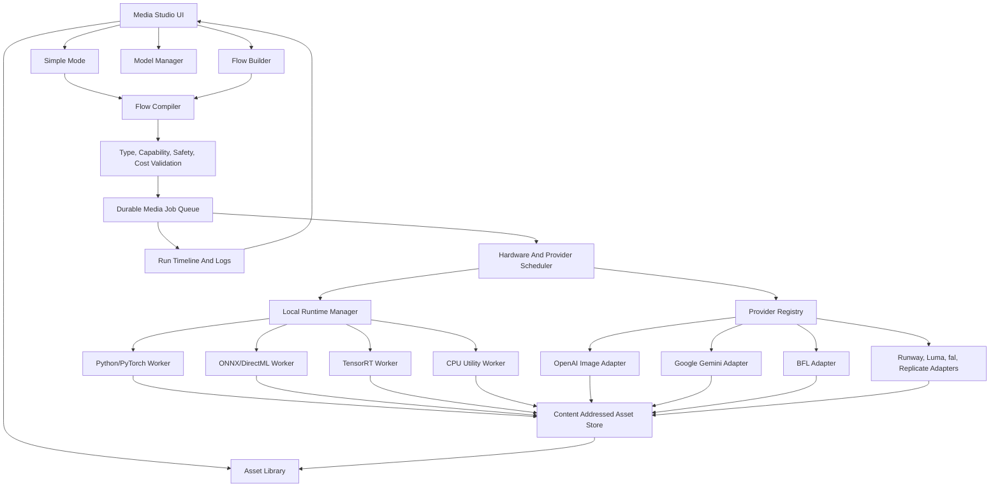

# Media Studio And Media Flow System Specification

Status: Living implementation specification
Date: 2026-07-14
Scope: A first-class machdoch app for local-first media generation, editing, automation, asset lineage, and flow-based media workflows. This is separate from normal chat and Ralph.

## Source Baseline

This specification is based on machdoch's current product shape and online research into current media generation tools, runtimes, models, APIs, and papers.

Existing machdoch context:

- machdoch is a local-first OS AI agent for CLI and desktop.
- Normal chat is task/chat oriented.
- Ralph is a graph-based autonomous prompt flow runner for agent work.
- Ralph should not become the media workflow surface. Media generation needs canvas, timeline, model installation, GPU scheduling, asset lineage, and typed media dataflow.

Primary product and runtime references:

- ComfyUI workflow API format: https://docs.comfy.org/development/api-development/workflow-api-format
- InvokeAI invocations architecture: https://invoke.ai/development/architecture/invocations/
- InvokeAI run workflow on canvas: https://invoke.ai/features/canvas/run-workflow/
- Hugging Face Diffusers pipelines: https://huggingface.co/docs/diffusers/en/api/pipelines/overview
- Diffusers memory optimization: https://huggingface.co/docs/diffusers/en/optimization/memory
- Diffusers Wan pipeline: https://huggingface.co/docs/diffusers/en/api/pipelines/wan
- OpenAI image generation API: https://developers.openai.com/api/docs/guides/image-generation
- OpenAI GPT Image 2 model: https://developers.openai.com/api/docs/models/gpt-image-2
- OpenAI Sora video generation API deprecation notice: https://developers.openai.com/api/docs/guides/video-generation
- OpenAI Sora discontinuation FAQ: https://help.openai.com/en/articles/20001152-what-to-know-about-the-sora-discontinuation
- OpenAI content provenance announcement: https://openai.com/index/advancing-content-provenance/
- OpenAI C2PA and SynthID FAQ: https://help.openai.com/en/articles/8912793-c2pa-and-synthid-in-openai-generated-images
- Google Flow creative studio: https://labs.google/fx/tools/flow
- Google Gemini image generation: https://ai.google.dev/gemini-api/docs/image-generation
- Google Gemini video generation with Veo: https://ai.google.dev/gemini-api/docs/video
- Google Gemini API changelog and model deprecations: https://ai.google.dev/gemini-api/docs/changelog
- Google Veo first/last frame video flow: https://docs.cloud.google.com/gemini-enterprise-agent-platform/models/video/generate-videos-from-first-and-last-frames
- Google Gemini Omni announcement: https://blog.google/innovation-and-ai/models-and-research/gemini-models/gemini-omni/
- Google Gemini Omni model page: https://deepmind.google/models/gemini-omni/
- Google Gemini Omni Flash model card: https://deepmind.google/models/model-cards/gemini-omni-flash/
- Google Veo model page: https://deepmind.google/models/veo/
- Google SynthID safeguards: https://ai.google.dev/responsible/docs/safeguards/synthid
- Black Forest Labs FLUX.2: https://bfl.ai/models/flux-2
- FLUX.2 dev weights: https://huggingface.co/black-forest-labs/FLUX.2-dev
- FLUX.2 klein 4B weights: https://huggingface.co/black-forest-labs/FLUX.2-klein-4B
- FLUX.2 klein LoRA training guide: https://huggingface.co/blog/black-forest-labs/flux-2-klein-lora
- Runway Gen-4 research: https://runwayml.com/research/introducing-runway-gen-4
- Runway API: https://docs.dev.runwayml.com/
- Runway video transformation with Aleph: https://academy.runwayml.com/tutorial/how-to-transform-videos
- Luma API: https://lumalabs.ai/api
- Luma video generation docs: https://docs.lumalabs.ai/docs/video-generation
- fal model APIs: https://fal.ai/
- Replicate video model collections: https://replicate.com/collections/text-to-video
- Adobe Firefly: https://www.adobe.com/products/firefly.html
- Adobe Firefly API: https://developer.adobe.com/firefly-services/docs/firefly-api/
- Adobe Firefly video generation: https://www.adobe.com/products/firefly/features/ai-video-generator.html
- Adobe Firefly image-to-video first/last frame docs: https://helpx.adobe.com/firefly/web/work-with-audio-and-video/work-with-video/generate-videos-using-images.html
- Kling AI API docs: https://app.klingai.com/global/dev/document-api/quickStart/productIntroduction/overview
- Kling AI start/end frame docs: https://kling.ai/quickstart/ai-video-start-end-frames
- Pika API: https://pika.art/api
- Pika 2.2 API through fal: https://fal.ai/models/fal-ai/pika/v2.2/image-to-video/api
- LTX Studio: https://ltx.io/studio
- LTX API docs: https://docs.ltx.video/
- LTX Studio 2026 features: https://ltx.io/blog/top-ltx-studio-features
- Krea AI creative suite: https://www.krea.ai/
- Krea realtime image generation: https://www.krea.ai/realtime
- Krea realtime video: https://www.krea.ai/index/announcing-realtime-video
- Leonardo Flow State product page: https://leonardo.ai/fast-track-your-creativity-with-flow-state
- Leonardo Flow State: https://intercom.help/leonardo-ai/en/articles/10002805-flow-state
- Qwen Image: https://github.com/QwenLM/Qwen-Image
- Qwen Image Edit: https://huggingface.co/Qwen/Qwen-Image-Edit
- Qwen Image Edit 2511: https://huggingface.co/Qwen/Qwen-Image-Edit-2511
- Qwen Image Edit 2511 release notes: https://qwen.ai/blog?id=qwen-image-edit-2511
- Wan 2.2: https://github.com/Wan-Video/Wan2.2
- Wan 2.1 VACE: https://github.com/Wan-Video/Wan2.1/
- VACE implementation: https://github.com/ali-vilab/VACE
- VACE project page: https://ali-vilab.github.io/VACE-Page/
- HunyuanVideo 1.5: https://github.com/Tencent-Hunyuan/HunyuanVideo-1.5
- LTX-Video: https://github.com/Lightricks/LTX-Video
- FramePack: https://github.com/lllyasviel/FramePack
- Segment Anything 2: https://github.com/facebookresearch/sam2
- BRIA RMBG 2.0: https://huggingface.co/briaai/RMBG-2.0
- BiRefNet: https://github.com/ZhengPeng7/BiRefNet
- Real-ESRGAN: https://github.com/xinntao/Real-ESRGAN
- Depth Anything V2: https://github.com/DepthAnything/Depth-Anything-V2
- Video Depth Anything: https://github.com/DepthAnything/Video-Depth-Anything
- Hunyuan3D 2.1: https://github.com/tencent-hunyuan/Hunyuan3D-2.1
- TRELLIS: https://github.com/microsoft/TRELLIS
- TRELLIS.2: https://microsoft.github.io/TRELLIS.2/
- TripoSR: https://github.com/VAST-AI-Research/TripoSR
- Stable Fast 3D: https://github.com/Stability-AI/stable-fast-3d
- Stable Audio Open: https://huggingface.co/stabilityai/stable-audio-open-1.0
- C2PA technical specification: https://spec.c2pa.org/specifications/specifications/2.4/specs/C2PA_Specification.html
- C2PA overview: https://c2pa.org/
- Content Credentials: https://contentcredentials.org/
- Adobe Content Credentials overview: https://helpx.adobe.com/ca/creative-cloud/apps/adobe-content-authenticity/content-credentials/overview.html
- AMD Windows ML acceleration: https://www.amd.com/en/blogs/2026/advancing-windows-ml-acceleration-with-amd-at-microsoft-build-2026.html
- Microsoft Windows ML execution providers: https://learn.microsoft.com/en-us/windows/ai/new-windows-ml/supported-execution-providers
- AMD PyTorch on Windows release notes: https://www.amd.com/en/resources/support-articles/release-notes/RN-AMDGPU-WINDOWS-PYTORCH-7-2.html
- AMD ROCm PyTorch install docs: https://rocm.docs.amd.com/projects/install-on-linux/en/latest/install/3rd-party/pytorch-install.html
- ONNX Runtime DirectML execution provider: https://onnxruntime.ai/docs/execution-providers/DirectML-ExecutionProvider.html
- AMD DirectML flow guidance: https://ryzenai.docs.amd.com/en/latest/gpu/ryzenai_gpu.html
- NVIDIA TensorRT for RTX: https://developer.nvidia.com/blog/nvidia-tensorrt-for-rtx-introduces-an-optimized-inference-ai-library-on-windows/
- NVIDIA high-performance TensorRT for RTX apps: https://developer.nvidia.com/blog/run-high-performance-ai-applications-with-nvidia-tensorrt-for-rtx/
- NVIDIA TensorRT FP4 image generation: https://developer.nvidia.com/blog/nvidia-tensorrt-unlocks-fp4-image-generation-for-nvidia-blackwell-geforce-rtx-50-series-gpus/
- NVIDIA RTX AI app ecosystem: https://developer.nvidia.com/ai-apps-for-rtx-pcs
- NVIDIA Model Optimizer: https://github.com/NVIDIA/Model-Optimizer
- Diffusers video generation guide: https://huggingface.co/docs/diffusers/en/using-diffusers/text-img2vid
- Diffusers GGUF quantization: https://github.com/huggingface/diffusers/blob/main/docs/source/en/quantization/gguf.md
- Diffusers xDiT optimization: https://huggingface.co/docs/diffusers/en/optimization/xdit
- Diffusers ParaAttention optimization: https://github.com/huggingface/diffusers/blob/main/docs/source/en/optimization/para_attn.md
- Diffusers Apple Metal/MPS guidance: https://huggingface.co/docs/diffusers/optimization/mps
- PyTorch MPS backend: https://docs.pytorch.org/docs/stable/notes/mps
- Apple MLX framework: https://github.com/ml-explore/mlx
- Hugging Face secure model downloads: https://huggingface.co/docs/huggingface_hub/guides/download
- Hugging Face pickle security guidance: https://huggingface.co/docs/hub/security-pickle
- PyTorch serialization safety: https://docs.pytorch.org/docs/stable/notes/serialization.html
- Replicate prediction lifecycle: https://replicate.com/docs/topics/predictions/lifecycle/
- Replicate webhook delivery: https://replicate.com/docs/topics/webhooks/receive-webhook
- Replicate output retention: https://replicate.com/docs/topics/predictions/data-retention/
- C2PA Rust SDK: https://github.com/contentauth/c2pa-rs
- Runway API usage and task lifecycle: https://docs.dev.runwayml.com/guides/using-the-api/
- Runway SDK task polling guidance: https://docs.dev.runwayml.com/api-details/sdks/
- Runway output URL retention: https://docs.dev.runwayml.com/assets/outputs/
- Black Forest Labs FLUX.2 image editing API: https://docs.bfl.ai/flux_2/flux2_image_editing
- fal queue API: https://fal.ai/docs/documentation/model-apis/inference/queue
- fal webhook behavior: https://fal.ai/docs/documentation/model-apis/inference/webhooks
- fal media expiration and request retention: https://fal.ai/docs/documentation/model-apis/media-expiration
- fal CDN visibility and upload behavior: https://fal.ai/docs/documentation/model-apis/fal-cdn
- JSON Canonicalization Scheme, RFC 8785: https://datatracker.ietf.org/doc/html/rfc8785
- OpenTimelineIO overview: https://opentimelineio.readthedocs.io/en/latest/index.html
- OpenTimelineIO source and format scope: https://github.com/AcademySoftwareFoundation/OpenTimelineIO
- OpenColorIO configuration concepts: https://opencolorio.readthedocs.io/en/latest/guides/authoring/overview.html
- OpenColorIO configuration authoring: https://opencolorio.readthedocs.io/en/latest/guides/authoring/authoring.html
- FFmpeg machine-readable progress protocol: https://www.ffmpeg.org/ffmpeg.html
- FFmpeg `loudnorm`/EBU R128 filter: https://ffmpeg.org/ffmpeg-filters.html#loudnorm
- Windows Job Objects: https://learn.microsoft.com/en-us/windows/win32/procthread/job-objects
- Linux Landlock userspace API: https://docs.kernel.org/userspace-api/landlock.html
- Apple App Sandbox: https://developer.apple.com/documentation/security/app-sandbox
- Wasmtime security model: https://docs.wasmtime.dev/security.html
- Wasmtime precompiled-module safety warning: https://docs.wasmtime.dev/examples-pre-compiling-wasm.html

Primary NPM implementation references:

- XYFlow React: https://reactflow.dev/
- TanStack Query: https://tanstack.com/query/latest
- TanStack Table: https://tanstack.com/table/latest
- TanStack Virtual: https://tanstack.com/virtual/latest
- Zustand: https://zustand.docs.pmnd.rs/
- Radix UI primitives: https://www.radix-ui.com/primitives
- Tailwind CSS: https://tailwindcss.com/
- dnd kit: https://dndkit.com/
- React Hook Form: https://react-hook-form.com/
- Zod: https://zod.dev/
- Ajv: https://ajv.js.org/
- ELK.js: https://github.com/kieler/elkjs
- React Resizable Panels: https://react-resizable-panels.vercel.app/
- cmdk: https://cmdk.paco.me/
- Sonner: https://sonner.emilkowal.ski/
- React Hotkeys Hook: https://react-hotkeys-hook.vercel.app/
- tldraw SDK: https://tldraw.dev/
- Konva React: https://konvajs.org/docs/react/
- PixiJS: https://pixijs.com/
- Three.js: https://threejs.org/
- React Three Fiber: https://r3f.docs.pmnd.rs/
- Drei: https://drei.docs.pmnd.rs/
- WaveSurfer: https://wavesurfer.xyz/
- Mediabunny: https://mediabunny.dev/
- ffmpeg.wasm: https://ffmpegwasm.netlify.app/docs/overview/
- Remotion: https://www.remotion.dev/
- Comlink: https://github.com/GoogleChromeLabs/comlink
- p-queue: https://github.com/sindresorhus/p-queue
- nanoid: https://github.com/ai/nanoid
- Motion: https://motion.dev/

Primary research references:

- ControlNet: https://arxiv.org/abs/2302.05543
- IP-Adapter: https://arxiv.org/abs/2308.06721
- InstantID: https://arxiv.org/abs/2401.07519
- LoRA: https://arxiv.org/abs/2106.09685
- VACE paper: https://arxiv.org/abs/2503.07598
- FramePack paper: https://huggingface.co/papers/2504.12626
- HunyuanVideo 1.5 technical report: https://arxiv.org/html/2511.18870v1
- Depth Anything V2 paper: https://proceedings.neurips.cc/paper_files/paper/2024/hash/26cfdcd8fe6fd75cc53e92963a656c58-Abstract-Conference.html
- Video Depth Anything paper: https://openaccess.thecvf.com/content/CVPR2025/papers/Chen_Video_Depth_Anything_Consistent_Depth_Estimation_for_Super-Long_Videos_CVPR_2025_paper.pdf
- Stand-In identity-preserving video generation: https://github.com/WeChatCV/Stand-In
- Phantom subject-consistent video generation: https://arxiv.org/html/2502.11079v1
- DiTFlow video motion transfer: https://arxiv.org/abs/2412.07776
- EditCtrl efficient local/global video editing: https://arxiv.org/html/2602.15031v2
- MaskINT video editing masked transformers: https://maskint.github.io/
- TeaCache diffusion caching: https://github.com/ali-vilab/TeaCache
- xDiT diffusion transformer inference engine: https://github.com/xdit-project/xdit
- AdaCache paper: https://openaccess.thecvf.com/content/ICCV2025/papers/Kahatapitiya_Adaptive_Caching_for_Faster_Video_Generation_with_Diffusion_Transformers_ICCV_2025_paper.pdf
- BWCache paper: https://arxiv.org/html/2509.13789v3
- Cache-DiT docs: https://cache-dit.readthedocs.io/en/latest/
- Video motion transfer with DiTs project: https://ditflow.github.io/
- Awesome multi-image generation references: https://github.com/AIDC-AI/Awesome-Multi-Image-Generation
- VBench video generation benchmark: https://github.com/Vchitect/VBench
- VBench paper: https://arxiv.org/abs/2311.17982
- DOVER video quality assessment: https://github.com/VQAssessment/DOVER
- DreamSim perceptual similarity: https://arxiv.org/abs/2306.09344
- ImageReward human preference model: https://github.com/zai-org/ImageReward

Important research conclusions:

- Existing node tools prove demand for graph workflows, but many are hard to install, hard to debug, and weakly typed at the product level.
- A production media graph should separate saved UI layout from compiled execution graph.
- Output display should be explicit. InvokeAI's canvas output pattern is a good idea: a branch should declare what should be shown or exported.
- Local model execution needs memory-aware scheduling. Diffusers documents offload and device mapping because large pipelines often exceed commodity VRAM.
- Local video execution also needs optimization policy as a first-class runtime concern. xDiT, TeaCache, AdaCache, BWCache, Cache-DiT, ParaAttention, quantization, VAE tiling, and CPU/GPU offload can change speed, memory, quality, and determinism, so they must be declared and measured rather than hidden behind a "fast" switch.
- Modern image editing is moving toward multi-reference and instruction-based editing, seen in GPT Image, Gemini image generation, FLUX.2, and Qwen Image Edit.
- Modern video generation needs start frames, end frames, reference images, frame extension, interpolation, and careful frame-count handling. Google Veo's first/last-frame API and current local video projects make start/end keyframes a core data type, not a special-case feature.
- Modern video editing is moving toward "any input to video" and conversational edit loops. Gemini Omni/Flow, Runway Aleph, LTX, and Krea suggest that user-facing editing should be captured as structured edit intents, not only as freeform prompts.
- All-in-one video creation/editing systems such as VACE show that reference-to-video, video-to-video, masked video editing, motion control, object swap, expansion, and animation should be modeled as reusable condition packs rather than unrelated one-off nodes.
- Current creative suites are converging on ideation boards, rapid variant streams, reference-controlled video, storyboard generation, retakes, scene continuity, and timeline/canvas editing rather than one-shot prompt boxes.
- Provider models and endpoints are now moving targets. Google has current image model deprecations in its Gemini API changelog, so the product needs provider lifecycle metadata, deprecation warnings, and migration checks instead of hardcoded model ids.
- Endpoint removal is not theoretical. OpenAI's Sora API deprecation and discontinuation notices reinforce that video provider integrations must be removable without breaking saved local flows or hiding the reason from users.
- Consumer-local image generation is becoming more realistic. FLUX.2 klein 4B is positioned for consumer GPUs and has a practical LoRA training loop; the catalog should distinguish full, distilled, quantized, and trainable variants.
- Multi-image and subject-consistent generation should be treated as a first-class workflow family, not just an image-list input. Reference roles, identity locks, negative reference constraints, and consistency evaluation must be typed.
- Motion transfer and efficient local editing papers show that motion, identity, region masks, attention-derived motion fields, and protected regions should be inspectable graph values.
- API aggregators are useful for model breadth, but provider abstraction must avoid locking the product to any single aggregator.
- AMD support is realistic on a documented subset of hardware, but cannot be treated exactly like NVIDIA. Use ROCm/PyTorch only where the official OS/GPU matrix supports the exact device, and use ONNX Runtime DirectML or Windows ML only for models that have validated compatible graphs.
- Windows ML is becoming a vendor execution-provider surface for NVIDIA, AMD, Intel, and CPU inference. Treat it as a capability path for ONNX/optimized models, not as a substitute for PyTorch model runners.
- NVIDIA support should start with CUDA/PyTorch and expose TensorRT/TensorRT for RTX as an optimized path where models and hardware support it.
- Provenance is becoming part of the generation stack. C2PA Content Credentials and SynthID-style watermark checks should be first-class output/export concerns, while the UI must avoid claiming that provenance metadata alone proves authenticity.
- Video utility models are becoming important graph primitives. Video Depth Anything-style depth maps can support stable camera moves, relighting, video-to-video controls, and consistency checks across long clips.
- Async provider APIs have materially different durability contracts. Current official documentation ranges from BFL signed result URLs that may last only ten minutes, through Runway's documented 24-48 hour output window, to Replicate's one-hour API prediction retention. A generic `poll()` wrapper is insufficient; every adapter needs explicit acceptance, reconciliation, retention, visibility, cancellation, retry, and download semantics.
- Provider lineage can constrain later operations. Luma currently represents first/last frames as `frame0`/`frame1`, while extend, reverse, and interpolate operations require provider-generated video. The capability model therefore needs source-lineage predicates, not only input MIME types.
- Aggregator transport is part of privacy behavior. fal currently documents public CDN media URLs, configurable media/request expiration, webhook retry behavior, and queue cancellation that may race with completion. Preflight must disclose public-link and retention behavior and the scheduler must treat cancellation as a request until reconciled.
- Editorial time must use rational frame/sample time, not floating-point seconds. OpenTimelineIO is a useful interchange boundary for cuts, clips, tracks, markers, and external media references, but it is not a media container or machdoch's render engine.
- Color management must be explicit and reproducible. Preserve embedded ICC/container/bitstream metadata first; later OCIO support should pin the configuration digest, source/destination roles or spaces, display/view, and transform intent for every pixel-changing conversion.
- Quality is multi-dimensional. Technical validity, reference similarity, temporal stability, prompt preference, safety, and human acceptance cannot be collapsed into one provider-independent truth score. Benchmarks such as VBench, DOVER, DreamSim, and ImageReward are useful evaluator families only when their model version, sampling policy, calibration domain, and limitations are stored.
- Extension safety needs execution tiers. Declarative recipes require no code; small deterministic third-party utilities can eventually target a capability-limited Wasm/WASI host; GPU model runners and provider adapters remain trusted, release-signed packs. OS process controls improve containment but do not turn arbitrary Python/model repositories into safe plugins.

Design lessons from current tools:

- ComfyUI proves that visual graphs are powerful, but saved UI graphs and execution graphs should be separate and strongly typed for product reliability.
- InvokeAI's invocation/canvas model is useful because canvas outputs are explicit and workflows can operate directly on creative surfaces.
- Adobe Firefly, Krea, and Leonardo show that fast ideation streams and boards are as important as final exports.
- Runway, Luma, Kling, Pika, Google Veo, and Adobe Firefly emphasize reference consistency, keyframes, first/last-frame transitions, video extension, interpolation, and async generation jobs.
- Google Flow/Gemini Omni and LTX Studio show that script-to-storyboard, retake, timeline, elements/characters, audio, and conversational edit history should be product primitives.
- Krea realtime video shows that draw/paint/move controls should map to structured condition nodes, not only prompt text.
- fal and Replicate show that broad model routing is useful, but machdoch should own job records, privacy controls, and asset lineage.
- Google and OpenAI provenance moves show that generated assets need local lineage plus exportable standard metadata. These should be separate because platform metadata may be stripped while local run records remain durable.
- Current endpoint deprecations show that provider adapters need automated freshness checks, test fixtures per active endpoint, and a visible "will stop working on date X" warning before users build flows around unstable models.
- Official provider docs increasingly expose model-specific parameter shapes rather than one universal video API. The adapter layer must normalize provider-specific knobs into typed capability fields while preserving advanced provider options in explicit override objects.

## Executive Recommendation

Build Media Studio as a fourth lazy-loaded machdoch app backed by one media runtime, not as media blocks embedded directly in Ralph and not as a collection of provider-specific screens. The runtime should have four deliberately separate representations:

1. A versioned semantic flow containing user intent and typed media ports.
2. A separate layout document containing XYFlow positions and presentation state.
3. An immutable compiled execution plan containing concrete models, adapters, hidden preparation steps, resource reservations, privacy decisions, and provider request shapes.
4. Durable run, event, job, asset, and lineage records that survive desktop restart.

The first production slice should be image-first: import or prompt, local FLUX.2 klein and OpenAI GPT Image 2 routing, image-to-image/multi-reference edit, crop/resize/format conversion, background removal, quality analysis, compare/select, and export. This vertical slice exercises the hard architecture without making local video installation a prerequisite. Local Wan video and Google video adapters should follow only after durable jobs, model installation, VRAM scheduling, remote reconciliation, and asset lineage have proved reliable.

The product should expose complexity in four layers:

- Task recipes in Simple Mode for the common outcome, such as "create an image", "remove a background", or "animate between two frames".
- Semantic task nodes in Flow Mode for users who want composition without model plumbing.
- Advanced operation and orchestration nodes for masks, controls, loops, gates, routing, and batching.
- Runtime primitives generated only in the compiled plan for tokenization, model loading, VAE encode/decode, offload, preview decode, upload, polling, and artifact ingestion.

This is the key usability boundary. A user chooses a goal, references, quality, speed, privacy, and budget. The compiler chooses compatible pre-processing and execution primitives. Nothing with cost, upload, model download, lossy conversion, or behavior-changing fallback may be hidden: these decisions appear in the preflight and compiled-plan inspector even when Simple Mode generated them.

## Product Positioning

Media Studio is a separate machdoch app surface with two primary modes:

- Simple Mode: task-focused generation and editing for users who do not want to build graphs.
- Flow Mode: typed node graph workflows for repeatable, inspectable, local or remote media pipelines.

Simple Mode is not a reduced system. It is a curated front end over the same flow runtime. Each simple action compiles to a media flow that can be inspected, saved, forked, and automated.

Media Studio must feel like an application, not a wrapper around model scripts. It owns model setup, hardware checks, queueing, previews, run records, asset library, and exports.

## Goals

- Provide an easy local-first experience for image, video, background removal, upscaling, masking, asset preparation, 3D generation, and audio generation.
- Support both local generation and remote provider generation through the same job and flow abstraction.
- Support NVIDIA and AMD hardware with explicit runtime capability detection.
- Create a typed media graph system that can express complex pipelines without depending on ComfyUI, Automatic1111, or any external workflow server.
- Provide first-class asset lineage: every generated asset stores prompt, model, seed, provider, input assets, node path, software versions, and export details.
- Make reproducibility and variation deliberate: seeds, prompts, models, adapters, scheduler settings, dimensions, and parent assets are first-class values.
- Support chained workflows, including character progression, variant expansion, start/end keyframe video, product photography, sprite sheets, and batch processing.
- Support provider capability negotiation so every node can be compiled to local or remote execution only when the selected runtime can actually satisfy it.
- Support provider lifecycle negotiation so a flow can detect removed, deprecated, preview-only, region-restricted, or replacement model ids before it runs.
- Support structured edit intent capture for conversational edits, retakes, storyboard changes, motion brush edits, and local region edits.
- Support explicit optimization policies for local generation: quantization, offload, tiling, attention/caching acceleration, parallelism, and optimized engines.
- Support long-running jobs with durable queue records, cancellation, resume where possible, retries, partial output handling, and cost/time estimates.
- Support explicit privacy controls for remote provider uploads.
- Support provenance, watermark, and content credential workflows for generated, edited, imported, and exported assets.
- Support future extension through signed node packs and provider adapters, without executing arbitrary untrusted nodes.

## Non-Goals

- No ComfyUI backend.
- No Automatic1111 backend.
- No InvokeAI backend.
- No external workflow server dependency.
- No Ralph media nodes as the primary UX.
- No arbitrary remote custom nodes from untrusted sources.
- No hidden model downloads.
- No hidden cloud fallback.
- No workflow format that is tied to a third-party graph library.
- No "one JSON blob with everything" execution model. UI layout, declarative flow, compiled execution plan, and run records are separate artifacts.

## Product Principles

- Local-first: local generation is a first-class path, not an afterthought.
- Cloud-optional: remote providers are explicit execution targets with visible cost, privacy, and availability implications.
- Typed graph first: nodes declare input and output types, constraints, batching behavior, side effects, and hardware needs.
- Intent first for creative edits: natural-language edits are converted into typed edit intents and condition packs before execution.
- Explicit outputs: previews, saved assets, exports, and canvas/timeline results are declared by output nodes.
- Hardware-aware: the app must detect devices, memory, drivers, runtimes, and model compatibility before running jobs.
- Optimization-aware: runtime speedups and memory reductions are explicit policies with quality, determinism, and reproducibility metadata.
- Durable runs: jobs survive app restarts and preserve enough metadata to debug, rerun, branch, or export.
- Visual iteration: previews, comparison, ranking, and branching are central.
- Human control: long jobs are cancellable, pausable where possible, and restartable from checkpoints when the runtime supports it.
- Composable workflows: simple tasks, flows, batch jobs, templates, and automations compile to the same runtime.
- No silent degradation: if a provider cannot honor seed, alpha, start/end keyframes, resolution, or safety settings, the UI must show that before execution.
- Lifecycle-aware providers: preview, deprecated, removed, quota-limited, or region-limited models must be visible before a run starts.
- Provenance-aware exports: generated assets keep local lineage, can attach standards-based credentials where supported, and never claim that metadata proves truth or authenticity.

## Architecture



Repository-aligned modules to add:

- `src/shared/media-runtime.schema.json`: canonical strict contract for flow, node, port, asset reference, run, provider, model, hardware, and IPC records.
- `src/core/media/contracts.generated.ts`: generated browser-safe TypeScript constants and types, following the repository's existing runtime-contract pattern.
- `src/core/media/schemas.ts`: Ajv validators, normalization, and migration dispatch for media documents.
- `src/core/media/compiler.ts`: semantic graph validation, subflow expansion, capability constraints, cardinality analysis, and execution-plan generation.
- `src/core/media/node-registry.ts`: versioned built-in node definitions and schema-derived UI hints.
- `src/core/media/capabilities.ts`: provider/model capability matching with explainable rejection reasons.
- `src/core/media/edit-intents.ts`, `storyboard.ts`, and `optimization.ts`: provider-neutral contracts for structured edits, shots, and runtime policies.
- `src/tauri/ui/media/*`: lazy-loaded Media Studio shell, Simple Mode, Flow Mode, Library, Runs, Models, inspector, canvas, and timeline UI. This is the actual UI root in the current repository; do not create a parallel `src/ui` tree.
- `src/tauri/ui/media/lib/*`: wrappers around XYFlow and any accepted canvas/timeline packages so UI library state never becomes the saved flow format.
- `src-tauri/src/media/mod.rs`: Tauri media command registration and managed `MediaRuntimeState`.
- `src-tauri/src/media/storage.rs`: SQLite metadata/index/queue transactions plus content-addressed file operations.
- `src-tauri/src/media/scheduler.rs`: CPU, GPU, encoder, download, and remote-provider resource reservations.
- `src-tauri/src/media/workers.rs`: authenticated worker lifecycle, health, cancellation, and event ingestion.
- `src-tauri/src/media/providers/*`: remote HTTP adapters, credential resolution, polling/reconciliation, output download, and redaction. The privileged backend revalidates every compiled plan before performing network or file operations.
- `src-tauri/src/media/models.rs`: signed catalog verification, model install plans, license acknowledgement, pinned downloads, checksums, quarantine, and atomic promotion.
- `src-tauri/src/media/provenance.rs`: local lineage and an internal C2PA adapter boundary. Keep the pre-1.0 `c2pa-rs` API behind this module.
- `media-worker/pyproject.toml` and `media-worker/src/machdoch_media_worker/*`: isolated Python package for PyTorch, Diffusers, native model runners, and CPU tools that are materially better in Python.
- `src-tauri/src/media_contract_generated.rs` and `media-worker/src/machdoch_media_worker/contracts_generated.py`: generated Rust and Python contract types/constants where practical.
- `scripts/generate-media-contract.mjs`: contract generation/check command following the existing JSON-Schema-first runtime-contract pattern.

The Python worker should be an internal managed worker, not an app-facing web server. Communicate through stdio JSON-RPC, named pipes, or a localhost port bound to loopback with a random per-session token. The parent app owns lifecycle, health checks, and shutdown.

### Current Repository Integration Points

The current app shell recognizes only `chat`, `ralph`, and `marketplace`. Add `media` to `MainAppId` and migrate the versioned shell state in `src/tauri/ui/lib/_helpers/shell-store-normalizers.helper.ts`. Add a Media Studio item and activity badge in `src/tauri/ui/app-shell/app-rail.tsx`, then lazy-load the media shell from `src/tauri/ui/chat-session-shell.tsx` using the same isolation pattern as Ralph and Marketplace. A broken or slow media bundle must not delay Chat startup.

Do not extend `src/tauri/ui/ralph/ralph-flow-editor.tsx` into a second domain. It is already a large control-flow editor and Ralph edges represent execution outcomes, while media edges carry typed values. Extract only small presentation primitives that are genuinely reusable, such as node chrome, selection styling, minimap conventions, keyboard helpers, and viewport persistence. Media graph state, validation, undo history, ports, and execution remain independent.

Register `MediaRuntimeState` beside the existing desktop task state in `src-tauri/src/lib.rs`, but do not reuse `DesktopTaskLimiter` as the media scheduler. Agent commands and media inference have different resource semantics. Media needs reservations for VRAM, system RAM, CPU threads, encoders, downloads, and remote concurrency, plus a single-writer durable queue. The existing attachment-grant, path-validation, cancellation, atomic-write, and cooperative-lock patterns in `src-tauri/src/desktop_task.rs` are useful precedents and should be factored or mirrored without broadening existing permissions.

The first Tauri IPC surface should be narrow and typed:

```text
media_get_status
media_list_flows / media_get_flow / media_save_flow_revision
media_compile_flow
media_enqueue_run / media_cancel_run / media_retry_run
media_list_runs / media_get_run / media_subscribe_run_events
media_list_assets / media_get_asset / media_import_assets / media_export_asset
media_get_preview
media_list_models / media_plan_model_install / media_install_model / media_remove_model
media_probe_hardware
media_list_providers / media_refresh_provider_capabilities
```

Commands return ids, metadata, and preview URLs or granted paths, never large base64 payloads. Every mutation includes a schema version and an idempotency key. The backend checks workspace scope, grants, current catalog state, and policy even when the frontend has already validated them.

## Storage Model

Use filesystem-backed artifacts under workspace and user scopes.

Workspace storage:

```text
.machdoch/media/
  index.sqlite
  blobs/
    sha256/<prefix>/<sha256>/original
  renditions/
    <asset-id>/thumb.webp
    <asset-id>/preview.webp
  flows/
    <flow-id>.json
  flow-revisions/
    <flow-id>/<revision-id>.json
  runs/
    <run-id>/run.json
    <run-id>/events.jsonl
    <run-id>/compiled-plan.json
    <run-id>/artifacts.json
    <run-id>/provider-jobs.json
    <run-id>/costs.json
  templates/
    <template-id>.json
  provenance/
    <asset-id>/local-lineage.json
    <asset-id>/content-credential.c2pa
    <asset-id>/watermark-report.json
  training/
    datasets/
    adapters/
    evals/
  exports/
    <export-id>/
  cache/
    model-previews/
    provider-capabilities/
```

User/global storage:

```text
<user-config-dir>/media/
  config.json
  providers.json
  model-catalog.json
  models/
    huggingface/
    local/
    engines/
  runtime/
    python-envs/
    onnx/
    tensorrt/
  cache/
```

Workspace flows should reference assets by content hash and relative asset ids, not absolute paths. User model paths may be absolute but must be normalized and validated before worker execution.

Use a hybrid store, not JSON-only indexing:

- SQLite is the source of truth for mutable/queryable metadata: logical assets, blob references, tags, collections, lineage edges, flow heads, runs, node executions, jobs, provider jobs, resource leases, model installs, and migrations.
- Content-addressed filesystem blobs are the source of truth for media bytes. Store a blob by SHA-256 only after streaming it into a temporary file, checking size and MIME, computing the digest, and atomically promoting it.
- Immutable flow revisions, compiled plans, run summaries, and JSONL event/audit exports remain human-inspectable files. They are recovery/export artifacts, not a second mutable queue database.
- SQLite uses WAL mode, foreign keys, short transactions, and one backend writer task. Queue claims, state transitions, lease renewals, retries, and asset publication are transactional.
- On startup, run versioned migrations, mark expired worker leases for reconciliation, resume remote polling where safe, and move locally interrupted non-checkpointable jobs to a typed `interrupted` state.
- Backup and repair tooling can rebuild thumbnails and search indexes from SQLite plus blobs, but must never invent missing lineage or pretend a partial file is complete.

Suggested tables are `blobs`, `assets`, `asset_inputs`, `asset_renditions`, `tags`, `asset_tags`, `collections`, `collection_assets`, `flows`, `flow_revisions`, `runs`, `node_executions`, `jobs`, `job_dependencies`, `provider_jobs`, `run_events`, `resource_leases`, `models`, `model_installs`, and `schema_migrations`. Add indexes for workspace, kind, created time, run, flow, provider/model, status, blob hash, and normalized tag.

Asset bytes are content addressed, while assets are logical records. The same bytes can therefore back several assets with different origins or policy metadata without conflating their lineage. Metadata edits create a new revision or update permitted catalog fields; they never rewrite the blob.

## Asset Model

Every media artifact is represented as a `MediaAsset`.

```ts
type MediaAssetKind =
  | "text"
  | "prompt"
  | "image"
  | "svg"
  | "mask"
  | "alpha-matte"
  | "segmentation"
  | "depth-map"
  | "video-depth-map"
  | "edge-map"
  | "pose-map"
  | "normal-map"
  | "motion-map"
  | "optical-flow"
  | "video"
  | "frame-sequence"
  | "audio"
  | "transcript"
  | "mesh"
  | "material-set"
  | "camera-path"
  | "timeline"
  | "keyframe-set"
  | "edit-region"
  | "edit-intent"
  | "continuity-profile"
  | "optimization-profile"
  | "model-adapter"
  | "training-dataset"
  | "model-checkpoint"
  | "content-credential"
  | "watermark-report"
  | "report"
  | "collection";

interface MediaAsset {
  id: string;
  kind: MediaAssetKind;
  blobId?: string;
  externalSource?: MediaExternalSource;
  mimeType?: string;
  displayName?: string;
  createdAt: string;
  updatedAt: string;
  workspaceRoot?: string;
  metadata: MediaAssetMetadata;
  lineage: MediaAssetLineage;
  privacy: MediaAssetPrivacy;
}
```

`blobId` refers to an immutable `MediaBlob { sha256, byteLength, detectedMimeType, storageKey }`. `externalSource` is allowed only for imported references that have not yet been ingested and must include the normalized path grant and last-observed file identity. A runnable node that needs stable bytes forces ingestion first. Preview and export URLs are short-lived derived views, not persisted asset identity.

Common metadata:

- width, height, aspect ratio, color space, bit depth, EXIF orientation, alpha mode.
- duration, fps, frame count, audio sample rate, audio channels.
- mesh format, polygon count, material channels, texture resolution.
- keyframe timing, camera path, motion map, optical flow, and depth sequence properties.
- prompt text, negative prompt, seed, scheduler, steps, guidance scale, strength, denoise, clip skip.
- provider id, model id, model version, model digest, adapter ids, LoRA weights, ControlNet references.
- source asset ids, source frame ranges, masks, regions, canvas coordinates.
- training dataset source count, captions, repeats, validation split, trigger tokens, and adapter compatibility.
- safety/provenance flags, watermark/provenance metadata, content credential claim ids, license notes.

Lineage:

- `runId`
- `flowId`
- `nodeId`
- `jobId`
- `parentAssetIds`
- `sourceProvider`
- `sourceModel`
- `sourceSettingsHash`
- `inputHash`
- `outputIndex`
- `rerunOfAssetId`
- `branchOfAssetId`
- `credentialAssetId`
- `watermarkReportAssetId`
- `providerJobId`
- `providerRequestId`
- `providerEndpointVersion`
- `providerLifecycleState`

Privacy:

- `allowRemoteUpload`
- `containsPersonalData`
- `stripExifOnExport`
- `retentionPolicy`
- `providerRetentionAcknowledged`

### Media Time, Color, And Audio Metadata

Do not use binary floating-point seconds as the authoritative representation for frames, cuts, keyframes, captions, or audio samples. Use an exact tick/rate pair across TypeScript, Rust, Python, SQLite, worker messages, and saved flows:

```ts
interface MediaRate {
  numerator: string;
  denominator: string;
}

interface MediaTime {
  ticks: string;
  rate: MediaRate;
}

interface MediaTimeRange {
  start: MediaTime;
  duration: MediaTime;
}
```

`ticks`, `numerator`, and `denominator` are base-10 integer strings so long timelines and rates such as 30000/1001 round-trip without JavaScript safe-integer or JSON-number loss. Seconds are derived as `ticks * denominator / numerator`. The denominator and rate numerator must be positive and reduced during normalization. Frame and sample math uses checked rational arithmetic; display decimals are never written back as source values.

Time rules:

- An encoded asset records probed duration, stream time bases, start time, decoded frame count where known, average and real frame rates, and whether it is constant or variable frame rate.
- A frame sequence has an explicit rate and per-frame identity. Variable-frame-rate sources retain decoded presentation timestamps in a sidecar metadata blob; conforming to constant frame rate is an explicit `VIDEO_CONFORM` operation that records duplication/drop/interpolation decisions.
- Timeline clips reference immutable asset ids plus source and timeline `MediaTimeRange` values. Timecode, including drop-frame notation, is display/interchange metadata derived from exact time and never the arithmetic source of truth.
- Audio timing uses integer sample positions at the source sample rate. Resampling, channel-layout changes, delay compensation, and loudness normalization are explicit transformations.
- Provider duration/fps fields compile from exact time into the provider's accepted units, and the ingested output is probed again. The run report records requested versus actual frames, rate, duration, and audio timing.

Every decoded image/video asset also carries an explicit color descriptor when it can be established:

- pixel format, bit depth, alpha presence, and straight versus premultiplied alpha.
- range, RGB primaries, transfer characteristic, matrix coefficients, chroma location, and mastering/HDR metadata where applicable.
- embedded ICC profile blob digest for still images and container/bitstream color tags for video.
- `declared`, `inferred`, `conflicting`, or `unknown` confidence plus the probe/tool version that made the observation.
- pixel aspect ratio, clean aperture/crop, rotation/orientation, and display dimensions separately from stored dimensions.

Phase 2 operates in an explicit sRGB-oriented image baseline while preserving original profiles and metadata. It must not label unknown data as sRGB merely because the UI displayed it that way. Phase 5 adds video color-tag validation and explicit conform/export profiles. Phase 6 may add OpenColorIO transforms; an OCIO operation stores the config as a pinned blob/digest, config version, source/destination spaces or roles, context values, display/view/look when relevant, implementation version, and output metadata. Viewer display transforms never mutate source pixels.

Audio metadata includes codec/sample format, sample rate, exact sample count, channel count/layout, language and delay, plus optional measured integrated loudness, loudness range, and true peak. `AUDIO_LOUDNESS_NORMALIZE` uses an explicit target profile and two-pass file analysis when deterministic file normalization is required; it never applies an unexplained gain during export.

machdoch owns a small semantic timeline model for shots, clips, gaps, transitions, markers, tracks, asset references, and reversible accepted/rejected retakes. OpenTimelineIO is an import/export adapter because it represents editorial ordering/timing and externally referenced media, not embedded media or final rendering. OTIO round-trips must report unsupported effects/metadata and never silently flatten them into a rendered clip.

## Flow Graph Model

A media flow is a typed directed graph.

```ts
interface MediaFlow {
  schemaVersion: 1;
  id: string;
  name: string;
  description?: string;
  createdAt: string;
  updatedAt: string;
  settings: MediaFlowSettings;
  variables: MediaFlowVariable[];
  nodes: MediaNode[];
  edges: MediaEdge[];
}

interface MediaFlowLayoutDocument {
  schemaVersion: 1;
  flowId: string;
  flowRevisionId: string;
  layout: MediaFlowLayout;
}
```

Flow requirements:

- A flow has at least one source node and at least one explicit output/export node.
- Edges connect output ports to input ports.
- The compiler rejects type-incompatible edges.
- Cycles are rejected unless they pass through an explicit `ITERATE`, `LOOP`, or `FEEDBACK` node with finite limits and a convergence strategy.
- Batching is explicit. A single output cannot silently fan out into an unbounded number of cloud jobs.
- Provider-specific settings are allowed only inside provider settings objects, not mixed into general node config.
- UI layout is stored separately from the semantic graph.
- The compiled execution plan is stored per run because provider capabilities and model versions can change later.

Flow revision requirements:

- `schemaVersion` is not enough to run. Each run stores the exact node pack versions, provider adapter versions, model catalog snapshot, hardware snapshot, and compiler version.
- A saved flow may reference only supported node versions. If a node version has been retired, the flow opens in inspect mode with a migration action and cannot run until migrated.
- Migrations must be explicit code transforms with before/after schema tests. The app must never mutate a user's saved flow without creating a new revision.
- Provider endpoint ids are not stored as generic strings. They are `modelRef` records with provider id, model id, lifecycle state, observed capabilities, and checked-at timestamp.
- A flow can pin exact model versions for reproducibility or use a policy such as `best-local-image-edit` or `fastest-remote-video`. Policy selection is resolved into concrete versions only in the compiled execution plan.

### Canonicalization, Identity, And Schema Evolution

Reproducible caching and restart reconciliation require one canonical byte representation. The contract layer implements an RFC 8785-compatible JSON Canonicalization Scheme profile after schema validation and machdoch normalization:

1. Parse strict I-JSON and reject duplicate object keys, lone Unicode surrogates, non-finite numbers, and values that cannot round-trip across TypeScript, Rust, and Python.
2. Apply schema defaults and normalize enums, Unicode, rational values, relative asset references, and provider/model references. Potentially large integers, seeds, frame/sample indices, and digests are strings rather than JSON numbers.
3. Sort graph collections that are semantically sets: nodes by stable node id, edges by `(fromNodeId, fromPortId, toNodeId, toPortId, edgeId)`, variables by id, and permission/capability sets lexically. Preserve arrays whose order affects behavior, including reference priority, layer order, prompts, keyframes, timeline tracks, batches, and provider fallback order.
4. Canonicalize object keys/numbers with the JCS profile, encode UTF-8, and hash with SHA-256.

Store three different identities instead of overloading one hash:

- `documentDigest`: the complete normalized semantic flow document, excluding only its own digest. It changes for meaningful saved metadata such as name or description; layout has its own document/digest.
- `executionDigest`: the compiler's execution-affecting projection, excluding timestamps, display labels, descriptions, layout, transient UI state, and comments.
- `compiledPlanDigest`: the resolved immutable plan including compiler behavior version, pack/adapter digests, concrete models, capability/lifecycle snapshots, policies, runtime/optimization choices, and output contracts.

Node cache keys are built from a canonical `NodeExecutionIdentity`, not by concatenating ad hoc strings. The identity includes the compiled node behavior version, ordered input port names, asset byte digests plus only declared output-affecting metadata, normalized settings, model/adapter/runtime digests, policy versions, random/seed mode, and every output-affecting environment field. User tags, stars, display names, and collection membership do not invalidate pixel work unless the node explicitly consumes them. Secrets, signed URLs, access tokens, local absolute paths, queue ids, timestamps, and progress settings never enter the key. Media bytes continue to use streaming SHA-256 over their raw bytes; JCS applies only to structured metadata.

Schema evolution rules:

- Every top-level document, node payload, event, RPC message, pack manifest, and capability snapshot has an independently versioned schema. Compatibility ranges do not replace exact versions stored in a run.
- Core schemas use `additionalProperties: false`. Extension data is allowed only below namespaced `extensions.<publisher>.<contract>` objects with declared size limits; it cannot affect execution unless a trusted pack schema and compiler explicitly consume it.
- A newer or missing node/pack version opens as an immutable unknown-node tombstone that preserves the original JSON and edges for inspection/export. It cannot execute, validate as a known node, or be silently discarded.
- A migration reads one immutable revision and produces a new revision plus a machine-readable report. Migration fixtures assert semantic and compiled-plan differences; downgrade is export-only unless an explicit reverse migration exists.
- Canonicalization conformance vectors are shared across TypeScript, Rust, and Python CI, including Unicode, `-0`, decimal/exponent forms, rational rates, reordered graph collections, ordered references, and unsafe integer boundaries.

Subflows and macros:

- Any selected node region can become a reusable subflow with typed input and output ports.
- Subflows are stored as normal flows with `isSubflow: true` and can be versioned, imported, exported, and tested.
- A subflow cannot hide remote upload behavior, external file writes, model downloads, or paid provider calls. Those side effects must bubble up to the parent flow summary.
- Subflows must declare cardinality: single input/single output, map, zip, cartesian, reduction, or streaming.
- A subflow can expose preset knobs while locking internal nodes, useful for "Character Lvl 1 -> Lvl 2 -> Lvl 3" or "Product cutout -> lifestyle background -> ad variants".
- The compiler expands subflows into the execution plan while preserving source node paths such as `subflow.character_level[2].node.generate`.

Typed adapters and converters:

- Type coercion is explicit and represented by nodes such as `COLLECT_IMAGES`, `PICK_FRAME`, `EXTRACT_MASK`, `PACK_CONDITION_SET`, `UNPACK_VARIANTS`, and `ASSET_TO_PROMPT`.
- Safe UI edge transforms can select an item by index or label, but they cannot resize, mask, encode, decode, or change semantic media type.
- Adapter nodes must preserve lineage to the original asset and note whether the operation is lossless.
- Lossy conversions such as video frame extraction, color profile conversion, alpha flattening, codec transcode, and mesh decimation must surface warnings in the run report.

Batch cardinality and budget gates:

- Every list output includes an estimated and actual item count.
- Every batch node must declare `maxItems`, `maxRemoteJobs`, `maxEstimatedCost`, `maxEstimatedMinutes`, and failure policy.
- A cartesian prompt or seed expansion requires a visible confirmation when it crosses workspace policy thresholds.
- A batch may continue after per-item failure only when downstream nodes support sparse results and the output node can represent partial success.

### Ports

```ts
type MediaPortDirection = "input" | "output";
type MediaPortArity = "single" | "optional" | "list" | "map";

interface MediaPort {
  id: string;
  name: string;
  direction: MediaPortDirection;
  dataType: MediaDataType;
  arity: MediaPortArity;
  required: boolean;
  constraints?: MediaPortConstraints;
  ui?: MediaPortUiHints;
}
```

Port constraints:

- image dimensions: exact, min, max, aspect ratio, multiple-of, square only.
- mask dimensions must match a target image unless a resize/align node is explicit.
- video frame rate, duration, codec, frame count, and resolution.
- video time base, constant/variable frame-rate policy, color space/range, and alpha mode.
- audio sample rate, exact sample range, channel layout, loudness target, and sync tolerance.
- mesh format and texture requirements.
- prompt max length, allowed variables, language, banned unresolved placeholders.
- model family, runtime family, provider capability.

### Data Types

Primitive values:

| Type | Purpose |
| --- | --- |
| `string` | Generic text |
| `prompt` | Positive generation prompt with structured prompt metadata |
| `negativePrompt` | Negative prompt |
| `number` | Float |
| `integer` | Integer |
| `boolean` | Boolean |
| `enum` | Closed option set |
| `json` | Structured payload |
| `seed` | Reproducibility seed, including random and fixed modes |
| `resolution` | Width, height, aspect ratio, multiple constraints |
| `rationalTime` | Exact tick/rate media position |
| `timeRange` | Exact start and duration pair |
| `duration` | Duration expressed as exact media time plus a display unit |
| `fps` | Rational frame rate, never an unqualified float |
| `colorTransform` | Pinned source/destination color transform contract |
| `scheduler` | Sampler/scheduler id |
| `providerRef` | Provider selection |
| `modelRef` | Model selection |
| `adapterRef` | LoRA, ControlNet, IP adapter, or other model adapter |
| `adapterWeight` | Adapter id with weight, start/end step, and scope |
| `providerCapability` | Resolved provider/model capability snapshot |
| `costEstimate` | Provider and local resource estimate |
| `licenseRef` | Model, asset, dataset, or output license metadata |
| `contentPolicy` | Safety/provider/workspace policy reference |
| `optimizationPolicy` | Local runtime acceleration and memory policy |
| `qualityThreshold` | Metric threshold for validation, ranking, or acceptance |
| `assetRef` | Stable logical media asset reference |
| `tagSet` | Normalized user, taxonomy, or analyzer tags with confidence/source metadata |

Media values:

| Type | Purpose |
| --- | --- |
| `image` | RGB/RGBA still image |
| `imageList` | Ordered image batch |
| `svg` | Sanitized SVG document retained as source data until explicit rasterization |
| `mask` | Single-channel mask aligned to an image |
| `maskList` | Ordered mask batch |
| `alphaMatte` | Matte with soft edges and foreground confidence |
| `segmentation` | Object masks and labels |
| `depthMap` | Monocular depth result |
| `videoDepthMap` | Temporally consistent depth sequence |
| `edgeMap` | Canny, HED, lineart, or other edges |
| `poseMap` | Human/hand/face pose conditioning |
| `normalMap` | Surface normal estimate |
| `motionMap` | Motion brush, region motion, or camera motion field |
| `opticalFlow` | Per-frame optical flow for analysis or conditioning |
| `video` | Encoded video asset |
| `frameSequence` | Ordered image frames with timing |
| `keyframeSet` | Timed start, end, and intermediate keyframes |
| `audio` | Audio waveform or encoded audio |
| `transcript` | Dialogue, captions, lyrics, or shot-level spoken text |
| `mesh` | 3D mesh, Gaussian, radiance field, or converted asset |
| `materialSet` | PBR textures and material metadata |
| `cameraPath` | Camera motion path for video or 3D |
| `timeline` | Editorial tracks, clips, ranges, transitions, markers, and external asset references |
| `layerStack` | Ordered canvas layers with blend modes and masks |
| `editRegion` | Spatial or temporal region, mask, and tracking hints |
| `editIntent` | Structured creative edit instruction with target, scope, constraints, and acceptance checks |
| `conditionSet` | Packed model conditions: references, masks, depth, motion, pose, style |
| `continuityProfile` | Characters, props, locations, style, audio, and continuity constraints across shots |
| `storyboard` | Shots, prompts, references, timing, and transitions |
| `variantSet` | Named generated alternatives |
| `characterProfile` | Character identity, style, outfit, level/state references |
| `productProfile` | Product reference, masks, materials, dimensions, brand constraints |
| `styleProfile` | Reusable visual style references, prompts, palettes, and negative constraints |
| `trainingDataset` | Curated examples with captions and splits |
| `trainedAdapter` | Generated LoRA, textual inversion, ControlNet, or model adapter artifact |
| `modelCheckpoint` | Training checkpoint or resumable adapter checkpoint |
| `optimizationProfile` | Quantization, tiling, offload, parallelism, caching, and engine settings |
| `provenanceManifest` | Local lineage or standards-based provenance manifest |
| `contentCredential` | C2PA-style signed credential bundle where supported |
| `watermarkReport` | Detection result for provider or open watermark schemes |
| `runReport` | Metrics, warnings, comparisons, and selected candidates |

Implicit conversions are intentionally limited:

- `image` can feed `imageList` only through a `COLLECT_IMAGES` node.
- `image` cannot become `mask` without a segmentation/masking node.
- `image` cannot become `depthMap`, `edgeMap`, or `poseMap` without an explicit preprocessor node.
- `video` cannot become `frameSequence` without an explicit frame extraction node.
- `frameSequence` cannot become `video` without an explicit encode node.
- `imageList` cannot become a multi-reference edit input without explicit labels, roles, or ordering.
- `start image` and `end image` are represented as a `keyframeSet` before video generation when a provider supports first/last-frame control.
- `conditionSet` is the canonical form for VACE-style video inputs that combine reference, mask, motion, pose, depth, and edit-region signals.
- `trainingDataset` cannot become `trainedAdapter` without an explicit training node and stored training report.
- `editIntent` cannot directly mutate pixels or frames. It must compile into generation, edit, condition, or timeline nodes.
- `optimizationPolicy` can become an `optimizationProfile` only through provider/runtime capability matching.
- `modelCheckpoint` cannot become `trainedAdapter` until a packaging/evaluation node verifies compatibility and metadata.
- `provenanceManifest`, `contentCredential`, and `watermarkReport` never change the pixels by themselves. Pixel-affecting watermarking must be an explicit transform node if supported.
- Remote provider outputs with unknown seed behavior are marked as `seedReproducibility: "provider-dependent"`.

### Edge Semantics

Edges are dataflow edges, not Ralph decision edges.

```ts
interface MediaEdge {
  id: string;
  fromNodeId: string;
  fromPortId: string;
  toNodeId: string;
  toPortId: string;
  transform?: MediaEdgeTransform;
}
```

Edge transforms are only metadata for safe UI adapters such as selecting a single output index from a list. Real media transformations must be nodes so they are visible, replayable, and typed.

### Control Nodes

Media flows can contain control nodes, but they are still typed dataflow nodes:

- `BATCH_MAP`: run a subflow for every item in a list.
- `BATCH_ZIP`: pair items across lists by index.
- `BATCH_CARTESIAN`: generate all combinations with explicit max count.
- `ITERATE`: run a subflow repeatedly with finite max iterations.
- `RANK`: score candidates and choose top N.
- `BRANCH`: choose a branch based on a deterministic condition or classifier output.
- `CACHE`: memoize a subflow by input hash and model/settings hash.
- `HUMAN_REVIEW`: pause until the user chooses, edits, or rejects candidates.
- `ASSERT`: enforce dimensions, alpha, duration, object count, OCR text, or quality thresholds.
- `PROVIDER_CAPABILITY_ROUTE`: choose among declared provider/model options by capability, cost, privacy, hardware, lifecycle state, and user policy.
- `FAILOVER_BRANCH`: route to an alternate provider or subflow only after a typed failure and only when retry semantics are safe.
- `REDUCE_COLLECTION`: aggregate a list into a grid, package, score report, selected winner, or training dataset.
- `RETAKE_LOOP`: rerun a shot, region, or asset with bounded edit intents while preserving continuity constraints.
- `STREAM_GENERATION`: run a continuous ideation stream with explicit stop conditions, budget limits, and board output.
- `QUALITY_GATE`: require metric, human, or policy approval before downstream nodes execute.

## Node Taxonomy

Every node declares:

- `type`
- `version`
- `displayName`
- input ports
- output ports
- config schema
- capability requirements
- resource estimate function
- determinism properties
- safety/privacy properties
- cache policy
- retry policy
- batch policy
- side effect declaration
- provider lifecycle constraints
- provenance behavior
- preview behavior

### Node Layers And Progressive Disclosure

A full-feature system does not require every user to manipulate sampler, text encoder, VAE, latent, or tensor nodes. Classify every node definition into one of four layers:

| Layer | Visible by default | Examples | Contract |
| --- | --- | --- | --- |
| Recipe | Simple Mode | Create image, product cutout, animate first/last frame, make variants | Versioned parameterized flow template |
| Task | Flow Mode default | Generate image, edit with references, remove background, generate video, analyze quality | Semantic capability request independent of provider plumbing |
| Operation/orchestration | Advanced node browser | Crop, composite SVG, extract mask, map, iterate, rank, quality gate, provider route | Explicit typed transformation or bounded control behavior |
| Runtime primitive | Compiled-plan inspector only | Tokenize, encode/decode latent, load VAE, quantize/offload, upload, poll, download, create preview | Adapter-generated execution step, never a saved-flow dependency |

Node definitions are schema-driven, following the useful part of InvokeAI's invocation model: stable type id, semantic version, strongly typed inputs/outputs, constraints, defaults, conditional field visibility, examples, cost/privacy effects, and migration functions. The same definition renders the inspector, validates a flow, feeds node search, documents the node, and supplies compiler metadata. Avoid hand-building a separate form for each provider.

Task nodes expose `Basic`, `Creative`, and `Expert` inspector groups. Basic contains intent, input assets, aspect/duration, and output count. Creative contains seed policy, negative prompt, reference roles, edit strength, and quality/speed preference. Expert contains an explicit model pin, scheduler/steps when meaningful, optimization profile, and a namespaced provider override. Changing model or provider hides unsupported fields and explains the capability difference; it never silently drops a value.

Compound nodes and subflows solve recurring setup:

- `GENERATE_IMAGE` can compile to prompt normalization, reference preprocessing, model/runtime selection, text encoding, generation, safety metadata capture, preview creation, and asset ingestion.
- `GENERATE_START_END_VIDEO` validates matching aspect/color constraints, generates or adapts intermediate conditioning, chooses a provider with genuine first/last-frame capability, polls the job, verifies duration/frames, and ingests the result.
- `REMOVE_BACKGROUND` chooses a local segmentation/matting implementation, produces both cutout and alpha matte, and optionally runs edge-fringe quality analysis.
- `SVG_TO_IMAGE` parses and sanitizes SVG in a restricted renderer, exposes background and target dimensions, and outputs a raster asset without ever executing embedded scripts or external references.

The node card shows intent, essential inputs, provider/model badge, estimated resources, cache state, and latest result. Expanded internals are available through `Explain plan`, not by flooding the main canvas. Users can promote a compound node into an editable subflow; the new revision pins the expansion contract and exposes only supported override points.

Connection assistance may suggest or insert a safe explicit conversion, such as image-to-mask extraction or frame selection, but must show the inserted node before saving. It may not auto-upload, spend money, download a model, change dimensions lossily, flatten alpha, or choose a fallback provider without preflight disclosure.

Node packs are built-in and signed first. A pack manifest declares id, publisher, version, compatible flow/compiler versions, node schemas, migrations, runtime requirements, permissions, and content digest. Third-party packs remain disabled until the worker sandbox and signing/update/revocation model are implemented. Importing ComfyUI workflow JSON can be a later conversion tool; arbitrary Comfy custom nodes or Python repositories are not an execution surface.

### Source Nodes

| Node | Inputs | Outputs | Purpose |
| --- | --- | --- | --- |
| `TEXT_PROMPT` | text, optional style vars | prompt | Prompt source with variables |
| `NEGATIVE_PROMPT` | text | negativePrompt | Negative prompt source |
| `IMAGE_INPUT` | file picker, asset id, clipboard | image | User image source |
| `SVG_INPUT` | file picker, asset id | svg | Sanitized vector source |
| `IMAGE_FOLDER_INPUT` | folder, filters | imageList | Batch image source |
| `VIDEO_INPUT` | file picker, asset id | video | User video source |
| `AUDIO_INPUT` | file picker, asset id | audio | User audio source |
| `SCRIPT_INPUT` | text/file | transcript/storyboard | Script, beat sheet, or shot list source |
| `BRIEF_INPUT` | text, brand/project constraints | prompt, continuityProfile | Creative brief source |
| `MODEL_SELECT` | provider, task, hardware policy | modelRef | Model choice |
| `ADAPTER_SELECT` | LoRA/ControlNet/IP adapter refs | adapterRef/list | Adapter choice |
| `OPTIMIZATION_SELECT` | target device, quality/speed policy | optimizationPolicy | Runtime optimization policy |
| `SEED` | fixed/random/range | seed/list | Seed source |
| `PROMPT_MATRIX` | dimensions, values | prompt/list | Prompt permutations |
| `REFERENCE_BOARD` | images and labels | imageList, characterProfile, productProfile | Multi-reference source |
| `STYLE_PROFILE_INPUT` | style refs, palette, text constraints | styleProfile | Reusable style source |
| `CONTINUITY_PROFILE_INPUT` | characters, props, locations, style | continuityProfile | Continuity source |
| `KEYFRAME_INPUT` | images, timing, labels | keyframeSet | Start/end/intermediate keyframes |
| `EDIT_REGION_INPUT` | masks, boxes, tracks, frame ranges | editRegion/list | Spatial and temporal edit regions |
| `TRAINING_DATASET_INPUT` | folder/assets, captions, license notes | trainingDataset | Dataset for LoRA/adapter training |
| `TIMELINE_IMPORT` | OTIO/EDL file, asset relink policy | timeline, runReport | Import editorial structure without embedding or rendering media |

### Prompt And Planning Nodes

| Node | Inputs | Outputs | Purpose |
| --- | --- | --- | --- |
| `PROMPT_ENHANCE` | prompt, style, model target | prompt | Expand prompt for a chosen model |
| `PROMPT_COMPRESS` | prompt, model target | prompt | Fit prompt limits |
| `PROMPT_TRANSLATE` | prompt, language | prompt | Translate prompts |
| `IMAGE_CAPTION` | image/video frame | prompt/tags | Caption an input |
| `SHOT_PLANNER` | script, style, duration | storyboard | Create shots and keyframes |
| `SCRIPT_TO_STORYBOARD` | script/transcript, continuityProfile | storyboard | Convert script to scenes and shots |
| `STORYBOARD_RETAKE_PLAN` | storyboard, feedback/editIntent | storyboard, editIntent/list | Plan retakes while preserving continuity |
| `KEYFRAME_PLAN` | storyboard/prompt, references, duration | keyframeSet | Plan start/end/intermediate frames |
| `CONDITION_PACK_PLAN` | references, regions, depth, pose, motion | conditionSet | Build model condition inputs |
| `EDIT_INTENT_PARSE` | natural language edit, target asset/context | editIntent | Convert conversational request to structured edit intent |
| `EDIT_INTENT_VALIDATE` | editIntent, asset/context/policy | runReport, pass/fail | Check target, scope, safety, and feasibility |
| `CONTINUITY_PROFILE_CREATE` | storyboard, characters, props, style refs | continuityProfile | Create cross-shot consistency constraints |
| `CONTINUITY_UPDATE` | continuityProfile, selected assets/retakes | continuityProfile | Update continuity from approved outputs |
| `CHARACTER_PROFILE_CREATE` | prompt, references | characterProfile | Define reusable character |
| `CHARACTER_LEVEL_PLAN` | characterProfile, levels | characterProfile/list | Plan level progression |
| `PRODUCT_PROFILE_CREATE` | product images, brand constraints | productProfile | Define product identity |
| `STYLE_PROFILE_CREATE` | references, prompt, palette | styleProfile | Define reusable style |
| `PROMPT_REWRITE_FOR_PROVIDER` | prompt, modelRef, policy | prompt, runReport | Rewrite for provider limits without changing intent |
| `PROMPT_NEGATIVE_SUGGEST` | prompt, target model | negativePrompt | Suggest model-specific negative prompt |
| `PROMPT_ROLE_TAG` | prompt, references, continuityProfile | prompt, conditionSet | Assign named roles for multi-reference providers |

### Image Generation Nodes

| Node | Inputs | Outputs | Purpose |
| --- | --- | --- | --- |
| `TEXT_TO_IMAGE` | prompt, modelRef, seed, resolution, settings | image/list, runReport | Generate images |
| `IMAGE_TO_IMAGE` | image, prompt, modelRef, strength, seed | image/list, runReport | Transform an image |
| `INPAINT` | image, mask, prompt, modelRef | image/list, runReport | Fill masked region |
| `OUTPAINT` | image, canvas bounds, prompt, modelRef | image | Extend beyond edges |
| `MULTI_REFERENCE_EDIT` | imageList, prompt, modelRef | image/list | Edit/fuse references |
| `CONTROL_GENERATE` | prompt, control image/maps, modelRef, adapters | image/list | ControlNet-style generation |
| `CHARACTER_GENERATE` | characterProfile, prompt, pose/style | image/list | Character-consistent image |
| `PRODUCT_SHOT_GENERATE` | productProfile, prompt/background | image/list | Product images |
| `STYLE_PROFILE_GENERATE` | styleProfile, prompt, modelRef | image/list | Generate within a saved style |
| `STYLE_TRANSFER` | image, style reference/prompt | image/list | Restyle image |
| `VARIANT_GENERATE` | image, prompt deltas, strength, seeds | variantSet | Generate variants |
| `REFERENCE_EXPAND_GENERATE` | imageList, prompt, roles, modelRef | image/list | Create new images from labeled references |

### Image Utility Nodes

| Node | Inputs | Outputs | Purpose |
| --- | --- | --- | --- |
| `REMOVE_BACKGROUND` | image, modelRef/settings | image, alphaMatte, mask | Transparent cutout |
| `SEGMENT_ANYTHING` | image/video, points/boxes/text hints | segmentation, mask/list | Object masks |
| `MASK_REFINE` | image, mask, feather/expand/contract | mask, alphaMatte | Clean mask |
| `DEPTH_ESTIMATE` | image | depthMap | Depth Anything/MiDaS-style depth |
| `VIDEO_DEPTH_ESTIMATE` | video/frameSequence | videoDepthMap | Temporally consistent video depth |
| `EDGE_DETECT` | image, method/thresholds | edgeMap | Canny/HED/lineart |
| `POSE_DETECT` | image/video frame | poseMap | Human pose conditioning |
| `NORMAL_ESTIMATE` | image/depth | normalMap | Surface normals |
| `OPTICAL_FLOW_ESTIMATE` | video/frameSequence | opticalFlow | Estimate motion between frames |
| `MOTION_BRUSH` | video/image, user strokes, tracks | motionMap, editRegion | Author region motion controls |
| `MOTION_TRANSFER_EXTRACT` | reference video | motionMap, opticalFlow, runReport | Extract reusable motion from a reference clip |
| `UPSCALE` | image/video, scale/model | image/video | Super-resolution |
| `RESTORE_IMAGE` | image, model/settings | image | Denoise/deblur/restore |
| `COLOR_MATCH` | source image, reference image | image | Match colors |
| `COLOR_SPACE_CONVERT` | image, colorTransform | image, runReport | Apply a pinned ICC/OCIO transform and record output color metadata |
| `STYLE_AND_LAYOUT_MATCH` | source image, reference image, strength | image, runReport | Match composition/style constraints |
| `BACKGROUND_REPLACE` | foreground, alpha/mask, background prompt/image | image | Replace background |
| `RELIGHT` | image, mask/depth, lighting prompt | image | Change lighting while preserving subject |
| `COMPOSE_LAYERS` | layerStack | image | Render canvas layers |
| `ALPHA_COMPOSITE` | foreground, alpha/mask, background | image | Product/composite output |
| `CROP_RESIZE_PAD` | image/video, target resolution | image/video | Format conversion |
| `SVG_TO_IMAGE` | svg, target resolution, background policy | image, runReport | Sanitize and rasterize SVG without scripts or external resources |
| `AUTO_TAG` | image/video, taxonomy/analyzer | tagSet, runReport | Suggest content/technical tags with source and confidence |
| `TAG_ASSET` | assetRef, tagSet, merge policy | assetRef, runReport | Create a metadata revision with normalized tags; never rewrite media bytes |
| `SPRITE_SHEET` | imageList/frameSequence | image | Sprite sheet output |
| `TILE_SEAMLESS` | image | image | Tileable texture correction |

### Video Nodes

| Node | Inputs | Outputs | Purpose |
| --- | --- | --- | --- |
| `TEXT_TO_VIDEO` | prompt, modelRef, seed, duration, fps, resolution | video, frameSequence, runReport | Generate video from text |
| `IMAGE_TO_VIDEO` | image, prompt, modelRef, motion settings | video, frameSequence, runReport | Animate image |
| `START_END_TO_VIDEO` | start image, end image, prompt, duration, fps | video, frameSequence, runReport | Generate transition between keyframes |
| `KEYFRAMES_TO_VIDEO` | keyframeSet, prompt, modelRef, duration, fps | video, frameSequence, runReport | Generate between timed keyframes |
| `REFERENCE_TO_VIDEO` | references/conditionSet, prompt, modelRef | video, frameSequence, runReport | Generate video from references |
| `VIDEO_TO_VIDEO` | video, prompt, modelRef, strength, conditionSet | video, runReport | Transform a whole clip |
| `MASKED_VIDEO_EDIT` | video, editRegion/mask sequence, prompt, modelRef | video, runReport | Edit selected temporal regions |
| `VIDEO_OBJECT_SWAP` | video, source object/region, replacement reference/prompt | video, runReport | Swap subject/object across frames |
| `VIDEO_MOTION_EDIT` | video/image, motionMap, prompt, modelRef | video, runReport | Apply motion brush or movement controls |
| `VIDEO_MOTION_TRANSFER` | source/reference, motionMap, prompt, modelRef | video, runReport | Transfer motion from a reference video |
| `CONVERSATIONAL_VIDEO_EDIT` | video, editIntent/list, conditionSet, modelRef | video, runReport | Apply structured conversational edit intents |
| `SHOT_RETAKE` | shot video/keyframes, editIntent, continuityProfile | video, runReport | Regenerate one shot while preserving sequence continuity |
| `VIDEO_EXPAND` | video, canvas bounds/aspect, prompt, modelRef | video | Outpaint video spatially |
| `VIDEO_STYLE_TRANSFER` | video, styleProfile/reference, strength | video | Restyle a clip |
| `VIDEO_EXTEND` | video, prompt, direction, duration | video | Extend before/after |
| `VIDEO_INTERPOLATE` | video/frameSequence, target fps | video/frameSequence | Frame interpolation |
| `VIDEO_INPAINT` | video, mask/segmentation, prompt | video | Replace region over time |
| `VIDEO_BACKGROUND_REMOVE` | video, object hints | video, alpha video, mask sequence | Transparent or replaced background |
| `FRAME_EXTRACT` | video, frame range/stride | frameSequence/imageList | Extract frames |
| `VIDEO_ENCODE` | frameSequence, audio, codec settings | video | Encode final video |
| `SHOT_ASSEMBLE` | storyboard, shot videos, transitions, audio | video | Timeline assembly |
| `CAMERA_MOTION` | image/depth/camera path | video | Parallax or camera movement |
| `VIDEO_RETIME` | video, speed curve, interpolation policy | video | Speed ramp or retime |
| `VIDEO_CONFORM` | video, target rational rate/time range, frame policy | video/frameSequence, runReport | Explicitly conform VFR/rate/duration with a drop/duplicate/interpolation report |
| `LOOPABLE_VIDEO` | video, transition policy | video, runReport | Create seamless loop |
| `VIDEO_STABILIZE` | video, crop policy | video, runReport | Stabilize camera motion |
| `VIDEO_SCENE_CUT_DETECT` | video | storyboard, frameSequence, runReport | Detect cuts and scene boundaries |
| `VIDEO_COLOR_GRADE` | video, reference/look | video | Apply or match color grade |

### 3D And Asset Nodes

| Node | Inputs | Outputs | Purpose |
| --- | --- | --- | --- |
| `IMAGE_TO_3D` | image, modelRef, quality | mesh, materialSet, runReport | Generate 3D asset |
| `TEXT_TO_3D` | prompt, modelRef, quality | mesh, materialSet, runReport | Generate 3D asset from prompt |
| `MESH_RETOPO` | mesh, target topology | mesh | Retopology |
| `MESH_DECIMATE` | mesh, poly budget | mesh | Reduce polygons |
| `UV_UNWRAP` | mesh | mesh | UV unwrap |
| `TEXTURE_GENERATE` | mesh, prompt/reference | materialSet | Generate PBR textures |
| `PBR_VALIDATE` | mesh, materialSet | runReport, pass/fail | Validate PBR channels and texture completeness |
| `MESH_COLLISION_GENERATE` | mesh, target engine | mesh | Generate collision/proxy geometry |
| `LOD_GENERATE` | mesh, levels | mesh/list, runReport | Generate level-of-detail meshes |
| `GLB_EXPORT` | mesh, materials | file/report | Export GLB |

### Audio Nodes

| Node | Inputs | Outputs | Purpose |
| --- | --- | --- | --- |
| `TEXT_TO_AUDIO` | prompt, duration, modelRef | audio | Generate sound/music |
| `TEXT_TO_VOICE` | transcript, voice/profile, policy | audio, runReport | Generate voiceover where configured |
| `FOLEY_GENERATE` | video/storyboard, prompt | audio | Generate effects |
| `SOUNDTRACK_GENERATE` | storyboard/video, music prompt | audio, runReport | Generate music bed |
| `AUDIO_STEM_SPLIT` | audio | audio/list, runReport | Separate dialogue/music/effects when supported |
| `AUDIO_TRIM_MIX` | audio/list, timing | audio | Mix audio |
| `AUDIO_LOUDNESS_ANALYZE` | audio/video, measurement profile | runReport | Measure integrated loudness, range, and true peak without changing samples |
| `AUDIO_LOUDNESS_NORMALIZE` | audio/video, target profile | audio/video, runReport | Explicit two-pass file loudness normalization and true-peak limiting |
| `AUDIO_TO_VIDEO_SYNC` | video, audio, markers | video | Sync generated audio |
| `TRANSCRIPT_ALIGN` | transcript, audio/video | transcript, runReport | Align text to timecodes |

### Training And Adapter Nodes

| Node | Inputs | Outputs | Purpose |
| --- | --- | --- | --- |
| `DATASET_CURATE` | assets/folder, labels, rules | trainingDataset, runReport | Select and validate training examples |
| `DATASET_CAPTION` | trainingDataset, caption model/policy | trainingDataset, runReport | Caption or normalize captions |
| `DATASET_AUGMENT` | trainingDataset, transforms | trainingDataset | Controlled augmentation |
| `LORA_TRAIN` | trainingDataset, base modelRef, training config | trainedAdapter, runReport | Train LoRA/adapter |
| `ADAPTER_EVALUATE` | trainedAdapter, validation prompts/assets | runReport, variantSet | Evaluate adapter behavior |
| `ADAPTER_PACKAGE` | trainedAdapter, license, metadata | trainedAdapter/file/report | Package adapter for reuse |
| `ADAPTER_MERGE` | adapter list, weights, compatibility policy | trainedAdapter, runReport | Merge compatible adapters |
| `CHECKPOINT_RESUME` | modelCheckpoint, training config | trainedAdapter/modelCheckpoint, runReport | Resume supported training |

### Optimization Nodes

| Node | Inputs | Outputs | Purpose |
| --- | --- | --- | --- |
| `RUNTIME_OPTIMIZE` | modelRef, optimizationPolicy, hardware snapshot | optimizationProfile, runReport | Resolve allowed runtime optimizations |
| `QUANTIZE_MODEL` | modelRef, calibration policy | modelRef/optimizationProfile, runReport | Create or select quantized variant |
| `ENGINE_BUILD` | modelRef, optimizationProfile, dimensions | optimizationProfile, runReport | Build TensorRT/Windows ML/ONNX optimized engine |
| `CACHE_ACCELERATION_CONFIG` | modelRef, acceleration policy | optimizationProfile, runReport | Configure TeaCache/AdaCache/BWCache/ParaAttention/Cache-DiT-style acceleration |
| `VAE_TILING_CONFIG` | modelRef, dimensions, memory policy | optimizationProfile | Configure image/video VAE tiling |
| `OFFLOAD_PLAN` | modelRef, hardware, memory policy | optimizationProfile | CPU/GPU/NVMe offload strategy |
| `OPTIMIZATION_VALIDATE` | output asset/list, baseline/thresholds | runReport, pass/fail | Validate quality drift after optimization |

### Provenance And Credential Nodes

| Node | Inputs | Outputs | Purpose |
| --- | --- | --- | --- |
| `PROVENANCE_CAPTURE` | asset/list, run metadata | provenanceManifest | Create local lineage manifest |
| `CONTENT_CREDENTIAL_ATTACH` | asset, provenanceManifest, signing policy | asset, contentCredential, runReport | Attach C2PA-style credential where supported |
| `CONTENT_CREDENTIAL_VERIFY` | asset | contentCredential, runReport | Inspect embedded or sidecar credentials |
| `WATERMARK_DETECT` | asset, detector policy | watermarkReport, runReport | Detect supported watermark/provenance signals |
| `EXPORT_METADATA_POLICY` | asset, policy | asset/report | Strip, preserve, or write sidecar metadata |
| `LICENSE_AND_POLICY_CHECK` | asset/model/dataset | runReport, pass/fail | Check license and workspace policy constraints |

### Evaluation And Selection Nodes

| Node | Inputs | Outputs | Purpose |
| --- | --- | --- | --- |
| `IMAGE_QUALITY_SCORE` | image/list | runReport, ranked imageList | Rank images |
| `IMAGE_TECHNICAL_ANALYZE` | image/list, metric profile | runReport | Deterministic decode, dimensions, alpha, clipping, blur, noise, and compression checks |
| `REFERENCE_SIMILARITY_SCORE` | asset/list, references, metric profile | runReport | Versioned perceptual, identity, or product similarity metrics |
| `PROMPT_ALIGNMENT_SCORE` | image/video, prompt | runReport | Check prompt alignment |
| `OCR_CHECK` | image/video frame, expected text | runReport, pass/fail | Validate rendered text |
| `IDENTITY_CONSISTENCY_CHECK` | image/list, characterProfile | runReport, pass/fail | Character consistency |
| `PRODUCT_CONSISTENCY_CHECK` | image/list, productProfile | runReport, pass/fail | Product consistency |
| `KEYFRAME_MATCH_CHECK` | video/frameSequence, keyframeSet | runReport, pass/fail | Validate start/end/intermediate keyframes |
| `VIDEO_CONTINUITY_CHECK` | video/frameSequence | runReport | Detect flicker, scene breaks |
| `VIDEO_TECHNICAL_ANALYZE` | video, metric/sampling profile | runReport | Decode, timing, color, frame, audio, black/freeze, clipping, and transport checks |
| `VIDEO_PERCEPTUAL_EVALUATE` | video/list, references, evaluator profile | runReport | Versioned temporal, aesthetic, and motion evaluation without a universal score |
| `DEPTH_CONSISTENCY_CHECK` | videoDepthMap, video | runReport | Detect unstable depth or geometry drift |
| `TEMPORAL_IDENTITY_CHECK` | video, characterProfile/reference | runReport, pass/fail | Check identity consistency across frames |
| `SAFETY_CHECK` | asset/list, policy | runReport, pass/fail | Safety policy gate |
| `PROVENANCE_CHECK` | asset/list, policy | runReport, pass/fail | Verify required provenance/watermark conditions |
| `SELECT_TOP_N` | asset list, scores, n | asset list | Choose candidates |
| `COMPARE_GRID` | image/video list | image/video/report | Visual comparison |
| `A_B_SELECTION` | asset pair/list, criteria | asset, runReport | User or model-assisted selection |

### Output Nodes

| Node | Inputs | Outputs | Purpose |
| --- | --- | --- | --- |
| `PREVIEW_OUTPUT` | image/video/audio/mesh/report | preview reference | Show in run UI only |
| `ASSET_OUTPUT` | any media asset | asset id | Save to asset library |
| `CANVAS_OUTPUT` | image/layerStack | canvas state | Stage on canvas |
| `TIMELINE_OUTPUT` | video/storyboard/audio | timeline state | Stage on timeline |
| `TIMELINE_EXPORT_OTIO` | timeline, adapter/options | file/report | Export editorial references/timing and disclose unsupported semantics |
| `EXPORT_FILE` | asset/list, export profile | file/report | Write export files |
| `EXPORT_PACKAGE` | assets, manifest | folder/zip/report | Package outputs |
| `EXPORT_WITH_CREDENTIALS` | asset/list, credential policy, export profile | file/report | Export with local lineage and optional content credentials |
| `TRAINED_ADAPTER_OUTPUT` | trainedAdapter, metadata | asset id/file/report | Save trained adapter |
| `DATASET_OUTPUT` | trainingDataset | asset id/folder/report | Save curated dataset |

## Flow Creation

Flows can be created in five ways:

- Manual Flow Builder: user places nodes and connects typed ports.
- Simple Mode Compiler: user runs a task, and machdoch creates a visible flow behind it.
- Prompt-To-Flow: user describes a media workflow and the app proposes a typed flow using known node schemas.
- Template Fork: user starts from built-in or workspace templates.
- Flow Refactor: user asks the app to simplify, optimize, add outputs, add validation, or swap providers.

Prompt-To-Flow is not Ralph. It uses model assistance to write a media flow JSON document, then validates it through the media compiler before it can run.

Generated flows must:

- use only registered node types and versions.
- include explicit model/provider selection or an explicit model policy.
- include explicit output nodes.
- include finite batch and loop limits.
- include privacy flags when remote providers receive user assets.
- resolve all variables or prompt the user before running.

## Example Flows

### Character Level Progression

Goal: Generate a character at Level 1, then transform the same character into Level 2 and Level 3 while keeping identity consistent.

```text
TEXT_PROMPT("young forest mage, full body concept art")
  -> CHARACTER_PROFILE_CREATE
  -> CHARACTER_GENERATE(level=1, outfit="simple apprentice robes")
  -> IDENTITY_CONSISTENCY_CHECK
  -> IMAGE_TO_IMAGE(promptDelta="level 2, upgraded staff, stronger outfit", strength=0.45)
  -> IDENTITY_CONSISTENCY_CHECK
  -> IMAGE_TO_IMAGE(promptDelta="level 3, ornate archmage gear, glowing artifact", strength=0.40)
  -> COMPARE_GRID
  -> ASSET_OUTPUT("character-levels")
  -> EXPORT_PACKAGE("character-sheet")
```

Key requirements:

- The `characterProfile` stores canonical references, face/body descriptors, style notes, and disallowed drift.
- Each level is an asset with a parent pointer to the prior level.
- Identity checks can warn, branch to regeneration, or send candidates to human review.
- A flow can generate multiple candidates per level and select the best chain by total consistency score.
- If the selected provider does not support identity/reference conditioning, the compiler must warn or reject strict identity mode.

### Text To Image To Image Variants

Goal: Generate a base concept, then create many controlled variants.

```text
TEXT_PROMPT("sleek sci-fi motorcycle, studio lighting")
  -> SEED(range=16)
  -> TEXT_TO_IMAGE(count=16)
  -> IMAGE_QUALITY_SCORE
  -> SELECT_TOP_N(n=4)
  -> BATCH_MAP(
       VARIANT_GENERATE(
         promptDeltas=["red racing trim", "police variant", "desert worn", "luxury chrome"],
         strength=[0.25, 0.45]
       )
     )
  -> COMPARE_GRID
  -> UPSCALE(scale=2)
  -> ASSET_OUTPUT
```

Key requirements:

- Batch expansion must show total job count before execution.
- Variant strength and seed policy must be visible.
- Parent/child lineage must make it obvious which base image produced which variant.
- If a remote provider does not accept seeds or strength, mark those fields as provider-dependent.

### Product Background Removal And Replacement

Goal: Take product photos, remove background, generate brand-consistent scenes, composite, and export.

```text
IMAGE_FOLDER_INPUT("products")
  -> REMOVE_BACKGROUND
  -> MASK_REFINE(feather=2, contract=1)
  -> PRODUCT_PROFILE_CREATE
  -> TEXT_TO_IMAGE("minimal white marble countertop, soft shadows")
  -> ALPHA_COMPOSITE
  -> PRODUCT_CONSISTENCY_CHECK
  -> CROP_RESIZE_PAD(2000x2000)
  -> EXPORT_FILE(format=png, stripExif=true)
```

Key requirements:

- Preserve transparent PNG outputs.
- Keep foreground and matte separately.
- Allow shadow synthesis as an explicit node.
- Batch failures are per-item, not all-or-nothing.
- Export can produce marketplace-specific sizes.

### Text To Image To Video With Start And End Frames

Goal: Generate a start image and end image, then create a video transition between them.

```text
TEXT_PROMPT("wide shot of a ruined castle at sunrise")
  -> TEXT_TO_IMAGE(seed=A, label="start")
TEXT_PROMPT("same castle restored, banners waving, golden afternoon")
  -> TEXT_TO_IMAGE(seed=B, label="end")
start image + end image
  -> STYLE_AND_LAYOUT_MATCH
  -> START_END_TO_VIDEO(duration=6s, fps=24, motion="slow crane forward")
  -> VIDEO_CONTINUITY_CHECK
  -> VIDEO_INTERPOLATE(targetFps=30)
  -> EXPORT_FILE(format=mp4)
```

Key requirements:

- Start and end frames must share dimensions, aspect ratio, and compatible style.
- If style/layout match fails, branch back to regenerate the weaker frame.
- The compiler must reject start/end video when a provider only supports single image-to-video.
- Frame count must be exact: `duration * fps` after interpolation and encoding.
- Generated video stores start/end image asset ids in lineage.

### Storyboard To Multi-Shot Video

Goal: Create a short multi-shot sequence from text.

```text
TEXT_PROMPT("30 second trailer for a tiny robot exploring a kitchen")
  -> SHOT_PLANNER(5 shots)
  -> CHARACTER_PROFILE_CREATE("tiny robot")
  -> BATCH_MAP(
       CHARACTER_GENERATE(keyframe per shot)
       -> IMAGE_TO_VIDEO(duration per shot)
       -> VIDEO_CONTINUITY_CHECK
     )
  -> FOLEY_GENERATE
  -> SHOT_ASSEMBLE
  -> EXPORT_FILE(mp4)
```

Key requirements:

- Storyboard nodes produce shot ids, prompts, references, duration, camera motion, and transition hints.
- Character profile is shared across shots.
- Each shot can be regenerated independently.
- Timeline assembly stores shot boundaries and source asset ids.

### Game Sprite And 3D Asset Flow

Goal: Generate a 2D character sprite sheet and optional 3D asset.

```text
CHARACTER_PROFILE_CREATE("small knight, readable top-down game art")
  -> CHARACTER_GENERATE(poses=["idle", "walk-1", "walk-2", "attack"])
  -> REMOVE_BACKGROUND
  -> SPRITE_SHEET(tile=256)
  -> IMAGE_TO_3D(optional)
  -> GLB_EXPORT(optional)
  -> EXPORT_PACKAGE
```

Key requirements:

- Output both individual frames and a sheet manifest.
- Preserve transparent backgrounds.
- Validate consistent canvas size and pivot points.
- Optional 3D branch must not block 2D export if it fails.

### VACE-Style Video Edit With Condition Pack

Goal: Edit an existing clip by combining a reference image, tracked mask, motion instruction, and depth for temporal consistency.

```text
VIDEO_INPUT("skateboarder.mp4")
  -> FRAME_EXTRACT(stride=12)
  -> SEGMENT_ANYTHING(target="skateboarder")
  -> EDIT_REGION_INPUT(track=selectedSubject)
  -> VIDEO_DEPTH_ESTIMATE
  -> MOTION_BRUSH("jump higher, arc left to right")
IMAGE_INPUT("new jacket reference.png")
TEXT_PROMPT("same person wearing the reference jacket, natural fabric motion")
references + editRegion + videoDepthMap + motionMap
  -> CONDITION_PACK_PLAN
  -> MASKED_VIDEO_EDIT(modelPolicy="best-local-or-approved-remote")
  -> TEMPORAL_IDENTITY_CHECK
  -> VIDEO_CONTINUITY_CHECK
  -> COMPARE_GRID
  -> TIMELINE_OUTPUT
```

Key requirements:

- `conditionSet` records each condition role: source video, subject mask, reference object, depth, motion, and protected regions.
- The edit node must preserve untouched pixels when the provider/model supports masked editing.
- If a model cannot track the mask through occlusion, the flow branches to human review with the last confident frame.
- The run report shows temporal drift, identity drift, mask leaks, and changed frame ranges.
- VACE-style all-in-one models and task-specific video edit models can both execute this flow if they expose compatible capabilities.

### First And Last Frame Video With Provider Routing

Goal: Use the best available provider for first/last-frame video while keeping a local fallback path explicit.

```text
KEYFRAME_INPUT(start="spaceship-launch.png", end="spaceship-orbit.png")
  -> KEYFRAME_MATCH_CHECK
  -> PROVIDER_CAPABILITY_ROUTE(
       preferred=["local-wan-vace", "google-veo", "runway", "luma"],
       requiredCapability="start-end-to-video",
       requireAudio=false
     )
  -> KEYFRAMES_TO_VIDEO(duration=8s, fps=24)
  -> VIDEO_CONTINUITY_CHECK
  -> EXPORT_WITH_CREDENTIALS(mp4)
```

Key requirements:

- The compiler rejects providers that expose only single-image animation.
- Provider capability matching includes supported duration, fps, aspect ratio, audio behavior, prompt length, upload limits, and output retrieval policy.
- Remote upload confirmation lists both keyframes and any reference images.
- If the selected provider is preview-only or scheduled for shutdown, the run requires an acknowledgement and the flow stores the lifecycle warning.
- Local fallback is never automatic; it is an alternate branch with its own model, quality, and runtime estimates.

### Ideation Board And Flow State

Goal: Rapidly explore hundreds of visual directions without losing lineage.

```text
PROMPT_MATRIX(
  subject=["modular cabin", "floating greenhouse", "micro camper"],
  material=["brushed aluminum", "translucent polycarbonate", "cedar"],
  lighting=["rainy dusk", "clean studio", "desert noon"]
)
  -> BATCH_CARTESIAN(maxItems=72)
  -> TEXT_TO_IMAGE(count=2, modelPolicy="fast-local-image")
  -> IMAGE_QUALITY_SCORE
  -> PROMPT_ALIGNMENT_SCORE
  -> HUMAN_REVIEW(mode="board", actions=["star", "reject", "branch", "variant"])
  -> VARIANT_GENERATE(for starred items)
  -> CANVAS_OUTPUT("concept-board")
```

Key requirements:

- Board cells show prompt variables, model, seed, score, cost, and parent asset.
- Branching from a board creates a subflow with the selected image as source.
- Rejections are stored as negative examples for later prompt refinement but do not delete assets unless the user runs cleanup.
- The UI supports live queue throttling, pause, and "finish current batch only".

### LoRA Training And Chained Character Use

Goal: Train a character/style adapter, validate it, then use it in image and video chains.

```text
TRAINING_DATASET_INPUT("character-refs")
  -> DATASET_CURATE(minImages=12, requireLicense=true)
  -> DATASET_CAPTION(policy="identity-safe, no private names")
  -> LORA_TRAIN(baseModel="FLUX.2-klein-compatible", target="character")
  -> ADAPTER_EVALUATE(validationPrompts=["portrait", "full body", "action pose"])
  -> TRAINED_ADAPTER_OUTPUT
trainedAdapter
  -> CHARACTER_PROFILE_CREATE
  -> TEXT_TO_IMAGE(adapter=trainedAdapter)
  -> IMAGE_TO_VIDEO(adapter=trainedAdapter)
  -> TEMPORAL_IDENTITY_CHECK
  -> EXPORT_PACKAGE
```

Key requirements:

- Training jobs are scheduled like generation jobs but have stronger disk, thermal, and interruption handling.
- Dataset curation checks image resolution, duplicates, watermarks, captions, consent/license metadata, and NSFW policy.
- Adapter compatibility records base model family, text encoder, resolution assumptions, trigger tokens, rank, precision, and license.
- Evaluation prompts and failed samples are saved with the adapter so users know when it should not be used.
- The app must not present training as compatible with a model unless the runtime can actually load the resulting adapter.

### Provenance And Credentialed Export

Goal: Export generated media with clear local lineage and optional standards-based credentials.

```text
ASSET_INPUT("final-poster.png")
  -> PROVENANCE_CAPTURE
  -> WATERMARK_DETECT
  -> CONTENT_CREDENTIAL_ATTACH(policy="workspace-signing-key")
  -> EXPORT_WITH_CREDENTIALS(format=png, sidecar=true, stripExif=false)
  -> PROVENANCE_CHECK(required=["local-lineage", "content-credential"])
```

Key requirements:

- Local lineage remains even if export metadata is stripped later.
- The app should support embedded credentials where the format supports them and sidecar manifests where it does not.
- The UI labels provenance as evidence about creation and edits, not proof that the content is real.
- If a provider already adds C2PA or SynthID-style signals, the export report records them instead of overwriting them silently.

### Conversational Video Retake

Goal: Let the user revise one shot through natural language without rebuilding the whole sequence.

```text
SCRIPT_INPUT("product launch ad")
  -> SCRIPT_TO_STORYBOARD
  -> CONTINUITY_PROFILE_CREATE(characters=["host"], props=["phone"], style="clean studio")
  -> BATCH_MAP(
       KEYFRAME_PLAN
       -> KEYFRAMES_TO_VIDEO
     )
  -> SHOT_ASSEMBLE
  -> TIMELINE_OUTPUT

USER_EDIT("Shot 3 should feel more energetic, keep the same host and phone, add a faster push-in")
  -> EDIT_INTENT_PARSE(target="shot-3")
  -> EDIT_INTENT_VALIDATE
  -> STORYBOARD_RETAKE_PLAN
  -> SHOT_RETAKE
  -> VIDEO_CONTINUITY_CHECK
  -> TIMELINE_OUTPUT(replaceShot="shot-3")
```

Key requirements:

- User edit text becomes `editIntent` with target, scope, protected elements, expected motion, and acceptance checks.
- Retake must preserve continuity profile unless the edit intent explicitly changes it.
- The timeline stores both original shot and retake, with a reversible replacement decision.
- Remote providers that support conversational edit APIs and local video edit models can both execute if they satisfy the typed edit contract.

### Reference Motion Transfer

Goal: Generate a new clip that follows motion from a reference video without copying identity or protected content.

```text
VIDEO_INPUT("reference-dance.mp4")
  -> VIDEO_SCENE_CUT_DETECT
  -> MOTION_TRANSFER_EXTRACT
IMAGE_INPUT("new-character.png")
TEXT_PROMPT("stylized robot dancer in a neon studio")
motionMap + new-character + prompt
  -> VIDEO_MOTION_TRANSFER
  -> TEMPORAL_IDENTITY_CHECK
  -> VIDEO_CONTINUITY_CHECK
  -> EXPORT_FILE(mp4)
```

Key requirements:

- `motionMap` lineage must record source video and whether identity/content was intentionally excluded.
- The flow should allow policy gates for copyrighted/personally identifiable source motion references.
- Motion transfer quality checks compare coarse movement, camera direction, and temporal smoothness without requiring pixel similarity.

### Audio-Led Storyboard To Video

Goal: Generate a music or narration-driven video where audio controls timing.

```text
AUDIO_INPUT("voiceover.wav")
  -> TRANSCRIPT_ALIGN
  -> SCRIPT_TO_STORYBOARD(durationSource="audio")
  -> SOUNDTRACK_GENERATE(optional)
  -> BATCH_MAP(
       KEYFRAME_PLAN
       -> IMAGE_TO_VIDEO(duration=shotDurationFromTranscript)
     )
  -> SHOT_ASSEMBLE
  -> AUDIO_TRIM_MIX
  -> AUDIO_TO_VIDEO_SYNC
  -> EXPORT_WITH_CREDENTIALS(mp4)
```

Key requirements:

- Audio timing becomes a first-class constraint for shot duration and cuts.
- Generated foley/music/voiceover must record provider/model, license, and whether it contains synthetic voice.
- If a video provider generates its own audio, the flow must either preserve, replace, or mix that audio explicitly.

### Optimized Local Video Generation

Goal: Run a demanding local video model on available hardware with explicit optimization and validation.

```text
MODEL_SELECT(task="image-to-video", policy="local")
  -> OPTIMIZATION_SELECT(target="balanced-quality", allow=["vae-tiling", "offload", "cache-acceleration"])
  -> RUNTIME_OPTIMIZE
  -> OPTIMIZATION_VALIDATE(baseline="short-preview", maxDrift="medium")
IMAGE_INPUT("start.png")
TEXT_PROMPT("slow cinematic orbit, soft volumetric light")
optimizationProfile + image + prompt
  -> IMAGE_TO_VIDEO(duration=5s, fps=16)
  -> VIDEO_CONTINUITY_CHECK
  -> ASSET_OUTPUT
```

Key requirements:

- Optimization profile lists every speed/memory feature used.
- Strict mode requires a short baseline comparison before a long run.
- If optimization changes dimensions, frame count, adapter support, or alpha behavior, the compiler rejects the plan.
- Engine builds and cache warmups are visible as separate preparation steps.

## Provider Model

Providers expose capabilities. Nodes require capabilities. The compiler matches the two.

```ts
interface MediaProvider {
  id: string;
  kind: "local" | "remote";
  displayName: string;
  configured: boolean;
  capabilities: MediaProviderCapability[];
  models: MediaModelDescriptor[];
  limits: MediaProviderLimits;
  privacy: MediaProviderPrivacy;
  lifecycle: MediaProviderLifecycle;
}

interface MediaProviderLifecycle {
  checkedAt?: string;
  capabilitySourceUrl?: string;
  staleAfterSeconds: number;
  modelStates: Record<string, ProviderModelLifecycle>;
}
```

Capability examples:

- `text-to-image`
- `image-to-image`
- `inpaint`
- `outpaint`
- `multi-reference-edit`
- `reference-character`
- `text-to-video`
- `image-to-video`
- `start-end-to-video`
- `keyframes-to-video`
- `reference-to-video`
- `video-to-video`
- `masked-video-edit`
- `video-motion-edit`
- `video-motion-transfer`
- `video-object-swap`
- `video-expand`
- `conversational-video-edit`
- `shot-retake`
- `video-extend`
- `video-interpolate`
- `video-depth-estimate`
- `storyboard-to-video`
- `background-remove`
- `segmentation`
- `upscale-image`
- `upscale-video`
- `image-to-3d`
- `text-to-audio`
- `text-to-voice`
- `audio-to-video`
- `lora-train`
- `adapter-load`
- `runtime-optimize`
- `quantized-inference`
- `cache-accelerated-inference`
- `content-credential-attach`
- `content-credential-verify`
- `watermark-detect`

Capability fields:

- accepted input data types.
- output data types.
- supported resolutions, aspect ratios, frame counts, durations, fps, audio channels.
- supported keyframe count and whether first/last frames are strict, advisory, or unsupported.
- supported reference roles: character, product, style, scene, object, pose, face, material.
- supported video condition roles: source video, edit mask, protected mask, motion map, depth, pose, replacement reference.
- supported edit intent scopes: whole asset, scene, shot, frame range, object, region, audio, caption, color grade.
- supported job modes: synchronous, asynchronous polling, webhook, local streaming, preview frames.
- supported audio behavior: no audio, generated audio, input audio preservation, voiceover, soundtrack, foley, audio replacement.
- seed support: none, best effort, deterministic local, deterministic provider.
- batching support.
- streaming preview support.
- cancellation support.
- resume/checkpoint support.
- supported adapters: LoRA, ControlNet, IP-Adapter, identity adapter, custom.
- adapter training support and adapter load compatibility.
- hardware requirements.
- estimated cost and time model.
- safety/content policy behavior.
- lifecycle state and deprecation/shutdown date.
- data retention and remote upload requirements.
- supported provenance, watermark, or credential outputs.
- accepted input transport: inline bytes, multipart upload, provider CDN, user-hosted URL, or prior provider asset id.
- output delivery: inline bytes, signed URL, public URL, provider asset id, stream, or callback reference.
- input/output visibility, payload retention, result URL lifetime, deletion controls, and whether provider-side no-store is available.
- minimum polling interval, `Retry-After` behavior, provider-side automatic retry, webhook delivery semantics, and callback authentication.
- cancellation semantics: guaranteed-before-acceptance, best effort, asynchronous, unsupported, or completion-may-race.
- lineage predicates such as "must have been generated by this provider/model" for extend, reverse, interpolate, or edit operations.

### Provider Adapter Contract And Transaction Boundary

Saved task nodes never construct provider HTTP payloads. A versioned adapter translates a compiled capability request into the exact endpoint contract:

```ts
interface RemoteProviderAdapter {
  describe(): ProviderAdapterDescriptor;
  validate(request: CompiledCapabilityRequest): AdapterValidation;
  estimate(request: CompiledCapabilityRequest): Promise<AdapterEstimate>;
  prepare(request: CompiledCapabilityRequest): Promise<PreparedProviderRequest>;
  submit(request: PreparedProviderRequest): Promise<ProviderSubmission>;
  reconcile(job: DurableProviderJob): Promise<ProviderObservation>;
  requestCancel(job: DurableProviderJob): Promise<ProviderCancelObservation>;
  download(job: DurableProviderJob, output: ProviderOutputReference): Promise<DownloadedOutput>;
}
```

`PreparedProviderRequest` contains an adapter-owned endpoint/version, redacted request summary, full request digest, idempotency mode, expected charge range, upload manifest, and provider policy snapshot. Store the provider-specific body only when recovery requires it and then encrypt it at rest; otherwise keep it transient. It is never copied into a flow, UI event, Chat record, or normal diagnostic export.

Normalized durable states are `prepared`, `submitting`, `acceptance-unknown`, `accepted`, `queued`, `running`, `succeeded-download-pending`, `downloading`, `cancel-requested`, `cancelled`, `failed`, `expired`, and `completed`. Provider raw state and response metadata remain alongside the normalized state for debugging.

Submission transaction:

1. Insert one `provider_jobs` row for `(runId, nodeExecutionId, attempt)` with a unique local submission nonce, request digest, intended endpoint, and `prepared` state before network I/O.
2. Transition to `submitting` in a compare-and-set transaction, then send exactly once for that attempt. Pass a stable provider idempotency key only where its semantics are documented.
3. Persist provider job/request ids, acceptance time, estimated charge, and raw state immediately after the provider response. A crash after remote acceptance but before this commit becomes `acceptance-unknown`; without a documented lookup/idempotency mechanism it must reconcile or ask the user, never automatically resubmit.
4. A provider success becomes `succeeded-download-pending`, not `completed`. Download every output through bounded temporary storage, validate bytes, hash/ingest into CAS, create logical assets and lineage in a transaction, then mark the provider job and node complete.
5. Cancellation moves to `cancel-requested` until a later provider observation proves cancellation or completion. A late success is ingested and reported as a late output; it is not discarded or mislabeled as cancelled.

Polling is a scheduled queue job, not an in-memory timer. Persist `nextPollAt`, attempt count, last provider state, ETag/cursor where supported, and deadline. Honor provider `Retry-After`, documented minimum intervals, exponential backoff with jitter, and a maximum reconciliation horizon. A webhook/callback is an authenticated idempotent hint that wakes reconciliation; it never bypasses state-transition validation, and duplicated, delayed, or reordered callbacks are expected.

Each adapter descriptor must declare rather than imply:

- exact API/SDK/adapter version and endpoint or dated provider API version.
- idempotency scope and the crash windows it can and cannot close.
- request retry ownership: machdoch, provider gateway, both, or neither.
- poll interval/backoff, callback authentication/retry, terminal states, and cancellation race behavior.
- input upload visibility/retention/deletion and output URL visibility/expiry.
- output-count/partial-success rules and whether a completed job can later lose downloadable bytes.
- lineage restrictions and provider asset ids required by follow-up operations.
- pricing unit, estimate confidence, quota/rate-limit headers, region, and policy snapshot freshness.

### Provider Lifecycle And Deprecation

Provider adapters must continuously separate what the app knows from what the provider currently supports.

```ts
type ProviderModelLifecycleState =
  | "active"
  | "preview"
  | "deprecated"
  | "scheduled-shutdown"
  | "removed"
  | "region-limited"
  | "quota-limited"
  | "unknown";

interface ProviderModelLifecycle {
  state: ProviderModelLifecycleState;
  checkedAt: string;
  announcedAt?: string;
  shutdownAt?: string;
  replacementModelIds?: string[];
  sourceUrl?: string;
  requiresUserAcknowledgement: boolean;
}
```

Lifecycle requirements:

- Provider adapters run a lightweight capability refresh on app start, settings open, and before a queued remote run starts.
- The model catalog stores lifecycle data separately from flow JSON so active flows can receive current warnings.
- A flow pinned to a removed model cannot run. The UI offers replacement mapping only if the provider publishes one or a maintainer-approved catalog entry exists.
- A flow pinned to a preview or scheduled-shutdown model can run only after the user sees the exact state and date.
- Generated execution plans store the lifecycle state observed at compile time and the adapter source URL used for the decision.
- Test fixtures must cover at least one active model, one preview model, one scheduled-shutdown model, one removed model, and one provider with stale capability data.
- Provider adapters must never silently move a flow from a removed model to a replacement model because output semantics, safety behavior, price, and prompt handling can change.

### Provider Capability Matrix Examples

| Provider/runtime | Strong fit | Important constraints |
| --- | --- | --- |
| OpenAI GPT Image 2 | text-to-image, image-to-image, multi-reference editing, iterative edits, optional partial-image streaming | GPT Image 2 does not output transparent backgrounds; mask edits are guidance rather than pixel-exact masks, and generated bytes must be decoded/ingested rather than retained as base64 |
| Google Gemini image generation | instruction image editing, multiple references, and fast iteration | exact reference limits and supported sizes vary by model; deprecated Imagen models are scheduled to shut down on 2026-08-17 |
| Google Veo | video generation, first/last-frame transition, audio where supported | long-running jobs, model-specific keyframe support, provider upload policy |
| Google Gemini Omni/Flow | conversational multimodal video creation/editing, reference-to-video | product/API availability may differ from consumer Flow UI; adapter must expose only callable capabilities |
| OpenAI Sora APIs | legacy saved-flow diagnostics only | do not build a new adapter: the official shutdown date for the API is 2026-09-24 |
| BFL/FLUX APIs | FLUX image generation/editing | local FLUX.2 and remote BFL capabilities may differ |
| fal/Replicate | broad model routing and fast access to new models | adapter must normalize async jobs, expiry, model-specific inputs, and cost visibility |
| Runway/Luma | commercial video quality, image-to-video, extension/interpolation/video editing where exposed | provider-specific output constraints and nondeterministic reruns |
| Kling/Pika through official/API partners | first/last-frame transitions, image-to-video, fast iteration | capabilities may be routed through partner APIs; provider lineage must record actual execution provider |
| Adobe Firefly Services | commercially oriented creative APIs, credentials ecosystem, first/last-frame UI workflows | API feature parity with Firefly UI must be checked before exposing nodes |
| LTX API | video with synchronized audio and sync/async API modes | model/version/duration constraints and job mode must be explicit |
| Local Diffusers/PyTorch | broad local image/video model support | support varies by pipeline, wheel, device, precision, and VRAM |
| Local native video runners | Wan, VACE, HunyuanVideo, LTX, FramePack-style support | runners must be wrapped by typed adapters and not leak script-specific assumptions into flows |
| Local optimization libraries | TeaCache, xDiT, ParaAttention, Cache-DiT-style accelerators | optimization must be opt-in/policy-driven and quality-validated |
| ONNX Runtime DirectML/Windows ML | Windows GPU coverage including AMD and other vendors for compatible models | requires converted/validated ONNX graphs; training and custom diffusion ops may be unsupported |
| TensorRT/TensorRT for RTX | optimized NVIDIA inference on supported models and dimensions | engine build/cache invalidation, dynamic shape limits, precision differences |

### Remote Providers

Remote provider adapters should support:

- OpenAI image generation/editing through GPT Image 2, using the Image API for one-shot operations and the Responses API only when the flow explicitly needs multi-turn editing context. Store the concrete model snapshot when a pinned snapshot is available.
- No new OpenAI Sora video execution adapter. Preserve only a tombstone adapter that opens legacy flows, explains the 2026-09-24 shutdown, and offers an explicit capability-based migration comparison.
- Google Gemini image generation/editing through currently active image models discovered by the catalog. Do not create new flows pinned to Imagen models scheduled to shut down on 2026-08-17.
- Google Veo video generation where configured, including first/last-frame capability when the selected model exposes it.
- Google Gemini Omni Flash video only behind a preview feature flag while the API/model remains preview. Its current short 3-10 second 720p text/image-to-video and conversational editing surface is a distinct capability profile, not a generic replacement for Veo.
- Black Forest Labs FLUX APIs.
- fal for broad production media models.
- Replicate for model breadth and open model hosting.
- Luma, Runway, Kling, Pika, LTX, and Adobe Firefly for high-quality commercial video APIs where configured.

Remote provider requirements:

- Never upload local assets unless `allowRemoteUpload` is true for the flow/run.
- Estimate cost before execution where pricing data is available.
- Store provider job ids, request ids, and output download ids.
- Download remote outputs immediately when possible because signed URLs can expire.
- Preserve provider refusal/error messages in run records without exposing secrets.
- Mark outputs as provider-dependent when deterministic rerun is not guaranteed.
- Store provider lifecycle state, provider endpoint version, region, and SDK/API version in every remote run.
- Validate provider file size, mime type, aspect ratio, duration, and prompt length limits before upload.
- Poll async jobs through a durable remote job record so app restarts can reconcile already-paid jobs.
- Treat retry after provider acceptance as a cost-risking action unless the provider exposes idempotency keys.
- Preserve provider-supplied provenance, watermark, safety, and usage metadata as report assets.
- Refresh provider capabilities before running flows that were compiled from a stale catalog snapshot.
- Treat provider-specific image alpha honestly. For example, a request for transparent output cannot compile directly to GPT Image 2; route it through a visible background-removal/matting step or select a provider with native alpha support.
- Stream remote responses directly to bounded temporary files and ingest them into the blob store. Do not pass full-resolution base64 or video bytes through React state or Tauri event payloads.
- Prefer polling as the desktop baseline for asynchronous providers. Webhooks are optional only when a configured bridge has a stable public callback. Webhook events are idempotent hints because providers may duplicate or reorder them.
- For providers with short result retention, download successful outputs immediately and persist the retention deadline. Replicate API prediction outputs and logs are currently removed after one hour, so delayed manual import is not safe.

Remote provider request mapping must be covered by adapter tests. Each adapter needs:

- request schema builder tests.
- response parser tests for success, partial success, refusal, rate limit, quota, expired URL, invalid input, and provider outage.
- lifecycle tests for preview, deprecation, scheduled shutdown, removed model, replacement model, and unknown state.
- redaction tests for API keys, signed URLs, uploaded filenames, and provider request bodies that contain private prompts.
- golden capability snapshots from official docs or provider discovery APIs where available.

Current adapter-specific contract notes, to be captured as dated capability fixtures rather than permanent assumptions:

| Adapter | Current official behavior that affects the contract | Required machdoch handling |
| --- | --- | --- |
| BFL FLUX.2 | Editing returns a request id/polling URL; current FLUX.2 editing documentation exposes up to ten references and up to 4 MP for the documented endpoints; signed result URLs may last only ten minutes | Model-specific limits, immediate download, expired-result recovery, and no generic "FLUX supports ten references" claim |
| Runway | Uses asynchronous tasks and a dated API version header; official SDK guidance recommends polling no faster than five seconds with jitter/backoff; output URLs are documented as ephemeral, generally 24-48 hours | Pin API version, persist poll schedule, ingest on success, and never expose provider output URLs directly to the UI |
| Luma Ray | Uses `frame0`/`frame1` image references for first/last frames; extend/reverse/interpolate operations currently require a video generated by Luma; callbacks are retried but are not a durable local queue | Compile lineage predicates, retain provider generation id, use polling as baseline, and treat callbacks as hints |
| fal | Queue states include in-queue/in-progress/completed; cancellation can be accepted while work still completes; current CDN URLs are publicly accessible; retention/no-store and provider-side retry behavior are configurable | Disclose public-link/retention policy, choose retry/no-store headers explicitly, distinguish request and gateway attempt ids, reconcile cancellation races, and ingest immediately |
| Replicate | API prediction inputs, outputs, files, and logs currently expire after one hour by default; webhooks can be duplicated or reordered | Persist prediction id before waiting, poll/reconcile after restart, download immediately, and deduplicate webhook observations |

For Phase 5, use Luma Ray as the provisional second commercial video adapter after Google Veo because its documented first/last-frame and provider-lineage constraints exercise the abstraction directly. This is a release candidate decision, not a permanent default: it must still pass region, terms/data-use, price, quota, deletion, cancellation, output-quality, and endpoint-stability review at implementation time. Runway is the next candidate when multi-reference/commercial video breadth is more important than first/last-frame contract coverage.

### Local Providers

Local runtime families:

- `local-diffusers`: Python, PyTorch, Diffusers pipelines.
- `local-native-python`: model-specific Python runners for Wan, HunyuanVideo, LTX, FramePack, 3D, audio, or new models before Diffusers support lands.
- `local-onnx-directml`: ONNX Runtime DirectML for explicitly validated Windows inference graphs.
- `local-windows-ml`: Windows ML execution providers for compatible ONNX/optimized models.
- `local-tensorrt`: NVIDIA TensorRT/TensorRT for RTX optimized engines.
- `local-pytorch-mps`: PyTorch/Diffusers MPS for catalog-validated Apple Silicon models.
- `local-mlx`: later Apple Silicon-native model packs where MLX has a maintained, validated implementation.
- `local-optimization`: runtime acceleration wrappers such as xDiT, TeaCache, ParaAttention, Cache-DiT-style caches, VAE tiling, and offload plans.
- `local-cpu-utility`: CPU image/video utilities and lightweight models.

Local execution requirements:

- Runtime workers must be versioned and health checked.
- Each worker must declare exact installed packages, CUDA/ROCm/DirectML/TensorRT versions, and supported models.
- Worker environment creation must be explicit and logged.
- Model downloads require user confirmation, disk estimate, license display, a pinned repository commit or immutable release, an exact file allowlist, and checksum verification.
- The app must not assume all Diffusers pipelines support all models or all hardware.
- Runtime-specific failures must be converted to typed errors.
- Local workers must report whether they can load adapters, train adapters, execute video pipelines, export alpha, and run mixed precision.
- Runtime probes must use tiny known-good jobs, not only package import checks.
- Workers must expose a memory estimate API before accepting a generation or training job.
- Local provider adapters must sandbox model-specific scripts behind typed worker commands; flow nodes cannot pass arbitrary command-line arguments.
- The app must keep a per-runtime cache of working model/device/precision combinations and invalidate it after driver, package, model, or adapter changes.
- Optimization libraries must report supported model families, supported devices, expected quality drift, determinism impact, and whether a baseline validation run is required.
- For video jobs, local workers must report separate memory estimates for text encoders, transformer/UNet, VAE encode/decode, temporal cache, frame buffers, preview generation, and final encode.
- Prefer safetensors or another data-only format. Treat pickle-based checkpoints as untrusted executable input even when scanners report no finding; never enable `trust_remote_code` or execute repository setup/model scripts in the normal install flow.
- Download into quarantine, reject symlinks/path traversal/unlisted files, verify expected sizes and digests, scan file headers, then atomically promote. A catalog update cannot replace the files behind an already accepted immutable model version.
- Isolate incompatible model families in locked worker environments. VACE-style runners and fast-moving native video repositories often require conflicting package/runtime versions; do not mutate one global Python environment on demand.

## Hardware Support

### Hardware Discovery

Collect:

- OS, CPU, RAM, disk free space.
- GPU vendor, device name, VRAM, driver version.
- CUDA availability and version.
- ROCm/HIP availability and version.
- Apple Silicon model, unified memory, macOS version, and MPS availability.
- DirectML availability on Windows.
- TensorRT/TensorRT for RTX availability.
- PyTorch device visibility.
- ONNX Runtime execution providers.
- Python worker environment health.

Hardware discovery must be read-only.

### Runtime Selection Matrix

| Hardware/platform | Primary local path | Optimized path | Notes |
| --- | --- | --- | --- |
| NVIDIA RTX on Windows | PyTorch CUDA workers | TensorRT/TensorRT for RTX or Windows ML NvTensorRtRtx for compatible ONNX models | Prefer CUDA for model breadth, TensorRT for stable production dimensions |
| NVIDIA RTX on Linux | PyTorch CUDA workers | TensorRT engines for supported models | Best path for most open image/video models |
| AMD on Linux | PyTorch ROCm workers | MIGraphX/ONNX where compatible | Use official support matrix; do not assume every Radeon works |
| AMD on Windows | AMD PyTorch only on the exact officially supported Windows/GPU/driver matrix; otherwise validated ONNX Runtime DirectML/Windows ML models | Vendor execution provider where it supports the model | Do not advertise generic Radeon support; treat DirectML as inference-only unless a model path proves training support |
| Intel/other Windows GPUs | ONNX Runtime DirectML/Windows ML | OpenVINO where integrated later | Useful for utility models and compatible ONNX inference |
| Apple Silicon on macOS | PyTorch/Diffusers MPS for validated models | MLX or Core ML model-specific pack after benchmarking | Unified memory pressure can cause severe swapping; some MPS models cannot batch reliably |
| CPU only | CPU utility workers and tiny models | none | Offer only tasks with realistic runtime estimates |

Runtime selection rules:

- The scheduler chooses the most capable path that satisfies requested behavior, not simply the fastest path.
- The same model may have multiple package variants: PyTorch, safetensors, ONNX, TensorRT engine, quantized ONNX, or vendor-packaged Windows ML asset.
- A model variant is runnable only when its descriptor matches device, driver, runtime, precision, shape constraints, and adapter needs.
- Training nodes require a training-capable runtime. ONNX/DirectML inference support does not imply LoRA training support.
- Video models require separate estimates for text encoder, denoiser, VAE, temporal modules, frame cache, and output encoding.
- Runtime optimization is a second-stage decision after capability matching. An optimization may be applied only when it preserves the node's declared output contract.

### NVIDIA Strategy

Preferred path:

- PyTorch CUDA for broad compatibility.
- Diffusers for image and supported video pipelines.
- Model-specific Python runners for new video/3D/audio models.

Optimized path:

- TensorRT/TensorRT for RTX for supported models and stable dimensions.
- Cache compiled engines by model digest, resolution, precision, batch size, GPU architecture, driver/runtime versions, and node config.
- Invalidate engines after driver/runtime/model changes.
- Build engines asynchronously with progress and disk estimates.
- Keep the PyTorch path available for models or settings that cannot be represented by the optimized engine.
- Validate optimized outputs with smoke tests per model family because precision and dynamic shape changes can alter results.
- Support CUDA Graphs or equivalent only inside the local adapter when they are model-safe and do not change flow semantics.

NVIDIA edge cases:

- CUDA visible but no compatible PyTorch wheel.
- GPU has insufficient VRAM for selected precision/resolution.
- Windows driver supports DirectML but not the selected CUDA wheel.
- TensorRT engine build succeeds but runtime output diverges or unsupported dynamic shape appears.
- TensorRT engine cache becomes invalid after driver, GPU architecture, model digest, precision, or dynamic shape policy changes.
- Multi-GPU system with one display GPU and one compute GPU.
- Laptop dGPU sleep or power policy interruption.
- User selects a TensorRT-only model variant but then edits flow settings outside the compiled shape range.

### AMD Strategy

Preferred path where supported:

- PyTorch ROCm on Linux.
- AMD PyTorch on Windows where device and driver are officially supported.

Fallback path:

- ONNX Runtime DirectML on Windows for compatible ONNX models.
- Windows ML execution providers where model packaging and device support are available.
- CPU utility nodes where GPU path is unavailable.
- Remote provider fallback only after explicit user approval.

AMD edge cases:

- ROCm installed but GPU not in support matrix.
- Windows ROCm/PyTorch package installed but model kernel fails at runtime.
- DirectML supports inference but not the exact model graph.
- Windows ML execution provider exists but required ops or model package layout are unsupported.
- ONNX conversion changes model output or removes an adapter/control path.
- Performance differs strongly from CUDA; estimates must be learned per device.
- Some model-specific runners may assume CUDA APIs. The adapter must report unsupported rather than fail late.
- Shared-memory APUs may appear to have high available memory but still fail at practical video resolutions.

### Apple Silicon Strategy

- Start with PyTorch/Diffusers MPS for model variants whose official pipeline and machdoch probe pass on the installed macOS/PyTorch versions.
- Treat unified memory as a shared system budget, not dedicated VRAM. Reserve headroom for the WebView, encoder, and OS; warn before a job is likely to force swap.
- Prefer sequential execution when Diffusers documents unreliable MPS batching for a pipeline. Attention slicing can reduce memory pressure but is a measured profile, not a universal speed switch.
- Record MPS allocated/driver memory and the recommended working-set limit where available. Do not disable allocator safeguards to force a model to run.
- Evaluate MLX or Core ML only as variant-specific optimized packs. A framework being available on Apple Silicon does not imply that FLUX, Wan, adapters, or training features have an equivalent implementation.

### Windows ML And DirectML Strategy

Windows ML/DirectML support should be capability-driven:

- Use ONNX Runtime DirectML for compatible Windows GPU inference only when the exact model graph is validated.
- Use Windows ML execution providers when packaging, install, and provider selection can be handled through supported Windows APIs.
- Represent AMD MIGraphX, NVIDIA NvTensorRtRtx, Intel OpenVINO, CPU, and DirectML as execution providers with different capabilities, not as a single "Windows GPU" target.
- Require Windows 11 24H2 or later for dynamic execution-provider paths that depend on that Windows ML surface. Current MIGraphX Windows ML documentation does not establish general generative-AI support, so it cannot be an AMD diffusion default.
- Prefer vendor-specific optimized paths only when they expose enough error reporting and version metadata to debug user machines.
- Store the exact execution provider name, version, adapter id, driver version, and model package hash in run records.
- Never offer a DirectML/Windows ML run for a node requiring unsupported dynamic shapes, training, custom CUDA kernels, or unsupported media pre/post-processing.

### Local Optimization Strategy

Optimization profiles are explicit graph/runtime artifacts, not hidden preferences.

Supported optimization classes:

- precision and quantization: fp16, bf16, fp8, int8, int4, FP4/NVFP4, GGUF-style prequantized components where supported.
- memory offload: CPU offload, sequential offload, model/component offload, NVMe offload where safe.
- tiling: VAE tiling, frame tiling, latent tiling, texture tiling, and overlap handling.
- caching acceleration: TeaCache, AdaCache, BWCache, ParaAttention/FBCache, Cache-DiT-style residual/cache scheduling.
- parallelism: xDiT sequence/context/CFG/pipe parallelism, tensor parallelism, multi-GPU split, distributed inference.
- compiled engines: TensorRT/TensorRT for RTX, Windows ML execution provider packages, ONNX optimized graphs.

Optimization profile fields:

- target model id/version/variant.
- target hardware and execution provider.
- enabled optimization classes.
- quality validation requirement.
- deterministic behavior impact.
- supported dimensions, duration, frame count, batch size, and adapter constraints.
- expected speedup, memory reduction, warmup/build time, and engine/cache disk size.
- invalidation keys: driver, runtime, library, model digest, precision, shape range, adapter list, optimization config.

Optimization requirements:

- The default path is correctness first. Optimization can be recommended, but a flow cannot silently change output dimensions, duration, alpha, prompt semantics, reference roles, or edit scope.
- If optimization may change output quality, the compiler adds an `OPTIMIZATION_VALIDATE` gate when the user requests strict mode.
- A cached/accelerated output stores the optimization profile id in asset lineage.
- Engine builds and quantization jobs are scheduled as normal jobs with cancellation, disk estimates, and logs.
- When an optimization library is unavailable or incompatible, the scheduler falls back only to an equivalent non-optimized local path or asks the user to choose another provider.
- Optimization recommendations must be learned per machine and model family because AMD, NVIDIA, DirectML, and CPU performance curves differ strongly.

### VRAM And Scheduling

The scheduler must reserve GPU memory before jobs start.

Resource estimate fields:

- base model VRAM.
- text encoder VRAM.
- VAE/decoder VRAM.
- adapter VRAM.
- resolution/duration/fps multiplier.
- batch multiplier.
- offload mode.
- precision mode.
- temporary peak memory.
- frame buffer memory.
- temporal/cache memory for video diffusion.
- optimization engine/cache memory and disk.
- output encoding memory.

Admission control:

- Reject jobs that exceed hard hardware constraints.
- Offer lower-memory plans only if they preserve requested behavior.
- Never silently reduce resolution, duration, frames, or model quality.
- Queue jobs by GPU compatibility and priority.
- Limit concurrent local jobs by VRAM reservations and worker capabilities.

## Model Catalog

Each model descriptor:

```ts
interface MediaModelDescriptor {
  id: string;
  displayName: string;
  providerId: string;
  family: string;
  tasks: string[];
  source: "local" | "remote" | "downloadable";
  license: MediaModelLicense;
  versions: MediaModelVersion[];
  variants: MediaModelVariant[];
  lifecycle: ProviderModelLifecycle;
  recommendedUse: string[];
  knownLimitations: string[];
}

interface MediaModelVariant {
  id: string;
  modelVersionId: string;
  packageType: "pytorch" | "diffusers" | "onnx" | "windows-ml" | "tensorrt" | "native-runner" | "remote-endpoint";
  precisionModes: string[];
  runtimeFamilies: string[];
  hardwareVendors: string[];
  minVramMbByTask: Record<string, number>;
  recommendedVramMbByTask: Record<string, number>;
  supportedAdapters: string[];
  trainingSupport: "none" | "lora" | "textual-inversion" | "control-adapter" | "full-finetune";
  knownLimitations: string[];
}
```

Version fields:

- model digest/checksum.
- download URL/source.
- file size.
- required runtime family.
- supported precision modes.
- minimum VRAM by task/resolution.
- supported adapters.
- supported training targets.
- compatible base models and adapter families.
- compatible optimization profiles.
- compatible condition roles and edit intent scopes.
- default scheduler/steps/guidance.
- max dimensions/duration/fps.
- gated access requirements.
- remote endpoint id and API version if remote.
- remote job mode and polling/webhook requirements.
- lifecycle state and checked-at timestamp if remote.
- provenance/watermark behavior.
- commercial use notes.

Variant fields:

- package type: PyTorch, safetensors, Diffusers, ONNX, Windows ML package, TensorRT engine, native runner, remote endpoint.
- precision: fp32, fp16, bf16, fp8, int8, int4, vendor-specific.
- quantization source and calibration notes.
- split-component support: separate text encoder, transformer/UNet, VAE, decoder, tokenizer, ControlNet/adapter files.
- optimization compatibility: offload, tiling, cache acceleration, parallelism, compiled engine, quantized component loading.
- minimum and recommended VRAM/RAM by task.
- supported hardware vendors and execution providers.
- adapter compatibility and unsupported features.
- training support: none, LoRA, textual inversion, control adapter, full fine-tune.
- output quality/performance tier: draft, balanced, high, production.
- local disk estimate and cache estimate.
- license and attribution requirements.

Initial model families to represent:

- Image: Stable Diffusion 3.5, FLUX.2, FLUX.2 klein, Qwen Image, Qwen Image Edit, Qwen Image Edit 2511, OpenAI GPT Image, Google Gemini Image/Nano Banana, Adobe Firefly image models where API-supported.
- Video: Wan 2.2, Wan VACE, HunyuanVideo 1.5, LTX-Video/LTX API, FramePack-style models, Google Veo, Gemini Omni where API-supported, Runway/Aleph, Luma Ray, Kling, Pika, Adobe Firefly video, fal/Replicate hosted models.
- Utility: SAM 2, RMBG 2.0, BiRefNet, Real-ESRGAN, Depth Anything V2, Video Depth Anything, MiDaS.
- 3D: Hunyuan3D 2.1/2.5 where available, TRELLIS/TRELLIS.2, TripoSR, Stable Fast 3D.
- Audio: Stable Audio Open and later text-to-audio/music/foley/voiceover models.
- Optimization: TensorRT/TensorRT for RTX engines, Windows ML packages, ONNX variants, GGUF/prequantized components, xDiT/TeaCache/ParaAttention/Cache-DiT-compatible variants.

Initial local catalog recommendations must be conservative and variant-specific:

- FLUX.2 klein 4B is the best first local image-generation/editing candidate currently researched: its official model card describes a unified text-to-image/image-to-image model at roughly 13 GB VRAM and an Apache 2.0 license. The larger 9B variant has different license terms, so `FLUX.2 klein` is not one interchangeable catalog entry.
- Stable Diffusion and utility models remain useful for lower-memory and specialized control workflows, but each checkpoint, VAE, ControlNet, LoRA, and conversion needs explicit compatibility rather than filename guessing.
- Wan 2.2 video should be a later opt-in pack. The official project positions the 5B TI2V path around 24 GB VRAM for 720p and the default 14B path around 80 GB. Diffusers offload examples may lower a particular pipeline's peak memory, but are model/configuration-specific and must not become a blanket promise.
- VACE condition-based video editing belongs in its own locked runner environment until its exact model and preprocessing dependencies are stable in the chosen Diffusers version.
- Catalog VRAM figures are starting estimates. The install wizard runs a small probe and records a per-device envelope by model digest, runtime, precision, optimization, dimensions, frame count, and adapter set.

The catalog must be updateable without app releases, but updates must be signed or fetched from trusted sources.

Catalog policies:

- Do not list removed remote endpoints as runnable.
- Do not list deprecated models as recommended defaults unless the user explicitly pins them and accepts the lifecycle warning.
- Keep local and remote versions separate even when they share a brand/model family name.
- Distinguish "can run", "can run with reduced dimensions", "can run without adapters", and "cannot run" in capability checks.
- Distinguish "UI-only product feature" from "callable API capability" so consumer app announcements do not appear as runnable provider nodes.
- Surface license restrictions before download, training, commercial export, or dataset packaging.
- Keep model cards, source URLs, checksums, and install manifests immutable once installed; create a new version record for changes.
- Record provider/model support for first frame, last frame, intermediate keyframes, references, video input, audio input, generated audio, retakes, and conversational edits separately.
- Record optimization compatibility per model component, not only per model family.

## Runtime Execution

### Flow Compilation

Compilation steps:

1. Normalize flow JSON.
2. Validate schema version.
3. Validate node types and versions.
4. Resolve variables and defaults.
5. Type-check ports and edges.
6. Expand subflows and templates.
7. Validate batch and loop limits.
8. Parse and validate edit intents, retake scopes, continuity constraints, and condition packs.
9. Resolve provider/model policies.
10. Match node capabilities to selected providers/models.
11. Refresh provider lifecycle data for remote models and endpoint ids.
12. Resolve runtime optimization policies into concrete optimization profiles.
13. Validate privacy, remote upload, credential, license, and workspace policy gates.
14. Validate hardware/runtime/model variant/optimization compatibility.
15. Estimate cost, disk, RAM, VRAM, duration, download size, engine cache size, optimization build time, training time, and remote uploads.
16. Build an execution DAG with explicit artifacts, cache keys, side effects, optimization preparation steps, and provider job reconciliation records.
17. Store compiled plan in the run directory.

Compiler failures should point to node id, port id, reason, and suggested fixes.

Compiled execution plans must include:

- compiler version and schema version.
- node pack versions and subflow expansion map.
- model catalog snapshot id.
- provider capability snapshot and lifecycle state.
- hardware/runtime snapshot.
- resolved model variants and adapter variants.
- resolved optimization profiles and invalidation keys.
- resolved edit intents, retake scope, and continuity profile references.
- remote upload manifest.
- expected output contracts for dimensions, fps, duration, alpha, credentials, and reports.
- cost, VRAM, RAM, disk, and time estimates with confidence level.
- retry policy and idempotency policy per node.

### Job Queue

Run states:

- `draft`
- `queued`
- `preparing`
- `waiting-for-resource`
- `waiting-for-review`
- `running`
- `paused`
- `cancelling`
- `cancelled`
- `failed`
- `partial`
- `interrupted`
- `completed`

Node execution states:

- `pending`
- `skipped`
- `blocked`
- `running`
- `retrying`
- `failed`
- `cancelled`
- `completed`
- `cached`

Queue requirements:

- Durable on disk.
- App restart resumes incomplete runs where safe.
- Partial outputs are preserved.
- User can cancel run, cancel node, pause after current node, or rerun from node.
- Remote jobs must be reconciled after restart.
- Remote jobs must store provider idempotency keys where available.
- Paid remote retries require explicit policy: never retry, retry before acceptance only, or retry with user approval.
- Worker crashes do not corrupt asset metadata.
- Event logs are append-only JSONL.
- Training jobs can checkpoint only when the trainer supports it; otherwise pause means "pause before next training node".
- Video jobs may emit partial clips, preview frames, and reports before final encode.
- State transitions use compare-and-set transactions. A job lease has owner, acquired time, heartbeat, and expiry; stale leases are reconciled rather than blindly rerun.
- `HUMAN_REVIEW` and `QUALITY_GATE` release scarce worker/GPU leases while waiting. A flow may pin immutable input assets, but it cannot keep a loaded model or open provider request alive indefinitely.

### Worker Protocol, Progress, And Backpressure

The worker protocol may use JSON-RPC method semantics, but its production transport must be framed and schema-versioned. Newline-delimited JSON is acceptable only if stdout is exclusively protocol data and framing limits are enforced; a length-prefixed pipe/socket protocol is preferred because model libraries sometimes write unsolicited output. Stderr is a redacted diagnostic stream, never a second control channel.

Every envelope contains `protocolVersion`, `sessionId`, `messageId`, `kind`, `method`, `jobId`, `attemptId`, optional `replyTo`, monotonic `workerSequence`, and a typed payload. The initial authenticated handshake negotiates a compatible version and returns worker/runtime/model-pack capabilities, environment fingerprint, maximum message sizes, heartbeat interval, and feature flags. Unknown versions, methods, fields outside the schema, duplicate message ids with different payloads, and oversized frames terminate the session safely.

Message classes have different delivery rules:

- Commands and terminal state events are lossless and acknowledged. `start`, `cancel`, `shutdown`, `result-manifest`, `failed`, and `cancel-ack` cannot be coalesced.
- Progress is advisory and monotonic within a named phase. The parent may grant a bounded event window and coalesce unacknowledged progress by `(job, attempt, phase)`; a worker must never block GPU cleanup because the UI is slow.
- Preview events carry a bounded temporary-file/asset reference plus dimensions/MIME/digest, never media bytes. The parent may drop old transient previews while retaining the newest one and every explicitly persisted preview.
- Logs are severity- and size-bounded, redacted at source and parent, and sampled after repeated identical messages. A truncated-log event records the count so silence is not mistaken for absence.
- Heartbeats report liveness and coarse resource use. They do not renew a job lease unless session id, attempt id, and lease owner still match.

The parent assigns a durable `runEventId` when it validates and commits an event; worker sequence numbers are diagnostic and may restart with a new attempt. Replayed messages are idempotent by `(sessionId, messageId)`. The UI subscribes from a durable event cursor, gets a finite snapshot plus live events, and must resync if its cursor predates compaction. JSONL is an audit/export mirror; SQLite remains the live ordered event index.

Cancellation is cooperative first and forceful second. The parent sends `cancel`, records the deadline, stops granting new work, and expects `cancel-ack`; after the pack-specific grace period it terminates the complete worker process tree. A killed attempt is `interrupted` or `cancelled` according to recorded user intent, never `failed-successfully`. Temporary outputs remain non-final until validated.

Worker completion is a two-phase publish:

1. The worker flushes output files in its granted staging directory and returns a manifest containing relative file names, expected kinds, byte lengths, hashes when available, and probed metadata.
2. The parent rejects escapes/symlinks/unexpected files, streams and hashes bytes independently, decodes/probes within limits, moves them into CAS, commits assets/lineage, and only then acknowledges terminal success. Worker-declared metadata is a hint, not authority.

FFmpeg processes use its machine-readable `-progress` channel with a controlled update period; stderr remains diagnostic. The wrapper passes structured argument arrays, closes stdin unless explicitly used, validates input/output grants, records the pinned build/configuration, and owns the entire process tree for cancellation. Do not scrape localized human-readable status lines as the execution protocol.

### Caching

Cache key:

- node type and version.
- input asset hashes.
- prompt values.
- model id and digest.
- adapter ids and digests.
- provider id.
- provider endpoint id, lifecycle state, and API version when output semantics can change.
- relevant node settings.
- runtime precision/offload settings when they affect output.
- hardware/runtime variant when optimized engines or precision can change output.

Cache policy:

- Deterministic local nodes can cache by default.
- Remote provider nodes cache only completed downloaded outputs.
- Non-deterministic nodes can cache run outputs but must not claim reproducibility.
- Safety/filter nodes cache by input hash and policy version.

Cache namespaces are intentionally separate:

- **Pure-result cache:** deterministic decode, probe, transform, analysis, and validated local generation outputs keyed by `NodeExecutionIdentity`.
- **Completed-run reuse:** an immutable prior output of a nondeterministic or remote node. Reuse is a visible run policy (`reuse`, `regenerate`, or `ask`), not proof that the provider can reproduce it.
- **Prepared-artifact cache:** downloads, tokenizers, model components, compiled engines, VAE tiles, and optimization artifacts, each with its own integrity and invalidation contract. These are never returned as semantic node outputs.
- **Rendition cache:** thumbnails, proxies, waveforms, and contact sheets derived from an immutable blob plus rendition profile.

Additional cache rules:

- Include compiler behavior version, node-pack digest, analyzer/policy version, canonical settings, ordered port identities, and all output-affecting model/runtime fields. A seed is one field, not a determinism guarantee.
- Cache entries point to immutable CAS blobs and an output manifest. Never cache signed URLs, provider credentials, transient upload ids as reusable outputs, partial files, or a worker environment merely because its directory name matches.
- A remote generation is not automatically skipped on cache hit. The node/run declares whether the user wants the same previously downloaded bytes or a newly paid/nondeterministic attempt.
- Validate existence and digests before returning a hit. A dangling metadata row becomes a cache miss plus repair event, not a phantom successful asset.
- Use single-flight locking per cache identity for safe pure/prepared work. Do not single-flight independently requested paid generations unless the UI explicitly grouped them as the same submission.
- Record hit source, age, identity digest, producing run/attempt, and why the compiler considered it reusable. `Explain plan` exposes cache decisions.

### Performance Design

Optimize the system at the data plane, scheduler, model runtime, and UI separately:

1. **Keep bytes out of the control plane.** IPC and database rows carry ids, paths granted to the backend, hashes, progress, and metadata. Workers read/write files or bounded streams. Rust hashes and ingests incrementally. React never stores full media bytes or repeated base64 strings.
2. **Use staged scheduling.** The DAG scheduler makes ready jobs; admission control reserves resources; a worker pool executes them. Maintain separate bounded lanes for GPU inference/training, CPU utilities, media encode/decode, downloads, and each remote provider. This lets a thumbnail or API poll proceed while a GPU job runs without oversubscribing VRAM.
3. **Reuse expensive residency safely.** Keep a small LRU of healthy worker processes and optionally loaded model components keyed by model digest, runtime environment, device, precision, adapters, and optimization profile. Prefer scheduling adjacent compatible jobs on the resident model. Evict on memory pressure or version change; never reuse a mutated adapter state under another key.
4. **Batch only compatible work.** Micro-batch ready image jobs when model/runtime, dimensions, steps, scheduler, adapter set, and output contract match. Do not delay an interactive job beyond a short configurable batching window, and do not batch remote requests unless the provider supports it and pricing/partial-failure semantics remain visible.
5. **Choose one measured memory plan.** Diffusers device mapping, component/model/sequential CPU offload, disk offload, quantization, VAE slicing/tiling, and compilation have different performance and stateful-hook tradeoffs. Benchmark named profiles per exact model/device and apply one validated combination; do not stack every optimization heuristically.
6. **Separate previews from final outputs.** Throttle progress events and partial previews, generate small WebP/JPEG renditions asynchronously, and keep originals untouched. For OpenAI partial-image streaming, label previews as transient and ingest only requested partials/final results. Prefer JPEG when alpha/lossless output is not required and the provider documents a speed benefit.
7. **Use native media tooling for heavy work.** Bundle or manage a pinned FFmpeg/ffprobe path per platform for video probing, frame extraction, transcode, muxing, and thumbnails. Browser/WASM media tools are optional small-preview fallbacks, never the final export path.
8. **Make the UI proportional to what is visible.** Lazy-load Media Studio and heavier canvas/timeline modules, virtualize asset grids and event logs, use thumbnails in graph nodes, revoke object URLs, debounce graph persistence, and move metadata parsing/layout work off the render thread where profiling justifies it.
9. **Cache at clear boundaries.** Cache pure transforms and deterministic local generations by canonical inputs; cache downloads and compiled engines separately; never infer determinism from a seed alone. Garbage collection is mark-and-sweep from assets, pinned runs, flow references, exports, and active leases with a preview-only dry run.
10. **Measure rather than advertise theoretical speed.** Record queue delay, cold/warm model load, peak VRAM/RAM, first preview, inference, encode, upload/download, throughput, and failure. Keep metrics local by default and display confidence/sample count. Gate TensorRT, xDiT, cache accelerators, and quantized variants behind model-specific quality and stability baselines.

Performance acceptance budgets should be set per release and reference machine. The first release should at minimum enforce that Chat startup is unchanged when Media Studio is never opened, asset grids remain responsive with thousands of metadata rows through virtualization, cancellation is acknowledged promptly even if a worker needs longer to exit, large imports remain streaming/bounded-memory, and a worker crash cannot publish a partial blob as a valid asset.

### Error Model

Typed errors:

- `MODEL_NOT_INSTALLED`
- `MODEL_LICENSE_REQUIRED`
- `MODEL_ACCESS_DENIED`
- `PROVIDER_NOT_CONFIGURED`
- `PROVIDER_MODEL_DEPRECATED`
- `PROVIDER_MODEL_REMOVED`
- `PROVIDER_LIFECYCLE_UNKNOWN`
- `PROVIDER_QUOTA_EXCEEDED`
- `PROVIDER_RATE_LIMITED`
- `PROVIDER_REGION_UNSUPPORTED`
- `PROVIDER_FEATURE_UI_ONLY`
- `REMOTE_UPLOAD_NOT_ALLOWED`
- `REMOTE_OUTPUT_EXPIRED`
- `REMOTE_RETRY_COST_RISK`
- `UNSUPPORTED_CAPABILITY`
- `UNSUPPORTED_HARDWARE`
- `UNSUPPORTED_RUNTIME_VARIANT`
- `UNSUPPORTED_DIMENSIONS`
- `UNSUPPORTED_FORMAT`
- `UNSUPPORTED_ADAPTER`
- `ADAPTER_BASE_MODEL_MISMATCH`
- `UNSUPPORTED_OPTIMIZATION`
- `OPTIMIZATION_QUALITY_DRIFT`
- `TRAINING_DATASET_INVALID`
- `TRAINING_INTERRUPTED`
- `INVALID_MASK_ALIGNMENT`
- `INVALID_FRAME_RANGE`
- `INVALID_KEYFRAME_SET`
- `INVALID_CONDITION_SET`
- `INVALID_EDIT_INTENT`
- `CONTINUITY_CONSTRAINT_FAILED`
- `OOM`
- `DRIVER_RUNTIME_MISMATCH`
- `OPTIMIZED_ENGINE_INVALID`
- `WORKER_CRASHED`
- `WORKER_TIMEOUT`
- `SAFETY_REJECTED_INPUT`
- `SAFETY_REJECTED_OUTPUT`
- `PROVENANCE_ATTACH_FAILED`
- `PROVENANCE_VERIFY_FAILED`
- `WATERMARK_DETECTION_FAILED`
- `OUTPUT_VALIDATION_FAILED`
- `EXPORT_FAILED`
- `CANCELLED_BY_USER`

Every error must include:

- node id.
- provider/model/runtime context.
- user-facing message.
- technical diagnostic.
- retryability.
- whether partial outputs exist.
- suggested next actions.

## UI Specification

### App Navigation

Media Studio top-level areas:

- Generate
- Edit
- Video
- Flow
- Board
- Library
- Models
- Training
- Runs
- Settings

### Simple Mode

Simple Mode task panels:

- Text to Image
- Image Edit
- Background Remove
- Product Photo
- Character Sheet
- Image Variants
- Image to Video
- Start/End Video
- Reference to Video
- Video to Video
- Masked Video Edit
- Conversational Video Edit
- Shot Retake
- Motion Transfer
- Motion Brush Video
- Video Extend
- Video Background Remove
- Upscale/Restore
- Sprite Sheet
- Image to 3D
- Text to Audio/Foley
- Train Adapter
- Optimize Local Model
- Credentialed Export

Each panel shows:

- prompt and references.
- model/provider selection.
- local vs remote execution target.
- hardware/cost estimate.
- lifecycle warnings for preview, deprecated, scheduled-shutdown, removed, or region-limited provider models.
- privacy warning for remote uploads.
- provenance/watermark behavior.
- optimization policy and quality validation mode for local runs.
- output format.
- advanced settings disclosure.
- run button.
- live run progress.
- result comparison grid.
- "Open as Flow" action.

### Flow Builder

Flow builder requirements:

- Node palette grouped by category.
- Typed port colors/icons.
- Invalid edges blocked at drag time.
- Node inspector with schema-driven controls.
- Port-level tooltips with accepted types and constraints.
- Capability inspector showing why a provider/model can or cannot run the selected node.
- Lifecycle inspector showing checked-at time, shutdown date, replacement candidates, and source URL.
- Condition pack inspector for video nodes, with each reference/mask/depth/motion/pose role visible.
- Edit intent inspector showing target, scope, protected elements, continuity constraints, and acceptance checks.
- Optimization inspector showing precision, offload, tiling, cache acceleration, parallelism, engine build state, and quality validation status.
- Minimap, zoom, search, and grouping.
- Subflow creation.
- Subflow input/output contract editor.
- Batch count preview.
- Cost/VRAM/time preview.
- Remote upload manifest preview.
- Run from any node when dependencies are available.
- Breakpoints and human review nodes.
- Inline preview thumbnails on edges/nodes.
- Explicit output node warnings.
- Validation panel grouped by error/warning/info.
- Revision history.
- Node run history and cache hit/miss reason.
- Keyboard navigation and accessible node selection/focus states.

The graph state must not be stored in a library-specific format. If `@xyflow/react` is used, its node positions belong only in `layout`.

### Canvas And Timeline

Canvas:

- Layers with blend modes, masks, opacity, transforms.
- Inpaint/outpaint regions.
- Selection tools for mask prompts.
- Reference boards.
- Style boards and product boards.
- Alpha/matte preview and halo inspection.
- Region tracking controls for video masks.
- Drag generated output back into a node input.
- Non-destructive stage/output model.

Timeline:

- Shot list.
- Video clips, frame sequences, audio tracks.
- Script and transcript lanes.
- Keyframes for start/end/video extension workflows.
- First-frame, last-frame, and intermediate keyframe lanes.
- Motion brush overlays and protected-region tracks.
- Depth, pose, mask, and optical-flow diagnostic tracks.
- Frame-accurate trims.
- Export settings.
- Per-shot rerun.
- Per-shot provider/model/runtime indicators.
- Retake stack per shot with accept/reject/compare.
- Conversational edit history linked to generated retakes.

### Board Mode

Board Mode is a visual ideation surface backed by normal flow runs.

Requirements:

- Show generated assets in a dense board with prompt variables, seed, model, provider, score, and parent chain.
- Support star, reject, group, compare, branch, rerun, variant, and send-to-flow actions.
- Allow streaming new candidates while the user keeps sorting existing results.
- Treat every board action as metadata on assets, not as an irreversible mutation.
- Convert a selected board cluster into a subflow, reference board, style profile, product profile, or training dataset.

### Storyboard And Retake UI

Storyboard and retake requirements:

- Import or write a script, split it into scenes, beats, shots, and timing.
- Generate keyframes and shot prompts from the storyboard while preserving continuity profiles.
- Show characters, props, locations, style, audio cues, and protected elements per shot.
- Let the user request natural-language retakes against a selected shot, object, region, audio segment, or frame range.
- Keep retakes reversible and comparable against the accepted timeline version.
- Show whether a provider/model supports the requested retake natively, through a video-to-video edit, or through a regenerate-and-replace branch.

### Optimization UI

Optimization UI requirements:

- Show recommended local runtime plan per model: baseline, low-memory, fast, strict-quality, and experimental profiles.
- Explain each optimization in plain terms: expected speedup, memory reduction, quality risk, determinism impact, build time, and disk use.
- Let users benchmark a short preview before accepting optimization for long video runs.
- Show engine/cache invalidation reasons after driver, runtime, model, adapter, or shape changes.
- Never hide a failed optimization behind a successful fallback; the run report must say what happened.

### Asset Library

Asset library requirements:

- Filter by type, flow, model, provider, prompt, date, collection, tag.
- Show lineage graph.
- Show prompt/settings/model details.
- Show provider lifecycle state observed at generation time.
- Show provenance, content credentials, watermark reports, and export metadata policy.
- Compare assets.
- Branch from asset.
- Rerun asset.
- Export asset.
- Delete asset metadata or bytes with clear dependency warnings.
- Strip metadata on export.
- Collection support for characters, products, style boards, and projects.

### Model Manager

Model manager requirements:

- Device and runtime health summary.
- Installed models.
- Available recommended models.
- Download/install with disk and license review.
- Verify checksums.
- Remove models and compiled engines.
- Show model compatibility per GPU/provider.
- Benchmark a model on current hardware.
- Explain why a model is unavailable.
- Show lifecycle status for remote models.
- Show trainability and compatible adapter types.
- Show installed optimized engines and why they are valid or invalid.
- Show per-device estimated max resolution, duration, and batch size.

### Training UI

Training UI requirements:

- Dataset browser with duplicates, captions, image dimensions, license/consent flags, and rejected examples.
- Training config editor with rank, learning rate, epochs/steps, repeats, resolution buckets, validation prompts, precision, checkpoint policy, and base model lock.
- Device estimate before training starts: VRAM, disk, time, thermal risk, and whether resume is supported.
- Live training progress with loss, validation thumbnails, checkpoints, and sample grids.
- Adapter result page with compatibility, trigger tokens, limitations, license, evaluation reports, and "use in flow" action.
- Training runs must be cancellable, and cancellation must preserve dataset and completed checkpoints where safe.

### Provenance UI

Provenance UI requirements:

- Asset detail page shows local lineage as the source of truth for machdoch-created assets.
- Embedded or sidecar content credentials are displayed separately from local lineage.
- Watermark detection reports show detector, supported signal, confidence, limitations, and checked-at time.
- Export dialog lets the user choose preserve metadata, strip metadata, attach credentials, or write sidecar manifest when supported.
- The UI must state that provenance records are trust signals and editing history, not proof that the media depicts a real event.

## Integration With Chat, Ralph, And Agent Features

### Shared Reference Contract

The integration currency is a stable media reference, not copied base64, a provider URL, or an unvalidated arbitrary path:

```ts
interface MediaAssetReference {
  source: "media-asset";
  workspaceRoot: string;
  assetId: string;
  kind: MediaAssetKind;
  displayName?: string;
  rendition?: "thumbnail" | "preview" | "original";
}

interface MediaRunReference {
  source: "media-run";
  workspaceRoot: string;
  runId: string;
  outputAssetIds: string[];
}
```

References resolve through privileged Tauri commands, check workspace access on every use, and produce a short-lived preview/grant. They do not persist signed provider URLs. Deleting an asset leaves an intelligible tombstone in Chat/Ralph history; deleting bytes warns about every live reference first.

### Chat Integration

`ChatSessionContextAttachment` in `src/tauri/ui/chat-session.model.ts` is currently path-only. Evolve it through a backward-compatible discriminated union: old records normalize to `{ source: "path" }`, while media cards use `MediaAssetReference`. Bump and migrate the persisted session schema rather than overloading `path` with a pseudo-URI.

Chat actions:

- `Create in Media Studio` turns selected prompt text plus compatible chat attachments into a draft recipe/flow and switches to Media Studio. It does not run until preflight is accepted.
- `Edit in Media Studio` ingests or references an image attachment, creates the appropriate edit recipe, and retains the source chat session/message id as optional local lineage.
- `Attach media asset` opens the asset picker and adds a durable media card to the composer.
- `Send to Chat` from an asset, comparison, or run attaches selected outputs plus an optional concise run report. The original bytes remain in the asset store.
- Agent-created image outputs can be ingested through an explicit `Save to Media Library` action. Do not silently turn every transient chat image into a durable media asset.

At execution time, image assets are materialized as backend-granted local paths and then mapped to the existing `imageInputs` model boundary. Video, audio, mesh, and report references are passed only when the chosen chat model/tool contract actually supports them; otherwise Chat offers explicit derivative actions such as extract representative frames, transcribe, or summarize run metadata. Remote chat models must show the same upload disclosure as media providers.

Chat may expose a small, typed internal tool surface such as `media_create_draft`, `media_get_asset`, `media_compile_flow`, and `media_enqueue_run`. Tool calls cannot supply provider payloads, shell commands, or arbitrary node code. Any plan that downloads a model, uploads an asset, incurs remote cost, or crosses a workspace budget becomes a visible confirmation card instead of an automatically approved tool call.

### Ralph Integration

Do not add the entire media node catalog to `RalphBlockType`. Add one dedicated `MEDIA_FLOW` bridge block after the media runtime is stable:

```ts
interface RalphMediaFlowBlock {
  type: "MEDIA_FLOW";
  flowId: string;
  revisionId: string;
  inputBindings: Record<string, RalphMediaInputBinding>;
  outputBindings: Record<string, RalphMediaOutputBinding>;
  runPolicy: "wait" | "submit-and-continue";
  approvalPolicy: "inherit-workspace" | "always-review-preflight";
}
```

The block compiles a pinned media flow revision, binds Ralph variables/path attachments/asset references to declared flow inputs, enqueues it, and emits control outcomes such as `SUCCESS`, `PARTIAL`, `ERROR`, `CANCELLED`, or `REVIEW_REQUIRED`. Media assets do not become Ralph graph edges. Outputs bind asset ids, exported paths, selected metadata, or quality reports to typed Ralph variables.

Ralph checkpointing stores only media run ids and bindings. On resume it reconciles the durable media run rather than submitting a duplicate paid job. A media `HUMAN_REVIEW` or approval gate suspends the Ralph block and deep-links to the relevant Media Studio review; it does not keep a GPU lease. `submit-and-continue` is allowed only when downstream Ralph blocks do not consume outputs and workspace policy permits detached jobs.

Ralph cannot broaden media authority. Autonomous execution may use already-installed/licensed local models and already-approved provider policies within configured budgets. New license acceptance, model downloads, remote uploads, scheduled-shutdown models, cost threshold crossings, safety exceptions, or provenance signing always require their normal approval path. This preserves Ralph's control-flow role while allowing workflows such as research -> generate storyboard -> human select -> publish package.

### Analysis, Quality Gates, And Cross-App Activity

Quality evaluation is a versioned measurement system, not one `qualityScore`. Use four layers:

1. **Deterministic technical validation:** decode success, exact dimensions/frame/sample counts, alpha/color metadata, clipping, blank/frozen/duplicate frames, black borders, corruption, duration/fps/time-base drift, audio presence/sync/loudness, mask alignment, OCR exactness, file/container constraints, and protected-region pixel/metric tolerances.
2. **Reference-based measurement:** keyframe distance, DreamSim/embedding/perceptual similarity, identity/product/reference consistency, optical-flow/motion adherence, depth/pose alignment, and before/after protected-region comparison. Each metric states what it measures; perceptual similarity does not prove identity or factual correctness.
3. **Learned no-reference/preference evaluation:** prompt adherence, aesthetic or technical preference, temporal flicker/motion consistency, artifacts, and pairwise ranking. VBench-style dimensions, DOVER-style aesthetic/technical views, and ImageReward are evaluator candidates, not universal truth or mandatory dependencies. Their scores are model-, dataset-, preprocessing-, and domain-relative.
4. **Policy and human judgment:** safety/licensing/provenance rules, brand constraints, manual accept/reject/star/rank, and reviewer notes. Human override is an explicit observation with actor/time/reason, never a mutation of the machine score.

```ts
interface QualityObservation {
  metricId: string;
  metricVersion: string;
  family: "technical" | "reference" | "learned" | "policy" | "human";
  scope: "asset" | "frame" | "frame-range" | "region" | "audio" | "pair" | "collection";
  status: "observed" | "unknown" | "error";
  value?: number | boolean | string | Record<string, number>;
  unit?: string;
  direction?: "higher-is-better" | "lower-is-better" | "target-range" | "categorical";
  inputAssetIds: string[];
  referenceAssetIds: string[];
  evaluator?: { id: string; version: string; digest?: string; license?: string };
  preprocessingProfileId: string;
  samplingProfileId?: string;
  calibrationProfileId?: string;
  confidence?: number;
  limitations: string[];
}
```

A `QualityProfile` names exact metrics, evaluator artifacts, preprocessing, video frame/timestamp sampling, aggregation, calibration set/version, threshold expressions, missing-metric behavior, and action. Profiles are immutable assets. Thresholds are calibrated on representative machdoch fixtures for the target use case, such as product cutouts, character sheets, sprites, or short first/last-frame clips; a threshold copied from a benchmark paper is not a production acceptance limit.

Quality gate rules:

- Gate expressions address named observations, for example `decode.valid && alpha.edgeFringeP95 < x && ocr.editDistance == 0`. Do not compare an unexplained weighted scalar to a magic number.
- An evaluator crash, unsupported content, missing reference, truncated clip, or unavailable model yields `unknown`, not automatic pass or fail. The profile chooses fail, warn, alternate route, or human review for unknown values.
- Learned metrics may rank candidates within the same run/profile more reliably than compare unrelated historical assets. The report marks whether a score is absolute, relative-to-batch, pairwise, or calibrated.
- If a profile intentionally aggregates metrics, it stores dimension names, normalization, weights, calibration range, and version and retains every component score. Changing weights creates a new profile.
- Video sampling is reproducible: store exact rational timestamps/frame ids, scene-cut inclusion, beginning/end coverage, stride/adaptive rule, resized resolution, color transform, and whether audio/full decode checks covered the entire file. Temporal metrics that require all frames cannot run on a sparse sample while claiming full-clip coverage.
- Safety/policy classifiers are separate gates from creative quality. A high aesthetic score cannot offset a policy failure, and a safety refusal is not reported as low quality.
- Pairwise AI ranking presents the rubric and allows human review. Ties and low-confidence outcomes remain ties; do not force a winner.
- Analyzer outputs and reports are immutable assets with lineage. Re-evaluating under a new model/profile creates a new report and never rewrites old scores.

AI analysis nodes may reuse machdoch's configured model/provider resolution where compatible, but run as media jobs with strict JSON output, immutable asset inputs, bounded derived previews, and no shell, browser, arbitrary filesystem, conversation, or provider credentials by default. Remote analysis has the same upload/retention disclosure as generation.

The app rail shows active/failed/review-needed media counts independently from Chat and Ralph. Global cancellation and shutdown code can discover media activity, but the media scheduler owns job cancellation. A Chat or Ralph deep link opens `runId`, `nodeId`, or `assetId` in Media Studio without duplicating editor state.

Avoid live circular orchestration: a Media Flow may call a bounded analysis model but not start a Ralph run from inside a media node in the first implementation. Ralph may orchestrate Media Flows. This single direction prevents deadlocks, nested approval ambiguity, and unbounded agent/media recursion.

## NPM Package Strategy

The current app already uses React 19, Vite, Tailwind CSS, Radix UI, lucide-react, and `@xyflow/react`. Keep that stack. The media feature should add focused packages around graph UX, canvas editing, asset browsing, timelines, validation, and worker ergonomics. Heavy AI inference remains in Rust/Python/local workers or remote providers, not in frontend NPM packages.

Package principles:

- The semantic media graph must not depend on a UI library's internal graph format.
- Prefer headless or low-level packages that fit the existing Radix/Tailwind design system.
- Add direct dependencies for packages used in app code even when they are already transitive dependencies.
- Avoid large media/WASM packages in the default bundle; lazy-load them behind feature surfaces.
- Treat license, commercial terms, native binaries, WASM size, and Tauri WebView compatibility as acceptance criteria.
- Do not use packages that require a server process or Electron-only APIs.

### Recommended Core UI Packages

| Package | Current checked version | Role | Recommendation |
| --- | --- | --- | --- |
| `@xyflow/react` | 12.11.0 already installed | Flow builder canvas | Keep as the graph UI layer, but store semantic flow separately |
| `elkjs` | 0.11.1 | Automatic graph layout with ports | Add for flow auto-layout and subflow layout |
| `@dnd-kit/core` / `@dnd-kit/sortable` | 6.3.1 / 10.0.0 | Accessible drag/drop | Add for boards, sortable panels, timelines, asset collections |
| `react-resizable-panels` | 4.11.2 | Split panes | Add for editor/layout shells |
| `cmdk` | 1.1.1 | Command palette | Add for node search, command menu, asset actions |
| `sonner` | 2.0.7 | Toasts | Add for run events and concise errors |
| `react-hotkeys-hook` | 5.3.2 | Keyboard shortcuts | Add for editor, canvas, timeline shortcuts |
| `motion` | 12.40.0 | Small UI animation | Add sparingly for transitions, progress, selection feedback |
| `vaul` | 1.1.2 | Drawers | Optional for inspector sheets and mobile/narrow layouts |

Core UI notes:

- `@xyflow/react` is appropriate for node editing, minimap, selection, handles, and viewport behavior. It should not own execution semantics, run records, or provider payloads.
- `elkjs` is better than `dagre` for port-aware dataflow layouts. Use `dagre` only if `elkjs` becomes too heavy for quick local layouts.
- Use `@dnd-kit` over `sortablejs` because it aligns better with React state, accessibility, and custom sensors.
- Use Radix primitives already in the repo for dialogs, menus, tooltips, popovers, tabs, sliders, switches, and roving focus.

### Recommended State, Data, And Validation Packages

| Package | Current checked version | Role | Recommendation |
| --- | --- | --- | --- |
| `zustand` | 5.0.14, transitive today | Local editor state | Add direct dependency for flow editor, board, timeline, and transient UI state |
| `@tanstack/react-query` | 5.101.0 | Server/worker/query state | Add for assets, runs, models, provider capabilities, hardware probes |
| `@tanstack/react-table` | 8.21.3 | Data grids | Add for model manager, asset table, run history |
| `@tanstack/react-virtual` | 3.14.3 | Virtualized lists/grids | Add for large asset libraries and logs |
| `react-hook-form` | 7.79.0 | Forms | Add for node inspectors, model/provider settings, export dialogs |
| `@hookform/resolvers` | 5.4.0 | Schema resolvers | Add with Zod schemas for form validation |
| `zod` | 4.4.3, transitive today | TypeScript schemas | Add direct dependency for UI/core validation and type inference |
| `ajv` | 8.20.0 | JSON Schema validation | Add for imported/exported flow JSON and worker contract schemas |
| `nanoid` | 5.1.11 | Stable ids | Add for node ids, edge ids, run-local ids where content hash is not appropriate |
| `p-queue` | 9.3.0 | Promise queue | Add for frontend-side request throttling and preview tasks |
| `p-limit` | 7.3.0 | Concurrency helper | Optional when full queue semantics are not needed |
| `comlink` | 4.4.2 | Web Worker RPC | Add for UI-only worker tasks like thumbnails, waveform prep, metadata parsing |

State and validation notes:

- Use `zustand` for interactive editor state and `@tanstack/react-query` for persisted async state. Do not put durable run state only in a UI store.
- Use Zod for TypeScript-friendly local schemas and Ajv for JSON Schema compatibility at import/worker boundaries.
- Keep worker protocol schemas generated from the same canonical contracts used by the compiler.

### Recommended Creative Surface Packages

| Package | Current checked version | Role | Recommendation |
| --- | --- | --- | --- |
| `konva` / `react-konva` | 10.3.0 / 19.2.5 | 2D canvas editing | Add for masks, layers, region selection, image overlays |
| `@tldraw/tldraw` | 5.1.1 | Infinite board/whiteboard | Evaluate for ideation/reference boards only after license/state-model review |
| `pixi.js` / `@pixi/react` | 8.19.0 / 8.0.5 | High-performance 2D/WebGL | Optional for large animated boards, thumbnails, shader previews |
| `three` | 0.184.0 | 3D rendering | Add for mesh/GLB preview if 3D asset surface is built |
| `@react-three/fiber` / `@react-three/drei` | 9.6.1 / 10.7.7 | React Three integration | Add for React-based 3D asset inspector |
| `@use-gesture/react` | 10.3.1 | Gestures | Optional for canvas pan/zoom/brush gestures if Konva/XYFlow are insufficient |

Creative surface notes:

- Prefer `react-konva` for mask/region/layer editing because it gives controlled React components over canvas primitives.
- Do not use tldraw as the flow graph engine. It can be evaluated for boards, but its document model and license must not replace machdoch's media flow model.
- Use PixiJS only if profiling shows Konva/DOM cannot handle asset-board density or animated overlays.
- Use Three.js/React Three Fiber for previewing generated meshes, materials, turntables, LODs, collision meshes, and GLB exports.

### Recommended Media Preview And Timeline Packages

| Package | Current checked version | Role | Recommendation |
| --- | --- | --- | --- |
| `wavesurfer.js` | 7.12.8 | Audio waveform | Add for audio tracks, generated foley, voiceover alignment |
| `mediabunny` | 1.47.0 | Browser media read/write/conversion | Evaluate for lightweight frame/audio/container handling in the UI |
| `mp4box` | 2.3.0 | MP4 parsing | Optional for precise MP4 metadata and frame/sample inspection |
| `@ffmpeg/ffmpeg` / `@ffmpeg/util` | 0.12.15 / 0.12.2 | FFmpeg WASM | Use only as lazy-loaded fallback for small local preview conversions |
| `remotion` / `@remotion/player` | 4.0.478 | Programmatic video composition/player | Evaluate license and bundle/runtime cost before using for timeline preview |
| `recharts` | 3.8.1 | Charts | Add for simple run metrics, training charts, cost/VRAM dashboards |
| `@visx/xychart` | 4.0.0 | Custom charts | Optional if Recharts is too rigid for timeline/training diagnostics |

Media package notes:

- Prefer backend/Rust/Python/FFmpeg worker paths for heavy transcode, frame extraction, and final export.
- Browser-side media packages are for preview, metadata, thumbnails, waveform, and light inspection only.
- `@ffmpeg/ffmpeg` has large WASM payload and browser isolation requirements; lazy-load and avoid making it a core dependency path.
- Remotion has strong composition primitives but requires license/commercial review and may be too heavy for the primary timeline. Treat it as a spike, not a default architecture choice.
- Tauri WebView codec support differs by OS. The media layer must handle "browser cannot preview but backend can process" as a normal state.

### Recommended File And Metadata Packages

| Package | Current checked version | Role | Recommendation |
| --- | --- | --- | --- |
| `file-type` | 22.0.1 | Detect media type from bytes | Add for import validation in Node/CLI paths |
| `mime` | 4.1.0 | MIME mappings | Add for export/import metadata |
| `exifr` | 7.1.3 | EXIF parsing | Add for image metadata inspection and remote-upload stripping previews |
| `date-fns` | 4.4.0 | Date formatting/math | Optional for run history and retention UI |

File/metadata notes:

- Security-sensitive validation should still happen in the privileged backend/worker boundary.
- UI metadata parsing must be treated as advisory until the backend validates file bytes.

### Packages To Avoid Or Defer

- Do not replace `@xyflow/react` with a general whiteboard library for the flow editor.
- Do not use `sortablejs` unless `@dnd-kit` cannot satisfy a concrete interaction.
- Do not add a second full component framework beside Radix/Tailwind.
- Do not put final media export on `@ffmpeg/ffmpeg` unless native/backend FFmpeg is unavailable and the output is small.
- Defer collaborative packages such as Yjs until collaborative editing is explicitly in scope.
- Defer database-in-browser packages unless the asset index intentionally moves into the WebView. Prefer Tauri/Rust or core storage for durable media state.

### Dependency Acceptance Checklist

Before adding a package:

- Confirm React 19 compatibility and ESM/Vite compatibility.
- Confirm license and commercial-use terms.
- Confirm package works in Tauri WebView on Windows, macOS, and Linux.
- Measure bundle impact and enforce lazy loading for heavy creative/media packages.
- Verify accessibility for UI interaction packages.
- Verify keyboard and pointer behavior for pen/touch/mouse where relevant.
- Add a wrapper module under `src/tauri/ui/media/lib/*` or `src/core/media/*` so package replacement does not affect flow semantics.
- Add targeted tests for the wrapper, not only component snapshots.

## Implementation Requirements

### Product And Platform Requirements

- Media Studio must remain optional. The base desktop app, Chat, Ralph, and Marketplace start and operate without Python, a GPU, FFmpeg, installed models, or provider keys.
- Remote-only usage works on supported desktop hardware with sufficient disk for uploads/downloads. Local generation is advertised only for model/runtime/device combinations that pass the catalog probe.
- Initial production support should target Windows with NVIDIA CUDA for local image generation, CPU utilities on all supported desktop platforms, and OpenAI GPT Image 2 remotely. Add Linux NVIDIA and Apple MPS from tested packs, then AMD Linux and the limited official AMD Windows matrix. Capability detection may show experimental packs earlier, but marketing/support status must match CI hardware coverage.
- Local image planning baseline: 32 GB system RAM, a fast SSD, and roughly 16 GB GPU/unified memory for the first recommended FLUX.2 klein 4B profile. Lower-memory Stable Diffusion or offloaded variants may be offered when measured. These are catalog estimates, not application minimums.
- Local video planning baseline: 64 GB system RAM, at least 24 GB GPU/unified memory for the selected entry model/profile, and hundreds of gigabytes of potential model/cache/output storage. Larger Wan variants may require datacenter-class memory. Users must see the exact install and run estimate before opting in.
- CPU-only installs include deterministic utilities such as metadata inspection, SVG sanitization/rasterization, crop/resize, format conversion, packaging, hashing, and selected lightweight analysis. They do not imply practical CPU diffusion video generation.
- Support NTFS/APFS/ext4 semantics and long paths through normalized platform APIs. Workspace storage may reside on removable/network media only after atomicity, free-space, locking, and throughput probes; otherwise warn or refuse long-running cache placement.

### Runtime And Packaging Requirements

- Add `rusqlite` with the `bundled` feature (or an equivalently reviewed embedded SQLite crate) to the Tauri backend for a consistent cross-platform queue/index. Keep migrations in source control and test upgrade plus rollback-by-backup behavior.
- The Python worker has a pinned CPython and lockfile per released runtime pack. Build/install packs in staging, verify hashes, run a known-good probe, then atomically activate; keep the last working pack for rollback. Never `pip install` ad hoc packages into an active environment during a run.
- Use PyTorch/Diffusers for the first local image pack and separate native runner packs only when Diffusers lacks the required capability. CUDA, ROCm, MPS, ONNX, TensorRT, and model-specific dependencies are distinct pack compatibility dimensions.
- Ship or download a pinned FFmpeg/ffprobe build only after platform distribution, codec, patent, and LGPL/GPL obligations are reviewed. Record its digest/version in each media operation and expose a clear unavailable-codec error.
- Integrate FFmpeg through structured arguments and its machine-readable progress channel. The backend owns process-tree cancellation and independently probes every output before CAS publication.
- Treat OpenTimelineIO and OpenColorIO as optional later-phase native/Python runtime capabilities, not frontend dependencies. Pin exact versions/configuration artifacts and keep machdoch's semantic timeline/color contracts stable if either library is absent.
- Expand the Rust `image` codecs only for formats the product tests. Detect MIME from bytes and enforce pixel/decompression limits before decoding; filename extensions are advisory.
- Reuse current React 19, Vite, Tailwind, Radix, and XYFlow. Add UI packages phase-by-phase only when the owning surface lands. No first milestone needs tldraw, Pixi, Three.js, Remotion, browser FFmpeg, collaborative state, training charts, or a full timeline.
- CI needs schema generation drift checks, Rust unit/integration tests, TypeScript compiler tests, Python protocol tests, fixture-based provider adapters, and UI tests with deterministic mock workers. Hardware smoke tests run in separate labeled jobs and never make ordinary CI depend on a GPU.
- CI runs shared canonicalization/rational-time conformance vectors in TypeScript, Rust, and Python and fails when document, execution, compiled-plan, or node-cache digests diverge.
- Packaged-platform tests verify worker process-tree cleanup, resource limits, path grants, missing sandbox features, and truthful diagnostics. Containment support is a capability with an observed result, not an assumed build flag.

### Provider And Operational Requirements

- Reuse the existing machdoch provider-settings/credential resolution for OpenAI and Google where possible. Add only provider metadata and credential references to media storage; do not duplicate API-key values in `providers.json`, flows, compiled plans, SQLite, events, or diagnostics.
- Each remote adapter has explicit API-version/model capability fixtures, timeouts, retry categories, rate/concurrency limits, upload limits, output retention, region/policy notes, and a lifecycle source. Network availability never changes a local-only flow into a remote flow.
- Each remote adapter also declares provider-side retry, idempotency/crash-window behavior, public versus private upload/output transport, callback semantics, cancellation races, lineage predicates, deletion/no-store controls, and exact output expiry handling.
- Model/provider catalog updates are signed, versioned, cached, and reviewable. The app ships a known-good built-in catalog and can continue offline. An online catalog can deprecate/block unsafe endpoints but cannot silently install code or rewrite saved flows.
- Disk quotas cover blobs, renditions, models, worker environments, compiled engines, temporary downloads, run records, and exports separately. Preflight reserves working space and cleanup never removes referenced originals.
- Observability is local-first: structured redacted events, per-stage timings, resource peaks, adapter request ids, and a user-exported diagnostic bundle. Telemetry is opt-in and must exclude media, prompts, paths, secrets, and signed URLs unless a separate explicit consent says otherwise.
- Crash recovery, offline behavior, provider outage, expired signed URLs, disk-full, OOM, driver reset, worker upgrade failure, and app update during a queued run have named tests and user-facing recovery actions before the corresponding provider/runtime is marked stable.

## Configuration

User media config:

```json
{
  "media": {
    "defaultProviderPolicy": "prefer-local",
    "allowRemoteUploadsByDefault": false,
    "assetRetention": "keep",
    "stripExifOnExportDefault": true,
    "localRuntimes": {
      "python": {
        "enabled": true,
        "managedEnvironments": true
      },
      "onnxDirectMl": {
        "enabled": true
      },
      "windowsMl": {
        "enabled": true
      },
      "tensorRt": {
        "enabled": true
      }
    },
    "hardware": {
      "preferredGpuIds": [],
      "maxConcurrentLocalJobs": 1,
      "reserveVramMb": 1024
    },
    "providers": {
      "openai": {
        "enabled": true
      },
      "google": {
        "enabled": true
      },
      "fal": {
        "enabled": false
      },
      "replicate": {
        "enabled": false
      }
    },
    "providerLifecycle": {
      "refreshOnStartup": true,
      "refreshBeforeRemoteRun": true,
      "requireAcknowledgementForPreview": true,
      "requireAcknowledgementForScheduledShutdown": true
    },
    "provenance": {
      "captureLocalLineage": true,
      "attachCredentialsByDefault": false,
      "writeSidecarWhenEmbeddingUnsupported": true
    },
    "training": {
      "enabled": true,
      "requireDatasetLicenseReview": true,
      "maxConcurrentTrainingJobs": 1
    },
    "optimization": {
      "enabled": true,
      "requireValidationForStrictMode": true,
      "allowExperimentalAcceleration": false,
      "defaultLocalProfile": "balanced-quality"
    },
    "storyboard": {
      "keepRejectedRetakes": true,
      "requireContinuityCheckForShotReplacement": true
    }
  }
}
```

Workspace media config:

```json
{
  "media": {
    "defaultFlowOutputDirectory": ".machdoch/media/exports",
    "defaultProviderPolicy": "prefer-local",
    "allowedRemoteProviders": ["openai", "google"],
    "disallowedNodeTypes": [],
    "requireProvenanceForExport": false,
    "allowPreviewProviderModels": true,
    "allowScheduledShutdownProviderModels": false,
    "maxEstimatedRemoteCostPerRun": 25,
    "maxBatchItemsBeforeConfirmation": 100,
    "requireOptimizationValidationForExports": false,
    "maxRetakesPerShotBeforeConfirmation": 8,
    "exportProfiles": {
      "web-square": {
        "format": "png",
        "width": 2000,
        "height": 2000,
        "stripExif": true
      }
    }
  }
}
```

Provider secrets must stay in user config or environment-backed secret handling, not workspace flow files.

## CLI Surface

Add CLI commands that use the same runtime:

```text
machdoch media flows list
machdoch media flows show <flow>
machdoch media flows validate <flow>
machdoch media flows run <flow> [--param name=value] [--json]
machdoch media runs list
machdoch media runs show <run-id>
machdoch media assets list
machdoch media models list
machdoch media models install <model>
machdoch media hardware inspect
machdoch media providers refresh
machdoch media providers capabilities <provider-id>
machdoch media providers lifecycle <provider-id> <model-id>
machdoch media provenance inspect <asset-id>
machdoch media provenance attach <asset-id> --export-preset <preset-id>
machdoch media watermark detect <asset-id>
machdoch media training datasets validate <dataset-id>
machdoch media training run <dataset-id> --base-model <model-id>
machdoch media storyboard generate <script-file>
machdoch media storyboard retake <run-id> <shot-id> --edit "<instruction>"
machdoch media optimize plan <model-id> --task <task>
machdoch media optimize build <model-id> --optimization-id <optimization-id>
machdoch media optimize validate <asset-id> --baseline <asset-id>
```

CLI output must avoid dumping binary blobs. Use file paths, asset ids, and concise run summaries.

CLI requirements:

- no GUI dependency.
- same validation, compiler, provider registry, and model catalog as the desktop UI.
- structured JSON output option for every command.
- dry-run option with cost, privacy, lifecycle, disk, RAM, VRAM, and time estimates.
- explicit remote upload confirmation flag for non-interactive use.
- provider lifecycle refresh option before validation or run.
- secret redaction in logs and JSON output.
- ability to export diagnostic run bundles without media bytes, provider secrets, or private prompts unless explicitly requested.

## Security, Privacy, And Safety

### Local Files

- Validate all selected file paths.
- Prevent path traversal in exports and model downloads.
- Treat input media as untrusted.
- Never execute scripts embedded in downloaded model repos.
- Download only the exact weight/config/tokenizer files allowed by a signed catalog entry at a pinned immutable revision. Verify mandatory expected digests before activation.
- Prefer safetensors/data-only formats; reject pickled objects by default. `weights_only` loading and model-hub scanners reduce risk but do not make an untrusted pickle safe.
- Reject symlinks, hard-link escapes, device files, archive traversal, unexpected executables, and files that exceed declared sizes. Never use `trust_remote_code` in a normal model pack.
- Apply encoded-byte, decoded-pixel/frame, nesting, duration, and decompression limits before allocating for images, SVG, archives, video, audio, and model packages.
- Sanitize SVG in a no-script/no-network renderer. Reject external resources, event handlers, foreign objects, unsafe data URLs, and recursive references before rasterization.
- Store provider secrets outside flow files.
- Keep generated exports inside workspace/user-approved directories unless the user explicitly chooses another path.
- Treat model files, training datasets, captions, metadata, sidecars, and content credentials as untrusted input.
- Validate sidecar manifests and do not follow external references without user approval.
- Use safe temporary creation in the target filesystem where possible, fsync as required by the durability contract, and atomic rename only after validation and hashing. Never expose a partial download at its final asset path.

### Workers

- Workers run with the narrowest practical environment.
- Parent process passes only required env vars.
- Worker logs must redact secrets.
- Worker IPC must reject unknown methods and oversized payloads.
- Worker must not access arbitrary workspace files unless the node input references them.
- Worker commands must be structured methods, not arbitrary shell command strings.
- Worker environments must be per-runtime or per-model-family enough to avoid dependency conflicts and hidden package upgrades.
- Worker crash reports must redact prompts, filenames, EXIF, API keys, signed URLs, and provider payloads unless the user opts into a full diagnostic bundle.
- Model workers should run without provider secrets and without default network access. A separate privileged download/provider path supplies only validated local input/output grants.
- Limit worker child processes, open files, IPC message size, output size, CPU/RAM where the OS allows, and GPU allocation through scheduler policy. A worker cannot declare its own job successful; the parent validates and ingests outputs.

OS containment is explicit and tested per packaged platform:

| Platform | Baseline containment | Important limitation |
| --- | --- | --- |
| Windows | Put each worker process tree in a Job Object with kill-on-close, active-process, memory/CPU/time limits where supported, and no intentional breakaway; pass only granted staging paths and a minimal environment | Job Objects provide lifecycle/resource containment, not a complete security sandbox. A restricted-token/AppContainer design needs a separate compatibility spike for Python, GPU drivers, model caches, and Tauri packaging |
| Linux | Dedicated low-authority process identity where packaging permits; private staging/cache grants; no inherited secrets/network sockets; Landlock restrict-only filesystem rules when the running kernel ABI supports the required access controls | Landlock availability and covered access types vary by kernel ABI and it is defense in depth. Namespace/seccomp/container hardening must be validated against GPU/device/driver access rather than advertised generically |
| macOS | Inherit the signed app's App Sandbox/entitlement boundary when distributed that way; restrict helper locations, temporary grants, environment, and child processes | Entitlements and helper signing are packaging-wide constraints, not an ad hoc per-node sandbox. Non-App-Store packaging needs an explicit hardened-runtime/helper design and cannot claim App Sandbox isolation automatically |

Process-tree termination, path grants, and resource limits are release gates on each platform. No OS mechanism makes an untrusted model pickle, Python repository, native library, GPU kernel, or driver safe. Those artifacts remain outside the allowed extension surface.

### Extension Execution Tiers

Signatures establish publisher/integrity; they do not establish safety. The extension system uses distinct trust tiers:

| Tier | Allowed extension | Execution and permissions |
| --- | --- | --- |
| 0: declarative | Recipes, subflows, presets, node UI metadata, schemas, templates, capability mappings | No code. Compiler validates known node ids and bubbles side effects. This is the default third-party ecosystem surface |
| 1: constrained utility | Future small deterministic CPU transforms/validators compiled to WebAssembly | Wasmtime/WASI host with no network, no environment/secrets, no process spawn, no host filesystem except explicit per-call preopened staging directories, typed asset streams, memory/output limits, fuel/epoch deadline, and host-side output validation |
| 2: trusted runtime pack | Built-in or machdoch-release-signed Python/native/GPU model runner, FFmpeg wrapper, credential/provenance integration, or provider adapter | Separate locked environment/process, reviewed dependencies, exact permission manifest/host allowlist, platform containment, revocation, compatibility and malicious-fixture tests. Not installable merely because a marketplace publisher signed it |
| 3: developer integration | User-specified external executable/service for local development | Disabled by default, unmistakable full-trust warning, separate settings scope, never used by Ralph unattended, and excluded from normal shareable-flow guarantees |

Wasm is suitable for bounded metadata/image utilities, not PyTorch/GPU inference or a way to conceal native code. The host exposes task-specific functions rather than general WASI capabilities. Never accept and deserialize an untrusted precompiled Wasmtime artifact; accept a hashed module in the supported source format, validate/compile it locally, and treat the local compiled cache as invalidatable implementation data. Validate all guest offsets, lengths, handles, paths, and output manifests because a sandboxed guest can still attempt denial of service or exploit host API mistakes.

Pack install/update/revocation rules:

- Manifest signature covers publisher id, pack id/version, content hashes, schemas, compiler/runtime compatibility, permissions, allowed provider hosts, licenses, and migrations. Trust roots and revocation state are versioned and visible.
- Installation stages and verifies the entire pack, runs static/schema checks and an isolated probe, then activates atomically. Existing runs pin the exact digest; updates never replace bytes underneath them.
- Removing or revoking a pack leaves saved flows inspectable with tombstones. Revocation blocks new execution and explains whether already-produced assets remain usable.
- A pack cannot request permissions dynamically from a node payload. Permission increases require a new signed version and explicit review.
- The host revalidates every file/network/provider operation; a signed manifest is not an authorization token by itself.

### Remote Providers

- Remote upload requires explicit flow/run permission.
- Show which assets will be uploaded.
- Strip EXIF by default before remote upload unless user disables stripping.
- Store provider retention notes in run metadata.
- Downloads must be size-limited and MIME-checked.
- Show remote provider cost, region, retention, safety policy, lifecycle state, and expected output type before execution.
- Signed URLs are secrets. Store them only in transient job records, redact them from logs, and download outputs quickly.
- If a provider has accepted a paid job, retries must respect idempotency keys or require user approval.
- Remote provider SDK updates must not change request semantics without adapter tests and capability snapshot updates.
- Provider adapters may fetch only configured provider hosts plus validated signed output URLs for an accepted job. Apply redirect limits, DNS/private-address defenses where relevant, TLS validation, response size limits, and content sniffing to reduce SSRF and malicious-download risk.

### Generated Content

- Support safety checks as explicit nodes and optional global policies.
- Preserve provider safety refusal metadata.
- Support workspace policies for disallowed content categories.
- Do not remove or forge provenance metadata.
- Support export-time metadata stripping separately from provenance records kept locally.
- Show provenance and watermark signals as transparency information, not authenticity guarantees.
- Respect provider policy metadata on outputs and preserve it in run reports.
- Keep local lineage records even when export metadata is stripped.
- When exporting with credentials, record whether the credential is embedded, sidecar, unsupported, or failed.

### Training Safety

- Training datasets require license/consent metadata before a training run can start when workspace policy requires it.
- Do not upload training datasets to remote providers unless the run explicitly allows it.
- Captions may contain personal or sensitive information and must be treated as private workspace data.
- Adapter packages must include base model compatibility, dataset source summary, license notes, and limitations.
- Training outputs inherit the strictest applicable license or policy from base model and dataset.

## Edge Cases To Cover

Graph and schema:

- missing output node.
- dangling edges.
- duplicate node ids.
- unsupported node version.
- incompatible port types.
- unresolved variables.
- batch cartesian explosion.
- cycle without finite iterate/loop node.
- provider selected but model missing required capability.
- node config valid for one provider but invalid for another.
- subflow hides a remote upload or paid provider call.
- retired node version in a saved flow.
- provider lifecycle snapshot is stale at run time.
- semantically reordered nodes/edges change the execution digest.
- ordered references/keyframes are accidentally sorted during canonicalization.
- seed, frame index, sample count, or rational rate exceeds JavaScript's safe integer range.
- imported flow contains a duplicate JSON key, unknown extension namespace, newer schema, or missing pack.
- cartesian batch exceeds cost or item-count policy.
- condition pack has duplicate or missing condition roles.
- edit intent references a deleted asset, missing shot, or ambiguous target.
- retake loop has no finite budget.
- quality gate blocks all downstream outputs.
- optimization profile is incompatible with a downstream adapter.
- output node requires credentials but upstream export format cannot embed them.

Assets:

- corrupt input image/video/audio.
- unsupported codec/container.
- EXIF orientation mismatch.
- non-square pixels.
- alpha premultiplication mismatch.
- CMYK or unusual color profile.
- huge image dimensions.
- animated GIF/WebP accidentally treated as still image.
- missing source asset after user deletes files.
- duplicate asset hashes across workspaces.
- sidecar credential exists but original media bytes changed.
- asset metadata exists but binary bytes are missing.
- imported asset has embedded provenance that conflicts with local lineage.
- embedded ICC profile conflicts with EXIF/container/bitstream color tags.
- color profile is missing but a transform node assumes sRGB.
- orientation, clean aperture, pixel aspect, or alpha association is applied twice.

Masks and segmentation:

- mask resolution differs from image.
- mask has wrong orientation after EXIF normalization.
- mask is empty or full.
- multiple selected objects overlap.
- video mask loses object after occlusion.
- alpha edges cause halos on composite.
- tracked edit region drifts from the intended object.
- protected region overlaps edit region.

Video:

- start/end keyframes have different dimensions.
- first and last keyframes show incompatible subject layout, making interpolation incoherent.
- provider treats last frame as advisory rather than strict.
- generated frame count does not match requested duration/fps.
- remote provider returns variable fps.
- audio/video drift.
- dropped frames.
- extension node receives a video that was not generated by that provider.
- video output URL expires before download.
- scene continuity check fails but partial clips exist.
- video-to-video edit changes protected regions.
- depth/motion/pose conditions have mismatched frame counts.
- video depth model cannot process long clip in one pass.
- motion transfer copies identity/content when the policy required motion-only transfer.
- conversational edit changes scene continuity outside the requested scope.
- shot retake changes accepted timing and breaks audio sync.
- output codec cannot preserve alpha channel.
- generated audio is present when the flow requested silent video.
- VFR presentation timestamps do not round-trip through trim/retake/export.
- 30000/1001 or drop-frame display time is rounded through floating-point seconds.
- timeline export contains an unsupported effect or an unresolved external media reference.

Hardware and runtime:

- CUDA/ROCm/DirectML visible but model cannot execute.
- PyTorch detects device but kernel fails.
- OOM after partial progress.
- driver update invalidates cached optimized engines.
- Windows ML execution provider is installed but not compatible with the packaged model.
- DirectML supports the ONNX graph but output differs from PyTorch beyond tolerance.
- TensorRT engine was built for an older GPU architecture or shape range.
- cache acceleration produces quality drift above threshold.
- quantized component loads but cannot combine with selected adapter.
- xDiT/parallel inference changes required batch/shape constraints.
- VAE tiling creates seam artifacts.
- LoRA training selected on an inference-only runtime.
- user removes a model during a queued run.
- laptop sleep or app close during generation.
- thermal throttling causes timeout estimates to be wrong.
- multiple GPUs with different capabilities.
- remote fallback requested while offline.
- shared-memory GPU/APU overcommits system memory during video generation.

Providers:

- provider quota exceeded.
- rate limit during batch.
- provider accepts request but returns safety refusal.
- provider changes output format.
- provider returns fewer outputs than requested.
- provider seed behavior is nondeterministic.
- provider cost estimate unavailable.
- provider model is deprecated or scheduled for shutdown.
- provider model has been removed since the flow was saved.
- provider publishes a replacement model with different input semantics.
- provider product announcement describes UI capability but API does not expose it.
- provider supports first-frame image-to-video but not first/last-frame video.
- provider supports conversational edit only in web app, not API.
- provider supports generated audio but cannot preserve input audio.
- provider output includes C2PA/SynthID metadata that export settings might strip.
- provider returns signed URLs that expire before a paused run resumes.
- provider region does not support a requested model.
- process crashes after paid acceptance but before provider job id commit.
- provider-side gateway retry creates a different request/gateway attempt id.
- cancellation is accepted but a successful output arrives later.
- duplicate or out-of-order callback reports an older state after completion.
- provider CDN URL is public although workspace policy requires private transport.
- provider success is observed after its output URL has already expired.
- follow-up extend/interpolate request uses a clip not generated by the required provider.

Batch and queue:

- one item fails in a batch.
- user cancels after some outputs are complete.
- retry would duplicate remote cost.
- cached output exists but asset metadata is missing.
- run resumes after app restart with remote job still running.
- idempotency key expired before retry.
- batch output list contains holes after per-item failure.
- user changes provider settings while a run is queued.
- progress producer outruns a suspended UI subscriber.
- worker replays an acknowledged terminal message after reconnect.
- cancellation grace expires while a worker child process remains alive.
- worker claims success with an escaped symlink or an extra unmanifested file.

Exports:

- target file exists.
- path outside workspace/user-approved directory.
- filename invalid on Windows.
- export format cannot preserve alpha.
- video codec unavailable.
- GLB export missing textures.
- metadata stripping fails.
- content credential attach fails after media export succeeds.
- requested sidecar manifest path conflicts with existing file.
- export profile strips provider watermark metadata that the user expected to preserve.
- filename is valid on one OS but invalid on another.

Training:

- dataset contains duplicate or near-duplicate images.
- captions are missing, too long, inconsistent, or contain private data.
- dataset license blocks training or commercial export.
- base model does not support requested adapter type.
- adapter trains but cannot load into selected generation runtime.
- training is interrupted between checkpoint and metadata write.
- validation prompts reveal identity/style drift.
- adapter merge combines incompatible base models.

Storyboard and retakes:

- script parsing creates too many shots for budget.
- retake target is ambiguous across multiple scenes.
- user requests edit outside selected shot but protected continuity forbids it.
- accepted retake uses a different aspect ratio or duration from the timeline slot.
- retake provider returns a new clip without frame-accurate start/end timing.
- continuity profile conflicts with provider safety or reference limits.

Optimization:

- optimization library unavailable after plan compilation.
- engine build succeeds but validation fails.
- optimized engine cache key misses driver/runtime update.
- quantized model variant has different license/redistribution terms.
- offload plan exceeds disk or system memory.
- baseline preview is too short to catch long-video flicker.
- acceleration setting is nondeterministic or changes seed behavior.

Quality evaluation:

- evaluator is unavailable, crashes, or returns an unsupported-content result.
- a relative-to-batch score is compared to an unrelated historical run.
- evaluator/preprocessing version changes without invalidating the report identity.
- sparse video sampling misses a short artifact or scene cut.
- learned metric passes while deterministic decode/timing validation fails.
- aggregate score hides a failed safety, OCR, identity, or protected-region requirement.
- threshold calibrated for portraits is reused for product cutouts or animation.

Provenance:

- C2PA sidecar exists but cannot be cryptographically verified.
- embedded credential is stripped by format conversion or upload platform.
- watermark detector does not support the provider/model that generated the asset.
- imported asset claims provenance from an unknown signer.
- local lineage says generated, but embedded external metadata says captured.
- user requests metadata stripping while workspace policy requires provenance on export.

Extensions and containment:

- signed pack requests permissions absent from its manifest.
- revoked or missing pack is referenced by a queued or saved flow.
- Wasm guest exhausts fuel/memory, floods logs, returns invalid offsets, or writes unexpected files.
- pack supplies an untrusted precompiled Wasmtime artifact.
- Windows child breaks away from the worker process tree or Linux/macOS sandbox capability is unavailable.
- developer full-trust integration is invoked from unattended Ralph execution.

## Testing And Verification

Unit tests:

- media flow schema parsing and normalization.
- RFC 8785 profile/canonical graph conformance and cross-language digest vectors.
- rational time arithmetic, rate reduction, long frame/sample indices, and VFR timestamp validation.
- color/alpha/orientation metadata normalization and conflicting-tag handling.
- port type compatibility.
- graph cycle and batch validation.
- capability matching.
- provider lifecycle matching and stale snapshot handling.
- condition pack validation.
- edit intent parsing and validation.
- continuity profile validation.
- optimization profile compatibility and invalidation keys.
- subflow expansion and side-effect bubbling.
- cost/VRAM estimate bounds.
- asset hash and lineage.
- provenance manifest creation and sidecar path validation.
- adapter/base-model compatibility.
- retake scope preservation.
- motion-only transfer policy validation.
- provider secret redaction.
- path validation.
- export profile validation.
- quality profile parsing, tri-state gate expressions, aggregation disclosure, and calibration identity.
- provider state-machine transition and acceptance-unknown reconciliation rules.

Integration tests:

- run a flow against mock local provider.
- run a flow against mock remote async provider.
- cancel a running node.
- resume a queued run after process restart.
- preserve partial outputs after failure.
- reject remote upload when privacy flag is false.
- compile Simple Mode actions into equivalent flows.
- reconcile remote async jobs after restart with provider job ids.
- block removed provider model and warn for scheduled-shutdown model.
- train adapter against a mock trainer and load it into a mock generation node.
- attach and verify a mock content credential.
- run a VACE-style condition pack through a mock video provider.
- run a conversational retake against a mock storyboard/timeline.
- compile an audio-led storyboard flow and verify shot durations follow transcript timecodes.
- build a mock optimization profile and verify fallback behavior is explicit.
- exercise worker framing, authentication, replay deduplication, progress coalescing, backpressure, cancellation deadline, forced process-tree cleanup, and two-phase output publication.
- crash at every provider submission transaction boundary and prove that no automatic duplicate paid request occurs.
- import/export an OTIO fixture with rational timing, external asset relinking, and an unsupported effect report.

Visual/media tests:

- compare image outputs by dimensions, metadata, perceptual hash, and alpha presence, not exact pixels unless deterministic mock output is used.
- verify video frame count, fps, duration, codec, and audio sync metadata.
- verify mask alignment and alpha export.
- verify generated thumbnails.
- verify first/last-frame match tolerance.
- verify protected regions remain unchanged after masked video edit in deterministic fixtures.
- verify video depth frame count and dimensions match source video.
- verify motion transfer checks do not require pixel matching to the reference video.
- verify retake replacement preserves timeline duration and audio sync.
- verify VAE tiling or cache acceleration does not exceed quality drift thresholds in deterministic fixtures.
- verify credential sidecar and embedded metadata behavior per export format.
- round-trip 24, 25, 30000/1001, and VFR media without floating-point cut drift.
- verify source/display color transforms, ICC preservation, alpha association, pixel aspect, rotation, and export color tags.
- verify loudness analysis/normalization report includes target, measured values, true peak, pass count, and pinned FFmpeg build.
- verify video quality reports store exact sampling frames/timestamps and never label sparse coverage as full-clip coverage.

Hardware tests:

- parse NVIDIA CUDA device output.
- parse AMD ROCm/HIP device output.
- detect DirectML execution provider.
- detect Windows ML execution providers.
- simulate unsupported GPU.
- simulate OOM.
- invalidate TensorRT engine cache after runtime version change.
- invalidate working model/device cache after driver or package change.
- reject training nodes on inference-only runtimes.
- simulate optimization library unavailable after compile.
- simulate quantized variant adapter mismatch.
- simulate xDiT/parallel shape constraints.
- verify Windows Job Object process-tree termination and resource limits on packaged Windows CI.
- report Landlock/App Sandbox availability and enforce the corresponding packaged-platform path-grant tests without pretending unsupported isolation exists.

Provider adapter tests:

- OpenAI image generation/edit request mapping.
- Gemini image generation/edit request mapping.
- Google Veo first/last-frame request mapping where enabled.
- FLUX/BFL request mapping.
- fal/Replicate async polling.
- Luma/Runway async video jobs.
- signed URL expiry handling.
- safety refusal handling.
- quota and retry behavior.
- provider lifecycle states: active, preview, deprecated, scheduled-shutdown, removed, region-limited, unknown.
- provider output provenance/watermark metadata capture.
- provider UI-only feature is not exposed as runnable API capability.
- conversational edit capability mapping for providers that support it.
- generated-audio versus input-audio-preservation capability mapping.
- BFL ten-minute signed result expiry and exact model-specific reference/resolution limits.
- Runway dated API header, minimum poll interval/backoff, and 24-48 hour ephemeral output handling.
- Luma `frame0`/`frame1`, generated-source lineage predicates, callback duplication, and extend/interpolate rejection.
- fal public CDN disclosure, retention/no-store modes, request versus gateway ids, provider retry ownership, and cancel/completion race.
- Replicate one-hour expiry plus duplicate/out-of-order webhook reconciliation.

End-to-end flows to keep as fixtures:

- Character Level Progression.
- Text To Image To Image Variants.
- Product Background Removal And Replacement.
- Text To Image To Start/End Video.
- First And Last Frame Video With Provider Routing.
- VACE-Style Video Edit With Condition Pack.
- Ideation Board And Flow State.
- LoRA Training And Chained Character Use.
- Provenance And Credentialed Export.
- Conversational Video Retake.
- Reference Motion Transfer.
- Audio-Led Storyboard To Video.
- Optimized Local Video Generation.
- Storyboard To Multi-Shot Video.
- Sprite Sheet Export.
- Image To 3D Export.

## Implementation Notes

Current implementation baseline (2026-07-14): the app shell, semantic graph/compiler,
revisioned flows, durable SQLite/CAS assets and lineage, deterministic browser fixtures,
native bounded image utilities, OpenAI GPT Image 2 generation and multi-reference edit,
Library/Runs/Models surfaces, Chat and Ralph handoffs, and editable XYFlow authoring are
implemented. Phase gates below remain normative: a feature appearing in the UI does not
declare a phase complete until its complete gate has passed.

The first shipped background-removal engine is the bundled, model-free
`border-matte-v1` profile. It estimates a background color from bounded border samples,
removes only matching pixels connected to the image boundary, optionally preserves a
soft transition, and publishes both the transparent cutout and exact grayscale matte as
immutable assets with identical source lineage. It is intentionally described as a
studio-background utility, not general AI segmentation. The decoded image is capped at
25 million pixels and JPEG output is rejected rather than silently flattening alpha.

`operation.alpha-matte` is also implemented as the pinned `alpha-channel-v1` local
utility. It extracts (or explicitly inverts) the exact 8-bit source alpha channel into an
opaque grayscale matte, records transparent/soft/opaque pixel counts, drops unrelated
profile/metadata payloads, applies bounded crop/resize operations while retaining matte
semantics, and rejects JPEG so a downstream transform cannot silently quantize the mask.
The Library hides generation/background-removal actions for matte assets and routes matte
transforms through the semantic Flow path so lineage and the technical `alpha-matte` tag
remain intact.

`operation.auto-tag` is implemented with the pinned `technical-metadata-v1` profile.
It is a pass-through semantic node that derives only reproducible technical vocabulary:
container format, square/landscape/portrait shape, bounded resolution class, and known
asset roles such as transparent cutout. It never claims semantic content recognition.
The guided background-removal and alpha-extraction recipes insert this node automatically;
advanced users can inspect, move, remove, or reuse the same explicit node in Flow.

`operation.composite` is implemented as the pinned `center-alpha-over-v1` local
utility with two typed, named inputs: `foreground` and `background`. The Library offers
a guided background chooser, then opens the result as an editable semantic Flow instead
of hiding fit or opacity decisions. The background defines the bounded output canvas;
the foreground uses explicit contain, cover, or stretch fitting and integer opacity before
source-over alpha composition. Native and browser-fixture executors preserve ordered
foreground/background lineage separately, publish lossless PNG output, apply the explicit
technical-tag step, and reject oversized canvases before allocation. This is a deterministic
two-image primitive; layer stacks, masks, blend modes, color matching, and ICC conversion
remain separate future nodes rather than implicit composite behavior.

`operation.contact-sheet` is implemented as the pinned `grid-contact-sheet-v1`
local utility. Library exposes a guided, keyboard-accessible chooser for two to eight
images, records click order as immutable source-lineage order, and opens the result as an
editable Flow. The explicit node owns bounded columns, cell dimensions, gap, background,
and stable one-based labels; it composes with contain-style thumbnails, publishes one PNG,
and then applies the visible technical-tag node. Native and browser-fixture outputs record
the exact render settings and ordered source ids in a typed operation summary so Library
can distinguish a Contact sheet from a generic derivative. This comparison artifact does
not itself rank, approve, or reject candidates; those remain explicit quality/human-review
steps so rendering a grid cannot silently make a selection decision.

The Create Image recipe now exposes a prompt-only **Generate & choose** path for two
or more candidates. It compiles the same semantic generation task with an explicit
`control.human-review` node and a one-output publication bound, pins that flow revision,
and uses the normal provider/fixture executor rather than a separate comparison service.
Candidate bytes and provider completion are durable before the run enters
`waiting-for-review`; compute leases are released, no candidate appears in the active
Library, and the Runs surface records an append-only approve/reject decision. A reviewer
can replace a single selection directly, and only the approved immutable candidate becomes
Library-visible. Native OpenAI completion and deterministic browser fixtures share this
contract. Reference-image edits remain on the normal direct-edit path until that adapter
also finalizes through the same review-aware completion path.

Model-backed matting remains an installable follow-on pack. Do not bundle BRIA RMBG 2.0
weights as a generally commercial default: its published self-hosted model terms are
non-commercial unless a separate commercial agreement applies. BiRefNet is the preferred
first model-pack candidate because its official repository/model card publishes MIT terms,
but packaging still requires an exact-weight license snapshot, calibration fixtures,
runtime/VRAM profiling, checksum allowlist, and quality comparison against the bundled
border matte before the catalog may advertise general-scene segmentation.

Use a single semantic graph and compile it into provider-specific execution plans. Do not embed provider request payloads directly in saved flows except as explicit provider override objects.

Recommended internal flow object boundaries:

- `MediaFlow`: editable semantic graph.
- `MediaFlowLayout`: UI positions, collapsed groups, viewport, colors.
- `MediaExecutionPlan`: compiled run plan with resolved models, providers, batch expansion, and capability decisions.
- `MediaRunRecord`: user-visible run summary.
- `MediaRunEvent`: append-only event log entry.
- `MediaAsset`: logical artifact metadata and lineage pointing to an immutable `MediaBlob` when bytes exist.

Use JSON schemas for flow/config/run records, generated TypeScript types, and worker protocol types. The Python worker should validate input payloads at the boundary.

Remote providers should be adapters, not special cases in nodes. A `TEXT_TO_IMAGE` node should not know whether OpenAI, FLUX, Qwen, or Stable Diffusion executes it. It should declare task and constraints; the compiler/provider adapter handles the request shape.

Local model support should be capability-first. If a new model supports `image-to-video` but not `start-end-to-video`, it should work for the first task without pretending to support the second.

Provider lifecycle should be resolved at compile time and checked again at execution time for remote nodes. The compiled plan records the lifecycle state it saw; if the state changes before execution, the run pauses and asks for the user's decision unless workspace policy rejects it outright.

Optimized runtimes should be transparent to flows. A flow requests a model, task, dimensions, precision policy, and constraints. The scheduler may choose PyTorch, ONNX/DirectML, Windows ML, TensorRT, or a native runner only when that choice preserves the node contract.

Training must use the same job/event/asset systems as generation. A trained adapter is a media asset with lineage to dataset, base model, training config, runtime, checkpoints, validation prompts, and evaluation outputs.

Provenance should be layered:

- local lineage is always stored for assets created or edited by machdoch.
- provider-supplied provenance and watermark metadata is captured as report assets.
- exported content credentials are optional output artifacts controlled by export policy.
- verification results are reports with detector limitations and checked-at timestamps.

Condition packs should be the internal bridge between simple video UX and complex model APIs. A simple masked edit panel, a VACE-style all-in-one model, and a task-specific video edit model can all use the same `conditionSet` contract if their capabilities line up.

Conversational edits should never execute raw natural language directly. The app first creates an `editIntent`, validates the target/scope/policy, then compiles it to concrete nodes. Store the original text for auditability, but use the structured intent as the execution contract.

Retakes should be timeline-local by default. A retake may replace only the selected shot, frame range, region, or audio segment unless the edit intent explicitly expands scope and passes continuity validation.

Optimization profiles should be runtime overlays. They must not leak TensorRT, xDiT, GGUF, DirectML, or provider-specific tuning into semantic flow nodes. The semantic graph says what to generate/edit; the execution plan says how the runtime executes it.

Provider UI features must not be treated as API capabilities. If Google Flow, Adobe Firefly, Runway, LTX, Kling, Pika, or another product exposes a feature in its web UI but not through a callable API, the model catalog may record it as `uiOnly`, but the compiler cannot select it for execution.

## Built-In Flow Templates

Templates are normal media flows with variables and documentation metadata.

Initial template set:

- Character Level Progression.
- Character Expression Sheet.
- Character Outfit Matrix.
- Product Cutout Batch.
- Product Lifestyle Photos.
- Text To Image Variants.
- Text To Image To Start/End Video.
- First/Last Frame Provider Router.
- Reference To Video.
- Masked Video Edit With Motion Brush.
- Conversational Shot Retake.
- Motion Transfer To New Subject.
- Audio-Led Storyboard Video.
- Video Object Swap.
- Video Style Transfer.
- Storyboard Trailer.
- Ideation Board Matrix.
- Realtime Canvas Ideation.
- Optimized Local Video Preview.
- LoRA Character Training.
- LoRA Product/Style Training.
- YouTube Thumbnail Matrix.
- Game Sprite Sheet.
- Seamless Texture Generator.
- Logo/Poster Text Rendering Check.
- Image Restore And Upscale.
- Video Background Removal.
- Video Depth And Camera Move.
- Image To 3D Game Asset.
- Foley For Generated Clip.
- Credentialed Export Package.

Template requirements:

- variables have names, types, defaults, descriptions, and constraints.
- all remote upload points are annotated.
- all outputs are explicit.
- expected cost/VRAM ranges are generated from current model catalog.
- provider lifecycle warnings are shown before template run.
- templates that can use remote providers include local alternatives only as explicit branches.
- training templates include license/consent checks and validation prompts.
- retake templates include finite retake budgets and continuity checks.
- optimization templates include quality validation gates and fallback reporting.
- provenance/export templates clearly separate local lineage from embedded or sidecar credentials.

## Delivery Roadmap

This roadmap is ordered by architectural risk and user value, not by the size of the node wish list. A phase may start experimental work early, but it cannot be declared complete until its gate passes. Keep the whole feature behind a media feature flag until Phase 2.

### Phase 0: Contracts And Risk Spikes

Implement no polished editor yet. Prove the boundaries that would be expensive to reverse.

Deliverables:

- Write schema version 1 for semantic flow, separate layout, node definition, compiled plan, run/event/job, logical asset/blob, provider capability, model descriptor, and worker RPC.
- Define the RFC 8785-compatible canonicalization profile, document/execution/plan/cache identities, rational media time, color metadata, quality observation, and unknown-node migration contracts before implementing cache or timeline logic.
- Build deterministic mock provider and mock worker adapters that generate fixture images/reports and exercise progress, cancellation, crash, partial output, retry, and remote reconciliation.
- Spike SQLite WAL/migrations/resource leases and content-addressed streaming ingest in `src-tauri/src/media`.
- Spike an authenticated framed managed-Python-worker protocol, replay-safe ids, bounded/backpressured event classes, two-phase output publication, environment fingerprint, cooperative/forced cancellation, and process-tree shutdown without starting an app-facing server.
- Build a fault-injection remote adapter harness that crashes before submit, during submit, after paid acceptance, during polling, after provider success, and during download/CAS commit. Prove the `acceptance-unknown` path never blindly resubmits.
- Probe NVIDIA CUDA, CPU, disk, and FFmpeg on the initial platform. Record unsupported AMD/MPS paths honestly rather than stubbing success.
- Implement compiler diagnostics for type mismatch, missing output, unbounded loop/batch, unsupported capability, remote upload, cost, lifecycle, model install, and resource failure.
- Confirm OpenAI GPT Image 2 request/response/edit behavior with mocked fixtures plus one manually gated integration test. Confirm that transparent output requires a separate matting path.
- Produce a package/license review for SQLite, Python distribution, PyTorch/Diffusers, FLUX.2 klein 4B, background-removal model, FFmpeg build, and optional C2PA SDK.

Gate:

- A headless fixture flow can compile, enqueue, survive a simulated restart, execute through the mock worker/provider, ingest immutable outputs, reconstruct lineage, cancel safely, and explain every compiler decision. Schema generation and canonical digest vectors are identical across TypeScript, Rust, and Python. Flooded progress remains bounded, forced cancellation removes the worker tree, and every injected provider crash produces at most one submitted attempt.

### Phase 1: Durable Media Foundation And App Shell

Deliver the smallest usable backend and an intentionally plain UI.

Deliverables:

- Add the lazy-loaded fourth app, rail activity states, media status/diagnostics, feature flag, empty Library, Runs view, and basic Settings/Models surfaces.
- Implement SQLite metadata/index/queue, CAS blobs, thumbnails, imports, grants, exports, deletion dependency checks, run events, job leases, and crash recovery.
- Implement provider/model registries, lifecycle snapshots, policy preflight, cost/privacy/upload manifests, capability matching, and typed errors.
- Implement the durable provider state machine, scheduled polling, callback-to-reconcile hook, immediate bounded output ingestion, retention/public-link disclosure, and acceptance-unknown review path against mock providers.
- Implement local CPU utility worker functions for inspect, validate, EXIF strip, crop, resize, format conversion, alpha inspection, SVG sanitization/rasterization, thumbnail, and FFmpeg probe.
- Implement model catalog/install/remove with pinned revisions, file allowlists, license acknowledgement, download resume, checksums, quarantine, atomic activation, and rollback.
- Add a run inspector that shows semantic node -> expanded steps -> resource/provider decisions -> outputs/events without requiring a graph editor.
- Implement and test Windows Job Object worker-tree containment for the initial packaged platform; expose honest diagnostics for unavailable Linux/macOS containment paths until those packages are supported.

Gate:

- Importing a hostile/oversized fixture is rejected safely; importing a valid large file is bounded-memory. Queue and asset invariants survive forced process termination. Media Studio contributes no eager heavy bundle or runtime requirement to Chat startup.

### Phase 2: Image MVP Vertical Slice

This is the first user-facing release candidate.

Built-in nodes:

- Sources: `TEXT`, `PROMPT`, `IMPORT_IMAGE`, `IMPORT_MASK`, `REFERENCE_SET`, `SEED`, and `MODEL_POLICY`.
- Tasks: `GENERATE_IMAGE`, `EDIT_IMAGE`, `REMOVE_BACKGROUND`, and `ANALYZE_IMAGE`.
- Operations: `CROP`, `RESIZE`, `FORMAT_CONVERT`, `SVG_TO_IMAGE`, `COMPOSITE`, `ALPHA_MATTE`, `AUTO_TAG`, `TAG_ASSET`, `METADATA_STRIP`, and `MAKE_CONTACT_SHEET`.
- Control/output: `BATCH_MAP`, `RANK`, `QUALITY_GATE`, `HUMAN_REVIEW`, `SAVE_ASSET`, `DISPLAY`, and `EXPORT_IMAGE`.

Providers/runtimes:

- OpenAI GPT Image 2 generation and edit adapter, including multiple references, partial preview handling where requested, current size/format constraints, refusal metadata, and immediate asset ingestion.
- Local PyTorch/Diffusers FLUX.2 klein 4B pack for text-to-image and supported image-to-image/reference behavior, with exact license/variant metadata and balanced/low-memory profiles.
- Bundled `border-matte-v1` for bounded, model-free uniform studio backgrounds, returning both cutout and exact matte. Add a separately installed BiRefNet-class general-scene pack only after the license, checksum, runtime, and calibrated-quality gate above passes.
- Mock adapters remain user-selectable in developer/test builds.

UX:

- Simple recipes for Create Image, Edit With References, Remove Background, Product Cutout, and Create Variants.
- Prompt/reference panel, provider policy (`local`, `remote`, or `ask`), aspect/quality/count controls, preflight, live progress/partial previews, comparison grid, select/reject, save, and export.
- Every recipe has `Open as Flow` even though the initial Flow view may be read-mostly. The plan inspector shows generated preparation steps.

Gate:

- The five recipes work end-to-end through deterministic fixtures and the supported real adapters. Local-only mode produces no network call. A remote edit lists every uploaded asset. Cancellation, OOM recovery, refusal, partial output, alpha verification, disk-full, expired result, and model-not-installed paths have UI tests. An exported result links back to exact inputs, flow revision, node, provider/model/runtime, settings, and blob digest.

### Phase 3: Full Flow Authoring And Orchestration

Deliver the ComfyUI/n8n-style power without exposing runtime plumbing.

Deliverables:

- Editable XYFlow canvas backed by the semantic graph, independent layout, undo/redo command log, multiselect, copy/paste with id remap, keyboard access, node search, port validation, auto-layout, groups, comments, subflows, variables, presets, and inspectable run overlays.
- Schema-generated inspectors with Basic/Creative/Expert groups, conditional fields, capability explanations, validation at edit time, and provider/model comparison.
- Bounded `BATCH_ZIP`, `BATCH_CARTESIAN`, `ITERATE`, `BRANCH`, `FAILOVER_BRANCH`, `CACHE`, `REDUCE_COLLECTION`, `QUALITY_GATE`, and `HUMAN_REVIEW` semantics.
- Compound-node expansion, `Explain plan`, promote-to-subflow, explicit converter insertion, side-effect bubbling, cardinality analysis, and budget gates.
- Quality analyzers for dimensions/format/alpha, blur/noise/compression, OCR text comparison, prompt/reference adherence, and pairwise ranking. AI metrics always expose model/rubric and allow human override.
- Versioned quality profiles/observations with deterministic, reference, learned, policy, and human layers; tri-state gates, calibration fixtures, explicit video sampling, component-score retention, and no universal aggregate by default.
- Flow revision history, import/export, migrations, templates, fixture runner, dry-run, and reproducibility diff.

Gate:

- Users can build and rerun `prompt x seed variants -> local/remote route -> background remove -> quality gate -> human select -> export` without seeing VAE/text-encoder/model-loader nodes. Invalid cycles and explosive cartesian batches are blocked before enqueue. Promoting a compound node to a subflow produces the same compiled fixture plan and outputs.

### Phase 4: Chat And Ralph Bridges

Deliver cross-app workflows only after Media run/asset identity is stable.

Deliverables:

- Migrate Chat attachments to the path/media discriminated union, render media cards/tombstones, and implement Create/Edit in Media Studio, asset picker, Send to Chat, and explicit Save to Media Library.
- Add typed Chat tools for draft, inspect, compile, and enqueue with confirmation cards for downloads, upload, cost, and policy decisions.
- Add the dedicated Ralph `MEDIA_FLOW` block, pinned revisions, input/output bindings, durable run reconciliation, review deep links, and terminal/control outcomes.
- Extend shell activity, deep-link routing, shutdown warnings, and diagnostics so ownership of cancellation and state is unambiguous.
- Add example Ralph templates: research product -> generate variants -> review -> export, and script -> image storyboard assets -> review. Do not add video until Phase 5.

Gate:

- Restarting during a Ralph-waited remote media job resumes by the original media run id and cannot submit a duplicate charge. Chat never persists provider URLs/base64. Neither Chat tools nor autonomous Ralph can bypass an approval required by the same flow in Media Studio.

### Phase 5: Video Foundation, First/Last Frames, And Timeline

Add video after image scheduling and durability are production-proven.

Deliverables:

- Asset/probe/preview/export support for video, frame sequences, audio tracks, rational time, VFR presentation timestamps, timecode display, color/alpha metadata, codecs, thumbnails, loudness reports, and proxy renditions through pinned native FFmpeg tooling.
- Semantic tasks for `TEXT_TO_VIDEO`, `IMAGE_TO_VIDEO`, `START_END_TO_VIDEO`, `REFERENCE_TO_VIDEO`, `EXTEND_VIDEO`, `INTERPOLATE_VIDEO`, `EXTRACT_FRAMES`, `ASSEMBLE_VIDEO`, and `QUALITY_ANALYZE_VIDEO`.
- Google Veo adapter for the exact active model capabilities; Gemini Omni Flash remains preview-flagged and uses its own short-video/conversational profile. Evaluate Luma Ray as the provisional second adapter and ship it only after `frame0`/`frame1`, lineage predicates, retention, polling/callback, cancellation race, pricing, region, and data-use behavior are fixture-tested.
- Local Wan pack starting with the smallest catalog-validated variant/profile on supported high-memory NVIDIA hardware. Installation remains opt-in; lower-memory claims require a successful machdoch benchmark on that exact pipeline.
- Proxy-first viewer and simple machdoch semantic shot timeline with start/end frame selection, exact duration/rate, replace shot, audio preservation policy, render queue, review markers, and OTIO import/export with unsupported-semantics reports.
- Video-specific admission control, frame/duration budget, checkpoint/restart semantics where the runner supports them, prompt/result drift reports, and first/last-frame similarity gates.

Gate:

- `text -> start image -> edited end image -> first/last-frame video -> quality gate -> export` works through one supported remote and one supported local path on labeled hardware. App restart reconciles accepted remote jobs, local interruption is reported without corrupt output, and all frame/rate/duration/audio/color claims are verified from the produced file rather than trusted from provider metadata. OTIO/rational-time fixtures round-trip 30000/1001 and VFR sources without silent conform or cut drift.

### Phase 6: Advanced Editing, Canvas, Storyboard, And Optimization

Deliverables:

- Layer/mask canvas with regions, brush, protected masks, depth/pose/edge/motion controls, undoable edit intents, and asset-backed layers.
- VACE-style `conditionSet`, masked video edit, object swap, expand, reference motion transfer, and retake loops in an isolated runner pack.
- Storyboard/script/beat/scene/shot model, continuity profiles, character/reference collections, retakes, audio cues, multi-shot assembly, and timeline-local replacements.
- Explicit color-management transforms with pinned ICC/OCIO configuration artifacts, viewer-only display transforms, and round-trip export tests; source pixels are never silently relabeled or converted.
- Validated local optimization profiles: quantization, offload, tiling, cache acceleration, and compiled engines where a concrete model/device gate passes. TensorRT for RTX is a later model-specific optimization, not a universal executor.
- C2PA read/verify and optional attach/export through an internal Rust adapter, with local lineage remaining authoritative and clear warnings that credentials do not prove depicted truth.

Gate:

- Mask/region coordinates remain aligned across preprocess/generation/export; video edit fixtures preserve protected regions within declared tolerance; retakes preserve shot duration/audio policy; every optimization can be compared to a baseline and is invalidated when any key model/runtime/driver/shape/adapter input changes.

### Phase 7: Additional Modalities And Extension Ecosystem

Deliverables, each as an independently gated pack:

- LoRA dataset curation, training, checkpoints, evaluation, license/consent review, and adapter reuse.
- Audio generation, voice/foley/soundtrack, transcription, waveform/timeline integration, and audio-led storyboards.
- Image-to-3D/text-to-3D, mesh/material/turntable previews, optimization, and GLB/OBJ export.
- Tier-0 declarative third-party recipes/subflows first. Evaluate Tier-1 Wasm/WASI utilities only after typed host APIs, fuel/memory/deadline/output limits, locally compiled cache rules, malicious guest tests, signing, updates, and revocation work.
- Keep Python/native/GPU runners and provider adapters at Tier 2: built-in or machdoch-release-signed, reviewed, permission-pinned runtime packs. Do not generalize marketplace publisher signatures into arbitrary code trust.
- Optional ComfyUI workflow importer that maps known semantic patterns, reports unsupported custom nodes, and never downloads or executes their code.
- CLI/MCP/remote-control surfaces after desktop semantics are stable, with the same approval, reference, and dry-run contracts.

Gate:

- Each pack can be absent, disabled, upgraded, revoked, or removed without breaking the base runtime. A saved flow with a missing pack opens with an immutable unknown-node tombstone. Malicious Wasm fixtures cannot escape grants or exhaust unbounded resources, no pack can add filesystem/network/process permission outside its signed manifest and backend policy, and unattended Ralph cannot invoke Tier-3 full-trust integrations.

### Release Risk Register

| Risk | Mitigation and release gate |
| --- | --- |
| Model files execute code or compromise a worker | Pinned commit/file allowlist/checksums, prefer safetensors, quarantine, no remote code/repo scripts, isolated low-authority worker, malicious-fixture tests |
| Local hardware support is overstated | Exact device/runtime catalog, tiny real probe, per-machine envelope, labeled hardware CI, unsupported rather than best-effort late failure |
| Video scope delays all value | Image-first vertical slice; video pack depends on proven queue/CAS/provider reconciliation |
| Provider API/model disappears | Live signed lifecycle catalog, pre-run refresh, tombstone adapters, explicit migration diff, no silent model substitution |
| Duplicate remote charge after retry/restart | Transactional provider job record before/after acceptance, idempotency keys where supported, reconcile before resubmit, user approval for cost-risking retry |
| Provider callback/cancel race corrupts state | Callbacks are idempotent reconciliation hints, compare-and-set transitions, raw state retention, late-success ingestion, terminal-state replay fixtures |
| Public or expired provider media leaks/vanishes | Preflight visibility/retention disclosure, no-store controls where documented, signed/public URL redaction, immediate bounded download, expiry fixtures |
| Disk/VRAM exhaustion corrupts outputs | Preflight reservations, streaming temp files, worker resource leases, atomic promotion, partial artifacts marked non-final, cleanup dry run |
| Flow power overwhelms normal users | Recipe/task/advanced/runtime layers, schema-driven progressive disclosure, compound nodes, explainable compiled plans |
| Ralph or Chat bypasses media policy | Stable references plus one bridge API; backend preflight is authoritative; approval requirements survive calling surface |
| AI quality scores mislead users | Versioned rubric/model, calibration fixtures, multiple metrics, human review, no universal score claim |
| Timeline, VFR, audio, or color silently drifts | Rational time/sample positions, explicit conform/color nodes, source-versus-display separation, probe-after-output, OTIO/color round-trip fixtures |
| Signed extension compromises host | Tiered surface, declarative default, capability-limited Wasm utilities, release-signed trusted native packs only, OS containment and malicious-fixture gates |
| Provenance is mistaken for authenticity | Separate local lineage/credentials/watermarks, preserve limitations, C2PA adapter isolation, no truth claim |
| New dependencies bloat or destabilize Chat | Lazy-loaded app/packs, phase-specific dependencies, bundle budgets, worker/runtime isolation, cold-start regression gate |

## Open Questions

- Whether model catalog updates should be served from the project repository, a signed release endpoint, or both.
- Whether Luma passes the Phase 5 go/no-go scorecard for region, terms/data use, price/quota, deletion, cancellation, output retention, first/last-frame quality, and endpoint stability; otherwise evaluate Runway against the same contract.
- How strict the default safety policy should be for local-only generation.
- Which signing model should be used for C2PA-style credentials: workspace key, user key, OS keystore, or external service.
- Whether flow templates should be shareable as single files with embedded thumbnails and no binary assets.
- Which local video families should be supported through Diffusers first versus native runners first.
- How much telemetry-free benchmarking data should be stored locally to improve per-device runtime estimates.
- Whether provider lifecycle data should block runs by default or only warn for preview/scheduled-shutdown models.
- Which acceleration methods should be marked stable, experimental, or hidden behind developer settings per model family.
- Whether conversational edit history should be stored as part of flow revisions, run records, or both.
- How to represent UI-only provider features in settings without making users think they are runnable from machdoch.

## Long-Term Definition Of Done

Each roadmap phase has its own release gate. The full Media Studio program is complete when:

- Media Studio has Simple Mode, Flow Mode, Library, Runs, Models, and Settings surfaces.
- All Simple Mode tasks compile to inspectable media flows.
- Media flows have typed nodes, typed ports, validation, compiled execution plans, and durable run records.
- Local runtime supports NVIDIA, the official AMD matrices, and Apple Silicon through declared and hardware-tested capability paths.
- Remote providers execute through the same provider abstraction as local providers.
- Provider submission, polling, callback, cancellation, retention, public-link, download, and crash-window behavior is explicit and fault-injection tested without duplicate paid attempts.
- Timeline edits use rational time/sample positions, VFR and color conversion are explicit, and OTIO/ICC/OCIO interoperability never silently drops or relabels semantics.
- Quality gates preserve named component observations, calibration/sampling profiles, unknown states, policy separation, and human review rather than relying on a universal score.
- Provider lifecycle, capability, pricing, privacy, and region constraints are visible before remote execution.
- Local runtime selection covers PyTorch CUDA, PyTorch ROCm where supported, PyTorch MPS for validated models, ONNX/DirectML, Windows ML, TensorRT/TensorRT for RTX, optional MLX/model-specific packs, native runners, and CPU utility nodes through typed capabilities.
- Local optimization supports explicit profiles for quantization, tiling, offload, cache acceleration, parallelism, and compiled engines with quality validation and lineage.
- Asset lineage is preserved for generated, edited, imported, and exported artifacts.
- Provenance, watermark reports, and content credential export are supported as explicit nodes and export policies.
- Adapter training, dataset curation, adapter evaluation, and trained adapter reuse are supported through the same job and asset systems.
- Conversational edits compile to structured edit intents, retake nodes, continuity checks, and reversible timeline replacements.
- The queue survives app restart and handles cancellation, partial outputs, retries, and remote job reconciliation.
- Built-in templates cover character, product, image variants, background removal, first/last-frame video, reference-to-video, masked video edit, conversational retakes, motion transfer, storyboard video, audio-led video, ideation boards, optimized local generation, adapter training, credentialed export, sprite sheet, 3D, and audio workflows.
- Edge cases listed in this document are covered by validation, tests, or explicit user-facing errors.
- No ComfyUI, Automatic1111, InvokeAI, or external workflow server is required for execution.
