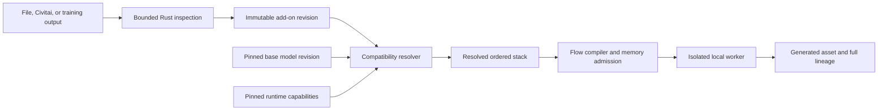

# Media Studio Model Add-ons: LoRA and Embedding System Specification

Status: Accepted; execution baseline implemented, completion gates remain
Research cutoff: 2026-07-15
Scope: Local SD/SDXL/SD3 and FLUX-family image generation, community add-on import, inference, training, and flow integration

The repository now includes safe local safetensors inspection/import, content-addressed add-on storage, architecture/provider capability descriptors, saved-flow selections, compiler preflight, OpenAI rejection, Models/Generate UI, and an offline one-shot Diffusers worker execution path. Public Civitai model/version URLs and AIR identifiers now use a two-stage reviewed import with exact version/file selection, bounded API responses, scan/format/type checks, redirect allowlisting, streamed byte/space limits, SHA-256 and byte-count verification, local tensor inspection, and persisted source claims. Reviewed add-on removal blocks active run dependencies, reports saved-flow and historical-run impact, preserves historical provenance, verifies the managed digest, and uses a crash-recoverable detach/cleanup journal. A local model is advertised only after the pinned runtime imports and that exact model revision/digest has passed a clean offline load on the current runtime fingerprint. Textual-inversion imports persist the exact tensor key, encoder slot, vector count, and embedding width; generation rechecks those shapes, the target encoder width, and every Diffusers-registered multi-vector alias before accepting worker evidence. Standard LoRA, convolutional LoCon, and DoRA imports now persist a content-derived algorithm/dialect profile with exact rank range, target-module count, convolution count, magnitude-vector count, and network-alpha count; the worker reconstructs that profile from immutable bytes before loading and returns it as required evidence. LoHa, LoKr, OFT, and CP-decomposed LoCon are recognized but fail closed until a pinned compatible runner is shipped. Generation also rechecks checkpoint/add-on integrity, applies an explicitly ordered named LoRA/textual-inversion stack, capability-gates normalized denoising windows to denoiser-only LoRAs, validates bounded outputs, and stores model, worker, package, device, add-on, token expansion, strength, schedule, order, and seed lineage. Completion still requires a bundled cross-platform Python/accelerator runtime, real supported-hardware known-answer fixtures, private/authenticated Civitai downloads, supported block/piecewise schedule controls, advanced LyCORIS execution, and training.

## 1. Executive Decision

Media Studio will introduce a first-class **Model Add-ons** system. A model add-on is an immutable, content-addressed resource that modifies or conditions a compatible base model without pretending to be a complete model.

The product exposes one approachable surface, **Looks & Characters**, backed by an explicit, inspectable **Add-on Rack**. The simple surface lets a user add a style, character, or learned word with one click and a strength slider. The rack exposes ordered stacking, component and block scales, denoising schedules, trigger policy, compatibility evidence, and pinned revisions.

The system deliberately keeps three concepts separate:

1. **Weight adapters** modify model weights at inference, including LoRA, LoCon, LoHa, LoKr, and DoRA.
2. **Token embeddings** add learned tokens to one or more tokenizers/text encoders, including textual inversion and pivotal-tuning embeddings.
3. **Reference adapters** condition generation from an image embedding, including IP-Adapter and identity adapters. They share library and compatibility infrastructure but use reference-image inputs, not prompt tokens.

Calling all three “embeddings” would hide incompatible loading, privacy, and reproducibility semantics. They may appear together in the UI, but they remain distinct typed resources through import, compilation, execution, and provenance.

The native runtime adds installed local Diffusers models to its direct-generation allowlist only when both gates pass: the worker health probe reports the exact supported package tuple, and **Verify model** successfully loads the exact model revision/digest offline. Readiness is persisted against the worker, Python, package, architecture/capability, and device fingerprint and is invalidated by a model or runtime change. The built-in FLUX directory and imported single-file SD/FLUX checkpoints use separate package loaders. A community single-file checkpoint that lacks required local configuration or tokenizer/encoder assets fails verification with an actionable diagnostic instead of appearing in Generate.

## 2. Goals

- Import safe community LoRAs and textual-inversion embeddings from a local file, Civitai model/version URL, Civitai AIR, or a commit-pinned Hugging Face repository.
- Support SD 1.x, SD 2.x, SDXL, validated SD3 variants, FLUX.1, FLUX.2, and compatible fine-tuned checkpoints without relying on filenames.
- Load, unload, switch, combine, scale, schedule, and reproduce multiple add-ons.
- Make the normal path understandable without hiding what will affect an image.
- Preserve expert control without prompt-only magic syntax.
- Detect compatibility from tensor facts and runtime probes, with publisher metadata treated as a useful hint rather than proof.
- Train LoRA and textual-inversion resources through guided, family-specific recipes and an advanced editor.
- Store exact base model, adapter, embedding, runtime, optimization, and prompt-token state in every run.
- Preserve source, license, creator, trigger, safety, and training provenance.
- Reject executable checkpoint formats in the normal import path.

## 3. Non-Goals

- Universal execution of every file labelled “LoRA” by a community site.
- Treating hypernetworks, ControlNet, IP-Adapter, textual inversion, and LoRA as interchangeable.
- Silently converting an incompatible add-on, changing the base model, inserting prompt text, lowering quality, or uploading a private add-on.
- Running arbitrary repository code, custom pipelines, installer scripts, or `trust_remote_code`.
- Making research-only adapter methods production defaults before image-specific validation.
- Publishing trained resources to a third-party service without a separate explicit review and upload action.
- Supporting pickle-based `.pt`, `.ckpt`, `.bin`, or `.pth` resources in the normal application process.

## 4. Research Basis and Product Consequences

The design follows the stable mechanism in the original [LoRA paper](https://arxiv.org/abs/2106.09685): keep base weights frozen and inject trainable low-rank updates. [Textual Inversion](https://arxiv.org/abs/2208.01618) instead learns new words in a frozen text encoder from a small reference set. The application must therefore attach LoRA to model modules and textual inversion to a specific tokenizer/text-encoder identity.

Modern runtime support is already expressive. Diffusers can name and combine multiple LoRAs, apply component/layer scales, fuse and unload them, and hot-swap compatible adapters; its documentation also notes that per-layer scaling currently applies only to attention weights and that text-encoder LoRA hot-swapping is not supported. These boundaries become runtime capability flags, not assumptions in the UI. See the official [Diffusers adapter-loading guide](https://huggingface.co/docs/diffusers/main/using-diffusers/loading_adapters) and [LoRA loader API](https://huggingface.co/docs/diffusers/main/api/loaders/lora).

The current Diffusers conversion path detects Kohya `dora_scale` tensors, requires a compatible PEFT version, maps them to PEFT magnitude vectors, and rejects leftover unconverted keys. ComfyUI similarly delegates tensor families to explicit adapter classes and reports keys that no adapter consumed. Machdoch therefore fingerprints ordinary LoRA/LoCon/DoRA tensors and never treats an unfamiliar LyCORIS marker as a successful generic LoRA. See the official [Diffusers LoRA conversion source](https://github.com/huggingface/diffusers/blob/main/src/diffusers/loaders/lora_conversion_utils.py) and [ComfyUI LoRA loader](https://github.com/Comfy-Org/ComfyUI/blob/master/comfy/lora.py).

The official LyCORIS project currently exposes LoCon, LoHa, LoKr, IA3, DyLoRA, and related algorithms through its own functional and wrapper APIs, while warning that downstream interfaces may lag newer types. ComfyUI itself advertises regular LoRA, LoCon, and LoHa support, and real loader reports still show some LoKr/model combinations leaving keys unused. Therefore advanced LyCORIS execution remains a separately pinned runtime with exact-format fixtures rather than an unchecked dependency added to the baseline worker. See the official [LyCORIS repository](https://github.com/KohakuBlueleaf/LyCORIS), [ComfyUI repository](https://github.com/Comfy-Org/ComfyUI), and [ComfyUI LoKr loader report](https://github.com/Comfy-Org/ComfyUI/issues/10973).

Diffusers exposes `callback_on_step_end` for changing supported pipeline state after a denoising step. Machdoch uses that boundary for reproducible normalized start/end windows: initial adapter state is set before the first step, transitions are applied only when a window boundary is crossed, and a pipeline without the callback fails closed. Text-encoder LoRA and textual-inversion conditioning are deliberately excluded because prompt embeddings are resolved before denoising. See the official [Diffusers pipeline callback guide](https://huggingface.co/docs/diffusers/using-diffusers/callback).

Textual inversion may contain more than one vector per visible token. Diffusers expands one visible token into the base token plus numbered aliases, verifies each vector width against the selected text encoder, and requires SDXL CLIP-L and CLIP-G tensors to be loaded through their respective tokenizer/encoder pairs. This requires exact tensor keys, encoder slots, vector counts, widths, and collision-safe aliases in the manifest and runtime evidence. See the official [textual-inversion loader contract](https://huggingface.co/docs/diffusers/main/api/loaders/textual_inversion) and [loader source](https://github.com/huggingface/diffusers/blob/main/src/diffusers/loaders/textual_inversion.py).

ComfyUI reaches the same compatibility boundary through a different execution design: its tokenizer resolves `embedding:` resources at prompt-encoding time, selects an encoder-specific key such as `clip_l`, expands every tensor row into a token group, and ignores a resource whose last dimension does not match the active encoder. Machdoch does not copy ComfyUI prompt syntax or execute its graph, but adopts the same shape-first rule and records the resolved tensor/encoder mapping instead of relying on a filename. See the official [ComfyUI CLIP/tokenizer implementation](https://github.com/Comfy-Org/ComfyUI/blob/master/comfy/sd1_clip.py).

Recent research does not justify a universal “best LoRA” switch:

| Work | Relevant finding | Product decision |
| --- | --- | --- |
| [rsLoRA](https://arxiv.org/abs/2312.03732) | Rank-dependent scaling can limit higher-rank adapters; square-root scaling stabilizes them. | Offer as a capability-gated training option, recorded in the manifest. |
| [DoRA](https://arxiv.org/abs/2402.09353) | Separating magnitude and direction can improve low-rank adaptation. | Recognize DoRA as its own algorithm; do not load it as plain LoRA. |
| [LoRA+](https://arxiv.org/abs/2402.12354) | Separate learning rates for the two matrices can improve convergence. | Advanced optimizer profile only after per-family image benchmarks. |
| [PiSSA](https://arxiv.org/abs/2404.02948) | SVD-based initialization can converge faster in the evaluated language-model setting. | Experimental training initializer, never inferred from a plain LoRA file. |
| [LyCORIS evaluation](https://arxiv.org/abs/2309.14859) | Adapter algorithms and hyperparameters behave differently across concept categories; systematic evaluation matters. | Support LoCon/LoHa/LoKr through a pinned LyCORIS runtime and evaluate by intent, not one global preset. |
| [LoRA-Composer](https://arxiv.org/abs/2403.11627), [Cached Multi-LoRA](https://arxiv.org/abs/2502.04923), and [TARA](https://arxiv.org/abs/2508.08812) | Naive multi-LoRA composition can cause concept confusion, disappearance, and interference. | Preserve stack order, warn about unvalidated combinations, provide A/B comparison, and keep research composition methods experimental. |
| [CRAFT-LoRA](https://arxiv.org/abs/2602.18936) (2026 preprint) | Content/style adapters can benefit from selective aggregation and timestep-dependent guidance rather than one static naive fusion. | The stack contract includes schedules and allows future routing strategies, but CRAFT-style execution remains experimental until its implementation and model coverage are validated. |
| [FREE-Switch](https://arxiv.org/abs/2604.10023) (CVPR Findings 2026) | Different adapters can contribute differently across diffusion steps; a dynamic frequency-guided switch is proposed to reduce content drift and detail loss. | Preserve explicit step schedules in the future stack contract, but keep the reproducible named additive stack as the default until a family-specific implementation passes known-answer image evaluation. |
| [Zero-Shot Personalization via Textual Inversion](https://arxiv.org/abs/2603.23010) (2026 preprint) | A learned network can predict object-specific embeddings without per-object optimization. | Treat predicted embeddings as a future generator/reference method with its own model dependency, not as proof that classic textual-inversion files are universally portable. |
| [Directional Textual Inversion](https://arxiv.org/abs/2512.13672) (2025 preprint) | Direction and norm in CLIP token space can affect concept fidelity and prompt contextualization. | Preserve imported vectors byte-for-byte and add evaluation/diagnostics before considering any explicit derived normalization; never silently renormalize community embeddings. |
| [Prompt-Aware Multi-LoRA](https://arxiv.org/abs/2606.03792) (FG 2026) | Prompt-aware routing reduces the interference seen when multiple independently trained adapters are combined with naive static weights. | Keep ordered additive named adapters as the reproducible baseline; expose learned routing only as a separately versioned experimental strategy after fixture evaluation. |
| [SSR-Merge](https://arxiv.org/abs/2606.10617) (2026 preprint) | Subspace signal routing proposes a training-free alternative to naive weight-space addition for composing diffusion LoRAs. | Preserve immutable source adapters and treat SSR-style merging as an experimental derived-resource strategy, never an invisible import-time mutation. |
| [LoRAtorio](https://arxiv.org/abs/2508.11624) (2025 preprint) | Intrinsic skill composition reports improvements over prior LoRA composition on multiple latent diffusion models. | Evaluate it against the named additive baseline and exact image fixtures before exposing it; do not make one research merge strategy the default for unrelated community stacks. |

The Hugging Face PEFT project currently implements rsLoRA, DoRA, PiSSA, LoRA+, LoRA-FA, and other variants, but much of that evidence targets language models. The [PEFT LoRA guide](https://huggingface.co/docs/peft/main/en/developer_guides/lora) is an implementation reference, not evidence that every option improves every diffusion model. Machdoch promotes a method to a recommended image-training preset only after deterministic family-specific benchmarks.

For FLUX.2 klein, Black Forest Labs recommends training the undistilled base variant, diverse high-quality datasets, consistent unique trigger words, and captions that describe visible content while omitting the style being taught. Its 4B and 9B variants also have different licenses and hardware needs. These become versioned family recipes rather than global defaults. See the official [FLUX.2 klein training guide](https://docs.bfl.ai/flux_2/flux2_klein_training) and [style-training example](https://docs.bfl.ai/flux_2/flux2_klein_training_example).

[IP-Adapter](https://arxiv.org/abs/2308.06721) uses decoupled image cross-attention rather than learned prompt tokens. Diffusers supports separate scales, multiple IP-Adapters, and block-level control in its [IP-Adapter guide](https://huggingface.co/docs/diffusers/using-diffusers/ip_adapter). It belongs in the same resource library, but not in the textual-inversion contract.

## 5. Terminology

| Term | Definition |
| --- | --- |
| Base model | Complete runnable model revision, identified by component and package digests. |
| Add-on | Generic library resource that requires a compatible base model or pipeline. |
| Weight adapter | Add-on that contributes parameter deltas to named model modules. |
| Token embedding | Add-on that contributes one or more learned vectors to named tokenizer/text-encoder slots. |
| Reference adapter | Add-on plus an image encoder that consumes one or more reference images. |
| Trigger phrase | Suggested prompt text associated with an add-on; it is not necessarily a new token. |
| Learned token | Token alias backed by one or more imported vectors. |
| Add-on revision | Immutable descriptor and file set with a SHA-256 identity. |
| Add-on stack | Ordered, immutable revision of enabled add-ons and their runtime settings. |
| Look profile | Friendly saved bundle of a model, add-on stack, trigger selections, prompt fragments, and optional references. It references resources; it does not merge them. |
| Fusion | Reversible or cached runtime application of adapter deltas to a loaded model. |
| Merge | Creation of a new derived model asset with adapter deltas written into model weights. |

## 6. Support Policy

Every `(base model revision, add-on revision, runtime revision, precision/quantization)` tuple has one support state:

| State | Meaning | UI behavior |
| --- | --- | --- |
| `verified` | Exact tuple passed a pinned probe and, where applicable, a known-answer generation test. | One-click use; green compatibility label. |
| `compatible` | Tensor targets and encoder dimensions match a supported architecture, but this exact tuple has not been generated locally. | Allow after a lightweight probe; neutral “Expected to work” label. |
| `experimental` | A pinned runtime can attempt it, but semantics or quality are not production-validated. | Expert mode, warning, explicit opt-in. |
| `incompatible` | A required tensor target, encoder dimension, base identity, or runtime feature conflicts. | Block; explain the exact mismatch. |
| `unsupported` | The algorithm or format has no installed trusted runner. | Keep in library; do not expose a run action. |
| `unknown` | Inspection is incomplete. | Require inspection/probe; never guess from filename. |

“Full support” means full lifecycle support for a declared tuple: import, inspect, compatibility, apply, stack, reproduce, remove safely, train where declared, evaluate, package, and diagnose. It does not mean executing an undeclared algorithm.

### 6.1 Target family matrix

This is a target matrix, not a promise made before the local worker exists.

| Family | Weight adapters | Token embeddings | Initial support target |
| --- | --- | --- | --- |
| SD 1.x / 2.x | Diffusers/PEFT LoRA, Kohya LoRA; LoCon via validated runner; later LoHa/LoKr | Single- or multi-vector CLIP textual inversion | `verified` after fixture and generation probes |
| SDXL | Diffusers/PEFT and Kohya LoRA; LoCon; later LoHa/LoKr | Dual-CLIP textual inversion with explicit `clip_l`/`clip_g` slots | `verified` after dual-encoder probes |
| SD3.x | LoRA only where exact pipeline targets are mapped | No generic promise; capability-gated by tokenizer and encoder slots | `compatible`/`experimental` per variant |
| FLUX.1 | Transformer LoRA; text-encoder LoRA only if the runtime declares it | Pivotal-tuning/token bundles only in a pinned compatible runner | LoRA first; token embeddings experimental |
| FLUX.2 klein | LoRA trained against the documented base revision; distilled inference compatibility is recorded explicitly | Pivotal-tuning/token bundles only where probed | LoRA first, with separate 4B/9B descriptors |
| User fine-tune | Inherits nothing solely from its family label | Inherits nothing solely from its family label | Requires target-key/dimension probe |
| Remote API model | Only the provider’s explicit adapter or finetune contract | Only the provider’s explicit token contract | Never emulated through prompt text |

OpenAI image generation currently declares no local LoRA/textual-inversion loading path in Machdoch. The UI must not show local add-ons as applicable to that provider.

## 7. Product Experience

### 7.1 Information architecture

The existing Models view becomes **Models & Add-ons** with these tabs:

- **Models**: complete local/downloadable/remote models.
- **Looks & Characters**: LoRA, LyCORIS, and textual-inversion resources.
- **Reference Controls**: IP-Adapter, identity, and future image-conditioning resources.
- **Training**: datasets, jobs, checkpoints, and trained results.

Users do not need to know “LoRA” to apply one. Cards lead with the declared intent—Style, Character, Object, Concept, Speed, Edit behavior—and show the algorithm as secondary technical metadata.

### 7.2 Normal-user import

The primary action is **Add a look or character**. It accepts:

- drag-and-drop or file picker for `.safetensors`;
- a Civitai model or model-version URL;
- a Civitai AIR (`modelId` or `modelId@versionId`);
- a pinned Hugging Face URL/repository revision.

The review screen shows:

- resource name, author/source, revision, file size, SHA-256, and preview;
- detected kind and algorithm;
- “Works with your selected model”, “Needs SDXL”, “Needs FLUX.2 klein 4B”, or an exact blocking reason;
- publisher trigger phrases and a one-click **Add trigger to prompt** action;
- license/commercial/derivative/credit restrictions and NSFW/POI metadata where supplied;
- what stays local and whether any remote upload would occur;
- warnings when publisher metadata and inspected tensors disagree.

Import never selects a different base model automatically. If a compatible base is not installed, **Review model install** opens the existing reviewed model-install flow.

### 7.3 Simple generation surface

The prompt composer and generation inspector contain a **Looks & Characters** row:

```text
[ + Add ] [ Cinematic portrait  0.75  × ] [ Character A  0.90  × ]
                     2 add-ons · Expected to work
```

Selecting a card:

1. Adds an explicit stack entry.
2. Shows a strength slider initialized from the add-on’s reviewed recommendation, otherwise `1.0`.
3. Offers trigger chips; the user chooses which chips to insert.
4. Marks inserted trigger text so removing the add-on can offer to remove only the text Machdoch inserted.
5. Runs compatibility preflight before queueing, not after a long model load.

Simple mode exposes a conservative slider range of `0.0..2.0`. It does not claim that `1.0` is always optimal. A card may provide publisher-recommended and locally-evaluated ranges with their provenance. Negative or higher strengths are expert-only and runtime-gated.

### 7.4 Add-on Rack

**Advanced → Add-on Rack** reveals the same stack, never a separate hidden configuration:

- ordered enable/disable/reorder controls;
- global strength;
- denoiser/transformer and each text-encoder scale;
- canonical block/layer scale editor where the runtime supports it;
- denoising-step curve (`start`, `end`, or piecewise points);
- optional spatial region/mask scope where the runtime implements regional adapter routing;
- prompt trigger mode and learned-token alias;
- reference image, mask, and reference scale for reference adapters;
- runtime support, memory estimate, load/fusion state, and compatibility evidence;
- **Compare with base**, **Compare strengths**, and **Save as Look profile**.

Unsupported controls remain visible only in an explanation panel, not as sliders that are ignored. Per-block scaling is compiled only for targets the runner maps. Diffusers’ attention-only scaling limitation must be disclosed when non-attention LoRA tensors would remain at full scale.

### 7.5 Stack conflicts

Multiple compatible files are not automatically a validated combination. When a stack is new, Machdoch labels it **Combination not evaluated** and offers a small fixed-seed comparison grid. Warnings are evidence-based:

- duplicate or overlapping learned-token aliases;
- incompatible base or encoder targets;
- multiple adapters targeting most of the same modules at high strength;
- a speed adapter that requires a different scheduler/step range;
- an adapter that is incompatible with the selected quantization or compiled engine;
- a previously observed NaN, load failure, or severe quality regression for the exact tuple.

The application does not invent a universal sum-of-strength limit. Research methods such as token-aware routing or frequency-based ordering remain optional experimental stack strategies with pinned implementations and baseline comparison.

### 7.6 Prompt semantics

Trigger phrases are suggestions. Learned tokens are dependencies. The prompt stores them structurally:

```ts
interface MediaPromptTokenUse {
  addonRevisionId: string;
  displayAlias: string;
  internalTokens: string[];
  channel: "positive" | "negative";
  source: "user" | "machdoch-inserted" | "flow";
  promptRange?: { start: number; end: number };
}
```

- A trigger chip inserts ordinary text and may be edited normally.
- A textual-inversion chip inserts a display alias linked to exact internal token expansion.
- Negative-prompt embeddings are inserted into the negative channel explicitly; the filename or community convention does not move them there silently.
- The implemented baseline rejects collisions across the visible token and every numbered multi-vector alias before loading. A future display-to-internal namespace may offer automatic resolution, but it must remain explicit in the compiled prompt and provenance.
- Removing an add-on never deletes text the user subsequently changed without confirmation.
- Prompt export can render A1111/Comfy syntax, but that syntax is not the internal source of truth.

### 7.7 Training experience

The guided flow asks for:

1. **What should be learned?** Character/person, object/product, style/look, general concept, or edit behavior.
2. **Which model will use it?** Only locally trainable, license-compatible base revisions are offered.
3. **Training images.** The curator checks duplicates, resolution, blur/artifacts, captions, watermark, consent, license, and dataset diversity.
4. **Activation name.** A collision check proposes a unique trigger token.
5. **Review and train.** Show estimated time, VRAM/RAM/disk, privacy location, checkpoints, and known limitations.

Normal mode selects a versioned recipe from `(model revision, runtime revision, intent, hardware class)`. Expert mode exposes target modules, rank and alpha, algorithm, optimizer, learning rates, scheduler, steps/epochs, resolution buckets, repeats, caption dropout, prior preservation, text-encoder training, precision, gradient accumulation/checkpointing, validation prompts, seed, checkpoint cadence, and resume policy.

The result page always includes base-vs-adapter grids at fixed seeds, recommended strength/trigger, failure cases, exact base/runtime, dataset statement, license, and **Use in generation**.

## 8. Domain Contracts

### 8.1 Add-on descriptor

```ts
type MediaModelAddonKind =
  | "weight-adapter"
  | "token-embedding"
  | "reference-adapter"
  | "addon-bundle";

type MediaWeightAdapterAlgorithm =
  | "lora"
  | "locon"
  | "loha"
  | "lokr"
  | "dora";

type MediaModelAddonFormat =
  | "diffusers-lora"
  | "peft-lora"
  | "kohya-lora"
  | "lycoris"
  | "diffusers-textual-inversion"
  | "a1111-textual-inversion"
  | "machdoch-addon-bundle";

interface MediaModelAddonDescriptor {
  schemaVersion: 1;
  id: string;
  displayName: string;
  kind: MediaModelAddonKind;
  declaredIntent: Array<
    "style" | "character" | "person" | "object" | "concept" |
    "speed" | "structure" | "edit-behavior" | "negative-prompt" | "unknown"
  >;
  currentRevisionId: string;
  creator?: { name: string; sourceProfileUrl?: string };
  source: MediaModelAddonSource;
  license: MediaModelLicense;
  contentRating: "safe" | "sensitive" | "adult" | "unknown";
  personOfInterest: boolean | null;
  createdAt: string;
  updatedAt: string;
}

interface MediaModelAddonSource {
  kind: "local-file" | "civitai" | "hugging-face" | "training-run" | "derived";
  canonicalUrl?: string;
  civitaiModelId?: number;
  civitaiModelVersionId?: number;
  huggingFaceRepoId?: string;
  huggingFaceCommit?: string;
  publisherMetadataObservedAt?: string;
}
```

### 8.2 Immutable revision

```ts
interface MediaModelAddonRevision {
  schemaVersion: 1;
  id: string;
  addonId: string;
  digest: string;
  byteSize: number;
  blobId: string;
  format: MediaModelAddonFormat;
  algorithm?: MediaWeightAdapterAlgorithm;
  tensorInventoryDigest: string;
  metadataDigest: string;
  importedAt: string;
  triggerPhrases: MediaAddonTriggerPhrase[];
  recommendedStrength?: MediaSourcedRange;
  compatibilityClaims: MediaAddonCompatibilityClaim[];
  weightPayload?: MediaWeightAdapterPayload;
  tokenPayload?: MediaTokenEmbeddingPayload;
  bundlePayload?: MediaAddonBundlePayload;
  trainingProvenance?: MediaAddonTrainingProvenance;
  warnings: MediaAddonDiagnostic[];
}

interface MediaWeightAdapterPayload {
  algorithm: MediaWeightAdapterAlgorithm;
  dialect: "diffusers" | "peft" | "kohya" | "lycoris";
  targetComponents: Array<
    "denoiser" | "transformer" | "text-encoder-1" |
    "text-encoder-2" | "text-encoder-3"
  >;
  targetModulePatterns: string[];
  targetInventoryDigest: string;
  rankSummary: { minimum: number; maximum: number; heterogeneous: boolean };
  alphaSummary?: { minimum: number; maximum: number; heterogeneous: boolean };
  usesDoRAMagnitude: boolean;
  containsConvolutionTargets: boolean;
  precision: string[];
}

interface MediaTokenEmbeddingPayload {
  encoderSlots: Array<{
    slot: "clip-l" | "clip-g" | "t5-1" | "t5-2" | string;
    tensorKey: string;
    tokenizerFingerprint?: string;
    textEncoderFingerprint?: string;
    vectorCount: number;
    embeddingDimension: number;
    dtype: string;
    declaredToken?: string;
  }>;
}

interface MediaAddonBundlePayload {
  members: Array<{
    revisionId: string;
    role: "weight-adapter" | "token-embedding" | "manifest";
  }>;
}

interface MediaAddonTriggerPhrase {
  text: string;
  recommendedChannel: "positive" | "negative" | "either";
  source: "embedded" | "publisher" | "training-run" | "user";
}

interface MediaSourcedRange {
  minimum: number;
  maximum: number;
  preferred?: number;
  source: "publisher" | "local-evaluation" | "user";
}

interface MediaAddonCompatibilityClaim {
  architectureId?: string;
  baseModelId?: string;
  baseRevision?: string;
  baseComponentDigest?: string;
  source: "embedded" | "publisher" | "training-run" | "user";
}

interface MediaAddonTrainingProvenance {
  trainingRunId: string;
  baseModelId: string;
  baseRevision: string;
  baseDigest: string;
  datasetRevisionId: string;
  datasetDigest: string;
  recipeId: string;
  recipeRevision: string;
  expandedConfigDigest: string;
  runtimeId: string;
  runtimeRevision: string;
  seed: number;
}
```

Raw publisher metadata is preserved as bounded, sanitized JSON with field-level provenance. It never overrides inspected tensor dimensions, digests, or algorithm facts.

### 8.3 Compatibility

```ts
type MediaAddonCompatibilityState =
  | "verified" | "compatible" | "experimental"
  | "incompatible" | "unsupported" | "unknown";

interface MediaAddonCompatibilityReport {
  schemaVersion: 1;
  addonRevisionId: string;
  modelId: string;
  modelRevision: string;
  runtimeId: string;
  runtimeRevision: string;
  precision: string;
  quantization?: string;
  state: MediaAddonCompatibilityState;
  evidence: Array<{
    source: "exact-base-digest" | "architecture" | "tensor-target" |
      "encoder-fingerprint" | "publisher-claim" | "runtime-probe" |
      "known-answer-test";
    outcome: "pass" | "warn" | "fail";
    detail: string;
  }>;
  diagnostics: MediaAddonDiagnostic[];
  probedAt?: string;
}
```

Compatibility evaluation order:

1. Exact base/component digest, when declared.
2. Architecture and component graph identity.
3. Adapter target keys, tensor shapes, ranks, alpha/magnitude requirements, and encoder dimensions.
4. Runtime algorithm and dialect support.
5. Precision, quantization, offload, compilation, and optimization constraints.
6. Tokenizer alias availability and learned-token collision check.
7. Bounded load probe in an isolated worker.
8. Tiny known-answer generation probe for promotion to `verified`.

A Civitai `baseModel` string is publisher evidence only. “SDXL” cannot prove compatibility with every SDXL fine-tune, and a custom checkpoint cannot inherit compatibility solely from its selected family.

### 8.4 Runtime capability descriptor

```ts
interface MediaAddonRuntimeCapabilities {
  formats: MediaModelAddonFormat[];
  algorithms: MediaWeightAdapterAlgorithm[];
  modelFamilies: string[];
  components: string[];
  maxActiveWeightAdapters: number;
  maxActiveTokenEmbeddings: number;
  supportsMultipleAdapters: boolean;
  supportsPerComponentScale: boolean;
  supportsPerBlockScale: boolean;
  supportsSpatialAdapterMask: boolean;
  scaledTargetClasses: Array<"attention" | "linear" | "conv2d" | string>;
  supportsStepSchedule: boolean;
  supportsNegativeScale: boolean;
  supportsHotSwap: boolean;
  supportsTextEncoderHotSwap: boolean;
  supportsReversibleFusion: boolean;
  supportsPersistentMerge: boolean;
  supportsTraining: MediaAddonTrainingCapability[];
  incompatibleQuantizations: string[];
}

interface MediaAddonTrainingCapability {
  kind: "weight-adapter" | "token-embedding" | "addon-bundle";
  algorithms: MediaWeightAdapterAlgorithm[];
  modelFamilies: string[];
  supportsTextEncoderTraining: boolean;
  supportsCheckpointResume: boolean;
}
```

The compiler rejects any requested control absent from this descriptor. It never clamps or ignores an unsupported add-on setting silently.

### 8.5 Add-on stack

```ts
interface MediaModelAddonStack {
  schemaVersion: 1;
  id: string;
  revision: number;
  digest: string;
  displayName?: string;
  entries: MediaModelAddonStackEntry[];
}

interface MediaModelAddonStackEntry {
  id: string;
  addonRevisionId: string;
  enabled: boolean;
  order: number;
  strength: number;
  componentScales?: Partial<Record<
    "denoiser" | "transformer" | "text-encoder-1" |
    "text-encoder-2" | "text-encoder-3",
    number
  >>;
  blockScales?: MediaCanonicalBlockScale[];
  stepSchedule?: Array<{ progress: number; scale: number }>;
  spatialScope?: {
    maskAssetId: string;
    mode: "include" | "exclude";
    featherPixels: number;
  };
  triggerPolicy: "manual" | "suggest" | "insert-and-track";
  selectedTriggerPhrases: string[];
  tokenAlias?: string;
  tokenChannel?: "positive" | "negative";
  referenceAssetIds?: string[];
  referenceMaskAssetIds?: string[];
}

interface MediaCanonicalBlockScale {
  component: "denoiser" | "transformer" | "text-encoder-1" |
    "text-encoder-2" | "text-encoder-3";
  blockId: string;
  scale: number;
}
```

`progress` is normalized from `0.0` to `1.0` over the runtime’s denoising schedule, not a provider-specific raw timestep. The compiled plan stores the translated schedule and scheduler revision.

Stack identity includes entry order, revision digests, all scales and schedules, token aliases, reference asset digests, base revision, runtime revision, precision, quantization, scheduler, and optimization profile. Any change invalidates the relevant compiled/fused cache.

### 8.6 Diagnostics

```ts
type MediaAddonDiagnosticCode =
  | "ADDON_UNSAFE_FORMAT"
  | "ADDON_HEADER_INVALID"
  | "ADDON_KIND_AMBIGUOUS"
  | "ADDON_ALGORITHM_UNSUPPORTED"
  | "ADDON_BASE_MISMATCH"
  | "ADDON_TARGET_MISSING"
  | "ADDON_TENSOR_SHAPE_MISMATCH"
  | "ADDON_ENCODER_MISMATCH"
  | "ADDON_TOKEN_COLLISION"
  | "ADDON_STACK_CONFLICT"
  | "ADDON_SCALE_UNSUPPORTED"
  | "ADDON_SCHEDULE_UNSUPPORTED"
  | "ADDON_QUANTIZATION_UNSUPPORTED"
  | "ADDON_LICENSE_REVIEW_REQUIRED"
  | "ADDON_PROBE_FAILED"
  | "ADDON_RESOURCE_LIMIT";

interface MediaAddonDiagnostic {
  code: MediaAddonDiagnosticCode;
  severity: "info" | "warning" | "error";
  addonStackEntryId?: string;
  component?: string;
  message: string;
  technicalDetail?: string;
  evidence?: string[];
  action?: string;
}
```

Each diagnostic contains severity, affected entry/component, evidence, a concise normal-user message, technical detail, and an actionable remedy.

## 9. Flow and Compilation Integration

The existing `adapterRef` and `adapterWeight` types migrate to explicit types:

- `modelAddonRef`
- `modelAddonStack`
- `promptTokenSet`
- `trainedAddon`
- `addonCompatibilityReport`

Existing serialized flows remain readable through a versioned adapter that maps old LoRA-only values to a one-entry stack. New flows do not serialize prompt-only `<lora:file:weight>` syntax.

Required nodes:

| Node | Purpose |
| --- | --- |
| `MODEL_ADDON_SELECT` | Select and pin an immutable add-on revision. |
| `MODEL_ADDON_STACK` | Create the ordered stack with scales, schedule, triggers, and references. |
| `ADDON_COMPATIBILITY_GATE` | Compile-time/run-time compatibility and license gate. |
| `PROMPT_TOKEN_APPLY` | Add structured learned-token/trigger uses to a prompt. |
| `LORA_TRAIN` | Train a weight adapter from a curated dataset and pinned recipe. |
| `TEXTUAL_INVERSION_TRAIN` | Train token embeddings for declared encoder slots. |
| `ADDON_EVALUATE` | Produce fixed-seed base/add-on and compositional reports. |
| `ADDON_PACKAGE` | Export safetensors, manifest, model card, and evaluation report. |
| `ADDON_FUSE` | Create an ephemeral runtime cache artifact. |
| `ADDON_MERGE` | Create a new derived model asset after explicit review. |

Simple-mode generation compiles into these same graph values. Opening a simple recipe in Flow reveals the stack and token application rather than losing information.

Compiler sequence:

1. Resolve every logical add-on ID to an immutable revision and blob digest.
2. Resolve the exact model revision, runtime, precision, quantization, and optimization profile.
3. Re-evaluate cached compatibility if any identity changed.
4. Validate trigger/token aliases and reference assets.
5. Validate scale/schedule/fusion requests against runtime capabilities.
6. Estimate adapter CPU/GPU memory and load latency.
7. Freeze an ordered `ResolvedAddonStack` in the execution plan.
8. Include the resolved stack digest in job idempotency, cache, lineage, and run report.

## 10. Storage Model

New SQLite tables are additive to the existing `media_models` and `media_model_installations` tables:

| Table | Purpose |
| --- | --- |
| `media_model_addons` | Mutable library identity, display metadata, current revision, and lifecycle. |
| `media_model_addon_revisions` | Immutable kind/format/algorithm descriptor, tensor inventory, metadata, and digest. |
| `media_model_addon_files` | Revision file roles and immutable Media Blob references. |
| `media_model_addon_sources` | Civitai/Hugging Face/local/training/derived provenance. |
| `media_model_addon_removals` | Crash-recoverable prepared/detached/cleanup state for immutable add-on removal. |
| `media_model_addon_compatibility` | Cached tuple-specific reports and probe timestamps. |
| `media_model_addon_stacks` | Named logical stacks. |
| `media_model_addon_stack_revisions` | Immutable ordered stack JSON and digest. |
| `media_run_model_addons` | Per-run pinned entries, translated settings, and observed load result. |
| `media_addon_training_runs` | Dataset, recipe, checkpoints, metrics, and output revision. |
| `media_addon_evaluations` | Base/add-on/stack comparison reports and sample asset links. |

Rules:

- Weight bytes are Media Blobs; database rows never contain an arbitrary execution path.
- A digest collision or changed source creates an error or a new revision, never byte replacement.
- User-edited display metadata does not alter the immutable publisher metadata or revision digest.
- A stack references revision IDs, not “latest”. Updating an add-on creates an explicit stack upgrade review.
- Deletion shows dependent stacks, flows, runs, training reports, and derived models. Historical runs retain metadata even if bytes are later garbage-collected.
- Civitai/Hugging Face authentication tokens remain in the application secret store and never enter add-on rows, manifests, logs, or exports.

## 11. Import and Discovery

### 11.1 Local safetensors inspection

Extend the existing bounded safetensors inspector in `src-tauri/src/media/model_import.rs`. Complete checkpoints continue through model import; likely add-ons route to a dedicated add-on review instead of being treated as a blocking dead end.

Inspection is data-only and bounded:

1. Require a regular, non-symlink `.safetensors` file.
2. Bound header size, metadata strings, key count, dimensions, and total tensor count.
3. Validate offsets, overlap/gaps, dtype/shape byte size, duplicate keys, and complete data coverage.
4. Hash the reviewed header and file; use a review token to detect changes before import.
5. Classify format/algorithm from tensor-key grammar and required tensor pairs, not a substring count alone.
6. Extract rank range, network-alpha presence/count, DoRA magnitude coverage, convolution targets, component targets, encoder dimensions, and embedded metadata. Immutable hashes preserve the exact tensor values.
7. Refuse ambiguous classification until a trusted worker inspector can identify it.
8. Copy to staging while hashing, re-parse, then atomically promote or quarantine.

The production classifier currently:

- Diffusers/PEFT LoRA keys;
- Kohya/A1111 `lora_unet_*`, `lora_te*_*`, and FLUX transformer dialects;
- executes ordinary matrix LoRA, convolutional LoCon without `lora_mid`, and DoRA only through a profile-verified Diffusers/PEFT path;
- recognizes LoHa, LoKr, OFT, and CP-decomposed LoCon signatures as distinct unsupported algorithms and blocks import instead of downgrading them to ordinary LoRA;
- Diffusers and A1111 textual-inversion safetensors, including SDXL encoder slots;
- Machdoch bundle manifests containing separate adapter and embedding members.

The original file is retained unchanged. Format translation happens in a pinned worker or creates a new derived canonical revision; it never rewrites the imported source in place.

### 11.2 Unsafe legacy files

Pickle deserialization can execute arbitrary code. Hugging Face’s own [pickle security documentation](https://huggingface.co/docs/hub/security-pickle) states that import scanning is best-effort and not foolproof. Safetensors is a data-only, inspectable format with bounded header metadata; see its official [format definition](https://github.com/huggingface/safetensors).

Therefore:

- `.pt`, `.pth`, `.bin`, and `.ckpt` add-ons are rejected even if Civitai or another host reports a successful scan.
- The UI suggests downloading a publisher-provided safetensors variant.
- A future legacy conversion utility, if added, must be a separate opt-in sandbox with no network, no workspace credentials, strict resource limits, disposable storage, and a warning that conversion executed untrusted serialization. It is outside this specification and must not run inside the desktop or normal model worker.

### 11.3 Civitai integration

Civitai’s public API exposes model type, model/version identity, base-model label, trained words, files, file format/size, scan fields, images, creator, and licensing flags. It also supports version lookup by hash. See Civitai’s official [REST API reference](https://github.com/civitai/civitai/wiki/REST-API-Reference). The official [Civitai Comfy nodes](https://github.com/civitai/civitai_comfy_nodes) establish the short AIR convention (`modelId` or `modelId@versionId`); Machdoch additionally accepts a full `urn:air:…:civitai:modelId@versionId` identifier.

Implemented public-download baseline: inspection fetches no model bytes. It accepts only canonical Civitai HTTPS sources, resolves and freezes the exact model/version, accepts only LoRA or textual-inversion types, and permits download only for one unambiguous primary (or sole eligible) `.safetensors` Model file with successful Civitai pickle/virus scan claims, a bounded size, and a valid SHA-256. A second metadata fetch must reproduce the review token before streaming begins. Redirects are restricted to Civitai and its pinned production R2 delivery-host pattern. The downloaded file must match the reviewed length and digest and then pass Machdoch’s local tensor classifier. Civitai HTML and preview images are not rendered. Private, early-access, or authenticated downloads intentionally fall back to browser download plus local import until secret-store support is implemented.

Import flow:

1. Normalize a Civitai model URL, version URL, or AIR to model/version IDs.
2. Fetch model and exact version metadata from the API.
3. Accept only declared `LORA` or `TextualInversion` resources in this flow.
4. Select the unique safe primary safetensors file, or the sole eligible safe file; block ambiguous multi-file versions and ask the user to choose on Civitai.
5. Review name, version, creator, base claim, trained words, size, SHA/hash if supplied, license flags, content rating, and preview metadata.
6. Download from the reviewed model-version endpoint with redirect-count, hostname, TLS, content-length, timeout, and disk limits.
7. Hash and inspect locally. API metadata cannot override a local tensor mismatch.
8. Record `modelId`, `modelVersionId`, file ID/name, canonical page, observation time, external scan/license claims, and actual SHA-256 as source metadata next to the immutable imported digest.
9. If the hash already exists, link the newly discovered source metadata to the existing immutable revision.

Remote descriptions are untrusted HTML and must be sanitized. Preview images use the existing remote-asset privacy/content policy and do not enter a training dataset automatically.

The first release supports paste/import, not an unbounded in-app marketplace feed. Search/discovery can follow after moderation, pagination, caching, content preferences, and API lifecycle handling are defined.

### 11.4 Metadata precedence

For any disputed field:

1. Locally inspected tensor facts.
2. Successful pinned runtime probe.
3. Embedded safetensors metadata.
4. Exact source-version API metadata.
5. User annotation.
6. Filename heuristic.

All sources remain visible. A user may correct a display label or intent, but not overwrite tensor facts or turn an incompatible probe into `verified`.

## 12. Local Runtime Architecture

### 12.1 Worker boundary

Add a versioned `local-diffusers-image` worker with a locked environment containing pinned PyTorch, Diffusers, Transformers, PEFT, Accelerate, and safetensors versions. LyCORIS runs either as a pinned dependency in a separately versioned worker image or as another locked runtime family so it cannot destabilize baseline LoRA.

Implemented baseline: `media-diffusers-worker/1.3.0` is bundled as a resource with exact package pins for PyTorch 2.13.0, Diffusers 0.39.0, Transformers 5.13.0, Accelerate 1.14.0, PEFT 0.19.1, safetensors 0.8.0, and Pillow 12.3.0. The health probe fails closed on missing or mismatched packages. Hub access, telemetry, credentials, pickle formats, repository code, relative paths, symlinks, unexpected output names, oversized output, and schema drift are rejected. Worker schema 4 requires exact textual-inversion and LoRA tensor profiles plus normalized LoRA denoising schedules in requests and evidence. The release build must still bundle tested platform/accelerator-specific Python and PyTorch distributions; falling back to a compatible system Python is development support, not the final consumer installation story. Current package versions were verified against [Diffusers on PyPI](https://pypi.org/project/diffusers/), [PyTorch on PyPI](https://pypi.org/project/torch/), and the official [Diffusers 0.39 loader APIs](https://huggingface.co/docs/diffusers/main/api/loaders/lora).

Typed worker commands:

```text
describe_runtime
inspect_addon
probe_model
probe_addon
estimate_generation
load_model
load_addon_stack
activate_addon_stack
generate
unload_addon_stack
train_addon
resume_addon_training
evaluate_addon
fuse_addon_stack
merge_addon_stack
```

The initial one-shot worker implements `describe_runtime` as `probe`, `probe_model` as `probe-model`, and the clean-load `generate` path. Add-on-stack known-answer probing, estimates, long-lived residency, training, evaluation, fusion, and merge remain explicit later gates; they are not simulated by the desktop process.

Commands accept catalog IDs, immutable digests, typed settings, and scoped file handles. They do not accept arbitrary module names, Python expressions, command-line fragments, or repository code.

### 12.2 Execution sequence



For a job, the worker:

1. Verifies model, add-on, and manifest digests.
2. Loads the exact model components and optimization profile.
3. Registers textual-inversion aliases in the declared tokenizer/text-encoder slots.
4. Loads weight adapters under digest-derived internal names.
5. Applies ordered scales, supported per-block settings, and schedules.
6. Runs a no-allocation or minimal-allocation preflight where available.
7. Generates and reports actual loaded targets, ignored keys (which are errors unless explicitly allowed), peak memory, and runtime warnings.
8. Restores or discards worker state according to its isolation policy.

### 12.3 Stacking and scaling

- Additive multi-LoRA through named adapters is the baseline strategy.
- Entry order remains part of identity even when a particular runtime’s arithmetic is commutative.
- Per-component scales map from canonical roles to runtime-specific modules.
- Per-block scales use a model-family block map owned by the runtime; raw regex is expert developer configuration, not a flow value.
- Step schedules are applied through a supported denoising callback. If a compiled/quantized engine cannot change scales dynamically, compilation fails or the user chooses a supported static plan.
- Spatial scopes require an explicit aligned Media Studio mask and a runner that declares regional adapter routing. They are not approximated by cropping a prompt or mutating an adapter globally.
- Textual-inversion embeddings are loaded before prompt encoding and remain tied to exact encoder slots.
- A token embedding has no independent numeric “LoRA strength”. Prompt weighting, where supported, is a prompt feature and stored separately.

### 12.4 Hot swap and residency

Diffusers hot swap can reduce recompilation for compatible LoRAs, but ranks, targeted layers, and text-encoder targets can force fallback or recompilation. Machdoch uses it only when the runtime proves the replacement fits the resident adapter envelope.

- Internal adapter names derive from revision digests, never filenames.
- Compiled worker pools declare maximum rank and target-module envelopes.
- Text-encoder-targeting LoRAs use a clean load path until the runtime declares safe hot swap.
- Workers group queued jobs by base revision, optimization profile, and stack compatibility while respecting user priority.
- Resident state is never assumed: every job plan fully describes the stack.
- Unload verification checks that base-only output state is restored before reusing a worker.

### 12.5 Fusion and merge

**Ephemeral fusion** is an optimization cache:

- disabled by default until the tuple passes an unfused-vs-fused validation;
- uses safe fusion/NaN checks where available;
- keyed by the full stack and runtime identities;
- discardable and never presented as the source add-on;
- invalidated by driver, library, model, adapter, precision, quantization, schedule, or optimization changes.

**Persistent merge** is an explicit derived-model operation:

- allowed only for compatible weight adapters and a local model the license permits deriving;
- shows projected disk, precision loss, non-reversibility of the derived bytes, and combined license obligations;
- produces a new `media_models` entry with complete lineage;
- never deletes or mutates the base/add-on sources;
- does not absorb textual-inversion or reference-adapter semantics unless a separately specified export format can preserve them.

### 12.6 Resource estimation

Estimates add these fields to the existing scheduler contract:

- add-on CPU and GPU resident bytes;
- adapter injection/translation peak;
- tokenizer/text-encoder resize and embedding bytes;
- fusion workspace and fused-cache disk;
- hot-swap envelope and potential compilation cost;
- training optimizer, gradient, activation, checkpoint, preview, and dataset-cache bytes.

No OOM recovery silently changes resolution, batch, precision, model, add-ons, or stack strength.

## 13. Training Architecture

### 13.1 Versioned recipes

Training recipes are signed/catalogued data with:

- recipe ID and revision;
- exact compatible base-model and runtime ranges;
- intent and algorithm;
- default/allowed parameters;
- dataset checks and caption policy;
- memory estimator version;
- validation prompt suite and metrics;
- output format and loader probe;
- known limitations and research/source references.

Presets are recommendations, not hidden constants. A run stores the fully expanded config.

### 13.2 Initial training methods

1. **Baseline LoRA** is the production default for validated model families.
2. **DreamBooth-style LoRA** is an intent/recipe using LoRA with subject-specific dataset and preservation choices, not a distinct loader kind. The original [DreamBooth paper](https://arxiv.org/abs/2208.12242) motivates subject binding and prior preservation.
3. **Textual inversion** ships for model/encoder tuples with a verified loader and trainer.
4. **LoCon/LoHa/LoKr** enter training only with the pinned LyCORIS runner, matching loader support, and image evaluation.
5. **rsLoRA, DoRA, PiSSA, LoRA+, and LoRA-FA** are expert experimental profiles until each target family passes quality, convergence, memory, export, reload, and composition benchmarks.
6. **Pivotal-tuning bundles** package token embeddings and weight adapters as separate members under one bundle manifest.

Training and inference compatibility are tested together. The UI never offers a trainer whose output the installed inference worker cannot reload.

### 13.3 Dataset and caption rules

- Preserve original assets and create an immutable curated dataset revision.
- Detect exact and perceptual duplicates, corrupt files, severe blur/compression, tiny images, repeated backgrounds, and outliers.
- Require license/rights and, for identifiable people, consent/purpose review.
- Keep train/validation splits stable and content-addressed.
- Generate captions locally by default where a capable local captioner exists; disclose and require consent before remote captioning.
- Let users review every generated caption and retain caption revision history.
- Apply intent-specific caption policies. For example, BFL’s FLUX.2 style guidance describes visible content while omitting the style to be learned and uses a consistent unique trigger.
- Do not promise one universal image count. Recipes specify evidence-based recommended ranges and warn about insufficient diversity or likely dilution/overfit.

### 13.4 Checkpointing and interruption

- Training runs are resumable only with exact dataset, base, recipe, runtime, optimizer, and checkpoint identities.
- Checkpoints are `model-checkpoint` assets, not usable add-ons until packaging and reload validation pass.
- Cancellation preserves the last known-good checkpoint and evaluation samples where safe.
- Thermal, disk, and VRAM telemetry can pause at a checkpoint boundary; it does not alter hyperparameters silently.
- Training logs redact paths/usernames and never include image bytes, secrets, or remote tokens.

### 13.5 Evaluation

Each packaged add-on receives:

- fixed-seed base vs add-on comparisons across recommended strengths;
- intent-specific prompts plus out-of-distribution prompts;
- prompt adherence, concept/style fidelity, diversity, and artifact checks;
- overfitting/memorization review, including nearest training-image comparisons where feasible;
- token/trigger ablation;
- composition tests with at least the most common installed style/speed adapters when requested;
- load/unload restoration and fresh-process reload tests;
- precision/quantization tests only for combinations advertised as compatible;
- human accept/reject notes and known failure prompts.

Automated face/identity embeddings are sensitive derived data. Identity evaluation is local, purpose-limited, consent-aware, and ephemeral by default; raw scores are not treated as proof of identity.

### 13.6 Packaging

An export contains:

```text
addon.safetensors
machdoch-addon.json
README-or-model-card.md
evaluation.json
preview/ (optional, user-selected)
```

The manifest records exact base revision/digest, architecture, component targets, algorithm/rank/alpha, trainer/runtime versions, trigger phrases/tokens, recommended strength, dataset statement, license, creator, evaluation summary, and file digests. Community-specific metadata may be added, but the Machdoch manifest remains the lossless source.

## 14. Security, Privacy, and Licensing

### 14.1 File and process safety

- Safetensors only in the normal flow.
- No `torch.load` on user/community files, even with a “weights only” flag.
- No `trust_remote_code`, repository setup scripts, custom pipelines, or arbitrary imports.
- Header, tensor, metadata, archive, redirect, download, disk, memory, and time limits.
- Reject symlinks, hard-link escapes, path traversal, sparse-file abuse, polyglot gaps, duplicate keys, invalid offsets, impossible shapes, and unsupported dtypes.
- Scan for NaN/Inf during trusted worker load/fusion; fail closed rather than contaminating resident state.
- Workers are disposable or restore-verified, least-privileged, and denied unrelated workspace and secret access.

### 14.2 Network safety

- Only reviewed HTTPS source providers and exact version endpoints are used.
- Redirects are bounded and revalidated; credentials are never forwarded to an unapproved host.
- Downloads use expected length where supplied, global byte limits, resumable staging, digest verification, quarantine, and atomic promotion.
- Source API responses and HTML are untrusted inputs.
- No telemetry uploads prompts, images, datasets, add-on bytes, or hashes unless separately consented.

### 14.3 Licensing

Run/export review composes obligations from:

- base model and exact variant;
- every active add-on;
- reference adapter/image encoder;
- training dataset sources;
- derived or merged model;
- output/provider terms.

Unknown or conflicting rights produce `review-required`, not an invented permissive license. Civitai flags are stored as source claims and shown in plain language; they do not replace the publisher’s full terms. Training a 4B versus 9B FLUX.2 klein resource must retain their distinct base licenses.

### 14.4 Identity and content safety

- Person/character training asks whether the user owns or has permission to use the images.
- POI and adult metadata is retained through import; preview policies apply before showing remote imagery.
- Add-ons do not bypass existing generation safety/provider policies.
- A learned token or identity adapter is not proof that output depicts a real person or event.
- Deleting a private dataset offers deletion of derived caption caches and identity metrics while explaining which trained bytes cannot be “unlearned”.

## 15. Tauri and Service Contracts

Implemented commands use the existing review-token pattern:

```text
media_inspect_model_addon
media_import_model_addon
media_inspect_civitai_model_addon
media_download_civitai_model_addon
media_plan_model_addon_removal
media_remove_model_addon
```

The remaining lifecycle commands are planned:

```text
resolve_media_model_addon_source
inspect_media_model_addon
import_media_model_addon
list_media_model_addons
get_media_model_addon
plan_media_model_addon_removal
remove_media_model_addon
check_media_model_addon_compatibility
probe_media_model_addon
preflight_media_model_addon_stack
save_media_model_addon_stack
start_media_addon_training
get_media_addon_training_job
cancel_media_addon_training
resume_media_addon_training
evaluate_media_model_addon
package_media_model_addon
fuse_media_model_addon_stack
merge_media_model_addon_stack
```

Mutating commands require the reviewed identities they act on. Long-running download, probe, training, evaluation, fusion, and merge operations are durable jobs with progress, cancellation, typed errors, and crash recovery.

## 16. Observability and Provenance

Every run records:

- base model ID, revision, package/component digests;
- ordered add-on revision IDs and SHA-256 digests;
- source format and runtime-translated format;
- global/component/block scales and normalized plus translated schedules;
- learned-token display aliases and internal expansion;
- selected trigger phrases and who inserted them;
- reference asset and mask digests;
- runtime/library/driver/device/precision/quantization/optimization identities;
- fusion/cache identity and whether fused or unfused execution occurred;
- compatibility report ID and actual loaded/ignored targets;
- warnings, fallbacks, memory estimate/peak, and load/generation timings.

The run report never says “LoRA applied” unless the worker confirms the expected targets were active. A fallback to base-only generation is a failed or explicitly retried run, not a quiet success.

## 17. Implementation Plan

### Phase 0: Executable local model foundation

- **Implemented baseline:** versioned offline worker, exact-package health/capability probe, digest/runtime-fingerprinted per-model clean-load verification, readiness-gated direct-model allowlist, local generation job path, bounded CAS publication, and typed failure persistence.
- Execute the reviewed built-in FLUX.2 klein package and at least one SDXL fixture end-to-end.
- **Implemented:** imported checkpoint readiness means “clean offline probe passed”, not merely “catalogued”; a model/runtime change invalidates the result.
- **Implemented:** architecture, installed revision, manifest/model digest, worker/package/device identity, deterministic per-output seed, ordered add-on strengths, resolved prompt tokens, and worker-confirmed loaded-component lineage are persisted. Real supported-hardware fixtures remain the promotion gate.

Exit: a local model can generate through the same compiler/job/asset pipeline as OpenAI, with typed failures and no arbitrary code.

### Phase 1: Safe registry and simple LoRA use

- **Implemented:** add-on tables/contracts, bounded safetensors classifier, immutable local import, Models library, compiler compatibility, simple/component strength, visible stack reordering, ordered named multi-LoRA loading, OpenAI rejection, and run provenance. The registry and worker now agree on exact standard LoRA/LoCon/DoRA algorithm, dialect, rank, module, convolution, magnitude, and alpha profiles; legacy LoRAs upgrade only after managed-digest verification.
- **Implemented for public resources:** direct Civitai model/version URL and short/full AIR import with a metadata-only review, license/scan claims, a refetched review token, redirect allowlist, bounded streaming, hash/length verification, local safetensors inspection, and persisted source provenance. Authenticated/private downloads remain a later secret-store integration.
- Promote Diffusers/PEFT and Kohya SDXL/FLUX tuples only after real load/generation fixtures report expected and ignored keys.
- **Implemented:** reviewed dependency-aware add-on removal with active-run blocking, saved-flow/historical-run impact, immutable digest verification, atomic detach, restart recovery, and deferred cleanup.
- Add trigger chips.

Exit: a normal user can paste a Civitai LoRA URL, review it, apply it to a compatible local model, generate, rerun identically, and understand any failure.

### Phase 2: Textual inversion and full stack semantics

- **Implemented baseline:** safetensors textual-inversion import, tensor-dimension/encoder-slot family detection that cannot be overridden at import, persisted per-tensor encoder/vector fingerprints, explicit generic/`clip_l`/`clip_g`/`t5` loading, runtime tensor-shape and encoder-width verification, exact numbered-alias evidence, unique alias validation, collision rejection across selected aliases and loaded tokenizers, and provider-aware placement with stored resolved prompts and loaded-component provenance. Stable Diffusion supports positive/negative/both; FLUX.1 is positive-only because its pipeline exposes no negative-prompt channel. Existing imported embeddings are profile-upgraded only after their managed SHA-256 passes verification.
- **Implemented:** normalized start/end denoising windows for denoiser-only LoRAs, with provider/model capability flags, saved-flow migration, compiler and worker validation, step-boundary activation, exact worker evidence, and a simple percentage UI. Text-encoder-bearing LoRAs fail preflight because their conditioning is resolved before the denoising callback can change it.
- Promote SD 1.x/2.x multi-vector and SDXL dual-encoder support with real known-answer fixtures on each supported accelerator/runtime tuple.
- Add fully validated non-attention component scales, supported block scales, piecewise denoising curves, stack presets, A/B comparison, and stack evaluation.
- Add hot-swap/residency optimization with clean-load fallback and cache invalidation.

Exit: mixed LoRA plus token-embedding stacks are explicit, reproducible, and capability-gated.

### Phase 3: Advanced algorithms and optimization

- **Implemented on the pinned Diffusers path:** ordinary convolutional LoCon and DoRA recognition/loading with import-time and runtime tensor-profile equality. Real family/accelerator known-answer fixtures remain required for promotion.
- Add a pinned LyCORIS runner for CP-decomposed LoCon, then LoHa/LoKr/OFT after exact-format fixtures.
- Add ephemeral fusion validation/cache and explicit persistent merge.
- Benchmark compiled, quantized, and offloaded paths per tuple.

Exit: expert controls never exceed the declared runner capability, and every optimization has an unfused baseline.

### Phase 4: Guided training

- Ship curated LoRA recipes for initial SDXL and FLUX.2 klein targets.
- Add dataset curation/caption review, resumable checkpoints, evaluation, and packaging.
- Add verified textual-inversion training and pivotal-tuning bundles where supported.
- Add experimental rsLoRA/DoRA/PiSSA/LoRA+/LoRA-FA profiles only after image-specific benchmark gates.

Exit: training output reloads in a fresh inference worker, carries provenance/license/evaluation, and can be used without manual file placement.

### Phase 5: Reference adapters and researched composition

- Reuse the registry/compatibility/stack system for IP-Adapter and identity adapters with explicit image inputs.
- Evaluate opt-in token-aware/spatial/frequency-based multi-adapter composition against the additive baseline.
- Add moderated in-app discovery only after source/content/API lifecycle policies are complete.

## 18. Verification Strategy

### 18.1 Format fixtures

Maintain small or synthetic, license-safe fixtures for:

- Diffusers/PEFT LoRA, Kohya SD 1.5/SDXL/FLUX LoRA;
- LoCon, LoHa, LoKr, and DoRA signatures;
- single- and multi-vector textual inversion;
- SDXL dual-encoder embedding bundles;
- mixed-rank and mixed-component adapters;
- malformed/missing pairs, huge headers, duplicate keys, overlaps/gaps, bad dtypes/shapes, NaN/Inf, and pickle disguises.

### 18.2 Compatibility tests

- Exact base match, derivative match, wrong family, missing target, wrong encoder dimension, tokenizer collision, unsupported algorithm, and incompatible quantization.
- Metadata/tensor disagreement always prefers tensor evidence.
- A custom checkpoint is not promoted without a probe.
- Changing any identity invalidates the cached report.

### 18.3 Runtime tests

- Base-only → add-on → base-only restoration in one process and a fresh process.
- Single and multiple adapters at zero, normal, high, and supported negative scales.
- Component/block scale and step-schedule translation.
- Spatial adapter-mask alignment and rejection on runtimes without regional routing.
- Textual-inversion alias expansion and unload.
- Hot-swap success and mandatory clean-load fallback.
- Fused versus unfused tolerances, NaN rejection, OOM preflight, cancellation, crash recovery, and concurrent worker isolation.
- Exact ignored/missing keys are surfaced as typed diagnostics.

Pixel equality is not required across different GPU/library kernels. Same-device/revision deterministic fixtures use tolerances, while cross-device tests use structural, prompt-alignment, and regression metrics plus visual review.

### 18.4 Import and security tests

- Local file change between inspection and import.
- Symlink/hard-link/path traversal and staging escape.
- Civitai wrong type/version, unsafe file, redirect to unapproved host, length mismatch, partial resume, hash mismatch, sanitized HTML, and duplicate-by-hash import.
- Secret redaction in errors/logs/manifests.
- Dependency-aware removal and immutable-source preservation.

### 18.5 UX acceptance tests

- A user unfamiliar with LoRA can import a reviewed Civitai safetensors resource and apply it without moving files or editing prompt syntax.
- The UI explains why an SD 1.5 resource cannot run on SDXL/FLUX.
- Trigger insertion is visible, reversible, and never deletes user-edited text silently.
- Expert changes are reflected in Flow and in the run report.
- Keyboard, screen-reader labels, focus, progress, cancellation, empty/error states, and long source names are covered.

## 19. Definition of Done

The feature is complete when:

- the local model runner actually executes the advertised model/add-on tuples;
- local and Civitai safetensors imports are inspected, content-addressed, licensed, and immutable;
- LoRA and textual inversion have separate correct contracts but one approachable library experience;
- compatible stacks can be applied, scaled, unloaded, compared, saved, and reproduced;
- incompatible or unsupported settings fail before expensive execution with actionable evidence;
- no user/community file can trigger Python/pickle/repository code in the normal path;
- each output contains exact model/add-on/token/runtime/optimization lineage;
- training presets are versioned and expanded into inspectable configs;
- every trained resource passes fresh-process reload and evaluation before becoming ready;
- advanced algorithms remain capability-gated and benchmarked rather than marketed as universal improvements;
- all format, compatibility, runtime, security, and UX acceptance tests pass on the supported hardware matrix.

## 20. Key Risks and Mitigations

| Risk | Mitigation |
| --- | --- |
| Community format drift | Dialect-specific parsers, immutable fixtures, pinned runners, `unsupported` preservation instead of guessing. |
| Misleading base-model labels | Tensor/encoder inspection plus exact runtime probe; publisher metadata is advisory. |
| Multi-LoRA quality interference | Explicit ordered stack, unvalidated-combination label, A/B grids, optional experimental composition methods. |
| Runtime dependency churn | Locked worker environments and tuple-specific capability/probe cache. |
| Compiled/quantized incompatibility | Optimization identities in compatibility/cache keys and clean baseline fallback only with user-visible reporting. |
| Pickle/code execution | Safetensors-only normal flow and no arbitrary model/repository code. |
| Copyright/consent issues | Source and license review, dataset statements, person consent, explicit publish/export review. |
| “Easy mode” hides semantics | Simple actions compile to the same visible stack and flow; no prompt-only magic or ignored settings. |
| Catalogued models appear runnable before an executor exists | Separate `installed`, `probed`, and `runnable` states; Phase 0 precedes add-on launch. |
