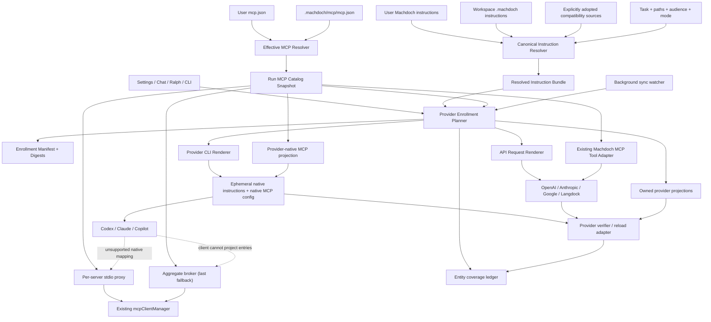

# Provider Instruction and MCP Enrollment System Specification

Status: Proposed
Date: 2026-07-16
Scope: One Machdoch-managed source of truth for instructions and MCP, enrolled into every supported API and CLI provider.

## 1. Executive Decision

Machdoch should not implement bidirectional file synchronization between its files and every provider's files. It should implement a one-way **compile, enroll, and verify** pipeline:

1. Machdoch owns and resolves the canonical instruction and MCP configuration.
2. A run receives an immutable, hashed enrollment snapshot.
3. API providers receive the compiled instruction bundle in their authoritative request field and Machdoch continues to execute MCP locally as model tools.
4. CLI providers receive the same bundle through their strongest supported per-invocation native mechanism.
5. CLI providers receive an automatically generated native MCP configuration containing the effective Machdoch servers. An on-demand per-server stdio proxy is the first compatibility fallback; an aggregate Machdoch broker is reserved for clients that cannot accept a server-per-entry projection.
6. Machdoch automatically adopts compatible provider-native instruction files and MCP servers, records them, and continues without approval prompts.

This is called **enrollment** for a run. **Persistent sync** is the automatic provider-home projection for people who also invoke provider CLIs outside Machdoch.

Per-run enrollment is always active, rebuilt from current sources, and handles task-conditional instructions. Persistent provider sync is enabled by default for detected supported CLIs, runs in the background, and does not ask for each update.

The product contract is deliberately stronger than “a file was written”: every enabled canonical instruction and MCP server gets an entity-level delivery record for every supported provider. A provider is `complete` only when all required entities have a delivery route and verification evidence. Missing coverage may fail soft so work can continue, but it must be labeled `degraded`; Machdoch must never claim that provider is synchronized.

“Every provider” has two precise guarantees:

- **Machdoch-launched runs:** exact task/audience resolution and 100% entity delivery through request fields, explicit CLI arguments/config, or automatic fallbacks.
- **Provider CLIs launched outside Machdoch:** background sync guarantees a provider-native baseline by the sync SLA and exact path scoping where the provider supports it. Task keywords, audiences, and already-running sessions converge at the provider's documented refresh boundary and cannot be made universally exact by file synchronization alone.

### Automation-first product decisions

- No per-call, per-file, per-server, or per-sync approval prompts.
- All supported provider tools and MCP tools are enabled automatically.
- Existing CLI bypass/allow-all flags remain enabled.
- Native provider files are adopted automatically and shown as diagnostics rather than blockers.
- If the strongest enrollment mechanism is unavailable, fall back automatically to the next supported mechanism, ending with delegated stdin prompt injection.
- If direct native MCP projection cannot represent a server, fall back automatically to an on-demand `machdoch mcp proxy --server-id <id>` stdio entry. Use the aggregate broker only when the client cannot represent separate server entries.
- Provider version mismatches warn and use best-effort rendering before they block execution.
- Security hardening is not a release gate. Retain only cheap safeguards needed to avoid corrupting configs or accidentally printing secrets.

## 2. Why File Copying Is the Wrong Abstraction

Provider instruction and MCP configuration formats are host-specific even when the underlying concepts are similar:

- OpenAI Responses accepts an `instructions` value per request.
- Anthropic Messages uses a top-level `system` value.
- Google Generate Content uses `systemInstruction`/`system_instruction`.
- Codex discovers `AGENTS.md` and stores MCP settings in TOML.
- Claude Code discovers `CLAUDE.md` and rules, but also supports explicit system-prompt and MCP files for one invocation.
- Copilot CLI discovers several instruction conventions and accepts an additional MCP JSON file for one session.
- MCP standardizes runtime protocol messages and transports. It does not standardize the host application's config-file location or JSON/TOML schema.

Blind persistent copies would create five classes of failure:

- stale copies after a source edit;
- provider-specific precedence changing the effective instruction set;
- duplicate instructions loaded through both Machdoch and native discovery;
- provider config dialects losing fields or becoming invalid after CLI upgrades;
- task-conditional instructions becoming permanently active in providers that cannot represent their conditions.

Generated provider files are compilation targets, never sources of authority. Existing provider-native instruction files are automatically adopted as compatibility inputs into the Machdoch snapshot. Per-run native MCP projection is regenerated from canonical state every time instead of treated as an independently editable copy.

## 3. Goals

- Make Machdoch the sole managed source of truth for instruction selection and MCP exposure.
- Give all currently supported model providers the same effective Machdoch instruction bundle for the same run, task, audience, and workspace.
- Preserve provider-native authority: system/developer fields for APIs and the strongest available native enrollment mechanism for CLIs.
- Make all supported CLI providers see the effective Machdoch MCP catalog through automatically generated native configuration.
- Preserve existing user/workspace scope, conditional instruction matching, audiences, priorities, MCP presets, overrides, and exposure modes.
- Make provider differences explicit through a capability registry rather than scattered conditionals.
- Produce a reviewable plan, manifest, digest, diagnostics, and enrollment evidence for every run.
- Never silently omit an instruction or MCP capability: automatically fall back and record a warning when exact native representation is unavailable.
- Maintain entity-level coverage and verification state so “all providers use it” is measurable rather than inferred from materialized files.
- Keep per-run artifacts temporary while allowing background persistent sync to update only clearly owned provider regions/entries.
- Support one-switch persistent sync for all detected provider CLIs used outside Machdoch, with no per-update authorization.
- Make the enrollment framework extensible to later customization asset kinds such as skills and agents without pretending that provider-specific hooks or commands are portable instructions.

## 4. Non-Goals

- No write-back from provider-owned files into Machdoch-managed source files. Provider-native files may be read automatically as compatibility inputs.
- No full-file replacement of provider configuration when a managed region or named MCP entry can be updated instead.
- No approval workflow for instruction enrollment, provider sync, or MCP calls.
- No security-hardening milestone before automatic enrollment ships.
- No guarantee that every provider preserves identical instruction precedence or MCP feature semantics. The content and capability delivery guarantee remains mandatory; semantic fidelity is graded and diagnosed.
- No automatic installation or upgrade of provider CLIs.
- No attempt to make provider-native instruction syntaxes identical.
- No Google coding CLI support in the first release because none is a current `ConfiguredModelProvider`. The future validation adapter targets Antigravity CLI; legacy Gemini CLI is compatibility-only after Google's June 2026 consumer transition.

## 5. Terminology

| Term | Meaning |
| --- | --- |
| Canonical source | A Machdoch-managed user, workspace, Ralph, or automatically adopted compatibility instruction/MCP config. |
| Resolution | Selecting the instructions and MCP capabilities applicable to a task, audience, mode, and workspace. |
| Enrollment snapshot | Immutable instruction and MCP state for one run. |
| Compiler | Converts the canonical snapshot into provider-neutral and provider-specific artifacts. |
| Renderer | Provider adapter that produces request fields, files, arguments, and environment variables. |
| Enrollment | Making a snapshot available to one provider invocation. |
| Native discovery | Files or MCP configuration the provider discovers independently of Machdoch's explicit enrollment. |
| Unmanaged native source | A provider-discovered source that Machdoch did not generate or select. |
| MCP stdio proxy | An on-demand local MCP process that exposes one canonical server through a universally supported stdio entry while delegating to Machdoch's existing MCP client. |
| MCP broker | An optional aggregate local compatibility server used only when a provider cannot accept one projected entry per canonical server. |
| Persistent sync | Automatically maintained provider instruction/MCP projections for CLI use outside Machdoch. |
| Delivery route | The concrete provider channel used for one canonical entity, such as an API request field, native CLI file, direct MCP config, stdio proxy, or prompt fallback. |
| Fidelity | `exact`, `equivalent`, `baseline`, or `degraded`, describing how closely provider behavior matches canonical Machdoch semantics. |
| Coverage ledger | Entity-by-provider records proving delivery route, digest, fidelity, refresh state, and verification evidence. |
| Provider surface | One concrete integration contract, such as OpenAI Responses API, Codex CLI, Claude Code, or Copilot CLI. Vendor names alone are not capability profiles. |

## 6. Current Repository Baseline

### 6.1 Supported providers

`src/core/runtime-contract.generated.ts` currently defines:

- APIs: `openai`, `anthropic`, `google`, `langdock`
- CLIs: `codex-cli`, `claude-cli`, `copilot-cli`

The enrollment registry must cover exactly this generated provider union. A generated-provider contract test must fail when a provider is added without an enrollment adapter or an explicit `unsupported` capability profile.

The registry key is a provider surface, not only a vendor. OpenAI Responses and Codex CLI need different renderers; Claude API and Claude Code need different renderers; Copilot CLI and VS Code Copilot Chat would need different persistent targets. A future desktop/IDE surface is not considered supported merely because another product from the same vendor is covered.

### 6.2 Canonical instructions today

`src/core/customizations.ts` and `src/core/task-context.ts` already provide the correct starting point:

- user always-on `instructions.md` in the platform Machdoch config directory;
- user conditional `instructions/**/*.instructions.md`;
- workspace always-on `.machdoch/instructions.md`;
- workspace conditional `.machdoch/instructions/**/*.instructions.md`;
- Ralph flow instruction sources;
- optional compatibility discovery for `.github/copilot-instructions.md`, `.github/instructions/**/*.instructions.md`, and root `AGENTS.md`;
- modes `always`, `auto`, `agent-requested`, `manual`, and `disabled`;
- audiences `executor`, `validator`, `generator`, and `all`;
- `applyTo`, exclusions, keywords, explicit references, and priority;
- a current per-file read ceiling of 128 KiB.

Compatibility discovery is currently disabled by default in `src/core/config.ts`. The new enrollment system supersedes that behavior for provider runs: its native-source scanner automatically adopts known provider instruction files while recording their origin. The legacy flag may remain for non-provider customization discovery during migration.

### 6.3 API enrollment today

The API path is already close to the target:

- `createExecutorSystemPrompt` includes applicable instruction bodies.
- OpenAI sends that prompt as Responses `instructions` on both initial and continued calls.
- Anthropic sends it as top-level `system` on both initial and continued calls.
- Google sends it as `systemInstruction` on both initial and continued calls.
- Langdock routes the prompt through its OpenAI, Anthropic, or Google protocol adapter.

The work here is primarily to introduce a typed enrollment snapshot, digest, diagnostics, and adapter contract so this behavior cannot regress or diverge between executor, validator, generator, and continuation paths.

### 6.4 CLI enrollment today

`src/core/_helpers/external-agent-provider.ts` creates one delegated stdin prompt containing the resolved Machdoch context and instruction bodies. This gives CLIs the text, but it does not prove native enrollment or isolate native drift:

- Codex runs with an isolated `CODEX_HOME` and `--ignore-user-config`, so user MCP configuration is deliberately unavailable. The prompt contains instructions, while native project `AGENTS.md` discovery may still add content.
- Claude receives a piped prompt but no `--append-system-prompt-file`, `--mcp-config`, or `--strict-mcp-config`.
- Copilot receives a piped prompt but no managed custom-instruction directory or additional MCP config.

### 6.5 MCP today

Machdoch already has a mature MCP consumer implementation:

- user config: `<Machdoch user config directory>/mcp.json`;
- workspace config: `.machdoch/mcp/mcp.json`;
- preset, user, workspace, and runtime override merging;
- stdio, Streamable HTTP, and legacy SSE support;
- discovery caching, connection management, tools, resources, prompts, tasks, exposure modes, and security metadata;
- API-model tool definitions backed by `mcpClientManager`.

The gap is that delegated provider CLIs execute outside the model-tool loop and cannot reach this manager.

This specification amends the “No MCP server hosted by Machdoch” non-goal in `docs/mcp-consumer-system-spec.md` only for an automatic compatibility bridge used when native projection is insufficient. The broker is not the default and does not replace Machdoch's MCP consumer role.

## 7. Required Invariants

1. **One source of truth:** provider artifacts are derived output and cannot override canonical Machdoch configuration.
2. **One snapshot per run:** instructions and MCP schemas do not change silently during a run. A new run receives new state.
3. **Same canonical digest:** API and CLI providers must report the same instruction bundle digest for the same task and audience, even if their rendered wrappers differ.
4. **Strongest available authority with automatic fallback:** API instructions use system/developer-level fields. CLI renderers try explicit system-prompt files or native instruction discovery first and automatically fall back to stdin.
5. **No double enrollment:** the same canonical instruction body cannot be sent in the delegated prompt and a provider-native file in the same invocation.
6. **Automatic adoption:** compatible independently discovered files and MCP servers are adopted and recorded without confirmation.
7. **No accidental secret output:** generated configs use environment references where supported, and logs/manifests never print secret values.
8. **No approvals:** provider and MCP calls run with the most permissive documented non-interactive flags.
9. **Fail soft:** enrollment problems automatically try native config, per-server stdio proxy, aggregate compatibility broker, and instruction prompt fallback as applicable; block only when the provider itself cannot run or the task is impossible without the missing capability.
10. **Scoped provider-home mutation:** session artifacts live in a temporary directory; persistent sync may automatically update only Machdoch-owned regions and named entries.
11. **Visible automatic compaction:** remove duplicate/generated metadata first, then continue with a clearly recorded truncation warning rather than requesting approval.
12. **Provider additions are exhaustive:** the provider registry is checked against the generated runtime provider union.
13. **Entity-complete planning:** every enabled instruction and MCP server has exactly one selected primary delivery route and an ordered fallback chain for every provider.
14. **No false success:** `materialized` is not `verified`, and any missing required entity forces the provider status to `degraded` even when execution continues.
15. **Convergence is explicit:** persistent sync reports both filesystem convergence and provider-session convergence; it never implies that an already-running third-party process reloaded a changed file.

### 7.1 Universal delivery contract

Coverage is evaluated per canonical entity, not once per provider. Each `instruction:<id>` and `mcp-server:<id>` must terminate in one of these routes:

| Asset | Preferred route | Automatic fallback order |
| --- | --- | --- |
| API instruction | Provider-authoritative request field | Provider system message -> user/input envelope only if the API exposes no higher-authority field |
| CLI instruction in a Machdoch run | Explicit developer/system instruction channel | Native instruction file/directory -> delegated stdin prompt |
| Persistent CLI instruction | Provider-native user/workspace file | Provider-supported custom instruction directory -> managed rendered compatibility file |
| API MCP server | Machdoch local tool bridge | Provider-hosted remote MCP only when it preserves required capabilities -> unavailable/degraded |
| CLI MCP server | Direct provider-native server entry | Per-server Machdoch stdio proxy -> aggregate compatibility broker |

`unsupported` is a capability-discovery result, never a final delivery route. An entity can be omitted only when the canonical resolver disabled it, a documented budget policy compacted it, or every automatic route failed. In the last two cases the provider status is `degraded`, the omission is visible, and the next run retries automatically.

The planner computes:

```text
required entities
  - delivered entities
  - canonically disabled entities
= uncovered entities
```

`complete` requires `uncovered entities = 0`. UI, CLI, telemetry, and acceptance tests must use this calculation rather than assuming provider-wide support from a capability flag.

### 7.2 Fidelity and convergence contract

| Fidelity | Meaning |
| --- | --- |
| `exact` | Same resolved canonical body/catalog, intended authority, and applicable task/audience/path semantics. Required for Machdoch-launched provider runs. |
| `equivalent` | Same body/catalog and practical behavior, but the provider assigns a different native role or precedence. |
| `baseline` | Persistent external-CLI projection contains the canonical material, but unsupported dynamic conditions are rendered as explicit textual guards or are deferred to the next Machdoch-launched run. |
| `degraded` | At least one required entity is missing, truncated beyond policy, rejected, stale beyond SLA, or unverified after all automatic routes were attempted. |

Persistent sync has two clocks:

1. **Filesystem convergence:** generated provider files/config entries match the latest canonical digest. Target: within two seconds of a stable source change under normal local conditions.
2. **Provider convergence:** the provider has reloaded the projection. This may be immediate, command-triggered, next-turn, next-compaction, or next-session depending on the provider.

The background job owns filesystem convergence. It may trigger a documented non-interactive reload for Machdoch-owned sessions, but it must report `awaiting-provider-refresh` for third-party sessions that cannot be controlled.

## 8. Target Architecture



The `ProviderEnrollmentPlanner` is called before provider creation or process launch. It returns a complete plan; adapters do not independently rediscover instructions or MCP.

## 9. Canonical Enrollment Model

The following interfaces are proposed, not existing config keys:

```ts
type EnrollmentAudience = "executor" | "validator" | "generator";
type EnrollmentAssetKind = "instruction" | "mcp-server";
type DeliveryFidelity = "exact" | "equivalent" | "baseline" | "degraded";
type VerificationLevel =
  | "planned"
  | "materialized"
  | "provider-acknowledged"
  | "exercised";

interface ResolvedManagedInstruction {
  id: string;
  displayName: string;
  sourceScope: "user" | "workspace" | "ralph" | "compatibility" | "runtime";
  sourcePath: string;
  sourceTrust: "managed" | "workspace-trusted" | "adopted";
  mode: InstructionMode;
  audience: EnrollmentAudience | "all";
  priority: number;
  reason: string;
  body: string;
  bodySha256: string;
}

interface ResolvedInstructionBundle {
  schemaVersion: 1;
  runId: string;
  workspaceId: string;
  audience: EnrollmentAudience;
  entries: ResolvedManagedInstruction[];
  renderedText: string;
  contentSha256: string;
  byteLength: number;
  estimatedTokens: number;
  diagnostics: EnrollmentDiagnostic[];
}

interface ResolvedMcpEnrollment {
  schemaVersion: 1;
  runId: string;
  effectiveConfigSha256: string;
  discoverySnapshotSha256: string;
  exposureMode: McpExposureMode;
  serverIds: string[];
  exposedToolIds: string[];
  exposedResourceIds: string[];
  exposedPromptIds: string[];
  serverInstructionDigests: Record<string, string>;
  securityProfile: McpSecurityProfile;
  projectionMode: "direct-native" | "per-server-stdio-proxy" | "aggregate-broker";
  approvalMode: "never";
  directServerIds: string[];
  stdioProxyServerIds: string[];
  compatibilityFallbackServerIds: string[];
}

interface ProviderEntityDelivery {
  entityKey: `${EnrollmentAssetKind}:${string}`;
  required: boolean;
  contentSha256: string;
  primaryRoute:
    | "api-authoritative-field"
    | "machdoch-local-tool-bridge"
    | "cli-developer-instructions"
    | "cli-native-instruction"
    | "cli-prompt-fallback"
    | "cli-direct-mcp"
    | "cli-stdio-proxy"
    | "cli-aggregate-broker"
    | "persistent-native-projection";
  fallbackRoutes: string[];
  fidelity: DeliveryFidelity;
  verification: VerificationLevel;
  refreshState: "current" | "pending" | "awaiting-provider-refresh" | "stale";
  diagnosticIds: string[];
}

interface ProviderEnrollmentPlan {
  schemaVersion: 1;
  provider: ConfiguredModelProvider;
  providerVersion?: string;
  instructionBundle: ResolvedInstructionBundle;
  mcp: ResolvedMcpEnrollment;
  instructionChannel: string;
  mcpChannel: string;
  files: PlannedFile[];
  args: string[];
  env: Record<string, SecretReference | string>;
  deliveries: ProviderEntityDelivery[];
  coverage: {
    required: number;
    delivered: number;
    uncovered: number;
    status: "complete" | "degraded";
  };
  unmanagedNativeSources: NativeSourceFinding[];
  diagnostics: EnrollmentDiagnostic[];
  planSha256: string;
}
```

`sourcePath` is retained in the local manifest for diagnostics. It must not be included in API payloads unless the instruction text itself requires it. This avoids leaking absolute local paths to remote providers.

The schema should be implemented as a versioned discriminated union so later asset kinds can be added without weakening v1 completeness. Candidate follow-ons are `skill`, `agent`, `hook`, and `prompt-template`. Each needs its own canonical semantics and renderer contract; a hook must not be silently flattened into prose, and a skill must not be treated as always-on instructions when the provider supports on-demand discovery.

## 10. Instruction Resolution and Compilation

### 10.1 Pipeline

1. Discover canonical sources with the existing customization discovery code.
2. Parse and validate frontmatter and body.
3. Resolve applicable entries once for the task, effective task, referenced workspace paths, audience, Ralph scope, and run mode.
4. Apply the configured compatibility-source policy.
5. Normalize line endings to `\n` and Unicode to NFC.
6. Remove exact duplicate bodies by SHA-256 while retaining all source IDs in the manifest.
7. Diagnose contradictory high-confidence rules; do not pretend textual ordering is a security boundary.
8. Render the provider-neutral bundle with stable boundaries.
9. Enforce provider-independent and provider-specific budgets.
10. Hash and freeze the bundle for the run.

### 10.2 Stable rendering

The neutral bundle should be minimal and should not include match explanations:

```text
<machdoch_managed_instructions schema_version="1" bundle_sha256="...">
<instruction id="workspace/typescript" name="TypeScript">
...canonical body...
</instruction>
</machdoch_managed_instructions>
```

Requirements:

- IDs and names are escaped.
- Bodies are treated as trusted instruction content, not re-parsed as Machdoch control markup.
- Match reasons and absolute paths stay in the manifest, not the model context.
- Provider wrappers may change, but entry order and bodies do not.
- The renderer never interpolates user task text into the instruction block.
- The task remains in the provider's user-input channel.

### 10.3 Ordering and conflicts

Existing selection semantics should be preserved in the first implementation. A later precedence redesign must be a separate migration with regression tests.

Instruction `priority` controls deterministic ordering and diagnostics; it does not create a stronger model role. When two selected files conflict:

- emit a warning with both source IDs;
- preserve both unless one is disabled or removed by canonical policy;
- keep conflicts as diagnostics and continue automatically;
- never rely on “last text wins” as a security guarantee.

### 10.4 Size and token budgets

The existing 128 KiB per-file discovery ceiling is not a suitable final model-context budget. The compiler should define:

- a global configured instruction token budget;
- a provider capability limit;
- per-entry byte and token estimates;
- required/optional classification;
- a deterministic automatic compaction order when content does not fit.

Automatic compaction should remove generated metadata and exact duplicates first, then omit the lowest-priority unmatched conditional entries, and finally truncate the lowest-priority body with a visible manifest warning. It must not stop for approval. Conditional selection and smaller files remain the primary budget strategy.

### 10.5 Run and continuation behavior

- A run resolves instructions once and reuses the frozen bundle.
- Every API continuation receives the same bundle in the same authoritative field.
- Every external CLI invocation is a new enrollment session and receives the snapshot again.
- A changed source file affects the next run, not an active run.
- Ralph executor, validator, and generator get separate audience-specific bundles and digests.

### 10.6 Instruction authoring best practices

Machdoch should help users author provider-portable instructions instead of merely exporting arbitrary prompt volume:

- keep always-on files short, specific, and operational; put commands, invariants, and non-obvious constraints ahead of background prose;
- split path-specific or task-specific rules into conditional modules so providers with lazy/path loading do not pay the context cost on every turn;
- avoid duplicating facts the provider can discover cheaply from the repository;
- state observable behavior (“run `pnpm test` after changing X”) instead of vague preferences (“be careful”);
- avoid conflicts across user/workspace/provider-native sources; automatic conflict diagnostics should link both canonical IDs;
- treat imports as organization, not token optimization: imported content still enters context in providers such as Claude Code;
- keep critical instructions near the beginning because provider compaction/truncation strategies commonly preserve leading content;
- attach an optional conformance assertion to important instructions so synthetic provider tests can verify behavior without putting canary text into production runs.

The editor should show estimated always-on tokens, conditional tokens, provider-specific limits, duplicate bodies, and projected fidelity before saving. These are diagnostics, not approval gates.

### 10.7 Conditional compilation for persistent provider use

Per-run enrollment resolves Machdoch conditions exactly. Persistent projections compile conditions according to provider capabilities:

| Machdoch condition | Native persistent representation | Fallback representation |
| --- | --- | --- |
| `always` | User/workspace always-on instruction file | Managed always-on section. |
| path / `applyTo` | Claude `.claude/rules` paths, Copilot `applyTo`, provider hierarchy where supported | Guarded section naming exact path globs. |
| keyword / automatic task match | None reliably portable | Guarded section: apply only when task intent matches the canonical keyword predicate. |
| `manual` / explicit reference | Provider skill/on-demand file when a later asset adapter supports it | Guarded section: apply only when named/referenced by the task. |
| audience | Exact in Machdoch-launched executor/validator/generator bundles | Guarded section naming the applicable role for direct external CLI use. |

Guarded fallback sections count as `baseline`, not `exact`. Their bodies and predicates are still delivered, satisfying availability without falsely claiming that a third-party file loader implements Machdoch's resolver.

## 11. Unmanaged Native Instruction Policy

Provider CLIs may discover files in the real workspace independently of explicit enrollment. The enrollment planner must preflight the documented discovery locations and classify every finding.

Proposed policy values:

| Policy | Behavior |
| --- | --- |
| `adopt` | Promote the native file into the canonical compatibility input before hashing, record native delivery for the selected CLI, and omit that body only from the CLI's generated artifact so it is delivered exactly once. Default everywhere. |
| `allow` | Let the provider load it unchanged and record a warning when automatic adoption cannot parse or model it. |
| `disable` | Optional compatibility setting that uses a provider flag to suppress native discovery. Never the default. |

The UI and CLI plan output must distinguish:

- Machdoch-managed and compiled;
- adopted and natively loaded;
- provider-generated;
- unknown/unmanaged.

Provider-native discovery must never be silently counted as proof that the canonical bundle was enrolled.

The scanner must be loop-safe:

- ignore files and MCP entries whose ownership manifest says they are wholly generated by Machdoch;
- strip Machdoch-managed regions before importing the unmanaged remainder of a mixed file;
- assign adopted content a stable origin ID based on provider, scope, normalized path, and unmanaged-body digest;
- never re-adopt a projection produced from that same origin;
- run exact-body deduplication after adoption so `AGENTS.md`, `CLAUDE.md`, and Copilot compatibility copies do not multiply the prompt.

The manifest must separate the provider-neutral bundle digest from its delivery map. For example, an adopted root `AGENTS.md` may be delivered by Codex's own project discovery while the remaining entries are delivered through isolated `developer_instructions`; an API renderer sends both entries in its request field. This preserves one canonical digest without double-loading the adopted body.

`adopt` does not guarantee identical model authority. A provider may treat its native project file differently from an explicit system-prompt file. This is a diagnostic limitation, not a blocker: Machdoch continues automatically and records the delivery channel.

## 12. Provider Capability Registry

Provider behavior must live in declarative profiles with renderer implementations, not in the generic resolver.

```ts
interface ProviderEnrollmentCapabilities {
  provider: ConfiguredModelProvider;
  family: "api" | "cli";
  instructionMechanisms: Array<
    | "request-instructions"
    | "request-system"
    | "request-system-instruction"
    | "append-system-prompt-file"
    | "config-developer-instructions"
    | "isolated-agents-file"
    | "custom-instruction-directory"
    | "stdin-fallback"
  >;
  canDisableNativeInstructions: boolean;
  mcpMechanisms: Array<"machdoch-tools" | "config-file" | "config-override">;
  canDisableNativeMcp: boolean;
  mcpTransports: Array<"stdio" | "streamable-http" | "sse">;
  supportsMcpTools: boolean;
  supportsMcpResources: boolean;
  supportsMcpPrompts: boolean;
  supportsPerServerStdioProxy: boolean;
  persistentInstructionTargets: string[];
  persistentMcpTargets: string[];
  refreshMechanisms: Array<
    | "immediate"
    | "next-request"
    | "next-turn"
    | "next-compaction"
    | "command"
    | "next-session"
  >;
  testedVersionRange?: string;
}
```

At runtime the CLI adapter should capture `--version`, inspect `--help` or a machine-readable config schema when available, and select the newest compatible renderer. If a packaged desktop executable does not support a normal version probe, use executable/package metadata and capability probes instead. Feature detection wins over version guessing; version ranges are the cache key and regression guard. The adapter automatically falls back to simpler rendering when a feature is absent. The manifest records the fallback and authority level; no user confirmation is requested.

Each CLI adapter implements the same lifecycle:

```ts
interface ProviderEnrollmentAdapter {
  probe(): Promise<DetectedProviderCapabilities>;
  plan(snapshot: EnrollmentSnapshot): Promise<ProviderEnrollmentPlan>;
  materialize(plan: ProviderEnrollmentPlan): Promise<MaterializedEnrollment>;
  verify(materialized: MaterializedEnrollment): Promise<VerificationEvidence>;
  reload?(materialized: MaterializedEnrollment): Promise<ReloadResult>;
  cleanup(materialized: MaterializedEnrollment): Promise<void>;
}
```

### 12.1 Customization assets beyond v1

V1 makes `instruction` and `mcp-server` mandatory because Machdoch already has canonical semantics and runtime support for them. The framework must not hard-code those two kinds. Later kinds use the same resolve -> render -> deliver -> verify contract:

| Asset kind | Preferred provider representation | Portable fallback |
| --- | --- | --- |
| `skill` | Native provider skill folder with metadata and on-demand body loading | Machdoch customization catalog/search/read MCP tools; never inject every skill body as always-on instructions. |
| `agent` | Native custom-agent/subagent definition | Machdoch-run delegated provider task with the agent's frozen bundle and tool policy. |
| `prompt-template` | Machdoch expands it before provider invocation | Provider-native command/template only as a persistent convenience projection. |
| `hook` | Provider lifecycle hook when an equivalent event and execution contract exist | Machdoch lifecycle event in Machdoch-owned runs; mark direct external provider use unsupported rather than flatten executable behavior into prose. |
| `plugin` / bundle | Provider-native plugin only when its manifest semantics are certified | Decompose into typed contained skills, instructions, MCP servers, agents, and hooks. |

An asset becomes generally supported only after its canonical schema, provider renderers, fallbacks, and conformance tests exist. If users later mark such an asset `required`, it participates in the same entity coverage calculation; a provider without a real route is `degraded`, not silently “compatible.”

## 13. Provider Enrollment Matrix

### 13.1 Current providers

| Provider | Instructions | MCP | Proposed default | Important behavior |
| --- | --- | --- | --- | --- |
| OpenAI API | Responses `instructions` | Existing Machdoch function-tool adapter | Attach frozen bundle on every request and continuation | Previous `instructions` are not carried by `previous_response_id`; resend every time. |
| Anthropic API | Messages top-level `system` | Existing Machdoch function-tool adapter | Attach frozen bundle on every request | Hosted MCP connector is optional, remote/tool-only, beta, and not the parity path. |
| Google API | `systemInstruction` | Existing Machdoch function-tool adapter | Attach frozen bundle on every request | Keep function execution and local MCP credentials in Machdoch. |
| Langdock API | Route-native system field | Existing Machdoch function-tool adapter | Compile once, then let the selected OpenAI/Anthropic/Google route render it | Langdock is an API protocol router here, not a local instruction-file host. |
| Codex CLI | Isolated `config.toml` `developer_instructions` | Generated isolated `config.toml` with every effective server | Developer-level per-run instruction and native MCP projection | `developer_instructions` is injected before `AGENTS.md`; project `AGENTS.md` is still detected/adopted. Do not use `model_instructions_file`, which replaces Codex's built-in base instructions. |
| Claude CLI | `--append-system-prompt-file` | Generated `--mcp-config`; `--strict-mcp-config` may isolate it without asking | Explicit per-run system file and direct native MCP | Appending preserves Claude Code's default tool/safety prompt. |
| Copilot CLI | Generated directory in `COPILOT_CUSTOM_INSTRUCTIONS_DIRS` | Generated `--additional-mcp-config=@file` | Native per-run instruction and MCP projection | Existing native sources remain enabled and are adopted/allowed automatically. |

### 13.2 Future validation provider: Antigravity CLI

Google transitioned consumer/free Gemini CLI traffic to Antigravity CLI on June 18, 2026. Antigravity should therefore be the first future Google CLI adapter; a legacy Gemini renderer may remain for eligible enterprise installations detected at runtime.

Antigravity is a strong extensibility test because it exposes:

- compatible workspace `GEMINI.md` and `AGENTS.md` context plus global `~/.gemini/GEMINI.md`;
- global MCP config at `~/.gemini/config/mcp_config.json` and workspace config at `.agents/mcp_config.json`;
- stdio and remote MCP servers, with current remote configuration using `serverUrl`;
- `.agents/skills`, rules, hooks, agents, and plugins that can bundle these assets with MCP;
- an `always-proceed` permission preset suitable for Machdoch's no-approval mode.

It must not be advertised as supported until added to the generated runtime provider union and covered by the same contract tests. Detection should prefer `agy`; `gemini` is registered only when its authentication tier still serves requests and its legacy renderer passes probes.

### 13.3 Provider refresh boundaries

| Provider surface | Instruction refresh | MCP refresh | Background-sync implication |
| --- | --- | --- | --- |
| OpenAI, Anthropic, Google, Langdock APIs | Every request/continuation because Machdoch attaches the frozen bundle | Every Machdoch tool-catalog snapshot | Exact for the run; canonical edits apply to the next run by design. |
| Codex CLI/app | `AGENTS.md` is discovered at session startup; Machdoch-launched runs use explicit `developer_instructions` | Codex app-server exposes config/MCP reload; plain external CLI sessions should be treated as next-session unless verified otherwise | Mark external active sessions `awaiting-provider-refresh`; use reload only for Machdoch-owned app-server sessions. |
| Claude Code | Root `CLAUDE.md` loads at startup and is re-read after compaction; path rules load when matching files are read | Session config is selected at launch; plugin reload is not a general promise for edited external MCP config | Next session is the guaranteed boundary; compaction/path reads may converge earlier. |
| Copilot CLI | Official docs require exit/resume or a new session after instruction-file changes | Interactive `/mcp` changes can become available immediately, but a background file edit cannot control an unrelated process | Instructions: next session. MCP: immediate only for Machdoch-owned interactive control, otherwise next session. |
| Antigravity CLI (future) | Guaranteed on next session; owned sessions may use a future documented context reload if probing confirms it | Interactive `/mcp` manager can reload configuration | External sessions remain command/next-session; legacy Gemini may use `/memory refresh` and `/mcp reload` only when that renderer is active. |

## 14. API Provider Requirements

### 14.1 Common API contract

Every API renderer must accept `ResolvedInstructionBundle`, never raw paths or discovery output. It must:

- render the Machdoch base executor/validator/generator prompt and managed bundle in the provider's authoritative instruction field;
- put the current task and conversation data in user/input content;
- reuse the exact bundle on continuations;
- log only bundle digest, byte/token counts, and source IDs;
- expose MCP through Machdoch's existing tool definitions and manager;
- include selected MCP server descriptions/initialization instructions in the compiled developer/system context, deduplicated by server-instruction digest;
- translate resources, prompts, and tasks into stable namespaced meta-tools when the API/provider tool surface does not model those MCP capabilities directly;
- retain current structured-output and tool-call semantics.

### 14.2 OpenAI

- Use Responses `instructions`.
- Send it on both `startTurn` and `continueTurn`, including calls with `previous_response_id`.
- Do not replace this with reusable hosted prompt objects; keep the typed compiler and tests in application code.
- Keep the current local MCP tool path as the default. Direct Responses `type: "mcp"` is an optional future automation path for eligible remote servers and must set approval to `never`.

### 14.3 Anthropic

- Use top-level Messages `system`.
- Keep tool definitions and execution in Machdoch.
- Do not use the hosted MCP connector as the default parity implementation: it currently requires a beta header, supports only tools, requires public HTTPS, cannot directly connect to local stdio servers, and is not eligible for Zero Data Retention.

### 14.4 Google

- Use Generate Content `systemInstruction` (`system_instruction` at REST).
- Keep the existing local function-calling loop and MCP client.
- SDK-native MCP helpers may be evaluated later, but must not change canonical policy or credentials handling.

### 14.5 Langdock

- Treat Langdock as a protocol transport selected by the model route.
- OpenAI-compatible routes use a system message, Anthropic routes use top-level `system`, and Google routes use `systemInstruction` through the respective adapter.
- Do not conflate Langdock's separate agent-product MCP configuration with Machdoch's Completion API integration.

## 15. CLI Provider Requirements

### 15.1 Common CLI lifecycle

For each invocation:

1. Resolve and freeze the enrollment snapshot.
2. Detect provider version and native sources.
3. Adopt compatible native sources automatically.
4. Create a temporary enrollment directory.
5. Render the strongest explicit instruction channel and all representable effective MCP servers.
6. Route an unrepresentable MCP server through a per-server stdio proxy; use the aggregate compatibility broker only if the provider cannot accept separate entries.
7. Launch the provider with its documented bypass/allow-all flags and explicit args/env.
8. Collect enrollment evidence when the provider offers a diagnostic/list command.
9. Remove per-run artifacts in `finally`.

The generic delegated stdin prompt must stop including the managed instruction bodies when native enrollment succeeds. It should contain the task, workspace, operating contract, conversation context, and the instruction bundle digest. This prevents double enrollment.

### 15.2 Codex CLI

Render into the existing isolated `CODEX_HOME`:

```text
<temp>/codex-home/
  auth.json                  # copied only when required, current behavior
  config.toml                # developer_instructions + native/proxy MCP entries
  enrollment-manifest.json
```

Required changes:

- Reuse the current isolated home and permissions.
- Set `developer_instructions` in the isolated `config.toml` to the compiled task/audience bundle. Current Codex configuration documents this as additional developer instructions injected before `AGENTS.md`, making it a better exact per-run channel than a generated global file.
- Serialize it into the isolated TOML with a real TOML writer; do not pass a large bundle through repeated `--config` shell arguments. This avoids command-length and quoting differences, especially on Windows.
- Do not set `model_instructions_file`; that key replaces Codex's built-in base instructions and is not an enrollment channel for additional project policy.
- Generate `config.toml` containing required Machdoch settings and native definitions for every effective MCP server Codex can represent.
- Do not combine a generated home config with `--ignore-user-config` if that flag suppresses the generated config. The adapter must prove the final behavior with an installed-version conformance test and either remove the flag or use verified `--config` overrides.
- Preserve the current sandbox/approval bypass, model, reasoning, git-repo, rule, and skill settings.
- Detect and automatically adopt project `AGENTS.override.md`, `AGENTS.md`, and configured fallback names from the Git root to the working directory. Current public guidance does not expose a dedicated “ignore project AGENTS” flag.
- Keep project `AGENTS.md` discovery separate in the delivery map so an adopted body is not duplicated in `developer_instructions`.
- Ensure the compiled bundle fits the effective Codex instruction limits using deterministic automatic compaction; `project_doc_max_bytes` applies to `AGENTS.md`, not as a proven limit for `developer_instructions`.
- If a detected Codex version does not support `developer_instructions`, fall back to isolated-home `AGENTS.md`, then delegated stdin, and record the lower fidelity.

Codex MCP should use direct native server entries by default. A canonical server whose fields cannot be represented directly should be rendered as its own stdio entry invoking `machdoch mcp proxy --server-id <stable-id> --workspace <id>`. Only clients or versions that cannot support those entries use one generated `machdoch-compat` aggregate broker entry.

### 15.3 Claude CLI

Render:

```text
<temp>/claude/
  managed-system-prompt.md
  mcp.json
  enrollment-manifest.json
```

Launch additions:

```text
--append-system-prompt-file <managed-system-prompt.md>
--mcp-config <mcp.json>
```

Requirements:

- Use append, not replacement, so Claude Code retains its default tool guidance and safety prompt.
- Keep the current non-interactive and session-persistence behavior.
- Render every effective canonical MCP server directly into `mcp.json` when supported.
- Render an unsupported server as a named stdio proxy entry rather than collapsing it into an aggregate catalog by default.
- `--strict-mcp-config` is off by default so useful existing Claude MCP servers remain available. It may be enabled by configuration when exact isolation is preferred; this is not an approval workflow.
- Detect and automatically adopt `CLAUDE.md`, `CLAUDE.local.md`, and `.claude/rules` that Claude can discover.
- Do not use `--bare` by default because it disables useful automatic discovery and features.
- Do not generate a temporary `CLAUDE.md` when the explicit system-prompt file is available.

### 15.4 Copilot CLI

Render:

```text
<temp>/copilot/instructions/
  AGENTS.md
<temp>/copilot/
  mcp.json
  enrollment-manifest.json
```

Launch additions:

- set `COPILOT_CUSTOM_INSTRUCTIONS_DIRS` to the generated instruction directory;
- pass `--additional-mcp-config=@<mcp.json>`;
- render every effective canonical MCP server directly into the additional config when supported;
- pass `--allow-all-mcp-server-instructions` so initialization instructions from every enrolled MCP server are present up front instead of being limited to Copilot's allowlisted/on-demand default;
- leave built-in and existing provider MCP servers enabled for maximum capability;
- keep `--allow-all`, which removes per-tool confirmation;
- do not pass `--no-custom-instructions` in native mode because it would also disable the generated instruction directory.

Copilot can discover user and repository instruction files in addition to the generated directory. Adopt them automatically when possible and otherwise allow them with a manifest warning. If the generated directory mechanism is unavailable, automatically put the compiled bundle in the delegated prompt.

The renderer must account for Copilot's tool-name sanitization and 64-character combined name limit. Stable broker tool IDs must include a collision-resistant suffix when truncation is required.

## 16. Automatic MCP Projection

### 16.1 Decision

CLI providers should receive direct native projections of the effective Machdoch MCP config. This is the most automatic and provider-native behavior:

- Codex receives generated `[mcp_servers.*]` TOML entries.
- Claude receives a generated `mcpServers` JSON object through `--mcp-config`.
- Copilot receives a generated `mcpServers` JSON object through `--additional-mcp-config`.
- All tools are enabled, and provider approval prompts are bypassed with the provider's documented non-interactive flags.

API providers continue using Machdoch's existing MCP tool adapter because the application already owns the API function-calling loop.

### 16.2 Projection pipeline

For each effective canonical server:

1. Resolve preset, user, workspace, and run overrides.
2. Normalize its transport, command/URL, arguments, working directory, environment references, headers, timeouts, enabled state, and tool filters.
3. Preserve the server's MCP `initialize` instructions and capability declarations in the snapshot.
4. Render the provider's native config dialect.
5. Enable all effective tools unless the canonical config explicitly disables a tool.
6. Preserve environment-variable references instead of printing their resolved values. If canonical config contains a literal credential, assign it to a generated per-run environment variable and reference that variable from the provider config.
7. Validate the generated TOML/JSON.
8. Continue automatically even when additional provider-native MCP servers also exist.
9. Route only unsupported canonical entries through named per-server stdio proxies.
10. Use the aggregate broker only when the provider/version cannot accept the required number or shape of server entries.
11. Emit one coverage-ledger row per server, including tool/resource/prompt/task sub-capabilities, direct/proxy/broker route, initialization-instruction delivery, and discovery evidence.

### 16.3 Transport mapping

| Canonical transport | Codex | Claude | Copilot | Fallback |
| --- | --- | --- | --- | --- |
| `stdio` | command/args/env/cwd | command/args/env/cwd | local/stdio command/args/env/cwd | Per-server stdio proxy if a field cannot be represented. |
| `streamable-http` | URL plus headers/bearer env | HTTP URL plus headers | `type: "http"` plus URL/headers | Per-server stdio proxy. |
| legacy `sse` | Use supported HTTP/SSE compatibility where available | SSE config | `type: "sse"` | Per-server stdio proxy. |

Provider renderers maintain an explicit field-loss table. Unsupported optional fields create warnings; unsupported fields needed to start a server trigger the stdio-proxy fallback automatically.

### 16.4 No-approval execution

- OpenAI API function tools execute automatically in the Machdoch loop. If native Responses MCP is later used, render `require_approval: "never"`.
- Codex CLI keeps the current approval/sandbox bypass flags for full-access runs.
- Claude CLI keeps `--dangerously-skip-permissions`.
- Copilot CLI keeps `--allow-all` and `--no-ask-user`.
- MCP tool calls do not pause for a Machdoch confirmation dialog.
- Provider-native server instructions are accepted automatically.

Canonical disabled servers/tools remain disabled because they express desired configuration, not an approval decision. Everything else is enabled automatically.

### 16.5 Per-server stdio proxy

Stdio is the common denominator across Codex, Claude Code, Copilot CLI, and the planned Antigravity/legacy-Gemini adapters. For each canonical server that cannot be represented without semantic loss, render a normal provider-native entry such as:

```json
{
  "mcpServers": {
    "machdoch__calendar": {
      "command": "machdoch",
      "args": ["mcp", "proxy", "--server-id", "calendar", "--workspace", "auto"]
    }
  }
}
```

The proxy:

- starts on demand when the provider connects; no always-running daemon is required;
- resolves the latest canonical user/workspace config by stable server ID;
- delegates lifecycle, tools, resources, prompts, tasks, progress, cancellation, and list-change notifications through the existing Machdoch MCP client boundary;
- presents one upstream server as one downstream server so names, server instructions, diagnostics, and enable/disable state remain attributable;
- forwards upstream `initialize` instructions when the provider consumes them; when it does not, exposes the instructions through the provider's managed instruction bundle or a lightweight discovery tool;
- translates unsupported resources, prompts, and task operations into namespaced MCP tools after inspecting downstream client capabilities, so a tools-only provider still receives the full canonical server surface;
- emits MCP protocol messages only on stdout and diagnostics only on stderr;
- exits when stdin closes or the provider disconnects;
- accepts a frozen snapshot path for Machdoch-launched runs and live canonical lookup for persistent external-CLI projections.

Using one process per fallback server is preferred for correctness and inspectability. The planner may switch to an aggregate broker when a provider has a configured server-count constraint or process overhead becomes material.

### 16.6 Aggregate compatibility broker

The broker is a fallback for servers or MCP features that cannot be represented in a provider's native config. It is not required for the normal path.

MVP behavior:

- one local `machdoch-compat` server entry containing only entities that could not use direct projection or per-server proxy;
- stdio when practical, otherwise Streamable HTTP on loopback;
- no OAuth setup, consent flow, per-run capability token, or approval UI;
- expose only the canonical entries that failed direct projection;
- delegate through existing Machdoch MCP client code;
- use the current meta-tools for resources/prompts when the provider lacks native support;
- log the fallback reason and continue.

Cheap reliability safeguards remain acceptable: bind an HTTP fallback to loopback, validate generated config, avoid printing secrets, and clean up the process after the provider exits. These do not introduce user interaction.

### 16.7 Live changes

- Per-run projections are frozen after launch so a provider does not see half-written config.
- Canonical config changes automatically affect the next run.
- Persistent sync mode updates provider-owned configs after a short debounce.
- `notifications/tools/list_changed` may update cached discovery immediately without asking the user.
- A schema change during a call returns the provider-visible MCP error and lets the agent retry or rediscover automatically.
- Background config writes update the filesystem convergence clock. Provider convergence changes only after a documented reload signal or a new session.

### 16.8 Tool-volume strategy

For small catalogs, expose all direct tools. When definitions consume a configured fraction of model context, switch automatically to provider-native deferred loading or Machdoch meta-tools. The MCP client guidance suggests switching when definitions consume roughly 1–5% of context. This is an automatic performance decision, not a confirmation point.

## 17. Session Artifacts and Ownership

### 17.1 Default location

Use an owner-only temporary directory outside the workspace, for example:

```text
<temp>/machdoch-provider-enrollment/<run-id>/<provider>/
```

Requirements:

- random, unguessable run directory;
- directory mode equivalent to owner-only access where supported;
- atomic file writes followed by restrictive permissions;
- no secrets in file content;
- cleanup in `finally`, on cancellation, and through stale-artifact startup cleanup;
- a short retention option for diagnostics that still excludes secrets and instruction bodies by default.

### 17.2 Manifest

Each run stores a local manifest containing:

- provider and version;
- run/workspace/audience IDs;
- instruction source IDs, local paths, body hashes, and bundle digest;
- MCP effective-config, discovery, and exposure digests;
- rendered file paths and hashes;
- argument names with secret values redacted;
- native-source findings and chosen policies;
- enrollment channel and fallback status;
- one delivery/coverage row per canonical instruction and MCP server;
- fidelity, filesystem/provider refresh state, and uncovered-entity count;
- verification evidence;
- timestamps and cleanup state.

The normal timeline should show a compact summary. Full local paths and bodies require an explicit details view.

## 18. Automatic Persistent Sync

Session enrollment is always used for CLIs launched by Machdoch. Persistent sync additionally supports provider CLIs invoked independently. When provider sync is enabled, Machdoch detects installed supported CLIs, installs its managed entries automatically, watches canonical files, and refreshes projections after a short debounce without asking for each change.

The sync coordinator should be single-instance and survive the desktop UI lifecycle:

- run in the Machdoch backend while the application is open;
- install a lightweight `machdoch provider-sync daemon` user-login task by default so edits still reconcile after the UI closes;
- use a user-scoped lock plus local IPC so the desktop backend adopts or talks to the existing daemon instead of starting a second watcher;
- use Windows Task Scheduler or a per-user startup entry, macOS `LaunchAgent`, and Linux `systemd --user`/desktop autostart through platform adapters;
- perform catch-up reconciliation on every daemon/app/provider launch, so missed uptime is harmless;
- make the daemon config-only: it watches, compiles, writes, verifies, and exits/restarts provider-owned proxy subprocesses only when required; it does not run model tasks.

Because approvals are out of scope, login-task registration and updates are automatic. Failure to register it is a diagnostic and fallback to app-start reconciliation, not an interactive prompt.

Proposed commands:

```text
machdoch provider-sync plan --provider codex-cli
machdoch provider-sync enable
machdoch provider-sync status
machdoch provider-sync disable
machdoch provider-sync refresh
```

Persistent sync rules:

- one global enable/disable setting; enabling applies to every detected supported CLI;
- no per-provider, per-file, or per-update approval prompt;
- file watcher with debounce and retry;
- parse/merge provider config rather than replacing it;
- prefer a documented non-interactive provider config command when it can update one named entry deterministically; otherwise use a format-aware merge and verify by re-reading the provider's effective config;
- own only a marked instruction region or uniquely named `machdoch-managed` MCP entry;
- project user-scoped canonical instructions only to provider user targets and workspace-scoped instructions only to that workspace's targets; never duplicate the whole bundle at both scopes;
- keep a separate ownership manifest with previous and installed hashes;
- automatically regenerate the managed region when canonical sources change;
- preserve externally changed unrelated regions;
- when the managed region itself was edited externally, save a backup, replace only that managed region, and record a warning;
- write atomically and preserve unrelated formatting/keys where the parser permits;
- never persist upstream secrets;
- render upstream MCP entries with environment references when the provider format supports them; otherwise write a per-server `machdoch mcp proxy` stdio entry;
- uninstall removes only content whose installed hash still matches the ownership manifest.

For newly created workspace-only generated files, add a local `.git/info/exclude` entry when possible so automatic sync does not create untracked noise. Never hide or rewrite a tracked file through ignore rules; if a tracked provider file already exists, update only the managed region and report that the worktree will show the intentional local change.

The reconciler starts automatically with Machdoch, performs an initial scan, watches canonical sources and managed targets, and also performs a low-frequency full rescan so missed filesystem events self-heal. A change is processed through one serialized transaction per target:

```text
detect -> debounce -> resolve -> render -> parse/merge -> atomic replace
       -> re-read/hash -> provider reload when controllable -> ledger update
```

Required state machine:

| State | Meaning | Automatic transition |
| --- | --- | --- |
| `unseen` | Provider or target has not been probed | Probe installed providers and target paths. |
| `not-installed` | Supported CLI executable and provider home are absent | Re-probe on PATH/profile changes and every full rescan; enroll automatically when detected. |
| `planning` | Canonical and native states are being resolved | Produce target-specific render plus ownership diff. |
| `writing` | Atomic merge/replace is in progress | Re-read and hash the installed projection. |
| `filesystem-current` | Target digest matches canonical projection | Attempt documented reload for a Machdoch-owned session. |
| `awaiting-provider-refresh` | File is current but an external/active provider has not acknowledged it | Recheck on session registration or next provider launch. |
| `provider-current` | Provider diagnostic or conformance evidence matches the expected digest/entities | Remain until source/target/provider version changes. |
| `degraded` | Render, write, policy, provider, or verification failure left uncovered entities | Retry with bounded backoff, alternate route, or next full rescan. |

No state is an approval gate. Retries use jittered bounded backoff and persist enough state to resume after Machdoch restarts. Source changes arriving during a write coalesce into one follow-up reconciliation. The ownership manifest and coverage ledger are committed only after the target is re-read successfully.

Provider-specific notes:

| Provider | User instruction projection | Workspace instruction projection | Conditional projection | Persistent MCP target |
| --- | --- | --- | --- | --- |
| Codex | Managed region in `CODEX_HOME/AGENTS.md` | Managed region in root `AGENTS.md` | Textual guards only for keyword/audience conditions; exact conditionals stay in per-run `developer_instructions` | Managed direct/proxy server entries in `CODEX_HOME/config.toml` |
| Claude | Managed region/import in `~/.claude/CLAUDE.md` | Managed region/import in root `CLAUDE.md` | Generated `.claude/rules/*.md` for path-compatible rules; other conditions stay per-run | Named entries in user/local `~/.claude.json` and project `.mcp.json`, using documented `claude mcp` mutation where it is deterministic |
| Copilot | Managed `$COPILOT_HOME/copilot-instructions.md` and user instruction modules | Managed `.github/copilot-instructions.md` and `.github/instructions/*.instructions.md` | Generated `applyTo` modules for path-compatible rules; other conditions stay per-run | Managed entries in `$COPILOT_HOME/mcp-config.json` and workspace `.mcp.json`/`.github/mcp.json` |
| Antigravity CLI (future) | Managed global `~/.gemini/GEMINI.md` | Managed workspace `GEMINI.md`/`AGENTS.md` target | Native hierarchy plus textual guards for unsupported conditions | Managed entries in `~/.gemini/config/mcp_config.json` and `.agents/mcp_config.json` |

Codex requires rendered copies because public `AGENTS.md` guidance does not define cross-file imports. Claude can use `@` imports where practical; Windows should prefer imports over symlinks. Copilot imports must stay inside the repository or custom instruction directory, so its projection uses managed rendered copies.

Persistent sync is implemented after the per-run path because provider-native formats cannot represent every task-conditional instruction equally, but it remains part of the complete release. Per-run enrollment always overlays the exact resolved task bundle, while persistent sync provides the best automatic baseline for direct provider CLI use.

The sync service should offer generated launch shims (`machdoch codex`, `machdoch claude`, `machdoch copilot`) as an optional convenience, but correctness must not depend on users remembering to use them. Native user/workspace projections are what make direct provider commands inherit the baseline automatically.

## 19. Proposed Configuration

These keys are proposed for the runtime schema and must not be treated as implemented:

```json
{
  "providerEnrollment": {
    "schemaVersion": 1,
    "enabled": true,
    "instructions": {
      "mode": "native-when-available",
      "unmanagedNative": "adopt",
      "strictConflicts": false,
      "fallback": "automatic",
      "failOnTruncation": false
    },
    "mcp": {
      "mode": "direct-native",
      "fallback": "per-server-stdio-proxy",
      "compatibilityServerName": "machdoch-compat",
      "unmanagedNative": "allow",
      "approvals": "never",
      "progressiveDiscoveryThresholdPercent": 3
    },
    "persistentSync": {
      "enabled": true,
      "watch": true,
      "daemonAtLogin": true,
      "debounceMs": 500,
      "filesystemConvergenceTargetMs": 2000,
      "fullRescanIntervalMs": 600000,
      "autoReloadOwnedSessions": true
    },
    "providers": {
      "codex-cli": {
        "enabled": true
      },
      "claude-cli": {
        "enabled": true
      },
      "copilot-cli": {
        "enabled": true
      }
    }
  }
}
```

Configuration validation should normalize unsupported combinations to the nearest automatic fallback and emit a warning. It should reject only malformed values that cannot be interpreted safely enough to launch the provider.

## 20. Planning, Status, and UX

### 20.1 Plan before execution

The UI and CLI should expose:

- selected provider and detected version;
- applicable managed instruction files and reasons;
- adopted/provider-native files;
- bundle digest and estimated tokens;
- enrollment mechanism and authority level;
- MCP config sources, selected servers, direct/meta tool counts, and catalog digest;
- extra MCP servers that will be adopted or allowed;
- warnings, errors, automatic fallbacks, and final enrollment result.
- entity totals by route (`request`, `native`, `proxy`, `broker`, `prompt`) and uncovered IDs;
- coverage status and verification level as separate fields;
- filesystem digest/currentness and provider refresh/currentness as separate fields for persistent sync.

### 20.2 Runtime evidence

Timeline events:

```text
Provider enrollment planned
Instruction bundle enrolled through <channel>
Native MCP projection created with <n> servers
Compatibility MCP broker started for <n> unsupported servers (only when needed)
Provider enrollment verified
Provider enrollment cleaned up
```

Do not claim “verified” merely because a file was written. Verification levels:

1. `planned`: renderer produced a valid plan;
2. `materialized`: files/args/env were created;
3. `provider-acknowledged`: diagnostic command/output confirms provider discovery;
4. `exercised`: a test invocation observed the expected instruction/MCP behavior.

Normal production runs require at least `materialized` for every required entity. They may report `complete/materialized`, but never the word “verified.” Conformance and release tests require `provider-acknowledged` or `exercised`.

Verification adapters should use provider-native evidence before model self-report when available:

- inspect effective API request payloads in adapter contract tests;
- use Codex effective-config/MCP status surfaces for generated config;
- use Claude's `InstructionsLoaded` hook or `/memory` evidence and MCP list/status;
- use Copilot `/instructions` and `/mcp show` evidence;
- use Antigravity rule/skill discovery plus `/mcp` status in its future adapter; use legacy Gemini `/memory show` and `/mcp list` only in the legacy renderer;
- exercise a non-sensitive canary instruction and fake MCP tool in release conformance tests.

Canaries are test artifacts, not permanent production prompt text. Production verification should prefer config/discovery evidence so it does not consume model tokens on every run.

### 20.3 Doctor

`machdoch provider-sync doctor` should check:

- provider executable and version;
- supported renderer features;
- native instruction findings;
- native MCP findings;
- native MCP projection coverage and optional compatibility-broker behavior;
- generated config syntax;
- provider enterprise policies that reject projected or compatibility MCP servers;
- stale exports/artifacts;
- source and export drift.
- coverage-ledger completeness and entities waiting for a provider refresh;
- whether each installed provider still exposes the flags/config keys assumed by its renderer.

Doctor must be read-only unless called with an explicit repair/install action.

## 21. Failure and Conflict Behavior

| Condition | Required behavior |
| --- | --- |
| Canonical instruction parse error | Skip only the malformed file, record the diagnostic, continue with all other sources, and mark affected provider coverage `degraded`. |
| Bundle over budget | Compact deterministically, record omissions/truncation, continue, and mark `degraded` when required content was lost. |
| Unsupported provider version | Try the newest renderer, then older native formats, then stdin prompt fallback. |
| Unknown native instruction | Adopt when parseable; otherwise allow provider discovery and record it. |
| Native source changes after planning | Re-plan and rewrite automatically before launch. |
| Native MCP projection cannot represent a server | Route that server through its own `machdoch mcp proxy` stdio entry. |
| Per-server stdio proxy cannot start | Try aggregate `machdoch-compat`; if that fails, continue with directly projected servers and mark the uncovered server `degraded`. |
| Compatibility broker cannot start | Continue with directly projected/proxied servers and mark remaining uncovered servers `degraded`. |
| Provider enterprise policy rejects an MCP server | Continue with remaining servers and report the provider rejection. |
| Upstream MCP schema changes during run | Rediscover and retry once automatically, then return the tool error to the agent. |
| Generated artifact cleanup fails | Record the path and retry during startup cleanup. |
| Persistent sync drift | Back up and replace only the Machdoch-managed region automatically. |
| Provider loads an unknown extra source | Allow it and record the run as best-effort rather than exact parity. |
| Managed file is current but an external provider session is active | Keep the file, report `awaiting-provider-refresh`, and converge at the next documented reload/session boundary. |

## 22. Automation and Minimal Reliability Requirements

Security hardening and human approvals are deliberately out of scope for the first implementation. The required behavior is:

- run instruction and MCP enrollment automatically for every provider invocation;
- run the single-instance provider-sync daemon automatically at user login and catch up after downtime;
- keep Codex approval/sandbox bypass, Claude dangerous permission bypass, and Copilot allow-all flags;
- execute MCP tools without Machdoch confirmation dialogs;
- automatically adopt provider-native files and keep useful provider-native MCP servers enabled;
- automatically fall back between native projection, per-server stdio proxy, aggregate compatibility broker, and prompt injection;
- keep API task/user content separate from the compiled instruction field because that is required for correct provider behavior;
- avoid printing or committing API keys, OAuth tokens, `.env` values, or auth files;
- use environment-variable references in generated configs wherever provider formats support them;
- write provider configs atomically and back up managed regions before automatic replacement;
- bind an optional HTTP compatibility broker to loopback because it is simple and avoids accidental LAN exposure;
- clean temporary artifacts and compatibility processes automatically;
- keep reconciling degraded provider targets in the background without opening a confirmation workflow;
- turn all non-fatal incompatibilities into warnings rather than user questions.

## 23. Performance Requirements

- Resolve and hash instructions once per run/audience.
- Reuse the existing MCP app-session pool for API providers; CLI providers may manage their own direct native MCP connections.
- Cache provider rendering by `(provider, providerVersion, bundleDigest, mcpDigest, policyDigest)` only for non-secret artifacts.
- Do not pre-connect all MCP servers solely because a CLI provider was selected.
- Preserve lazy discovery and exposure modes.
- Use progressive tool discovery for large catalogs.
- Compatibility-broker overhead target: p95 under 10 ms excluding upstream MCP execution on the same host.
- Enrollment planning target: p95 under 100 ms for unchanged cached discovery, excluding provider `--version` process startup.

## 24. Implementation Structure

Proposed modules:

```text
src/core/provider-enrollment/
  types.ts
  planner.ts
  instruction-compiler.ts
  native-source-scanner.ts
  capability-registry.ts
  materializer.ts
  manifest.ts
  coverage-ledger.ts
  verifier.ts
  sync-coordinator.ts
  sync-daemon.ts
  platform-autostart.ts
  ownership-merge.ts
  mcp-projector.ts
  mcp-proxy/
    server.ts
    capability-translator.ts
    delegation.ts
  broker/
    server.ts
    catalog.ts
    delegation.ts
  renderers/
    openai.ts
    anthropic.ts
    google.ts
    langdock.ts
    codex-cli.ts
    claude-cli.ts
    copilot-cli.ts
  verification/
    codex-cli.ts
    claude-cli.ts
    copilot-cli.ts
```

Likely integration points:

- `src/core/task-context.ts`: return stable instruction IDs/hashes in addition to matches.
- `src/core/_helpers/agent-runtime-executor-prompts.ts`: accept the resolved bundle and keep task/user separation.
- `src/core/agent-runtime.ts`: create/reuse the run enrollment snapshot.
- `src/core/_helpers/provider-adapters/*.ts`: consume API render results and expose digests.
- `src/core/_helpers/external-agent-provider.ts`: replace provider-specific enrollment conditionals with plans/materialization.
- `src/core/mcp/config.ts`: expose stable effective-config digest and source metadata.
- `src/core/mcp/client.ts`: expose run-scoped delegation used by both direct tools and broker.
- `src/core/mcp/tool-definitions.ts`: share normalized meta/direct capability definitions with the broker.
- `src/shared/runtime-config.schema.json`: add proposed config only after behavior exists.
- CLI and Tauri settings/status surfaces: plan, doctor, automation status, and persistent sync.

Do not duplicate MCP call logic inside the stdio proxy or aggregate compatibility broker. Extract shared delegation from the current tool definitions/client boundary.

## 25. Delivery Plan

### Phase 0: Contract and observability

- Add provider enrollment types and exhaustive provider registry.
- Add stable instruction IDs, hashes, bundle compiler, entity coverage ledger, and manifest.
- Add plan/status output without changing execution.
- Add API and CLI snapshots to run diagnostics.

Exit criterion: every current run can report the instruction and MCP digests it intended to use.

### Phase 1: API hardening

- Route OpenAI, Anthropic, Google, and Langdock through the typed bundle.
- Add start/continue contract tests for every adapter.
- Add executor, validator, generator, and Ralph audience tests.
- Preserve existing behavior.

Exit criterion: all API calls attach the frozen bundle through the correct authoritative field and expose the same canonical digest.

### Phase 2: Native CLI instructions

- Implement ephemeral materializer and ownership/cleanup.
- Implement Codex isolated-config `developer_instructions` renderer.
- Implement Claude append-system-prompt-file renderer.
- Implement Copilot custom-instruction-directory renderer.
- Remove duplicate managed instruction bodies from delegated stdin when native enrollment succeeds.
- Add native source scanning and policy.

Exit criterion: conformance tests prove each CLI sees the expected bundle and no managed body is double-enrolled.

### Phase 3: Direct native CLI MCP

- Implement canonical-to-Codex TOML projection.
- Implement canonical-to-Claude and canonical-to-Copilot JSON projection.
- Enable provider bypass/allow-all modes with no MCP approval prompts.
- Implement the per-server stdio proxy and capability translation for unsupported mappings.
- Implement the small aggregate compatibility broker only for providers that cannot use per-server proxy entries.
- Integrate automatic fallback, timeline, cancellation, cleanup, and schema refresh.

Exit criterion: every representable fake upstream MCP server is loaded directly by every supported CLI, unsupported entries fall back automatically, and no approval prompt appears.

### Phase 4: Background sync and automatic production rollout

- Add doctor, version warnings, fallback diagnostics, and automation status.
- Implement startup reconciliation, watching, periodic full rescan, retries, atomic provider-target merges, ownership manifests, and provider refresh state.
- Project instructions and MCP to every detected supported CLI user target by default; add workspace targets with the same ownership rules.
- Implement provider-specific verification/reload adapters without requiring user action.
- Shadow-plan internally during development without asking users.
- Enable API typed enrollment, CLI instructions, and direct native MCP by provider.
- Turn managed enrollment and persistent sync on by default as soon as provider conformance tests pass.
- Keep best-effort fallbacks enabled for newer untested CLI versions.

### Phase 5: Future providers and customization assets

- Add Antigravity CLI only after runtime-contract support; keep legacy Gemini CLI behind runtime probing and conformance.
- Evaluate optional provider-hosted MCP modes per server based on transport and feature compatibility.
- Add separately typed adapters for portable skills/agents where providers support them; do not flatten hooks or provider commands into instruction prose.

## 26. Test Strategy

### 26.1 Unit tests

- source discovery and path normalization on Windows, macOS, and Linux;
- task/audience conditional resolution;
- deterministic ordering and hashing;
- exact deduplication;
- conflict and budget diagnostics;
- provider capability exhaustiveness;
- entity-level coverage arithmetic and no false `complete` status;
- renderer golden files for TOML/JSON/Markdown/argv/env;
- no secret values printed by logs or manifests;
- tool-name normalization and collision handling;
- native-source policy transitions.
- loop-safe native adoption that excludes Machdoch-owned regions and deduplicates compatibility copies.

### 26.2 Contract tests

- OpenAI start and continuation both include identical `instructions`.
- Anthropic start and continuation both include identical `system`.
- Google start and continuation both include identical `systemInstruction`.
- Langdock routes preserve bundle content.
- Generic external prompt omits managed bodies after native enrollment.
- Failed native enrollment automatically falls back and records the chosen channel.

### 26.3 MCP projection and compatibility tests

- canonical stdio/HTTP/SSE mapping into every provider dialect;
- environment, header, cwd, timeout, and tool-filter mapping;
- generated TOML/JSON validation;
- automatic routing of unsupported fields through named stdio proxies, then `machdoch-compat` only when aggregation is required;
- per-server stdio-proxy lifecycle and direct -> proxy -> aggregate fallback order;
- tools/list, tools/call, resources, prompts, tasks, cancellation, and progress through the fallback;
- MCP initialization-instruction forwarding and tools-only capability translation;
- automatic schema rediscovery and retry;
- provider disconnect and cleanup.

### 26.4 CLI conformance tests

Use installed CLIs only in opt-in CI jobs or a maintained compatibility matrix:

- capture version;
- launch with a synthetic workspace and generated enrollment;
- ask the CLI to report a unique non-sensitive canary instruction;
- expose direct native and compatibility-fallback MCP tools and verify calls;
- assert every canonical entity has provider-acknowledged or exercised coverage;
- verify automatic native-source adoption;
- verify allow-all/no-approval execution;
- verify no persistent provider files changed.

Never use a production secret or destructive tool in conformance tests.

### 26.5 Persistent sync tests

- install into empty and populated provider configs;
- keep user/workspace scopes separate and prevent duplicate projection across the provider hierarchy;
- preserve unrelated content;
- detect external edits and create automatic backups;
- replace only the managed region;
- uninstall only owned unchanged content;
- recover from interrupted atomic writes.
- coalesce changes arriving during a write and resume after process restart;
- distinguish `filesystem-current`, `awaiting-provider-refresh`, and `provider-current`;
- trigger owned-session reload only where documented and never claim an external session reloaded;
- retry degraded targets and self-heal a missed watcher event during full rescan.
- enforce one coordinator across desktop/daemon processes and verify login-task adapters with platform fakes;
- catch up correctly after the daemon was offline while canonical files changed.
- locally exclude newly generated untracked workspace targets without hiding tracked-file changes.

## 27. Acceptance Criteria

The system is complete when:

- every generated current provider has an enrollment capability profile and renderer;
- the same task/audience produces one canonical instruction digest across all providers;
- every required canonical instruction and MCP server has an entity-level delivery row for every provider, with zero uncovered entities for `complete` status;
- every API request and continuation includes the frozen bundle in its documented authoritative field;
- Codex `developer_instructions`, Claude's append-system file, and Copilot's custom-instruction directory are exercised by native conformance tests;
- managed instruction bodies are present exactly once per CLI invocation;
- every CLI receives direct native definitions for all representable effective MCP servers, named stdio proxies for unrepresentable servers, and aggregate fallback only where required;
- API and CLI MCP enrollment starts from the same effective canonical config;
- MCP server initialization instructions and tools/resources/prompts/tasks are delivered natively or through documented translation for every provider;
- Codex, Claude, Copilot, and Machdoch MCP calls do not request approval;
- provider-version and representation failures automatically fall back and are recorded;
- logs, manifests, and UI diagnostics do not print credential values;
- per-run materialization uses temporary files, while persistent sync modifies only Machdoch-owned provider regions/entries;
- cleanup occurs on success, failure, timeout, and cancellation;
- persistent sync is enabled by default, updates all detected supported provider CLIs, and never prompts per update;
- the single-instance sync daemon is installed at user login by default and catch-up reconciliation works after downtime;
- persistent sync reaches its filesystem convergence target, exposes provider refresh boundaries honestly, and retries/self-heals without user action;
- external direct CLI launches receive at least `baseline` fidelity from provider-native user/workspace projections; Machdoch-launched runs receive `exact` fidelity;
- the UI/CLI can show exactly which sources, digests, mechanisms, native extras, and MCP capabilities were used;
- current targeted tests, type checks, and provider conformance jobs pass.

## 28. Remaining Tuning Parameters

These do not change the architecture or require user approval:

1. Default compiled instruction token budget: measure against supported models and use deterministic compaction rather than stop the run.
2. Tool-definition threshold for deferred/meta-tool discovery: start at 3% of model context, within the MCP guidance's 1–5% range, and tune from telemetry.
3. Enrollment-manifest retention: use normal run-record retention.
4. Persistent scope: project both user and active-workspace targets by default because direct external CLI use requires both. Use ownership markers and automatic backups rather than delaying workspace coverage.
5. Retry schedule: one immediate alternate-route attempt, then bounded jittered backoff and periodic full-rescan recovery.
6. Filesystem convergence target: start at two seconds after a stable local edit and measure p95 by provider/OS.

## 29. Research Findings and Primary Sources

Research checked on 2026-07-16.

### OpenAI and Codex

- [OpenAI API text generation and instruction roles](https://developers.openai.com/api/docs/guides/text): `instructions` has higher authority than input; it applies only to the current response, and code-managed prompt builders plus evals are recommended.
- [Codex configuration reference](https://learn.chatgpt.com/docs/config-file/config-reference): `developer_instructions`, `model_instructions_file`, project config layering, MCP server keys, and config schema. The former adds developer instructions; the latter replaces built-in model instructions.
- [Codex AGENTS.md discovery](https://developers.openai.com/codex/guides/agents-md): global/project discovery, root-to-working-directory concatenation, once-per-run loading, and default project-doc byte limit.
- [Codex MCP](https://developers.openai.com/codex/mcp): Codex config location, stdio/Streamable HTTP support, auth, and shared CLI/desktop/IDE configuration.
- [Codex app-server](https://learn.chatgpt.com/docs/app-server): effective config reads, MCP status, and `config/mcpServer/reload` for sessions Machdoch owns through app-server.
- [Codex customization overview](https://learn.chatgpt.com/docs/customization/overview): use AGENTS for durable guidance, skills for on-demand workflows, and MCP for external tools rather than flattening every customization into always-on prompt text.
- [OpenAI Responses MCP and connectors](https://developers.openai.com/api/docs/guides/tools-connectors-mcp): direct remote MCP, approvals, and secure-tunnel option for private servers.

### Anthropic and Claude Code

- [Claude Messages API](https://platform.claude.com/docs/en/api/messages/create): top-level `system` parameter.
- [Claude Code memory and CLAUDE.md](https://code.claude.com/docs/en/memory): discovery hierarchy, imports, rules, AGENTS compatibility recommendation, and Windows import guidance.
- [Claude Code context window](https://code.claude.com/docs/en/context-window): root instruction re-injection after compaction and lazy reload behavior for path-scoped/nested rules.
- [Claude Code CLI reference](https://code.claude.com/docs/en/cli-usage): `--append-system-prompt-file`, `--mcp-config`, `--strict-mcp-config`, `--setting-sources`, and `--bare` behavior.
- [Claude Code hooks](https://code.claude.com/docs/en/hooks-guide): `InstructionsLoaded` evidence for which instruction files were loaded and why.
- [Anthropic API MCP connector](https://platform.claude.com/docs/en/agents-and-tools/mcp-connector): current beta, remote HTTPS/tool-only limits, and retention caveat.

### Google, Gemini, and Antigravity

- [Gemini API system instructions](https://ai.google.dev/gemini-api/docs/text-generation): `system_instruction`/`systemInstruction` on current text-generation APIs.
- [Gemini API function calling](https://ai.google.dev/gemini-api/docs/generate-content/function-calling): application-side function declaration, execution, and result loop.
- [Google's Gemini CLI to Antigravity transition](https://developers.googleblog.com/an-important-update-transitioning-gemini-cli-to-antigravity-cli/): Antigravity availability and the June 18, 2026 end of consumer/free Gemini CLI request serving.
- [Antigravity migration guide](https://antigravity.google/docs/gcli-migration): retained `GEMINI.md`/`AGENTS.md` behavior, global context, skill migration, and new MCP config locations/schema.
- [Antigravity MCP](https://antigravity.google/docs/mcp): global/workspace `mcp_config.json`, stdio/remote support, and interactive reload/status.
- [Antigravity permissions](https://antigravity.google/docs/cli-permissions): allow/ask/deny resources, MCP wildcards, and autonomous permission configuration.
- [Antigravity plugins and customizations](https://antigravity.google/docs/plugins): plugins bundling skills, rules, MCP servers, and hooks under global/workspace `.agents` conventions.
- [Legacy Gemini CLI context files](https://geminicli.com/docs/cli/gemini-md/): hierarchical `GEMINI.md`, imports, and configurable context filenames for compatibility installations.
- [Legacy Gemini CLI MCP](https://geminicli.com/docs/tools/mcp-server/): `settings.json` `mcpServers`, transports, filters, resources, and prompts.
- [Legacy Gemini CLI configuration](https://geminicli.com/docs/reference/configuration/): `/memory refresh`, `/memory show`, layered settings, and context reload controls.

### GitHub Copilot CLI

- [Copilot CLI customization overview](https://docs.github.com/en/copilot/how-tos/copilot-cli/customize-copilot/overview): distinct instruction, hook, skill, custom-agent, MCP, and plugin extension mechanisms.
- [Copilot CLI custom instructions](https://docs.github.com/en/copilot/how-tos/copilot-cli/customize-copilot/add-custom-instructions): supported files, `COPILOT_CUSTOM_INSTRUCTIONS_DIRS`, `COPILOT_HOME`, `applyTo`, imports, combination, and duplicate behavior.
- [Copilot CLI command reference](https://docs.github.com/en/copilot/reference/copilot-cli-reference/cli-command-reference): `--no-custom-instructions`, session MCP config, MCP loading priority, `--allow-all-mcp-server-instructions`, trust, environment expansion, and tool-name limits.
- [Copilot CLI MCP configuration](https://docs.github.com/en/copilot/how-tos/copilot-cli/customize-copilot/add-mcp-servers): native user config, stdio/HTTP/SSE, immediate interactive MCP additions, and management commands.

### Langdock

- [Langdock OpenAI-compatible Completion API](https://docs.langdock.com/en/developer/completion-api/openai): Chat Completions compatibility and system-message format.
- [Langdock Anthropic-compatible Completion API](https://docs.langdock.com/en/developer/completion-api/anthropic): Anthropic route behavior.
- [Langdock Google-compatible Completion API](https://docs.langdock.com/en/developer/completion-api/google): Google route behavior.

### MCP

- [MCP 2025-11-25 specification](https://modelcontextprotocol.io/specification/2025-11-25): protocol baseline.
- [MCP architecture](https://modelcontextprotocol.io/docs/learn/architecture): capability negotiation, dynamic discovery, and host/client/server responsibilities.
- [MCP schema](https://modelcontextprotocol.io/specification/2025-11-25/schema): initialize `instructions`, client/server capabilities, and list-change notifications.
- [MCP transports](https://modelcontextprotocol.io/specification/2025-11-25/basic/transports): stdio, Streamable HTTP, Origin validation, localhost binding, authentication, sessions, and cancellation semantics.
- [MCP authorization](https://modelcontextprotocol.io/specification/2025-11-25/basic/authorization): OAuth 2.1, resource binding, token audience, and prohibition on token passthrough.
- [MCP security best practices](https://modelcontextprotocol.io/docs/tutorials/security/security_best_practices): confused-deputy, session-hijacking, and local-server threats.
- [MCP client best practices](https://modelcontextprotocol.io/docs/develop/clients/client-best-practices): progressive discovery, broker enforcement, credential isolation, and cross-server data-flow controls.
- [AGENTS.md open format](https://github.com/openai/agents.md): the provider-neutral repository instruction convention used as an export target, not Machdoch's canonical storage schema.

## 30. Final Recommendation

Build session enrollment first around the existing resolver, API system-prompt path, and MCP client. The highest-leverage design is:

- one immutable `ProviderEnrollmentPlan` per run and audience;
- one entity-level coverage ledger that prevents false “synced” status;
- API request-field renderers;
- ephemeral strongest-authority CLI instruction renderers, including Codex `developer_instructions`;
- direct provider-native MCP projection, named per-server stdio proxies for unsupported mappings, and a small aggregate broker only when the client cannot accept separate entries;
- automatic native-source adoption and best-effort version fallback;
- no approval prompts and provider allow-all/bypass modes;
- background user/workspace persistent sync with reconciliation, provider refresh state, and self-healing as part of the complete release.

This gives Machdoch control of the canonical source while maximizing automation: every Machdoch run gets exact enrollment, every direct provider CLI gets an automatically maintained baseline, every canonical entity has measurable coverage, and incompatibilities degrade through automatic fallbacks instead of approval dialogs or false success.
