# RALPH autonomous execution refactoring and hardening plan

Original status: investigation and implementation plan

Implementation status (2026-07-30): the P0 outcome, repository-context,
workspace-writer fencing, comparative-verification, progress,
journal/checkpoint, lease, consumer, and starter-flow contracts are implemented.
See
[RALPH autonomy system](./ralph-autonomy-system.md) for the resulting behavior,
research reassessment, verification, and residual risks.

Investigation date: 2026-07-29

Workspace: `C:\Development\machdoch`

Current inspected HEAD: `fc0c843`

## Executive decision

RALPH should be evolved as a durable autonomous work system, not merely as a
graph that happens to invoke agents. The graph remains useful for authoring and
domain-specific routing, but four contracts must sit beneath and around it:

1. A truthful, machine-readable run outcome contract.
2. One immutable repository and scope identity used by every mutating and
   validating operation.
3. Comparative verification that distinguishes regressions from known baseline,
   environmental, and flaky failures.
4. A journaled durability model in which liveness does not rewrite the entire
   run record.

Those contracts are P0. Campaign-style multi-scope autonomy, further
modularization, and performance work should be built after them. Reintroducing
an unbounded scope loop before those foundations exist would multiply the
current false-success, wrong-repository, and recovery risks.

The recommended delivery order is:

| Order | Workstream                                              | Why it comes here                                                       |
| ----- | ------------------------------------------------------- | ----------------------------------------------------------------------- |
| 0     | Freeze incident fixtures and outcome vocabulary         | Prevents fixes from silently redefining the failures                    |
| 1     | Truthful outcomes and consumer propagation              | Stops deferred or inconclusive work from appearing successful           |
| 2     | Repository context and write coordination               | Ensures all later evidence describes the repository actually changed    |
| 3     | Comparative verification and mandatory finalization     | Makes repair decisions evidence-based and prevents guard bypass         |
| 4     | Journal, lease, checkpoint, and reconciliation redesign | Makes long autonomous work recoverable under real filesystem faults     |
| 5     | Explicit single-scope and campaign run modes            | Restores broader autonomy with visible budgets and correct continuation |
| 6     | Incremental engine extraction and performance hardening | Simplifies the now-stable contracts without a risky big-bang rewrite    |

## Scope and method

This plan combines:

- the three persisted RALPH runs from 2026-07-29 under
  `C:\Users\ehrha\AppData\Roaming\machdoch\ralph\runs`;
- their `run.json`, `execution-history.jsonl`, simple logs, and trace logs;
- the current runner, starter flows, CLI, scheduler, desktop bridge, UI
  presentation, Git helpers, atomic persistence helper, and tests;
- read-only Git inspection of the workspace and the nested
  `tmp/ComfyUI-source` repository; and
- focused tests of the current contracts.

The investigation did not rerun or modify the dirty nested ComfyUI repository.
Its changes are preserved exactly as found.

## Incident evidence

### Persisted run outcomes

| Run                        | Flow                                  | Persisted result                                                          | Material evidence                                                                                                                                 |
| -------------------------- | ------------------------------------- | ------------------------------------------------------------------------- | ------------------------------------------------------------------------------------------------------------------------------------------------- |
| `2026-07-29T16-35-53-209Z` | Autonomous Code Improvement Loop      | `crashed`; 21 results, 65 events, checkpoint retained                     | A heartbeat failed while replacing `run.json` with `EPERM`; `run.json` is 2,780,975 bytes and `trace.jsonl` is 4,953,525 bytes                    |
| `2026-07-29T16-35-57-304Z` | Repository Refactor & Validation Loop | `completed` at END block `deferred`; 29 results, 87 events, no checkpoint | Selected nested ComfyUI scope, ran three baseline-equivalent collection failures, bypassed all downstream change analysis                         |
| `2026-07-29T17-01-42-289Z` | Repository Refactor & Validation Loop | `completed` at END block `deferred`; 29 results, 87 events, no checkpoint | Repeated the same behavior for a second nested ComfyUI scope; its parent-repository snapshot also captured another RALPH run's concurrent changes |

The local evidence files are:

- [code-improvement run record](/C:/Users/ehrha/AppData/Roaming/machdoch/ralph/runs/2026-07-29T16-35-53-209Z/run.json)
- [first refactor execution history](/C:/Users/ehrha/AppData/Roaming/machdoch/ralph/runs/2026-07-29T16-35-57-304Z/execution-history.jsonl)
- [second refactor execution history](/C:/Users/ehrha/AppData/Roaming/machdoch/ralph/runs/2026-07-29T17-01-42-289Z/execution-history.jsonl)

The two completed records contain an END event whose `blockId` is `deferred`,
whose event status is `completed`, and whose nested autonomy metadata records
repeated-failure exhaustion. Neither record persists that autonomy metadata at
the record top level, and neither retains a resume checkpoint.

### Repository identity split

Both refactor runs selected a scope inside
`C:\Development\machdoch\tmp\ComfyUI-source`. Command detection correctly
resolved:

```text
C:\Development\machdoch\tmp\ComfyUI-source
```

as the project root, and `python -m pytest` ran there. The Git snapshot blocks,
however, used `cwd: "."` and resolved:

```text
C:\Development\machdoch
```

as the Git root.

The first parent snapshot saw no changes. The second saw `package.json`,
`pnpm-lock.yaml`, and `tsconfig.json`, which were concurrent changes in the
parent run rather than changes in the selected ComfyUI scope. The current
filesystem confirms why the real changes were invisible:

```text
parent Git root: C:/Development/machdoch
nested Git root: C:/Development/machdoch/tmp/ComfyUI-source
parent ignore rule: .gitignore:56:tmp/
```

The nested worktree currently contains:

```text
 M comfy_api/internal/singleton.py
 M comfy_api/latest/__init__.py
 M comfy_api/latest/_io.py
 M comfy_extras/nodes_curve.py
?? tests-unit/comfy_api_test/async_to_sync_test.py
?? tests-unit/comfy_api_test/input_types_test.py
?? tests-unit/comfy_api_test/node_output_normalization_test.py
?? tests-unit/comfy_api_test/singleton_test.py
```

The parent worktree is clean and cannot see those ignored nested-repository
changes. This is not a display-only problem: the baseline, diff, scope guard,
progress analysis, and final report can all reason about a different repository
from the one the agent changed.

### Validation comparison failure

The first refactor run selected `comfy_api/internal`; the second selected
`comfy_api/latest`. In both runs:

- baseline and post-change verification used `python -m pytest`;
- baseline failed during collection with exit code 2;
- all three post-change executions failed during collection with exit code 2;
- every execution reported 38 collection errors;
- every execution had the same sorted set of 38 failing collection node IDs;
  and
- every execution reported the same missing modules:
  `aiohttp`, `alembic`, `comfy_aimdo`, `psutil`, `pydantic`, `simpleeval`,
  `skimage`, `sqlalchemy`, `websocket`, and `yarl`.

For investigation, a semantic fingerprint was calculated from the exit code,
collection-error count, sorted collection node IDs, and sorted missing-module
names. All eight observations—two baselines and six post-change checks—produced:

```text
SHA-256 6ea61b2346f3118247ee5a698a83b1cddc400108e4a4767343e95258abd01758
```

This fingerprint is investigative evidence, not an existing RALPH feature. Raw
stdout hashes differed because elapsed time and other incidental output
differed.

The repair agents independently reported that focused tests passed:

- first scope: 6 focused tests and 58 full `comfy_api` tests passed;
- second scope: 10 focused tests and 68 full `comfy_api` tests passed.

Those claims were supplemental agent output. RALPH's deterministic check still
treated the unchanged environment failure as a regression twice, then deferred
the scope.

The code-improvement run demonstrates the inverse comparison problem. Its
baseline ran only `pnpm typecheck` and passed. Its post-change tier ran
typecheck, lint, and the complete test suite. One test in
`external-agent-provider.spec.ts` failed while 222 test files passed. Because
that test was absent from the baseline command, the run had no evidence for
whether it was pre-existing, flaky, environmental, concurrent, or caused by
the agent.

### Validation failure bypassed the safety funnel

Neither refactor execution history contains any of these downstream blocks:

```text
git-diff-summary
scope-change-guard
refactor-progress-analysis
useful-refactor-progress
independent-review
final-refactor-scan
final-report
```

The last five recorded blocks in both runs were:

```text
run-validation-checks
defer-scope
record-deferred-outcome
retained-outcome-report
deferred
```

This matches the starter-flow edges: validation `FAILED` or `ERROR` routes only
to the repair counter, and exhausted repair routes directly to deferral.
Therefore the very condition that most needs diff and scope evidence prevents
that evidence from being collected.

### Durability failure

The code-improvement run ended with:

```text
Ralph aborted `fix-validation-failures` after its durable lease heartbeat
failed: EPERM: operation not permitted, rename
...\.run.json.<pid>.<uuid>.tmp -> ...\run.json
```

The heartbeat was not writing a small lease. It rebuilt a full checkpoint,
created a full run record, and atomically replaced a 2.78 MB `run.json`. The
atomic helper retries `EBUSY`, `EACCES`, and `EPERM` for delays totalling about
440 ms, after which the run degrades durability and aborts the active agent
block. The observed run directory held 8.68 MB across duplicated record,
history, simple-log, and trace representations.

## Current implementation diagnosis

### F1 — Terminal execution and work outcome are conflated

Severity: P0

Evidence:

- [`RalphRunStatus`](../apps/client/src/core/ralph.ts#L418-L424) has no deferred, no-op,
  budget-exhausted, or verification-inconclusive state.
- [`RalphEndBlock`](../apps/client/src/core/ralph.ts#L880-L883) can declare only `success`,
  `failed`, `cancelled`, or `review`.
- [END mapping](../apps/client/src/core/ralph.ts#L12758-L12770) converts success or an
  omitted status to `completed`.
- Both starter flows intentionally declare their deferred END as
  [`status: "success"`](../apps/client/src/core/ralph-starter-flows/repository-refactor-validation-loop.ts#L698-L712)
  and
  [`status: "success"`](../apps/client/src/core/ralph-starter-flows/autonomous-code-improvement-loop.ts#L1005-L1020).
- [`finishRun`](../apps/client/src/core/ralph.ts#L13396-L13414) normally drops the
  checkpoint for `completed`.
- [`RalphRunRecord`](../apps/client/src/core/ralph.ts#L1374-L1394) has no semantic outcome,
  and
  [`createRalphRunRecord`](../apps/client/src/core/_helpers/create-ralph-run-record.helper.ts#L269-L312)
  does not copy top-level autonomy metadata.

Impact:

- UI, CLI, scheduler, and recovery cannot distinguish “objective satisfied”
  from “work retained for retry.”
- A deferred run loses its normal resume checkpoint.
- Historical records require inference from nested END events.
- “Completed” metrics and operator decisions are false.

Required contract:

- Mechanical lifecycle and semantic outcome must be separate.
- The semantic outcome must be top-level, durable, and authoritative for every
  consumer.
- Deferred and budget-exhausted outcomes must retain a checkpoint and a
  machine-readable retry policy.

### F2 — Single-scope behavior is intentional but not a complete autonomy model

Severity: P1 after the P0 foundations

Evidence:

- The current starters describe themselves as bounded runs that select one
  package
  ([refactor](../apps/client/src/core/ralph-starter-flows/repository-refactor-validation-loop.ts#L19-L35),
  [improvement](../apps/client/src/core/ralph-starter-flows/autonomous-code-improvement-loop.ts#L19-L35)).
- A current regression test explicitly
  [requires termination after one selected package](../apps/client/src/core/ralph-starter-flows.spec.ts#L2117-L2150).
- Commit `116d490` intentionally removed the same-run scope cycle and changed
  transition exhaustion to a visible crash with a checkpoint.
- The product specification still says graph loops may be endless and runtime
  caps must be visible and configurable
  ([specification](./ralph-flow-spec.md#L80-L107)).

Impact:

- “Loop” can mean an intra-scope repair loop, a scheduled work unit, or a
  repository-wide campaign; callers cannot select among those meanings.
- “Can be scheduled repeatedly” does not itself create a campaign or guarantee
  continuation.
- Using `maxTransitions` as a substitute for campaign segmentation yields a
  generic crash rather than a deliberate budget handoff.

Required contract:

- Preserve a bounded single-scope work-unit mode.
- Add a separate, explicit campaign mode with visible scope, time, transition,
  and no-progress budgets.
- A campaign coordinator, not an invisible runner recursion, owns selecting the
  next scope and resuming after a budget handoff.

### F3 — Scope selection, project root, agent workspace, and Git root can diverge

Severity: P0

Evidence:

- Project command detection walks upward to a manifest inside the workspace
  ([implementation](../apps/client/src/core/ralph.ts#L10172-L10202)).
- A prompt block with the default workspace continues to receive the base
  workspace root
  ([block configuration](../apps/client/src/core/ralph.ts#L3311-L3336)).
- Both affected starters hard-code Git snapshot and diff `cwd: "."`
  ([refactor snapshot and diff](../apps/client/src/core/ralph-starter-flows/repository-refactor-validation-loop.ts#L365-L376),
  [refactor diff](../apps/client/src/core/ralph-starter-flows/repository-refactor-validation-loop.ts#L492-L502)).
- The snapshot helper correctly resolves the Git root of the `cwd` it receives
  ([snapshot helper](../apps/client/src/core/_helpers/ralph-git-change-snapshot.helper.ts#L208-L239));
  the caller supplied the wrong identity.
- A tested nested-repository discovery implementation already exposes
  `root`, `captureRoot`, `workspacePath`, and source
  ([discovery](../apps/client/src/core/_helpers/task-file-change-repository-discovery.ts#L12-L23),
  [tests](../apps/client/src/core/_helpers/task-file-change-repository-discovery.spec.ts#L57-L107)).

Impact:

- Changed files can be invisible or attributed to the wrong run.
- Scope guards can approve a change they never inspected.
- Parent worktree dirt from a concurrent run contaminates another run's
  baseline.
- Ignored nested repositories can be selected without an explicit policy.

Required contract:

- Resolve one immutable `RepositoryContext` immediately after scope selection.
- Pass that context—not independently rendered path strings—to every agent,
  command, Git, guard, validation, artifact, and finalization operation.
- Default selection to the active repository's owned/tracked paths; nested
  repositories require explicit inclusion.

### F4 — `RUN_CHECK` observes an exit code but does not evaluate a regression

Severity: P0

Evidence:

- [`executeCommandUtilityBlock`](../apps/client/src/core/ralph.ts#L5203-L5295) maps every
  nonzero check exit to `FAILED` and process/timeout exceptions to `ERROR`.
- Python command detection adds a medium-confidence whole-workspace
  `python -m pytest` merely because `pyproject.toml` exists
  ([detection](../apps/client/src/core/ralph.ts#L10326-L10333)).
- Verification tiers are constructed independently
  ([tier construction](../apps/client/src/core/ralph.ts#L10354-L10416)).
- Starter baselines use the focused command before risk-based post-change tier
  selection
  ([refactor baseline](../apps/client/src/core/ralph-starter-flows/repository-refactor-validation-loop.ts#L422-L446)).
- The existing failure signature hashes a capped, lightly normalized block
  result for repeat-loop detection
  ([failure signature](../apps/client/src/core/_helpers/create-ralph-failure-signature.helper.ts#L23-L62));
  it is not a baseline/post verification comparator.

Impact:

- Environment collection failures are sent to code repair.
- Newly introduced failures cannot be separated from pre-existing failures
  when the baseline command differs.
- Flakiness and command unavailability are treated as source regressions.
- Repeated repair burns time and can create unrelated changes.

Required contract:

- Freeze the verification plan before baseline.
- Capture structured observations for the same required checks before and
  after mutation.
- Compare normalized test identities and failure classes, not whole terminal
  text or exit code alone.
- Route only a classified regression into code repair.

### F5 — Safety checks are optional graph branches

Severity: P0

Evidence:

- Refactor validation failures route to repair, then direct deferral when the
  counter is exhausted
  ([edges](../apps/client/src/core/ralph-starter-flows/repository-refactor-validation-loop.ts#L745-L765)).
- Code-improvement validation does the same
  ([edges](../apps/client/src/core/ralph-starter-flows/autonomous-code-improvement-loop.ts#L1067-L1089)).
- Current flow validation checks topology, possible outputs, reachability, and
  terminal paths
  ([flow validation](../apps/client/src/core/_helpers/validate-ralph-flow.helper.ts#L410-L453));
  it does not enforce a post-mutation evidence funnel.

Impact:

- A failure path can bypass the exact controls needed to diagnose or contain
  it.
- Custom or future starter edits can accidentally create the same bypass.
- Final reports can be absent on the most important terminal outcomes.

Required contract:

- Autonomous mutating runs need a mandatory engine-owned finalization envelope.
- Graphs may decide repair and review routing, but no terminal path after a
  mutation may skip after-snapshot, diff, scope/concurrency guard, verification
  comparison, and durable outcome recording.

### F6 — Run liveness rewrites the large durable state

Severity: P0

Evidence:

- The default run lease is two minutes
  ([constant](../apps/client/src/core/ralph.ts#L273)).
- Each durable mutation acquires a lock, rereads the full run record, fences the
  lease, and performs the mutation
  ([ownership path](../apps/client/src/core/ralph.ts#L13219-L13363)).
- [`persistRunBoundary`](../apps/client/src/core/ralph.ts#L13864-L13945) refreshes task
  leases, rebuilds a checkpoint, creates a partial result and record, and
  replaces `run.json`.
- The active-block heartbeat calls that same function every lease-duration
  third and chains heartbeats through one growing promise
  ([heartbeat](../apps/client/src/core/ralph.ts#L14206-L14231)).
- A degraded required heartbeat aborts the active block and crashes the run
  ([abort path](../apps/client/src/core/ralph.ts#L14258-L14280)).
- Atomic replace retries transient Windows errors for only the fixed sequence
  `0, 5, 10, 25, 50, 100, 250` ms
  ([atomic helper](../apps/client/src/core/_helpers/write-file-atomically.helper.ts#L5-L38)).
- Atomic-write tests cover ordinary replacement, a stale-write guard, and temp
  scavenging, but not injected rename contention
  ([tests](../apps/client/src/core/_helpers/write-file-atomically.helper.spec.ts#L9-L67)).

Impact:

- Record size and reader behavior directly threaten liveness.
- One transient Windows replace failure can terminate minutes of useful agent
  work.
- Heartbeats duplicate checkpoint serialization, hashing, filesystem writes,
  fsync, and trace volume.
- A slow heartbeat can queue more heartbeats.

Required contract:

- Lease liveness must be a tiny, independent operation.
- Durable state must be journaled and checkpointed by immutable generation,
  avoiding replacement of a reader-held destination.
- Side-effect intent persistence remains fail-closed, but a transient liveness
  write must not erase already-produced work.

### F7 — Pending prompt operations have no domain reconciliation

Severity: P1

Evidence:

- Completed operations in the operation ledger route without replay, and
  several local utilities implement idempotent reconciliation.
- A pending non-replay-safe block instead receives a generic indeterminate
  `ERROR`
  ([resume path](../apps/client/src/core/ralph.ts#L14119-L14247)).
- Tests correctly require no blind replay, but the generic result has no
  repository-aware way to determine whether an agent already changed files.

Impact:

- Fail-closed behavior prevents duplicate side effects, which is good, but can
  strand valid agent work.
- Recovery cannot distinguish “agent completed and only persistence failed”
  from “agent never ran.”

Required contract:

- Every effect class declares replay and reconciliation semantics.
- Prompt reconciliation uses provider/session completion evidence plus
  repository before/after evidence, then routes recovered changes through the
  normal safety funnel.

### F8 — Logical outcomes do not propagate through automation boundaries

Severity: P0

Evidence:

- CLI JSON summarization omits outcome, autonomy, durability, verification
  disposition, and checkpoint availability
  ([summary](../apps/client/src/cli/_helpers/cli-ralph-commands.ts#L641-L668)).
- The CLI sets a nonzero exit only when execution throws; a returned
  `crashed` or `blocked` result is printed and returned without changing the
  process exit code
  ([run command](../apps/client/src/cli/_helpers/cli-ralph-commands.ts#L1634-L1688)).
- The desktop bridge treats only a nonzero CLI process status as failure
  ([bridge](../apps/client/src-tauri/src/desktop_task/ralph.rs#L297-L314)).
- The scheduler maps every RALPH `completed` status to task `executed`
  ([mapping](../apps/client/src/cli/_helpers/cli-scheduler-commands.ts#L821-L855)).
- Scheduled recovery treats a completed record as terminal and reconciles it
  without resuming
  ([recovery](../apps/client/src/cli/_helpers/cli-scheduler-commands.ts#L1023-L1177)).
- UI presentation renders every `completed` run as green “Completed”
  ([presentation](../apps/client/src/tauri/ui/ralph/_helpers/ralph-run-presentation.helper.ts#L87-L150)).

Impact:

- Shell automation can accept a logically failed run.
- Desktop and scheduler cannot express retryable deferral.
- Operators get a green success label for retained work.

Required contract:

- One outcome-to-CLI/scheduler/desktop/UI mapping table must be shared or tested
  as a cross-boundary contract.
- Transport success and work success must remain distinct.

### F9 — Scope discovery is broad, while write coordination is run-local

Severity: P0 for containment; P1 for optimization

Evidence:

- The persisted scope scan found 101 scopes and included ignored nested
  repositories under `tmp`.
- The two long-running flows began seconds apart and held different run-record
  leases, so both were allowed to write the same parent workspace.
- Current fencing protects a run record and JSON work items, not the selected
  repository worktree.

Impact:

- Two RALPH runs can modify overlapping files or contaminate each other's
  baseline.
- Third-party, fixture, generated, ignored, or nested repository content can be
  selected unintentionally.
- Repeated full scans waste autonomous time and inflate prompt context.

Required contract:

- Scope discovery must be Git-aware and policy-filtered.
- A canonical worktree lease must fence overlapping RALPH writers.
- External/user changes remain allowed but are detected and classified as
  concurrent changes rather than silently attributed.

### F10 — Core ownership remains too concentrated

Severity: P2, after contracts stabilize

Evidence:

- `apps/client/src/core/ralph.ts` is 14,873 lines and 431 KB at the inspected HEAD.
- It still owns public domain types, block dispatch, command execution,
  project-command detection, prompts, graph execution, leases, checkpoints,
  recovery, logging, and terminal mapping.
- The repository already has 123 Ralph-named helper files, so extraction has
  started, but the central module still coordinates unrelated domains.

Impact:

- Changes to one concern require understanding a very large shared module.
- Unit testing persistence or verification in isolation is harder than
  necessary.
- Further helper extraction without owner boundaries risks replacing one
  monolith with an unstructured helper collection.

Required contract:

- Extract by domain ownership and dependency direction, one behavior slice at a
  time.
- Update callers with each extraction and delete superseded entry points rather
  than retaining compatibility facades.

## Existing capabilities to preserve and reuse

The right plan is not a rewrite. Current RALPH already has valuable primitives:

- a graph schema, validation, explicit output routing, and visual editor;
- durable operation IDs and an operation ledger;
- fencing against simultaneous acquisition and stale-owner finalization;
- checkpoints at routed block boundaries;
- bounded checkpoint histories;
- idempotent reconciliation for several local utility mutations;
- baseline-aware Git file signatures and a scope guard;
- nested repository and linked-worktree discovery;
- append-only execution history and human/simple logs;
- explicit recovery counters, backoff, deferral, and task cooldowns;
- configurable transition and prompt-iteration bounds; and
- tests for acquisition races, stale takeovers, heartbeats, operation replay,
  graph topology, and starter-flow structure.

The refactor should make these primitives share the same run outcome,
repository context, verification plan, and durable store. It should not create
parallel Git, process, or task-ledger implementations.

## Target operating model

### Mandatory work-unit lifecycle

```mermaid
flowchart LR
    A[Select candidate scope] --> B[Resolve immutable RepositoryContext]
    B --> C[Acquire worktree lease]
    C --> D[Freeze VerificationPlan]
    D --> E[Capture Git and verification baseline]
    E --> F[Run bounded agent operation]
    F --> G[Mandatory after-snapshot, diff, scope and concurrency guard]
    G --> H[Run same verification plan and compare observations]
    H -->|new regression| I[Bounded repair]
    I --> G
    H -->|pass or known baseline| J[Independent final assessment]
    H -->|environment unavailable or inconclusive| J
    G -->|scope or concurrency violation| K[Record retryable blocked/deferred outcome]
    J --> L[Record truthful outcome and checkpoint policy]
    K --> M[Release lease]
    L --> M
    M --> N{Run mode}
    N -->|single scope| O[Return]
    N -->|campaign and budget remains| A
    N -->|campaign exhausted or deferred| O
```



Diff and scope analysis occur before deciding what a validation failure means.
Finalization is an engine envelope around a mutating work unit, not merely a
convention encoded in selected starter-flow edges.

### Run state and outcome

Introduce an additive, top-level, versioned contract:

```ts
interface RalphRunLifecycle {
  state: "running" | "waiting-for-input" | "terminal";
  startedAt: string;
  finishedAt?: string;
}

interface RalphRunOutcome {
  kind:
    | "succeeded"
    | "no-op"
    | "deferred"
    | "blocked"
    | "failed"
    | "cancelled"
    | "crashed"
    | "budget-exhausted";
  reasonCode: string;
  summary: string;
  retryable: boolean;
  checkpointAvailable: boolean;
  nextEligibleAt?: string;
  verification: RalphVerificationDisposition;
}
```

Recommended meanings:

| Outcome            | Meaning                                                     | Checkpoint                                  |
| ------------------ | ----------------------------------------------------------- | ------------------------------------------- |
| `succeeded`        | Objective met; mandatory evidence gates passed under policy | Normally discard after final durable commit |
| `no-op`            | Scope was inspected and no justified change was needed      | Discard                                     |
| `deferred`         | Work remains valid but should be retried later              | Required                                    |
| `blocked`          | External prerequisite or operator decision is required      | Required when resumable                     |
| `failed`           | Objective was attempted but could not be met safely         | Retain when recovery is possible            |
| `cancelled`        | User or scheduler intentionally stopped the run             | Retain if resumable                         |
| `crashed`          | Runner, provider, or durability infrastructure failed       | Retain last proven checkpoint               |
| `budget-exhausted` | Visible campaign/work-unit budget ended                     | Required                                    |

Run-record schema rules:

- Add a run-record schema version independent of the flow schema version.
- Require the exact current run-record schema version. Unsupported alpha
  records must be rejected and recreated rather than inferred or migrated.
- Persist one authoritative outcome instead of parallel status representations.
- Persist autonomy, exhaustion, durability, verification disposition, and
  checkpoint reference at the run-record top level.
- Only discard a checkpoint after a non-retryable successful/no-op outcome is
  durably committed.

### Repository context

Resolve and freeze this after scope selection:

```ts
interface RalphRepositoryContext {
  workspaceRoot: string;
  selectionRoot: string;
  selectedPaths: string[];
  projectRoot: string;
  repositories: Array<{
    worktreeRoot: string;
    gitCommonDir: string;
    workspacePath: string;
    allowedRepositoryPaths: string[];
    baselineHead: string;
  }>;
  primaryRepositoryRoot: string;
  artifactRoot: string;
}
```

Rules:

1. Canonicalize with `realpath` and compare paths case-insensitively on
   Windows.
2. Map each selected path to the most-specific containing Git worktree.
3. Reject or split a scope spanning multiple repositories unless a flow
   explicitly opts into a multi-repository transaction.
4. Default discovery to the active repository's tracked/owned files. Ignored
   nested repositories, dependencies, generated output, and fixtures are
   excluded unless configured.
5. Set the agent's execution working directory to the selected project or
   repository root while retaining a separate top-level artifact root.
6. Pass repository-relative allowed paths to the scope guard.
7. Snapshot every repository in the transaction before and after work.
8. Include repository identity and baseline generation in every verification
   observation and operation journal entry.
9. Acquire a local worktree write lease before baseline. Separate repositories
   may run concurrently; overlapping worktrees may not.
10. Detect external changes after baseline. Do not reset or overwrite them;
    classify them as concurrent and pause or defer if attribution is ambiguous.

Reuse `discoverWorkspaceGitRepositories` and
`collectRalphGitChangeSnapshot`, but add a narrow selected-path resolver so a
work unit does not rescan every directory merely to identify one repository.

### Verification plan, observation, and comparison

Freeze a structured plan before any baseline command:

```ts
interface RalphVerificationCheck {
  id: string;
  role: "focused" | "required" | "broad" | "final";
  command: string;
  cwd: string;
  timeoutMs: number;
  parser: "generic" | "vitest" | "pytest" | "cargo" | "go" | "tsc" | "eslint";
  required: boolean;
}

interface RalphVerificationObservation {
  checkId: string;
  commandDigest: string;
  repositoryGeneration: string;
  environmentFingerprint: string;
  startedAt: string;
  durationMs: number;
  exitCode?: number;
  termination: "exited" | "spawn-error" | "timeout" | "cancelled";
  phase: "collection" | "execution" | "unknown";
  passedTests: string[];
  failedTests: Array<{ id: string; category: string; fingerprint: string }>;
  collectionErrors: Array<{
    id: string;
    category: string;
    fingerprint: string;
  }>;
  diagnostics: Array<{ category: string; fingerprint: string }>;
  artifactRefs: string[];
}
```

The comparator should produce one of:

| Classification                    | Meaning                                                                                           | Default route                                                                                 |
| --------------------------------- | ------------------------------------------------------------------------------------------------- | --------------------------------------------------------------------------------------------- |
| `PASS`                            | Required post checks pass                                                                         | Final assessment                                                                              |
| `REGRESSION`                      | New/worsened deterministic failures relative to the same baseline checks                          | Bounded repair                                                                                |
| `IMPROVED_WITH_BASELINE_FAILURES` | Some baseline failures were removed and none were added                                           | Final assessment with limitation                                                              |
| `BASELINE_EQUIVALENT_FAILURE`     | Same normalized failures before and after                                                         | Do not repair; final assessment with known baseline                                           |
| `ENVIRONMENT_UNAVAILABLE`         | Missing executable/dependency, collection failure, or incompatible environment prevents the check | Do not repair source; defer by default if required                                            |
| `FLAKY_OR_INCONCLUSIVE`           | Controlled repeats disagree or attribution is ambiguous                                           | Targeted retry, then defer/inconclusive                                                       |
| `TIMEOUT`                         | Check exceeded its budget                                                                         | Compare with baseline timeout; otherwise infrastructure/deferred, not automatic source repair |

Important rules:

- Select the risk tier before baseline and run exactly the same required checks
  after mutation.
- Focused checks may guide the agent, but cannot replace the frozen required
  gate.
- Prefer stable machine-readable reports where the existing tool supports them;
  otherwise use small tool-specific parsers and preserve raw output as an
  artifact.
- Normalize test IDs, paths, ANSI output, timestamps, UUIDs, durations,
  temporary paths, and ordering. Do not hash the first arbitrary 8,000
  characters of terminal text as the verification identity.
- Record executable version, OS/architecture, project/lockfile digests, and
  dependency availability in the environment fingerprint. Never persist secret
  values.
- Retry only to establish flakiness or recover a transient infrastructure
  failure. Repeating a deterministic environment collection failure is not a
  repair strategy.
- An agent's claimed focused tests are evidence, but the runner owns the
  authoritative comparison.
- A successful outcome with known baseline failures must be labeled
  “completed with known baseline failures,” not fully verified. For required
  checks that were never runnable, the default mutating-flow outcome is
  deferred/unverified unless an explicit policy allows a limited completion.

### Engine-owned safety finalizer

Define an autonomous mutation profile on the execution plan. When the profile
is active and any block may have mutated the worktree, `finishRun` must invoke a
finalizer before accepting a semantic terminal outcome.

The finalizer must:

1. capture after-snapshots for every repository;
2. compute deltas relative to the exact baseline, including pre-existing dirty
   files;
3. attribute changed files to RALPH operations where possible;
4. reject new out-of-scope files or ambiguous concurrent overlap;
5. execute or load the frozen post-verification observations;
6. compare baseline and post observations;
7. create a structured evidence bundle;
8. run any configured independent final assessment against that bundle; and
9. durably write the semantic outcome.

Graph blocks may expose and visualize these stages, but an edge cannot bypass
the finalizer. Flow validation should add profile-specific errors for missing
scope policy, unbounded repair, a deferred outcome without checkpoint policy,
or a terminal outcome inconsistent with the finalizer. Generic read-only flows
remain unaffected.

### Durable storage

Split the current overloaded `run.json` responsibilities:

```text
<run>/
  manifest.json                 small identity, lifecycle, latest generation
  lease                         tiny owner token; heartbeat updates only liveness
  journal.jsonl                 sequenced/checksummed intent and result entries
  checkpoints/
    00000001-<digest>.json      immutable committed generation
    00000002-<digest>.json
  artifacts/
    <digest>.<type>             large prompts, outputs, verification, diffs
  simple.jsonl
  simple.md
  trace.jsonl
```

Design rules:

- Persist operation intent before a side effect and operation completion after
  it, as today.
- Journal entries include sequence, previous digest, operation ID, repository
  generation, and payload/artifact digests. On recovery, ignore only a partial
  final line and verify the chain.
- Checkpoints are immutable generations. Commit by renaming to a previously
  nonexistent generation path or by writing a validated generation plus commit
  marker; do not replace a file that UI or antivirus software may hold open.
- Recovery chooses the highest complete, valid generation. `manifest.json` is
  a compact cache/pointer, not the only source of truth.
- Lease heartbeat is independent of checkpoint serialization. Reuse the
  existing token/mtime lock approach or an equivalently small lease primitive.
- Allow only one heartbeat in flight. Coalesce ticks instead of extending a
  promise chain.
- Use jittered transient retry bounded by the remaining lease time, not a fixed
  sub-second window.
- Distinguish transient persistence delay, checkpoint failure, and proven
  ownership loss. Only proven ownership loss should immediately abort an
  executing block.
- If operation intent cannot be durably written, fail closed before the side
  effect.
- If a block has already returned but completion persistence fails, retain its
  output and route recovery through reconciliation; do not pretend it never
  ran.
- Keep large block content in artifacts and store digests, summaries, and
  references in checkpoints. Cap disk use by retention policy without deleting
  the newest recovery generation.
- Final outcome commit and lease release are ordered and fenced. A stale owner
  must remain unable to finalize, preserving the current guarantee.

### Replay and reconciliation capabilities

Each executable block adapter declares:

```text
pure
idempotent
reconcilable
at-most-once
```

Recovery behavior:

- `pure`: rerun.
- `idempotent`: rerun with the same operation ID.
- `reconcilable`: inspect the adapter's durable marker and external/local
  post-state, then mark completed, not-executed, or indeterminate.
- `at-most-once`: never replay automatically; return a structured
  operator/recovery outcome.

For prompt blocks, reconciliation should inspect:

- provider session/turn completion metadata already available locally;
- persisted transcript or final response digest;
- before/after repository snapshots;
- files changed since operation intent; and
- any runner completion marker.

If code changed but completion is uncertain, route through diff, scope,
verification, and final assessment. If no effect can be proven, defer for
operator policy rather than replay blindly.

### Work-unit and campaign modes

Keep two explicit modes:

| Mode           | Behavior                                                             | Recommended default                   |
| -------------- | -------------------------------------------------------------------- | ------------------------------------- |
| `single-scope` | Select, attempt, validate, and finalize one scope                    | Default for direct starter invocation |
| `campaign`     | Repeatedly invoke isolated work units until a visible stop condition | Explicit UI/scheduler choice          |

Campaign state includes:

- repository context and lease policy;
- candidate scope queue and dependency ordering;
- completed, no-op, deferred, blocked, and invalid scope ledgers;
- maximum scopes, wall time, total transitions, repair attempts, and optional
  provider budget;
- no-progress threshold;
- next-eligible times;
- campaign checkpoint generation; and
- terminal reason.

After each work unit, the coordinator:

1. commits the work-unit outcome;
2. updates the scope registry from verified evidence;
3. invalidates/rescans only affected candidates;
4. releases the unit lease;
5. decides whether a next eligible scope and budget remain; and
6. starts a new, independently recoverable work unit.

`maxTransitions` remains a hard visible work-unit safety cap. Reaching it
returns `budget-exhausted` with a checkpoint, not a generic crash and not an
invisible recursive segment. Campaign policy decides whether to resume that
checkpoint.

## Phased implementation plan

### Phase 0 — Contract freeze and compact regression fixtures

Priority: P0

Goal: make the observed failures executable as small tests before behavior
changes.

Work:

- Add sanitized compact fixtures representing:
  - completed-at-deferred with autonomy exhaustion;
  - focused baseline versus broad post-check mismatch;
  - baseline-equivalent pytest collection failure;
  - nested repository selected beneath an ignored parent path;
  - concurrent parent changes while a nested work unit runs; and
  - transient Windows `EPERM` during a heartbeat-era replace.
- Write a decision table for lifecycle, outcome, verification disposition,
  retryability, checkpoint retention, scheduler result, UI label, and CLI exit.
- Add a graph-path test proving the current validation-failure route bypasses
  the final safety blocks. The test should initially document the defect, then
  change with Phase 3.
- Add size/operation-count instrumentation around the current heartbeat in a
  test fixture to establish the before benchmark.

Acceptance:

- Fixtures contain no secrets or multi-megabyte transcripts.
- Each incident can be reproduced without invoking an external agent or
  network.
- The outcome decision table is approved in code/tests before consumer changes.

### Phase 1 — Truthful outcome model and propagation

Priority: P0

Goal: a deferred, blocked, crashed, or limited run is never reported as an
unqualified success.

Core changes:

- Introduce independent run-record schema version, lifecycle, outcome, and
  verification disposition.
- Extend END blocks with semantic outcome. Reject run records that do not use
  the current contract.
- Change both deferred starter END blocks to semantic `deferred`.
- Persist top-level autonomy, exhaustion, durability, retryability, and
  checkpoint reference.
- Retain checkpoints for deferred, blocked, failed-recoverable, cancelled,
  crashed, and budget-exhausted outcomes.
- Make fallback/final reports consume the semantic outcome.

Boundary changes:

- CLI JSON includes outcome, verification, durability, autonomy, and checkpoint
  availability.
- Define stable exits:
  - `0`: succeeded or no-op;
  - `1`: failed or crashed;
  - `2`: deferred, blocked, budget-exhausted, or verification-inconclusive;
  - `130`: cancelled/stopped.
- Desktop parses structured JSON even for a logical nonzero result and presents
  the outcome; only transport/protocol failures become command errors.
- Scheduler maps `outcome.retryable` and `nextEligibleAt`.
- UI adds distinct deferred, no-op, completed-with-limitations,
  budget-exhausted, and failed presentations.

Alpha contract:

- Persisted records must use the exact current schema and outcome model.
- Unsupported records are rejected with a recreation path.
- Current starter IDs remain stable.

Acceptance:

- The two persisted deferred fixture records render and schedule as deferred,
  never completed.
- A deferred run has a recoverable checkpoint.
- CLI, scheduler, desktop, and UI table tests use the same outcome cases.
- A returned `crashed` result produces a nonzero CLI exit.

### Phase 2 — Immutable repository context and worktree coordination

Priority: P0

Goal: every operation observes and protects the repository that owns the
selected scope.

Work:

- Add selected-path-to-repository resolution using the existing repository
  discovery and Git snapshot primitives.
- Freeze `RepositoryContext` after selection and persist its digest in
  checkpoints and journal entries.
- Add a distinct execution working directory to agent runtime configuration;
  do not overload the artifact workspace root.
- Replace starter `cwd: "."` values with context references.
- Make command detection return command candidates only within the resolved
  project/repository boundary.
- Make Git snapshot, diff, scope guard, verification, and final report consume
  the same context object.
- Exclude ignored nested repositories by default; add explicit nested-repository
  inclusion policy.
- Add a canonical worktree lease keyed by real worktree root. Detect overlapping
  selected paths before an agent starts.
- Capture external/concurrent changes and fail conservatively without modifying
  them.

Acceptance:

- Selecting `tmp/ComfyUI-source/comfy_api/internal` resolves the nested
  ComfyUI worktree for agent cwd, snapshot, diff, guard, and verification.
- Parent `package.json` changes neither contaminate nor satisfy the nested
  run's scope guard.
- Nested changes are visible even though the parent ignores `tmp/`.
- Two RALPH writers cannot enter overlapping worktrees; non-overlapping
  repositories can proceed.
- Dirty user files that predate baseline remain untouched and are not
  attributed to RALPH.

### Phase 3 — Comparative verification and mandatory finalization

Priority: P0

Goal: repair only demonstrated regressions and collect safety evidence on every
mutating terminal path.

Work:

- Add `VerificationPlan`, observation adapters, normalization, comparison, and
  artifact persistence.
- Move risk-tier selection before baseline; freeze commands and cwd.
- Start with Vitest, pytest, Cargo, Go, TypeScript, ESLint, and generic adapters
  using existing dependencies only.
- Replace raw `RUN_CHECK` repair routing in mutating starters with comparator
  results.
- Make baseline-equivalent environment failures bypass code repair.
- Add controlled targeted reruns for flaky/inconclusive classification.
- Add engine-owned mutation finalizer.
- Feed structured diff, scope, comparison, and limitation evidence to
  independent review and final report.
- Add profile-specific flow validation/linting for autonomous mutating flows.

Acceptance:

- The 38-error ComfyUI fixture classifies
  `BASELINE_EQUIVALENT_FAILURE` on every post-check and invokes no repair.
- A newly failing test classifies `REGRESSION` and enters bounded repair.
- Removing a baseline failure without adding one classifies
  `IMPROVED_WITH_BASELINE_FAILURES`.
- Missing pytest or a missing dependency classifies environment unavailable,
  not source regression.
- Focused-baseline/broad-post plans are rejected or automatically realigned
  before mutation.
- Validation failure still captures diff, scope, concurrency, and final
  evidence.
- No mutating terminal path can bypass the finalizer, including custom graph
  edges.

### Phase 4 — Journaled durability and recovery

Priority: P0

Goal: long-running agents survive transient filesystem contention and recover
without duplicate effects.

Work:

- Introduce a `RalphRunStore` owner for manifest, journal, checkpoint
  generations, lease, and artifact references.
- Separate liveness heartbeat from checkpoint persistence.
- Replace full-record heartbeat writes with a tiny token/mtime renewal.
- Add immutable checkpoint generations and recovery scanning.
- Journal operation intent, completion, routing, terminal outcome, and lease
  generation with checksums.
- Store large prompt/result/check output once as artifacts and reference them.
- Coalesce heartbeats and add lease-aware transient retry.
- Classify durability faults: delayed persistence, checkpoint unavailable,
  corruption, and ownership lost.
- Add replay capability declarations and prompt reconciliation.
- Keep stale-owner fencing and final-report ordering guarantees.

Acceptance:

- A ten-minute simulated block heartbeats without rewriting its checkpoint or
  manifest.
- Heartbeat write payload is bounded to a small fixed size independent of run
  history.
- Injected `EPERM`/`EACCES`/`EBUSY` longer than 440 ms but shorter than the
  lease window does not abort useful work.
- Proven lease replacement aborts before another side effect.
- Process termination at every intent/completion/routing boundary recovers to a
  deterministic state.
- A truncated final journal line and corrupt newest checkpoint generation fall
  back to the last valid generation.
- A completed agent operation with failed completion persistence reconciles
  through repository evidence and validation without blind replay.
- Run-record size and write amplification are measured and substantially below
  the incident baseline.

### Phase 5 — Explicit campaign autonomy

Priority: P1

Goal: support repository-wide autonomous iteration without hiding segmentation
or weakening safeguards.

Work:

- Introduce `single-scope` and `campaign` run modes in schema, CLI, scheduler,
  and UI.
- Keep current starter IDs; update names/descriptions to state the selected
  mode clearly.
- Build a campaign coordinator above the work-unit runner.
- Persist campaign queue, dependency graph, budgets, no-progress state, and
  child work-unit references.
- Continue to the next eligible scope only after the prior outcome and evidence
  are durable.
- Make transition/budget exhaustion a resumable outcome.
- Handle all-deferred, cooldown, no-op, and no-progress terminal conditions
  explicitly.
- Cache scope evidence by repository HEAD/worktree generation and rescan only
  invalidated areas.

Acceptance:

- Single-scope mode retains current bounded behavior.
- Campaign mode processes multiple independent scopes until a visible budget,
  queue exhaustion, or operator stop.
- Deferred scopes do not make a campaign successful when unresolved work
  remains.
- Restart resumes the campaign and current work unit exactly once.
- No-progress detection terminates with evidence rather than cycling.
- UI shows current work unit, completed scope count, deferred count, remaining
  budget, and next action.

### Phase 6 — Incremental modularization, optimization, and hardening

Priority: P2

Goal: reduce coupling and operating cost after behavior contracts are stable.

Proposed ownership:

```text
apps/client/src/core/ralph/
  model/          flow, run, outcome, verification, repository types
  engine/         compiled graph and pure transition reducer
  execution/      block adapter registry and effect capabilities
  repository/     context resolution, snapshots, guards, leases
  verification/   plans, runners, parsers, comparison
  durability/     journal, checkpoint store, lease, recovery
  campaign/       queue, budget, continuation policy
  reporting/      evidence bundle and final outcome reports
```

Extraction strategy:

- Keep only current exports and public entry points in `apps/client/src/core/ralph.ts`.
- Extract only code changed by each preceding phase.
- Establish dependency direction: model → repository/verification primitives →
  execution/durability → engine → campaign/adapters.
- Move block execution to a registry only when it removes the large switch and
  enables capability/reconciliation ownership.
- Make graph transition selection a pure reducer fed durable events. Keep I/O
  in adapters/store.
- Delete superseded helper paths as each owner becomes authoritative.

Optimizations:

- Deduplicate large output across run record, checkpoint, trace, and execution
  history using artifact references.
- Materialize only the prior summaries/data explicitly referenced by a block;
  do not inject an ever-growing run context.
- Cache project command detection and scope discovery by manifest/lock/HEAD
  digest.
- Run independent verification checks with bounded concurrency when resource
  policy permits.
- Keep repository-mutating work serial within a worktree.
- Add local-only run metrics for time by stage, repair yield, validation
  classification, bytes written, checkpoint latency, and recovery count. Do
  not add telemetry or outbound reporting.
- Add log redaction and artifact retention limits; preserve evidence digests
  and the latest recovery generations.

Acceptance:

- `ralph.ts` becomes a facade/coordinator rather than the owner of every
  domain.
- Domain tests import domain modules directly.
- No current flow ID, node name, CLI command, or stored-flow behavior changes
  without an explicit contract change and matching tests.
- Local benchmark budgets are enforced in tests.

## Test and verification strategy

### Unit tests

- Outcome derivation, current-schema rejection, checkpoint retention, and exit
  mapping.
- Repository path canonicalization, most-specific nested repository mapping,
  ignored-path policy, and multi-repository rejection.
- Verification parsers and normalization with ANSI, reordered tests,
  timestamps, durations, temporary paths, missing modules, collection errors,
  timeouts, and spawn failures.
- Comparison classifications and retry policy.
- Journal checksum/fold, generation selection, corrupt-tail recovery, lease
  expiry, and stale-owner fencing.
- Campaign budget and next-scope decisions.
- Graph/profile lint rules and finalizer invocation.

### Integration tests

- Parent Git repository with an ignored nested Git repository.
- Linked worktree represented by a `.git` file.
- Dirty parent plus dirty nested repository.
- Two concurrent runs selecting overlapping and non-overlapping roots.
- External file edit between baseline and post-snapshot.
- Focused and broad validation plans.
- Baseline collection failure identical to post-change.
- One new post-change failure, one removed failure, and changed failure text for
  the same test ID.
- Validation failure followed by mandatory diff/scope/finalization.
- Prompt completion followed by checkpoint persistence failure and recovery.

### Filesystem and crash fault tests

Inject failures at:

- lease acquire, heartbeat, and release;
- journal intent append and fsync;
- operation completion append;
- unique checkpoint generation commit;
- manifest refresh;
- final outcome commit; and
- artifact creation.

Exercise `EPERM`, `EACCES`, `EBUSY`, `ENOSPC`, partial write, corrupt JSON,
process termination, slow write, held-open reader, and stale owner. Use injected
filesystem faults for determinism and a Windows-native smoke test for real
rename/open behavior.

### End-to-end contract tests

- Spawn the CLI and assert status JSON plus process exit for every outcome.
- Pass logical nonzero JSON through the desktop bridge without losing the
  structured result.
- Exercise scheduler retry, cooldown, checkpoint resume, completed
  reconciliation, and non-retryable failure.
- Render run-list and active-run UI labels from the same outcome fixtures.
- Run a two-scope campaign through restart and budget exhaustion.

### Platform matrix

At minimum:

- Windows NTFS, because the observed durability failure occurred there;
- Linux;
- macOS;
- case-insensitive path behavior;
- linked worktrees and `.git` files; and
- low disk space and slow/contended filesystem simulation.

No dev server or external network is required for these tests.

## Release gates

RALPH should not be declared hardened until all of these are true:

1. No semantic deferred/blocked/inconclusive outcome is presented or scheduled
   as successful.
2. Every retryable outcome has a valid checkpoint and next-action policy.
3. Every mutating work unit has one persisted repository-context digest used by
   agent, Git, validation, guard, and final report.
4. Nested-repository changes are visible to the run that selected them.
5. Overlapping RALPH writers are fenced before baseline.
6. Baseline and post checks share the same frozen command identity.
7. Only `REGRESSION` enters code repair.
8. Every mutating terminal path produces after-snapshot, diff, scope,
   concurrency, verification, and outcome evidence.
9. Heartbeat cost is constant with respect to run history and does not replace
   `run.json`.
10. Crash recovery is deterministic at every operation boundary and never
    blindly replays an at-most-once effect.
11. Campaign continuation is explicit, budgeted, observable, and resumable.
12. Current aliases, flows, and local-only behavior remain covered by tests;
    noncurrent schema records are rejected.

## Recommended review slices

Keep implementation reviewable as these coherent changes:

1. Outcome types, current run-record schema, END mapping, checkpoint retention.
2. CLI/scheduler/desktop/UI outcome propagation.
3. Repository-context resolver and nested-repository regression tests.
4. Starter Git/agent/command consumers switched to repository context.
5. Verification observations and comparator.
6. Mandatory mutation finalizer and starter routing simplification.
7. Lease/store separation and immutable checkpoint generations.
8. Prompt reconciliation.
9. Campaign coordinator and UI controls.
10. Domain extraction and artifact/write optimizations.

Each slice should preserve the public contract established by earlier slices
and delete the superseded path rather than retaining parallel behavior.

## Verification performed for this plan

The following focused baseline passed on the inspected tree:

```text
pnpm exec vitest run \
  apps/client/src/core/__test__/ralph-run.spec.ts \
  apps/client/src/core/ralph-starter-flows.spec.ts \
  apps/client/src/core/_helpers/write-file-atomically.helper.spec.ts \
  apps/client/src/core/_helpers/task-file-change-repository-discovery.spec.ts \
  apps/client/src/core/_helpers/validate-ralph-flow.helper.spec.ts \
  apps/client/src/cli/_helpers/cli-ralph-commands.spec.ts \
  apps/client/src/cli/_helpers/cli-scheduler-commands.spec.ts

Test Files  7 passed (7)
Tests       144 passed (144)
```

Read-only verification also confirmed:

- the parent worktree was clean before this document was added;
- `tmp/ComfyUI-source` is a distinct dirty nested Git worktree;
- the parent ignores that worktree through `.gitignore:56`;
- the two refactor runs used the nested project root for pytest but the parent
  root for Git snapshot;
- all eight refactor baseline/post observations shared the same semantic
  collection-failure fingerprint; and
- neither refactor history executed downstream diff, guard, progress, review,
  or final-validation blocks.

## Assumptions and remaining risks

- The persisted artifacts captured an earlier ancestor (`d03f2c8`) of the
  current workspace. The relevant outcome, starter-routing, repository-cwd, and
  heartbeat code paths were rechecked against current source.
- The semantic pytest fingerprint used here is an investigative prototype. A
  production comparator needs tested tool adapters and versioned normalization.
- Real antivirus, indexer, cloud-sync, and long-held-reader behavior varies.
  Injected faults plus Windows-native tests are required; source inspection
  alone cannot prove the new storage design.
- Exactly-once execution is impossible for arbitrary unobservable side
  effects. RALPH must declare block replay semantics and surface indeterminate
  outcomes honestly.
- Multi-repository changes should remain opt-in. Treating them as an ordinary
  single work unit before transaction semantics exist would recreate the
  attribution problem.
- Existing nested ComfyUI changes may be useful work from the investigated
  runs. This planning task neither validates nor modifies them.
