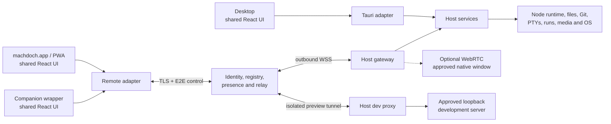

# Remote Access Product and Architecture Specification

Status: Proposed
Date: 2026-08-14

## Decision

Build remote Machdoch as a second transport for the existing product, not as a second product.

The desktop instance remains the authority for sessions, workspaces, credentials, files, tasks, terminals, development processes, media, and native desktop access. The existing React UI is used by the desktop, `machdoch.app`, and a companion client through two runtime adapters:

- a local Tauri adapter for the desktop WebView
- a remote adapter for authenticated RPC, events, and streams

Add a small hosted control plane and outbound relay. It is the best fit for a site that must list all instances and reach them through NAT, CGNAT, firewalls, and browser HTTPS restrictions. It should provide identity, instance registry, presence, rendezvous, relay, and isolated development-preview ingress. It must not execute Machdoch tasks or become authoritative for workspace data.

Direct LAN/VPN connections remain a useful later optimization, especially for a native companion, but are not a sufficient primary browser architecture. Extending the current reduced Mission Control UI would duplicate every feature; streaming the Machdoch desktop window would waste the existing browser-renderable UI; moving execution to a new cloud backend would be a rewrite.

“Full remote control” means parity for host-backed product capabilities through the shared UI. Desktop-shell behaviors such as tray management, moving local windows, or opening a host folder picker require a remote equivalent or remain local-only. There is no generic endpoint that can invoke every current or future Tauri command.

## Reusable Current Architecture

| Existing part | Reuse |
| --- | --- |
| React/Vite product surface | [`preview/app.tsx`](../src/tauri/ui/preview/app.tsx) already renders the real `ChatSession` and its chat, workspace, terminal, Workspace Run, Ralph, scheduler, media, marketplace, instruction, and settings surfaces. Reuse these components and view models; add responsive behavior rather than a remote UI fork. |
| UI runtime facade | [`runtime.ts`](../src/tauri/ui/runtime.ts) already centralizes many DTOs and operations, but calls Tauri directly and uses browser fixtures when Tauri is absent. Split it by capability behind injected local, remote, and preview/test adapters. Fixtures must never serve a production web build. |
| Rust/Tauri host | [`lib.rs`](../src-tauri/src/lib.rs) already owns task supervision, shell persistence, files, Git, PTYs, Workspace Run, media, settings, and OS integration. Keep these managers and extract shared service entry points only where handlers are tied to a WebView or Tauri event. |
| Durable shell state | [`shell_state.rs`](../src-tauri/src/shell_state.rs) provides atomic revisioned compare-and-swap storage, while the React shell has merge and tombstone logic. Reuse it, but move active session, panes, scroll position, and unsubmitted drafts to per-client state so one client cannot redirect another. |
| Workspace security and processes | Workspace tools already canonicalize roots, contain relative paths, prevent symlink escapes, bound reads/streams, use revision-aware atomic writes, and preserve explicit working directories on Windows and Linux. Remote calls must reach these same implementations through opaque workspace IDs. |
| Development runs | [Workspace Run](workspace-run.md) is the canonical process manager and already models declared ports, URLs, health, logs, restarts, and process trees. It is the source of truth for development-server exposure. |
| Current Mission Control | [`remote_control`](../src-tauri/src/remote_control.rs) is a useful prototype: Axum/Tokio lifecycle, bounded state, token hashing, SSE, and command idempotency tests are informative. Its plaintext LAN HTTP server, embedded HTML/JavaScript UI, reduced snapshots, and React command dispatcher are replaced at cutover. |
| Pairing and desktop control | Settings transfer already demonstrates mDNS, QR/manual rendezvous, Noise pairing, expiry, and human confirmation. `xcap` and `enigo` already provide screenshots and input actions. Reuse reviewed concepts and primitives, not their protocols unchanged. |

The required work is therefore a transport, authorization, and state-ownership refactor around existing capabilities, not a feature rewrite.

## Target Architecture

The control plane and relay are separate logical responsibilities but may be one deployable service initially.

### Responsibilities

| Component | Responsibilities |
| --- | --- |
| Local Machdoch instance | Create a stable instance identity; maintain an outbound relay connection; enforce device, scope, workspace, and object authorization; expose typed host services; aggregate activity; publish events; proxy approved local development endpoints; audit and revoke access; optionally capture/control an approved native window. It remains the only component with host paths, provider secrets, environment values, PTYs, or OS credentials. |
| Central service | Authenticate users; bind instances to accounts; store instance identity, display name, capabilities, online/last-seen state, and coarse redacted activity; issue short-lived routing credentials; relay opaque control frames and bounded streams; terminate isolated preview HTTPS if that privacy model is selected; rate-limit and operate the service. It does not interpret commands or persist task, file, terminal, or session content. |
| Web client | List instances, establish a selected host session, render the shared UI with the remote adapter, keep view state local, upload client-selected attachments, consume host events/streams, and open isolated preview origins. |
| Companion app | Start as the installable responsive PWA. If app stores, push, QR scanning, background reconnect, or stronger key storage justify native packaging, use a thin WebView shell around the same React source and remote adapter. Add only platform services such as secure key storage, notifications, deep links, and optional direct-LAN transport. |

### Shared runtime and host boundary

Define focused contracts for host/capabilities, sessions/tasks, workspaces/files/Git, terminals, Workspace Run/exposures, scheduler/Ralph/MCP, media/attachments/voice, and safe settings. Each contract supports request/response operations, subscriptions, typed errors, cancellation, and binary streams where needed.

- The Tauri adapter wraps current commands, events, and channels.
- The remote adapter maps the same contracts to the network protocol.
- The preview/test adapter owns all fixtures.
- Platform services separately cover dialogs, client file selection, clipboard, navigation, notifications, storage, and native window behavior.

Tauri commands and remote handlers call the same host service methods. A request context contains the instance, actor/device, scopes, client ID, request ID, protocol version, and idempotency key. Remote eligibility is explicit and default-deny; never expose a generic `invoke(command, payload)` bridge.

The host advertises an exact protocol version and capability manifest. Incompatible clients fail closed. Durable domain data and runtime processes remain host-authoritative; client selection and layout remain local. Mutations carry explicit object IDs and expected revisions. Streams use sequence numbers, acknowledgements, bounded buffering, and resumable cursors.

## Discovery, Presence, Connection, and Control

1. **Enroll an instance.** The local desktop signs in or consumes a short-lived account enrollment code. It registers an `instanceId`, display name, public identity key, version, and capabilities, then opens an outbound WSS connection on port 443.
2. **List instances.** `machdoch.app` reads the account registry. Relay socket state plus heartbeats produce `online`, `offline`, and `lastSeenAt`. The host publishes only a coarse activity enum such as `idle`, `working`, `attention`, or `error`, plus active-task and running-configuration counts. Detailed task/session state is fetched from the host after an encrypted connection.
3. **Authorize a client.** Account login controls discovery. First use of a browser profile or companion creates a device key and requires the selected policy: local host approval, QR/SAS pairing, or strong account step-up. The host stores the device public key and granted scopes; the central service stores only enough identity metadata to route it.
4. **Connect.** The central service issues a short-lived routing grant. Client and host authenticate each other, establish end-to-end control encryption through the relay, negotiate protocol/capabilities, and exchange snapshot/event cursors.
5. **Control.** The client loads host state, subscribes to events, and invokes the same operations as the desktop adapter. Requests include opaque targets, expected revisions, and idempotency keys. Reconnect resumes retained events and terminal/run output or requests a fresh snapshot after a retention gap.
6. **Revoke.** Revoking a device immediately rejects reconnect, closes active sessions and device-bound preview/native streams, and releases terminal/native writer leases. Host tasks continue unless the action explicitly created a disconnect-bound resource.

The initial product should support one owner using several devices, not collaborative multi-user editing. Terminals may have multiple viewers but one time-limited writer lease. Native control has one controller lease and always yields to local preemption.

## Security and Transport

- Use HTTPS/WSS for every public connection. Control frames should also be end-to-end encrypted between paired client and host with an audited browser-compatible protocol; the relay must not be able to forge or read them. Existing Noise work is a reference, not automatically the browser protocol.
- Enforce scopes such as session read/write, task run/cancel, workspace read/write, terminal control, run control, preview exposure, native view/control, and settings write at the host on every request. High-risk scopes may require step-up or local approval.
- Represent workspaces as host-issued `workspaceId` values with safe display names. Only the host maps them to canonical Windows/Linux roots. A remote client cannot register a root or select an arbitrary absolute path.
- Return configured-state metadata for secrets, never saved provider keys or environment values. Secret replacement is write-only and separately authorized.
- Keep control UI, each development exposure, and downloaded host content on separate origins and credentials. Preview content is untrusted even when it came from the user's workspace.
- Maintain a redacted local audit log for pairing, scope changes, mutations, exposures, native control, revocation, and failures. Do not log prompts, terminal bytes, file contents, or secrets by default.
- Remove the current plaintext Mission Control route when the new path reaches parity; do not retain it as a fallback internet path.

The browser application's distribution origin remains a trust boundary: compromised JavaScript can read data after client-side decryption. Harden it with a strict CSP, immutable versioned assets, minimal dependencies, short-lived sessions, and supply-chain controls; sign packaged companion releases.

## Development Servers and Native Applications

### Browser-accessible servers

Add a first-class `DevelopmentExposure` owned by the host:

`{ exposureId, workspaceId, runConfigurationId, runGeneration, loopbackTarget, allowedDevices, scopes, expiresAt }`

Create it only from a running Workspace Run configuration and one of its declared ports/URLs. A separately launched server requires explicit local approval. Pin the target to loopback; never accept a client-selected upstream, scan ports, or proxy arbitrary LAN addresses. Revoke the exposure on expiry, run restart/stop, host disconnect, or device revocation.

Serve each exposure from a dedicated origin such as `https://<id>.preview.machdoch.app`. The preview edge authenticates the user with an exposure-specific short-lived cookie, then tunnels HTTP to the host proxy. The proxy must support streaming bodies, SSE, WebSocket upgrades, HMR, redirects, cookies, compression, timeouts, quotas, and backpressure. Dedicated origins avoid the path, cookie, service-worker, and absolute-asset problems common with prefix proxies and isolate preview JavaScript from Machdoch credentials.

React/Vite and NestJS applications should work when browser URLs are relative or configured with the published origin. Hard-coded browser-side `localhost`, incompatible CORS, external callback URLs, local hardware, and unusual service-worker assumptions require project configuration; response rewriting cannot reliably repair them.

### Native desktop applications

| Target | Remote approach | Result |
| --- | --- | --- |
| Tauri project's frontend dev server | Use the HTTP exposure above. | Normal web interaction, but no Tauri IPC or native plugins unless the project intentionally provides a browser adapter. |
| Actual Tauri or other native window | Initially enumerate an explicitly approved window, capture on-demand images with the existing `xcap` foundation, and offer bounded focus/click/type/shortcut actions through a controller lease. | Useful for inspection and deliberate actions; not fluid remote desktop. |
| Fluid human control, if required | Build or integrate a targeted-window remote-desktop subsystem using OS capture APIs, hardware encoding where available, WebRTC media, a data channel for input, and TURN fallback. | Low-latency interaction, but a distinct high-cost subsystem. Existing PNG capture and the control relay are not suitable video transports. |

Native control must bind authorization to the process and current window generation, show a local indicator/kill switch, rate-limit input, and audit control sessions. Menus, popups, dialogs, audio, clipboard, multiple windows, GPU/protected surfaces, elevation boundaries, Windows lock/UAC screens, Linux Wayland permissions, and headless sessions all require explicit support and may remain unavailable.

For browser preview traffic, ordinary trusted HTTPS generally means the hosted edge can see transient HTTP content. End-to-end opaque previews require a native companion loopback proxy or a substantially more complex certificate/TLS pass-through design. This is a product and threat-model decision; control traffic should remain E2E either way.

## Limitations and Open Decisions

- The host must be running and reachable. A relay does not execute work when the machine is off, asleep, logged out, or missing the required graphical session.
- Workspace containment prevents cross-workspace routing mistakes but does not sandbox agents, terminals, or development commands from the host OS account.
- Browser/mobile terminals, editors, large diffs, background connectivity, IME, drag/drop, and shortcuts require responsive-device testing.
- Decide companion targets and whether PWA, app-store packaging, push, QR scanning, biometric unlock, or background operation are required.
- Decide account recovery, organization sharing, multi-user ownership, and which destructive, secret, terminal, exposure, and native-input actions require local approval.
- Decide hosted-only versus self-hosted control plane, regions/retention/SLA, and whether relay-terminated development previews are acceptable.
- Decide whether unattended/headless hosting is required. If access must survive logout or run as an OS service, separating a dedicated host daemon becomes a later project; it is not required for the initial architecture.
- Decide whether native-app success means browser surface, snapshots plus actions, or full low-latency streaming including clipboard/audio/multiple windows.

## Phased Delivery

1. **Transport seam, no product change.** Split Tauri imports into runtime/platform adapters, define versioned contracts and safe errors, move selection/drafts to per-client state, add opaque workspace handles, and introduce a host event bus/service facade. Prove the shared UI over a loopback remote adapter with the main desktop window hidden. Keep desktop behavior on the local adapter.
2. **Hosted vertical slice.** Add account login, instance enrollment, registry, heartbeat/presence, outbound WSS relay, device pairing/revocation, and E2E control. Ship `machdoch.app` as the first companion/PWA with instance list, session history, task submission/progress, follow-up/steer, and cancel. Do not build direct LAN, native packaging, or development proxying yet.
3. **Remote capability parity.** Add every remaining remotely meaningful capability through the same contracts, including files/Git, attachments, resumable terminals, Workspace Run, scheduler/Ralph/MCP, instructions/marketplace, media/voice streams, and safe settings. Add revisions, idempotency, stream limits, terminal writer leases, and two-client tests. Delete the embedded Mission Control UI, snapshot publisher, and React command queue at parity.
4. **Development previews.** Add generation-bound exposure grants and isolated HTTP/SSE/WebSocket proxying. Verify Vite HMR, a NestJS REST/SSE/WebSocket service, revocation, restart binding, origin isolation, and SSRF resistance before enabling arbitrary projects.
5. **Companion packaging and native windows.** Package the shared PWA only if native capabilities justify it. Ship approved-window snapshots and bounded actions first. Prototype WebRTC window streaming only after latency, platform, privacy, and product requirements show that it is necessary.

This sequence establishes the reusable boundary before infrastructure, delivers the instance dashboard and useful remote control early, and defers the two largest optional costs—native packaging and remote desktop—until their product value is proven.
